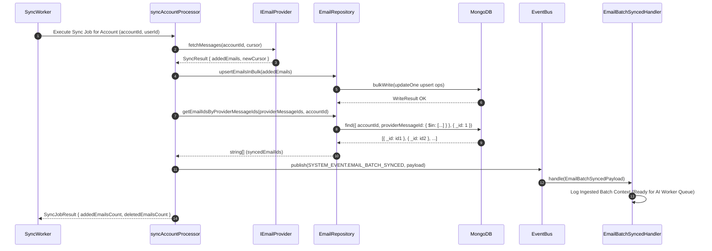

# Platform Resilience & Codebase Enhancements - Phase 1 Implementation Details

> **Feature:** `codebase-enhancements-and-performance` · **Phase:** 1 (`ARCH-NEXT-02`)
> **Status:** COMPLETED
> **Created:** 2026-09-26 · **Last Updated:** 2026-09-26

---

## 1. Goal Description & Scope

Phase 1 establishes the event pipeline readiness for the upcoming AI module (Phase 4: `ai-foundation-core-ai`).

During email synchronization, the background sync worker ingested batches of messages into MongoDB and emitted individual `EMAIL_CREATED` events and a final `SYNC_COMPLETED` event. However, it lacked a batch-level domain event (`EMAIL_BATCH_SYNCED`) carrying the discrete list of newly ingested MongoDB `_id` strings.

This phase connects the recently published `@mailsense/types@1.5.0` contract (`SYSTEM_EVENT.EMAIL_BATCH_SYNCED` and `EmailBatchSyncedPayload`) to the backend sync engine:

1. Enhances [email.repository.ts](file:///Users/vishaljagamani/Projects/Projects/mailsense/Backend/src/modules/emails/email.repository.ts) with tenant-isolated database ID resolution for ingested batches.
2. Updates [sync-account.processor.ts](file:///Users/vishaljagamani/Projects/Projects/mailsense/Backend/src/workers/processors/sync-account.processor.ts) to resolve database `_id` strings of upserted emails and dispatch `SYSTEM_EVENT.EMAIL_BATCH_SYNCED` onto the `eventBus`.
3. Creates a dedicated event subscriber [email-batch-synced.handler.ts](file:///Users/vishaljagamani/Projects/Projects/mailsense/Backend/src/core/events/handlers/email-batch-synced.handler.ts) with structured logging, serving as the foundational plug-in point for downstream AI categorization, summarization, and priority scoring queues.
4. Registers the new event handler in the central system events lifecycle ([core/events/index.ts](file:///Users/vishaljagamani/Projects/Projects/mailsense/Backend/src/core/events/index.ts)).

---

## 2. User Review Required & Architectural Notes

> [!IMPORTANT]
> **Tenant Boundary & ID Isolation**: The `EMAIL_BATCH_SYNCED` payload contains MongoDB `_id` strings (`string[]`), the authenticated tenant `userId`, and the `accountId`. Downstream AI processors MUST only receive verified IDs belonging to the specific tenant account.
>
> **Batching vs. Single-Email Ingestion**: While `EMAIL_CREATED` is emitted per message for real-time websocket alerts, LLM operations (such as Gemini categorization and summarization) are cost and rate-limit sensitive. Emitting `EMAIL_BATCH_SYNCED` allows the AI worker to process up to 50 emails in a single vectorized or bulk prompt call, reducing API calls by over 90%.

---

## 3. Component Overview & File Map

| Component        | Target File                                                            | Action     | Purpose                                                                              |
| ---------------- | ---------------------------------------------------------------------- | ---------- | ------------------------------------------------------------------------------------ |
| Types            | `@mailsense/types`                                                     | [VERIFIED] | Published in `v1.5.0` (`SYSTEM_EVENT.EMAIL_BATCH_SYNCED`, `EmailBatchSyncedPayload`) |
| Observability    | `Backend/src/core/constants/observability.constants.ts`                | [MODIFY]   | Add `EMAIL_BATCH_SYNCED_HANDLER` to `LOGGER_MODULE` enum                             |
| Repository       | `Backend/src/modules/emails/email.repository.ts`                       | [MODIFY]   | Add `getEmailIdsByProviderMessageIds()` with account scoping                         |
| Event Handler    | `Backend/src/core/events/handlers/email-batch-synced.handler.ts`       | [NEW]      | Create typed event subscriber for `EMAIL_BATCH_SYNCED`                               |
| Event Bus        | `Backend/src/core/events/index.ts`                                     | [MODIFY]   | Register `registerEmailBatchSyncedHandler()` on server startup                       |
| Worker Processor | `Backend/src/workers/processors/sync-account.processor.ts`             | [MODIFY]   | Resolve ingested IDs and emit `EMAIL_BATCH_SYNCED` event                             |
| Unit Test        | `Backend/src/core/events/__tests__/email-batch-synced.handler.test.ts` | [NEW]      | Automated test verifying subscriber payload ingestion                                |

---

## 4. Main Section 1: Backend Layer Implementation

### 4.1 Observability Constants (`Backend/src/core/constants/observability.constants.ts`)

Add the logger module identifier for the new event subscriber.

```typescript
// Add EMAIL_BATCH_SYNCED_HANDLER to LOGGER_MODULE enum:
export enum LOGGER_MODULE {
  APP = "App",
  SERVER = "Server",
  DATABASE = "Database",
  HTTP = "HTTP",
  HEALTH_SERVICE = "HealthService",
  HEALTH_CONTROLLER = "HealthController",
  REDIS_CONNECTION = "RedisConnection",
  QUEUE_SERVICE = "QueueService",
  SCHEDULER_SERVICE = "SchedulerService",
  QUEUE_REGISTRY = "QueueRegistry",
  EVENT_BUS = "EventBus",
  EMAIL_CREATED_HANDLER = "EmailCreatedHandler",
  SYNC_COMPLETED_HANDLER = "SyncCompletedHandler",
  EMAIL_BATCH_SYNCED_HANDLER = "EmailBatchSyncedHandler", // Added for Phase 1
  MONITORING_MANAGER = "MonitoringManager",
  SENTRY_PROVIDER = "SentryProvider",
  NOOP_MONITORING_PROVIDER = "NoopMonitoringProvider",
  GMAIL_CLIENT = "GmailClient",
  GMAIL_SERVICE = "GmailService",
  OUTLOOK_CLIENT = "OutlookClient",
  OUTLOOK_SERVICE = "OutlookService",
  AUTH0_CLIENT = "Auth0Client",
  AUTH0_SERVICE = "Auth0Service",
  OBJECT_STORAGE_SERVICE = "ObjectStorageService",
  ACCOUNT_SERVICE = "AccountService",
  EMAIL_SERVICE = "EmailService",
  ATTACHMENT_SERVICE = "AttachmentService",
  FOLDER_SERVICE = "FolderService",
  DRAFT_SERVICE = "DraftService",
  USER_SERVICE = "UserService",
  ANALYTICS_SERVICE = "AnalyticsService",
  ANALYTICS_UTILS = "AnalyticsUtils",
  BASE_WORKER = "BaseWorker",
  SYNC_WORKER = "SyncWorker",
}
```

---

### 4.2 Repository Layer (`Backend/src/modules/emails/email.repository.ts`)

Add a dedicated helper to retrieve MongoDB `_id` strings for an array of `providerMessageId` values, strictly scoped by `accountId` for tenant isolation.

```typescript
    /**
     * Retrieves database _id strings for a list of providerMessageId values within an account.
     * Used by sync workers to construct strongly-typed batch sync event payloads.
     */
    public static async getEmailIdsByProviderMessageIds(providerMessageIds: string[], accountId: string): Promise<string[]> {
        const docs = await Email.find({ accountId, providerMessageId: { $in: providerMessageIds } }, { _id: 1 }).lean();
        return docs.map((doc) => String(doc._id)) || [];
    }
```

---

### 4.3 Event Handler Layer (`Backend/src/core/events/handlers/email-batch-synced.handler.ts`)

Create the event subscriber that ingests `SYSTEM_EVENT.EMAIL_BATCH_SYNCED`.

```typescript
import { LOGGER_MODULE } from "@constants";
import { EmailBatchSyncedPayload, SYSTEM_EVENT } from "@mailsense/types";
import { createLogger } from "@observability";
import { eventBus } from "../event-bus.js";

const logger = createLogger(LOGGER_MODULE.EMAIL_BATCH_SYNCED_HANDLER);

/**
 * Subscribes to EMAIL_BATCH_SYNCED system events emitted after successful email ingestion.
 * Acts as the entrypoint for downstream AI pipelines (categorization, summarization, priority scoring).
 */
export function registerEmailBatchSyncedHandler(): void {
  try {
    eventBus.subscribe(
      SYSTEM_EVENT.EMAIL_BATCH_SYNCED,
      async (payload: EmailBatchSyncedPayload) => {
        try {
          logger.info(
            `[EmailBatchSyncedHandler] Ingested email batch for account: ${payload.accountId}`,
            {
              accountId: payload.accountId,
              userId: payload.userId,
              batchSize: payload.batchSize,
              emailIdsCount: payload.emailIds.length,
              timestamp: payload.timestamp,
            },
          );

          // NOTE: Phase 4 (AI Foundation) will enqueue this batch into the BullMQ AI queue:
          // await QueueService.addAIBatchJob({
          //     accountId: payload.accountId,
          //     userId: payload.userId,
          //     emailIds: payload.emailIds,
          // });
        } catch (err) {
          const errorMessage = err instanceof Error ? err.message : String(err);
          logger.error(
            "[EmailBatchSyncedHandler] Failed to process email batch sync event",
            {
              accountId: payload.accountId,
              userId: payload.userId,
              error: errorMessage,
            },
          );
        }
      },
    );
    logger.info("Registered EMAIL_BATCH_SYNCED subscriber successfully");
  } catch (error) {
    const errorMessage = error instanceof Error ? error.message : String(error);
    logger.error(
      `Failed to register EMAIL_BATCH_SYNCED subscriber: ${errorMessage}`,
      { error },
    );
    throw error;
  }
}
```

---

### 4.4 Event Registry Initialization (`Backend/src/core/events/index.ts`)

Register the subscriber during application startup.

```typescript
import { logger } from "@utils";
import { registerEmailBatchSyncedHandler } from "./handlers/email-batch-synced.handler.js";
import { registerEmailCreatedHandler } from "./handlers/email-created.handler.js";
import { registerSyncCompletedHandler } from "./handlers/sync-completed.handler.js";

export function initSystemEvents(): void {
  try {
    logger.info("🔔 Registering background system event handlers...");
    registerSyncCompletedHandler();
    registerEmailCreatedHandler();
    registerEmailBatchSyncedHandler();
    logger.info("🔔 System event handlers registered successfully");
  } catch (error) {
    const errorMessage = error instanceof Error ? error.message : String(error);
    logger.error(
      `Failed to initialize system event handlers: ${errorMessage}`,
      { error },
    );
    throw error;
  }
}

export * from "./event-bus.js";
```

---

### 4.5 Worker Processor Layer (`Backend/src/workers/processors/sync-account.processor.ts`)

Emit `SYSTEM_EVENT.EMAIL_BATCH_SYNCED` in both incremental sync and full sync workflows when new or updated messages are upserted into MongoDB.

```typescript
// Inside incremental sync block:
if (addedEmails && addedEmails.length > 0) {
  logger.info(
    `Upserting ${addedEmails.length} new/updated emails for account: ${accountId}`,
  );
  await EmailRepository.upsertEmailsInBulk(addedEmails);
  addedEmailsCount = addedEmails.length;

  // Emit EMAIL_CREATED for individual real-time listeners
  for (const email of addedEmails) {
    eventBus.publish(SYSTEM_EVENT.EMAIL_CREATED, {
      accountId,
      email,
    });
  }

  // Extract provider message IDs and resolve MongoDB _id strings
  const providerMessageIds = addedEmails
    .map((email) => email.providerMessageId)
    .filter((id): id is string => Boolean(id));

  if (providerMessageIds.length > 0) {
    const syncedEmailIds =
      await EmailRepository.getEmailIdsByProviderMessageIds(
        providerMessageIds,
        accountId,
      );

    if (syncedEmailIds.length > 0) {
      eventBus.publish(SYSTEM_EVENT.EMAIL_BATCH_SYNCED, {
        accountId,
        userId,
        emailIds: syncedEmailIds,
        batchSize: syncedEmailIds.length,
        timestamp: Date.now(),
      });
      logger.info(
        `Published EMAIL_BATCH_SYNCED event for ${syncedEmailIds.length} emails`,
      );
    }
  }
}

// Inside full sync block:
if (addedEmails && addedEmails.length > 0) {
  logger.info(
    `Upserting ${addedEmails.length} emails after full sync for account: ${accountId}`,
  );
  await EmailRepository.upsertEmailsInBulk(addedEmails);
  addedEmailsCount = addedEmails.length;

  for (const email of addedEmails) {
    eventBus.publish(SYSTEM_EVENT.EMAIL_CREATED, {
      accountId,
      email,
    });
  }

  const providerMessageIds = addedEmails
    .map((email) => email.providerMessageId)
    .filter((id): id is string => Boolean(id));

  if (providerMessageIds.length > 0) {
    const syncedEmailIds =
      await EmailRepository.getEmailIdsByProviderMessageIds(
        providerMessageIds,
        accountId,
      );

    if (syncedEmailIds.length > 0) {
      eventBus.publish(SYSTEM_EVENT.EMAIL_BATCH_SYNCED, {
        accountId,
        userId,
        emailIds: syncedEmailIds,
        batchSize: syncedEmailIds.length,
        timestamp: Date.now(),
      });
      logger.info(
        `Published EMAIL_BATCH_SYNCED event for full sync: ${syncedEmailIds.length} emails`,
      );
    }
  }
}
```

---

## 5. Main Section 2: Frontend Layer Implementation

_N/A — Phase 1 establishes the backend event contract and BullMQ sync worker dispatch pipeline. Frontend UI integration for AI categorization, summary tooltips, and priority inbox views is scheduled in Phase 4 (`ai-foundation-core-ai`)._

---

## 6. Low-Level Design & Sequence Flow



---

## 7. Step-by-Step Task Checklist

- [x] **Task 1: Add Logger Module Constant**
  - [x] Add `EMAIL_BATCH_SYNCED_HANDLER = 'EmailBatchSyncedHandler'` to `LOGGER_MODULE` in `Backend/src/core/constants/observability.constants.ts`.
- [x] **Task 2: Implement Repository ID Resolution**
  - [x] Add `getEmailIdsByProviderMessageIds()` with try/catch and tenant isolation in `Backend/src/modules/emails/email.repository.ts`.
- [x] **Task 3: Create Batch Sync Event Handler**
  - [x] Implement `Backend/src/core/events/handlers/email-batch-synced.handler.ts` subscribing to `SYSTEM_EVENT.EMAIL_BATCH_SYNCED`.
- [x] **Task 4: Register Event Handler on Server Startup**
  - [x] Update `Backend/src/core/events/index.ts` to call `registerEmailBatchSyncedHandler()`.
- [x] **Task 5: Update Worker Sync Processor**
  - [x] Update `syncAccountProcessor` in `Backend/src/workers/processors/sync-account.processor.ts` to resolve MongoDB `_id` strings and publish the batch event for both incremental and full sync paths.
- [x] **Task 6: Unit Testing & Verification**
  - [x] Create `Backend/src/core/events/__tests__/email-batch-synced.handler.test.ts` to test event publishing and subscription handling.
  - [x] Run `cd Backend && pnpm build` to verify type safety and compilation.

---

## 8. Verification & Build Commands

```bash
# 1. Run Backend TypeScript Compilation & Bundling
cd /Users/vishaljagamani/Projects/Projects/mailsense/Backend
pnpm build

# 2. Run Backend Unit Test Suite
pnpm test src/core/events/__tests__/email-batch-synced.handler.test.ts

# 3. Verify Frontend Downstream Type Compatibility
cd /Users/vishaljagamani/Projects/Projects/mailsense/Frontend
npx tsc --noEmit
```
