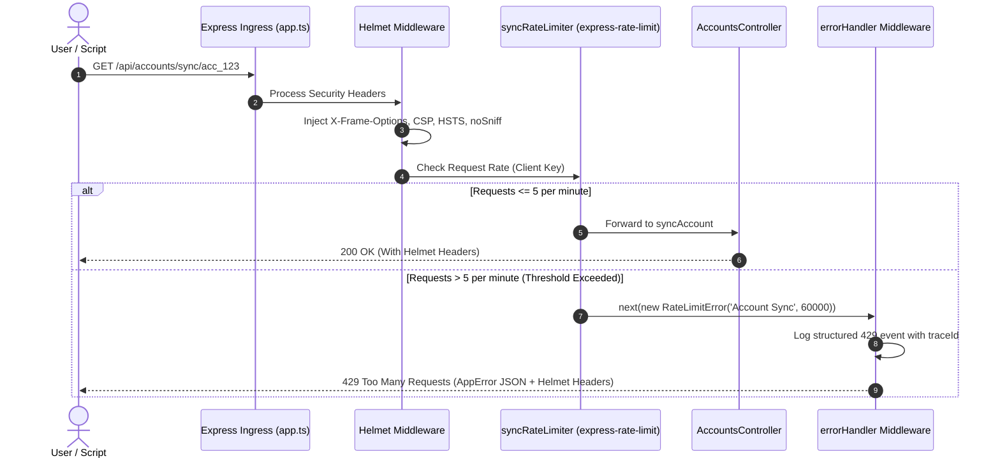

# Platform Resilience & Codebase Enhancements - Phase 2 Implementation Details

> **Feature:** `codebase-enhancements-and-performance` · **Phase:** 2 (`SEC-NEXT-01`, `SEC-NEXT-02`)
> **Status:** COMPLETED
> **Created:** 2026-09-26 · **Last Updated:** 2026-09-26

---

## 1. Goal Description & Scope

Phase 2 hardens the backend API ingress layer against abuse, quota exhaustion, and browser-side attack vectors:

1. **Ingress Rate Limiting (`SEC-NEXT-01`):** Introduces `express-rate-limit` with fine-grained bucket policies tailored to route sensitivity:
   - **Manual Account Sync:** 5 requests per minute per user/IP (`/api/accounts/sync/:accountId`, `/api/accounts/sync-all`) to protect upstream Google/Microsoft quota limits.
   - **Transactional Email Dispatch:** 20 requests per minute per user/IP (`/api/emails/compose`) to prevent runaway send loops and email spam abuse.
   - **Authentication Routes:** 10 requests per minute per IP (`/api/accounts/connect/:provider`, auth callbacks) to mitigate brute-force attacks.
   - **General API Ingress:** 300 requests per 15 minutes per IP across all `/api/*` endpoints.
   - Rejections return HTTP 429 with standard `RateLimitError` payload formatting routed through the centralized `errorHandler` middleware.
2. **HTTP Security Headers & CSP (`SEC-NEXT-02`):** Mounts `helmet` middleware in [app.ts](file:///Users/vishaljagamani/Projects/Projects/mailsense/Backend/src/app.ts) configuring:
   - `Content-Security-Policy` with restrictive script, object, and frame-ancestor rules.
   - `X-Frame-Options: DENY` (anti-clickjacking).
   - `X-Content-Type-Options: nosniff` (anti-MIME sniffing).
   - `Strict-Transport-Security: max-age=31536000; includeSubDomains`.
   - `Referrer-Policy: strict-origin-when-cross-origin`.
3. **Frontend 429 Handling:** Enhances frontend API error extraction to recognize HTTP 429 rate limit responses and present informative countdown toasts rather than generic error popups.

---

## 2. User Review Required & Architectural Notes

> [!IMPORTANT]
> **Key Identification Strategy**: Rate limiters use the authenticated `req.user?.id` when present, falling back to client IP (`req.ip`). This guarantees that multi-user households or corporate VPNs sharing an IP do not starve individual authenticated users.
> 
> **Content Security Policy (CSP) Directives**: The backend API operates predominantly as a JSON API, but serves health probes and static files. Helmet is configured with strict API defaults: `defaultSrc: ["'none'"]`, `frameAncestors: ["'none'"]`, while allowing CORS origin pre-flights from the Next.js frontend (`http://localhost:3000` / production domain).

---

## 3. Component Overview & File Map

| Component | Target File | Action | Purpose |
|---|---|---|---|
| Dependencies | `Backend/package.json` | [MODIFY] | Add `helmet` (`^8.0.0`) and `express-rate-limit` (`^7.5.0`) |
| Security | `Backend/src/core/security/rate-limit.config.ts` | [NEW] | Define rate limit buckets and `RateLimitError` response handlers |
| Security | `Backend/src/core/security/helmet.config.ts` | [NEW] | Configure Helmet security headers and CSP directives |
| Ingress | `Backend/src/app.ts` | [MODIFY] | Mount `helmet()` and global API rate limiter in middleware pipeline |
| Routes | `Backend/src/modules/accounts/account.routes.ts` | [MODIFY] | Apply `syncRateLimiter` to manual sync endpoints |
| Routes | `Backend/src/modules/emails/email.routes.ts` | [MODIFY] | Apply `composeRateLimiter` to `/compose` endpoint |
| Unit Test | `Backend/src/core/security/__tests__/rate-limit.test.ts` | [NEW] | Test rate limit enforcement and HTTP 429 payload responses |
| Unit Test | `Backend/src/core/security/__tests__/helmet.test.ts` | [NEW] | Test security header presence on HTTP exchanges |
| Frontend | `Frontend/src/shared/api/errors.ts` | [MODIFY] | Format HTTP 429 rate limit responses with actionable retry suggestions |

---

## 4. Main Section 1: Backend Layer Implementation

### 4.1 Dependency Installation (`Backend/package.json`)

Add `helmet` and `express-rate-limit` to dependencies.

```json
{
    "dependencies": {
        "express-rate-limit": "^7.5.0",
        "helmet": "^8.0.0"
    }
}
```

---

### 4.2 Security Configuration Modules

#### 1. Rate Limiting Configuration (`Backend/src/core/security/rate-limit.config.ts`)

```typescript
import { RateLimitError } from '@errors';
import { NextFunction, Request, Response } from 'express';
import { rateLimit, RateLimitRequestHandler } from 'express-rate-limit';

/**
 * Extracts unique client key: authenticated user ID or fallback IP address.
 */
function resolveClientKey(req: Request): string {
    try {
        const userId = req.user?.id;
        if (userId) {
            return `user:${userId}`;
        }
        return `ip:${req.ip || req.socket.remoteAddress || 'unknown'}`;
    } catch {
        return 'ip:unknown';
    }
}

/**
 * Custom 429 handler delegating directly into AppError / errorHandler middleware.
 */
function createRateLimitHandler(bucketName: string, retryAfterSeconds: number) {
    return (_req: Request, _res: Response, next: NextFunction): void => {
        try {
            const error = new RateLimitError(bucketName, retryAfterSeconds * 1000);
            next(error);
        } catch (err) {
            next(err);
        }
    };
}

/**
 * General API Limiter: 300 requests per 15 minutes per client
 */
export const defaultApiRateLimiter: RateLimitRequestHandler = rateLimit({
    windowMs: 15 * 60 * 1000,
    limit: 300,
    standardHeaders: 'draft-7',
    legacyHeaders: false,
    keyGenerator: resolveClientKey,
    handler: createRateLimitHandler('API', 900),
});

/**
 * Manual Account Sync Limiter: 5 sync requests per 1 minute per client
 */
export const syncRateLimiter: RateLimitRequestHandler = rateLimit({
    windowMs: 60 * 1000,
    limit: 5,
    standardHeaders: 'draft-7',
    legacyHeaders: false,
    keyGenerator: resolveClientKey,
    handler: createRateLimitHandler('Account Sync', 60),
});

/**
 * Transactional Compose Limiter: 20 compose requests per 1 minute per client
 */
export const composeRateLimiter: RateLimitRequestHandler = rateLimit({
    windowMs: 60 * 1000,
    limit: 20,
    standardHeaders: 'draft-7',
    legacyHeaders: false,
    keyGenerator: resolveClientKey,
    handler: createRateLimitHandler('Email Compose', 60),
});

/**
 * Authentication / Connect Limiter: 10 requests per 1 minute per client
 */
export const authRateLimiter: RateLimitRequestHandler = rateLimit({
    windowMs: 60 * 1000,
    limit: 10,
    standardHeaders: 'draft-7',
    legacyHeaders: false,
    keyGenerator: resolveClientKey,
    handler: createRateLimitHandler('Authentication', 60),
});
```

---

#### 2. Helmet Security Configuration (`Backend/src/core/security/helmet.config.ts`)

```typescript
import helmet from 'helmet';
import { RequestHandler } from 'express';

/**
 * Standardized Helmet security headers and Content Security Policy configuration.
 */
export function createHelmetMiddleware(): RequestHandler {
    try {
        return helmet({
            contentSecurityPolicy: {
                directives: {
                    defaultSrc: ["'self'"],
                    scriptSrc: ["'self'"],
                    styleSrc: ["'self'", "'unsafe-inline'"],
                    imgSrc: ["'self'", 'data:', 'https:'],
                    connectSrc: ["'self'", 'https:'],
                    fontSrc: ["'self'", 'https:', 'data:'],
                    objectSrc: ["'none'"],
                    mediaSrc: ["'self'"],
                    frameAncestors: ["'none'"],
                    upgradeInsecureRequests: [],
                },
            },
            crossOriginEmbedderPolicy: false, // Allow cross-origin asset embed
            crossOriginResourcePolicy: { policy: 'cross-origin' },
            frameguard: { action: 'deny' },
            hsts: {
                maxAge: 31536000,
                includeSubDomains: true,
                preload: true,
            },
            noSniff: true,
            referrerPolicy: { policy: 'strict-origin-when-cross-origin' },
        });
    } catch (error) {
        throw error;
    }
}
```

---

### 4.3 App Ingress Middleware Integration (`Backend/src/app.ts`)

Mount Helmet and default rate limiter in the Express middleware setup sequence.

```typescript
import { MAILSENSE_BASE_URL } from '@config';
import { healthRoutes } from '@health';
import { errorHandler } from '@middlewares';
import cors from 'cors';
import express, { Application, Request, Response } from 'express';
import path from 'path';
import indexRoutes from 'routes.js';
import { requestLoggerMiddleware, traceMiddleware } from './core/observability/index.js';
import { createHelmetMiddleware } from './core/security/helmet.config.js';
import { defaultApiRateLimiter } from './core/security/rate-limit.config.js';

export class App {
    public expressApp: Application;
    private __dirname: string;

    constructor() {
        this.expressApp = express();
        this.__dirname = process.cwd();

        this.setupMiddleware();
        this.setupRoutes();
        this.setupNotFoundHandler();
        this.setupErrorHandler();
    }

    private setupMiddleware(): void {
        try {
            // 1. Mount distributed tracing middleware first
            this.expressApp.use(traceMiddleware);

            // 2. Mount Helmet HTTP security headers
            this.expressApp.use(createHelmetMiddleware());

            // 3. Mount request logger middleware
            this.expressApp.use(requestLoggerMiddleware);

            // 4. Enable cors for verified origins
            this.expressApp.use(cors({ origin: ['http://localhost:3000', MAILSENSE_BASE_URL], credentials: true }));

            // 5. Parse JSON and URL encoded request bodies
            this.expressApp.use(express.json());
            this.expressApp.use(express.urlencoded({ extended: true }));

            // 6. Serve static files
            this.expressApp.use(express.static(path.join(this.__dirname, '/')));
        } catch (error) {
            throw error;
        }
    }

    private setupRoutes(): void {
        try {
            // Mount health probes at root and /api (exempt from rate limits)
            this.expressApp.use(healthRoutes);
            this.expressApp.use('/api', healthRoutes);

            this.expressApp.get('/testEndpoint', (_req: Request, res: Response) => {
                res.send('MailSense Backend Test Endpoint');
            });

            // Apply default API rate limiter across all business routes
            this.expressApp.use('/api', defaultApiRateLimiter, indexRoutes);
        } catch (error) {
            throw error;
        }
    }

    // setupNotFoundHandler and setupErrorHandler remain unchanged
```

---

### 4.4 Route Rate Limiter Integration

#### 1. Account Routes (`Backend/src/modules/accounts/account.routes.ts`)

Attach `syncRateLimiter` to manual sync triggers and `authRateLimiter` to connect endpoints.

```typescript
import { Router } from 'express';
import { authMiddleware, validate } from '@middlewares';
import { handleRequest } from 'shared/utils/index.js';
import { AccountsController } from './account.controller.js';
import {
    connectAccountSchema,
    deleteAccountSchema,
    enableAccountSchema,
    getAccountDetailsSchema,
    updateAccountSettingsSchema,
} from './account.schema.js';
import { authRateLimiter, syncRateLimiter } from '../../core/security/rate-limit.config.js';

const router = Router();
const accountsController = new AccountsController();

router.get('/callback/:provider', validate({ params: connectAccountSchema }), handleRequest(accountsController.callback));

router.use(authMiddleware);

// Apply syncRateLimiter to protect upstream provider sync quotas
router.get('/sync-all', syncRateLimiter, handleRequest(accountsController.syncAccounts));
router.get('/sync/:accountId', syncRateLimiter, handleRequest(accountsController.syncAccount));

router.get('/:accountId', validate({ params: getAccountDetailsSchema }), handleRequest(accountsController.getAccountDetails));
router.delete('/:accountId', validate({ params: deleteAccountSchema }), handleRequest(accountsController.deleteAccount));
router.get('/list/all', handleRequest(accountsController.getAccounts));
router.get('/providers/list', handleRequest(accountsController.getAccountProviders));

// Apply authRateLimiter to connect endpoints
router.get('/connect/:provider', authRateLimiter, validate({ params: connectAccountSchema }), handleRequest(accountsController.connect));

router.patch(
    '/enable/:accountId',
    validate({ params: getAccountDetailsSchema, body: enableAccountSchema }),
    handleRequest(accountsController.enableAccount),
);

router.patch(
    '/settings/:accountId',
    validate({ params: getAccountDetailsSchema, body: updateAccountSettingsSchema }),
    handleRequest(accountsController.updateAccountSettings),
);

export default router;
```

---

#### 2. Email Routes (`Backend/src/modules/emails/email.routes.ts`)

Attach `composeRateLimiter` to the `/compose` endpoint.

```typescript
// Inside email.routes.ts:
import { composeRateLimiter } from '../../core/security/rate-limit.config.js';

// Apply composeRateLimiter to protect against runaway send loops
router.post(
    '/compose',
    composeRateLimiter,
    validate({ body: composeEmailSchema }),
    handleRequest(emailController.composeEmail),
);
```

---

### 4.5 Unit Testing Suites

#### 1. Rate Limiter Tests (`Backend/src/core/security/__tests__/rate-limit.test.ts`)

```typescript
import express, { Request, Response } from 'express';
import request from 'supertest';
import { errorHandler } from '../../../middlewares/error.handler.js';
import { syncRateLimiter } from '../rate-limit.config.js';

describe('Rate Limiter Middleware', () => {
    let app: express.Application;

    beforeEach(() => {
        app = express();
        app.use(express.json());

        // Test route with syncRateLimiter (limit: 5 requests)
        app.get('/test-sync', syncRateLimiter, (_req: Request, res: Response) => {
            res.status(200).json({ status: true, message: 'Sync triggered' });
        });

        app.use(errorHandler);
    });

    it('should allow requests within the rate limit threshold', async () => {
        for (let i = 0; i < 5; i++) {
            const res = await request(app).get('/test-sync');
            expect(res.status).toBe(200);
            expect(res.body.status).toBe(true);
        }
    });

    it('should reject requests exceeding threshold with HTTP 429 and standard AppError shape', async () => {
        for (let i = 0; i < 5; i++) {
            await request(app).get('/test-sync');
        }

        const blockedRes = await request(app).get('/test-sync');
        expect(blockedRes.status).toBe(429);
        expect(blockedRes.body.status).toBe(false);
        expect(blockedRes.body.error).toBeDefined();
        expect(blockedRes.body.error.code).toBe(429);
        expect(blockedRes.body.error.errorCode).toBe('PROVIDER_RATE_LIMITED');
        expect(blockedRes.body.error.description).toContain('maximum allowed API request quota');
    });
});
```

---

#### 2. Helmet Security Headers Test (`Backend/src/core/security/__tests__/helmet.test.ts`)

```typescript
import express, { Request, Response } from 'express';
import request from 'supertest';
import { createHelmetMiddleware } from '../helmet.config.js';

describe('Helmet Security Headers Middleware', () => {
    let app: express.Application;

    beforeEach(() => {
        app = express();
        app.use(createHelmetMiddleware());
        app.get('/test-headers', (_req: Request, res: Response) => {
            res.status(200).send('OK');
        });
    });

    it('should enforce security headers on all responses', async () => {
        const res = await request(app).get('/test-headers');

        expect(res.status).toBe(200);
        expect(res.headers['x-frame-options']).toBe('DENY');
        expect(res.headers['x-content-type-options']).toBe('nosniff');
        expect(res.headers['strict-transport-security']).toContain('max-age=31536000');
        expect(res.headers['content-security-policy']).toBeDefined();
        expect(res.headers['content-security-policy']).toContain("default-src 'self'");
    });
});
```

---

## 5. Main Section 2: Frontend Layer Implementation

### 5.1 API Error Extraction Enhancement (`Frontend/src/shared/api/errors.ts`)

Ensure that HTTP 429 status codes produce actionable, user-friendly messages for toasts.

```typescript
// Inside extractApiError function in Frontend/src/shared/api/errors.ts:
if (status === 429) {
    return {
        message: payload?.message || 'Rate limit reached. Please wait a moment before trying again.',
        code: 429,
        errorCode: payload?.error?.errorCode || 'RATE_LIMITED',
        description: payload?.error?.description || 'Too many requests were sent in a short period.',
        suggestedAction: payload?.error?.suggestedAction || 'Please pause for 60 seconds before retrying.',
        traceId: payload?.error?.traceId || '',
    };
}
```

---

## 6. Low-Level Design & Sequence Flow



---

## 7. Step-by-Step Task Checklist

- [x] **Task 1: Install Dependencies**
  - [x] Run `pnpm add helmet express-rate-limit` in `Backend/`.
  - [x] Run `pnpm add -D @types/express-rate-limit` if needed (or verify built-in types).
- [x] **Task 2: Implement Rate Limiting Configuration**
  - [x] Create `Backend/src/core/security/rate-limit.config.ts` with `defaultApiRateLimiter`, `syncRateLimiter`, `composeRateLimiter`, and `authRateLimiter`.
  - [x] Connect custom rate limiter handler to instantiate `RateLimitError` and invoke `next(error)`.
- [x] **Task 3: Implement Helmet Security Configuration**
  - [x] Create `Backend/src/core/security/helmet.config.ts` with strict CSP, frame-guard (`DENY`), and HSTS.
- [x] **Task 4: Wire Ingress in Application Startup**
  - [x] Update `setupMiddleware()` in `Backend/src/app.ts` to mount Helmet.
  - [x] Update `setupRoutes()` in `Backend/src/app.ts` to apply `defaultApiRateLimiter` on `/api`.
- [x] **Task 5: Attach Route-Specific Limiters**
  - [x] Mount `syncRateLimiter` on `/sync/:accountId` and `/sync-all` in `account.routes.ts`.
  - [x] Mount `composeRateLimiter` on `/compose` in `email.routes.ts`.
  - [x] Mount `authRateLimiter` on `/connect/:provider` in `account.routes.ts`.
- [x] **Task 6: Frontend 429 Handling**
  - [x] Verify `Frontend/src/shared/api/errors.ts` formats HTTP 429 responses with clear retry guidance.
- [x] **Task 7: Automated Unit Tests**
  - [x] Create `Backend/src/core/security/__tests__/rate-limit.test.ts`.
  - [x] Create `Backend/src/core/security/__tests__/helmet.test.ts`.
  - [x] Run `pnpm test` and `pnpm build` in `Backend/`.

---

## 8. Verification & Build Commands

```bash
# 1. Backend Build & Type Verification
cd /Users/vishaljagamani/Projects/Projects/mailsense/Backend
pnpm build

# 2. Run Rate Limiter & Helmet Unit Tests
pnpm test src/core/security/__tests__/rate-limit.test.ts
pnpm test src/core/security/__tests__/helmet.test.ts

# 3. Verify Frontend Compilation
cd /Users/vishaljagamani/Projects/Projects/mailsense/Frontend
npx tsc --noEmit
```
