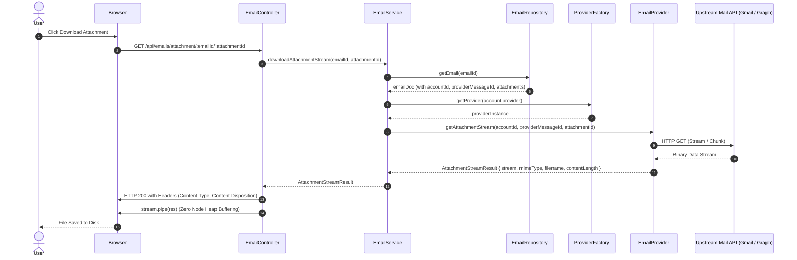
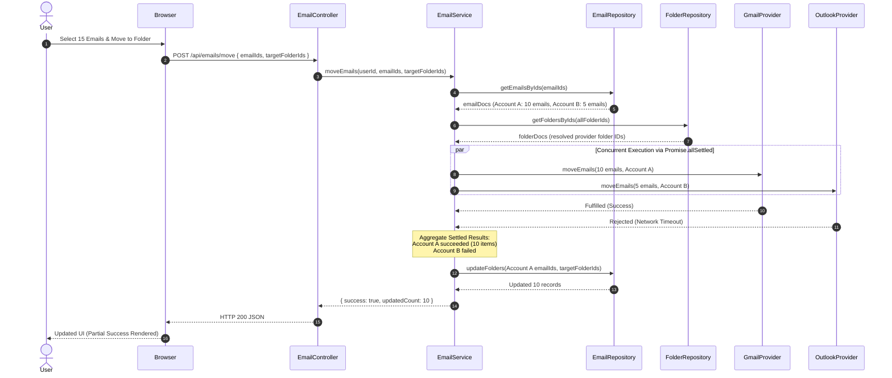

# Platform Resilience & Codebase Enhancements - Phase 3 Implementation Details

> **Feature:** `codebase-enhancements-and-performance` · **Phase:** 3 (`PERF-NEXT-01`, `PERF-NEXT-02`)
> **Status:** COMPLETED
> **Created:** 2026-09-26 · **Last Updated:** 2026-09-27

---

## 1. Goal Description & Scope

Phase 3 resolves the two primary I/O and latency bottlenecks identified in the v1.1.0 codebase health audit:

1. **Memory-Safe Attachment Streaming (`PERF-NEXT-01`):**
   - Currently, attachment downloads in `EmailService.downloadAttachment` buffer the entire file payload into a Node.js `Buffer` in memory before dispatching it to the client via `res.send(attachment.data)`.
   - For high-volume mailboxes or large file attachments (e.g. 10MB–25MB files), concurrent downloads place severe pressure on Node.js V8 heap memory.
   - Refactor `IEmailProvider`, `GmailClient`, `OutlookClient`, `GmailProvider`, `OutlookProvider`, and `EmailService` to introduce `getAttachmentStream`.
   - Update `EmailController.downloadAttachment` to pipe the incoming stream directly into the Express `Response` using standard Node.js streaming with proper `Content-Type`, `Content-Disposition`, and `Content-Length` headers, preventing heap exhaustion.

2. **Parallelized Multi-Account Batch Operations (`PERF-NEXT-02`):**
   - Currently, multi-account batch email operations (`moveEmails`, `archiveEmails`, `starEmails`, `unreadEmails`) iterate sequentially in `for...of` loops across distinct user accounts.
   - If an inbox contains messages across 3 connected accounts, network latency is multiplied 3x. Furthermore, a failure on the 2nd account aborts remaining accounts and leaves MongoDB out-of-sync with providers that already executed.
   - Refactor multi-account batch actions to group emails by account and execute provider commands concurrently using `Promise.allSettled()`.
   - Guarantee atomicity and partial success handling: synchronize MongoDB records exclusively for emails belonging to accounts that succeeded, log structured diagnostic warnings for rejected accounts, and return aggregated results.

3. **Frontend Endpoint Alignment:**
   - Centralize the attachment download endpoint in `EMAILS_API_ENDPOINTS.ATTACHMENT(emailId, attachmentId)` within `Frontend/src/shared/api/endpoints.ts`.
   - Update `Frontend/src/features/emails/utils/attachments.ts` to consume the centralized constant rather than hardcoding URL strings.

---

## 2. User Review Required & Architectural Notes

> [!IMPORTANT]
> **Provider Streaming Mechanics**:
> - **Outlook (Microsoft Graph API)**: The Graph API endpoint `/me/messages/{messageId}/attachments/{attachmentId}/$value` returns the raw binary stream directly. By configuring Axios with `responseType: 'stream'`, the HTTP response body is already a Node.js `Readable` stream, which pipes straight through to Express `Response` with zero intermediate in-memory buffering.
> - **Gmail (Google Workspace API)**: The Gmail REST endpoint `messages.attachments.get` returns a JSON object containing `{ data: string, size: number }` with Base64URL-encoded payload. To provide a uniform streaming contract across providers, `GmailClient` decodes the Base64 data and wraps it into a `Readable` stream via `Readable.from(buffer)`.
>
> **Partial Success in Multi-Account Moves**:
> If a user performs a bulk action (e.g., moves 10 emails from Gmail and 5 from Outlook) and Outlook's API fails (e.g., token expiration or transient network issue), `Promise.allSettled` ensures Gmail's move still completes, and MongoDB folders are updated *only* for the 10 Gmail emails. The response reflects the updated count, and the server logs diagnostic metadata for the failed account.

---

## 3. Component Overview & File Map

| Component | Target File | Action | Purpose |
|---|---|---|---|
| Contract | `Backend/src/integrations/email/email.provider.types.ts` | [MODIFY] | Add `AttachmentStreamResult` and `AccountBatchMoveResult` named interfaces |
| Contract | `Backend/src/integrations/email/email.provider.ts` | [MODIFY] | Add `getAttachmentStream` to `IEmailProvider` interface |
| Gmail Integration | `Backend/src/integrations/gmail/gmail.client.ts` | [MODIFY] | Add `getAttachmentStream` to `GmailApi` |
| Gmail Integration | `Backend/src/integrations/gmail/gmail.service.ts` | [MODIFY] | Add `getAttachmentStream` to `GmailService` |
| Gmail Integration | `Backend/src/integrations/gmail/gmail.provider.ts` | [MODIFY] | Implement `getAttachmentStream` in `GmailProvider` |
| Outlook Integration | `Backend/src/integrations/outlook/outlook.client.ts` | [MODIFY] | Add `getAttachmentStream` using `responseType: 'stream'` in `OutlookApi` |
| Outlook Integration | `Backend/src/integrations/outlook/outlook.service.ts` | [MODIFY] | Add `getAttachmentStream` to `OutlookService` |
| Outlook Integration | `Backend/src/integrations/outlook/outlook.provider.ts` | [MODIFY] | Implement `getAttachmentStream` in `OutlookProvider` |
| Service | `Backend/src/modules/emails/email.service.ts` | [MODIFY] | Add `downloadAttachmentStream` and refactor `moveEmails`/batch actions to `Promise.allSettled()` |
| Controller | `Backend/src/modules/emails/email.controller.ts` | [MODIFY] | Pipe stream to `res` with headers in `downloadAttachment` |
| Frontend Constants | `Frontend/src/shared/api/endpoints.ts` | [MODIFY] | Add `ATTACHMENT` to `EMAILS_API_ENDPOINTS` |
| Frontend Utility | `Frontend/src/features/emails/utils/attachments.ts` | [MODIFY] | Consume centralized `EMAILS_API_ENDPOINTS.ATTACHMENT` constant |

---

## 4. Main Section 1: Backend Layer Implementation

### 4.1 Integration Contracts & Interfaces (`Backend/src/integrations/email/email.provider.types.ts`)

Add explicit named interfaces for attachment streaming and multi-account task tracking:

```typescript
import { Readable } from 'node:stream';

export interface AttachmentStreamResult {
    stream: Readable;
    mimeType: string;
    filename: string;
    contentLength?: number;
}

export interface AccountBatchMoveTaskResult {
    accountId: string;
    successfulDbEmailIds: string[];
    count: number;
}
```

### 4.2 Email Provider Interface (`Backend/src/integrations/email/email.provider.ts`)

Extend `IEmailProvider` to declare `getAttachmentStream`:

```typescript
import { AttachmentStreamResult } from './email.provider.types.js';

export interface IEmailProvider<TAuthToken = IEmailTAuthToken, TUserProfile = IEmailTUserProfile, TSendMailResult = IEmailTSendEmailResult> {
    // ... existing auth, ingestion, and email methods ...

    // Attachment Operations
    getAttachment(accountId: string, messageId: string, attachmentId: string): Promise<{ data: Buffer; mimeType: string; filename: string }>;
    getAttachmentStream(accountId: string, messageId: string, attachmentId: string): Promise<AttachmentStreamResult>;

    // ... existing folder and move operations ...
}
```

### 4.3 Gmail Client & Service Implementation (`Backend/src/integrations/gmail/`)

#### 4.3.1 `Backend/src/integrations/gmail/gmail.client.ts`

```typescript
import { Readable } from 'node:stream';
import { AttachmentStreamResult } from '../email/email.provider.types.js';

export class GmailApi {
    // ... existing methods ...

    static async getAttachmentStream(
        accountId: string,
        messageId: string,
        attachmentId: string,
    ): Promise<AttachmentStreamResult> {
        try {
            const accessToken = await this.fetchAccessToken(accountId);
            const options: AxiosRequestConfig = {
                url: `${GMAIL_API_BASE_URL}${GMAIL_APIs.MESSAGES}/${messageId}/attachments/${attachmentId}`,
                method: 'GET',
                headers: {
                    Authorization: `Bearer ${accessToken}`,
                },
            };
            const response = await apiRequest<{ data: string; size: number }>(options);
            const buffer = Buffer.from(response.data, 'base64url');
            const stream = Readable.from(buffer);
            return {
                stream,
                mimeType: 'application/octet-stream',
                filename: 'attachment',
                contentLength: buffer.length,
            };
        } catch (err) {
            const errorMessage = err instanceof Error ? err.message : String(err);
            logger.error(`Error in GmailApi.getAttachmentStream: ${errorMessage}`, { error: err, accountId, messageId, attachmentId });
            throw err;
        }
    }
}
```

#### 4.3.2 `Backend/src/integrations/gmail/gmail.service.ts`

```typescript
    public async getAttachmentStream(
        accountId: string,
        messageId: string,
        attachmentId: string,
    ): Promise<AttachmentStreamResult> {
        try {
            return await GmailApi.getAttachmentStream(accountId, messageId, attachmentId);
        } catch (err) {
            const errorMessage = err instanceof Error ? err.message : String(err);
            logger.error(`Error in GmailService.getAttachmentStream: ${errorMessage}`, { error: err });
            throw err;
        }
    }
```

#### 4.3.3 `Backend/src/integrations/gmail/gmail.provider.ts`

```typescript
    async getAttachmentStream(accountId: string, messageId: string, attachmentId: string): Promise<AttachmentStreamResult> {
        try {
            return await this.gmailService.getAttachmentStream(accountId, messageId, attachmentId);
        } catch (err) {
            const errorMessage = err instanceof Error ? err.message : String(err);
            logger.error(`Error in GmailProvider.getAttachmentStream: ${errorMessage}`, { error: err });
            throw err;
        }
    }
```

---

### 4.4 Outlook Client & Service Implementation (`Backend/src/integrations/outlook/`)

#### 4.4.1 `Backend/src/integrations/outlook/outlook.client.ts`

```typescript
import axios, { AxiosRequestConfig } from 'axios';
import { Readable } from 'node:stream';
import { AttachmentStreamResult } from '../email/email.provider.types.js';

export class OutlookApi {
    // ... existing methods ...

    static async getAttachmentStream(
        accountId: string,
        messageId: string,
        attachmentId: string,
    ): Promise<AttachmentStreamResult> {
        try {
            const accessToken = await OutlookApi.fetchAccessToken(accountId);
            const options: AxiosRequestConfig = {
                url: `${OUTLOOK_API_BASE_URL}${OUTLOOK_APIs.ATTACHMENT(messageId, attachmentId)}`,
                method: 'GET',
                headers: {
                    Authorization: `Bearer ${accessToken}`,
                },
                responseType: 'stream',
            };
            const response = await axios.request<Readable>(options);
            const contentType = (response.headers['content-type'] as string) || 'application/octet-stream';
            const contentLengthHeader = response.headers['content-length'];
            const contentLength = contentLengthHeader ? Number(contentLengthHeader) : undefined;

            return {
                stream: response.data,
                mimeType: contentType,
                filename: 'attachment',
                contentLength,
            };
        } catch (err) {
            const errorMessage = err instanceof Error ? err.message : String(err);
            logger.error(`Error in OutlookApi.getAttachmentStream: ${errorMessage}`, { error: err, accountId, messageId, attachmentId });
            throw err;
        }
    }
}
```

#### 4.4.2 `Backend/src/integrations/outlook/outlook.service.ts`

```typescript
    public async getAttachmentStream(
        accountId: string,
        messageId: string,
        attachmentId: string,
    ): Promise<AttachmentStreamResult> {
        try {
            return await OutlookApi.getAttachmentStream(accountId, messageId, attachmentId);
        } catch (err) {
            const errorMessage = err instanceof Error ? err.message : String(err);
            logger.error(`Error in OutlookService.getAttachmentStream: ${errorMessage}`, { error: err });
            throw err;
        }
    }
```

#### 4.4.3 `Backend/src/integrations/outlook/outlook.provider.ts`

```typescript
    async getAttachmentStream(accountId: string, messageId: string, attachmentId: string): Promise<AttachmentStreamResult> {
        try {
            return await this.outlookService.getAttachmentStream(accountId, messageId, attachmentId);
        } catch (err) {
            const errorMessage = err instanceof Error ? err.message : String(err);
            logger.error(`Error in OutlookProvider.getAttachmentStream: ${errorMessage}`, { error: err });
            throw err;
        }
    }
```

---

### 4.5 Service Layer Updates (`Backend/src/modules/emails/email.service.ts`)

#### 4.5.1 Attachment Download Stream Method

```typescript
    public async downloadAttachmentStream(
        emailId: string,
        attachmentId: string,
    ): Promise<AttachmentStreamResult> {
        try {
            const email = await EmailRepository.getEmail(emailId);
            if (!email) {
                throw new NotFoundError('Email', emailId);
            }

            const account = await AccountRepository.getAccountById(email.accountId);
            if (!account) {
                throw new NotFoundError('Account', email.accountId);
            }

            const attachment = (email.attachments || []).find((att) => att.attachmentId === attachmentId);

            const provider = EmailProviderFactory.getProvider(account.provider);
            const result = await provider.getAttachmentStream(email.accountId, email.providerMessageId, attachmentId);

            return {
                stream: result.stream,
                mimeType: attachment?.mimeType || result.mimeType || 'application/octet-stream',
                filename: attachment?.filename || result.filename || 'attachment',
                contentLength: attachment?.size || result.contentLength,
            };
        } catch (err) {
            const errorMessage = err instanceof Error ? err.message : String(err);
            logger.error(`Error in EmailService.downloadAttachmentStream: ${errorMessage}`, { error: err, emailId, attachmentId });
            throw err;
        }
    }
```

#### 4.5.2 Parallelized Multi-Account `moveEmails`

```typescript
    public async moveEmails(
        userId: string,
        emailIds: string[],
        targetFolderIds: string[],
        removeFolderIds: string[] = [],
    ): Promise<MoveEmailsResponse> {
        try {
            if (!emailIds.length) {
                return { success: true, updatedCount: 0 };
            }

            const emailDocs = await EmailRepository.getEmailsByIds(emailIds, EMAIL_LIST_DB_FIELD_MAPPING.LIST.projection);

            if (!emailDocs.length) {
                throw new NotFoundError('Emails', emailIds.join(', '));
            }

            const accountIds = Array.from(new Set(emailDocs.map((email) => email.accountId)));
            const userAccounts = await AccountRepository.getAccounts({
                userId,
                _id: { $in: accountIds },
            });

            if (userAccounts.length !== accountIds.length) {
                throw new ForbiddenError('Unauthorized attempt to move emails from unowned accounts');
            }

            const allFolderIds = [...targetFolderIds, ...removeFolderIds];
            const folderDocs = await FolderRepository.getFoldersByIds(allFolderIds);
            const folderMap = new Map<string, string>();
            folderDocs.forEach((folder) => {
                folderMap.set(String(folder._id), folder.providerFolderId);
            });
            const targetProviderFolderIds = targetFolderIds.map((id) => folderMap.get(id) || id);
            const removeProviderFolderIds = removeFolderIds.map((id) => folderMap.get(id) || id);

            const groupedEmails = Object.groupBy(emailDocs, (item) => item.accountId);

            // Parallelized execution across accounts via Promise.allSettled
            const movePromises = Object.entries(groupedEmails).map(
                async ([accountId, emails]): Promise<AccountBatchMoveTaskResult> => {
                    try {
                        const account = userAccounts.find((acc) => String(acc._id) === accountId);
                        if (!account || !emails || emails.length === 0) {
                            return { accountId, successfulDbEmailIds: [], count: 0 };
                        }

                        const provider = EmailProviderFactory.getProvider(account.provider);
                        const providerMessageIds = emails.map((email) => email.providerMessageId);
                        await provider.moveEmails(providerMessageIds, accountId, targetProviderFolderIds, removeProviderFolderIds);

                        return {
                            accountId,
                            successfulDbEmailIds: emails.map((email) => String(email._id)),
                            count: emails.length,
                        };
                    } catch (taskErr) {
                        const errorMessage = taskErr instanceof Error ? taskErr.message : String(taskErr);
                        logger.error('Account-level provider moveEmails failed', { accountId, error: errorMessage });
                        throw taskErr;
                    }
                },
            );

            const settledResults = await Promise.allSettled(movePromises);

            const successfulDbEmailIds: string[] = [];
            let updatedCount = 0;
            const failedAccounts: string[] = [];

            settledResults.forEach((result, index) => {
                const accountId = Object.keys(groupedEmails)[index];
                if (result.status === 'fulfilled') {
                    successfulDbEmailIds.push(...result.value.successfulDbEmailIds);
                    updatedCount += result.value.count;
                } else {
                    failedAccounts.push(accountId);
                    logger.warn('Move operation rejected for account', {
                        accountId,
                        reason: result.reason instanceof Error ? result.reason.message : String(result.reason),
                    });
                }
            });

            // Update database records ONLY for emails whose provider move succeeded
            if (successfulDbEmailIds.length > 0) {
                await EmailRepository.updateFolders(successfulDbEmailIds, targetProviderFolderIds, removeProviderFolderIds);
            }

            if (updatedCount === 0 && failedAccounts.length > 0) {
                throw new BadRequestError(`Failed to move emails across accounts: ${failedAccounts.join(', ')}`);
            }

            return { success: true, updatedCount };
        } catch (error) {
            const errorMessage = error instanceof Error ? error.message : String(error);
            logger.error('Failed to execute moveEmails in EmailService', { emailIds, targetFolderIds, removeFolderIds, error: errorMessage });
            throw error;
        }
    }
```

---

### 4.6 Controller Layer Updates (`Backend/src/modules/emails/email.controller.ts`)

Update `downloadAttachment` handler to pipe stream into `res`:

```typescript
    public downloadAttachment = async (
        req: Request<{ emailId: string; attachmentId: string }>,
        res: Response,
        next: NextFunction,
    ): Promise<void> => {
        try {
            const { emailId, attachmentId } = req.params;
            if (!emailId || !attachmentId) {
                throw new BadRequestError('Email ID and Attachment ID are required');
            }

            const attachment = await this.emailService.downloadAttachmentStream(emailId, attachmentId);

            res.setHeader('Content-Type', attachment.mimeType);
            res.setHeader('Content-Disposition', `attachment; filename="${encodeURIComponent(attachment.filename)}"`);
            if (attachment.contentLength) {
                res.setHeader('Content-Length', attachment.contentLength);
            }

            attachment.stream.on('error', (streamErr) => {
                logger.error('Error during attachment stream transfer', { emailId, attachmentId, error: streamErr });
                if (!res.headersSent) {
                    next(streamErr);
                }
            });

            attachment.stream.pipe(res);
        } catch (error) {
            next(error);
        }
    };
```

---

## 5. Main Section 2: Frontend Layer Implementation

### 5.1 Endpoints Definition (`Frontend/src/shared/api/endpoints.ts`)

Add `ATTACHMENT` to `EMAILS_API_ENDPOINTS`:

```typescript
export const EMAILS_API_ENDPOINTS = {
    LIST: '/emails/list',
    SEARCH: '/emails/search',
    FILTERS: '/emails/filters',
    DELETE: '/emails/delete',
    DETAILS: (emailId: string) => `/emails/details/${emailId}`,
    ARCHIVE: '/emails/archive',
    STAR: '/emails/star',
    UNREAD: '/emails/unread',
    COMPOSE: '/emails/compose',
    SEARCH_OTHER_CONTACTS: '/emails/searchOtherContacts',
    THREAD: (emailId: string) => `/emails/thread/${emailId}`,
    MOVE: '/emails/move',
    ATTACHMENT: (emailId: string, attachmentId: string) => `/emails/attachment/${emailId}/${attachmentId}`,
} as const;
```

### 5.2 Attachment Utility (`Frontend/src/features/emails/utils/attachments.ts`)

Refactor helper to consume `EMAILS_API_ENDPOINTS.ATTACHMENT`:

```typescript
import { axiosClient, EMAILS_API_ENDPOINTS } from '@shared/api';

export const handleDownload = async (
    emailId: string,
    attId: string,
    filename: string,
    setLoadingAttId: React.Dispatch<React.SetStateAction<string | null>>,
): Promise<void> => {
    try {
        setLoadingAttId(attId);
        const endpoint = EMAILS_API_ENDPOINTS.ATTACHMENT(emailId, attId);
        const response = await axiosClient.get(endpoint, {
            responseType: 'blob',
        });
        const contentType = (response.headers['content-type'] as string) || 'application/octet-stream';
        const url = window.URL.createObjectURL(new Blob([response.data], { type: contentType }));
        const link = document.createElement('a');
        link.href = url;
        link.setAttribute('download', filename);
        document.body.appendChild(link);
        link.click();
        link.remove();
        window.URL.revokeObjectURL(url);
    } catch (err) {
        console.error('Error downloading attachment:', err);
    } finally {
        setLoadingAttId(null);
    }
};

export const handlePreview = async (
    emailId: string,
    attId: string,
    setLoadingAttId: React.Dispatch<React.SetStateAction<string | null>>,
    setPreviewUrl: React.Dispatch<React.SetStateAction<string | null>>,
): Promise<void> => {
    try {
        setLoadingAttId(attId);
        const endpoint = EMAILS_API_ENDPOINTS.ATTACHMENT(emailId, attId);
        const response = await axiosClient.get(endpoint, {
            responseType: 'blob',
        });
        const contentType = (response.headers['content-type'] as string) || 'application/octet-stream';
        const url = window.URL.createObjectURL(new Blob([response.data], { type: contentType }));
        setPreviewUrl(url);
    } catch (err) {
        console.error('Error previewing attachment:', err);
    } finally {
        setLoadingAttId(null);
    }
};
```

---

## 6. Low-Level Design & Sequence Flow

### 6.1 Attachment Streaming Sequence Flow



### 6.2 Multi-Account Parallelized Move Sequence Flow



---

## 7. Step-by-Step Task Checklist

- [x] **Task 1: Define Contracts & Interfaces**
  - [x] Add `AttachmentStreamResult` and `AccountBatchMoveTaskResult` to `Backend/src/integrations/email/email.provider.types.ts`.
  - [x] Add `getAttachmentStream` to `IEmailProvider` in `Backend/src/integrations/email/email.provider.ts`.
- [x] **Task 2: Implement Provider Streaming**
  - [x] Implement `GmailApi.getAttachmentStream` in `gmail.client.ts`.
  - [x] Implement `GmailService.getAttachmentStream` in `gmail.service.ts` and `GmailProvider.getAttachmentStream` in `gmail.provider.ts`.
  - [x] Implement `OutlookApi.getAttachmentStream` with `responseType: 'stream'` in `outlook.client.ts`.
  - [x] Implement `OutlookService.getAttachmentStream` in `outlook.service.ts` and `OutlookProvider.getAttachmentStream` in `outlook.provider.ts`.
- [x] **Task 3: Implement Service Streaming & Multi-Account Parallelization**
  - [x] Add `downloadAttachmentStream` in `Backend/src/modules/emails/email.service.ts`.
  - [x] Refactor `moveEmails` in `email.service.ts` to execute per-account tasks using `Promise.allSettled()`.
  - [x] Update MongoDB folder records exclusively for successful accounts in `moveEmails`.
- [x] **Task 4: Update Controller Ingress**
  - [x] Update `EmailController.downloadAttachment` in `email.controller.ts` to set headers and pipe `attachment.stream` to `res`.
  - [x] Attach stream `error` event handler to prevent uncaught pipeline rejections.
- [x] **Task 5: Frontend Constants & Utility Integration**
  - [x] Add `ATTACHMENT` endpoint factory to `EMAILS_API_ENDPOINTS` in `Frontend/src/shared/api/endpoints.ts`.
  - [x] Update `handleDownload` and `handlePreview` in `Frontend/src/features/emails/utils/attachments.ts` to use `EMAILS_API_ENDPOINTS.ATTACHMENT`.
- [x] **Task 6: Verification & Testing**
  - [x] Run `cd Backend && pnpm build` to verify type safety and compilation.
  - [x] Run `cd Frontend && npx tsc --noEmit` to verify frontend type safety.
  - [x] Run backend unit tests (`pnpm test`).

---

## 8. Verification & Build Commands

```bash
# 1. Backend Build & Type Verification
cd /Users/vishaljagamani/Projects/Projects/mailsense/Backend
pnpm build

# 2. Run Backend Unit Tests
pnpm test

# 3. Verify Frontend Compilation
cd /Users/vishaljagamani/Projects/Projects/mailsense/Frontend
npx tsc --noEmit
```
