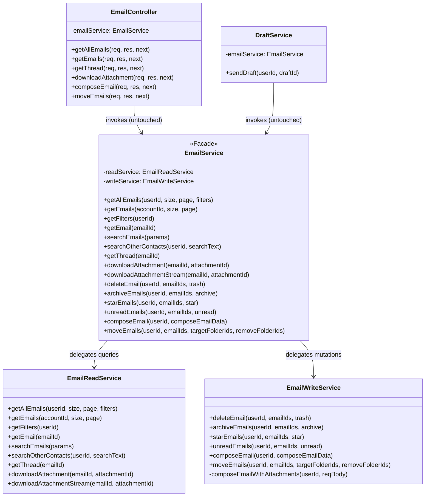
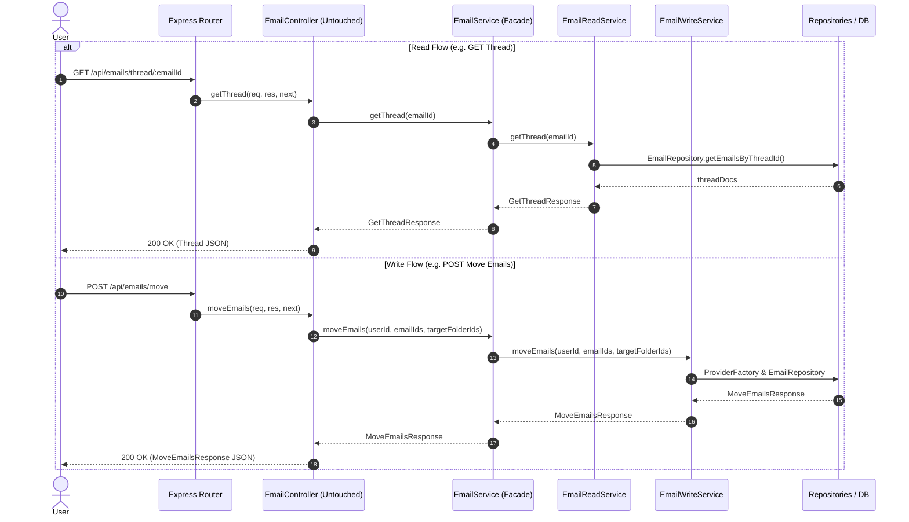

# Platform Resilience & Codebase Enhancements - Phase 4 Implementation Details

> **Feature:** `codebase-enhancements-and-performance` · **Phase:** 4 (`ARCH-NEXT-01`)
> **Status:** COMPLETED
> **Created:** 2026-09-27 · **Last Updated:** 2026-09-27

---

## 1. Goal Description & Scope

Phase 4 decomposes the monolithic [email.service.ts](file:///Users/vishaljagamani/Projects/Projects/mailsense/Backend/src/modules/emails/email.service.ts) (currently 649 lines) into single-responsibility, cohesive domain service layers while maintaining **100% facade compatibility** (`ARCH-NEXT-01`):

1. **Separation of Read & Write Concerns (CQRS-inspired Service Layer):**
   - **`EmailReadService` (`Backend/src/modules/emails/email-read.service.ts`):** Encapsulates all query and data retrieval operations:
     - Paginated unified list (`getAllEmails`), per-account listing (`getEmails`).
     - Available filter aggregation (`getFilters`).
     - Single email inspection (`getEmail`).
     - Full-text search with regex and pagination (`searchEmails`).
     - Cross-provider contact suggestions (`searchOtherContacts`).
     - Conversation thread retrieval with HTML/Plain decompression (`getThread`).
     - Attachment download buffer (`downloadAttachment`) and binary streaming (`downloadAttachmentStream`).
   - **`EmailWriteService` (`Backend/src/modules/emails/email-write.service.ts`):** Encapsulates all mutation and dispatch operations:
     - Provider email composition with and without staged attachments (`composeEmail`, `composeEmailWithAttachments`).
     - Parallelized multi-account folder migration (`moveEmails`) via `Promise.allSettled()`.
     - Batch deletion (`deleteEmail`), archive (`archiveEmails`), starring (`starEmails`), and read/unread flags (`unreadEmails`).
2. **Lightweight Facade Pattern in `EmailService` (`Backend/src/modules/emails/email.service.ts`):**
   - Refactor `EmailService` into a lightweight, backward-compatible Facade that instantiates `EmailReadService` and `EmailWriteService` and delegates every call to them.
   - Preserves 100% of the public method signatures and types of `EmailService`.
3. **Zero Caller Modification / Zero Ingress Churn:**
   - [email.controller.ts](file:///Users/vishaljagamani/Projects/Projects/mailsense/Backend/src/modules/emails/email.controller.ts) requires **NO code changes**. It continues instantiating and calling `this.emailService.<method>()` exactly as before.
   - [draft.service.ts](file:///Users/vishaljagamani/Projects/Projects/mailsense/Backend/src/modules/drafts/draft.service.ts) requires **NO code changes**. It continues calling `this.emailService.composeEmail(...)` seamlessly.
   - Express route definitions in [email.routes.ts](file:///Users/vishaljagamani/Projects/Projects/mailsense/Backend/src/modules/emails/email.routes.ts) and frontend API contracts remain untouched with zero regression risk.

---

## 2. User Review Required & Architectural Notes

> [!IMPORTANT]
> **Preserving `EmailController` Without Changes**:
> By maintaining `EmailService` as a pure Facade delegating to `EmailReadService` and `EmailWriteService`, `EmailController` does NOT need to be modified. This minimizes churn across the HTTP ingress layer, prevents accidental regressions, and preserves identical controller method bindings.
>
> **Cohesion and File Size Budget**:
> - Monolithic `email.service.ts` (649 lines) is split into:
>   - `email-read.service.ts` ($\approx$ 280 lines)
>   - `email-write.service.ts` ($\approx$ 290 lines)
>   - `email.service.ts` facade ($\approx$ 90 lines)
> - Every file remains well under the 350-line target, achieving clear separation of concerns.
>
> **Strict Type Safety & Error Handling**:
> - Every method in `EmailReadService`, `EmailWriteService`, and the `EmailService` facade is wrapped in explicit `try / catch` blocks.
> - Domain errors (`NotFoundError`, `BadRequestError`, `ForbiddenError`, `UnauthorizedError`) flow directly to the centralized Express `errorHandler`.
> - Strictly no `any`, `never`, or `unknown` types.

---

## 3. Component Overview & File Map

| Component | Target File | Action | Purpose |
|---|---|---|---|
| Read Service | `Backend/src/modules/emails/email-read.service.ts` | [NEW] | Encapsulate all mailbox reading, searching, threading, and attachment streaming |
| Write Service | `Backend/src/modules/emails/email-write.service.ts` | [NEW] | Encapsulate email composition, multi-account moves, deletion, and flag mutations |
| Facade | `Backend/src/modules/emails/email.service.ts` | [MODIFY] | Refactor into lightweight Facade delegating to Read and Write services |
| Controller | `Backend/src/modules/emails/email.controller.ts` | [PRESERVED] | **No changes required** — continues consuming `EmailService` facade |
| Draft Service | `Backend/src/modules/drafts/draft.service.ts` | [PRESERVED] | **No changes required** — continues consuming `EmailService` facade |
| Unit Test | `Backend/src/modules/emails/__tests__/email-read.service.test.ts` | [NEW] | Unit tests for read service queries and thread decompression |
| Unit Test | `Backend/src/modules/emails/__tests__/email-write.service.test.ts` | [NEW] | Unit tests for write service mutations and `Promise.allSettled` moves |

---

## 4. Main Section 1: Backend Layer Implementation

### 4.1 Parameter Interfaces (`Backend/src/modules/emails/email.interface.ts`)

Ensure named parameter interfaces exist for service methods:

```typescript
import { GetAllEmailsFilters } from '@mailsense/types';

export interface GetAllEmailsParams {
    userId: string;
    size: number;
    page: number;
    filters: GetAllEmailsFilters;
}

export interface SearchEmailsParams {
    userId: string;
    accountId?: string;
    query: string;
    page?: number;
    limit?: number;
}
```

---

### 4.2 Email Read Service (`Backend/src/modules/emails/email-read.service.ts`)

Create `EmailReadService` containing query and read operations:

```typescript
import { LOGGER_MODULE } from '@constants';
import { NotFoundError } from '@errors';
import { EmailProviderFactory } from '@integrations/email/email.provider.factory.js';
import { AttachmentStreamResult } from '@integrations/email/email.provider.types.js';
import {
    APIResponse,
    EmailAttributes,
    GetAllEmailsFilters,
    GetEmailsResponse,
    GetFiltersResponse,
    GetThreadResponse,
    PaginatedDataResponse,
    SearchOtherContactsResponse,
} from '@mailsense/types';
import { AccountRepository } from '@modules/accounts/account.repository.js';
import { decompressString } from 'shared/utils/compression.utils.js';
import { createLogger } from 'shared/utils/logger.utils.js';
import { SearchEmailsParams } from './email.interface.js';
import { EmailDocument, EmailInput } from './email.model.js';
import { EmailRepository } from './email.repository.js';

const logger = createLogger(LOGGER_MODULE.EMAIL_SERVICE);

export class EmailReadService {
    public async getAllEmails(
        userId: string,
        size: number,
        page: number,
        filters: GetAllEmailsFilters,
    ): Promise<GetEmailsResponse> {
        try {
            const accounts = await AccountRepository.getAccounts({ userId, active: true });

            if (!accounts.length) {
                return {
                    emails: [],
                    totalCount: 0,
                    totalPages: 0,
                    currentPage: page,
                };
            }

            const activeAccountIds = accounts.map((acc) => String(acc._id));
            const accountMap = new Map<string, string>();
            accounts.forEach((acc) => {
                accountMap.set(String(acc._id), acc.provider);
            });

            const result = await EmailRepository.getAllEmails(activeAccountIds, size, page, filters);

            const emailsWithProvider: EmailAttributes[] = result.emails.map((email) => {
                const plainEmail = typeof (email as EmailDocument).toObject === 'function'
                    ? (email as EmailDocument).toObject()
                    : { ...email };
                return {
                    ...plainEmail,
                    provider: accountMap.get(String(email.accountId)) || '',
                } as EmailAttributes;
            });

            return {
                emails: emailsWithProvider,
                totalCount: result.totalCount,
                totalPages: result.totalPages,
                currentPage: page,
            };
        } catch (err) {
            const errorMessage = err instanceof Error ? err.message : String(err);
            logger.error(`Error in EmailReadService.getAllEmails: ${errorMessage}`, { error: err });
            throw err;
        }
    }

    public async getEmails(accountId: string, size: number, page: number): Promise<GetEmailsResponse> {
        try {
            const account = await AccountRepository.getAccountById(accountId);
            if (!account) {
                throw new NotFoundError('Account', accountId);
            }

            const result = await EmailRepository.getEmails(accountId, size, page);

            const emailsWithProvider: EmailAttributes[] = result.emails.map((email) => {
                const plainEmail = typeof (email as EmailDocument).toObject === 'function'
                    ? (email as EmailDocument).toObject()
                    : { ...email };
                return {
                    ...plainEmail,
                    provider: account.provider,
                } as EmailAttributes;
            });

            return {
                emails: emailsWithProvider,
                totalCount: result.totalCount,
                totalPages: result.totalPages,
                currentPage: page,
            };
        } catch (err) {
            const errorMessage = err instanceof Error ? err.message : String(err);
            logger.error(`Error in EmailReadService.getEmails: ${errorMessage}`, { error: err });
            throw err;
        }
    }

    public async getFilters(userId: string): Promise<GetFiltersResponse> {
        try {
            const accounts = await AccountRepository.getAccounts({ userId, active: true });
            const accountIds = accounts.map((acc) => String(acc._id));
            const filters = await EmailRepository.getFilters(accountIds);
            return filters;
        } catch (err) {
            const errorMessage = err instanceof Error ? err.message : String(err);
            logger.error(`Error in EmailReadService.getFilters: ${errorMessage}`, { error: err });
            throw err;
        }
    }

    public async getEmail(emailId: string): Promise<EmailDocument | EmailInput | null> {
        try {
            const email = await EmailRepository.getEmail(emailId);
            if (!email) {
                throw new NotFoundError('Email', emailId);
            }

            const plainEmail = typeof email.toObject === 'function' ? email.toObject() : { ...email };

            return {
                ...plainEmail,
                bodyHtml: email.bodyHtml ? decompressString(email.bodyHtml) : '',
                bodyPlain: email.bodyPlain ? decompressString(email.bodyPlain) : '',
            };
        } catch (err) {
            const errorMessage = err instanceof Error ? err.message : String(err);
            logger.error(`Error in EmailReadService.getEmail: ${errorMessage}`, { error: err });
            throw err;
        }
    }

    public async searchEmails(params: SearchEmailsParams): Promise<PaginatedDataResponse<EmailDocument>> {
        try {
            const { userId, accountId, query, page = 1, limit = 20 } = params;

            let targetAccountIds: string[] = [];
            if (accountId) {
                const account = await AccountRepository.getAccount({ _id: accountId, userId, active: true });
                if (!account) {
                    throw new NotFoundError('Account', accountId);
                }
                targetAccountIds = [accountId];
            } else {
                const accounts = await AccountRepository.getAccounts({ userId, active: true });
                targetAccountIds = accounts.map((acc) => String(acc._id));
            }

            const skip = (page - 1) * limit;
            const searchRegex = new RegExp(query, 'i');
            const searchQuery = {
                accountId: { $in: targetAccountIds },
                $or: [
                    { subject: { $regex: searchRegex } },
                    { bodyPreview: { $regex: searchRegex } },
                    { 'from.email': { $regex: searchRegex } },
                    { 'from.name': { $regex: searchRegex } },
                    { 'to.email': { $regex: searchRegex } },
                    { 'to.name': { $regex: searchRegex } },
                ],
            };

            const [emails, total] = await Promise.all([
                EmailRepository.searchEmails(searchQuery, skip, limit),
                EmailRepository.countDocuments(searchQuery),
            ]);

            return {
                data: emails,
                pagination: {
                    page,
                    limit,
                    total,
                    totalPages: Math.ceil(total / limit),
                },
            };
        } catch (err) {
            const errorMessage = err instanceof Error ? err.message : String(err);
            logger.error(`Error in EmailReadService.searchEmails: ${errorMessage}`, { error: err });
            throw err;
        }
    }

    public async searchOtherContacts(userId: string, searchText: string): Promise<APIResponse<SearchOtherContactsResponse[]>> {
        try {
            const accounts = await AccountRepository.getAccounts({ userId, active: true });
            if (!accounts.length) {
                return { status: false, message: 'No accounts found', data: [] };
            }

            const contacts = accounts.map((account) => {
                const provider = EmailProviderFactory.getProvider(account.provider);
                return provider.searchContacts(String(account._id), searchText).catch(() => []);
            });

            const results = await Promise.all(contacts);
            const allContacts = results.flat();
            const mergedContacts = allContacts.filter((contact, index, self) => index === self.findIndex((c) => c.email === contact.email));

            return { status: true, message: 'Search other contacts successfully', data: mergedContacts };
        } catch (err) {
            const errorMessage = err instanceof Error ? err.message : String(err);
            logger.error(`Error in EmailReadService.searchOtherContacts: ${errorMessage}`, { error: err });
            throw err;
        }
    }

    public async getThread(emailId: string): Promise<GetThreadResponse> {
        try {
            const email = await EmailRepository.getEmail(emailId);
            if (!email) {
                throw new NotFoundError('Email', emailId);
            }

            const threadEmails = await EmailRepository.getEmailsByThreadId(email.threadId, email.accountId);

            const decompressedThread = threadEmails.map((item) => ({
                ...item,
                _id: String(item._id),
                bodyHtml: item.bodyHtml ? decompressString(item.bodyHtml) : '',
                bodyPlain: item.bodyPlain ? decompressString(item.bodyPlain) : '',
            }));

            return {
                thread: decompressedThread,
                threadId: email.threadId,
            };
        } catch (err) {
            const errorMessage = err instanceof Error ? err.message : String(err);
            logger.error(`Error in EmailReadService.getThread: ${errorMessage}`, { error: err });
            throw err;
        }
    }

    public async downloadAttachment(emailId: string, attachmentId: string): Promise<{ data: Buffer; mimeType: string; filename: string }> {
        try {
            const email = await EmailRepository.getEmail(emailId);
            if (!email) {
                throw new NotFoundError('Email', emailId);
            }

            const account = await AccountRepository.getAccountById(email.accountId);
            if (!account) {
                throw new NotFoundError('Account', email.accountId);
            }

            const attachment = (email.attachments || []).find((att) => att.attachmentId === attachmentId);
            const provider = EmailProviderFactory.getProvider(account.provider);
            const result = await provider.getAttachment(email.accountId, email.providerMessageId, attachmentId);

            return {
                data: result.data,
                mimeType: attachment?.mimeType || result.mimeType || 'application/octet-stream',
                filename: attachment?.filename || result.filename || 'attachment',
            };
        } catch (err) {
            const errorMessage = err instanceof Error ? err.message : String(err);
            logger.error(`Error in EmailReadService.downloadAttachment: ${errorMessage}`, { error: err });
            throw err;
        }
    }

    public async downloadAttachmentStream(emailId: string, attachmentId: string): Promise<AttachmentStreamResult> {
        try {
            const email = await EmailRepository.getEmail(emailId);
            if (!email) {
                throw new NotFoundError('Email', emailId);
            }

            const account = await AccountRepository.getAccountById(email.accountId);
            if (!account) {
                throw new NotFoundError('Account', email.accountId);
            }

            const attachment = (email.attachments || []).find((att) => att.attachmentId === attachmentId);
            const provider = EmailProviderFactory.getProvider(account.provider);
            const result = await provider.getAttachmentStream(email.accountId, email.providerMessageId, attachmentId);

            return {
                stream: result.stream,
                mimeType: attachment?.mimeType || result.mimeType || 'application/octet-stream',
                filename: attachment?.filename || result.filename || 'attachment',
                contentLength: attachment?.size || result.contentLength,
            };
        } catch (err) {
            const errorMessage = err instanceof Error ? err.message : String(err);
            logger.error(`Error in EmailReadService.downloadAttachmentStream: ${errorMessage}`, { error: err, emailId, attachmentId });
            throw err;
        }
    }
}
```

---

### 4.3 Email Write Service (`Backend/src/modules/emails/email-write.service.ts`)

Create `EmailWriteService` containing mutation and dispatch operations:

```typescript
import { LOGGER_MODULE } from '@constants';
import { BadRequestError, ForbiddenError, NotFoundError } from '@errors';
import { EmailProviderFactory } from '@integrations/email/email.provider.factory.js';
import { AccountBatchMoveTaskResult } from '@integrations/email/email.provider.types.js';
import { MoveEmailsResponse, SuccessAPIResponse, UpdateAPIResponse } from '@mailsense/types';
import { AccountRepository } from '@modules/accounts/account.repository.js';
import { StagedAttachmentRepository } from '@modules/attachments/attachment.repository.js';
import { FolderRepository } from '@modules/folders/folder.repository.js';
import { cleanupStagedAttachmentFiles } from 'shared/utils/attachment-cleanup.utils.js';
import { createLogger } from 'shared/utils/logger.utils.js';
import { EMAIL_LIST_DB_FIELD_MAPPING } from './email.constants.js';
import { EmailRepository } from './email.repository.js';
import { ComposeEmailBody } from './email.schema.js';

const logger = createLogger(LOGGER_MODULE.EMAIL_SERVICE);

export class EmailWriteService {
    public async deleteEmail(userId: string, emailIds: string[], trash: boolean = false): Promise<UpdateAPIResponse> {
        try {
            const emailList = await EmailRepository.getEmailsByIds(emailIds, EMAIL_LIST_DB_FIELD_MAPPING.LIST.projection);
            if (!emailList.length) {
                throw new NotFoundError('Emails', emailIds.join(', '));
            }

            const accountIds = Array.from(new Set(emailList.map((email) => email.accountId)));
            const userAccounts = await AccountRepository.getAccounts({
                userId,
                _id: { $in: accountIds },
            });

            if (userAccounts.length !== accountIds.length) {
                throw new ForbiddenError('Unauthorized attempt to delete emails from unowned accounts');
            }

            const groupedEmails = Object.groupBy(emailList, (item) => item.accountId);
            const deletePromises = Object.entries(groupedEmails).map(async ([accountId, emails]) => {
                const account = userAccounts.find((acc) => String(acc._id) === accountId);
                if (!account || !emails) return;
                const provider = EmailProviderFactory.getProvider(account.provider);
                await provider.deleteEmails(
                    emails.map((email) => email.providerMessageId),
                    accountId,
                    trash,
                );
            });

            await Promise.allSettled(deletePromises);
            await EmailRepository.deleteEmails(emailIds);

            return { status: true, message: 'Emails deleted successfully' };
        } catch (err) {
            const errorMessage = err instanceof Error ? err.message : String(err);
            logger.error(`Error in EmailWriteService.deleteEmail: ${errorMessage}`, { error: err });
            throw err;
        }
    }

    public async archiveEmails(userId: string, emailIds: string[], archive: boolean): Promise<UpdateAPIResponse> {
        try {
            const emailList = await EmailRepository.getEmailsByIds(emailIds, EMAIL_LIST_DB_FIELD_MAPPING.LIST.projection);
            if (!emailList.length) {
                throw new NotFoundError('Emails', emailIds.join(', '));
            }

            const accountIds = Array.from(new Set(emailList.map((email) => email.accountId)));
            const userAccounts = await AccountRepository.getAccounts({
                userId,
                _id: { $in: accountIds },
            });

            if (userAccounts.length !== accountIds.length) {
                throw new ForbiddenError('Unauthorized attempt to archive emails from unowned accounts');
            }

            const groupedEmails = Object.groupBy(emailList, (item) => item.accountId);
            const archivePromises = Object.entries(groupedEmails).map(async ([accountId, emails]) => {
                const account = userAccounts.find((acc) => String(acc._id) === accountId);
                if (!account || !emails) return;
                const provider = EmailProviderFactory.getProvider(account.provider);
                await provider.archiveEmails(
                    emails.map((email) => email.providerMessageId),
                    accountId,
                    archive,
                );
            });

            await Promise.allSettled(archivePromises);
            return { status: true, message: 'Emails archived successfully' };
        } catch (err) {
            const errorMessage = err instanceof Error ? err.message : String(err);
            logger.error(`Error in EmailWriteService.archiveEmails: ${errorMessage}`, { error: err });
            throw err;
        }
    }

    public async starEmails(userId: string, emailIds: string[], star: boolean): Promise<UpdateAPIResponse> {
        try {
            const emailList = await EmailRepository.getEmailsByIds(emailIds, EMAIL_LIST_DB_FIELD_MAPPING.LIST.projection);
            if (!emailList.length) {
                throw new NotFoundError('Emails', emailIds.join(', '));
            }

            const accountIds = Array.from(new Set(emailList.map((email) => email.accountId)));
            const userAccounts = await AccountRepository.getAccounts({
                userId,
                _id: { $in: accountIds },
            });

            if (userAccounts.length !== accountIds.length) {
                throw new ForbiddenError('Unauthorized attempt to star emails from unowned accounts');
            }

            const groupedEmails = Object.groupBy(emailList, (item) => item.accountId);
            const starPromises = Object.entries(groupedEmails).map(async ([accountId, emails]) => {
                const account = userAccounts.find((acc) => String(acc._id) === accountId);
                if (!account || !emails) return;
                const provider = EmailProviderFactory.getProvider(account.provider);
                await provider.starEmails(
                    emails.map((email) => ({ id: String(email._id), providerMessageId: email.providerMessageId })),
                    accountId,
                    star,
                );
            });

            await Promise.allSettled(starPromises);
            return { status: true, message: `${star ? 'Starred' : 'Unstarred'} emails successfully` };
        } catch (err) {
            const errorMessage = err instanceof Error ? err.message : String(err);
            logger.error(`Error in EmailWriteService.starEmails: ${errorMessage}`, { error: err });
            throw err;
        }
    }

    public async unreadEmails(userId: string, emailIds: string[], unread: boolean): Promise<UpdateAPIResponse> {
        try {
            const emailList = await EmailRepository.getEmailsByIds(emailIds, EMAIL_LIST_DB_FIELD_MAPPING.LIST.projection);
            if (!emailList.length) {
                throw new NotFoundError('Emails', emailIds.join(', '));
            }

            const accountIds = Array.from(new Set(emailList.map((email) => email.accountId)));
            const userAccounts = await AccountRepository.getAccounts({
                userId,
                _id: { $in: accountIds },
            });

            if (userAccounts.length !== accountIds.length) {
                throw new ForbiddenError('Unauthorized attempt to mark unread emails from unowned accounts');
            }

            const groupedEmails = Object.groupBy(emailList, (item) => item.accountId);
            const unreadPromises = Object.entries(groupedEmails).map(async ([accountId, emails]) => {
                const account = userAccounts.find((acc) => String(acc._id) === accountId);
                if (!account || !emails) return;
                const provider = EmailProviderFactory.getProvider(account.provider);
                await provider.unreadEmails(
                    emails.map((email) => email.providerMessageId),
                    accountId,
                    unread,
                );
            });

            await Promise.allSettled(unreadPromises);
            return { status: true, message: `${unread ? 'Marked as unread' : 'Marked as read'} successfully` };
        } catch (err) {
            const errorMessage = err instanceof Error ? err.message : String(err);
            logger.error(`Error in EmailWriteService.unreadEmails: ${errorMessage}`, { error: err });
            throw err;
        }
    }

    public async composeEmail(userId: string, composeEmailData: ComposeEmailBody): Promise<SuccessAPIResponse> {
        try {
            const account = await AccountRepository.getAccountById(composeEmailData.accountId);
            if (!account) {
                throw new NotFoundError('Account', composeEmailData.accountId);
            }

            if (account.userId.toString() !== userId.toString()) {
                throw new ForbiddenError('Unauthorized attempt to compose email from unowned account');
            }

            if (composeEmailData.attachmentIds && composeEmailData.attachmentIds.length) {
                return await this.composeEmailWithAttachments(userId, composeEmailData);
            } else {
                const provider = EmailProviderFactory.getProvider(account.provider);
                await provider.sendMail(composeEmailData);
                return { status: true, message: 'Email composed successfully' };
            }
        } catch (err) {
            const errorMessage = err instanceof Error ? err.message : String(err);
            logger.error(`Error in EmailWriteService.composeEmail: ${errorMessage}`, { error: err });
            throw err;
        }
    }

    private async composeEmailWithAttachments(userId: string, reqBody: ComposeEmailBody): Promise<SuccessAPIResponse> {
        try {
            const { accountId, to, subject, body, attachmentIds } = reqBody;

            const account = await AccountRepository.getAccountById(accountId);
            if (!account) {
                throw new NotFoundError('Account', accountId);
            }
            if (account.userId.toString() !== userId.toString()) {
                throw new ForbiddenError('Unauthorized attempt to compose email from unowned account');
            }

            const stagedAttachments = await StagedAttachmentRepository.findStagedAttachmentsByIds(attachmentIds || []);
            const validAttachments = stagedAttachments.filter((att) => att.userId.toString() === userId.toString());

            const provider = EmailProviderFactory.getProvider(account.provider);
            await provider.sendMail({
                accountId,
                to,
                subject,
                body,
                attachments: validAttachments,
            });

            cleanupStagedAttachmentFiles(validAttachments).catch((cleanupError) => {
                const cleanErrorMsg = cleanupError instanceof Error ? cleanupError.message : String(cleanupError);
                logger.error('Background attachment cleanup failed after compose', { error: cleanErrorMsg, count: validAttachments.length });
            });

            return { status: true, message: 'Email composed and sent successfully' };
        } catch (err) {
            const errorMessage = err instanceof Error ? err.message : String(err);
            logger.error(`Error in EmailWriteService.composeEmailWithAttachments: ${errorMessage}`, { error: err });
            throw err;
        }
    }

    public async moveEmails(
        userId: string,
        emailIds: string[],
        targetFolderIds: string[],
        removeFolderIds: string[] = [],
    ): Promise<MoveEmailsResponse> {
        try {
            if (!emailIds.length) {
                return { success: true, updatedCount: 0 };
            }

            const emailDocs = await EmailRepository.getEmailsByIds(emailIds, EMAIL_LIST_DB_FIELD_MAPPING.LIST.projection);
            if (!emailDocs.length) {
                throw new NotFoundError('Emails', emailIds.join(', '));
            }

            const accountIds = Array.from(new Set(emailDocs.map((email) => email.accountId)));
            const userAccounts = await AccountRepository.getAccounts({
                userId,
                _id: { $in: accountIds },
            });

            if (userAccounts.length !== accountIds.length) {
                throw new ForbiddenError('Unauthorized attempt to move emails from unowned accounts');
            }

            const allFolderIds = [...targetFolderIds, ...removeFolderIds];
            const folderDocs = await FolderRepository.getFoldersByIds(allFolderIds);
            const folderMap = new Map<string, string>();
            folderDocs.forEach((folder) => {
                folderMap.set(String(folder._id), folder.providerFolderId);
            });
            const targetProviderFolderIds = targetFolderIds.map((id) => folderMap.get(id) || id);
            const removeProviderFolderIds = removeFolderIds.map((id) => folderMap.get(id) || id);

            const groupedEmails = Object.groupBy(emailDocs, (item) => item.accountId);

            const movePromises = Object.entries(groupedEmails).map(async ([accountId, emails]): Promise<AccountBatchMoveTaskResult> => {
                try {
                    const account = userAccounts.find((acc) => String(acc._id) === accountId);
                    if (!account || !emails || emails.length === 0) {
                        return { accountId, successfulDbEmailIds: [], count: 0 };
                    }

                    const provider = EmailProviderFactory.getProvider(account.provider);
                    const providerMessageIds = emails.map((email) => email.providerMessageId);
                    await provider.moveEmails(providerMessageIds, accountId, targetProviderFolderIds, removeProviderFolderIds);

                    return {
                        accountId,
                        successfulDbEmailIds: emails.map((email) => String(email._id)),
                        count: emails.length,
                    };
                } catch (taskErr) {
                    const errorMessage = taskErr instanceof Error ? taskErr.message : String(taskErr);
                    logger.error('Account-level provider moveEmails failed', { accountId, error: errorMessage });
                    throw taskErr;
                }
            });

            const settledResults = await Promise.allSettled(movePromises);

            const successfulDbEmailIds: string[] = [];
            let updatedCount = 0;
            const failedAccounts: string[] = [];

            settledResults.forEach((result, index) => {
                const accountId = Object.keys(groupedEmails)[index];
                if (result.status === 'fulfilled') {
                    successfulDbEmailIds.push(...result.value.successfulDbEmailIds);
                    updatedCount += result.value.count;
                } else {
                    failedAccounts.push(accountId);
                    logger.warn('Move operation rejected for account', {
                        accountId,
                        reason: result.reason instanceof Error ? result.reason.message : String(result.reason),
                    });
                }
            });

            if (successfulDbEmailIds.length > 0) {
                await EmailRepository.updateFolders(successfulDbEmailIds, targetProviderFolderIds, removeProviderFolderIds);
            }

            if (updatedCount === 0 && failedAccounts.length > 0) {
                throw new BadRequestError(`Failed to move emails across accounts: ${failedAccounts.join(', ')}`);
            }

            return { success: true, updatedCount };
        } catch (error) {
            const errorMessage = error instanceof Error ? error.message : String(error);
            logger.error('Failed to execute moveEmails in EmailWriteService', { emailIds, targetFolderIds, removeFolderIds, error: errorMessage });
            throw error;
        }
    }
}
```

---

### 4.4 Unified Email Service Facade (`Backend/src/modules/emails/email.service.ts`)

Refactor `EmailService` into a lightweight facade delegating calls:

```typescript
import { AttachmentStreamResult } from '@integrations/email/email.provider.types.js';
import {
    APIResponse,
    GetAllEmailsFilters,
    GetEmailsResponse,
    GetFiltersResponse,
    GetThreadResponse,
    MoveEmailsResponse,
    PaginatedDataResponse,
    SearchOtherContactsResponse,
    SuccessAPIResponse,
    UpdateAPIResponse,
} from '@mailsense/types';
import { EmailReadService } from './email-read.service.js';
import { EmailWriteService } from './email-write.service.js';
import { SearchEmailsParams } from './email.interface.js';
import { EmailDocument, EmailInput } from './email.model.js';
import { ComposeEmailBody } from './email.schema.js';

export class EmailService {
    private readService: EmailReadService;
    private writeService: EmailWriteService;

    constructor(readService?: EmailReadService, writeService?: EmailWriteService) {
        this.readService = readService || new EmailReadService();
        this.writeService = writeService || new EmailWriteService();
    }

    // ==========================================
    // Read Delegations -> EmailReadService
    // ==========================================

    public async getAllEmails(
        userId: string,
        size: number,
        page: number,
        filters: GetAllEmailsFilters,
    ): Promise<GetEmailsResponse> {
        try {
            return await this.readService.getAllEmails(userId, size, page, filters);
        } catch (err) {
            throw err;
        }
    }

    public async getEmails(accountId: string, size: number, page: number): Promise<GetEmailsResponse> {
        try {
            return await this.readService.getEmails(accountId, size, page);
        } catch (err) {
            throw err;
        }
    }

    public async getFilters(userId: string): Promise<GetFiltersResponse> {
        try {
            return await this.readService.getFilters(userId);
        } catch (err) {
            throw err;
        }
    }

    public async getEmail(emailId: string): Promise<EmailDocument | EmailInput | null> {
        try {
            return await this.readService.getEmail(emailId);
        } catch (err) {
            throw err;
        }
    }

    public async searchEmails(params: SearchEmailsParams): Promise<PaginatedDataResponse<EmailDocument>> {
        try {
            return await this.readService.searchEmails(params);
        } catch (err) {
            throw err;
        }
    }

    public async searchOtherContacts(userId: string, searchText: string): Promise<APIResponse<SearchOtherContactsResponse[]>> {
        try {
            return await this.readService.searchOtherContacts(userId, searchText);
        } catch (err) {
            throw err;
        }
    }

    public async getThread(emailId: string): Promise<GetThreadResponse> {
        try {
            return await this.readService.getThread(emailId);
        } catch (err) {
            throw err;
        }
    }

    public async downloadAttachment(emailId: string, attachmentId: string): Promise<{ data: Buffer; mimeType: string; filename: string }> {
        try {
            return await this.readService.downloadAttachment(emailId, attachmentId);
        } catch (err) {
            throw err;
        }
    }

    public async downloadAttachmentStream(emailId: string, attachmentId: string): Promise<AttachmentStreamResult> {
        try {
            return await this.readService.downloadAttachmentStream(emailId, attachmentId);
        } catch (err) {
            throw err;
        }
    }

    // ==========================================
    // Write Delegations -> EmailWriteService
    // ==========================================

    public async deleteEmail(userId: string, emailIds: string[], trash?: boolean): Promise<UpdateAPIResponse> {
        try {
            return await this.writeService.deleteEmail(userId, emailIds, trash);
        } catch (err) {
            throw err;
        }
    }

    public async archiveEmails(userId: string, emailIds: string[], archive: boolean): Promise<UpdateAPIResponse> {
        try {
            return await this.writeService.archiveEmails(userId, emailIds, archive);
        } catch (err) {
            throw err;
        }
    }

    public async starEmails(userId: string, emailIds: string[], star: boolean): Promise<UpdateAPIResponse> {
        try {
            return await this.writeService.starEmails(userId, emailIds, star);
        } catch (err) {
            throw err;
        }
    }

    public async unreadEmails(userId: string, emailIds: string[], unread: boolean): Promise<UpdateAPIResponse> {
        try {
            return await this.writeService.unreadEmails(userId, emailIds, unread);
        } catch (err) {
            throw err;
        }
    }

    public async composeEmail(userId: string, composeEmailData: ComposeEmailBody): Promise<SuccessAPIResponse> {
        try {
            return await this.writeService.composeEmail(userId, composeEmailData);
        } catch (err) {
            throw err;
        }
    }

    public async moveEmails(
        userId: string,
        emailIds: string[],
        targetFolderIds: string[],
        removeFolderIds: string[] = [],
    ): Promise<MoveEmailsResponse> {
        try {
            return await this.writeService.moveEmails(userId, emailIds, targetFolderIds, removeFolderIds);
        } catch (err) {
            throw err;
        }
    }
}
```

---

### 4.5 Caller Preservation & Non-Modification

Because `EmailService` preserves 100% of its existing public method signatures, callers require **NO code modifications**:

1. **`EmailController` (`Backend/src/modules/emails/email.controller.ts`):**
   - Instantiates `private emailService: EmailService = new EmailService();`
   - Continues invoking `this.emailService.getAllEmails`, `this.emailService.moveEmails`, `this.emailService.downloadAttachmentStream`, etc.
   - Zero lines changed in `email.controller.ts`.
2. **`DraftService` (`Backend/src/modules/drafts/draft.service.ts`):**
   - Instantiates `private emailService: EmailService = new EmailService();`
   - Continues invoking `this.emailService.composeEmail(...)` during draft sending.
   - Zero lines changed in `draft.service.ts`.

---

## 5. Main Section 2: Frontend Layer Implementation

### 5.1 Endpoint & API Client Compatibility

Because Phase 4 is a strictly internal backend service refactoring preserving all existing controller endpoints and REST request/response shapes, **no frontend API or UI changes are needed**.

All frontend clients will continue accessing endpoints via centralized constants in [endpoints.ts](file:///Users/vishaljagamani/Projects/Projects/mailsense/Frontend/src/shared/api/endpoints.ts):
- `GET /emails/list`
- `GET /emails/details/:emailId`
- `GET /emails/thread/:emailId`
- `GET /emails/attachment/:emailId/:attachmentId`
- `POST /emails/compose`
- `POST /emails/move`
- `POST /emails/delete`

### 5.2 React Query Hooks Continuity

React Query queries and mutations remain completely uninterrupted:
- Queries (`useEmailsQuery`, `useThreadQuery`, `useEmailDetailsQuery`) in `Frontend/src/features/emails/api/email.queries.ts`.
- Mutations (`useComposeEmailMutation`, `useMoveEmailsMutation`, `useDeleteEmailMutation`) in `Frontend/src/features/emails/api/email.mutations.ts`.

---

## 6. Low-Level Design & Sequence Flow

### 6.1 Architecture Class Diagram (Facade Pattern)



### 6.2 Sequence Flow: Facade Request Routing



---

## 7. Step-by-Step Task Checklist

- [x] **Task 1: Create `EmailReadService`**
  - [x] Create `Backend/src/modules/emails/email-read.service.ts`.
  - [x] Implement query operations: `getAllEmails`, `getEmails`, `getFilters`, `getEmail`, `searchEmails`, `searchOtherContacts`, `getThread`, `downloadAttachment`, and `downloadAttachmentStream`.
  - [x] Ensure explicit `try / catch` error handling on every method with module-scoped logging and typed domain error propagation.
- [x] **Task 2: Create `EmailWriteService`**
  - [x] Create `Backend/src/modules/emails/email-write.service.ts`.
  - [x] Implement mutation operations: `deleteEmail`, `archiveEmails`, `starEmails`, `unreadEmails`, `composeEmail`, `composeEmailWithAttachments`, and `moveEmails`.
  - [x] Ensure explicit `try / catch` error handling on every method with module-scoped logging and typed domain error propagation.
- [x] **Task 3: Refactor `EmailService` into Facade**
  - [x] Refactor `Backend/src/modules/emails/email.service.ts` into a lightweight facade delegating calls to `readService` and `writeService`.
  - [x] Verify all public method signatures, parameter types, and return types match the original `EmailService`.
- [x] **Task 4: Verify Caller Non-Regression**
  - [x] Confirm `Backend/src/modules/emails/email.controller.ts` compiles and works with zero changes.
  - [x] Confirm `Backend/src/modules/drafts/draft.service.ts` compiles and works with zero changes.
- [x] **Task 5: Verification & Testing**
  - [x] Run `cd Backend && pnpm build` to verify type safety and compilation.
  - [x] Run `cd Backend && pnpm test` to verify all test suites pass without regression.
  - [x] Run `cd Frontend && npx tsc --noEmit` to verify frontend contract compatibility.

---

## 8. Verification & Build Commands

```bash
# 1. Backend Build & Type Verification
cd /Users/vishaljagamani/Projects/Projects/mailsense/Backend
pnpm build

# 2. Run All Backend Tests
pnpm test

# 3. Verify Frontend Compilation
cd /Users/vishaljagamani/Projects/Projects/mailsense/Frontend
npx tsc --noEmit
```
