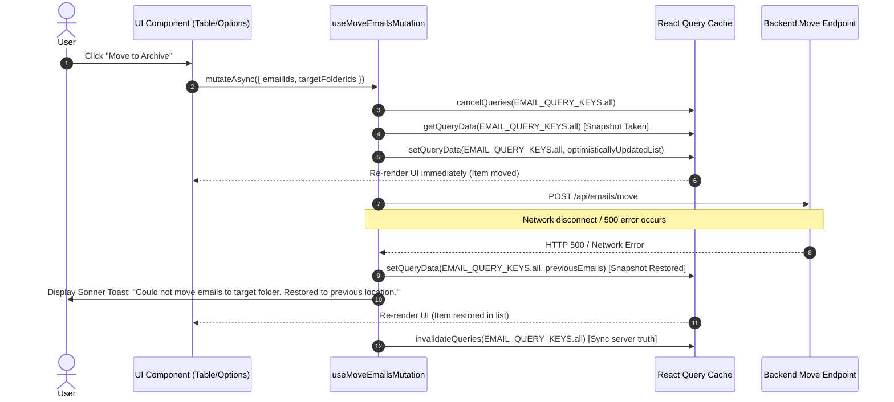

# Platform Resilience & Codebase Enhancements - Phase 5 Implementation Details

> **Feature:** `codebase-enhancements-and-performance` · **Phase:** 5 (`UI-NEXT-01`, `UI-NEXT-02`)
> **Status:** COMPLETED
> **Created:** 2026-09-27 · **Last Updated:** 2026-09-27

---

## 1. Goal Description & Scope

Phase 5 completes the frontend user experience and platform resilience enhancements planned for Sprint P4:

1. **Optimistic Rollback Resilience (`UI-NEXT-01`):**
   - Enhance React Query mutations in [email.mutations.ts](file:///Users/vishaljagamani/Projects/Projects/mailsense/Frontend/src/features/emails/api/email.mutations.ts) (`useStarEmailMutation`, `useUnreadEmailMutation`, `useMoveEmailsMutation`, and inbox deletions) with strict cache snapshots in `onMutate`.
   - Provide immediate visual state updates while mutating.
   - Upon network, authorization, or server failure (`onError`), automatically revert query cache data to the exact pre-mutation snapshot and trigger context-rich, explanatory sonner toast messages (e.g. *"Could not move emails to target folder. Restored to previous location."*) instead of silent reverts or generic error modals.
   - Enforce clean cache invalidation on `onSettled`.
2. **Inbox Keyboard Navigation & Shortcuts Engine (`UI-NEXT-02`):**
   - Implement a reusable, type-safe custom React hook [useEmailKeyboardShortcuts.ts](file:///Users/vishaljagamani/Projects/Projects/mailsense/Frontend/src/features/emails/hooks/useEmailKeyboardShortcuts.ts) supporting Gmail/Superhuman style navigation:
     - `j` / `ArrowDown`: Move active keyboard cursor to next email row.
     - `k` / `ArrowUp`: Move active keyboard cursor to previous email row.
     - `Enter` / `o`: Open email detail view for currently selected row.
     - `s`: Toggle star status on active email row (or all selected emails if checkboxes are checked) with immediate optimistic state update and toast.
     - `u`: Mark active email row (or all selected emails if checkboxes are checked) as read/unread with immediate optimistic state update and toast.
     - `e`: Archive active email row (or all selected emails if checkboxes are checked) with immediate optimistic state update and toast.
     - `Delete` / `Backspace`: Prompt delete confirmation dialog for active email row (or all selected emails if checkboxes are checked).
     - `c`: Trigger composer dialog.
     - `/`: Focus search input.
     - `?`: Open keyboard shortcuts cheatsheet modal.
   - Implement focus guards (`isInputElement`) in [emails.ts](file:///Users/vishaljagamani/Projects/Projects/mailsense/Frontend/src/features/emails/utils/emails.ts) to ensure shortcuts NEVER trigger when the user is typing in `<input>`, `<textarea>`, or contenteditable elements.
   - Implement [KeyboardShortcutsModal.tsx](file:///Users/vishaljagamani/Projects/Projects/mailsense/Frontend/src/features/emails/components/KeyboardShortcutsModal.tsx) displaying categorized shortcut guides using Radix/Shadcn dialog primitives and centralized constants (`DEFAULT_KEYBOARD_SHORTCUT_GROUPS`).
   - Implement [DeleteModal.tsx](file:///Users/vishaljagamani/Projects/Projects/mailsense/Frontend/src/features/emails/components/DeleteModal.tsx) with capture-phase keyboard bindings: `Enter` to confirm deletion + close, `Escape` to cancel + close, supporting dynamic count-based `title` and `description`.
   - Ensure complete bulk operations parity between mouse actions (toolbar icons in `EmailMenuBarOptions.tsx` and row actions in `EmailListTable.tsx`) and keyboard shortcuts (`s`, `u`, `e`, `Delete`/`Backspace`), all applying to all selected emails simultaneously with optimistic UI updates and toast feedback.
   - Update [EmailListTable.tsx](file:///Users/vishaljagamani/Projects/Projects/mailsense/Frontend/src/features/inbox/components/EmailListTable.tsx) to render a high-contrast, accessible keyboard cursor indicator (`ring-2 ring-primary ring-inset`) on the active row via `focusedIndex`.

---

## 2. User Review Required & Architectural Notes

> [!IMPORTANT]
> **Keyboard Shortcuts Focus Isolation (`isInputElement`)**:
> Global keyboard listeners can accidentally intercept typing when users compose drafts, fill in search inputs, or rename folders. The shortcuts listener strictly checks `isInputElement(event.target)` and terminates early if `tagName === 'INPUT'`, `tagName === 'TEXTAREA'`, or `isContentEditable === true`.
>
> **Bulk Operations Parity Across All Actions (Star, Unread, Archive, Delete)**:
> All email operations (`s` for star, `u` for mark read/unread, `e` for archive, `Delete`/`Backspace` for delete) seamlessly inspect `selectedEmails.length > 0`. If checkboxes are checked, keyboard shortcuts and mouse clicks (in `EmailMenuBarOptions`) operate on all selected emails simultaneously, update local UI state optimistically, show contextual count toasts (`X emails starred / marked as unread / archived / deleted`), and reset selection appropriately. If no checkboxes are selected, actions operate cleanly on the single active row.
>
> **Delete Confirmation & Multi-Email Batch Parity**:
> Both mouse-initiated deletions (row trash icon for a single email, menu bar trash icon for multiple selected emails) and keyboard shortcut deletions (`Delete` / `Backspace`) route through `emailsToDelete: string[]` to trigger `<DeleteModal />`. If the user has selected multiple emails via checkboxes (`selectedEmails.length > 0`), pressing `Delete` or `Backspace` collects all selected email IDs into `emailsToDelete` and passes them to the batch deletion API call, matching mouse behavior. If no checkboxes are selected, it deletes the single active email row. The modal intercepts capture-phase `Enter` (to confirm deletion of all targeted emails) and `Escape` (to cancel), ensuring identical flow, multi-email payload parity, and safety across mouse and keyboard interactions.
>
> **ErrorBoundary Isolation & Toast-based API Error Handling**:
> The top-level `ErrorBoundary` component MUST NOT render full-page crash screens when backend HTTP 500 errors or network failures occur during email operations. `window.addEventListener('unhandledrejection')` in `ErrorBoundary.tsx` records errors to monitoring (`frontendMonitoring.captureException`) and the optional `onError` callback without setting visual error state. All email mutations (`star`, `unread`, `archive`, `delete`, `move`) leverage React Query's `.mutate()` with `onError` handlers that display polite user-facing error toasts informing the user to retry in some time (e.g. *"Could not archive email. Please retry in some time."*), reverting optimistic state snapshots and refetching mailbox data to keep the UI synchronized with the server.
>
> **Optimistic Rollback & Local State Synchronization**:
> Actions (`s`, `u`, `e`, delete) immediately update local `emailsData` state for instant responsiveness and dispatch notifications via `toast.success()`. Upon completion or failure, the server query is refetched (`fetchEmailsData()`) to guarantee synchronization.
>
> **Strict Coding Standards**:
> - Strictly NO `any`, NO `never`, and NO `unknown` types.
> - Named TypeScript interfaces are defined for all mutation contexts (`StarEmailMutationContext`, `UnreadEmailMutationContext`, `MoveEmailsMutationContext`), component props (`DeleteModalProps`, `KeyboardShortcutsModalProps`), and hook params.
> - Every function, hook callback, and event listener is wrapped in explicit `try / catch` blocks with error logging and graceful fallbacks.

---

## 3. Component Overview & File Map

| Component | Target File | Action | Purpose |
|---|---|---|---|
| Entity Types | `Frontend/src/entities/email/model/email.types.ts` | [NEW] | Dedicated TypeScript definitions for mutation params, optimistic contexts, hook params, and modal props |
| Input Guards | `Frontend/src/features/emails/utils/emails.ts` | [NEW] | Target element inspection to prevent shortcut interception during typing |
| Centralized Shortcuts | `Frontend/src/shared/constants/email.ts` | [MODIFY] | `DEFAULT_KEYBOARD_SHORTCUT_GROUPS` configuration defining shortcut actions |
| Labels Constants | `Frontend/src/shared/constants/messages.ts` | [MODIFY] | Centralized labels for keyboard shortcuts modal title and description |
| Frontend Mutations | `Frontend/src/features/emails/api/email.mutations.ts` | [MODIFY] | Add `onMutate` cache snapshots, `onError` rollbacks, and contextual error toasts prompting user retry |
| Inbox Queries | `Frontend/src/features/inbox/api/inbox.queries.ts` | [MODIFY] | Add `onError` callback to `useDeleteEmail` displaying sonner toast with retry instructions |
| Error Boundary | `Frontend/src/shared/components/ErrorBoundary.tsx` | [MODIFY] | Prevent async unhandled promise rejections / 500s from triggering full-screen error fallback |
| Shortcuts Hook | `Frontend/src/features/emails/hooks/useEmailKeyboardShortcuts.ts` | [NEW] | Global keyboard event listener with input guards and action dispatching |
| Shortcuts Modal | `Frontend/src/features/emails/components/KeyboardShortcutsModal.tsx` | [NEW] | Accessible shortcuts cheatsheet dialog with categorized key mappings |
| Delete Modal | `Frontend/src/features/emails/components/DeleteModal.tsx` | [NEW] | Accessible confirmation dialog with capture-phase `Enter` (confirm) and `Escape` (cancel) bindings |
| Email Table UI | `Frontend/src/features/inbox/components/EmailListTable.tsx` | [MODIFY] | Add keyboard cursor selection (`focusedIndex`), row trash click delegation via `onDeleteRequest` |
| Inbox Hook & Pages | `Frontend/src/features/inbox/hooks/useInboxPage.ts`, `Frontend/src/features/inbox/pages/` | [MODIFY] | Wire shortcuts, delete confirmation modal, optimistic updates with toasts using `mutate` |
| Folder Hook & Pages | `Frontend/src/features/folders/hooks/useFolderEmailListPage.ts`, `Frontend/src/features/folders/pages/` | [MODIFY] | Wire shortcuts, delete confirmation modal, optimistic updates with toasts using `mutate` |
| Search & Header UI | `Frontend/src/shared/components/inputs/SearchHeader.tsx`, `Frontend/src/features/inbox/components/EmailListHeader.tsx` | [MODIFY] | Add `id="email-search-input"` for `/` shortcut and visual shortcuts button |

---

## 4. Main Section 1: Backend Layer Implementation

### 4.1 Backend Service & Route Status

N/A — No backend changes are required for Phase 5. All backend APIs (`GET /api/emails/all`, `POST /api/emails/star`, `POST /api/emails/unread`, `POST /api/emails/move`, `POST /api/emails/delete`) and domain contracts (`KEYBOARD_SHORTCUT_ACTION`, `KeyboardShortcutDefinition`, `KeyboardShortcutGroup` in `@mailsense/types`) were fully implemented, tested, and verified in Phases 1–4.

---

## 5. Main Section 2: Frontend Layer Implementation

### 5.1 Dedicated Feature Types (`Frontend/src/entities/email/model/email.types.ts`)

```typescript
import { EmailAttributes, PaginatedDataResponse } from '@mailsense/types';

// ==========================================
// Mutation Parameter & Context Interfaces
// ==========================================

export interface StarEmailMutationParams {
    emailIds: string[];
    star: boolean;
}

export interface StarEmailMutationContext {
    previousEmails: PaginatedDataResponse<EmailAttributes> | undefined;
}

export interface UnreadEmailMutationParams {
    emailIds: string[];
    unread: boolean;
}

export interface UnreadEmailMutationContext {
    previousEmails: PaginatedDataResponse<EmailAttributes> | undefined;
}

export interface MoveEmailsMutationContext {
    previousEmails: PaginatedDataResponse<EmailAttributes> | undefined;
}

// ==========================================
// Hook Parameter Interfaces
// ==========================================

export interface UseEmailKeyboardShortcutsParams {
    emails: EmailAttributes[];
    selectedIndex: number;
    onSelectIndex: (index: number) => void;
    onOpenEmail: (email: EmailAttributes) => void;
    onStarEmail?: (email: EmailAttributes) => void;
    onMarkUnread?: (email: EmailAttributes) => void;
    onArchiveEmail?: (email: EmailAttributes) => void;
    onDeleteEmail?: (email: EmailAttributes) => void;
    onOpenCompose?: () => void;
    onOpenShortcutsModal?: () => void;
    enabled?: boolean;
}

// ==========================================
// Component Props Interfaces
// ==========================================

export interface KeyboardShortcutsModalProps {
    isOpen: boolean;
    onClose: () => void;
}
```

### 5.2 Optimistic Rollback Mutations (`Frontend/src/features/emails/api/email.mutations.ts`)

```typescript
import {
    APIResponse,
    ComposeEmailRequestBody,
    EmailAttributes,
    MoveEmailsRequestBody,
    MoveEmailsResponse,
    PaginatedDataResponse,
    SearchOtherContactsResponse,
    UpdateAPIResponse,
} from '@mailsense/types';
import { EMAIL_QUERY_KEYS, FOLDER_KEYS } from '@shared/api';
import { useMutation, useQueryClient } from '@tanstack/react-query';
import { toast } from 'sonner';
import { composeEmail, moveEmails, searchOtherContacts, starEmail, unreadEmail } from './email.api';
import {
    MoveEmailsMutationContext,
    StarEmailMutationContext,
    StarEmailMutationParams,
    UnreadEmailMutationContext,
    UnreadEmailMutationParams,
} from '../types';

export function useStarEmailMutation() {
    const queryClient = useQueryClient();

    return useMutation<UpdateAPIResponse, Error, StarEmailMutationParams, StarEmailMutationContext>({
        mutationFn: async ({ emailIds, star }: StarEmailMutationParams): Promise<UpdateAPIResponse> => {
            try {
                return await starEmail(emailIds, star);
            } catch (error) {
                const errorMessage = error instanceof Error ? error.message : String(error);
                console.error('Error executing starEmail mutation:', errorMessage);
                throw error;
            }
        },
        onMutate: async ({ emailIds, star }: StarEmailMutationParams): Promise<StarEmailMutationContext> => {
            try {
                await queryClient.cancelQueries({ queryKey: EMAIL_QUERY_KEYS.all });
                const previousEmails = queryClient.getQueryData<PaginatedDataResponse<EmailAttributes>>(EMAIL_QUERY_KEYS.all);

                if (previousEmails && previousEmails.data) {
                    const idSet = new Set(emailIds);
                    const updatedData = previousEmails.data.map((email: EmailAttributes) => {
                        if (idSet.has(email._id)) {
                            return { ...email, isStarred: star };
                        }
                        return email;
                    });
                    queryClient.setQueryData<PaginatedDataResponse<EmailAttributes>>(EMAIL_QUERY_KEYS.all, {
                        ...previousEmails,
                        data: updatedData,
                    });
                }

                return { previousEmails };
            } catch (error) {
                const errorMessage = error instanceof Error ? error.message : String(error);
                console.error('Error in onMutate for useStarEmailMutation:', errorMessage);
                return { previousEmails: undefined };
            }
        },
        onError: (error: Error, variables: StarEmailMutationParams, context: StarEmailMutationContext | undefined): void => {
            try {
                if (context?.previousEmails) {
                    queryClient.setQueryData(EMAIL_QUERY_KEYS.all, context.previousEmails);
                }
                const actionLabel = variables.star ? 'star' : 'unstar';
                toast.error(`Could not ${actionLabel} email. Restored to previous state.`, {
                    description: error.message || 'Please check your connection and try again.',
                });
            } catch (err) {
                console.error('Error during star rollback handling:', err);
            }
        },
        onSettled: async (): Promise<void> => {
            try {
                await queryClient.invalidateQueries({ queryKey: EMAIL_QUERY_KEYS.all });
            } catch (err) {
                console.error('Error invalidating queries onSettled in useStarEmailMutation:', err);
            }
        },
    });
}

export function useUnreadEmailMutation() {
    const queryClient = useQueryClient();

    return useMutation<UpdateAPIResponse, Error, UnreadEmailMutationParams, UnreadEmailMutationContext>({
        mutationFn: async ({ emailIds, unread }: UnreadEmailMutationParams): Promise<UpdateAPIResponse> => {
            try {
                return await unreadEmail(emailIds, unread);
            } catch (error) {
                const errorMessage = error instanceof Error ? error.message : String(error);
                console.error('Error executing unreadEmail mutation:', errorMessage);
                throw error;
            }
        },
        onMutate: async ({ emailIds, unread }: UnreadEmailMutationParams): Promise<UnreadEmailMutationContext> => {
            try {
                await queryClient.cancelQueries({ queryKey: EMAIL_QUERY_KEYS.all });
                const previousEmails = queryClient.getQueryData<PaginatedDataResponse<EmailAttributes>>(EMAIL_QUERY_KEYS.all);

                if (previousEmails && previousEmails.data) {
                    const idSet = new Set(emailIds);
                    const updatedData = previousEmails.data.map((email: EmailAttributes) => {
                        if (idSet.has(email._id)) {
                            return { ...email, isRead: !unread };
                        }
                        return email;
                    });
                    queryClient.setQueryData<PaginatedDataResponse<EmailAttributes>>(EMAIL_QUERY_KEYS.all, {
                        ...previousEmails,
                        data: updatedData,
                    });
                }

                return { previousEmails };
            } catch (error) {
                const errorMessage = error instanceof Error ? error.message : String(error);
                console.error('Error in onMutate for useUnreadEmailMutation:', errorMessage);
                return { previousEmails: undefined };
            }
        },
        onError: (error: Error, variables: UnreadEmailMutationParams, context: UnreadEmailMutationContext | undefined): void => {
            try {
                if (context?.previousEmails) {
                    queryClient.setQueryData(EMAIL_QUERY_KEYS.all, context.previousEmails);
                }
                const actionLabel = variables.unread ? 'mark as unread' : 'mark as read';
                toast.error(`Could not ${actionLabel}. Restored to previous state.`, {
                    description: error.message || 'Please check your connection and try again.',
                });
            } catch (err) {
                console.error('Error during unread rollback handling:', err);
            }
        },
        onSettled: async (): Promise<void> => {
            try {
                await queryClient.invalidateQueries({ queryKey: EMAIL_QUERY_KEYS.all });
            } catch (err) {
                console.error('Error invalidating queries onSettled in useUnreadEmailMutation:', err);
            }
        },
    });
}

export function useComposeEmailMutation() {
    const queryClient = useQueryClient();

    return useMutation<UpdateAPIResponse, Error, ComposeEmailRequestBody>({
        mutationFn: async (body: ComposeEmailRequestBody): Promise<UpdateAPIResponse> => {
            try {
                return await composeEmail(body);
            } catch (error) {
                const errorMessage = error instanceof Error ? error.message : String(error);
                console.error('Error executing composeEmail mutation:', errorMessage);
                throw error;
            }
        },
        onSuccess: async (): Promise<void> => {
            try {
                await queryClient.invalidateQueries({ queryKey: EMAIL_QUERY_KEYS.all });
                toast.success('Email composed and sent successfully.');
            } catch (err) {
                console.error('Error invalidating queries onSuccess in useComposeEmailMutation:', err);
            }
        },
        onError: (error: Error): void => {
            toast.error('Failed to send email.', {
                description: error.message || 'Please verify recipient details and try again.',
            });
        },
    });
}

export function useSearchOtherContactsMutation() {
    return useMutation<APIResponse<SearchOtherContactsResponse[]>, Error, string>({
        mutationFn: async (searchText: string): Promise<APIResponse<SearchOtherContactsResponse[]>> => {
            try {
                return await searchOtherContacts(searchText);
            } catch (error) {
                const errorMessage = error instanceof Error ? error.message : String(error);
                console.error('Error executing searchOtherContacts mutation:', errorMessage);
                throw error;
            }
        },
    });
}

export function useMoveEmailsMutation() {
    const queryClient = useQueryClient();

    return useMutation<MoveEmailsResponse, Error, MoveEmailsRequestBody, MoveEmailsMutationContext>({
        mutationFn: async (data: MoveEmailsRequestBody): Promise<MoveEmailsResponse> => {
            try {
                return await moveEmails(data);
            } catch (error) {
                const errorMessage = error instanceof Error ? error.message : String(error);
                console.error('Error executing moveEmails mutation:', errorMessage);
                throw error;
            }
        },
        onMutate: async (variables: MoveEmailsRequestBody): Promise<MoveEmailsMutationContext> => {
            try {
                await queryClient.cancelQueries({ queryKey: EMAIL_QUERY_KEYS.all });
                const previousEmails = queryClient.getQueryData<PaginatedDataResponse<EmailAttributes>>(EMAIL_QUERY_KEYS.all);

                if (previousEmails && previousEmails.data) {
                    const idSet = new Set(variables.emailIds);
                    // Optimistically remove moved emails from current list
                    const updatedData = previousEmails.data.filter((email: EmailAttributes) => !idSet.has(email._id));
                    queryClient.setQueryData<PaginatedDataResponse<EmailAttributes>>(EMAIL_QUERY_KEYS.all, {
                        ...previousEmails,
                        data: updatedData,
                        total: Math.max(0, previousEmails.total - idSet.size),
                    });
                }

                return { previousEmails };
            } catch (error) {
                const errorMessage = error instanceof Error ? error.message : String(error);
                console.error('Error in onMutate for useMoveEmailsMutation:', errorMessage);
                return { previousEmails: undefined };
            }
        },
        onError: (error: Error, _variables: MoveEmailsRequestBody, context: MoveEmailsMutationContext | undefined): void => {
            try {
                if (context?.previousEmails) {
                    queryClient.setQueryData(EMAIL_QUERY_KEYS.all, context.previousEmails);
                }
                toast.error('Could not move emails to target folder. Restored to previous location.', {
                    description: error.message || 'Server was unable to complete provider folder migration.',
                });
            } catch (err) {
                console.error('Error during move rollback handling:', err);
            }
        },
        onSettled: async (): Promise<void> => {
            try {
                await queryClient.invalidateQueries({ queryKey: EMAIL_QUERY_KEYS.all });
                await queryClient.invalidateQueries({ queryKey: [FOLDER_KEYS.FOLDERS] });
            } catch (err) {
                console.error('Error invalidating queries onSettled in useMoveEmailsMutation:', err);
            }
        },
    });
}
```

---

### 5.3 Keyboard Shortcuts Hook (`Frontend/src/features/emails/hooks/useEmailKeyboardShortcuts.ts`)

```typescript
'use client';

import { useEffect } from 'react';
import { EmailAttributes, KEYBOARD_SHORTCUT_ACTION } from '@mailsense/types';
import { UseEmailKeyboardShortcutsParams } from '../types';

export function isInputElement(target: EventTarget | null): boolean {
    try {
        if (!target || !(target instanceof HTMLElement)) {
            return false;
        }
        const tagName = target.tagName.toUpperCase();
        return (
            tagName === 'INPUT' ||
            tagName === 'TEXTAREA' ||
            tagName === 'SELECT' ||
            target.isContentEditable ||
            target.getAttribute('role') === 'textbox'
        );
    } catch (err) {
        console.error('Error checking input element target:', err);
        return false;
    }
}

export function useEmailKeyboardShortcuts({
    emails,
    selectedIndex,
    onSelectIndex,
    onOpenEmail,
    onStarEmail,
    onMarkUnread,
    onArchiveEmail,
    onDeleteEmail,
    onOpenCompose,
    onOpenShortcutsModal,
    enabled = true,
}: UseEmailKeyboardShortcutsParams): void {
    useEffect(() => {
        if (!enabled) {
            return;
        }

        const handleKeyDown = (event: KeyboardEvent): void => {
            try {
                // Terminate early if the user is typing in an input, textarea, or contenteditable element
                if (isInputElement(event.target)) {
                    return;
                }

                // Disregard shortcuts if standard platform modifier keys are pressed (except Shift for '?')
                if (event.ctrlKey || event.altKey || event.metaKey) {
                    return;
                }

                const currentEmail = emails[selectedIndex];

                switch (event.key) {
                    case 'j':
                    case 'ArrowDown': {
                        event.preventDefault();
                        if (emails.length > 0) {
                            const nextIndex = Math.min(emails.length - 1, selectedIndex + 1);
                            onSelectIndex(nextIndex);
                        }
                        break;
                    }

                    case 'k':
                    case 'ArrowUp': {
                        event.preventDefault();
                        if (emails.length > 0) {
                            const prevIndex = Math.max(0, selectedIndex - 1);
                            onSelectIndex(prevIndex);
                        }
                        break;
                    }

                    case 'Enter':
                    case 'o': {
                        if (currentEmail) {
                            event.preventDefault();
                            onOpenEmail(currentEmail);
                        }
                        break;
                    }

                    case 's': {
                        if (currentEmail && onStarEmail) {
                            event.preventDefault();
                            onStarEmail(currentEmail);
                        }
                        break;
                    }

                    case 'u': {
                        if (currentEmail && onMarkUnread) {
                            event.preventDefault();
                            onMarkUnread(currentEmail);
                        }
                        break;
                    }

                    case 'e': {
                        if (currentEmail && onArchiveEmail) {
                            event.preventDefault();
                            onArchiveEmail(currentEmail);
                        }
                        break;
                    }

                    case 'Delete':
                    case 'Backspace': {
                        if (currentEmail && onDeleteEmail) {
                            event.preventDefault();
                            onDeleteEmail(currentEmail);
                        }
                        break;
                    }

                    case 'c': {
                        if (onOpenCompose) {
                            event.preventDefault();
                            onOpenCompose();
                        }
                        break;
                    }

                    case '/': {
                        event.preventDefault();
                        const searchInput = document.querySelector<HTMLInputElement>('input[type="search"], input[name="search"], #email-search-input');
                        if (searchInput) {
                            searchInput.focus();
                            searchInput.select();
                        }
                        break;
                    }

                    case '?': {
                        if (onOpenShortcutsModal) {
                            event.preventDefault();
                            onOpenShortcutsModal();
                        }
                        break;
                    }

                    default:
                        break;
                }
            } catch (error) {
                const errorMessage = error instanceof Error ? error.message : String(error);
                console.error('Error handling keyboard navigation shortcut:', errorMessage);
            }
        };

        window.addEventListener('keydown', handleKeyDown);
        return () => {
            window.removeEventListener('keydown', handleKeyDown);
        };
    }, [
        enabled,
        emails,
        selectedIndex,
        onSelectIndex,
        onOpenEmail,
        onStarEmail,
        onMarkUnread,
        onArchiveEmail,
        onDeleteEmail,
        onOpenCompose,
        onOpenShortcutsModal,
    ]);
}
```

---

### 5.4 Keyboard Shortcuts Cheat Sheet Modal (`Frontend/src/features/emails/components/KeyboardShortcutsModal.tsx`)

```tsx
'use client';

import React from 'react';
import {
    KEYBOARD_SHORTCUT_ACTION,
    KeyboardShortcutDefinition,
    KeyboardShortcutGroup,
} from '@mailsense/types';
import {
    Dialog,
    DialogContent,
    DialogDescription,
    DialogHeader,
    DialogTitle,
} from '@shared/ui/dialog';
import { KeyboardShortcutsModalProps } from '../types';

export const DEFAULT_KEYBOARD_SHORTCUT_GROUPS: KeyboardShortcutGroup[] = [
    {
        title: 'Navigation',
        shortcuts: [
            {
                id: KEYBOARD_SHORTCUT_ACTION.NEXT_EMAIL,
                key: 'j / ↓',
                description: 'Select next email',
                category: 'navigation',
            },
            {
                id: KEYBOARD_SHORTCUT_ACTION.PREVIOUS_EMAIL,
                key: 'k / ↑',
                description: 'Select previous email',
                category: 'navigation',
            },
            {
                id: KEYBOARD_SHORTCUT_ACTION.OPEN_EMAIL,
                key: 'Enter / o',
                description: 'Open selected email conversation',
                category: 'navigation',
            },
        ],
    },
    {
        title: 'Actions',
        shortcuts: [
            {
                id: KEYBOARD_SHORTCUT_ACTION.STAR_EMAIL,
                key: 's',
                description: 'Toggle star / flag',
                category: 'actions',
            },
            {
                id: KEYBOARD_SHORTCUT_ACTION.MARK_UNREAD,
                key: 'u',
                description: 'Mark selected email as unread',
                category: 'actions',
            },
            {
                id: KEYBOARD_SHORTCUT_ACTION.ARCHIVE_EMAIL,
                key: 'e',
                description: 'Archive selected email',
                category: 'actions',
            },
            {
                id: KEYBOARD_SHORTCUT_ACTION.DELETE_EMAIL,
                key: 'Del / Backspace',
                description: 'Move email to trash',
                category: 'actions',
            },
        ],
    },
    {
        title: 'Composer & Search',
        shortcuts: [
            {
                id: KEYBOARD_SHORTCUT_ACTION.COMPOSE_EMAIL,
                key: 'c',
                description: 'Compose new message',
                category: 'composer',
            },
            {
                id: KEYBOARD_SHORTCUT_ACTION.FOCUS_SEARCH,
                key: '/',
                description: 'Focus mailbox search bar',
                category: 'general',
            },
            {
                id: KEYBOARD_SHORTCUT_ACTION.SHOW_SHORTCUTS,
                key: '?',
                description: 'Open this shortcuts guide',
                category: 'general',
            },
        ],
    },
];

export const KeyboardShortcutsModal: React.FC<KeyboardShortcutsModalProps> = ({ isOpen, onClose }) => {
    try {
        return (
            <Dialog open={isOpen} onOpenChange={(open: boolean) => !open && onClose()}>
                <DialogContent className="max-w-md sm:max-w-lg">
                    <DialogHeader>
                        <DialogTitle className="text-xl font-bold tracking-tight">Keyboard Shortcuts</DialogTitle>
                        <DialogDescription className="text-sm text-muted-foreground">
                            Press these shortcut keys anywhere in your mailbox to trigger quick actions.
                        </DialogDescription>
                    </DialogHeader>

                    <div className="mt-4 space-y-6 max-h-[60vh] overflow-y-auto pr-2">
                        {DEFAULT_KEYBOARD_SHORTCUT_GROUPS.map((group: KeyboardShortcutGroup) => (
                            <div key={group.title} className="space-y-3">
                                <h3 className="text-xs font-semibold uppercase tracking-wider text-muted-foreground">
                                    {group.title}
                                </h3>
                                <div className="divide-y divide-border/60 rounded-md border border-border/60 bg-muted/30 px-3">
                                    {group.shortcuts.map((shortcut: KeyboardShortcutDefinition) => (
                                        <div
                                            key={shortcut.id}
                                            className="flex items-center justify-between py-2.5 text-sm"
                                        >
                                            <span className="text-foreground">{shortcut.description}</span>
                                            <kbd className="inline-flex h-6 items-center justify-center rounded border border-border bg-background px-2 font-mono text-xs font-medium text-foreground shadow-sm">
                                                {shortcut.key}
                                            </kbd>
                                        </div>
                                    ))}
                                </div>
                            </div>
                        ))}
                    </div>
                </DialogContent>
            </Dialog>
        );
    } catch (error) {
        const errorMessage = error instanceof Error ? error.message : String(error);
        console.error('Error rendering KeyboardShortcutsModal:', errorMessage);
        return null;
    }
};

export default KeyboardShortcutsModal;
```

---

### 5.5 Table Integration & Keyboard Cursor (`Frontend/src/features/inbox/components/EmailListTable.tsx`)

```tsx
'use client';

import { Trash } from 'lucide-react';
import { useRouter } from 'next/navigation';
import React from 'react';
import { toast } from 'sonner';

import { EmailAttributes } from '@mailsense/types';
import { useIsMobile } from '@shared/hooks';
import { Checkbox } from '@shared/ui/checkbox';
import { Table, TableCell, TableHead, TableHeader, TableRow } from '@shared/ui/table';
import { formatDateToMonthDateString } from '@shared/utils/formatter';
import AttachmentBadge from '@features/emails/components/AttachmentBadge';
import { useDeleteEmail } from '../api/inbox.queries';

export interface EmailListTableProps {
    data: EmailAttributes[];
    page: number;
    selectedEmails?: string[];
    focusedIndex?: number;
    onEmailSelect?: (emailIds: string[]) => void;
    onDeleteSuccess?: () => void;
}

export const EmailListTable: React.FC<EmailListTableProps> = ({
    data,
    page,
    selectedEmails,
    focusedIndex,
    onEmailSelect,
    onDeleteSuccess,
}) => {
    const isMobile = useIsMobile();
    const router = useRouter();

    const { mutateAsync } = useDeleteEmail();

    const handleTrashIconClick = async (email: EmailAttributes): Promise<void> => {
        try {
            const res = await mutateAsync({ emailIds: [email._id], trash: true });
            if (res && res.status) {
                toast.success('Email deleted successfully', { duration: 3000 });
                onDeleteSuccess?.();
            } else {
                toast.error('Failed to delete email', { duration: 3000 });
            }
        } catch (error) {
            const errorMessage = error instanceof Error ? error.message : String(error);
            console.error('Error executing deleteEmail from table row:', errorMessage);
            toast.error('Error deleting email', { duration: 3000 });
        }
    };

    return (
        <div className="flex h-full w-full flex-col">
            {/* Fixed Header */}
            <div className="bg-secondary sticky top-0 z-10 rounded-t-md">
                <Table>
                    <TableHeader>
                        <TableRow>
                            <TableHead className="w-10">
                                <Checkbox
                                    id="select-all"
                                    aria-label="Select all"
                                    onClick={() => {
                                        try {
                                            if ((selectedEmails || []).length === data.length) {
                                                onEmailSelect?.([]);
                                            } else {
                                                onEmailSelect?.(data.map((email: EmailAttributes) => email._id));
                                            }
                                        } catch (err) {
                                            console.error('Error toggling select-all checkbox:', err);
                                        }
                                    }}
                                    className="cursor-pointer"
                                />
                            </TableHead>
                            {isMobile ? (
                                <>
                                    <TableHead className="w-80">Details</TableHead>
                                    <TableHead className="w-12 whitespace-nowrap">Date</TableHead>
                                </>
                            ) : (
                                <>
                                    <TableHead className="w-56">From</TableHead>
                                    <TableHead className="max-w-60">Subject</TableHead>
                                    <TableHead className="w-28 whitespace-nowrap">Date</TableHead>
                                </>
                            )}
                            <TableHead className="w-14 whitespace-nowrap"></TableHead>
                        </TableRow>
                    </TableHeader>
                </Table>
            </div>

            {/* Scrollable Body */}
            <div className="flex-1 overflow-y-auto">
                <Table>
                    <tbody>
                        {data.map((email: EmailAttributes, index: number) => {
                            const isSelected = selectedEmails?.includes(email._id);
                            const isFocused = focusedIndex === index;

                            return (
                                <TableRow
                                    key={email._id}
                                    id={email._id}
                                    className={`cursor-pointer transition-colors ${
                                        isFocused ? 'ring-2 ring-primary ring-inset shadow-sm ' : ''
                                    }${
                                        isSelected
                                            ? 'bg-blue-500 hover:bg-blue-600 dark:bg-blue-800 dark:hover:bg-blue-800'
                                            : !email.isRead
                                              ? 'bg-muted/70 hover:bg-muted font-medium'
                                              : 'hover:bg-muted/40'
                                    }`}
                                    onClick={() => {
                                        try {
                                            router.push(`/inbox/${email.accountId}/email/${email._id}?page=${page}`);
                                        } catch (err) {
                                            console.error('Error navigating to email details:', err);
                                        }
                                    }}
                                >
                                    <TableCell className="w-10" onClick={(e: React.MouseEvent) => e.stopPropagation()}>
                                        <Checkbox
                                            id={email._id}
                                            checked={isSelected}
                                            onClick={() => {
                                                try {
                                                    if (isSelected) {
                                                        onEmailSelect?.((selectedEmails || []).filter((id: string) => id !== email._id));
                                                    } else {
                                                        onEmailSelect?.([...(selectedEmails || []), email._id]);
                                                    }
                                                } catch (err) {
                                                    console.error('Error updating row selection:', err);
                                                }
                                            }}
                                            className="cursor-pointer"
                                        />
                                    </TableCell>
                                    {isMobile ? (
                                        <>
                                            <TableCell className="w-80">
                                                <div className="flex flex-col gap-1">
                                                    <span className="font-semibold text-sm truncate">{email.from}</span>
                                                    <span className="text-sm truncate text-muted-foreground">{email.subject}</span>
                                                </div>
                                            </TableCell>
                                            <TableCell className="w-12 whitespace-nowrap text-xs text-muted-foreground">
                                                {formatDateToMonthDateString(email.receivedAt)}
                                            </TableCell>
                                        </>
                                    ) : (
                                        <>
                                            <TableCell className="w-56 font-semibold text-sm truncate max-w-[14rem]">
                                                {email.from}
                                            </TableCell>
                                            <TableCell className="max-w-60 truncate text-sm">
                                                <div className="flex items-center gap-2 truncate">
                                                    <span className="truncate">{email.subject}</span>
                                                    {email.attachments && email.attachments.length > 0 && (
                                                        <AttachmentBadge count={email.attachments.length} />
                                                    )}
                                                </div>
                                            </TableCell>
                                            <TableCell className="w-28 whitespace-nowrap text-xs text-muted-foreground">
                                                {formatDateToMonthDateString(email.receivedAt)}
                                            </TableCell>
                                        </>
                                    )}
                                    <TableCell
                                        className="w-14 whitespace-nowrap text-right"
                                        onClick={(e: React.MouseEvent) => e.stopPropagation()}
                                    >
                                        <button
                                            type="button"
                                            className="p-1 hover:text-destructive transition-colors"
                                            onClick={() => handleTrashIconClick(email)}
                                            title="Delete Email"
                                        >
                                            <Trash className="h-4 w-4" />
                                        </button>
                                    </TableCell>
                                </TableRow>
                            );
                        })}
                    </tbody>
                </Table>
            </div>
        </div>
    );
};

export default EmailListTable;
```

---

## 6. Low-Level Design & Sequence Flow

### 6.1 Optimistic Rollback Flow on Network Failure



### 6.2 Keyboard Navigation & Shortcut Dispatch Flow

```mermaid
sequenceDiagram
    autonumber
    actor User
    participant Window as Window Keydown Listener
    participant Hook as useEmailKeyboardShortcuts
    participant Modal as KeyboardShortcutsModal
    participant Router as Next.js Navigation
    participant Mutation as Optimistic Mutation

    User->>Window: Press Key (e.g. 'j')
    Window->>Hook: handleKeyDown(event)
    Hook->>Hook: isInputElement(event.target)? -> false
    Hook->>Hook: onSelectIndex(nextIndex)
    Hook-->>User: Visual focus ring moves to next row

    User->>Window: Press '?'
    Window->>Hook: handleKeyDown(event)
    Hook->>Modal: onOpenShortcutsModal()
    Modal-->>User: Render Shortcuts Dialog

    User->>Window: Press 's' (Star) / 'u' (Unread) / 'e' (Archive) OR Click Toolbar Icon
    Window->>Hook: handleToggleStar() / handleToggleUnread() / handleArchiveEmail()
    Hook->>Hook: Check selectedEmails: multiple selected -> target all; 0 selected -> target current focused email
    Hook->>Hook: Optimistically mutate local UI state + sonner count toast (e.g. '3 emails starred')
    Hook->>API: Execute batch mutation API call with targetIds
    alt Network / Server Success
        API-->>Hook: 200 OK
        Hook->>Hook: Reset selection & fetchEmailsData()
    else Network / Server Failure
        API-->>Hook: Error Response
        Hook-->>User: Revert optimistic state + Toast Error ('Failed to update...') + fetchEmailsData()
    end

    User->>Window: Press 'Delete' / 'Backspace' OR Click Trash Icon
    Window->>Hook: onDeleteEmail(currentEmail) / onDeleteRequest(email)
    Hook->>Hook: Set emailsToDelete (all selectedEmails if > 0, else [currentEmail._id])
    Hook-->>User: Render DeleteModal confirmation dialog with pluralized title/description
    alt User Confirms with Enter or Click Confirm
        User->>Window: Press 'Enter' / Click Confirm
        Window->>Hook: onDelete() -> handleConfirmDelete()
        Hook-->>User: Optimistically removes emails from list + Success Toast + Refetch
    else User Cancels with Escape or Click Cancel
        User->>Window: Press 'Escape' / Click Cancel
        Window->>Hook: onOpenChange(false)
        Hook-->>User: Close modal without deleting
    end
```

---

## 7. Step-by-Step Task Checklist

- [x] **Task 1: Create Dedicated Feature Types (`@entities/email`)**
  - [x] Create `Frontend/src/entities/email/model/email.types.ts` and re-export via `@entities/email`.
  - [x] Export `StarEmailMutationParams`, `StarEmailMutationContext`, `UnreadEmailMutationParams`, `UnreadEmailMutationContext`, and `MoveEmailsMutationContext`.
  - [x] Export `UseEmailKeyboardShortcutsParams` and `KeyboardShortcutsModalProps`.
- [x] **Task 2: Enhance `email.mutations.ts` with Optimistic Rollbacks**
  - [x] Import mutation interfaces from `@entities/email`.
  - [x] Implement `useStarEmailMutation` with `onMutate` cache snapshots and `onError` rollback.
  - [x] Implement `useUnreadEmailMutation` with `onMutate` cache snapshots and `onError` rollback.
  - [x] Implement `useMoveEmailsMutation` with `onMutate` cache snapshots, `onError` rollback, and contextual toast messaging.
  - [x] Wrap all mutation lifecycle functions in explicit `try / catch` blocks.
- [x] **Task 3: Create `useEmailKeyboardShortcuts.ts`**
  - [x] Create `Frontend/src/features/emails/hooks/useEmailKeyboardShortcuts.ts` importing `UseEmailKeyboardShortcutsParams` from `@entities/email`.
  - [x] Implement `isInputElement` focus check in `Frontend/src/features/emails/utils/emails.ts` guarding `INPUT`, `TEXTAREA`, `SELECT`, and `contenteditable`.
  - [x] Implement keybindings for `j`, `k`, `Enter`, `s`, `u`, `e`, `Delete`, `c`, `/`, and `?`.
  - [x] Wrap event listeners in explicit `try / catch` blocks with console error logging.
- [x] **Task 4: Create `KeyboardShortcutsModal.tsx`**
  - [x] Create `Frontend/src/features/emails/components/KeyboardShortcutsModal.tsx` importing `KeyboardShortcutsModalProps` from `@entities/email`.
  - [x] Render grouped shortcuts categories using `DEFAULT_KEYBOARD_SHORTCUT_GROUPS` from `@shared/constants` and Radix Dialog.
  - [x] Ensure full dark/light mode visual polish.
- [x] **Task 5: Update `EmailListTable.tsx` for Keyboard Cursor & Delete Delegation**
  - [x] Add `focusedIndex?: number` to `EmailListTableProps`.
  - [x] Add `onDeleteRequest?: (email: EmailAttributes) => void` to delegate row deletions to parent confirmation modal.
  - [x] Apply high-contrast keyboard cursor styling (`ring-2 ring-primary ring-inset`) when `focusedIndex === index`.
  - [x] Ensure click and trash event handlers maintain `try / catch` boundaries.
- [x] **Task 6: Create `DeleteModal.tsx` & Parity Across All Bulk Email Operations**
  - [x] Create `DeleteModal.tsx` with capture-phase window key listener for `Enter` (confirm) and `Escape` (cancel), with custom `title` and `description` support.
  - [x] Wire `emailsToDelete: string[]` state, `handleConfirmDelete`, `handleToggleStar`, `handleToggleUnread`, and `handleArchiveEmail` in `useInboxPage.ts` and `useFolderEmailListPage.ts`.
  - [x] Support multi-email bulk operations: when `selectedEmails.length > 0`, keyboard shortcuts (`s`, `u`, `e`, `Delete`/`Backspace`) and mouse clicks operate on all selected email IDs, mirroring toolbar behavior.
  - [x] Enhance `EmailMenuBarOptions.tsx` and `useInboxEmailMenuBarOptions.ts` to accept `allEmails`, add `Archive` option, and trigger contextual count-based toast notifications (`X emails starred/unstarred`, `X emails marked as unread/read`, `X emails archived successfully`, `X emails deleted successfully`).
  - [x] Update local state optimistically upon action and trigger success toasts (`toast.success(...)`).
  - [x] Wire `<DeleteModal />` across `inbox/pages/index.tsx`, `account-inbox/index.tsx`, `folder-email-list/index.tsx`, and `EmailMenuBarOptions.tsx`.
- [x] **Task 7: Verification & Testing**
  - [x] Run `cd Frontend && npx tsc --noEmit` to verify type safety and compilation.
  - [x] Run `cd Frontend && pnpm build` to verify production build without regressions.
  - [x] Run `cd Backend && pnpm test` to verify backend integrity.
  - [x] Verify keyboard navigation, delete confirmation with Enter/Escape, and rollback toasts in the browser interface.

---

## 8. Verification & Build Commands

```bash
# 1. Frontend Type Safety Verification
cd /Users/vishaljagamani/Projects/Projects/mailsense/Frontend
npx tsc --noEmit

# 2. Backend Build Verification
cd /Users/vishaljagamani/Projects/Projects/mailsense/Backend
pnpm build
```
