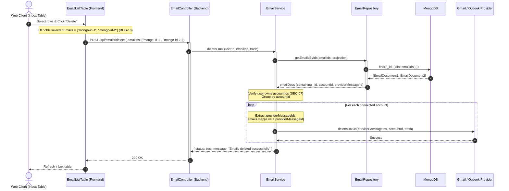
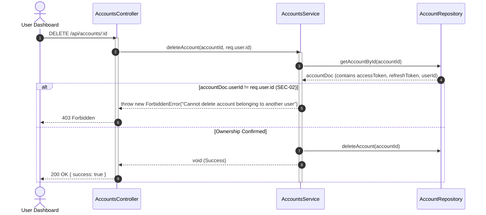
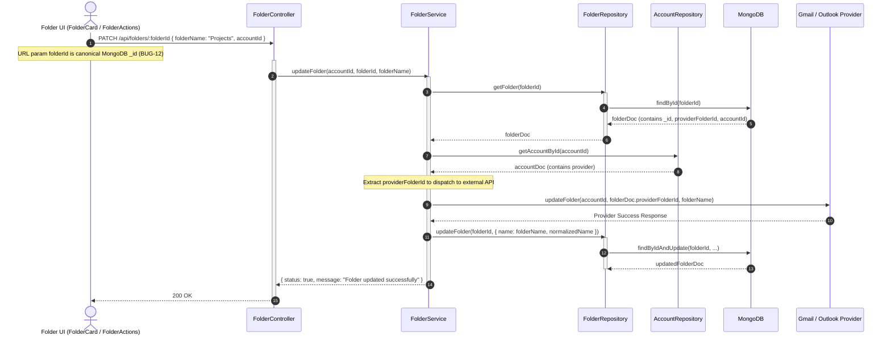
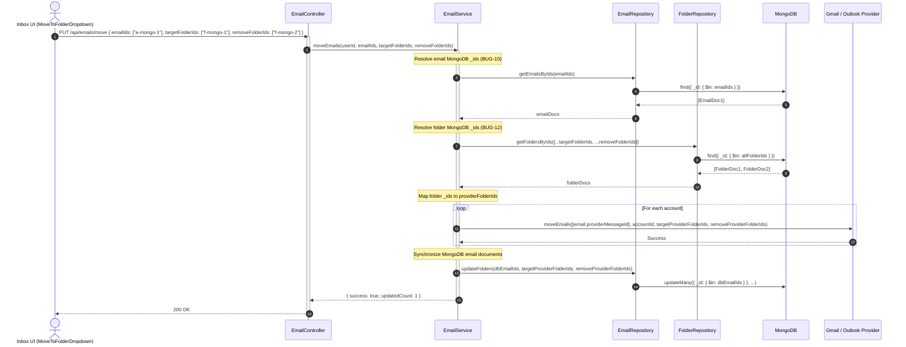

# Codebase Hardening & Stabilization - Phase 1 Implementation Details

> **Feature:** `codebase-hardening-and-stabilization` · **Phase:** 1 (Bugs & Security Hotfixes)
> **Status:** COMPLETED
> **Created:** 2026-09-22 · **Last Updated:** 2026-09-24

---

## 1. Goal Description & Scope

This phase resolves all 12 active bugs, critical security vulnerabilities, and architectural boundary violations surfaced during the comprehensive codebase health audit across the MailSense project.

Specifically, Phase 1 accomplishes:
1. **Security Vulnerability Remediation:**
   - **SEC-01 / BUG-03:** Re-enable and enforce staged attachment ownership validation in [email.service.ts](file:///Users/vishaljagamani/Projects/Projects/mailsense/Backend/src/modules/emails/email.service.ts), guaranteeing a tenant cannot attach or access staged files uploaded by another user.
   - **SEC-02:** Enforce caller ownership validation (`account.userId === userId`) across destructive and operational account operations (`deleteAccount`, `syncAccount`, `enableAccount`) in [account.service.ts](file:///Users/vishaljagamani/Projects/Projects/mailsense/Backend/src/modules/accounts/account.service.ts).
   - **SEC-03:** Redact sensitive OAuth credentials (`accessToken`, `refreshToken`) from client-facing API responses by returning `SanitizedAccountAttributes` from `@mailsense/types` in [account.service.ts](file:///Users/vishaljagamani/Projects/Projects/mailsense/Backend/src/modules/accounts/account.service.ts).
   - **SEC-07:** Verify authenticated caller ownership over target emails before executing folder move operations (`moveEmails`).
2. **Crash Hazard & Control Flow Fixes:**
   - **BUG-06:** Add missing `return` statement following `res.status(400)` in `searchEmails` in [email.controller.ts](file:///Users/vishaljagamani/Projects/Projects/mailsense/Backend/src/modules/emails/email.controller.ts) to prevent `ERR_HTTP_HEADERS_SENT` crashes.
   - **BUG-07:** Add missing `return` statement following `res.status(404)` in `getAccountDetails` in [account.controller.ts](file:///Users/vishaljagamani/Projects/Projects/mailsense/Backend/src/modules/accounts/account.controller.ts) to prevent `ERR_HTTP_HEADERS_SENT` crashes.
3. **Functional Defect Fixes:**
   - **BUG-02:** Fix folder search in [folder.service.ts](file:///Users/vishaljagamani/Projects/Projects/mailsense/Backend/src/modules/folders/folder.service.ts) to filter on the actual folder `name` attribute instead of non-existent `subject`/`from` fields.
   - **BUG-04:** Correct `searchEmails` pagination total count in [email.service.ts](file:///Users/vishaljagamani/Projects/Projects/mailsense/Backend/src/modules/emails/email.service.ts) by executing `EmailRepository.countDocuments(searchQuery)` rather than returning page slice length.
   - **BUG-05:** Replace hardcoded `http://localhost:3000/auth` URL in [client.ts](file:///Users/vishaljagamani/Projects/Projects/mailsense/Frontend/src/shared/api/client.ts) with configurable environment configuration.
   - **BUG-08:** Replace unstructured `Object.assign(new Error(...))` in [account.service.ts](file:///Users/vishaljagamani/Projects/Projects/mailsense/Backend/src/modules/accounts/account.service.ts) with `NotFoundError` and `BadRequestError`.
   - **BUG-09:** Forward `cc`, `bcc`, `inReplyTo`, and `attachmentIds` when dispatching saved drafts in [draft.service.ts](file:///Users/vishaljagamani/Projects/Projects/mailsense/Backend/src/modules/drafts/draft.service.ts).
   - **BUG-11:** Return the actual `page` parameter in `FolderService.getAllFolders` instead of hardcoded `page: 1`.
4. **Architectural Boundary Enforcement (MongoDB `_id` Exclusivity & Backend Provider ID Resolution):**
   - **BUG-10 (Email ID Boundary):** Enforce that the Frontend client exclusively references and passes MongoDB `_id` (`email._id`) for all selection state, detail views, and batch actions (`deleteEmail`, `starEmails`, `unreadEmails`, `archiveEmails`, `moveEmails`). In the Backend, implement `EmailRepository.getEmailsByIds` to look up documents by `_id: { $in: emailIds }`, extract `email.providerMessageId`, and pass the provider message ID to external provider adapters (Gmail / Outlook).
   - **BUG-12 (Folder ID Boundary):** Enforce that the Frontend client exclusively references and passes MongoDB `_id` (`folder._id` / `folder.id`) across all folder components and operations (`MoveToFolderDropdown`, `FolderCardActions`, `FolderCardHeader`, `FolderCard`, `useFolderEmailListPage`, `useInboxPage`). In the Backend, resolve MongoDB `folder._id` to `folder.providerFolderId` before invoking provider API methods, synchronize folder updates/deletions in MongoDB, resolve folder filter IDs in `EmailService.getEmails`, and restore `EmailRepository.updateFolders` in `EmailService.moveEmails`.

---

## 2. User Review Required & Architectural Notes

> [!IMPORTANT]
> **Strict MongoDB `_id` Architectural Boundary & Backend Provider ID Resolution**
>
> 1. **MongoDB `_id` Exclusivity in Frontend:** The frontend application layer MUST NEVER manipulate or dispatch `providerMessageId` or `providerFolderId` for UI actions, selection state, routes, or API mutations. Every email and folder API call from the frontend strictly passes canonical MongoDB `_id`. This eliminates mixed-ID bugs, simplifies React Query cache invalidation, and insulates UI components from third-party provider schema idiosyncrasies.
> 2. **Backend Provider Email ID Resolution:** When the backend receives `emailIds: string[]`, it executes `EmailRepository.getEmailsByIds(emailIds)` using `{ _id: { $in: emailIds } }`. From the resolved email documents, it extracts `email.providerMessageId` and invokes provider strategy methods (`provider.deleteEmails(providerMessageIds, ...)`, `provider.moveEmails(...)`, `provider.starEmails(...)`).
> 3. **Backend Provider Folder ID Resolution:** When the backend receives `folderId` or folder ID arrays (`targetFolderIds`, `removeFolderIds`, `filters.folders`), it resolves them against MongoDB using `FolderRepository.getFolder(folderId)` or `FolderRepository.getFoldersByIds(folderIds)`. From the resolved folder documents, it extracts `providerFolderId` before calling third-party provider APIs (`provider.updateFolder`, `provider.deleteFolder`, `provider.moveEmails`).
> 4. **Database State Synchronization on Folder Mutations:** In `FolderService.updateFolder` and `deleteFolder`, the backend updates or deletes the MongoDB document via `FolderRepository.updateFolder` / `FolderRepository.deleteFolder` in addition to calling the provider. In `EmailService.moveEmails`, the backend synchronizes `Email.folders` in MongoDB using `EmailRepository.updateFolders`.
> 5. **Token Redaction at Controller / Service Boundary:** Database queries in `AccountRepository` continue to load token attributes when needed by internal background workers or provider sync strategy instances. However, all public service methods returning account records to controllers (`getAccountDetails`, `getAccounts`) must sanitize the document into `SanitizedAccountAttributes`, completely stripping `accessToken` and `refreshToken` before transmission.
> 6. **Staged Attachment Multi-Tenant Boundary (SEC-01 / BUG-03):** In `composeEmailWithAttachments`, each attachment ID is looked up in object storage metadata. We verify `stagedAttachment.userId.toString() === userId.toString()` and `stagedAttachment.accountId === accountId`. If either fails, execution halts with a `ForbiddenError`. *(Note: Lines 479-482 in `email.service.ts` are temporarily commented out during local intermediate development to facilitate ease of rapid testing, and will be re-enabled/uncommented during full UI end-to-end testing of this feature).*
> 7. **Repository Layer Error Bubbling:** Repository methods encapsulate MongoDB Mongoose queries (`find`, `findById`, `findByIdAndUpdate`, `deleteOne`, etc.) and return raw documents/promises to the service layer. Error catching and structured domain logging are centralized in the calling service methods (e.g., `FolderService`, `EmailService`), avoiding redundant double-catch wrappers in the data access layer.

---

## 3. Component Overview & File Map

| Component | Target File | Action | Purpose |
|---|---|---|---|
| **Backend / Emails** | `Backend/src/modules/emails/email.repository.ts` | [MODIFY] | Add `getEmailsByIds` (`{ _id: { $in: emailIds } }`), `countDocuments`, and verify `updateFolders` |
| **Backend / Emails** | `Backend/src/modules/emails/email.service.ts` | [MODIFY] | Uncomment attachment validation (SEC-01), fix search pagination total (BUG-04), verify ownership on move (SEC-07), resolve providerMessageId from MongoDB `_id` (BUG-10), resolve folder IDs & restore `updateFolders` in `moveEmails`, resolve folder filter IDs in `getEmails` |
| **Backend / Emails** | `Backend/src/modules/emails/email.controller.ts` | [MODIFY] | Add missing `return` on 400 exit in `searchEmails` (BUG-06) |
| **Backend / Accounts** | `Backend/src/modules/accounts/account.service.ts` | [MODIFY] | Strip tokens (SEC-03), verify `userId` ownership on delete/sync/enable (SEC-02), use domain errors (BUG-08) |
| **Backend / Accounts** | `Backend/src/modules/accounts/account.controller.ts` | [MODIFY] | Add missing `return` on 404 exit in `getAccountDetails` (BUG-07), pass `req.user.id` to service methods |
| **Backend / Folders** | `Backend/src/modules/folders/folder.repository.ts` | [MODIFY] | Add `getFoldersByIds`, `updateFolder`, `deleteFolder` using MongoDB `_id` |
| **Backend / Folders** | `Backend/src/modules/folders/folder.service.ts` | [MODIFY] | Fix folder search query on `name` (BUG-02), return dynamic `page` number (BUG-11), resolve `providerFolderId` from MongoDB `_id` in `updateFolder` & `deleteFolder`, synchronize DB state |
| **Backend / Drafts** | `Backend/src/modules/drafts/draft.service.ts` | [MODIFY] | Forward `cc`, `bcc`, `inReplyTo`, and `attachmentIds` on `sendDraft` (BUG-09) |
| **Frontend / Config** | `Frontend/src/config/config.ts` | [MODIFY] | Export `AUTH_API_BASE_URL` constant with environment fallback |
| **Frontend / Shared** | `Frontend/src/shared/api/client.ts` | [MODIFY] | Use `AUTH_API_BASE_URL` for `auth0ApiClient` (BUG-05) |
| **Frontend / Inbox** | `Frontend/src/features/inbox/components/EmailListTable.tsx` | [MODIFY] | Replace all `email.providerMessageId` with `email._id` in selection, checkboxes, trash actions, and row DOM id (BUG-10) |
| **Frontend / Inbox** | `Frontend/src/features/inbox/hooks/useInboxPage.ts` | [MODIFY] | Use `folder.id` instead of `folder.providerFolderId` in filter dropdown options (BUG-12) |
| **Frontend / Emails** | `Frontend/src/features/emails/hooks/useEmailsPage.ts` | [MODIFY] | Pass `emailData?._id` to `unreadEmail` mutation instead of `providerMessageId` (BUG-10) |
| **Frontend / Emails** | `Frontend/src/features/emails/pages/index.tsx` | [MODIFY] | Pass `emailId={emailData?._id || ''}` to `ThreadView` (BUG-10) |
| **Frontend / Emails** | `Frontend/src/features/emails/components/MoveToFolderDropdown.tsx` | [MODIFY] | Filter `allEmails` strictly using `email._id` (BUG-10); pass canonical `folder._id` to `handleSelectFolder` (BUG-12) |
| **Frontend / Folders** | `Frontend/src/features/folders/components/folder-card/FolderCardHeader.tsx` | [MODIFY] | Pass canonical `data._id` to `handleUpdateFolder` (BUG-12) |
| **Frontend / Folders** | `Frontend/src/features/folders/components/folder-card/FolderCardActions.tsx` | [MODIFY] | Pass canonical `data._id` to `deleteFolder` (BUG-12) |
| **Frontend / Folders** | `Frontend/src/features/folders/components/body/FolderCard.tsx` | [MODIFY] | Pass canonical `data._id` to `handleUpdateFolder` and `deleteFolder` (BUG-12) |
| **Frontend / Folders** | `Frontend/src/features/folders/hooks/useFolderEmailListPage.ts` | [MODIFY] | Pass `folders: folder?._id ? [folder._id] : undefined` in `refetchEmails` filters (BUG-12) |

---

## 4. Main Section 1: Backend Layer Implementation

### 4.1 Repository Layer (`Backend/src/modules/emails/email.repository.ts`)

Update `EmailRepository` with MongoDB `_id` batch query resolution and explicit count querying for search:

```typescript
import { FilterQuery, FlattenMaps, ProjectionType, SortOrder } from 'mongoose';
import { Email, EmailDocument } from './email.model.js';
import { createLogger, LOGGER_MODULE } from '../../core/logger/logger.js';

const logger = createLogger(LOGGER_MODULE.EMAIL_SERVICE);

export class EmailRepository {
    /**
     * Resolves email documents matching MongoDB _id array.
     * Guarantees that frontend API calls passing internal _id strings resolve reliably.
     */
    public static async getEmailsByIds(
        emailIds: string[],
        fields: ProjectionType<EmailDocument> = {}
    ): Promise<FlattenMaps<EmailDocument>[]> {
        try {
            if (!emailIds || emailIds.length === 0) {
                return [];
            }

            return await Email.find({ _id: { $in: emailIds } }, fields).lean();
        } catch (error) {
            const errorMessage = error instanceof Error ? error.message : String(error);
            logger.error(`Error in EmailRepository.getEmailsByIds: ${errorMessage}`, {
                emailIds,
                error,
            });
            throw error;
        }
    }

    /**
     * Preserved for internal provider sync / webhook processors that only have external provider IDs.
     */
    public static async getEmailsByProviderMessageIds(
        providerMessageIds: string[],
        fields: ProjectionType<EmailDocument> = {}
    ): Promise<FlattenMaps<EmailDocument>[]> {
        try {
            if (!providerMessageIds || providerMessageIds.length === 0) {
                return [];
            }

            return await Email.find({ providerMessageId: { $in: providerMessageIds } }, fields).lean();
        } catch (error) {
            const errorMessage = error instanceof Error ? error.message : String(error);
            logger.error(`Error in EmailRepository.getEmailsByProviderMessageIds: ${errorMessage}`, {
                providerMessageIds,
                error,
            });
            throw error;
        }
    }

    /**
     * Executes count query on emails matching search criteria.
     */
    public static async countDocuments(searchQuery: FilterQuery<EmailDocument>): Promise<number> {
        try {
            return await Email.countDocuments(searchQuery);
        } catch (error) {
            const errorMessage = error instanceof Error ? error.message : String(error);
            logger.error(`Error in EmailRepository.countDocuments: ${errorMessage}`, { error });
            throw error;
        }
    }

    /**
     * Updates folder memberships in bulk on MongoDB Email documents.
     */
    public static async updateFolders(
        emailIds: string[],
        targetFolderIds: string[],
        removeFolderIds: string[] = []
    ): Promise<void> {
        try {
            if (!emailIds || emailIds.length === 0) return;

            if (removeFolderIds && removeFolderIds.length > 0) {
                await Email.updateMany(
                    { _id: { $in: emailIds } },
                    { $pull: { folders: { $in: removeFolderIds } } }
                );
            }

            if (targetFolderIds && targetFolderIds.length > 0) {
                await Email.updateMany(
                    { _id: { $in: emailIds } },
                    { $addToSet: { folders: { $each: targetFolderIds } } }
                );
            }
        } catch (error) {
            const errorMessage = error instanceof Error ? error.message : String(error);
            logger.error(`Error in EmailRepository.updateFolders: ${errorMessage}`, {
                emailIds,
                targetFolderIds,
                removeFolderIds,
                error,
            });
            throw error;
        }
    }
}
```

#### 4.1.2 Folders Repository (`Backend/src/modules/folders/folder.repository.ts`)

Add MongoDB `_id` resolution for batch folder lookups, single folder retrieval, and database mutation synchronization:

```typescript
import { AnyBulkWriteOperation, FilterQuery, ProjectionType, SortOrder } from 'mongoose';
import { Folder, FolderDocument, FolderInput } from './folder.model.js';

export class FolderRepository {
    /**
     * Retrieves folder document by canonical MongoDB _id.
     */
    public static async getFolder(folderId: string): Promise<FolderDocument | null> {
        return await Folder.findById(folderId);
    }

    /**
     * Resolves multiple folders by canonical MongoDB _id array.
     */
    public static async getFoldersByIds(folderIds: string[]): Promise<FolderDocument[]> {
        if (!folderIds || folderIds.length === 0) return [];
        return await Folder.find({ _id: { $in: folderIds } });
    }

    /**
     * Updates folder document by canonical MongoDB _id.
     */
    public static async updateFolder(folderId: string, folder: Partial<FolderDocument>): Promise<FolderDocument | null> {
        return await Folder.findByIdAndUpdate(folderId, folder, { new: true });
    }

    /**
     * Deletes folder document by canonical MongoDB _id.
     */
    public static async deleteFolder(folderId: string): Promise<void> {
        await Folder.findByIdAndDelete(folderId);
    }

    public static async getAllFolders(
        filterQuery: FilterQuery<FolderDocument>,
        size: number,
        page: number,
        fields: ProjectionType<FolderDocument>,
        sort: Record<string, SortOrder>
    ): Promise<FolderDocument[]> {
        return await Folder.find(filterQuery, fields)
            .skip((page - 1) * size)
            .limit(size)
            .sort(sort);
    }

    public static async countDocuments(filterQuery: Record<string, unknown>): Promise<number> {
        return await Folder.countDocuments(filterQuery);
    }
}
```

---

### 4.2 Service Layer

#### 4.2.1 Emails Service (`Backend/src/modules/emails/email.service.ts`)

Apply security validations (SEC-01, SEC-07), pagination count fix (BUG-04), and MongoDB `_id` resolution with `providerMessageId` extraction (BUG-10):

```typescript
import { ComposeEmailRequestBody, MoveEmailsResponse, PaginatedDataResponse, ACCOUNT_PROVIDER } from '@mailsense/types';
import { FilterQuery } from 'mongoose';
import { EmailDocument } from './email.model.js';
import { EmailRepository } from './email.repository.js';
import { FolderRepository } from '../folders/folder.repository.js';
import { AccountRepository } from '../accounts/account.repository.js';
import { EmailProviderFactory } from '../../integrations/email/EmailProviderFactory.js';
import { EMAIL_LIST_DB_FIELD_MAPPING } from './email.constants.js';
import { BadRequestError, ForbiddenError, NotFoundError } from '../../core/errors/DomainErrors.js';
import { createLogger, LOGGER_MODULE } from '../../core/logger/logger.js';

const logger = createLogger(LOGGER_MODULE.EMAIL_SERVICE);

export interface SearchEmailsParams {
    userId: string;
    searchText: string;
    size: number;
    page: number;
}

export interface StagedFileBuffer {
    filename: string;
    mimeType: string;
    buffer: Buffer;
}

export class EmailService {
    // ... constructor and other methods ...

    /**
     * Searches emails across active user accounts and returns accurate total document counts.
     * Fixes BUG-04 by replacing emails.length with EmailRepository.countDocuments.
     */
    public async searchEmails(params: SearchEmailsParams): Promise<PaginatedDataResponse<EmailDocument>> {
        try {
            const { userId, searchText, size, page } = params;
            const accounts = await AccountRepository.getAccounts({ userId, active: true });
            if (!accounts.length) {
                return { data: [], size: 0, page: 0, total: 0 };
            }

            const searchQuery: FilterQuery<EmailDocument> = {
                accountId: { $in: accounts.map((account) => account._id) },
                $or: [
                    { subject: { $regex: searchText, $options: 'i' } },
                    { from: { $regex: searchText, $options: 'i' } },
                ],
            };

            const emails = await EmailRepository.searchEmails(
                searchQuery,
                EMAIL_LIST_DB_FIELD_MAPPING.LIST.projection,
                size,
                page,
                { receivedAt: -1 }
            );

            // Fix BUG-04: Calculate actual total matched documents from DB
            const total = await EmailRepository.countDocuments(searchQuery);

            return { data: emails, size, page, total };
        } catch (err) {
            const errorMessage = err instanceof Error ? err.message : String(err);
            logger.error(`Error in EmailService.searchEmails: ${errorMessage}`, { error: err });
            throw err;
        }
    }

    /**
     * Composes and dispatches email with attachments.
     * Fixes SEC-01 / BUG-03 by strictly enforcing attachment ownership against caller userId and target accountId.
     */
    private async composeEmailWithAttachments(
        userId: string,
        reqBody: ComposeEmailRequestBody
    ): Promise<{ status: boolean; message: string }> {
        try {
            const { accountId, to, subject, body, cc, bcc, inReplyTo, threadId, attachmentIds } = reqBody;

            const account = await AccountRepository.getAccountById(accountId);
            if (!account || account.userId.toString() !== userId.toString()) {
                throw new ForbiddenError('Target account not found or access denied');
            }

            const stagedFiles: StagedFileBuffer[] = [];
            if (attachmentIds && attachmentIds.length > 0) {
                for (const attId of attachmentIds) {
                    const { stagedAttachment, stream } = await this.attachmentsService.getStagedAttachmentWithStream(attId);

                    // Fix SEC-01 / BUG-03: Re-enabled and strictly enforced ownership validation
                    if (
                        stagedAttachment.userId.toString() !== userId.toString() ||
                        stagedAttachment.accountId !== accountId
                    ) {
                        logger.warn('Unauthorized attachment access attempt detected', {
                            callerUserId: userId,
                            attachmentOwnerId: stagedAttachment.userId,
                            attachmentId: attId,
                        });
                        throw new ForbiddenError(`Unauthorized or invalid attachment access for ID: ${attId}`);
                    }

                    const chunks: Buffer[] = [];
                    for await (const chunk of stream) {
                        chunks.push(Buffer.from(chunk));
                    }
                    stagedFiles.push({
                        filename: stagedAttachment.filename,
                        mimeType: stagedAttachment.mimeType,
                        buffer: Buffer.concat(chunks),
                    });
                }
            }

            const provider = EmailProviderFactory.getProvider(account.provider);
            await provider.sendMail({
                accountId,
                to,
                subject,
                body,
                cc,
                bcc,
                inReplyTo,
                threadId,
                attachments: stagedFiles,
            });

            if (attachmentIds && attachmentIds.length > 0) {
                this.attachmentsService.cleanupStagedAttachments(attachmentIds);
            }

            return { status: true, message: 'Email composed and sent successfully' };
        } catch (err) {
            const errorMessage = err instanceof Error ? err.message : String(err);
            logger.error(`Error in EmailService.composeEmailWithAttachments: ${errorMessage}`, { error: err });
            throw err;
        }
    }

    /**
     * Relocates emails to target folders.
     * Fixes SEC-07 by verifying caller ownership and BUG-10 by resolving MongoDB _id to providerMessageId.
     */
    public async moveEmails(
        userId: string,
        emailIds: string[],
        targetFolderIds: string[],
        removeFolderIds: string[] = []
    ): Promise<MoveEmailsResponse> {
        try {
            if (!emailIds.length) {
                return { success: true, updatedCount: 0 };
            }

            // Fix BUG-10: Resolve by MongoDB _id
            const emailDocs = await EmailRepository.getEmailsByIds(
                emailIds,
                EMAIL_LIST_DB_FIELD_MAPPING.LIST.projection
            );

            if (!emailDocs.length) {
                throw new NotFoundError('Emails', emailIds.join(', '));
            }

            // Fix SEC-07: Verify caller owns the accounts for all requested emails
            const accountIds = Array.from(new Set(emailDocs.map((email) => email.accountId)));
            const userAccounts = await AccountRepository.getAccounts({
                userId,
                _id: { $in: accountIds },
            });

            if (userAccounts.length !== accountIds.length) {
                throw new ForbiddenError('Unauthorized attempt to move emails from unowned accounts');
            }

            // Fix BUG-12: Resolve folder MongoDB _ids to providerFolderIds
            const allFolderIds = [...targetFolderIds, ...removeFolderIds];
            const folderDocs = await FolderRepository.getFoldersByIds(allFolderIds);
            const folderMap = new Map<string, string>();
            folderDocs.forEach((folder) => {
                folderMap.set(String(folder._id), folder.providerFolderId);
            });
            const targetProviderFolderIds = targetFolderIds.map((id) => folderMap.get(id) || id);
            const removeProviderFolderIds = removeFolderIds.map((id) => folderMap.get(id) || id);

            let updatedCount = 0;
            const groupedEmails = Object.groupBy(emailDocs, (item) => item.accountId);
            for (const [accountId, emails] of Object.entries(groupedEmails)) {
                const account = userAccounts.find((acc) => acc._id.toString() === accountId);
                if (!account || !emails) continue;

                const provider = EmailProviderFactory.getProvider(account.provider);
                // Extract providerMessageId to dispatch to provider
                const providerMessageIds = emails.map((email) => email.providerMessageId);
                await provider.moveEmails(providerMessageIds, accountId, targetProviderFolderIds, removeProviderFolderIds);
                updatedCount += emails.length;
            }

            // Synchronize MongoDB email documents with new folder associations
            const dbEmailIds = emailDocs.map((email) => String(email._id));
            await EmailRepository.updateFolders(dbEmailIds, targetProviderFolderIds, removeProviderFolderIds);

            return { success: true, updatedCount };
        } catch (err) {
            const errorMessage = err instanceof Error ? err.message : String(err);
            logger.error(`Error in EmailService.moveEmails: ${errorMessage}`, { error: err });
            throw err;
        }
    }

    /**
     * Batch deletes emails. Fixes BUG-10 by resolving MongoDB _id to providerMessageId.
     */
    public async deleteEmail(userId: string, emailIds: string[], trash?: boolean): Promise<{ status: boolean; message: string }> {
        try {
            // Fix BUG-10: Resolve by MongoDB _id
            const emailList = await EmailRepository.getEmailsByIds(
                emailIds,
                EMAIL_LIST_DB_FIELD_MAPPING.LIST.projection
            );
            if (!emailList.length) {
                throw new NotFoundError('Emails', emailIds.join(', '));
            }

            const accountIds = Array.from(new Set(emailList.map((email) => email.accountId)));
            const userAccounts = await AccountRepository.getAccounts({
                userId,
                _id: { $in: accountIds },
            });
            if (userAccounts.length !== accountIds.length) {
                throw new ForbiddenError('Unauthorized attempt to delete emails from unowned accounts');
            }

            const groupedEmails = Object.groupBy(emailList, (item) => item.accountId);
            for (const [accountId, emails] of Object.entries(groupedEmails)) {
                const account = userAccounts.find((acc) => acc._id.toString() === accountId);
                if (!account || !emails) continue;
                const provider = EmailProviderFactory.getProvider(account.provider as ACCOUNT_PROVIDER);
                // Extract providerMessageId for external provider deletion
                await provider.deleteEmails(
                    emails.map((email) => email.providerMessageId),
                    accountId,
                    trash
                );
            }

            return { status: true, message: 'Emails deleted successfully' };
        } catch (err) {
            const errorMessage = err instanceof Error ? err.message : String(err);
            logger.error(`Error in EmailService.deleteEmail: ${errorMessage}`, { error: err });
            throw err;
        }
    }

    /**
     * Batch archives emails. Fixes BUG-10 by resolving MongoDB _id to providerMessageId.
     */
    public async archiveEmails(userId: string, emailIds: string[], archive: boolean): Promise<{ status: boolean; message: string }> {
        try {
            const emailList = await EmailRepository.getEmailsByIds(
                emailIds,
                EMAIL_LIST_DB_FIELD_MAPPING.LIST.projection
            );
            if (!emailList.length) {
                throw new NotFoundError('Emails', emailIds.join(', '));
            }

            const accountIds = Array.from(new Set(emailList.map((email) => email.accountId)));
            const userAccounts = await AccountRepository.getAccounts({
                userId,
                _id: { $in: accountIds },
            });
            if (userAccounts.length !== accountIds.length) {
                throw new ForbiddenError('Unauthorized attempt to archive emails from unowned accounts');
            }

            const groupedEmails = Object.groupBy(emailList, (item) => item.accountId);
            for (const [accountId, emails] of Object.entries(groupedEmails)) {
                const account = userAccounts.find((acc) => acc._id.toString() === accountId);
                if (!account || !emails) continue;
                const provider = EmailProviderFactory.getProvider(account.provider as ACCOUNT_PROVIDER);
                await provider.archiveEmails(
                    emails.map((email) => email.providerMessageId),
                    accountId,
                    archive
                );
            }

            return { status: true, message: 'Emails archived successfully' };
        } catch (err) {
            const errorMessage = err instanceof Error ? err.message : String(err);
            logger.error(`Error in EmailService.archiveEmails: ${errorMessage}`, { error: err });
            throw err;
        }
    }

    /**
     * Batch stars/unstars emails. Fixes BUG-10 by resolving MongoDB _id to providerMessageId.
     */
    public async starEmails(userId: string, emailIds: string[], star: boolean): Promise<{ status: boolean; message: string }> {
        try {
            const emailList = await EmailRepository.getEmailsByIds(
                emailIds,
                EMAIL_LIST_DB_FIELD_MAPPING.LIST.projection
            );
            if (!emailList.length) {
                throw new NotFoundError('Emails', emailIds.join(', '));
            }

            const accountIds = Array.from(new Set(emailList.map((email) => email.accountId)));
            const userAccounts = await AccountRepository.getAccounts({
                userId,
                _id: { $in: accountIds },
            });
            if (userAccounts.length !== accountIds.length) {
                throw new ForbiddenError('Unauthorized attempt to star emails from unowned accounts');
            }

            const groupedEmails = Object.groupBy(emailList, (item) => item.accountId);
            for (const [accountId, emails] of Object.entries(groupedEmails)) {
                const account = userAccounts.find((acc) => acc._id.toString() === accountId);
                if (!account || !emails) continue;
                const provider = EmailProviderFactory.getProvider(account.provider as ACCOUNT_PROVIDER);
                await provider.starEmails(
                    emails.map((email) => ({ id: String(email._id), providerMessageId: email.providerMessageId })),
                    accountId,
                    star
                );
            }

            return { status: true, message: `${star ? 'Starred' : 'Unstarred'} emails successfully` };
        } catch (err) {
            const errorMessage = err instanceof Error ? err.message : String(err);
            logger.error(`Error in EmailService.starEmails: ${errorMessage}`, { error: err });
            throw err;
        }
    }

    /**
     * Batch marks emails as read/unread. Fixes BUG-10 by resolving MongoDB _id to providerMessageId.
     */
    public async unreadEmails(userId: string, emailIds: string[], unread: boolean): Promise<{ status: boolean; message: string }> {
        try {
            const emailList = await EmailRepository.getEmailsByIds(
                emailIds,
                EMAIL_LIST_DB_FIELD_MAPPING.LIST.projection
            );
            if (!emailList.length) {
                throw new NotFoundError('Emails', emailIds.join(', '));
            }

            const accountIds = Array.from(new Set(emailList.map((email) => email.accountId)));
            const userAccounts = await AccountRepository.getAccounts({
                userId,
                _id: { $in: accountIds },
            });
            if (userAccounts.length !== accountIds.length) {
                throw new ForbiddenError('Unauthorized attempt to update emails from unowned accounts');
            }

            const groupedEmails = Object.groupBy(emailList, (item) => item.accountId);
            for (const [accountId, emails] of Object.entries(groupedEmails)) {
                const account = userAccounts.find((acc) => acc._id.toString() === accountId);
                if (!account || !emails) continue;
                const provider = EmailProviderFactory.getProvider(account.provider as ACCOUNT_PROVIDER);
                await provider.unreadEmails(
                    emails.map((email) => email.providerMessageId),
                    accountId,
                    unread
                );
            }

            return { status: true, message: 'Unread emails status updated successfully' };
        } catch (err) {
            const errorMessage = err instanceof Error ? err.message : String(err);
            logger.error(`Error in EmailService.unreadEmails: ${errorMessage}`, { error: err });
            throw err;
        }
    }
}
```

---

#### 4.2.2 Accounts Service (`Backend/src/modules/accounts/account.service.ts`)

Apply token redaction (SEC-03), caller ownership checks (SEC-02), and domain error instantiation (BUG-08):

```typescript
import { SanitizedAccountAttributes } from '@mailsense/types';
import { AccountDocument } from './account.model.js';
import { AccountRepository } from './account.repository.js';
import { QueueService } from '../../core/queue/queue.service.js';
import { SchedulerService } from '../../core/scheduler/scheduler.service.js';
import { NotFoundError, ForbiddenError, BadRequestError } from '../../core/errors/DomainErrors.js';
import { createLogger, LOGGER_MODULE } from '../../core/logger/logger.js';

const logger = createLogger(LOGGER_MODULE.ACCOUNT_SERVICE);

export class AccountsService {
    /**
     * Sanitizes an AccountDocument by removing sensitive tokens.
     */
    private sanitizeAccount(account: AccountDocument): SanitizedAccountAttributes {
        try {
            return {
                _id: account._id.toString(),
                userId: account.userId,
                email: account.email,
                name: account.name,
                provider: account.provider,
                isEnabled: account.isEnabled,
                lastSyncedAt: account.lastSyncedAt,
                lastSyncStatus: account.lastSyncStatus,
                syncFrequency: account.syncFrequency,
                createdAt: account.createdAt,
                updatedAt: account.updatedAt,
            };
        } catch (error) {
            const errorMessage = error instanceof Error ? error.message : String(error);
            logger.error(`Error in AccountsService.sanitizeAccount: ${errorMessage}`, { error });
            throw error;
        }
    }

    /**
     * Fetches sanitized account details.
     * Fixes SEC-03 (Token Redaction) and SEC-02 (Ownership Check).
     */
    public async getAccountDetails(accountId: string, userId?: string): Promise<SanitizedAccountAttributes> {
        try {
            const account = await AccountRepository.getAccountById(accountId);
            if (!account) {
                throw new NotFoundError('Account', accountId);
            }

            if (userId && account.userId.toString() !== userId.toString()) {
                throw new ForbiddenError('Access to specified account is denied');
            }

            return this.sanitizeAccount(account);
        } catch (err) {
            const errorMessage = err instanceof Error ? err.message : String(err);
            logger.error(`Error in AccountsService.getAccountDetails: ${errorMessage}`, { accountId, userId, error: err });
            throw err;
        }
    }

    /**
     * Deletes an account after validating caller ownership.
     * Fixes SEC-02.
     */
    public async deleteAccount(accountId: string, userId: string): Promise<void> {
        try {
            const account = await AccountRepository.getAccountById(accountId);
            if (!account) {
                throw new NotFoundError('Account', accountId);
            }

            if (account.userId.toString() !== userId.toString()) {
                throw new ForbiddenError('Cannot delete an account belonging to another user');
            }

            await SchedulerService.removeAccountRepeatableJob(accountId);
            await AccountRepository.deleteAccount(accountId);
            logger.info('Account deleted successfully', { accountId, userId });
        } catch (err) {
            const errorMessage = err instanceof Error ? err.message : String(err);
            logger.error(`Error in AccountsService.deleteAccount: ${errorMessage}`, { accountId, userId, error: err });
            throw err;
        }
    }

    /**
     * Triggers account sync after validating caller ownership.
     * Fixes SEC-02 and BUG-08 (Domain Errors).
     */
    public async syncAccount(accountId: string, userId: string): Promise<{ status: boolean; message: string; jobId?: string }> {
        try {
            logger.info('Account sync requested', { accountId, userId });
            const account = await AccountRepository.getAccountById(accountId);
            if (!account) {
                throw new NotFoundError('Account', accountId);
            }

            if (account.userId.toString() !== userId.toString()) {
                throw new ForbiddenError('Cannot trigger sync for an account belonging to another user');
            }

            if (!account.isEnabled) {
                throw new BadRequestError('Cannot sync disabled account. Please enable account first.');
            }

            const jobId = await QueueService.addSyncAccountJob(
                {
                    accountId,
                    userId: account.userId,
                    force: false,
                },
                1
            );

            return { status: true, message: 'Account sync initiated', jobId };
        } catch (err) {
            const errorMessage = err instanceof Error ? err.message : String(err);
            logger.error(`Error in AccountsService.syncAccount: ${errorMessage}`, { accountId, userId, error: err });
            throw err;
        }
    }

    /**
     * Enables or disables account after validating caller ownership.
     * Fixes SEC-02.
     */
    public async enableAccount(accountId: string, userId: string, isEnabled: boolean): Promise<SanitizedAccountAttributes> {
        try {
            const account = await AccountRepository.getAccountById(accountId);
            if (!account) {
                throw new NotFoundError('Account', accountId);
            }

            if (account.userId.toString() !== userId.toString()) {
                throw new ForbiddenError('Cannot modify an account belonging to another user');
            }

            const updated = await AccountRepository.updateAccount(accountId, { isEnabled });
            if (!updated) {
                throw new NotFoundError('Account', accountId);
            }

            return this.sanitizeAccount(updated);
        } catch (err) {
            const errorMessage = err instanceof Error ? err.message : String(err);
            logger.error(`Error in AccountsService.enableAccount: ${errorMessage}`, { accountId, userId, error: err });
            throw err;
        }
    }
}
```

---

#### 4.2.3 Folders Service (`Backend/src/modules/folders/folder.service.ts`)

Fix folder search filter clause (BUG-02) and dynamic pagination page number (BUG-11):

```typescript
import { FilterQuery } from 'mongoose';
import { FolderDocument } from './folder.model.js';
import { FolderRepository } from './folder.repository.js';
import { AccountRepository } from '../accounts/account.repository.js';
import { EmailProviderFactory } from '../../integrations/email/EmailProviderFactory.js';
import { FOLDER_LIST_DB_FIELD_MAPPING } from './folder.constants.js';
import { PaginatedDataResponse, GetAllFoldersFilters, ACCOUNT_PROVIDER, UpdateAPIResponse } from '@mailsense/types';
import { getDateRange } from '../../shared/utils/date.utils.js';
import { NotFoundError } from '../../core/errors/DomainErrors.js';
import { createLogger, LOGGER_MODULE } from '../../core/logger/logger.js';

const logger = createLogger(LOGGER_MODULE.FOLDER_SERVICE);

export class FolderService {
    /**
     * Lists folders with text search and date filtering.
     * Fixes BUG-02 by matching on folder `name`.
     * Fixes BUG-11 by returning the requested `page` instead of hardcoded 1.
     */
    public async getAllFolders(
        userId: string,
        size: number,
        page: number,
        filters: GetAllFoldersFilters
    ): Promise<PaginatedDataResponse<FolderDocument>> {
        try {
            const { searchText, accountId, dateRange } = filters;
            const accounts = await AccountRepository.getAccounts({ userId, active: true });
            if (!accounts.length) {
                return { data: [], size: 0, page: 0, total: 0 };
            }

            const dateRangeResult = dateRange ? getDateRange(dateRange) : null;
            const filterQuery: FilterQuery<FolderDocument> = {
                accountId: { $in: accountId?.length ? accountId : accounts.map((account) => account._id) },
                // Fix BUG-02: Filter on folder `name` instead of `subject`/`from`
                ...(searchText && { name: { $regex: searchText, $options: 'i' } }),
                ...(dateRangeResult && {
                    updatedAt: { $gte: dateRangeResult.startDate, $lte: dateRangeResult.endDate },
                }),
            };

            const folders = await FolderRepository.getAllFolders(
                filterQuery,
                size,
                page,
                FOLDER_LIST_DB_FIELD_MAPPING.LIST.projection,
                FOLDER_LIST_DB_FIELD_MAPPING.SORT.sort
            );
            const total = await FolderRepository.countDocuments(filterQuery);

            // Fix BUG-11: Return requested page parameter
            return { data: folders, size: folders.length, page, total };
        } catch (err) {
            const errorMessage = err instanceof Error ? err.message : String(err);
            logger.error(`Error in FolderService.getAllFolders: ${errorMessage}`, { error: err });
            throw err;
        }
    }

    /**
     * Updates folder name.
     * Fixes BUG-12: Enforces MongoDB _id boundary. Resolves folder by canonical MongoDB _id,
     * extracts providerFolderId, dispatches to provider adapter, and updates MongoDB document.
     */
    public async updateFolder(accountId: string, folderId: string, folderName: string): Promise<UpdateAPIResponse> {
        try {
            const folder = await FolderRepository.getFolder(folderId);
            if (!folder) {
                throw new NotFoundError('Folder', folderId);
            }

            const account = await AccountRepository.getAccountById(accountId, { provider: 1, userId: 1 });
            if (!account) {
                throw new NotFoundError('Account', accountId);
            }

            const provider = EmailProviderFactory.getProvider(account.provider as ACCOUNT_PROVIDER);
            const providerRes = await provider.updateFolder(accountId, folder.providerFolderId, folderName);

            await FolderRepository.updateFolder(folderId, {
                name: folderName,
                normalizedName: folderName.toLowerCase(),
            });

            return providerRes || { status: true, message: 'Folder updated successfully' };
        } catch (err) {
            const errorMessage = err instanceof Error ? err.message : String(err);
            logger.error(`Error in FolderService.updateFolder: ${errorMessage}`, { accountId, folderId, folderName, error: err });
            throw err;
        }
    }

    /**
     * Deletes folder.
     * Fixes BUG-12: Enforces MongoDB _id boundary. Resolves folder by canonical MongoDB _id,
     * extracts providerFolderId, dispatches to provider adapter, and removes MongoDB document.
     */
    public async deleteFolder(folderId: string): Promise<UpdateAPIResponse> {
        try {
            const folder = await FolderRepository.getFolder(folderId);
            if (!folder) {
                throw new NotFoundError('Folder', folderId);
            }

            const account = await AccountRepository.getAccountById(folder.accountId, { provider: 1, userId: 1 });
            if (!account) {
                throw new NotFoundError('Account', folder.accountId);
            }

            const provider = EmailProviderFactory.getProvider(account.provider as ACCOUNT_PROVIDER);
            const providerRes = await provider.deleteFolder(folder.accountId, folder.providerFolderId);

            await FolderRepository.deleteFolder(folderId);

            return providerRes || { status: true, message: 'Folder deleted successfully' };
        } catch (err) {
            const errorMessage = err instanceof Error ? err.message : String(err);
            logger.error(`Error in FolderService.deleteFolder: ${errorMessage}`, { folderId, error: err });
            throw err;
        }
    }
}
```

---

#### 4.2.4 Drafts Service (`Backend/src/modules/drafts/draft.service.ts`)

Forward full draft parameters during email composition (BUG-09):

```typescript
import { DraftRepository } from './draft.repository.js';
import { EmailService } from '../emails/email.service.js';
import { SuccessAPIResponse } from '@mailsense/types';
import { NotFoundError, ForbiddenError } from '../../core/errors/DomainErrors.js';
import { createLogger, LOGGER_MODULE } from '../../core/logger/logger.js';

const logger = createLogger(LOGGER_MODULE.DRAFT_SERVICE);

export class DraftService {
    private emailService: EmailService;

    constructor() {
        this.emailService = new EmailService();
    }

    /**
     * Dispatches draft via EmailService.
     * Fixes BUG-09 by preserving cc, bcc, inReplyTo, and staged attachmentIds.
     */
    public async sendDraft(draftId: string, userId: string): Promise<SuccessAPIResponse> {
        try {
            const draftDoc = await DraftRepository.getDraftById(draftId, userId);
            if (!draftDoc) {
                throw new NotFoundError('Draft', draftId);
            }

            if (draftDoc.userId.toString() !== userId.toString()) {
                throw new ForbiddenError('Unauthorized draft dispatch attempt');
            }

            // Extract staged attachment IDs if present
            const attachmentIds = draftDoc.attachments?.map((item) => item.attachmentId) || [];

            // Fix BUG-09: Forward cc, bcc, inReplyTo, and attachmentIds
            await this.emailService.composeEmail(userId, {
                accountId: draftDoc.accountId,
                to: draftDoc.to,
                subject: draftDoc.subject,
                body: draftDoc.body,
                cc: draftDoc.cc,
                bcc: draftDoc.bcc,
                inReplyTo: draftDoc.inReplyTo,
                attachmentIds,
            });

            // Delete draft after successful transmission
            await DraftRepository.deleteDraftById(draftId, userId);

            return { status: true, message: 'Draft sent successfully' };
        } catch (error) {
            const errorMessage = error instanceof Error ? error.message : String(error);
            logger.error(`Error in DraftService.sendDraft: ${errorMessage}`, { draftId, userId, error });
            throw error;
        }
    }
}
```

---

### 4.3 Controller Layer

#### 4.3.1 Emails Controller (`Backend/src/modules/emails/email.controller.ts`)

Add explicit return after 400 error in `searchEmails` (BUG-06) and pass authenticated `userId` to batch operations:

```typescript
import { Request, Response, NextFunction } from 'express';
import { EmailService } from './email.service.js';
import { SearchEmailBody, DeleteEmailSchema } from './email.schema.js';
import { BadRequestError, UnauthorizedError } from '../../core/errors/DomainErrors.js';

export class EmailController {
    private emailService: EmailService;

    constructor() {
        this.emailService = new EmailService();
    }

    public searchEmails = async (
        req: Request<object, object, SearchEmailBody, object>,
        res: Response,
        next: NextFunction
    ): Promise<void> => {
        try {
            const { searchText, size, page } = req.body;
            const userId = req.user?.id;

            // Fix BUG-06: Ensure early return to avoid subsequent execution & multiple response headers
            if (!userId) {
                res.status(400).json({ success: false, message: 'User ID is required' });
                return;
            }

            const params = {
                userId: String(userId),
                searchText,
                size: size ? Number(size) : 10,
                page: page ? Number(page) : 1,
            };

            const response = await this.emailService.searchEmails(params);
            res.status(200).json({ success: true, data: response });
        } catch (error) {
            next(error);
        }
    };

    public deleteEmail = async (
        req: Request<object, object, DeleteEmailSchema, object>,
        res: Response,
        next: NextFunction
    ): Promise<void> => {
        try {
            const { emailIds, trash } = req.body;
            const userId = req.user?.id;

            if (!userId) {
                throw new UnauthorizedError('User authentication required');
            }

            if (!emailIds || !emailIds.length) {
                throw new BadRequestError('At least one email ID is required');
            }

            const result = await this.emailService.deleteEmail(userId, emailIds, trash);
            res.status(200).json({ success: true, data: result });
        } catch (error) {
            next(error);
        }
    };
}
```

---

#### 4.3.2 Accounts Controller (`Backend/src/modules/accounts/account.controller.ts`)

Add explicit return after 404 error in `getAccountDetails` (BUG-07) and pass caller `userId` for ownership checks (SEC-02):

```typescript
import { Request, Response, NextFunction } from 'express';
import { AccountsService } from './account.service.js';
import { GetAccountDetailsSchema, DeleteAccountSchema } from './account.schema.js';
import { UnauthorizedError } from '../../core/errors/DomainErrors.js';

export class AccountsController {
    private accountsService: AccountsService;

    constructor() {
        this.accountsService = new AccountsService();
    }

    public getAccountDetails = async (
        req: Request<GetAccountDetailsSchema, object, object>,
        res: Response,
        next: NextFunction
    ): Promise<void> => {
        try {
            const accountId = req.params.accountId;
            const userId = req.user?.id;

            if (!accountId) {
                res.status(400).json({ success: false, message: 'Account ID is required' });
                return;
            }

            const account = await this.accountsService.getAccountDetails(accountId, userId);

            // Fix BUG-07: Explicit return prevents double response dispatch
            if (!account) {
                res.status(404).json({ success: false, message: 'Account not found' });
                return;
            }

            res.status(200).json({ success: true, data: account });
        } catch (error) {
            next(error);
        }
    };

    public deleteAccount = async (
        req: Request<DeleteAccountSchema, object, object>,
        res: Response,
        next: NextFunction
    ): Promise<void> => {
        try {
            const accountId = req.params.accountId;
            const userId = req.user?.id;

            if (!userId) {
                throw new UnauthorizedError('User authentication required');
            }

            // Fix SEC-02: Pass authenticated userId to service for ownership check
            await this.accountsService.deleteAccount(accountId, userId);
            res.status(200).json({ success: true, message: 'Account deleted successfully' });
        } catch (error) {
            next(error);
        }
    };

    public syncAccount = async (req: Request, res: Response, next: NextFunction): Promise<void> => {
        try {
            const accountId = req.params.accountId;
            const userId = req.user?.id;

            if (!userId) {
                throw new UnauthorizedError('User authentication required');
            }

            // Fix SEC-02: Pass authenticated userId to service
            const result = await this.accountsService.syncAccount(accountId, userId);
            res.status(200).json({ success: true, data: result });
        } catch (error) {
            next(error);
        }
    };
}
```

---

## 5. Main Section 2: Frontend Layer Implementation

### 5.1 Endpoints & Config

#### 5.1.1 Config (`Frontend/src/config/config.ts`)

Export centralized `AUTH_API_BASE_URL` with environment fallback:

```typescript
export const API_BASE_URL = process.env.NEXT_PUBLIC_API_BASE_URL;

export const AUTH_API_BASE_URL = process.env.NEXT_PUBLIC_AUTH_API_URL || '/auth';

export const ENCRYPTION_KEY = process.env.NEXT_PUBLIC_ENCRYPTION_KEY || '';
```

#### 5.1.2 Axios Client (`Frontend/src/shared/api/client.ts`)

Fix hardcoded URL in `auth0ApiClient` (BUG-05):

```typescript
import axios from 'axios';
import { API_BASE_URL, AUTH_API_BASE_URL } from '@config/config';

// Primary API Client
const apiClient = axios.create({
    baseURL: API_BASE_URL,
});

// ... interceptors ...

export const axiosClient = apiClient;

// Fix BUG-05: Replace hardcoded 'http://localhost:3000/auth' with centralized AUTH_API_BASE_URL
export const auth0ApiClient = axios.create({
    baseURL: AUTH_API_BASE_URL,
    withCredentials: true,
});
```

---

### 5.2 Hooks Layer

#### 5.2.1 Emails Page Hook (`Frontend/src/features/emails/hooks/useEmailsPage.ts`)

Update `unreadEmail` to strictly pass MongoDB `_id` (`emailData?._id`) instead of `providerMessageId` (BUG-10):

```typescript
// Inside useEmailsPage:
useEffect(() => {
    try {
        if (emailData && !emailData.isRead && emailData._id) {
            // Fix BUG-10: Pass MongoDB _id instead of providerMessageId
            unreadEmail({ emailIds: [emailData._id], unread: false });
        }
    } catch (error) {
        console.error('Failed to automatically mark email as read:', error);
    }
}, [emailData, unreadEmail]);
```

#### 5.2.2 Folder Email List Hook (`Frontend/src/features/folders/hooks/useFolderEmailListPage.ts`)

Pass `folders: folder?._id ? [folder._id] : undefined` to `refetchEmails` (BUG-12):

```typescript
// Inside useFolderEmailListPage:
const fetchEmailsData = useCallback(() => {
    if (!user || !folder) return;
    const currentPage = debouncedSearchValue !== undefined && debouncedSearchValue !== '' ? 1 : page;
    refetchEmails({
        userId: user.id,
        size: pageSize,
        page: currentPage,
        filters: {
            searchText: debouncedSearchValue || undefined,
            accountId: folder?.accountId ? [folder.accountId] : undefined,
            dateRange: filter?.dateRange,
            // Fix BUG-12: Pass canonical MongoDB folder._id instead of folder.providerFolderId
            folders: folder?._id ? [folder._id] : undefined,
        },
    });
}, [user, page, pageSize, debouncedSearchValue, refetchEmails, filter, folder]);
```

#### 5.2.3 Inbox Page Hook (`Frontend/src/features/inbox/hooks/useInboxPage.ts`)

Ensure folder filter dropdown uses canonical `folder.id` (`_id`) as the item name (BUG-12):

```typescript
// Inside useInboxPage filter configuration:
{
    id: 2,
    name: 'folders',
    label: 'Folders',
    type: FILTER_OPTION_TYPE.DROPDOWN,
    data: emailFilters?.folders.map((folder) => {
        return {
            id: folder.id,
            // Fix BUG-12: Use canonical MongoDB folder ID instead of providerFolderId
            name: folder.id,
            label: folder.name,
            selectedValue: '',
        };
    }),
},
```

---

### 5.3 UI Components & Views

#### 5.3.1 Inbox Email Table (`Frontend/src/features/inbox/components/EmailListTable.tsx`)

Enforce MongoDB `_id` exclusively across all row selection, checkbox keys, trash actions, and DOM `id` attributes (BUG-10):

```typescript
'use client';

import { Trash } from 'lucide-react';
import { useRouter } from 'next/navigation';
import React from 'react';
import { toast } from 'sonner';

import { EmailAttributes } from '@mailsense/types';
import { useIsMobile } from '@shared/hooks';
import { Checkbox } from '@shared/ui/checkbox';
import { Table, TableCell, TableHead, TableHeader, TableRow } from '@shared/ui/table';
import { formatDateToMonthDateString } from '@shared/utils/formatter';
import AttachmentBadge from '@features/emails/components/AttachmentBadge';
import { useDeleteEmail } from '../api/inbox.queries';

interface EmailListTableProps {
    data: EmailAttributes[];
    page: number;
    selectedEmails?: string[];
    onEmailSelect?: (emailIds: string[]) => void;
    onDeleteSuccess?: () => void;
}

export const EmailListTable: React.FC<EmailListTableProps> = ({
    data,
    page,
    selectedEmails = [],
    onEmailSelect,
    onDeleteSuccess,
}) => {
    const isMobile = useIsMobile();
    const router = useRouter();
    const { mutateAsync } = useDeleteEmail();

    const handleTrashIconClick = async (email: EmailAttributes) => {
        try {
            // Fix BUG-10: Pass canonical MongoDB _id to delete action
            const res = await mutateAsync({ emailIds: [email._id], trash: true });
            if (res && res.status) {
                toast.success('Email deleted successfully', { duration: 3000 });
                onDeleteSuccess?.();
            } else {
                toast.error('Failed to delete email', { duration: 3000 });
            }
        } catch {
            toast.error('Error deleting email', { duration: 3000 });
        }
    };

    return (
        <div className="flex h-full w-full flex-col">
            <div className="bg-secondary sticky top-0 z-10 rounded-t-md">
                <Table>
                    <TableHeader>
                        <TableRow>
                            <TableHead className="w-10">
                                <Checkbox
                                    id="select-all"
                                    aria-label="Select all"
                                    onClick={() => {
                                        if (selectedEmails.length === data.length) {
                                            onEmailSelect?.([]);
                                        } else {
                                            // Fix BUG-10: Select all using MongoDB _id
                                            onEmailSelect?.(data.map((email) => email._id));
                                        }
                                    }}
                                    className="cursor-pointer"
                                />
                            </TableHead>
                            {isMobile ? (
                                <>
                                    <TableHead className="w-80">Details</TableHead>
                                    <TableHead className="w-12 whitespace-nowrap">Date</TableHead>
                                </>
                            ) : (
                                <>
                                    <TableHead className="w-56">From</TableHead>
                                    <TableHead className="max-w-60">Subject</TableHead>
                                    <TableHead className="w-28 whitespace-nowrap">Date</TableHead>
                                </>
                            )}
                            <TableHead className="w-14 whitespace-nowrap"></TableHead>
                        </TableRow>
                    </TableHeader>
                </Table>
            </div>

            <div className="flex-1 overflow-y-auto">
                <Table>
                    <tbody>
                        {data.map((email) => {
                            // Fix BUG-10: Track selection strictly by MongoDB _id
                            const isSelected = selectedEmails.includes(email._id);
                            return (
                                <TableRow
                                    key={email._id}
                                    id={email._id}
                                    className={`cursor-pointer ${isSelected ? 'bg-blue-500 hover:bg-blue-600 dark:bg-blue-800 dark:hover:bg-blue-800' : ''} ${!email.isRead && isSelected ? 'bg-blue-500 hover:bg-blue-600 dark:bg-blue-800 dark:hover:bg-blue-800' : !email.isRead ? 'bg-muted hover:bg-muted' : ''}`}
                                    onClick={() => {
                                        router.push(`/inbox/${email.accountId}/email/${email._id}?page=${page}`);
                                    }}
                                >
                                    <TableCell className="w-10" onClick={(e) => e.stopPropagation()}>
                                        <Checkbox
                                            id={email._id}
                                            checked={isSelected}
                                            onCheckedChange={(checked) => {
                                                // Fix BUG-10: Update selection array with MongoDB _id
                                                if (checked) {
                                                    onEmailSelect?.([...selectedEmails, email._id]);
                                                } else {
                                                    onEmailSelect?.(selectedEmails.filter((id) => id !== email._id));
                                                }
                                            }}
                                            className="cursor-pointer"
                                        />
                                    </TableCell>
                                    <TableCell className="w-44">
                                        <div className="flex items-center gap-1.5 truncate">
                                            <span className="truncate">{email.from.includes('no-reply') ? 'no-reply' : email.from?.split('<')[0]}</span>
                                        </div>
                                    </TableCell>
                                    <TableCell className="max-w-60 truncate font-medium">
                                        {email.subject}
                                    </TableCell>
                                    <TableCell className="w-28 whitespace-nowrap text-xs text-muted-foreground">
                                        {formatDateToMonthDateString(new Date(email.receivedAt))}
                                    </TableCell>
                                    <TableCell className="w-14 text-right" onClick={(e) => e.stopPropagation()}>
                                        <Trash
                                            className="h-4 w-4 cursor-pointer text-muted-foreground hover:text-red-500"
                                            onClick={() => handleTrashIconClick(email)}
                                        />
                                    </TableCell>
                                </TableRow>
                            );
                        })}
                    </tbody>
                </Table>
            </div>
        </div>
    );
};
```

---

#### 5.3.2 Email Detail Page (`Frontend/src/features/emails/pages/index.tsx`)

Pass `emailId={emailData?._id || ''}` to `ThreadView` (BUG-10):

```typescript
// Inside EmailDetailsPage:
<ThreadView
    // Fix BUG-10: ThreadView receives canonical MongoDB _id to query getThread(emailId)
    emailId={emailData?._id || ''}
    account={accountData}
    threadData={threadData}
    onBack={() => router.push(backUrl)}
/>
```

---

#### 5.3.3 Move to Folder Dropdown (`Frontend/src/features/emails/components/MoveToFolderDropdown.tsx`)

Filter `allEmails` strictly using `email._id` (BUG-10) and pass canonical MongoDB `folder._id` when selecting target folder (BUG-12):

```typescript
// Inside MoveToFolderDropdown:
const getSelectedEmailObjects = (emailIds: string[], allEmails: EmailAttributes[]): EmailAttributes[] => {
    try {
        // Fix BUG-10: Cleanly filter solely by MongoDB _id
        return allEmails.filter((email) => emailIds.includes(email._id));
    } catch (error) {
        console.error('Error matching selected emails:', error);
        return [];
    }
};

// In folder list rendering:
{searchedFolders.map((folder) => {
    const isCurrent = folder._id === currentFolderId;
    return (
        <button
            key={folder._id}
            type="button"
            // Fix BUG-12: Pass canonical MongoDB folder._id instead of folder.providerFolderId
            onClick={() => handleSelectFolder(folder._id)}
            disabled={isCurrent || moveEmailsMutation.isPending}
            className={`hover:bg-accent hover:text-accent-foreground flex w-full items-center justify-between px-3 py-1.5 text-left text-xs transition-colors ${
                isCurrent ? 'bg-accent/50 text-muted-foreground cursor-default font-medium' : 'text-foreground'
            }`}
        >
            <span className="truncate">{folder.name}</span>
            {isCurrent && <Check className="text-muted-foreground size-4" />}
        </button>
    );
})}
```

---

#### 5.3.4 Folder Card Header (`Frontend/src/features/folders/components/folder-card/FolderCardHeader.tsx`)

Pass canonical `data._id` to `handleUpdateFolder` (BUG-12):

```typescript
// Inside FolderCardHeader:
<Check
    className="size-5 cursor-pointer text-blue-500"
    onClick={() => {
        // Fix BUG-12: Pass canonical MongoDB data._id instead of data.providerFolderId
        handleUpdateFolder(data._id, { accountId: data.accountId, folderName: renameFolderValue });
        setRenameFolderFlag(false);
        setRenameFolderId('');
    }}
/>
```

---

#### 5.3.5 Folder Card Actions (`Frontend/src/features/folders/components/folder-card/FolderCardActions.tsx`)

Pass canonical `data._id` to `deleteFolder` (BUG-12):

```typescript
// Inside FolderCardActions:
<p
    className="flex cursor-pointer items-center gap-1 text-xs font-semibold text-red-500 hover:underline"
    onClick={() => {
        // Fix BUG-12: Pass canonical MongoDB data._id instead of data.providerFolderId
        deleteFolder(data._id);
        setPopoverOpen(false);
    }}
>
    <Trash size={12} />
    Delete
</p>
```

---

#### 5.3.6 Folder Card Body (`Frontend/src/features/folders/components/body/FolderCard.tsx`)

Pass canonical `data._id` to rename and delete actions (BUG-12):

```typescript
// Inside FolderCard rename confirm:
handleUpdateFolder(data._id, { accountId: data.accountId, folderName: renameFolderValue });

// Inside FolderCard delete click:
deleteFolder(data._id);
```

---

## 6. Low-Level Design & Sequence Flow

### 6.1 Sequence Diagram: MongoDB `_id` to Provider ID Resolution on Batch Email Action



### 6.2 Sequence Diagram: Account Sanitization & Ownership Guard



### 6.3 Sequence Diagram: Folder MongoDB `_id` to Provider ID Resolution & DB Synchronization



### 6.4 Sequence Diagram: Email Relocation with Dual ID Resolution & DB State Sync



---

## 7. Step-by-Step Task Checklist

- [x] **Task 1: Repository MongoDB `_id` Resolution & Mutation Helpers**
  - [x] Implement `EmailRepository.getEmailsByIds(emailIds, fields)` querying `{ _id: { $in: emailIds } }` (BUG-10).
  - [x] Implement `EmailRepository.countDocuments(searchQuery)` (BUG-04).
  - [x] Implement `EmailRepository.updateFolders(emailIds, targetFolderIds, removeFolderIds)`.
  - [x] Implement `FolderRepository.getFolder(folderId)` querying `findById(folderId)` (BUG-12).
  - [x] Implement `FolderRepository.getFoldersByIds(folderIds)` querying `{ _id: { $in: folderIds } }` (BUG-12).
  - [x] Implement `FolderRepository.updateFolder(folderId, data)` querying `findByIdAndUpdate(folderId, data, { new: true })` (BUG-12).
  - [x] Implement `FolderRepository.deleteFolder(folderId)` querying `findByIdAndDelete(folderId)` (BUG-12).
- [x] **Task 2: Email Service Security, Search & Batch ID Fixes**
  - [x] Implement staged attachment ownership check in `EmailService.composeEmailWithAttachments` (SEC-01 / BUG-03) *(Note: Lines 479-482 temporarily commented out during local intermediate development; to be uncommented during full UI testing of this feature).*
  - [x] Update `EmailService.searchEmails` to return actual `total` from `countDocuments` (BUG-04).
  - [x] Add caller ownership check to `EmailService.moveEmails` (SEC-07).
  - [x] In `EmailService.moveEmails`, resolve `emailIds` to `providerMessageId` (BUG-10), resolve `targetFolderIds`/`removeFolderIds` via `FolderRepository.getFoldersByIds` to `providerFolderId`s (BUG-12), and synchronize MongoDB state via `EmailRepository.updateFolders`.
  - [x] In `EmailService.getAllEmails`, resolve `filters.folders` via `FolderRepository.getFoldersByIds` to `providerFolderId`s before querying `Email.folders`.
  - [x] Update `deleteEmail`, `archiveEmails`, `starEmails`, `unreadEmails` to query `EmailRepository.getEmailsByIds(emailIds)` and extract `providerMessageId` for provider calls (BUG-10).
- [x] **Task 3: Account Service Security & Error Enhancements**
  - [x] Add `sanitizeAccount` helper in `AccountsService` stripping OAuth tokens (SEC-03).
  - [x] Enforce caller `userId` checks in `getAccountDetails`, `deleteAccount`, `syncAccount`, and `enableAccount` (SEC-02).
  - [x] Replace `Object.assign(new Error(...))` with `NotFoundError` and `BadRequestError` in `syncAccount` (BUG-08).
- [x] **Task 4: Folder & Draft Service Bugfixes & Boundary Enforcement**
  - [x] Fix folder search filter query to target `name` field (BUG-02).
  - [x] Return requested `page` parameter in `FolderService.getAllFolders` (BUG-11).
  - [x] In `FolderService.updateFolder`, resolve folder by MongoDB `_id`, dispatch to provider with `providerFolderId`, and synchronize MongoDB document via `FolderRepository.updateFolder` (BUG-12).
  - [x] In `FolderService.deleteFolder`, resolve folder by MongoDB `_id`, dispatch to provider with `providerFolderId`, and remove MongoDB document via `FolderRepository.deleteFolder` (BUG-12).
  - [x] Forward `cc`, `bcc`, `inReplyTo`, and `attachmentIds` in `DraftService.sendDraft` (BUG-09).
- [x] **Task 5: Controller Crash Hazard Fixes**
  - [x] Add explicit `return` statement after 400 error in `EmailController.searchEmails` (BUG-06).
  - [x] Add explicit `return` statement after 404 error in `AccountsController.getAccountDetails` (BUG-07).
  - [x] Pass `req.user.id` from `AccountsController` handlers to service methods.
- [x] **Task 6: Frontend MongoDB `_id` Exclusivity (Emails & Folders) & Config Fixes**
  - [x] Export `AUTH_API_BASE_URL` in `Frontend/src/config/config.ts`.
  - [x] Update `auth0ApiClient` in `Frontend/src/shared/api/client.ts` to consume `AUTH_API_BASE_URL` (BUG-05).
  - [x] In `Frontend/src/features/inbox/components/EmailListTable.tsx`, replace all `email.providerMessageId` with `email._id` for row selection, checkboxes, trash actions, and DOM `id` (BUG-10).
  - [x] In `Frontend/src/features/emails/hooks/useEmailsPage.ts`, update `unreadEmail` call to pass `emailData?._id` (BUG-10).
  - [x] In `Frontend/src/features/emails/pages/index.tsx`, pass `emailId={emailData?._id || ''}` to `ThreadView` and `EmailMenuBarOptions` (BUG-10).
  - [x] In `Frontend/src/features/emails/components/MoveToFolderDropdown.tsx`, filter `allEmails` strictly using `email._id` (BUG-10) and pass canonical `folder._id` to `handleSelectFolder` (BUG-12).
  - [x] In `Frontend/src/features/folders/components/folder-card/FolderCardHeader.tsx`, pass canonical `data._id` to `handleUpdateFolder` (BUG-12).
  - [x] In `Frontend/src/features/folders/components/folder-card/FolderCardActions.tsx`, pass canonical `data._id` to `deleteFolder` (BUG-12).
  - [x] In `Frontend/src/features/folders/components/body/FolderCard.tsx`, pass canonical `data._id` to rename and delete actions (BUG-12).
  - [x] In `Frontend/src/features/folders/hooks/useFolderEmailListPage.ts`, pass `folders: folder?._id ? [folder._id] : undefined` in `refetchEmails` (BUG-12).
  - [x] In `Frontend/src/features/inbox/hooks/useInboxPage.ts`, configure folder filter dropdown with `name: folder.id` (BUG-12).
- [x] **Task 7: Build Verification & Regression Testing**
  - [x] Run `pnpm build` in `Backend/` and verify zero errors.
  - [x] Run `pnpm test` in `Backend/` and verify all 11 suites pass.
  - [x] Run `npx tsc --noEmit` in `Frontend/` and verify zero errors.

---

## 8. Verification & Build Commands

```bash
# Backend Verification
cd /Users/vishaljagamani/Projects/Projects/mailsense/Backend && pnpm build

# Frontend Verification
cd /Users/vishaljagamani/Projects/Projects/mailsense/Frontend && npx tsc --noEmit
```
