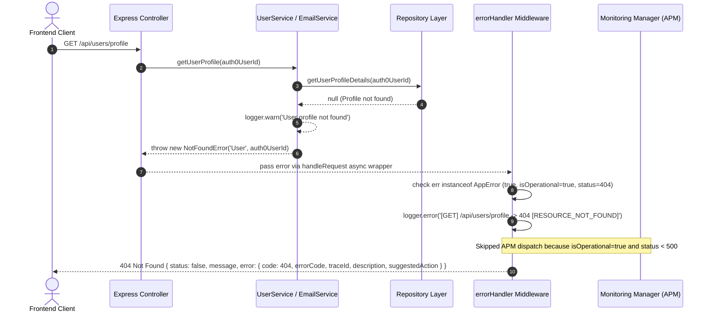
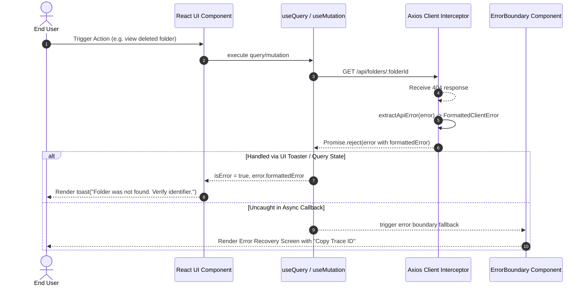

# Codebase Hardening & Stabilization - Phase 2 Implementation Details

> **Feature:** `codebase-hardening-and-stabilization` · **Phase:** 2 (Exception Handling & Logging Audit)
> **Status:** COMPLETED
> **Created:** 2026-09-24 · **Last Updated:** 2026-09-24

---

## 1. Goal Description & Scope

This phase executes a comprehensive audit and remediation of exception handling, structured logging, and error taxonomy across the MailSense codebase.

### Primary Objectives:
1. **Remediate Unhandled Exception Gaps:**
   - [user.service.ts](file:///Users/vishaljagamani/Projects/Projects/mailsense/Backend/src/modules/user/user.service.ts) completely lacks `try / catch` blocks and structured logging across all 6 public service methods (`getUser`, `updateUser`, `getUserProfile`, `changePassword`, `getUserSettings`, `updateUserSettings`). Wrap each method in explicit `try / catch` blocks with module-scoped child logging using `LOGGER_MODULE.USER_SERVICE`.
2. **Migrate 50+ Generic Errors to Strongly-Typed Domain Errors:**
   - Eliminate every instance of `throw new Error(...)` across `Backend/src/modules/` (emails, accounts, folders, drafts, attachments, analytics, users, and controllers).
   - Replace generic errors with typed subclasses of `AppError` from `@errors` (`NotFoundError`, `BadRequestError`, `UnauthorizedError`, `ForbiddenError`), ensuring requests return RFC-compliant HTTP status codes (400, 401, 403, 404) rather than defaulting to 500 `INTERNAL_ERROR` in the centralized error handler and spamming APM/Sentry with false-positive alerts.
3. **Verify Global Error Handler & Response Serialization:**
   - Confirm [error.handler.ts](file:///Users/vishaljagamani/Projects/Projects/mailsense/Backend/src/middlewares/error.handler.ts) correctly processes operational `AppError` instances, attaches trace IDs, preserves structured context, logs HTTP method and status, and dispatches only unhandled or 5xx exceptions to APM.
4. **Standardize Frontend API Error Normalization:**
   - Verify that [errors.ts](file:///Users/vishaljagamani/Projects/Projects/mailsense/Frontend/src/shared/api/errors.ts) and the Axios interceptor in [client.ts](file:///Users/vishaljagamani/Projects/Projects/mailsense/Frontend/src/shared/api/client.ts) consistently parse and expose backend `errorCode`, `message`, `description`, `suggestedAction`, and `traceId` to React Query error boundaries and UI toaster components.

---

## 2. User Review Required & Architectural Notes

> [!IMPORTANT]
> **Domain Error Hierarchy vs. Generic Exceptions**
>
> 1. **Zero Generic Errors in Business Logic:** Instantiating `throw new Error(...)` is prohibited in all application controllers and services. Generic errors lack HTTP status mappings, custom error codes, and operational flags, causing the centralized error middleware to treat them as unexpected 500 crashes and trigger alert notifications.
> 2. **Explicit Domain Subclass Mapping:**
>    - Missing resources (email, account, folder, draft, staged attachment, user) MUST throw `new NotFoundError(resourceName, identifier)`.
>    - Missing or malformed client parameters (missing required IDs, bad filter syntax) MUST throw `new BadRequestError(message, description, suggestedAction)`.
>    - Unauthenticated callers MUST throw `new UnauthorizedError(message)`.
>    - Cross-tenant access attempts or unauthorized account actions MUST throw `new ForbiddenError(message)`.
> 3. **Observability Constant Registration:**
>    - `LOGGER_MODULE.USER_SERVICE = 'UserService'` must be added to [observability.constants.ts](file:///Users/vishaljagamani/Projects/Projects/mailsense/Backend/src/core/constants/observability.constants.ts) before initializing the logger in `UserService`.
> 4. **Exception Handling Boundaries:**
>    - **Services & Controllers:** Must encapsulate external operations in explicit `try / catch` blocks.
>    - **Data Access Layer:** Repository methods bubble database exceptions directly to calling services, which handle logging and domain wrapping, preventing redundant double-catch overhead.

---

## 3. Component Overview & File Map

| Component | Target File | Action | Purpose |
|---|---|---|---|
| **Backend / Observability** | `Backend/src/core/constants/observability.constants.ts` | [MODIFY] | Add `USER_SERVICE = 'UserService'` to `LOGGER_MODULE` enum |
| **Backend / User** | `Backend/src/modules/user/user.service.ts` | [MODIFY] | Add `try / catch` blocks, structured logger, and `NotFoundError` across all 6 methods |
| **Backend / Emails** | `Backend/src/modules/emails/email.service.ts` | [MODIFY] | Migrate generic `throw new Error` calls to `NotFoundError`, `BadRequestError`, and `ForbiddenError` |
| **Backend / Emails** | `Backend/src/modules/emails/email.controller.ts` | [MODIFY] | Migrate missing parameter checks to `BadRequestError` and `UnauthorizedError` |
| **Backend / Accounts** | `Backend/src/modules/accounts/account.service.ts` | [MODIFY] | Migrate remaining generic `throw new Error` calls to `NotFoundError` and `UnauthorizedError` |
| **Backend / Folders** | `Backend/src/modules/folders/folder.service.ts` | [MODIFY] | Migrate generic errors to `NotFoundError('Folder', ...)` and `NotFoundError('Account', ...)` |
| **Backend / Folders** | `Backend/src/modules/folders/folder.controller.ts` | [MODIFY] | Migrate controller parameter checks to `BadRequestError` and `UnauthorizedError` |
| **Backend / Drafts** | `Backend/src/modules/drafts/draft.service.ts` | [MODIFY] | Migrate generic errors to `NotFoundError('Draft', ...)` and `ForbiddenError` |
| **Backend / Drafts** | `Backend/src/modules/drafts/draft.controller.ts` | [MODIFY] | Migrate controller parameter checks to `BadRequestError` and `UnauthorizedError` |
| **Backend / Attachments** | `Backend/src/modules/attachments/attachment.service.ts` | [MODIFY] | Migrate generic errors to `NotFoundError('Attachment', ...)` |
| **Backend / Attachments** | `Backend/src/modules/attachments/attachment.controller.ts` | [MODIFY] | Migrate controller parameter checks to `BadRequestError` and `UnauthorizedError` |
| **Backend / Analytics** | `Backend/src/modules/analytics/analytics.service.ts` | [MODIFY] | Migrate account authorization failure to `ForbiddenError` |
| **Frontend / Shared** | `Frontend/src/shared/api/errors.ts` | [VERIFY/MODIFY] | Ensure complete extraction of `errorCode`, `description`, `suggestedAction`, and `traceId` |
| **Frontend / Shared** | `Frontend/src/shared/api/client.ts` | [VERIFY] | Verify Axios error interceptor tags `formattedError` and tracks action |

---

## 4. Main Section 1: Backend Layer Implementation

### 4.1 Observability Constants (`Backend/src/core/constants/observability.constants.ts`)

#### [MODIFY] `LOGGER_MODULE`
Register `USER_SERVICE` in the standardized logging module enum:

```typescript
export enum LOGGER_MODULE {
    APP = 'App',
    SERVER = 'Server',
    DATABASE = 'Database',
    HTTP = 'HTTP',
    HEALTH_SERVICE = 'HealthService',
    HEALTH_CONTROLLER = 'HealthController',
    REDIS_CONNECTION = 'RedisConnection',
    QUEUE_SERVICE = 'QueueService',
    SCHEDULER_SERVICE = 'SchedulerService',
    QUEUE_REGISTRY = 'QueueRegistry',
    EVENT_BUS = 'EventBus',
    EMAIL_CREATED_HANDLER = 'EmailCreatedHandler',
    SYNC_COMPLETED_HANDLER = 'SyncCompletedHandler',
    MONITORING_MANAGER = 'MonitoringManager',
    SENTRY_PROVIDER = 'SentryProvider',
    NOOP_MONITORING_PROVIDER = 'NoopMonitoringProvider',
    GMAIL_CLIENT = 'GmailClient',
    GMAIL_SERVICE = 'GmailService',
    OUTLOOK_CLIENT = 'OutlookClient',
    OUTLOOK_SERVICE = 'OutlookService',
    AUTH0_CLIENT = 'Auth0Client',
    AUTH0_SERVICE = 'Auth0Service',
    OBJECT_STORAGE_SERVICE = 'ObjectStorageService',
    ACCOUNT_SERVICE = 'AccountService',
    EMAIL_SERVICE = 'EmailService',
    ATTACHMENT_SERVICE = 'AttachmentService',
    FOLDER_SERVICE = 'FolderService',
    DRAFT_SERVICE = 'DraftService',
    USER_SERVICE = 'UserService',
    ANALYTICS_SERVICE = 'AnalyticsService',
    ANALYTICS_UTILS = 'AnalyticsUtils',
    BASE_WORKER = 'BaseWorker',
    SYNC_WORKER = 'SyncWorker',
    TOKEN_REFRESH_WORKER = 'TokenRefreshWorker',
    SYNC_ACCOUNT_PROCESSOR = 'SyncAccountProcessor',
    REFRESH_TOKEN_PROCESSOR = 'RefreshTokenProcessor',
    AUTH_MIDDLEWARE = 'AuthMiddleware',
}
```

---

### 4.2 User Service Implementation (`Backend/src/modules/user/user.service.ts`)

#### [MODIFY] `UserService`
Wrap all 6 public methods in `try / catch` blocks, initialize module-scoped `logger`, and replace generic errors with `NotFoundError`:

```typescript
import { ACCOUNT_SYNC_MODE, APIResponse, UpdateAPIResponse, UserDetailsObject, UserSettings } from '@mailsense/types';
import { Auth0Service } from 'integrations/auth0/auth0.service.js';
import { Auth0UserDetailsResponse } from 'integrations/auth0/auth0.types.js';
import { createLogger, LOGGER_MODULE } from '@observability';
import { NotFoundError } from '@errors';
import { decrypt } from 'shared/utils/index.js';
import { UserDocument, UserInput, UserSettingsDocument } from './user.model.js';
import { UserRepository } from './user.repository.js';
import { ChangePasswordSchema, UpdateUserSchema } from './user.schema.js';
import { UserSettingsRepository } from './user-settings.repository.js';

const logger = createLogger(LOGGER_MODULE.USER_SERVICE);

export class UserService {
    private auth0Service: Auth0Service;

    constructor() {
        this.auth0Service = new Auth0Service();
    }

    public async getUser(auth0UserId: string): Promise<APIResponse<Auth0UserDetailsResponse | null>> {
        try {
            logger.info('Fetching user details from Auth0', { auth0UserId });
            const user = await this.auth0Service.getUserDetails(auth0UserId);
            return { status: true, message: 'User fetched successfully', data: user };
        } catch (error) {
            const errorMessage = error instanceof Error ? error.message : String(error);
            logger.error(`Error in UserService.getUser: ${errorMessage}`, { auth0UserId, error });
            throw error;
        }
    }

    public async updateUser(auth0UserId: string, user: UpdateUserSchema): Promise<APIResponse<UserDocument | null>> {
        try {
            logger.info('Updating user details', { auth0UserId });
            const updateUser = await this.auth0Service.updateUserDetails(auth0UserId, user);
            const userInput: UserInput = {
                auth0UserId,
                name: updateUser.name,
                email: updateUser.email,
            };
            const updateInDB = await UserRepository.updateUser(auth0UserId, userInput);
            return { status: true, message: 'User updated successfully', data: updateInDB };
        } catch (error) {
            const errorMessage = error instanceof Error ? error.message : String(error);
            logger.error(`Error in UserService.updateUser: ${errorMessage}`, { auth0UserId, error });
            throw error;
        }
    }

    public async getUserProfile(auth0UserId: string): Promise<APIResponse<UserDetailsObject | null>> {
        try {
            logger.info('Fetching user profile details', { auth0UserId });
            const user = await this.auth0Service.getUserProfileDetails(auth0UserId);
            if (!user) {
                logger.warn('User profile not found in Auth0', { auth0UserId });
                throw new NotFoundError('User', auth0UserId);
            }
            return { status: true, message: 'User profile fetched successfully', data: user };
        } catch (error) {
            const errorMessage = error instanceof Error ? error.message : String(error);
            logger.error(`Error in UserService.getUserProfile: ${errorMessage}`, { auth0UserId, error });
            throw error;
        }
    }

    public async changePassword(auth0UserId: string, user: ChangePasswordSchema): Promise<UpdateAPIResponse> {
        try {
            logger.info('Initiating user password update', { auth0UserId });
            const userDetails = await this.auth0Service.getUserDetails(auth0UserId);
            if (!userDetails) {
                logger.warn('User not found for password change', { auth0UserId });
                throw new NotFoundError('User', auth0UserId);
            }
            const changePasswordBody = {
                password: decrypt(user.password),
                connection: userDetails.identities[0].connection,
            };
            await this.auth0Service.changeUserPassword(auth0UserId, changePasswordBody);
            logger.info('Password updated successfully in Auth0', { auth0UserId });
            return { status: true, message: 'Password updated successfully' };
        } catch (error) {
            const errorMessage = error instanceof Error ? error.message : String(error);
            logger.error(`Error in UserService.changePassword: ${errorMessage}`, { auth0UserId, error });
            throw error;
        }
    }

    public async getUserSettings(auth0UserId: string): Promise<APIResponse<UserSettings>> {
        try {
            logger.info('Fetching user settings', { auth0UserId });
            let userSettings = await UserSettingsRepository.getUserSettings(auth0UserId);
            if (!userSettings) {
                logger.info('Initializing default user settings', { auth0UserId });
                const data = {
                    userId: auth0UserId,
                    account: {
                        syncSettings: {
                            globalAutoSync: true,
                            syncMode: ACCOUNT_SYNC_MODE.CUSTOM_PER_ACCOUNT,
                            globalSyncInterval: 15,
                            defaultSyncInterval: 15,
                        },
                    },
                };
                userSettings = await UserSettingsRepository.createUserSettings(data);
            }
            return { status: true, message: 'User settings fetched successfully', data: userSettings };
        } catch (error) {
            const errorMessage = error instanceof Error ? error.message : String(error);
            logger.error(`Error in UserService.getUserSettings: ${errorMessage}`, { auth0UserId, error });
            throw error;
        }
    }

    public async updateUserSettings(auth0UserId: string, data: UserSettings): Promise<APIResponse<UserSettingsDocument | null>> {
        try {
            logger.info('Updating user settings', { auth0UserId });
            const userSettings = await UserSettingsRepository.updateUserSettings(auth0UserId, data);
            if (!userSettings) {
                logger.warn('User settings record not found for update', { auth0UserId });
                throw new NotFoundError('UserSettings', auth0UserId);
            }
            return { status: true, message: 'User settings updated successfully', data: userSettings };
        } catch (error) {
            const errorMessage = error instanceof Error ? error.message : String(error);
            logger.error(`Error in UserService.updateUserSettings: ${errorMessage}`, { auth0UserId, error });
            throw error;
        }
    }
}
```

---

### 4.3 Email Service Domain Error Migration (`Backend/src/modules/emails/email.service.ts`)

#### [MODIFY] `EmailService`
Replace all raw `throw new Error(...)` calls with domain error subclasses:

- **Line 197 & Line 199:** In `getEmailDetails(emailId, accountId)`:
  ```typescript
  // Replace: if (!email) throw new Error('Email not found');
  if (!email) {
      throw new NotFoundError('Email', emailId);
  }
  // Replace: if (!account) throw new Error('Account not found');
  if (!account) {
      throw new NotFoundError('Account', accountId);
  }
  ```

- **Line 372:** In `getThread(emailId)`:
  ```typescript
  // Replace: if (!account) throw new Error('Account not found');
  if (!account) {
      throw new NotFoundError('Account', targetEmail.accountId);
  }
  ```

- **Line 413:** In `downloadAttachment(emailId, attachmentId)`:
  ```typescript
  // Replace: if (!email) throw new Error('Email not found');
  if (!email) {
      throw new NotFoundError('Email', emailId);
  }
  ```

- **Line 445:** In `downloadAttachment(emailId, attachmentId)`:
  ```typescript
  // Replace: if (!account) throw new Error('Account not found');
  if (!account) {
      throw new NotFoundError('Account', email.accountId);
  }
  ```

- **Line 471:** In `composeEmailWithAttachments(userId, reqBody)`:
  ```typescript
  // Replace: if (!account || account.userId.toString() !== userId.toString()) throw new Error('Account not found or unauthorized');
  if (!account) {
      throw new NotFoundError('Account', accountId);
  }
  if (account.userId.toString() !== userId.toString()) {
      throw new ForbiddenError('Unauthorized attempt to compose email from unowned account');
  }
  ```

---

### 4.4 Folder Service Domain Error Migration (`Backend/src/modules/folders/folder.service.ts`)

#### [MODIFY] `FolderService`
Replace raw `throw new Error(...)` calls with `NotFoundError` and `ForbiddenError`:

- **Line 21 & Line 90 & Line 105:**
  ```typescript
  // Replace: if (!account) throw new Error('Account not found');
  if (!account) {
      throw new NotFoundError('Account', accountId);
  }
  ```

- **Line 76:** In `getFolder(folderId)`:
  ```typescript
  // Replace: if (!folder) throw new Error('Folder not found');
  if (!folder) {
      throw new NotFoundError('Folder', folderId);
  }
  ```

- **Line 120 & Line 124:** In `updateFolder(userId, folderId, data)`:
  ```typescript
  if (!folder) {
      throw new NotFoundError('Folder', folderId);
  }
  if (folder.userId.toString() !== userId.toString()) {
      throw new ForbiddenError('Unauthorized attempt to update folder');
  }
  const account = await AccountRepository.getAccountById(folder.accountId);
  if (!account) {
      throw new NotFoundError('Account', folder.accountId);
  }
  ```

- **Line 144 & Line 148:** In `deleteFolder(userId, folderId)`:
  ```typescript
  if (!folder) {
      throw new NotFoundError('Folder', folderId);
  }
  if (folder.userId.toString() !== userId.toString()) {
      throw new ForbiddenError('Unauthorized attempt to delete folder');
  }
  const account = await AccountRepository.getAccountById(folder.accountId);
  if (!account) {
      throw new NotFoundError('Account', folder.accountId);
  }
  ```

---

### 4.5 Draft Service Domain Error Migration (`Backend/src/modules/drafts/draft.service.ts`)

#### [MODIFY] `DraftService`
Replace raw `throw new Error(...)` calls with `NotFoundError` and `ForbiddenError`:

- **Line 52:** In `deleteDraft(userId, draftId)`:
  ```typescript
  // Replace: throw new Error(`Draft with ID ${draftId} not found`);
  if (!draft) {
      throw new NotFoundError('Draft', draftId);
  }
  ```

- **Line 91:** In `sendDraft(userId, draftId)`:
  ```typescript
  if (!draftDoc) {
      throw new NotFoundError('Draft', draftId);
  }
  if (draftDoc.userId !== userId) {
      throw new ForbiddenError('Unauthorized attempt to send draft belonging to another user');
  }
  ```

---

### 4.6 Attachment Service Domain Error Migration (`Backend/src/modules/attachments/attachment.service.ts`)

#### [MODIFY] `AttachmentService`
Replace raw `throw new Error(...)` calls with `NotFoundError`:

- **Line 56:** In `deleteStagedAttachment(attachmentId, userId)`:
  ```typescript
  // Replace: throw new Error(`Staged attachment ${attachmentId} not found or unauthorized`);
  if (!record || record.userId.toString() !== userId.toString()) {
      throw new NotFoundError('Attachment', attachmentId);
  }
  ```

- **Line 71:** In `getStagedAttachmentWithStream(attachmentId)`:
  ```typescript
  // Replace: throw new Error(`Staged attachment ${attachmentId} not found or unauthorized`);
  if (!record) {
      throw new NotFoundError('Attachment', attachmentId);
  }
  ```

---

### 4.7 Analytics Service Domain Error Migration (`Backend/src/modules/analytics/analytics.service.ts`)

#### [MODIFY] `AnalyticsService`
Replace raw `throw new Error(...)` with `ForbiddenError`:

- **Line 106:** In `resolveAccountIds(userId, requestedAccountId)`:
  ```typescript
  // Replace: throw new Error('Requested account does not belong to the user or is inactive');
  if (requestedAccountId && !activeAccountIds.includes(requestedAccountId)) {
      throw new ForbiddenError('Requested account does not belong to the authenticated user or is inactive');
  }
  ```

---

### 4.8 Controllers Parameter Validation Error Migration

#### [MODIFY] `Backend/src/modules/emails/email.controller.ts`
Replace raw parameter validation `throw new Error(...)` with `BadRequestError` and `UnauthorizedError`:
- `if (!userId) throw new UnauthorizedError('User ID is required');`
- `if (!emailId) throw new BadRequestError('Email ID is required');`
- `if (!accountId) throw new BadRequestError('Account ID is required');`

#### [MODIFY] `Backend/src/modules/folders/folder.controller.ts`
Replace raw parameter validation `throw new Error(...)` with `BadRequestError` and `UnauthorizedError`:
- `if (!accountId) throw new BadRequestError('Account ID is required');`
- `if (!userId) throw new UnauthorizedError('User ID is required');`
- `if (!folderId) throw new BadRequestError('Folder ID is required');`

#### [MODIFY] `Backend/src/modules/drafts/draft.controller.ts`
Replace raw parameter validation `throw new Error(...)` with `UnauthorizedError`:
- `if (!userId) throw new UnauthorizedError('User ID is required');`

#### [MODIFY] `Backend/src/modules/attachments/attachment.controller.ts`
Replace raw parameter validation `throw new Error(...)` with `BadRequestError` and `UnauthorizedError`:
- `if (!userId) throw new UnauthorizedError('User ID is required');`
- `if (!accountId) throw new BadRequestError('Account ID is required');`
- `if (!file) throw new BadRequestError('File is required for upload');`
- `if (!attachmentId) throw new BadRequestError('Attachment ID is required');`

---

## 5. Main Section 2: Frontend Layer Implementation

### 5.1 Frontend API Client Error Parser (`Frontend/src/shared/api/errors.ts`)

#### [VERIFY / ENHANCE] `extractApiError`
Ensure complete extraction of `errorCode`, `description`, `suggestedAction`, `httpStatus`, and `traceId` from backend `AppError` payloads:

```typescript
import axios, { AxiosError } from 'axios';
import { ApiErrorResponse, FormattedClientError } from '@shared/types';

/**
 * Normalizes backend error responses conforming to `{ status: false, message, error }`.
 * Pure data transformation without try/catch overhead.
 */
export function extractApiError(error: unknown): FormattedClientError {
    if (axios.isAxiosError(error)) {
        const axiosError = error as AxiosError<ApiErrorResponse>;
        const responseData = axiosError.response?.data;

        if (responseData && responseData.error) {
            return {
                message: responseData.message || axiosError.message,
                errorCode: responseData.error.errorCode || 'UNKNOWN_ERROR',
                traceId: responseData.error.traceId || '',
                description: responseData.error.description || '',
                suggestedAction: responseData.error.suggestedAction || 'Please try again later.',
                httpStatus: responseData.error.code || axiosError.response?.status || 500,
            };
        }

        return {
            message: axiosError.message || 'Network request failed',
            errorCode: 'NETWORK_ERROR',
            traceId: '',
            description: 'Failed to communicate with the server.',
            suggestedAction: 'Please check your internet connection and try again.',
            httpStatus: axiosError.response?.status || 500,
        };
    }

    if (error instanceof Error) {
        return {
            message: error.message,
            errorCode: 'CLIENT_ERROR',
            traceId: '',
            description: 'An unexpected client error occurred.',
            suggestedAction: 'Please refresh the page and try again.',
            httpStatus: 500,
        };
    }

    return {
        message: String(error),
        errorCode: 'UNKNOWN_ERROR',
        traceId: '',
        description: 'An unknown error occurred.',
        suggestedAction: 'Please contact support if this continues.',
        httpStatus: 500,
    };
}
```

---

### 5.2 Axios Client Interceptor Integration (`Frontend/src/shared/api/client.ts`)

#### [VERIFY] `apiClient.interceptors.response`
Verify that `extractApiError` attaches `formattedError` to the rejected error object and falls back to `x-trace-id` response header if backend payload traceId is empty:

```typescript
apiClient.interceptors.response.use(
    (response) => {
        try {
            trackUserAction(
                'api.response',
                `${response.config.method?.toUpperCase() || 'GET'} ${response.config.url || ''} [${response.status}]`,
                'info',
                {
                    status: response.status,
                    url: response.config.url || '',
                },
            );
        } catch {
            // Non-blocking
        }
        return response;
    },
    (error) => {
        try {
            const formatted = extractApiError(error);

            const responseHeaderTraceId = error.response?.headers?.['x-trace-id'];
            if (responseHeaderTraceId && (!formatted.traceId || formatted.traceId.length === 0)) {
                formatted.traceId = String(responseHeaderTraceId);
            }

            trackUserAction(
                'api.error',
                `${error.config?.method?.toUpperCase() || 'REQ'} ${error.config?.url || ''} [${error.response?.status || 'network_error'}]`,
                'error',
                {
                    status: error.response?.status || 0,
                    message: formatted.message,
                    errorCode: formatted.errorCode,
                    traceId: formatted.traceId,
                },
            );

            Object.assign(error, { formattedError: formatted });
        } catch (interceptorError) {
            // Non-blocking fallback
        }
        return Promise.reject(error);
    },
);
```

---

## 6. Low-Level Design & Sequence Flow

### 6.1 Domain Error Catch & Serialization Flow



### 6.2 Frontend Error Unwrapping & Boundary Recovery Flow



---

## 7. Step-by-Step Task Checklist

- [x] **Task 1: Observability Enum Registration**
  - [x] Add `USER_SERVICE = 'UserService'` to `LOGGER_MODULE` in `Backend/src/core/constants/observability.constants.ts`.
- [x] **Task 2: UserService Audit & Remediation**
  - [x] Add `const logger = createLogger(LOGGER_MODULE.USER_SERVICE);` in `Backend/src/modules/user/user.service.ts`.
  - [x] Wrap `getUser` in `try / catch` with logging.
  - [x] Wrap `updateUser` in `try / catch` with logging.
  - [x] Wrap `getUserProfile` in `try / catch` with logging and replace `{ status: false }` with `throw new NotFoundError('User', auth0UserId)`.
  - [x] Wrap `changePassword` in `try / catch` with logging and replace `throw new Error('User not found')` with `throw new NotFoundError('User', auth0UserId)`.
  - [x] Wrap `getUserSettings` in `try / catch` with logging.
  - [x] Wrap `updateUserSettings` in `try / catch` with logging and replace `{ status: false }` with `throw new NotFoundError('UserSettings', auth0UserId)`.
- [x] **Task 3: Service Layer Domain Error Migration**
  - [x] In `Backend/src/modules/emails/email.service.ts`, replace generic errors in `getEmailDetails`, `getThread`, `downloadAttachment`, and `composeEmailWithAttachments` with `NotFoundError` and `ForbiddenError`.
  - [x] In `Backend/src/modules/folders/folder.service.ts`, replace generic errors in `syncAccountFolders`, `getFolder`, `createFolder`, `updateFolder`, and `deleteFolder` with `NotFoundError` and `ForbiddenError`.
  - [x] In `Backend/src/modules/drafts/draft.service.ts`, replace generic errors in `deleteDraft` and `sendDraft` with `NotFoundError` and `ForbiddenError`.
  - [x] In `Backend/src/modules/attachments/attachment.service.ts`, replace generic errors in `deleteStagedAttachment` and `getStagedAttachmentWithStream` with `NotFoundError`.
  - [x] In `Backend/src/modules/analytics/analytics.service.ts`, replace generic error in `resolveAccountIds` with `ForbiddenError`.
- [x] **Task 4: Controller Layer Parameter Validation Error Migration**
  - [x] In `Backend/src/modules/emails/email.controller.ts`, replace generic errors with `BadRequestError` and `UnauthorizedError`.
  - [x] In `Backend/src/modules/folders/folder.controller.ts`, replace generic errors with `BadRequestError` and `UnauthorizedError`.
  - [x] In `Backend/src/modules/drafts/draft.controller.ts`, replace generic errors with `UnauthorizedError`.
  - [x] In `Backend/src/modules/attachments/attachment.controller.ts`, replace generic errors with `BadRequestError` and `UnauthorizedError`.
- [x] **Task 5: Frontend Verification & Build Validation**
  - [x] Verify `Frontend/src/shared/api/errors.ts` and `Frontend/src/shared/api/client.ts`.
  - [x] Run `cd Backend && pnpm build && pnpm test`.
  - [x] Run `cd Frontend && npx tsc --noEmit`.

---

## 8. Verification & Build Commands

```bash
# 1. Backend Build and Type Check
cd /Users/vishaljagamani/Projects/Projects/mailsense/Backend && pnpm build

# 2. Backend Automated Test Suite
cd /Users/vishaljagamani/Projects/Projects/mailsense/Backend && pnpm test

# 3. Frontend Type Check
cd /Users/vishaljagamani/Projects/Projects/mailsense/Frontend && npx tsc --noEmit
```
