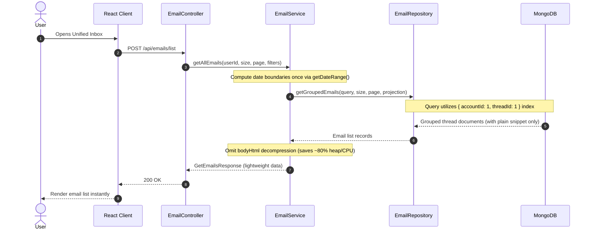
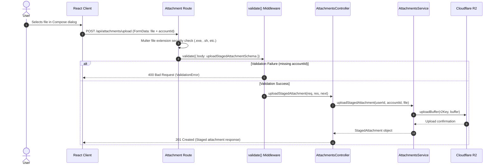

# Codebase Hardening & Stabilization - Phase 3 Implementation Details

> **Feature:** `codebase-hardening-and-stabilization` · **Phase:** 3 (Modifications & Enhancements)
> **Status:** COMPLETED
> **Created:** 2026-09-24 · **Last Updated:** 2026-09-26

---

## 1. Goal Description & Scope

This phase executes targeted performance optimizations, database compound index enhancements, request validation schema bindings, and frontend React Query key harmonization across the MailSense platform.

### Primary Objectives:
1. **Schema Enum & Database Index Hardening:**
   - Enforce compiler-checked `ACCOUNT_PROVIDER` enum validation on the Mongoose `Account` model to prevent corrupt provider values.
   - Add explicit compound indexes on the `Email` schema (`{ accountId: 1, threadId: 1 }`) to accelerate thread aggregation and conversation card lookups.
2. **Attachment Request Validation Schemas:**
   - Create `Backend/src/modules/attachments/attachment.schema.ts` with strict Zod schemas for file staging upload and staged attachment deletion.
   - Bind schemas via `validate({ body: ... })` and `validate({ params: ... })` in `attachment.routes.ts`.
3. **Email List Query & Memory Optimization:**
   - Eliminate redundant triple-evaluation of `this.getDateRange(dateRange)` in `EmailService.getAllEmails`.
   - Skip expensive body decompression (`bodyHtml`, `body`) during mailbox list retrieval (`getEmails`, `getAllEmails`), ensuring list endpoints stream lightweight metadata and prevent CPU/heap spikes on large mailboxes.
4. **Hierarchical React Query Key Factory Consolidation:**
   - Consolidate fragmented string keys (`EMAILS`, `EMAIL_FILTERS`, `QUERY_KEYS.EMAIL`) into a strongly-typed hierarchical query key factory `EMAIL_QUERY_KEYS` in `Frontend/src/shared/api/query-keys.ts`.
   - Refactor `email.queries.ts` and `inbox.queries.ts` to utilize the centralized key factory for deterministic cache invalidation.

---

## 2. User Review Required & Architectural Notes

> [!IMPORTANT]
> **API Response Envelope Compatibility**
>
> 1. **Frontend Wire Contract Alignment:** Currently, Frontend API wrappers (`accounts.api.ts`, `inbox.api.ts`) consume response payloads directly from Axios (`const { data } = await axiosClient.get(...)`). In `AccountsController`, routes return raw model data arrays or objects directly (`res.send(accounts)`). Mutating the response payload into an unwrapped `{ status: true, message: string, data: T }` envelope without simultaneously updating consumer adapters would cause runtime regressions (`data` property nesting).
> 2. **Controlled Scope:** To guarantee zero client breakages, controller response updates in this phase focus on standardizing status codes (`res.status(200).send(...)`), typing controller handlers with explicit request/response generics, and eliminating inline/untyped payloads.
> 3. **Index Creation Overhead:** Adding `{ accountId: 1, threadId: 1 }` to `EmailSchema` improves thread resolution queries from $O(N)$ collection scans to $O(\log N)$ b-tree index lookups. In production MongoDB clusters, compound index builds should be executed in the background.

---

## 3. Component Overview & File Map

| Component | Target File | Action | Purpose |
|---|---|---|---|
| **Backend / Accounts** | `Backend/src/modules/accounts/account.model.ts` | [MODIFY] | Add `enum: Object.values(ACCOUNT_PROVIDER)` to `AccountSchema.provider` |
| **Backend / Emails** | `Backend/src/modules/emails/email.model.ts` | [MODIFY] | Add compound index `{ accountId: 1, threadId: 1 }` |
| **Backend / Emails** | `Backend/src/modules/emails/email.service.ts` | [MODIFY] | Cache date range computation & skip full body decompression on list endpoints |
| **Backend / Attachments** | `Backend/src/modules/attachments/attachment.schema.ts` | [NEW] | Define Zod validation schemas for upload and deletion |
| **Backend / Attachments** | `Backend/src/modules/attachments/attachment.routes.ts` | [MODIFY] | Bind Zod validation middleware to upload and delete routes |
| **Frontend / Shared** | `Frontend/src/shared/api/query-keys.ts` | [MODIFY] | Export hierarchical `EMAIL_QUERY_KEYS` factory |
| **Frontend / Emails** | `Frontend/src/features/emails/api/email.queries.ts` | [MODIFY] | Refactor `useGetEmailDetailsQuery` and `useGetThreadQuery` to use `EMAIL_QUERY_KEYS` |
| **Frontend / Inbox** | `Frontend/src/features/inbox/api/inbox.queries.ts` | [MODIFY] | Refactor `useFetchEmailFilters` and `useDeleteEmail` to use `EMAIL_QUERY_KEYS` |

---

## 4. Main Section 1: Backend Layer Implementation

### 4.1 Database Models & Indexes

#### [MODIFY] [account.model.ts](file:///Users/vishaljagamani/Projects/Projects/mailsense/Backend/src/modules/accounts/account.model.ts)
Enforce `ACCOUNT_PROVIDER` enum constraint on the `provider` field:

```typescript
import { ACCOUNT_LAST_SYNC_STATUS, ACCOUNT_PROVIDER } from '@mailsense/types';
import { Schema, model } from 'mongoose';
import { AccountDocument } from './account.types.js';

export const AccountSchema = new Schema(
    {
        userId: { type: String, required: true },
        provider: {
            type: String,
            enum: Object.values(ACCOUNT_PROVIDER),
            required: true,
        },
        emailAddress: { type: String, required: true },
        userProfileDetails: { type: Object, required: true },
        accessToken: { type: String, required: true },
        refreshToken: { type: String, required: true },
        accessTokenExpiry: { type: Number, required: true },
        refreshTokenExpiry: { type: Number, required: true },
        scope: { type: String, required: true },
        syncEnabled: { type: Boolean, required: true },
        syncInterval: { type: Number, required: true },
        lastSyncedAt: { type: Number, required: true },
        lastSyncCursor: { type: String, required: false },
        active: { type: Boolean, required: true },
        syncInProgress: { type: Boolean, required: true },
        lastSyncStatus: { type: String, enum: Object.values(ACCOUNT_LAST_SYNC_STATUS), required: false },
        lastSyncError: { type: String, required: false },
        lastSyncStartedAt: { type: Number, required: false },
        lastSyncCompletedAt: { type: Number, required: false },
    },
    { timestamps: true, versionKey: false },
);

// Indexes
AccountSchema.index({ emailAddress: 1 }, { unique: true });
AccountSchema.index({ userId: 1 });
AccountSchema.index({ active: 1 });
```

#### [MODIFY] [email.model.ts](file:///Users/vishaljagamani/Projects/Projects/mailsense/Backend/src/modules/emails/email.model.ts)
Add explicit compound index `{ accountId: 1, threadId: 1 }` for thread lookups:

```typescript
// Indexes
EmailSchema.index({ accountId: 1, providerMessageId: 1 }, { unique: true });
EmailSchema.index({ accountId: 1, receivedAt: -1 });
EmailSchema.index({ accountId: 1, folders: 1, receivedAt: -1 });
EmailSchema.index({ accountId: 1, isRead: 1 });
EmailSchema.index({ accountId: 1, from: 1 });
EmailSchema.index({ accountId: 1, threadId: 1 });
EmailSchema.index({ accountId: 1, threadId: 1, receivedAt: 1 });

export const Email = model<EmailDocument>('Email', EmailSchema);
```

---

### 4.2 Validation Schemas & Routes

#### [NEW] [attachment.schema.ts](file:///Users/vishaljagamani/Projects/Projects/mailsense/Backend/src/modules/attachments/attachment.schema.ts)
Create Zod validation schemas for attachment endpoints:

```typescript
import { z } from 'zod';

export const uploadStagedAttachmentSchema = z.object({
    accountId: z.string({
        required_error: 'Account ID is required',
        invalid_type_error: 'Account ID must be a string',
    }).min(1, 'Account ID cannot be empty'),
});

export type UploadStagedAttachmentSchema = z.infer<typeof uploadStagedAttachmentSchema>;

export const deleteStagedAttachmentSchema = z.object({
    attachmentId: z.string({
        required_error: 'Attachment ID is required',
        invalid_type_error: 'Attachment ID must be a string',
    }).min(1, 'Attachment ID cannot be empty'),
});

export type DeleteStagedAttachmentSchema = z.infer<typeof deleteStagedAttachmentSchema>;
```

#### [MODIFY] [attachment.routes.ts](file:///Users/vishaljagamani/Projects/Projects/mailsense/Backend/src/modules/attachments/attachment.routes.ts)
Bind Zod validation middleware to upload and delete routes:

```typescript
import { BadRequestError } from '@errors';
import { authMiddleware, validate } from '@middlewares';
import { handleRequest } from '@utils';
import { Router } from 'express';
import multer from 'multer';
import { AttachmentsController } from './attachment.controller.js';
import { deleteStagedAttachmentSchema, uploadStagedAttachmentSchema } from './attachment.schema.js';

const router = Router();
const attachmentController = new AttachmentsController();

const upload = multer({
    limits: { fileSize: 25 * 1024 * 1024 }, // 25MB single file limit
    fileFilter: (_req, file, cb) => {
        try {
            const forbiddenExts = ['.exe', '.bat', '.sh', '.vbs', '.js', '.jar'];
            const isForbidden = forbiddenExts.some((ext) => file.originalname.toLowerCase().endsWith(ext));
            if (isForbidden) {
                return cb(new BadRequestError('File extension forbidden for security'));
            }
            cb(null, true);
        } catch (error) {
            cb(error instanceof Error ? error : new Error(String(error)));
        }
    },
});

router.use(authMiddleware);

router.post(
    '/upload',
    upload.single('file'),
    validate({ body: uploadStagedAttachmentSchema }),
    handleRequest(attachmentController.uploadStagedAttachment),
);

router.delete(
    '/:attachmentId',
    validate({ params: deleteStagedAttachmentSchema }),
    handleRequest(attachmentController.deleteStagedAttachment),
);

export default router;
```

---

### 4.3 Service Layer Performance Optimizations

#### [MODIFY] [email.service.ts](file:///Users/vishaljagamani/Projects/Projects/mailsense/Backend/src/modules/emails/email.service.ts)
1. Single evaluation of `getDateRange(dateRange)`.
2. Skip full body HTML and body decompression on `getEmails` and `getAllEmails`. Only plain preview snippet is decompressed if present:

```typescript
    public async getAllEmails(userId: string, size: number, page: number, filters: GetAllEmailsFilters): Promise<GetEmailsResponse> {
        try {
            const { searchText, accountId, dateRange, folders, unread } = filters;
            const accounts = await AccountRepository.getAccounts({ userId, active: true });
            if (!accounts.length) {
                return { data: [], size: 0, page: 0, total: 0 };
            }
            const outlookAccounts = accounts.filter((account) => account.provider === ACCOUNT_PROVIDER.OUTLOOK);
            let folderIds: string[] = [];
            if (outlookAccounts.length) {
                const folders = await FolderRepository.getAllFolders(
                    {
                        accountId: { $in: outlookAccounts.map((account) => account._id) },
                        kind: 'SYSTEM',
                    },
                    1000,
                    1,
                    { name: 1, _id: 1, providerFolderId: 1 },
                    {},
                );
                folderIds = folders.map((folder) => folder.providerFolderId);
            }
            let targetFolders = folders;
            if (folders && folders.length > 0) {
                const folderDocs = await FolderRepository.getFoldersByIds(folders);
                if (folderDocs.length > 0) {
                    const folderMap = new Map<string, string>();
                    folderDocs.forEach((f) => folderMap.set(String(f._id), f.providerFolderId));
                    targetFolders = folders.map((id) => folderMap.get(id) || id);
                }
            }
            const targetAccountIds = accountId?.length ? accountId.map(String) : accounts.map((account) => String(account._id));

            // Compute date boundaries once to prevent redundant execution
            const computedDateRange = dateRange ? this.getDateRange(dateRange) : undefined;

            const searchQuery: FilterQuery<EmailDocument> = {
                accountId: { $in: targetAccountIds },
                folders: targetFolders ? { $in: targetFolders } : { $nin: [GMAIL_LABELS.TRASH, GMAIL_LABELS.SPAM, GMAIL_LABELS.SENT, ...folderIds] },
                ...(searchText && { $or: [{ subject: { $regex: searchText, $options: 'i' } }, { from: { $regex: searchText, $options: 'i' } }] }),
                ...(computedDateRange && {
                    receivedAt: { $gte: computedDateRange.startDate, $lte: computedDateRange.endDate },
                }),
                ...(unread && { isRead: false }),
            };
            const emails = await EmailRepository.getGroupedEmails(searchQuery, size, page, EMAIL_LIST_DB_FIELD_MAPPING.LIST.projection);
            const total = await EmailRepository.countGroupedThreads(searchQuery);

            // Stream lightweight list metadata without executing heavy bodyHtml decompression
            const data = emails.map((email) => ({
                _id: email._id.toString(),
                subject: email.subject,
                from: email.from,
                receivedAt: email.receivedAt,
                isRead: email.isRead,
                providerMessageId: email.providerMessageId,
                accountId: email.accountId,
                threadId: email.threadId,
                threadCount: email.threadCount || 1,
                attachments: email.attachments || [],
                ...(email.bodyPlain && { bodyPlain: decompressString(email.bodyPlain) }),
            }));
            return { data, size, page, total };
        } catch (err) {
            const errorMessage = err instanceof Error ? err.message : String(err);
            logger.error(`Error in EmailService.getAllEmails: ${errorMessage}`, { error: err });
            throw err;
        }
    }

    public async getEmails(accountId: string, size: number, page: number): Promise<GetEmailsResponse> {
        try {
            const emails = await EmailRepository.getGroupedEmails({ accountId }, size, page, EMAIL_LIST_DB_FIELD_MAPPING.LIST.projection);
            const total = await EmailRepository.countGroupedThreads({ accountId });

            // Stream lightweight list metadata without executing heavy bodyHtml decompression
            const data = emails.map((email) => ({
                _id: email._id.toString(),
                subject: email.subject,
                from: email.from,
                receivedAt: email.receivedAt,
                providerMessageId: email.providerMessageId,
                accountId: email.accountId,
                threadId: email.threadId,
                threadCount: email.threadCount || 1,
                isRead: email.isRead,
                attachments: email.attachments || [],
                ...(email.bodyPlain && { bodyPlain: decompressString(email.bodyPlain) }),
            }));
            return { data, size, page, total };
        } catch (err) {
            const errorMessage = err instanceof Error ? err.message : String(err);
            logger.error(`Error in EmailService.getEmails: ${errorMessage}`, { error: err });
            throw err;
        }
    }
```

---

## 5. Main Section 2: Frontend Layer Implementation

### 5.1 Query Keys Consolidation

#### [MODIFY] [query-keys.ts](file:///Users/vishaljagamani/Projects/Projects/mailsense/Frontend/src/shared/api/query-keys.ts)
Consolidate fragmented string keys into hierarchical query key factories:

```typescript
import { AnalyticsQueryParams, FetchEmailRequestOptions } from '@mailsense/types';

export const QUERY_KEYS = {
    AUTH: 'auth',
    ACCOUNTS: 'accounts',
    ACCOUNT_PROVIDERS: 'account-providers',
    ACCOUNT_DETAILS: 'account-details',
    USER_PROFILE_SETTINGS: 'user-profile-settings',
    USER_SYNC_SETTINGS: 'user-sync-settings',
} as const;

export const FOLDER_KEYS = {
    FOLDERS: 'folders',
} as const;

export const EMAIL_QUERY_KEYS = {
    all: ['emails'] as const,
    lists: () => [...EMAIL_QUERY_KEYS.all, 'list'] as const,
    list: (options?: FetchEmailRequestOptions) => [...EMAIL_QUERY_KEYS.lists(), options] as const,
    filters: () => [...EMAIL_QUERY_KEYS.all, 'filters'] as const,
    details: () => [...EMAIL_QUERY_KEYS.all, 'detail'] as const,
    detail: (emailId: string) => [...EMAIL_QUERY_KEYS.details(), emailId] as const,
    threads: () => [...EMAIL_QUERY_KEYS.all, 'thread'] as const,
    thread: (emailId: string) => [...EMAIL_QUERY_KEYS.threads(), emailId] as const,
} as const;

export const DRAFT_QUERY_KEYS = {
    all: ['drafts'] as const,
    list: () => [...DRAFT_QUERY_KEYS.all, 'list'] as const,
    detail: (draftId: string) => [...DRAFT_QUERY_KEYS.all, 'detail', draftId] as const,
} as const;

export const ANALYTICS_QUERY_KEYS = {
    all: ['analytics'] as const,
    dashboard: (params?: AnalyticsQueryParams) => [...ANALYTICS_QUERY_KEYS.all, 'dashboard', params] as const,
} as const;
```

---

### 5.2 React Query Hooks Refactoring

#### [MODIFY] [email.queries.ts](file:///Users/vishaljagamani/Projects/Projects/mailsense/Frontend/src/features/emails/api/email.queries.ts)
Migrate queries to use `EMAIL_QUERY_KEYS`:

```typescript
import { EmailAttributes, GetThreadResponse } from '@mailsense/types';
import { EMAIL_QUERY_KEYS } from '@shared/api';
import { useQuery, UseQueryOptions, UseQueryResult } from '@tanstack/react-query';
import { getEmailDetails, getThread } from './email.api';

type UseGetEmailDetailsQueryOptions = Omit<UseQueryOptions<EmailAttributes, Error>, 'queryKey' | 'queryFn'>;
type UseGetThreadQueryOptions = Omit<UseQueryOptions<GetThreadResponse, Error>, 'queryKey' | 'queryFn'>;

export const useGetEmailDetailsQuery = (emailId: string, options?: UseGetEmailDetailsQueryOptions): UseQueryResult<EmailAttributes> => {
    return useQuery<EmailAttributes, Error>({
        queryKey: EMAIL_QUERY_KEYS.detail(emailId),
        queryFn: () => getEmailDetails(emailId),
        ...options,
    });
};

export const useGetThreadQuery = (emailId: string, options?: UseGetThreadQueryOptions): UseQueryResult<GetThreadResponse> => {
    return useQuery<GetThreadResponse, Error>({
        queryKey: EMAIL_QUERY_KEYS.thread(emailId),
        queryFn: () => getThread(emailId),
        ...options,
    });
};
```

#### [MODIFY] [inbox.queries.ts](file:///Users/vishaljagamani/Projects/Projects/mailsense/Frontend/src/features/inbox/api/inbox.queries.ts)
Migrate filter query and cache invalidations to `EMAIL_QUERY_KEYS`:

```typescript
import { EmailAttributes, FetchEmailRequestOptions, GetFiltersResponse, PaginatedDataResponse, UpdateAPIResponse } from '@mailsense/types';
import { EMAIL_QUERY_KEYS } from '@shared/api';
import { useMutation, useQuery, useQueryClient } from '@tanstack/react-query';
import { deleteEmail, fetchEmails, getEmailFilters } from './inbox.api';

export const useFetchEmails = () => {
    return useMutation<PaginatedDataResponse<EmailAttributes>, Error, FetchEmailRequestOptions>({
        mutationFn: (options) => fetchEmails(options),
    });
};

export const useFetchEmailFilters = () => {
    return useQuery<GetFiltersResponse, Error>({
        queryKey: EMAIL_QUERY_KEYS.filters(),
        queryFn: () => getEmailFilters(),
    });
};

export const useDeleteEmail = () => {
    const queryClient = useQueryClient();
    return useMutation<UpdateAPIResponse, Error, { emailIds: string[]; trash: boolean }>({
        mutationFn: ({ emailIds, trash }) => deleteEmail(emailIds, trash),
        onSuccess: () => {
            queryClient.invalidateQueries({ queryKey: EMAIL_QUERY_KEYS.all });
        },
    });
};
```

---

## 6. Low-Level Design & Sequence Flow

### 6.1 Optimized Mailbox List Query Flow



### 6.2 Attachment Staging Upload Validation Flow



---

## 7. Step-by-Step Task Checklist

- [x] **Task 1: Database Schema & Index Hardening**
  - [x] Add `ACCOUNT_PROVIDER` enum constraint in `Backend/src/modules/accounts/account.model.ts`.
  - [x] Add compound index `{ accountId: 1, threadId: 1 }` in `Backend/src/modules/emails/email.model.ts`.
- [x] **Task 2: Attachment Validation Schema Implementation**
  - [x] Create `Backend/src/modules/attachments/attachment.schema.ts` defining `uploadStagedAttachmentSchema` and `deleteStagedAttachmentSchema`.
  - [x] Bind validation schemas in `Backend/src/modules/attachments/attachment.routes.ts`.
- [x] **Task 3: Email Service Optimization**
  - [x] Compute `getDateRange()` once per invocation in `Backend/src/modules/emails/email.service.ts`.
  - [x] Remove heavy `bodyHtml` and `body` decompression from list mapping in `getAllEmails` and `getEmails`.
- [x] **Task 4: Frontend Query Key Consolidation**
  - [x] Define and export `EMAIL_QUERY_KEYS` in `Frontend/src/shared/api/query-keys.ts`.
  - [x] Refactor `Frontend/src/features/emails/api/email.queries.ts` to use `EMAIL_QUERY_KEYS`.
  - [x] Refactor `Frontend/src/features/inbox/api/inbox.queries.ts` to use `EMAIL_QUERY_KEYS`.
- [x] **Task 5: Verification & Regression Testing**
  - [x] Verify `cd Backend && pnpm build && pnpm test`.
  - [x] Verify `cd Frontend && npx tsc --noEmit`.

---

## 8. Verification & Build Commands

```bash
# 1. Backend Build and Type Check
cd /Users/vishaljagamani/Projects/Projects/mailsense/Backend && pnpm build

# 2. Backend Automated Test Suite
cd /Users/vishaljagamani/Projects/Projects/mailsense/Backend && pnpm test

# 3. Frontend Type Check
cd /Users/vishaljagamani/Projects/Projects/mailsense/Frontend && npx tsc --noEmit
```
