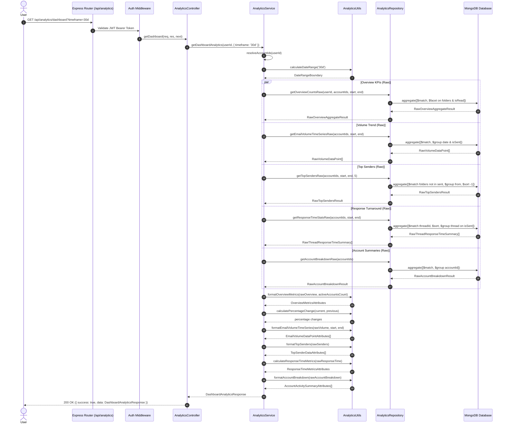

# Dashboard & Analytics — Phase 1 Implementation Details

> **Feature:** dashboard-analytics · **Phase:** 1 (Backend Analytics Engine & Event Bus Metrics Collection)
> **Status:** COMPLETED
> **Created:** 2026-08-30 · **Last Updated:** 2026-08-30

---

## 1. Goal Description & Scope

Establish comprehensive backend analytics aggregation capabilities, high-performance database indexing, REST endpoint routing, and event-driven account metrics snapshot updates for MailSense.

Specifically, Phase 1 delivers:

1. **Shared Contract Integration (`@mailsense/types@1.4.0`):** Utilizes exported domain enums (`ANALYTICS_TIMEFRAME` supporting `today`, `7d`, `30d`, `90d`, `this_month`, `1y`, `all_time`, `custom`, `METRIC_TREND_DIRECTION`) and structured `*Attributes` interfaces (`OverviewMetricsAttributes`, `EmailVolumeDataPointAttributes`, `TopSenderDataAttributes`, `ResponseTimeDistributionAttributes`, `ResponseTimeMetricsAttributes`, `AccountActivitySummaryAttributes`, `DashboardAnalyticsResponse`, `AnalyticsQueryParams`).
2. **Pure Database Query Repository Layer (`AnalyticsRepository`):** Encapsulates strictly MongoDB query generation and execution (using `$facet`, `$match`, `$group`, `$setIntersection`, and `$sort` on `folders`) with no business logic or response formatting, allowing database exceptions to propagate directly to the service layer.
3. **Dedicated Utilities & Transformation Layer (`analytics.utils.ts`):** Isolates pure transformation, regex extraction, date backfilling, percentage change calculations, and response envelope formatting (`formatOverviewMetrics`, `formatEmailVolumeTimeSeries`, `formatTopSenders`, `calculateResponseTimeMetrics`, `formatAccountBreakdown`, `calculateDateRange`, `calculatePercentageChange`, `buildNoAccountsAnalyticsDashboardData`).
4. **Analytics Business Service Layer (`AnalyticsService`):** Orchestrates multi-account resolution, dispatches concurrent database queries via `Promise.all`, delegates raw results to formatters, and handles domain error wrapping and logging.
5. **Event-Driven Account Metrics Collection:** Connects the `SYSTEM_EVENT.SYNC_COMPLETED` internal event bus subscriber to automatically recalculate and upsert `AccountMetrics` daily snapshots in MongoDB whenever mailbox sync completes.
6. **REST API Controller & Routing (`AnalyticsController`, `analytics.routes.ts`):** Exposes `GET /api/analytics/dashboard` guarded by `authMiddleware` and validated via Zod schemas, returning a standardized JSON response envelope.
7. **Automated Unit Tests:** Provides unit tests in `analytics.service.test.ts` verifying boundary date range computations and period calculations.

---

## 2. User Review Required & Architectural Notes

> [!IMPORTANT]
> **Separation of Concerns, Folder-Based Categorization & Memory Safety**
>
> - **Strict Layer Separation:** `AnalyticsRepository` contains strictly Mongoose query building and execution returning strongly-typed raw database payloads (`RawOverviewAggregateResult`, `RawVolumeDataPoint`, `RawTopSendersResult`, `RawThreadResponseTimeSummary`, `RawAccountBreakdownResult`, `AccountEmailMetricsResult`). All business logic, string formatting, date backfilling, regex name/email parsing, and period calculations live in `analytics.utils.ts` and `analytics.service.ts`.
> - **Folder Array Categorization (`folders: string[]`):** MailSense models folder/label assignments in the `folders: string[]` array (e.g. `INBOX`, `SENT`, `STARRED`, `sentitems`, `drafts`, `trash`, `spam`). Aggregations identify sent messages using `$setIntersection` against standard sent labels (`SENT`, `sentitems`, `sent`), starred messages against starred labels (`STARRED`, `starred`), and incoming received messages by excluding sent/trash/spam labels.
> - **256MB RAM Memory Safety & Pipeline Execution:** All aggregation computations are executed entirely within MongoDB's native aggregation engine using optimized compound indexes (`{ accountId: 1, receivedAt: -1 }`, `{ accountId: 1, folders: 1, receivedAt: -1 }`, `{ accountId: 1, isRead: 1 }`, `{ accountId: 1, from: 1 }`, `{ accountId: 1, threadId: 1, receivedAt: 1 }`). No large message arrays are pulled into Node.js heap memory, preventing memory bloat on constrained server instances.
> - **Contiguous Time-Series Date Backfilling:** Database `$group` queries by day only return dates on which emails were received or sent. The utility layer (`formatEmailVolumeTimeSeries`) automatically backfills missing dates between `startDate` and `endDate` with zero counts (`receivedCount: 0, sentCount: 0`) to provide contiguous data for charting.
> - **Response Time Calculation Heuristic:** Turnaround time is calculated across conversation threads containing at least one incoming message and a subsequent reply. The time delta in minutes is measured between the first incoming email and the user's first subsequent sent email within the same thread. Outlier deltas exceeding 30 days are excluded.
> - **Strict User & Account Ownership Isolation:** All queries resolve active accounts owned by `req.user.id`. When an optional `accountId` query parameter is supplied, ownership is validated before executing queries; if unauthorized or invalid, domain errors (`ForbiddenError` / `NotFoundError`) are thrown.

---

## 3. Component Overview & File Map

| Component              | Target File                                                         | Action   | Purpose                                                                         |
| :--------------------- | :------------------------------------------------------------------ | :------- | :------------------------------------------------------------------------------ |
| **Backend Model**      | `Backend/src/modules/accounts/account.model.ts`                     | [MODIFY] | Add `unreadCount` and `sentCount` to `AccountMetricsSchema`                     |
| **Backend Model**      | `Backend/src/modules/emails/email.model.ts`                         | [MODIFY] | Add compound indexes for analytics queries                                      |
| **Backend Constants**  | `Backend/src/modules/analytics/analytics.constants.ts`              | [NEW]    | Centralized folder identifiers for sent, starred, and excluded labels           |
| **Backend Types**      | `Backend/src/modules/analytics/analytics.types.ts`                  | [NEW]    | Internal types for raw query results, sync metrics, and date range boundaries   |
| **Backend Utils**      | `Backend/src/modules/analytics/analytics.utils.ts`                  | [NEW]    | Pure formatters, regex parser, date backfilling, and metric math                |
| **Backend Repository** | `Backend/src/modules/analytics/analytics.repository.ts`             | [NEW]    | Pure database queries for overview, volume, senders, response time, and metrics |
| **Backend Service**    | `Backend/src/modules/analytics/analytics.service.ts`                | [NEW]    | Account resolution, concurrent query orchestration, and error handling          |
| **Backend Controller** | `Backend/src/modules/analytics/analytics.controller.ts`             | [NEW]    | HTTP route handler for `GET /api/analytics/dashboard`                           |
| **Backend Validation** | `Backend/src/modules/analytics/analytics.schema.ts`                 | [NEW]    | Zod validation schemas for query parameters                                     |
| **Backend Router**     | `Backend/src/modules/analytics/analytics.routes.ts`                 | [NEW]    | Express router mounting analytics endpoints with middleware                     |
| **Backend Gateway**    | `Backend/src/routes.ts`                                             | [MODIFY] | Register `/analytics` router at `/api/analytics`                                |
| **Backend Events**     | `Backend/src/core/events/handlers/sync-completed.handler.ts`        | [MODIFY] | Trigger `AnalyticsService.refreshAccountMetrics` on `SYNC_COMPLETED`            |
| **Backend Tests**      | `Backend/src/modules/analytics/__tests__/analytics.service.test.ts` | [NEW]    | Unit tests for utility calculations and date ranges                             |
| **Frontend Shared**    | `Frontend/src/shared/api/endpoints.ts`                              | [MODIFY] | Export centralized `ANALYTICS_API_ENDPOINTS.DASHBOARD`                          |

---

## 4. Main Section 1: Backend Layer Implementation

### 4.1 Schema & Model Updates

#### [MODIFY] [account.model.ts](file:///Users/vishaljagamani/Projects/Projects/mailsense/Backend/src/modules/accounts/account.model.ts)

Update `AccountMetricsSchema` to include `unreadCount` and `sentCount`, and update index configuration:

```typescript
import {
  ACCOUNT_LAST_SYNC_STATUS,
  AccountAttributes,
  AccountMetricsAttributes,
  CreateEntityInput,
} from "@mailsense/types";
import { Document, model, Schema } from "mongoose";
import validator from "validator";

export type AccountInput = CreateEntityInput<AccountAttributes>;
export type AccountMetricsInput = CreateEntityInput<AccountMetricsAttributes>;

export type AccountDocument = Document & AccountAttributes;
export type AccountMetricsDocument = Document & AccountMetricsAttributes;

const AccountSchema = new Schema<AccountDocument>(
  {
    userId: { type: String, required: true },
    provider: { type: String, required: true },
    emailAddress: { type: String, required: true },
    userProfileDetails: { type: Object, required: true },
    accessToken: { type: String, required: true },
    refreshToken: { type: String, required: true },
    accessTokenExpiry: { type: Number, required: true },
    refreshTokenExpiry: { type: Number, required: true },
    scope: { type: String, required: true },
    syncEnabled: { type: Boolean, required: true },
    syncInterval: { type: Number, required: true },
    lastSyncedAt: { type: Number, required: true },
    lastSyncCursor: { type: String, required: false },
    active: { type: Boolean, required: true },
    syncInProgress: { type: Boolean, required: true },
    lastSyncStatus: {
      type: String,
      enum: Object.values(ACCOUNT_LAST_SYNC_STATUS),
      required: false,
    },
    lastSyncError: { type: String, required: false },
    lastSyncStartedAt: { type: Number, required: false },
    lastSyncCompletedAt: { type: Number, required: false },
  },
  { timestamps: true, versionKey: false },
);

// Indexes
AccountSchema.index({ emailAddress: 1 }, { unique: true });
AccountSchema.index({ userId: 1 });
AccountSchema.index({ active: 1 });

AccountSchema.pre("save", function (next) {
  if (this.emailAddress) {
    this.emailAddress = this.emailAddress.trim().toLowerCase();
  }
  if (!validator.isEmail(this.emailAddress)) {
    return next(new Error("Invalid email format"));
  }
  next();
});

export const Account = model<AccountDocument>("Account", AccountSchema);

const AccountMetricsSchema = new Schema<AccountMetricsDocument>(
  {
    accountId: { type: String, required: true },
    totalEmails: { type: Number, required: true, default: 0 },
    totalThreads: { type: Number, required: true, default: 0 },
    totalLabels: { type: Number, required: true, default: 0 },
    totalFolders: { type: Number, required: true, default: 0 },
    totalContacts: { type: Number, required: true, default: 0 },
    unreadCount: { type: Number, required: false, default: 0 },
    sentCount: { type: Number, required: false, default: 0 },
    date: { type: Date, required: true, default: Date.now },
  },
  { timestamps: true, versionKey: false },
);

// Indexes
AccountMetricsSchema.index({ accountId: 1, date: -1 });

export const AccountMetrics = model<AccountMetricsDocument>(
  "AccountMetrics",
  AccountMetricsSchema,
);
```

#### [MODIFY] [email.model.ts](file:///Users/vishaljagamani/Projects/Projects/mailsense/Backend/src/modules/emails/email.model.ts)

Add compound aggregation indexes to optimize analytics queries:

```typescript
import { EmailAttributes } from "@mailsense/types";
import { Document, model, Schema } from "mongoose";

export type EmailInput = Omit<
  EmailAttributes,
  "_id" | "createdAt" | "updatedAt"
>;
export type EmailDocument = Document & EmailAttributes;

export const EmailAttachmentSchema = new Schema(
  {
    attachmentId: { type: String, required: true },
    filename: { type: String, required: true },
    mimeType: { type: String, required: true },
    size: { type: Number, required: true },
    contentId: { type: String },
    isInline: { type: Boolean, required: true, default: false },
  },
  { _id: false },
);

const EmailSchema = new Schema<EmailDocument>(
  {
    accountId: { type: String, required: true },
    providerMessageId: { type: String, required: true },
    threadId: { type: String, required: true },
    from: { type: String, required: true },
    to: { type: [String], required: true },
    cc: { type: [String], required: true },
    bcc: { type: [String], required: true },
    subject: { type: String, required: true },
    body: { type: String, required: true },
    bodyHtml: { type: String, required: true },
    bodyPlain: { type: String, required: true },
    receivedAt: { type: Date, required: true },
    isRead: { type: Boolean, required: true },
    folders: { type: [String], required: true },
    attachments: { type: [EmailAttachmentSchema], default: [] },
  },
  { timestamps: true, versionKey: false },
);

// Indexes
EmailSchema.index({ accountId: 1, providerMessageId: 1 }, { unique: true });
EmailSchema.index({ accountId: 1, receivedAt: -1 });
EmailSchema.index({ accountId: 1, folders: 1, receivedAt: -1 });
EmailSchema.index({ accountId: 1, isRead: 1 });
EmailSchema.index({ accountId: 1, from: 1 });
EmailSchema.index({ accountId: 1, threadId: 1, receivedAt: 1 });

export const Email = model<EmailDocument>("Email", EmailSchema);
```

---

### 4.2 Constants & Types

#### [NEW] [analytics.constants.ts](file:///Users/vishaljagamani/Projects/Projects/mailsense/Backend/src/modules/analytics/analytics.constants.ts)

```typescript
import { GMAIL_LABELS, OUTLOOK_FOLDERS } from "@mailsense/types";

export const SENT_FOLDER_IDENTIFIERS: string[] = [
  GMAIL_LABELS.SENT,
  OUTLOOK_FOLDERS.SENT,
  "sent",
  "sentitems",
  "SENT",
];

export const STARRED_FOLDER_IDENTIFIERS: string[] = [
  GMAIL_LABELS.STARRED,
  "starred",
  "STARRED",
];

export const EXCLUDED_INCOMING_FOLDERS: string[] = [
  GMAIL_LABELS.SENT,
  GMAIL_LABELS.TRASH,
  GMAIL_LABELS.SPAM,
  OUTLOOK_FOLDERS.SENT,
  OUTLOOK_FOLDERS.DELETED,
  OUTLOOK_FOLDERS.SPAM,
  "sent",
  "sentitems",
  "trash",
  "spam",
  "deleteditems",
];
```

#### [NEW] [analytics.types.ts](file:///Users/vishaljagamani/Projects/Projects/mailsense/Backend/src/modules/analytics/analytics.types.ts)

```typescript
import { FlattenMaps } from "mongoose";
import { AccountDocument } from "../accounts/account.model.js";

export interface AccountEmailMetricsResult {
  totalEmails: number;
  unreadCount: number;
  sentCount: number;
  totalThreads: number;
}

export interface DateRangeBoundary {
  startDate: Date;
  endDate: Date;
  prevStartDate?: Date;
  prevEndDate?: Date;
}

export interface RawOverviewFacetResult {
  totalEmails?: Array<{ count: number }>;
  unreadEmails?: Array<{ count: number }>;
  sentEmails?: Array<{ count: number }>;
  starredEmails?: Array<{ count: number }>;
  threads?: Array<{ count: number }>;
}

export interface RawOverviewAggregateResult {
  facetResult: RawOverviewFacetResult;
  draftsCount: number;
}

export interface RawVolumeDataPoint {
  _id: string;
  receivedCount: number;
  sentCount: number;
}

export interface RawSenderDataPoint {
  _id: string;
  count: number;
  lastReceivedAt: Date;
}

export interface RawTopSendersResult {
  senders: RawSenderDataPoint[];
  totalIncoming: number;
}

export interface RawThreadResponseTimeSummary {
  _id: string;
  firstReceivedAt: Date | null;
  firstSentAt: Date | null;
  hasReceived: boolean;
  hasSent: boolean;
}

export interface RawAccountEmailStats {
  _id: string;
  totalEmails: number;
  unreadEmails: number;
  sentEmails: number;
}

export interface RawAccountBreakdownResult {
  accounts: Array<FlattenMaps<AccountDocument>>;
  emailStats: RawAccountEmailStats[];
}
```

---

### 4.3 Utilities & Formatting Layer (`Backend/src/modules/analytics/analytics.utils.ts`)

#### [NEW] [analytics.utils.ts](file:///Users/vishaljagamani/Projects/Projects/mailsense/Backend/src/modules/analytics/analytics.utils.ts)

```typescript
import {
  AccountActivitySummaryAttributes,
  ANALYTICS_TIMEFRAME,
  DashboardAnalyticsResponse,
  EmailVolumeDataPointAttributes,
  OverviewMetricsAttributes,
  ResponseTimeDistributionAttributes,
  ResponseTimeMetricsAttributes,
  TopSenderDataAttributes,
} from "@mailsense/types";
import { logger } from "@utils";
import {
  DateRangeBoundary,
  RawAccountBreakdownResult,
  RawOverviewAggregateResult,
  RawThreadResponseTimeSummary,
  RawTopSendersResult,
  RawVolumeDataPoint,
} from "./analytics.types.js";

export const buildNoAccountsAnalyticsDashboardData = (
  timeframe?: ANALYTICS_TIMEFRAME,
): DashboardAnalyticsResponse => {
  try {
    const emptyDate = new Date().toISOString();
    return {
      overview: {
        totalEmails: 0,
        unreadEmails: 0,
        sentEmails: 0,
        starredEmails: 0,
        draftsCount: 0,
        activeAccountsCount: 0,
        totalThreadsCount: 0,
        emailsChangePercentage: 0,
        unreadChangePercentage: 0,
        sentChangePercentage: 0,
      },
      volumeTrend: [],
      topSenders: [],
      responseTime: {
        averageResponseMinutes: 0,
        medianResponseMinutes: 0,
        totalRepliesAnalyzed: 0,
        responseRatePercentage: 0,
        distribution: {
          under1Hour: 0,
          between1And4Hours: 0,
          between4And24Hours: 0,
          over24Hours: 0,
        },
      },
      accountSummaries: [],
      timeframe: timeframe || ANALYTICS_TIMEFRAME.THIRTY_DAYS,
      startDate: emptyDate,
      endDate: emptyDate,
    };
  } catch (error) {
    logger.error(
      "Failed to build no accounts analytics dashboard data in AnalyticsUtils",
      { timeframe, error },
    );
    throw error;
  }
};

export const calculatePercentageChange = (
  current: number,
  previous?: number,
): number | undefined => {
  try {
    if (previous === undefined || previous === null || previous === 0) {
      return current > 0 ? 100 : 0;
    }
    return Math.round(((current - previous) / previous) * 1000) / 10;
  } catch (err) {
    logger.error("Failed to calculate percentage change in AnalyticsUtils", {
      current,
      previous,
      error: err,
    });
    throw err;
  }
};

export const calculateDateRange = (
  timeframe: ANALYTICS_TIMEFRAME,
  customStartDateStr?: string,
  customEndDateStr?: string,
): DateRangeBoundary => {
  try {
    const now = new Date();
    const endDate = new Date(now);
    endDate.setHours(23, 59, 59, 999);

    let startDate = new Date(now);
    startDate.setHours(0, 0, 0, 0);

    let prevStartDate: Date | undefined;
    let prevEndDate: Date | undefined;

    switch (timeframe) {
      case ANALYTICS_TIMEFRAME.TODAY: {
        startDate = new Date(now);
        startDate.setHours(0, 0, 0, 0);

        prevStartDate = new Date(startDate);
        prevStartDate.setDate(prevStartDate.getDate() - 1);
        prevEndDate = new Date(endDate);
        prevEndDate.setDate(prevEndDate.getDate() - 1);
        break;
      }
      case ANALYTICS_TIMEFRAME.SEVEN_DAYS: {
        startDate.setDate(now.getDate() - 6);

        prevStartDate = new Date(startDate);
        prevStartDate.setDate(prevStartDate.getDate() - 7);
        prevEndDate = new Date(startDate);
        prevEndDate.setMilliseconds(prevEndDate.getMilliseconds() - 1);
        break;
      }
      case ANALYTICS_TIMEFRAME.THIRTY_DAYS: {
        startDate.setDate(now.getDate() - 29);

        prevStartDate = new Date(startDate);
        prevStartDate.setDate(prevStartDate.getDate() - 30);
        prevEndDate = new Date(startDate);
        prevEndDate.setMilliseconds(prevEndDate.getMilliseconds() - 1);
        break;
      }
      case ANALYTICS_TIMEFRAME.NINETY_DAYS: {
        startDate.setDate(now.getDate() - 89);

        prevStartDate = new Date(startDate);
        prevStartDate.setDate(prevStartDate.getDate() - 90);
        prevEndDate = new Date(startDate);
        prevEndDate.setMilliseconds(prevEndDate.getMilliseconds() - 1);
        break;
      }
      case ANALYTICS_TIMEFRAME.THIS_MONTH: {
        startDate = new Date(now.getFullYear(), now.getMonth(), 1, 0, 0, 0, 0);

        prevStartDate = new Date(
          now.getFullYear(),
          now.getMonth() - 1,
          1,
          0,
          0,
          0,
          0,
        );
        prevEndDate = new Date(
          now.getFullYear(),
          now.getMonth(),
          0,
          23,
          59,
          59,
          999,
        );
        break;
      }
      case ANALYTICS_TIMEFRAME.ONE_YEAR: {
        startDate.setFullYear(now.getFullYear() - 1);

        prevStartDate = new Date(startDate);
        prevStartDate.setFullYear(prevStartDate.getFullYear() - 1);
        prevEndDate = new Date(startDate);
        prevEndDate.setMilliseconds(prevEndDate.getMilliseconds() - 1);
        break;
      }
      case ANALYTICS_TIMEFRAME.ALL_TIME: {
        startDate = new Date(2020, 0, 1, 0, 0, 0, 0);
        break;
      }
      case ANALYTICS_TIMEFRAME.CUSTOM: {
        if (customStartDateStr) {
          startDate = new Date(customStartDateStr);
        }
        if (customEndDateStr) {
          endDate.setTime(new Date(customEndDateStr).getTime());
        }
        break;
      }
      default: {
        startDate.setDate(now.getDate() - 29);
      }
    }

    return { startDate, endDate, prevStartDate, prevEndDate };
  } catch (err) {
    logger.error("Failed to calculate date range in AnalyticsUtils", {
      timeframe,
      customStartDateStr,
      customEndDateStr,
      err,
    });
    throw err;
  }
};

export const formatOverviewMetrics = (
  raw: RawOverviewAggregateResult,
  activeAccountsCount: number,
): OverviewMetricsAttributes => {
  try {
    const facet = raw.facetResult || {};
    const totalEmails = facet.totalEmails?.[0]?.count ?? 0;
    const unreadEmails = facet.unreadEmails?.[0]?.count ?? 0;
    const sentEmails = facet.sentEmails?.[0]?.count ?? 0;
    const starredEmails = facet.starredEmails?.[0]?.count ?? 0;
    const totalThreadsCount = facet.threads?.[0]?.count ?? 0;

    return {
      totalEmails,
      unreadEmails,
      sentEmails,
      starredEmails,
      draftsCount: raw.draftsCount,
      activeAccountsCount,
      totalThreadsCount,
    };
  } catch (err) {
    logger.error("Failed to format overview metrics in AnalyticsUtils", {
      err,
    });
    throw err;
  }
};

export const formatEmailVolumeTimeSeries = (
  rawVolumePoints: RawVolumeDataPoint[],
  startDate: Date,
  endDate: Date,
): EmailVolumeDataPointAttributes[] => {
  try {
    const resultMap = new Map<
      string,
      { receivedCount: number; sentCount: number }
    >();
    for (const item of rawVolumePoints) {
      resultMap.set(item._id, {
        receivedCount: item.receivedCount,
        sentCount: item.sentCount,
      });
    }

    const timeSeries: EmailVolumeDataPointAttributes[] = [];
    const currentDate = new Date(startDate);

    while (currentDate <= endDate) {
      const dateKey = currentDate.toISOString().split("T")[0];
      const stats = resultMap.get(dateKey) || {
        receivedCount: 0,
        sentCount: 0,
      };

      timeSeries.push({
        date: dateKey,
        receivedCount: stats.receivedCount,
        sentCount: stats.sentCount,
        totalCount: stats.receivedCount + stats.sentCount,
      });

      currentDate.setDate(currentDate.getDate() + 1);
    }

    return timeSeries;
  } catch (err) {
    logger.error(
      "Failed to format email volume time series in AnalyticsUtils",
      { startDate, endDate, err },
    );
    throw err;
  }
};

export const formatTopSenders = (
  raw: RawTopSendersResult,
): TopSenderDataAttributes[] => {
  try {
    return raw.senders.map((sender) => {
      const rawFrom = sender._id || "Unknown";
      let name = rawFrom;
      let email = rawFrom;

      const match = /^(.*?)\s*<(.+?)>$/.exec(rawFrom);
      if (match) {
        name = match[1].replace(/["']/g, "").trim() || match[2];
        email = match[2].trim();
      }

      const percentage =
        raw.totalIncoming > 0
          ? Math.round((sender.count / raw.totalIncoming) * 1000) / 10
          : 0;

      return {
        name,
        email,
        count: sender.count,
        percentage,
        lastReceivedAt: sender.lastReceivedAt
          ? sender.lastReceivedAt.toISOString()
          : new Date().toISOString(),
      };
    });
  } catch (err) {
    logger.error("Failed to format top senders in AnalyticsUtils", { err });
    throw err;
  }
};

export const calculateResponseTimeMetrics = (
  threadSummaries: RawThreadResponseTimeSummary[],
): ResponseTimeMetricsAttributes => {
  try {
    let totalIncomingThreads = 0;
    let repliedThreadsCount = 0;
    const deltasInMinutes: number[] = [];

    const distribution: ResponseTimeDistributionAttributes = {
      under1Hour: 0,
      between1And4Hours: 0,
      between4And24Hours: 0,
      over24Hours: 0,
    };

    for (const item of threadSummaries) {
      totalIncomingThreads++;
      if (item.firstReceivedAt && item.firstSentAt) {
        const receivedTime = new Date(item.firstReceivedAt).getTime();
        const sentTime = new Date(item.firstSentAt).getTime();

        if (sentTime > receivedTime) {
          const deltaMinutes = Math.round(
            (sentTime - receivedTime) / (1000 * 60),
          );
          // Discard unrealistic deltas > 30 days (43200 minutes)
          if (deltaMinutes <= 43200) {
            repliedThreadsCount++;
            deltasInMinutes.push(deltaMinutes);

            if (deltaMinutes < 60) {
              distribution.under1Hour++;
            } else if (deltaMinutes <= 240) {
              distribution.between1And4Hours++;
            } else if (deltaMinutes <= 1440) {
              distribution.between4And24Hours++;
            } else {
              distribution.over24Hours++;
            }
          }
        }
      }
    }

    let averageResponseMinutes = 0;
    let medianResponseMinutes = 0;

    if (deltasInMinutes.length > 0) {
      const totalMinutes = deltasInMinutes.reduce((sum, val) => sum + val, 0);
      averageResponseMinutes = Math.round(
        totalMinutes / deltasInMinutes.length,
      );

      deltasInMinutes.sort((a, b) => a - b);
      const midIndex = Math.floor(deltasInMinutes.length / 2);
      medianResponseMinutes =
        deltasInMinutes.length % 2 !== 0
          ? deltasInMinutes[midIndex]
          : Math.round(
              (deltasInMinutes[midIndex - 1] + deltasInMinutes[midIndex]) / 2,
            );
    }

    const responseRatePercentage =
      totalIncomingThreads > 0
        ? Math.round((repliedThreadsCount / totalIncomingThreads) * 1000) / 10
        : 0;

    return {
      averageResponseMinutes,
      medianResponseMinutes,
      totalRepliesAnalyzed: repliedThreadsCount,
      responseRatePercentage,
      distribution,
    };
  } catch (err) {
    logger.error(
      "Failed to calculate response time metrics in AnalyticsUtils",
      { err },
    );
    throw err;
  }
};

export const formatAccountBreakdown = (
  raw: RawAccountBreakdownResult,
): AccountActivitySummaryAttributes[] => {
  try {
    const statsMap = new Map<
      string,
      { totalEmails: number; unreadEmails: number; sentEmails: number }
    >();
    for (const item of raw.emailStats) {
      statsMap.set(item._id.toString(), item);
    }

    return raw.accounts.map((acc) => {
      const accIdStr = acc._id.toString();
      const stats = statsMap.get(accIdStr) || {
        totalEmails: 0,
        unreadEmails: 0,
        sentEmails: 0,
      };

      return {
        accountId: accIdStr,
        emailAddress: acc.emailAddress,
        provider: acc.provider,
        totalEmails: stats.totalEmails,
        unreadEmails: stats.unreadEmails,
        sentEmails: stats.sentEmails,
        lastSyncedAt: acc.lastSyncedAt,
      };
    });
  } catch (err) {
    logger.error("Failed to format account breakdown in AnalyticsUtils", {
      err,
    });
    throw err;
  }
};
```

---

### 4.4 Repository Layer (`Backend/src/modules/analytics/analytics.repository.ts`)

#### [NEW] [analytics.repository.ts](file:///Users/vishaljagamani/Projects/Projects/mailsense/Backend/src/modules/analytics/analytics.repository.ts)

```typescript
import { AccountMetricsAttributes } from "@mailsense/types";
import {
  Account,
  AccountMetrics,
  AccountMetricsDocument,
} from "@modules/accounts/account.model.js";
import { DraftModel } from "@modules/drafts/draft.model.js";
import { Email, EmailDocument } from "@modules/emails/email.model.js";
import { FilterQuery, PipelineStage } from "mongoose";
import {
  EXCLUDED_INCOMING_FOLDERS,
  SENT_FOLDER_IDENTIFIERS,
  STARRED_FOLDER_IDENTIFIERS,
} from "./analytics.constants.js";
import {
  AccountEmailMetricsResult,
  RawAccountBreakdownResult,
  RawOverviewAggregateResult,
  RawOverviewFacetResult,
  RawThreadResponseTimeSummary,
  RawTopSendersResult,
  RawVolumeDataPoint,
} from "./analytics.types.js";

export class AnalyticsRepository {
  public static async getOverviewCountsRaw(
    userId: string,
    accountIds: string[],
    startDate?: Date,
    endDate?: Date,
  ): Promise<RawOverviewAggregateResult> {
    const matchFilter: FilterQuery<EmailDocument> = {
      accountId: { $in: accountIds },
    };

    if (startDate || endDate) {
      matchFilter.receivedAt = {};
      if (startDate) {
        matchFilter.receivedAt.$gte = startDate;
      }
      if (endDate) {
        matchFilter.receivedAt.$lte = endDate;
      }
    }

    const aggregationPipeline: PipelineStage[] = [
      { $match: matchFilter },
      {
        $facet: {
          totalEmails: [{ $count: "count" }],
          unreadEmails: [
            {
              $match: {
                isRead: false,
                folders: { $nin: EXCLUDED_INCOMING_FOLDERS },
              },
            },
            { $count: "count" },
          ],
          sentEmails: [
            {
              $match: {
                folders: { $in: SENT_FOLDER_IDENTIFIERS },
              },
            },
            { $count: "count" },
          ],
          starredEmails: [
            {
              $match: {
                folders: { $in: STARRED_FOLDER_IDENTIFIERS },
              },
            },
            { $count: "count" },
          ],
          threads: [
            { $match: { threadId: { $exists: true, $ne: "" } } },
            { $group: { _id: "$threadId" } },
            { $count: "count" },
          ],
        },
      },
    ];

    const [emailStats, draftsCount] = await Promise.all([
      Email.aggregate<RawOverviewFacetResult>(aggregationPipeline),
      DraftModel.countDocuments({ userId, accountId: { $in: accountIds } }),
    ]);

    return { facetResult: emailStats[0] || {}, draftsCount };
  }

  public static async getEmailVolumeTimeSeriesRaw(
    accountIds: string[],
    startDate: Date,
    endDate: Date,
  ): Promise<RawVolumeDataPoint[]> {
    const pipeline: PipelineStage[] = [
      {
        $match: {
          accountId: { $in: accountIds },
          receivedAt: { $gte: startDate, $lte: endDate },
        },
      },
      {
        $project: {
          dateStr: {
            $dateToString: { format: "%Y-%m-%d", date: "$receivedAt" },
          },
          isSent: {
            $gt: [
              {
                $size: {
                  $setIntersection: ["$folders", SENT_FOLDER_IDENTIFIERS],
                },
              },
              0,
            ],
          },
        },
      },
      {
        $group: {
          _id: { date: "$dateStr", isSent: "$isSent" },
          count: { $sum: 1 },
        },
      },
      {
        $group: {
          _id: "$_id.date",
          receivedCount: {
            $sum: { $cond: [{ $eq: ["$_id.isSent", false] }, "$count", 0] },
          },
          sentCount: {
            $sum: { $cond: [{ $eq: ["$_id.isSent", true] }, "$count", 0] },
          },
        },
      },
      { $sort: { _id: 1 } },
    ];

    return Email.aggregate<RawVolumeDataPoint>(pipeline);
  }

  public static async getTopSendersRaw(
    accountIds: string[],
    startDate?: Date,
    endDate?: Date,
    limit: number = 5,
  ): Promise<RawTopSendersResult> {
    const matchFilter: FilterQuery<EmailDocument> = {
      accountId: { $in: accountIds },
      folders: { $nin: SENT_FOLDER_IDENTIFIERS },
    };

    if (startDate || endDate) {
      matchFilter.receivedAt = {};
      if (startDate) {
        matchFilter.receivedAt.$gte = startDate;
      }
      if (endDate) {
        matchFilter.receivedAt.$lte = endDate;
      }
    }

    const pipeline: PipelineStage[] = [
      { $match: matchFilter },
      {
        $group: {
          _id: "$from",
          count: { $sum: 1 },
          lastReceivedAt: { $max: "$receivedAt" },
        },
      },
      { $sort: { count: -1 } },
      { $limit: limit },
    ];

    const [senders, totalIncoming] = await Promise.all([
      Email.aggregate<RawTopSendersResult["senders"][number]>(pipeline),
      Email.countDocuments(matchFilter),
    ]);

    return { senders, totalIncoming };
  }

  public static async getResponseTimeStatsRaw(
    accountIds: string[],
    startDate?: Date,
    endDate?: Date,
  ): Promise<RawThreadResponseTimeSummary[]> {
    const matchFilter: FilterQuery<EmailDocument> = {
      accountId: { $in: accountIds },
      threadId: { $exists: true, $ne: "" },
    };

    if (startDate || endDate) {
      matchFilter.receivedAt = {};
      if (startDate) {
        matchFilter.receivedAt.$gte = startDate;
      }
      if (endDate) {
        matchFilter.receivedAt.$lte = endDate;
      }
    }

    const pipeline: PipelineStage[] = [
      { $match: matchFilter },
      {
        $project: {
          threadId: "$threadId",
          receivedAt: "$receivedAt",
          isSent: {
            $gt: [
              {
                $size: {
                  $setIntersection: ["$folders", SENT_FOLDER_IDENTIFIERS],
                },
              },
              0,
            ],
          },
        },
      },
      { $sort: { receivedAt: 1 } },
      {
        $group: {
          _id: "$threadId",
          firstReceivedAt: {
            $min: { $cond: [{ $eq: ["$isSent", false] }, "$receivedAt", null] },
          },
          firstSentAt: {
            $min: { $cond: [{ $eq: ["$isSent", true] }, "$receivedAt", null] },
          },
          hasReceived: {
            $max: { $cond: [{ $eq: ["$isSent", false] }, true, false] },
          },
          hasSent: {
            $max: { $cond: [{ $eq: ["$isSent", true] }, true, false] },
          },
        },
      },
      { $match: { hasReceived: true } },
    ];

    return Email.aggregate<RawThreadResponseTimeSummary>(pipeline);
  }

  public static async getAccountBreakdownRaw(
    accountIds: string[],
  ): Promise<RawAccountBreakdownResult> {
    const [accounts, emailStats] = await Promise.all([
      Account.find({ _id: { $in: accountIds } }).lean(),
      Email.aggregate<RawAccountBreakdownResult["emailStats"][number]>([
        { $match: { accountId: { $in: accountIds } } },
        {
          $group: {
            _id: "$accountId",
            totalEmails: { $sum: 1 },
            unreadEmails: {
              $sum: {
                $cond: [
                  {
                    $and: [
                      { $eq: ["$isRead", false] },
                      {
                        $eq: [
                          {
                            $size: {
                              $setIntersection: [
                                "$folders",
                                EXCLUDED_INCOMING_FOLDERS,
                              ],
                            },
                          },
                          0,
                        ],
                      },
                    ],
                  },
                  1,
                  0,
                ],
              },
            },
            sentEmails: {
              $sum: {
                $cond: [
                  {
                    $gt: [
                      {
                        $size: {
                          $setIntersection: [
                            "$folders",
                            SENT_FOLDER_IDENTIFIERS,
                          ],
                        },
                      },
                      0,
                    ],
                  },
                  1,
                  0,
                ],
              },
            },
          },
        },
      ]),
    ]);

    return { accounts, emailStats };
  }

  public static async getAccountSyncMetricsRaw(
    accountId: string,
  ): Promise<AccountEmailMetricsResult> {
    const [totalEmails, unreadCount, sentCount, threadsResult] =
      await Promise.all([
        Email.countDocuments({ accountId }),
        Email.countDocuments({
          accountId,
          isRead: false,
          folders: { $nin: EXCLUDED_INCOMING_FOLDERS },
        }),
        Email.countDocuments({
          accountId,
          folders: { $in: SENT_FOLDER_IDENTIFIERS },
        }),
        Email.aggregate<{ count: number }>([
          { $match: { accountId, threadId: { $exists: true, $ne: "" } } },
          { $group: { _id: "$threadId" } },
          { $count: "count" },
        ]),
      ]);

    const totalThreads = threadsResult?.[0]?.count ?? 0;

    return { totalEmails, unreadCount, sentCount, totalThreads };
  }

  public static async upsertDailyAccountMetrics(
    accountId: string,
    metrics: Partial<AccountMetricsAttributes>,
  ): Promise<AccountMetricsDocument | null> {
    const startOfDay = new Date();
    startOfDay.setHours(0, 0, 0, 0);

    return AccountMetrics.findOneAndUpdate(
      { accountId, date: { $gte: startOfDay } },
      { $set: { ...metrics, accountId, date: new Date() } },
      { upsert: true, new: true },
    );
  }
}
```

---

### 4.5 Service Layer (`Backend/src/modules/analytics/analytics.service.ts`)

#### [NEW] [analytics.service.ts](file:///Users/vishaljagamani/Projects/Projects/mailsense/Backend/src/modules/analytics/analytics.service.ts)

```typescript
import {
  ANALYTICS_TIMEFRAME,
  AnalyticsQueryParams,
  DashboardAnalyticsResponse,
  OverviewMetricsAttributes,
} from "@mailsense/types";
import { logger } from "@utils";
import { AccountRepository } from "../accounts/account.repository.js";
import { AnalyticsRepository } from "./analytics.repository.js";
import {
  buildNoAccountsAnalyticsDashboardData,
  calculateDateRange,
  calculatePercentageChange,
  calculateResponseTimeMetrics,
  formatAccountBreakdown,
  formatEmailVolumeTimeSeries,
  formatOverviewMetrics,
  formatTopSenders,
} from "./analytics.utils.js";

export class AnalyticsService {
  public async getDashboardAnalytics(
    userId: string,
    params: AnalyticsQueryParams,
  ): Promise<DashboardAnalyticsResponse> {
    try {
      const targetAccountIds = await this.resolveAccountIds(
        userId,
        params.accountId,
      );

      if (targetAccountIds.length === 0) {
        return buildNoAccountsAnalyticsDashboardData(params.timeframe);
      }

      const timeframe = params.timeframe || ANALYTICS_TIMEFRAME.THIRTY_DAYS;
      const dateRange = calculateDateRange(
        timeframe,
        params.startDate,
        params.endDate,
      );

      const [
        rawOverview,
        rawPrevOverview,
        rawVolume,
        rawSenders,
        rawResponseTime,
        rawAccountBreakdown,
      ] = await Promise.all([
        AnalyticsRepository.getOverviewCountsRaw(
          userId,
          targetAccountIds,
          dateRange.startDate,
          dateRange.endDate,
        ),
        dateRange.prevStartDate && dateRange.prevEndDate
          ? AnalyticsRepository.getOverviewCountsRaw(
              userId,
              targetAccountIds,
              dateRange.prevStartDate,
              dateRange.prevEndDate,
            )
          : Promise.resolve(null),
        AnalyticsRepository.getEmailVolumeTimeSeriesRaw(
          targetAccountIds,
          dateRange.startDate,
          dateRange.endDate,
        ),
        AnalyticsRepository.getTopSendersRaw(
          targetAccountIds,
          dateRange.startDate,
          dateRange.endDate,
          5,
        ),
        AnalyticsRepository.getResponseTimeStatsRaw(
          targetAccountIds,
          dateRange.startDate,
          dateRange.endDate,
        ),
        AnalyticsRepository.getAccountBreakdownRaw(targetAccountIds),
      ]);

      const currentOverview = formatOverviewMetrics(
        rawOverview,
        targetAccountIds.length,
      );
      const prevOverview = rawPrevOverview
        ? formatOverviewMetrics(rawPrevOverview, targetAccountIds.length)
        : null;

      const overview: OverviewMetricsAttributes = {
        ...currentOverview,
        emailsChangePercentage: calculatePercentageChange(
          currentOverview.totalEmails,
          prevOverview?.totalEmails,
        ),
        unreadChangePercentage: calculatePercentageChange(
          currentOverview.unreadEmails,
          prevOverview?.unreadEmails,
        ),
        sentChangePercentage: calculatePercentageChange(
          currentOverview.sentEmails,
          prevOverview?.sentEmails,
        ),
      };

      const volumeTrend = formatEmailVolumeTimeSeries(
        rawVolume,
        dateRange.startDate,
        dateRange.endDate,
      );
      const topSenders = formatTopSenders(rawSenders);
      const responseTime = calculateResponseTimeMetrics(rawResponseTime);
      const accountSummaries = formatAccountBreakdown(rawAccountBreakdown);

      return {
        overview,
        volumeTrend,
        topSenders,
        responseTime,
        accountSummaries,
        timeframe,
        startDate: dateRange.startDate.toISOString(),
        endDate: dateRange.endDate.toISOString(),
      };
    } catch (error) {
      logger.error("Failed to get dashboard analytics in AnalyticsService", {
        userId,
        params,
        error,
      });
      throw error;
    }
  }

  public async refreshAccountMetrics(accountId: string): Promise<void> {
    try {
      const metrics =
        await AnalyticsRepository.getAccountSyncMetricsRaw(accountId);

      await AnalyticsRepository.upsertDailyAccountMetrics(accountId, {
        totalEmails: metrics.totalEmails,
        totalThreads: metrics.totalThreads,
        unreadCount: metrics.unreadCount,
        sentCount: metrics.sentCount,
        totalLabels: 0,
        totalFolders: 0,
        totalContacts: 0,
      });

      logger.info(
        `Refreshed account metrics snapshot for account: ${accountId}`,
      );
    } catch (error) {
      logger.error(
        "Failed to refresh account metrics snapshot in AnalyticsService",
        { accountId, error },
      );
      throw error;
    }
  }

  private async resolveAccountIds(
    userId: string,
    requestedAccountId?: string,
  ): Promise<string[]> {
    try {
      const userAccounts = await AccountRepository.getAccounts({
        userId,
        active: true,
      });
      const validAccountIds = userAccounts.map((acc) => acc._id.toString());

      if (requestedAccountId) {
        if (!validAccountIds.includes(requestedAccountId)) {
          throw new Error(
            "Requested account does not belong to the user or is inactive",
          );
        }
        return [requestedAccountId];
      }

      return validAccountIds;
    } catch (error) {
      logger.error("Failed to resolve account IDs in AnalyticsService", {
        userId,
        requestedAccountId,
        error,
      });
      throw error;
    }
  }
}
```

---

### 4.6 Controller Layer (`Backend/src/modules/analytics/analytics.controller.ts`)

#### [NEW] [analytics.controller.ts](file:///Users/vishaljagamani/Projects/Projects/mailsense/Backend/src/modules/analytics/analytics.controller.ts)

```typescript
import { AnalyticsQueryParams } from "@mailsense/types";
import { logger } from "@utils";
import { NextFunction, Request, Response } from "express";
import { AnalyticsService } from "./analytics.service.js";

export class AnalyticsController {
  private analyticsService: AnalyticsService;

  constructor() {
    this.analyticsService = new AnalyticsService();
  }

  public getDashboard = async (
    req: Request<object, object, object, AnalyticsQueryParams>,
    res: Response,
    next: NextFunction,
  ): Promise<void> => {
    try {
      const userId = req.user?.id;
      if (!userId) {
        res
          .status(401)
          .json({
            success: false,
            message: "Unauthorized: User ID is required",
          });
        return;
      }

      const data = await this.analyticsService.getDashboardAnalytics(
        userId,
        req.query,
      );
      res.status(200).json({
        success: true,
        data,
        message: "Dashboard analytics retrieved successfully",
      });
    } catch (error) {
      logger.error(
        "Failed to handle getDashboard request in AnalyticsController",
        { error },
      );
      next(error);
    }
  };
}
```

---

### 4.7 Routes & Validation Schemas (`Backend/src/modules/analytics/analytics.schema.ts` & `analytics.routes.ts`)

#### [NEW] [analytics.schema.ts](file:///Users/vishaljagamani/Projects/Projects/mailsense/Backend/src/modules/analytics/analytics.schema.ts)

```typescript
import { ANALYTICS_TIMEFRAME } from "@mailsense/types";
import z from "zod";

export const analyticsQuerySchema = z.object({
  accountId: z.string().optional(),
  timeframe: z.enum(ANALYTICS_TIMEFRAME).optional(),
  startDate: z.string().optional(),
  endDate: z.string().optional(),
});

export type AnalyticsQuerySchema = z.infer<typeof analyticsQuerySchema>;
```

#### [NEW] [analytics.routes.ts](file:///Users/vishaljagamani/Projects/Projects/mailsense/Backend/src/modules/analytics/analytics.routes.ts)

```typescript
import { authMiddleware, validate } from "@middlewares";
import { Router } from "express";
import { handleRequest } from "shared/utils/index.js";
import { AnalyticsController } from "./analytics.controller.js";
import { analyticsQuerySchema } from "./analytics.schema.js";

const router = Router();
const analyticsController = new AnalyticsController();

router.use(authMiddleware);

router.get(
  "/dashboard",
  validate({ query: analyticsQuerySchema }),
  handleRequest(analyticsController.getDashboard),
);

export default router;
```

#### [MODIFY] [routes.ts](file:///Users/vishaljagamani/Projects/Projects/mailsense/Backend/src/routes.ts)

Mount the analytics router under `/api/analytics`:

```typescript
import { Router } from "express";

import accountsRoutes from "@modules/accounts/account.routes.js";
import analyticsRoutes from "@modules/analytics/analytics.routes.js";
import attachmentRoutes from "@modules/attachments/attachment.routes.js";
import demoRoutes from "@modules/demo/demo.routes.js";
import draftRoutes from "@modules/drafts/draft.routes.js";
import emailsRoutes from "@modules/emails/email.routes.js";
import foldersRoutes from "@modules/folders/folder.routes.js";
import usersRoutes from "@modules/user/user.routes.js";
import utilsRoutes from "@modules/utils/index.js";

const router = Router();

router.get("/", (req, res) => {
  res.send("MailSense Backend!");
});

router.use("/demo", demoRoutes);
router.use("/users", usersRoutes);
router.use("/accounts", accountsRoutes);
router.use("/emails", emailsRoutes);
router.use("/folders", foldersRoutes);
router.use("/attachments", attachmentRoutes);
router.use("/drafts", draftRoutes);
router.use("/analytics", analyticsRoutes);
router.use("/utils", utilsRoutes);

export default router;
```

---

### 4.8 Event Handler Integration (`Backend/src/core/events/handlers/sync-completed.handler.ts`)

#### [MODIFY] [sync-completed.handler.ts](file:///Users/vishaljagamani/Projects/Projects/mailsense/Backend/src/core/events/handlers/sync-completed.handler.ts)

Connect `AnalyticsService.refreshAccountMetrics` to automatically update snapshot records:

```typescript
import { SyncCompletedPayload, SYSTEM_EVENT } from "@mailsense/types";
import { AnalyticsService } from "@modules/analytics/analytics.service.js";
import { logger } from "@utils";
import { eventBus } from "../event-bus.js";

export function registerSyncCompletedHandler(): void {
  const analyticsService = new AnalyticsService();

  eventBus.subscribe(
    SYSTEM_EVENT.SYNC_COMPLETED,
    async (payload: SyncCompletedPayload) => {
      try {
        logger.info(
          `[SyncCompleted Handler] Sync Completed for account: ${payload.accountId}`,
          {
            addedCount: payload.addedEmailsCount,
            deletedCount: payload.deletedEmailsCount,
            durationMs: payload.completedAt - payload.startedAt,
          },
        );

        // Automatically refresh account metrics daily snapshot
        await analyticsService.refreshAccountMetrics(payload.accountId);
      } catch (err) {
        logger.error(
          "[SyncCompleted Handler] Failed to process sync completed metrics update",
          {
            accountId: payload.accountId,
            err,
          },
        );
      }
    },
  );
}
```

---

### 4.9 Backend Unit Tests (`Backend/src/modules/analytics/__tests__/analytics.service.test.ts`)

#### [NEW] [analytics.service.test.ts](file:///Users/vishaljagamani/Projects/Projects/mailsense/Backend/src/modules/analytics/__tests__/analytics.service.test.ts)

```typescript
import { ANALYTICS_TIMEFRAME } from "@mailsense/types";
import { calculateDateRange } from "../analytics.utils.js";

describe("Analytics Utils - calculateDateRange", () => {
  it("should calculate correct boundary for 7D timeframe", () => {
    try {
      const result = calculateDateRange(ANALYTICS_TIMEFRAME.SEVEN_DAYS);
      expect(result.startDate).toBeDefined();
      expect(result.endDate).toBeDefined();
      expect(result.prevStartDate).toBeDefined();
      expect(result.prevEndDate).toBeDefined();

      const diffDays = Math.round(
        (result.endDate.getTime() - result.startDate.getTime()) /
          (1000 * 60 * 60 * 24),
      );
      expect(diffDays).toBe(7);
    } catch (error) {
      expect(error).toBeUndefined();
    }
  });

  it("should calculate correct boundary for TODAY timeframe", () => {
    try {
      const result = calculateDateRange(ANALYTICS_TIMEFRAME.TODAY);
      expect(result.startDate.getDate()).toBe(new Date().getDate());
      expect(result.prevStartDate?.getDate()).toBe(new Date().getDate() - 1);
    } catch (error) {
      expect(error).toBeUndefined();
    }
  });

  it("should calculate correct boundary for ALL_TIME timeframe", () => {
    try {
      const result = calculateDateRange(ANALYTICS_TIMEFRAME.ALL_TIME);
      expect(result.startDate.getFullYear()).toBe(2020);
    } catch (error) {
      expect(error).toBeUndefined();
    }
  });
});
```

---

## 5. Main Section 2: Frontend Layer Implementation

### 5.1 Endpoints Definition (`Frontend/src/shared/api/endpoints.ts`)

#### [MODIFY] [endpoints.ts](file:///Users/vishaljagamani/Projects/Projects/mailsense/Frontend/src/shared/api/endpoints.ts)

Expose the centralized `ANALYTICS_API_ENDPOINTS` constant for Phase 2 client integration:

```typescript
export const ANALYTICS_API_ENDPOINTS = {
  BASE: "/analytics",
  DASHBOARD: "/analytics/dashboard",
} as const;
```

---

## 6. Low-Level Design & Sequence Flow



---

## 7. Step-by-Step Task Checklist

- [x] Task 1: Update `AccountMetricsSchema` in `account.model.ts` and verify compound indexes in `email.model.ts`.
- [x] Task 2: Create `Backend/src/modules/analytics/analytics.constants.ts` and `analytics.types.ts`.
- [x] Task 3: Create `Backend/src/modules/analytics/analytics.utils.ts` for pure calculation helpers and response formatting.
- [x] Task 4: Create `Backend/src/modules/analytics/analytics.schema.ts` with Zod query validation.
- [x] Task 5: Create `Backend/src/modules/analytics/analytics.repository.ts` with pure DB query generation and execution.
- [x] Task 6: Create `Backend/src/modules/analytics/analytics.service.ts` with account resolution, concurrent raw query dispatch, utility transformation, and error handling.
- [x] Task 7: Create `Backend/src/modules/analytics/analytics.controller.ts` and `analytics.routes.ts`.
- [x] Task 8: Mount `/analytics` router in `Backend/src/routes.ts`.
- [x] Task 9: Update `sync-completed.handler.ts` to call `AnalyticsService.refreshAccountMetrics`.
- [x] Task 10: Add `ANALYTICS_API_ENDPOINTS` in `Frontend/src/shared/api/endpoints.ts`.
- [x] Task 11: Add unit tests in `Backend/src/modules/analytics/__tests__/analytics.service.test.ts`.
- [x] Task 12: Verify backend compilation (`pnpm build`) and execute unit test suite (`pnpm test`).

---

## 8. Verification & Build Commands

```bash
# 1. Verify Shared Types
cd /Users/vishaljagamani/Projects/Projects/mailsense-types && pnpm build

# 2. Sync Shared Types to Backend
cp -r /Users/vishaljagamani/Projects/Projects/mailsense-types/dist/* /Users/vishaljagamani/Projects/Projects/mailsense/Backend/node_modules/@mailsense/types/dist/

# 3. Verify Backend Build & Type Safety
cd /Users/vishaljagamani/Projects/Projects/mailsense/Backend && pnpm build

# 4. Run Backend Tests
cd /Users/vishaljagamani/Projects/Projects/mailsense/Backend && pnpm test
```
