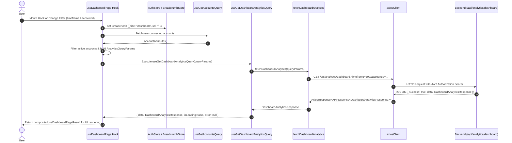

# Dashboard & Analytics — Phase 2 Implementation Details

> **Feature:** dashboard-analytics · **Phase:** 2 (Frontend API Client, Hooks & Recharts Integration)
> **Status:** COMPLETED
> **Created:** 2026-08-30 · **Last Updated:** 2026-08-30

---

## 1. Goal Description & Scope

Establish the core frontend integration foundation for the MailSense Dashboard & Analytics workspace. Phase 2 focuses on establishing robust, strongly-typed API client services, React Query hooks with optimized caching and window-refetch policies, chart library dependencies (`recharts`), shared constants, and the custom `useDashboardPage` state management hook.

Specifically, Phase 2 delivers:

1. **Visualization Library Setup (`recharts` & `@types/recharts`):** Adds SVG charting capabilities to the Next.js frontend package for rendering interactive, theme-aware email volume area and bar charts.
2. **Centralized Query Keys (`ANALYTICS_QUERY_KEYS`):** Extends `@shared/api` with query key factory utilities (`ANALYTICS_QUERY_KEYS.all`, `ANALYTICS_QUERY_KEYS.dashboard(params)`) for granular cache scoping across different account IDs, timeframes, and custom date range filters.
3. **Shared Constants & Color Configurations (`dashboard.ts`):** Defines centralized timeframe options (`today`, `7d`, `30d`, `90d`, `this_month`, `1y`, `all_time`), stale cache timing (60,000ms), and chart theme color palettes (`VOLUME_CHART_SERIES`).
4. **Strongly-Typed API Client Layer (`analytics.api.ts`):** Implements `fetchDashboardAnalytics` utilizing `axiosClient` and centralized constants (`ANALYTICS_API_ENDPOINTS.DASHBOARD`), returning typed `DashboardAnalyticsResponse` payloads.
5. **React Query Hooks (`analytics.queries.ts`):** Implements `useGetDashboardAnalyticsQuery` with automatic window focus re-fetching, 60-second stale time caching, and structured error handling.
6. **Feature Types (`features/analytics/types/index.ts`):** Defines named TypeScript interfaces (`TimeframeOption`, `UseDashboardParams`, `CustomDateRangeState`, `ChartSeriesConfig`, `UseDashboardPageResult`) for filter options, chart color palettes, hook parameter inputs, and composite hook return state.
7. **Composite State Orchestration Hook (`useDashboardPage.ts`):** Encapsulates connected account querying, active mailbox filtering, timeframe selection, custom date boundary state, manual refetch triggering, breadcrumb synchronization (`HOME_ROUTES.DASHBOARD`), and Sonner toast notifications.

---

## 2. User Review Required & Architectural Notes

> [!IMPORTANT]
> **React Query Caching, Recharts SSR Compatibility & Strict Type Safety**
>
> - **Granular Query Key Hashing:** The `ANALYTICS_QUERY_KEYS.dashboard(params)` factory embeds the serialized filter object (`{ accountId, timeframe, startDate, endDate }`). Switching between timeframes or mailbox accounts benefits from instant client-side cache hits when revisiting previously queried filters within the 60-second stale window.
> - **Explicit Error Wrapping & Try-Catch Compliance:** In accordance with MailSense coding standards, queryFn executors and hook handlers are enclosed in explicit `try / catch` blocks with contextual logging and error propagation.
> - **Zero `any`, `never`, or `unknown` Usage:** All request query parameters, API responses, and hook return shapes leverage domain contracts imported from `@mailsense/types` and dedicated feature interfaces in `Frontend/src/features/analytics/types/index.ts`.
> - **Chart Color Tokens & Theme Harmonization:** Chart color palettes in `dashboard.ts` use modern, accessible Indigo (`#6366f1` / `#818cf8`) and Emerald (`#10b981` / `#34d399`) color scales designed for dynamic contrast in both dark and light modes.
> - **Decoupling State from UI Components:** All data fetching, account ownership filtering, and timeframe transformation logic are encapsulated cleanly inside `useDashboardPage`, leaving subsequent UI components in Phase 3 purely presentational.

---

## 3. Component Overview & File Map

| Component | Target File | Action | Purpose |
| :--- | :--- | :--- | :--- |
| **Frontend Dependencies** | `Frontend/package.json` | [MODIFY] | Add `recharts` (`^3.10.1`) and `@types/recharts` (`^2.0.1`) |
| **Frontend Shared API** | `Frontend/src/shared/api/query-keys.ts` | [MODIFY] | Add `ANALYTICS_QUERY_KEYS` factory utilities |
| **Frontend Shared Constants** | `Frontend/src/shared/constants/routes.ts` | [MODIFY] | Add `DASHBOARD: '/'` to `HOME_ROUTES` |
| **Frontend Shared Constants** | `Frontend/src/shared/constants/dashboard.ts` | [NEW] | Centralize timeframe options, default constants, and chart color palettes |
| **Frontend Shared Constants** | `Frontend/src/shared/constants/index.ts` | [MODIFY] | Export `dashboard.ts` from shared constants barrel |
| **Frontend Feature Types** | `Frontend/src/features/analytics/types/index.ts` | [NEW] | Named interfaces for hook results, options, and chart states |
| **Frontend API Client** | `Frontend/src/features/analytics/api/analytics.api.ts` | [NEW] | Strongly-typed Axios wrapper for dashboard analytics endpoint |
| **Frontend React Query** | `Frontend/src/features/analytics/api/analytics.queries.ts` | [NEW] | React Query hook for fetching and caching analytics |
| **Frontend Custom Hook** | `Frontend/src/features/analytics/hooks/useDashboardPage.ts` | [NEW] | Primary custom hook for filter state and query orchestration |
| **Frontend Hooks Barrel** | `Frontend/src/features/analytics/hooks/index.ts` | [NEW] | Re-export `useDashboardPage` |

---

## 4. Main Section 1: Backend Layer Implementation

> [!NOTE]
> **Backend Implementation Status**
> 
> All backend repositories (`AnalyticsRepository`), services (`AnalyticsService`), controllers (`AnalyticsController`), Zod validation schemas (`AnalyticsQuerySchema`), routes (`/api/analytics/dashboard`), and background event handlers (`SyncCompletedHandler`) were fully implemented and verified in **Phase 1**.
> 
> No backend changes are required for Phase 2. The frontend directly consumes the `GET /api/analytics/dashboard` REST endpoint established in Phase 1.

---

## 5. Main Section 2: Frontend Layer Implementation

### 5.1 Package Dependencies & Shared API / Constants

#### [MODIFY] [package.json](file:///Users/vishaljagamani/Projects/Projects/mailsense/Frontend/package.json)

Add `recharts` to `dependencies` and `@types/recharts` to `devDependencies`:

```json
{
  "name": "mailsense",
  "version": "3.0.0",
  "private": true,
  "scripts": {
    "dev": "next dev --webpack --hostname 0.0.0.0",
    "dev:prod": "npx dotenv-cli -e .env.prod -- next dev --webpack --hostname 0.0.0.0",
    "build": "next build --webpack",
    "start": "next start",
    "lint": "eslint",
    "prettier": "prettier --write ."
  },
  "dependencies": {
    "@auth0/nextjs-auth0": "^4.26.0",
    "@mailsense/types": "^1.4.0",
    "@radix-ui/react-alert-dialog": "^1.1.23",
    "@radix-ui/react-avatar": "^1.2.6",
    "@radix-ui/react-checkbox": "^1.3.11",
    "@radix-ui/react-collapsible": "^1.1.20",
    "@radix-ui/react-dialog": "^1.1.23",
    "@radix-ui/react-dropdown-menu": "^2.1.24",
    "@radix-ui/react-label": "^2.1.15",
    "@radix-ui/react-menubar": "^1.1.24",
    "@radix-ui/react-separator": "^1.1.15",
    "@radix-ui/react-slot": "^1.3.3",
    "@radix-ui/react-tabs": "^1.1.21",
    "@radix-ui/react-tooltip": "^1.2.16",
    "@tanstack/react-query": "^5.101.4",
    "@tiptap/extension-image": "^3.29.2",
    "@tiptap/extension-link": "^3.29.2",
    "@tiptap/extension-placeholder": "^3.29.2",
    "@tiptap/react": "^3.29.2",
    "@tiptap/starter-kit": "^3.29.2",
    "axios": "^1.19.0",
    "class-variance-authority": "^0.7.1",
    "clsx": "^2.1.1",
    "isomorphic-dompurify": "^2.36.0",
    "jsdom": "^27.4.0",
    "lucide-react": "^0.544.0",
    "motion": "^12.43.0",
    "next": "16.1.1",
    "next-themes": "^0.4.6",
    "radix-ui": "^1.6.7",
    "react": "19.2.3",
    "react-dom": "19.2.3",
    "recharts": "^3.10.1",
    "sonner": "^2.0.8",
    "styled-jsx": "^5.1.7",
    "tailwind-merge": "^3.6.0",
    "zustand": "^5.0.14"
  },
  "devDependencies": {
    "@eslint/eslintrc": "^3.3.6",
    "@tailwindcss/postcss": "^4.3.3",
    "@types/node": "^24.13.3",
    "@types/react": "^19.2.18",
    "@types/react-dom": "^19.2.4",
    "@types/recharts": "^2.0.1",
    "eslint": "^9.39.5",
    "eslint-config-next": "15.5.4",
    "prettier": "^3.9.6",
    "prettier-plugin-tailwindcss": "^0.6.14",
    "tailwindcss": "^4.3.3",
    "tw-animate-css": "^1.4.0",
    "typescript": "^5.9.3"
  }
}
```

---

#### [MODIFY] [query-keys.ts](file:///Users/vishaljagamani/Projects/Projects/mailsense/Frontend/src/shared/api/query-keys.ts)

Add `ANALYTICS_QUERY_KEYS` factory definition:

```typescript
import { AnalyticsQueryParams } from '@mailsense/types';

export const QUERY_KEYS = {
    AUTH: 'auth',
    ACCOUNTS: 'accounts',
    ACCOUNT_PROVIDERS: 'account-providers',
    ACCOUNT_DETAILS: 'account-details',
    EMAIL: 'email',
    USER_PROFILE_SETTINGS: 'user-profile-settings',
    USER_SYNC_SETTINGS: 'user-sync-settings',
};

export const EMAILS = 'emails';

export const EMAIL_FILTERS = 'email-filters';

export const FOLDER_KEYS = {
    FOLDERS: 'folders',
};

export const DRAFT_QUERY_KEYS = {
    all: ['drafts'],
    list: () => [...DRAFT_QUERY_KEYS.all, 'list'],
    detail: (draftId: string) => [...DRAFT_QUERY_KEYS.all, 'detail', draftId],
} as const;

export const ANALYTICS_QUERY_KEYS = {
    all: ['analytics'],
    dashboard: (params?: AnalyticsQueryParams) => [...ANALYTICS_QUERY_KEYS.all, 'dashboard', params],
} as const;
```

---

#### [MODIFY] [routes.ts](file:///Users/vishaljagamani/Projects/Projects/mailsense/Frontend/src/shared/constants/routes.ts)

Add `DASHBOARD` to `HOME_ROUTES`:

```typescript
export const ROUTES = {
    GET_STARTED: '/get_started',
    SETTINGS: '/settings',
    ACCOUNTS: '/accounts',
} as const;

export const HOME_ROUTES = {
    // Dashboard route
    DASHBOARD: '/',
    // Unified inbox routes
    UNIFIED_INBOX: '/inbox',
    ACCOUNT_INBOX: (id: string) => `/inbox/${id}`,
    EMAIL: (accountId: string, emailId: string) => `/inbox/${accountId}/email/${emailId}`,
    // Draft routes
    DRAFTS: '/drafts',
    // Starred routes
    STARRED: '/starred',
    ACCOUNT_STARRED: (accountId: string) => `/starred/${accountId}`,
    // Folder routes
    ALL_FOLDERS: '/folders',
    ACCOUNT_FOLDERS: (id: string) => `/folders/${id}`,
    FOLDER: (accountId: string, folderId: string) => `/folders/${accountId}/${folderId}`,
} as const;
```

---

#### [NEW] [dashboard.ts](file:///Users/vishaljagamani/Projects/Projects/mailsense/Frontend/src/shared/constants/dashboard.ts)

```typescript
import { ChartSeriesConfig, TimeframeOption } from '@features/analytics/types';
import { ANALYTICS_TIMEFRAME } from '@mailsense/types';

export const TIMEFRAME_OPTIONS: TimeframeOption[] = [
    { label: 'Today', value: ANALYTICS_TIMEFRAME.TODAY },
    { label: '7D', value: ANALYTICS_TIMEFRAME.SEVEN_DAYS },
    { label: '30D', value: ANALYTICS_TIMEFRAME.THIRTY_DAYS },
    { label: '90D', value: ANALYTICS_TIMEFRAME.NINETY_DAYS },
    { label: 'This Month', value: ANALYTICS_TIMEFRAME.THIS_MONTH },
    { label: '1Y', value: ANALYTICS_TIMEFRAME.ONE_YEAR },
    { label: 'All Time', value: ANALYTICS_TIMEFRAME.ALL_TIME },
];

export const DEFAULT_ANALYTICS_TIMEFRAME: ANALYTICS_TIMEFRAME = ANALYTICS_TIMEFRAME.THIRTY_DAYS;

export const ALL_ACCOUNTS_FILTER_ID: string = 'all';

export const ANALYTICS_STALE_TIME_MS: number = 60000; // 1 minute stale time

export const VOLUME_CHART_SERIES: { RECEIVED: ChartSeriesConfig; SENT: ChartSeriesConfig } = {
    RECEIVED: {
        key: 'receivedCount',
        label: 'Received',
        strokeColor: '#6366f1',
        fillColor: '#818cf8',
    },
    SENT: {
        key: 'sentCount',
        label: 'Sent',
        strokeColor: '#10b981',
        fillColor: '#34d399',
    },
};
```

---

#### [MODIFY] [index.ts](file:///Users/vishaljagamani/Projects/Projects/mailsense/Frontend/src/shared/constants/index.ts)

```typescript
export * from './dashboard';
export * from './email';
export * from './messages';
export * from './routes';
export * from './settings';
export * from './sidebar.constants';
export * from './ui';
export * from './utils.constants';
```

---

### 5.2 Feature Types

#### [NEW] [index.ts](file:///Users/vishaljagamani/Projects/Projects/mailsense/Frontend/src/features/analytics/types/index.ts)

```typescript
import { AccountAttributes, ANALYTICS_TIMEFRAME, DashboardAnalyticsResponse } from '@mailsense/types';

export interface TimeframeOption {
    label: string;
    value: ANALYTICS_TIMEFRAME;
}

export interface UseDashboardParams {
    initialAccountId?: string;
    initialTimeframe?: ANALYTICS_TIMEFRAME;
}

export interface CustomDateRangeState {
    startDate: string;
    endDate: string;
}

export interface ChartSeriesConfig {
    key: string;
    label: string;
    strokeColor: string;
    fillColor: string;
}

export interface UseDashboardPageResult {
    accounts: { data: AccountAttributes[] };
    states: {
        selectedAccountId: string;
        selectedTimeframe: ANALYTICS_TIMEFRAME;
        customDateRange: CustomDateRangeState;
        timeframeOptions: TimeframeOption[];
    };
    analytics: { data: DashboardAnalyticsResponse | undefined; isLoading: boolean; error: Error | null };
    setters: {
        setSelectedAccountId: (accountId: string) => void;
        setSelectedTimeframe: (timeframe: ANALYTICS_TIMEFRAME) => void;
        setCustomDateRange: (startDate: string, endDate: string) => void;
    };
    actions: { handleRefresh: () => Promise<void> };
}
```

---

### 5.3 API Client Layer

#### [NEW] [analytics.api.ts](file:///Users/vishaljagamani/Projects/Projects/mailsense/Frontend/src/features/analytics/api/analytics.api.ts)

```typescript
import { AnalyticsQueryParams, APIResponse, DashboardAnalyticsResponse } from '@mailsense/types';
import { ANALYTICS_API_ENDPOINTS, axiosClient } from '@shared/api';

export async function fetchDashboardAnalytics(params?: AnalyticsQueryParams): Promise<DashboardAnalyticsResponse> {
    const { data } = await axiosClient.get<APIResponse<DashboardAnalyticsResponse>>(ANALYTICS_API_ENDPOINTS.DASHBOARD, {
        params,
    });
    return data.data;
}
```

---

### 5.4 React Query Hooks

#### [NEW] [analytics.queries.ts](file:///Users/vishaljagamani/Projects/Projects/mailsense/Frontend/src/features/analytics/api/analytics.queries.ts)

```typescript
import { AnalyticsQueryParams, DashboardAnalyticsResponse } from '@mailsense/types';
import { ANALYTICS_QUERY_KEYS } from '@shared/api';
import { ANALYTICS_STALE_TIME_MS } from '@shared/constants';
import { useQuery, UseQueryResult } from '@tanstack/react-query';
import { fetchDashboardAnalytics } from './analytics.api';

export const useGetDashboardAnalyticsQuery = (
    params?: AnalyticsQueryParams,
    enabled: boolean = true,
): UseQueryResult<DashboardAnalyticsResponse, Error> => {
    try {
        return useQuery<DashboardAnalyticsResponse, Error>({
            queryKey: ANALYTICS_QUERY_KEYS.dashboard(params),
            queryFn: async () => fetchDashboardAnalytics(params),
            enabled,
            staleTime: ANALYTICS_STALE_TIME_MS,
            refetchOnWindowFocus: true,
        });
    } catch (error) {
        console.error('Failed to initialize useGetDashboardAnalyticsQuery hook', { params, error });
        throw error;
    }
};
```

---

### 5.5 Custom Hooks & State Orchestration

#### [NEW] [useDashboardPage.ts](file:///Users/vishaljagamani/Projects/Projects/mailsense/Frontend/src/features/analytics/hooks/useDashboardPage.ts)

```typescript
import { useEffect, useMemo, useState } from 'react';
import { toast } from 'sonner';

import { useGetAccountsQuery } from '@features/accounts/api/accounts.queries';
import { AccountAttributes, ANALYTICS_TIMEFRAME, AnalyticsQueryParams } from '@mailsense/types';
import { ALL_ACCOUNTS_FILTER_ID, DEFAULT_ANALYTICS_TIMEFRAME, HOME_ROUTES, TIMEFRAME_OPTIONS } from '@shared/constants';
import { useAuthStore, useBreadcrumbStore } from '@shared/store';
import { useGetDashboardAnalyticsQuery } from '../api/analytics.queries';
import { CustomDateRangeState, UseDashboardPageResult, UseDashboardParams } from '../types';

export const useDashboardPage = (params?: UseDashboardParams): UseDashboardPageResult => {
    const currentUser = useAuthStore((state) => state.user);

    const [selectedAccountId, setSelectedAccountId] = useState<string>(params?.initialAccountId ?? ALL_ACCOUNTS_FILTER_ID);
    const [selectedTimeframe, setSelectedTimeframe] = useState<ANALYTICS_TIMEFRAME>(params?.initialTimeframe ?? DEFAULT_ANALYTICS_TIMEFRAME);
    const [customDateRange, setCustomDateRangeState] = useState<CustomDateRangeState>({ startDate: '', endDate: '' });

    // Synchronize breadcrumbs on mount
    useEffect(() => {
        useBreadcrumbStore.setState({ items: [{ title: 'Dashboard', url: HOME_ROUTES.DASHBOARD }] });
    }, []);

    // Fetch user connected accounts
    const { data: accountsData } = useGetAccountsQuery(currentUser?.id || '', {
        enabled: Boolean(currentUser?.id),
    });

    // Filter for active mailboxes
    const activeAccounts: AccountAttributes[] = useMemo(() => {
        if (!accountsData || !Array.isArray(accountsData)) {
            return [];
        }
        return accountsData.filter((account) => account.active);
    }, [accountsData]);

    // Construct strongly-typed query parameters for analytics API
    const queryParams: AnalyticsQueryParams = useMemo(() => {
        const query: AnalyticsQueryParams = {
            timeframe: selectedTimeframe,
        };

        if (selectedAccountId !== ALL_ACCOUNTS_FILTER_ID) {
            query.accountId = selectedAccountId;
        }

        if (selectedTimeframe === ANALYTICS_TIMEFRAME.CUSTOM) {
            if (customDateRange.startDate) {
                query.startDate = customDateRange.startDate;
            }
            if (customDateRange.endDate) {
                query.endDate = customDateRange.endDate;
            }
        }

        return query;
    }, [selectedAccountId, selectedTimeframe, customDateRange]);

    // Fetch dashboard analytics data via React Query
    const {
        data: analyticsData,
        isLoading: analyticsDataLoading,
        error: analyticsDataError,
        refetch: refetchAnalytics,
    } = useGetDashboardAnalyticsQuery(queryParams, Boolean(currentUser?.id));

    const handleSetSelectedAccountId = (accountId: string): void => {
        setSelectedAccountId(accountId);
    };

    const handleSetSelectedTimeframe = (timeframe: ANALYTICS_TIMEFRAME): void => {
        setSelectedTimeframe(timeframe);
    };

    const handleSetCustomDateRange = (startDate: string, endDate: string): void => {
        setCustomDateRangeState({ startDate, endDate });
    };

    const handleRefresh = async (): Promise<void> => {
        try {
            await refetchAnalytics();
            toast.success('Dashboard analytics refreshed');
        } catch (refreshError) {
            console.error('Failed to refresh dashboard analytics', refreshError);
            toast.error('Failed to refresh analytics');
        }
    };

    return {
        accounts: { data: activeAccounts },
        analytics: { data: analyticsData, isLoading: analyticsDataLoading, error: analyticsDataError },
        states: { selectedAccountId, selectedTimeframe, customDateRange, timeframeOptions: TIMEFRAME_OPTIONS },
        setters: {
            setSelectedAccountId: handleSetSelectedAccountId,
            setSelectedTimeframe: handleSetSelectedTimeframe,
            setCustomDateRange: handleSetCustomDateRange,
        },
        actions: { handleRefresh },
    };
};
```

---

#### [NEW] [index.ts](file:///Users/vishaljagamani/Projects/Projects/mailsense/Frontend/src/features/analytics/hooks/index.ts)

```typescript
export * from './useDashboardPage';
```

---

## 6. Low-Level Design & Sequence Flow



---

## 7. Step-by-Step Task Checklist

- [x] **Task 1: Package Dependencies Installation & Query Keys**
  - [x] Add `recharts` (`^3.10.1`) and `@types/recharts` (`^2.0.1`) to `Frontend/package.json` and install with `pnpm install`.
  - [x] Export `ANALYTICS_QUERY_KEYS` in `Frontend/src/shared/api/query-keys.ts`.
  - [x] Add `DASHBOARD: '/'` to `HOME_ROUTES` in `Frontend/src/shared/constants/routes.ts`.
  - [x] Create `Frontend/src/shared/constants/dashboard.ts` and export from `Frontend/src/shared/constants/index.ts`.
- [x] **Task 2: Feature Types & Contracts**
  - [x] Create `Frontend/src/features/analytics/types/index.ts` with `UseDashboardPageResult`, `TimeframeOption`, and chart configs.
- [x] **Task 3: API Client & Query Hooks**
  - [x] Create `Frontend/src/features/analytics/api/analytics.api.ts` wrapping `/analytics/dashboard`.
  - [x] Create `Frontend/src/features/analytics/api/analytics.queries.ts` with `useGetDashboardAnalyticsQuery`.
- [x] **Task 4: Custom State Management Hook**
  - [x] Create `Frontend/src/features/analytics/hooks/useDashboardPage.ts` managing filter state, query orchestration, and toast notifications.
  - [x] Create `Frontend/src/features/analytics/hooks/index.ts`.
- [x] **Task 5: Verification & TypeScript Compilation**
  - [x] Run `cd Frontend && npx tsc --noEmit` to verify type safety (0 errors).
  - [x] Run `cd Frontend && pnpm build` to verify Next.js bundle compilation.

---

## 8. Verification & Build Commands

```bash
# 1. Install newly added dependencies in Frontend
cd /Users/vishaljagamani/Projects/Projects/mailsense/Frontend && pnpm install

# 2. Verify Frontend TypeScript Compilation
cd /Users/vishaljagamani/Projects/Projects/mailsense/Frontend && npx tsc --noEmit

# 3. Verify Next.js Production Build
cd /Users/vishaljagamani/Projects/Projects/mailsense/Frontend && pnpm build
```
