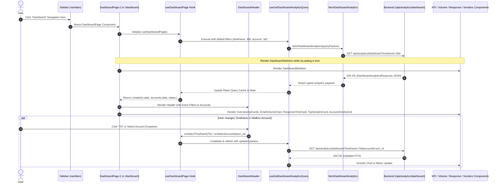

# Dashboard & Analytics — Phase 3 Implementation Details

> **Feature:** dashboard-analytics · **Phase:** 3 (Dashboard UI Components & Navigation Integration)
> **Status:** COMPLETED
> **Created:** 2026-08-30 · **Last Updated:** 2026-08-31

---

## 1. Goal Description & Scope

Build and integrate the complete interactive frontend visualization suite for the MailSense **Dashboard & Analytics** workspace. Phase 3 transforms the reactive data queries and state management hooks delivered in Phase 2 into a high-performance, visually stunning, dark/light theme-aware dashboard experience.

Specifically, Phase 3 delivers:

1. **Dashboard Header & Filter Controls (`DashboardHeader.tsx`):** Provides mailbox account selection (`ALL_ACCOUNTS_FILTER_ID` or individual active accounts), timeframe selection pills (`Today`, `7D`, `30D`, `90D`, `This Month`, `1Y`, `All Time`, `Custom`), custom date range modal/inputs, and an interactive manual refresh button.
2. **Overview KPI Cards Grid (`OverviewKpiCards.tsx`):** Renders high-impact productivity metric cards for Total Emails, Unread Count, Sent Messages, Starred Emails, Drafts, and Active Mailboxes with trend percentage chips and Lucide icons.
3. **Email Volume Dual-Area Chart (`EmailVolumeChart.tsx`):** Implements an interactive, responsive SVG chart using Recharts (`AreaChart`, `ResponsiveContainer`, `XAxis`, `YAxis`, `CartesianGrid`, `Tooltip`, `Legend`) with linear gradients, customized hover tooltips, and timeframe tick formatting.
4. **Account Email Distribution Doughnut/Pie Chart (`AccountDistributionPieChart.tsx`):** Renders an interactive Recharts Pie/Doughnut chart displaying email volume distribution across connected mailboxes (or 100% full view when a single account is filtered).
5. **Turnaround & Response Time Card (`ResponseTimeCard.tsx`):** Displays average and median response time metrics in human-readable units, overall response rate percentage, and a 4-tier turnaround distribution progress bar (`< 1h`, `1–4h`, `4–24h`, `> 24h`).
6. **Top Senders Leaderboard (`TopSendersCard.tsx`):** Renders a ranked list of top incoming contacts with avatars, parsed sender names, email addresses, message counts, volume share progress bars, and relative last-received timestamps.
7. **Account Activity Grid (`AccountActivityGrid.tsx`):** Displays per-mailbox summary cards showing provider branding (Gmail / Outlook), sync health, unread/sent counts, and direct navigation links into account-scoped inboxes.
8. **Skeleton Loading & Empty States (`DashboardSkeleton.tsx`, `DashboardEmptyState.tsx`):** Delivers smooth layout-matched skeleton states during data fetching and a polished zero-data empty state prompting users to connect a mailbox.
9. **Dashboard Page Assembly (`Frontend/src/features/analytics/pages/DashboardPage.tsx`):** Orchestrates the full view hierarchy, error boundary alerts, and pull-to-refresh interactions using `useDashboardPage`.
10. **Route & Navigation Hierarchy Integration:** Updates Next.js route handlers (`Frontend/src/app/(home)/page.tsx`, `Frontend/src/app/(home)/dashboard/page.tsx`) and primary sidebar navigation (`Frontend/src/shared/constants/sidebar.constants.ts`) with the `LayoutDashboard` Lucide icon.

---

## 2. User Review Required & Architectural Notes

> [!IMPORTANT]
> **Component Modularity, Responsive Layout & Recharts SSR Safety**
>
> - **Client Component Boundaries (`'use client'`):** Interactive visualization components, tooltips, and Recharts `ResponsiveContainer` instances require DOM measurements. All analytics UI components explicitly declare `'use client'` to prevent Next.js server-side rendering hydration mismatches.
> - **Strict Separation of State & Presentation:** Data queries, filter setters, and refetch handlers remain encapsulated in the custom hook `useDashboardPage`. Presentation components receive typed props and invoke setters through strictly typed callbacks.
> - **Comprehensive Try-Catch Block Compliance:** Every function, event handler, date/time formatter, and metric calculation contains an explicit `try / catch` block with contextual error logging and user notifications, strictly avoiding silent failures or empty catch blocks.
> - **Zero `any`, `never`, or `unknown` Usage:** All component props, chart payload structures, and metric calculations strictly leverage interfaces from `@mailsense/types` and `@features/analytics/types`.
> - **Theme Harmonization & Color Tokens:** All visual elements utilize Tailwind CSS tokens (`bg-card`, `text-card-foreground`, `border-border`, `bg-muted`) alongside curated Indigo (`#6366f1` / `#818cf8`) and Emerald (`#10b981` / `#34d399`) chart fills for seamless contrast across both Dark and Light themes.

---

## 3. Component Overview & File Map

| Component | Target File | Action | Purpose |
| :--- | :--- | :--- | :--- |
| **Frontend Types** | `Frontend/src/features/analytics/types/index.ts` | [MODIFY] | Add named prop interfaces for all Phase 3 UI components |
| **Frontend Component** | `Frontend/src/features/analytics/components/DashboardHeader.tsx` | [NEW] | Header with title, account selector, timeframe pills, and refresh action |
| **Frontend Component** | `Frontend/src/features/analytics/components/OverviewKpiCards.tsx` | [NEW] | 6-card overview grid displaying KPIs and trend indicators |
| **Frontend Component** | `Frontend/src/features/analytics/components/EmailVolumeChart.tsx` | [NEW] | Recharts dual-area chart for Received vs Sent emails |
| **Frontend Component** | `Frontend/src/features/analytics/components/AccountDistributionPieChart.tsx` | [NEW] | Recharts pie chart for email volume distribution across accounts |
| **Frontend Component** | `Frontend/src/features/analytics/components/ResponseTimeCard.tsx` | [NEW] | Response turnaround stats and 4-tier distribution bars |
| **Frontend Component** | `Frontend/src/features/analytics/components/TopSendersCard.tsx` | [NEW] | Top 5 senders leaderboard with avatars and volume bars |
| **Frontend Component** | `Frontend/src/features/analytics/components/AccountActivityGrid.tsx` | [NEW] | Mailbox summary cards with jump-to-inbox buttons |
| **Frontend Component** | `Frontend/src/features/analytics/components/DashboardSkeleton.tsx` | [NEW] | Layout-matched skeleton loading placeholder |
| **Frontend Component** | `Frontend/src/features/analytics/components/DashboardEmptyState.tsx` | [NEW] | Empty state with account connection CTA |
| **Frontend Component** | `Frontend/src/features/analytics/components/index.ts` | [NEW] | Central barrel export for analytics UI components |
| **Frontend Page** | `Frontend/src/features/analytics/pages/DashboardPage.tsx` | [NEW] | Primary dashboard view component orchestrating UI components |
| **Frontend Page Barrel** | `Frontend/src/features/analytics/pages/index.ts` | [NEW] | Export `DashboardPage` |
| **Frontend Route** | `Frontend/src/app/(home)/page.tsx` | [MODIFY] | Render `DashboardPage` directly at primary landing route |
| **Frontend Route** | `Frontend/src/app/(home)/dashboard/page.tsx` | [NEW] | Route handler for `/dashboard` route alias |
| **Frontend Navigation** | `Frontend/src/shared/constants/sidebar.constants.ts` | [MODIFY] | Add `Dashboard` item with `LayoutDashboard` icon to sidebar |

---

## 4. Main Section 1: Backend Layer Implementation

> [!NOTE]
> **Backend Implementation Status**
> 
> All backend repositories (`AnalyticsRepository`), services (`AnalyticsService`), controllers (`AnalyticsController`), Zod validation schemas (`AnalyticsQuerySchema`), routes (`/api/analytics/dashboard`), and background event handlers (`SyncCompletedHandler`) were fully implemented and verified in **Phase 1**.
> 
> No backend code changes are required for Phase 3. The frontend components directly consume the `GET /api/analytics/dashboard` REST endpoint and typed DTOs established in Phase 1 and Phase 2.

---

## 5. Main Section 2: Frontend Layer Implementation

### 5.1 Extended Types & Interfaces

#### [MODIFY] [index.ts](file:///Users/vishaljagamani/Projects/Projects/mailsense/Frontend/src/features/analytics/types/index.ts)

Update feature types to define all named prop interfaces, metric card configurations, and chart tooltip payloads:

```typescript
import {
    AccountActivitySummaryAttributes,
    AccountAttributes,
    ANALYTICS_TIMEFRAME,
    DashboardAnalyticsResponse,
    EmailVolumeDataPointAttributes,
    OverviewMetricsAttributes,
    ResponseTimeMetricsAttributes,
    TopSenderDataAttributes,
} from '@mailsense/types';
import { LucideIcon } from 'lucide-react';

export interface TimeframeOption {
    label: string;
    value: ANALYTICS_TIMEFRAME;
}

export interface UseDashboardParams {
    initialAccountId?: string;
    initialTimeframe?: ANALYTICS_TIMEFRAME;
}

export interface CustomDateRangeState {
    startDate: string;
    endDate: string;
}

export interface ChartSeriesConfig {
    key: string;
    label: string;
    strokeColor: string;
    fillColor: string;
}

export interface UseDashboardPageResult {
    accounts: { data: AccountAttributes[] };
    states: {
        selectedAccountId: string;
        selectedTimeframe: ANALYTICS_TIMEFRAME;
        customDateRange: CustomDateRangeState;
        timeframeOptions: TimeframeOption[];
    };
    analytics: { data: DashboardAnalyticsResponse | undefined; isLoading: boolean; error: Error | null };
    setters: {
        setSelectedAccountId: (accountId: string) => void;
        setSelectedTimeframe: (timeframe: ANALYTICS_TIMEFRAME) => void;
        setCustomDateRange: (startDate: string, endDate: string) => void;
    };
    actions: { handleRefresh: () => Promise<void> };
}

export interface DashboardHeaderProps {
    accounts: AccountAttributes[];
    selectedAccountId: string;
    selectedTimeframe: ANALYTICS_TIMEFRAME;
    timeframeOptions: TimeframeOption[];
    customDateRange: CustomDateRangeState;
    isRefreshing: boolean;
    onSelectAccountId: (accountId: string) => void;
    onSelectTimeframe: (timeframe: ANALYTICS_TIMEFRAME) => void;
    onSetCustomDateRange: (startDate: string, endDate: string) => void;
    onRefresh: () => Promise<void>;
}

export interface MetricCardConfig {
    id: string;
    title: string;
    value: string | number;
    icon: LucideIcon;
    iconColor: string;
    iconBg: string;
    changePercentage?: number;
    subtitle?: string;
}

export interface OverviewKpiCardsProps {
    overview: OverviewMetricsAttributes | undefined;
    isLoading: boolean;
}

export interface EmailVolumeChartProps {
    volumeData: EmailVolumeDataPointAttributes[] | undefined;
    timeframe: ANALYTICS_TIMEFRAME;
    isLoading: boolean;
}

export interface ChartTooltipPayloadItem {
    name: string;
    value: number;
    color: string;
    dataKey: string;
}

export interface CustomVolumeTooltipProps {
    active?: boolean;
    payload?: ChartTooltipPayloadItem[];
    label?: string;
}

export interface ResponseTimeCardProps {
    responseTime: ResponseTimeMetricsAttributes | undefined;
    isLoading: boolean;
}

export interface ResponseDistributionBucket {
    label: string;
    count: number;
    percentage: number;
    colorClass: string;
    bgClass: string;
}

export interface TopSendersCardProps {
    senders: TopSenderDataAttributes[] | undefined;
    isLoading: boolean;
}

export interface AccountActivityGridProps {
    accounts: AccountActivitySummaryAttributes[] | undefined;
    isLoading: boolean;
}

export interface DashboardSkeletonProps {
    className?: string;
}

export interface DashboardEmptyStateProps {
    title?: string;
    description?: string;
    onConnectAccount?: () => void;
}
```

---

### 5.2 UI Visualization Components

#### [NEW] [DashboardHeader.tsx](file:///Users/vishaljagamani/Projects/Projects/mailsense/Frontend/src/features/analytics/components/DashboardHeader.tsx)

Create header component with account selector, timeframe buttons, custom date range inputs, and refresh action:

```typescript
'use client';

import { Calendar, Check, ChevronDown, Mail, RefreshCw } from 'lucide-react';
import React, { useState } from 'react';
import { toast } from 'sonner';

import { ANALYTICS_TIMEFRAME } from '@mailsense/types';
import { ALL_ACCOUNTS_FILTER_ID } from '@shared/constants';
import { Button } from '@shared/ui/button';
import { Dialog, DialogContent, DialogDescription, DialogFooter, DialogHeader, DialogTitle } from '@shared/ui/dialog';
import { DropdownMenu, DropdownMenuContent, DropdownMenuItem, DropdownMenuTrigger } from '@shared/ui/dropdown-menu';
import { Input } from '@shared/ui/input';
import { DashboardHeaderProps } from '../types';

export const DashboardHeader: React.FC<DashboardHeaderProps> = ({
    accounts,
    selectedAccountId,
    selectedTimeframe,
    timeframeOptions,
    customDateRange,
    isRefreshing,
    onSelectAccountId,
    onSelectTimeframe,
    onSetCustomDateRange,
    onRefresh,
}) => {
    const [isCustomDateModalOpen, setIsCustomDateModalOpen] = useState<boolean>(false);
    const [tempStartDate, setTempStartDate] = useState<string>(customDateRange.startDate);
    const [tempEndDate, setTempEndDate] = useState<string>(customDateRange.endDate);

    const activeAccountLabel: string = React.useMemo(() => {
        try {
            if (selectedAccountId === ALL_ACCOUNTS_FILTER_ID) {
                return 'All Connected Accounts';
            }
            const foundAccount = accounts.find((account) => account._id === selectedAccountId);
            return foundAccount ? foundAccount.emailAddress : 'All Connected Accounts';
        } catch (error) {
            console.error('Failed to resolve active account label', error);
            return 'All Connected Accounts';
        }
    }, [accounts, selectedAccountId]);

    const handleAccountSelect = (accountId: string): void => {
        try {
            onSelectAccountId(accountId);
        } catch (error) {
            console.error('Failed to handle account selection', error);
            toast.error('Failed to switch mailbox filter');
        }
    };

    const handleTimeframeSelect = (timeframe: ANALYTICS_TIMEFRAME): void => {
        try {
            if (timeframe === ANALYTICS_TIMEFRAME.CUSTOM) {
                setIsCustomDateModalOpen(true);
                return;
            }
            onSelectTimeframe(timeframe);
        } catch (error) {
            console.error('Failed to handle timeframe selection', error);
            toast.error('Failed to update timeframe filter');
        }
    };

    const handleSaveCustomDateRange = (): void => {
        try {
            if (!tempStartDate || !tempEndDate) {
                toast.error('Please select both start and end dates');
                return;
            }
            if (new Date(tempStartDate) > new Date(tempEndDate)) {
                toast.error('Start date cannot be after end date');
                return;
            }
            onSetCustomDateRange(tempStartDate, tempEndDate);
            onSelectTimeframe(ANALYTICS_TIMEFRAME.CUSTOM);
            setIsCustomDateModalOpen(false);
            toast.success('Custom date range applied');
        } catch (error) {
            console.error('Failed to apply custom date range', error);
            toast.error('Failed to apply custom date range');
        }
    };

    const handleRefreshClick = async (): Promise<void> => {
        try {
            await onRefresh();
        } catch (error) {
            console.error('Failed to trigger dashboard refresh', error);
            toast.error('Failed to refresh dashboard');
        }
    };

    return (
        <div className="flex flex-col gap-4 border-b border-border/40 pb-5 md:flex-row md:items-center md:justify-between">
            <div>
                <h1 className="text-2xl font-bold tracking-tight text-foreground">Dashboard</h1>
                <p className="text-sm text-muted-foreground">
                    Cross-mailbox productivity metrics, email volume trends, and communication turnaround analytics.
                </p>
            </div>

            <div className="flex flex-wrap items-center gap-2.5">
                {/* Mailbox Selector Dropdown */}
                <DropdownMenu>
                    <DropdownMenuTrigger asChild>
                        <Button variant="outline" size="sm" className="h-9 gap-2 border-border/80 bg-card/60 text-xs font-medium backdrop-blur-sm">
                            <Mail className="h-3.5 w-3.5 text-primary" />
                            <span className="max-w-[150px] truncate md:max-w-[200px]">{activeAccountLabel}</span>
                            <ChevronDown className="h-3.5 w-3.5 opacity-60" />
                        </Button>
                    </DropdownMenuTrigger>
                    <DropdownMenuContent align="end" className="w-64">
                        <DropdownMenuItem
                            onClick={() => handleAccountSelect(ALL_ACCOUNTS_FILTER_ID)}
                            className="flex items-center justify-between text-xs"
                        >
                            <span>All Connected Accounts</span>
                            {selectedAccountId === ALL_ACCOUNTS_FILTER_ID && <Check className="h-3.5 w-3.5 text-primary" />}
                        </DropdownMenuItem>
                        {accounts.map((account) => (
                            <DropdownMenuItem
                                key={account._id}
                                onClick={() => handleAccountSelect(account._id)}
                                className="flex items-center justify-between text-xs"
                            >
                                <span className="truncate">{account.emailAddress}</span>
                                {selectedAccountId === account._id && <Check className="h-3.5 w-3.5 text-primary" />}
                            </DropdownMenuItem>
                        ))}
                    </DropdownMenuContent>
                </DropdownMenu>

                {/* Timeframe Filter Pills */}
                <div className="flex items-center rounded-lg border border-border/60 bg-muted/40 p-0.5">
                    {timeframeOptions.map((option) => {
                        const isSelected = selectedTimeframe === option.value;
                        return (
                            <button
                                key={option.value}
                                type="button"
                                onClick={() => handleTimeframeSelect(option.value)}
                                className={`rounded-md px-2.5 py-1 text-xs font-medium transition-all ${
                                    isSelected
                                        ? 'bg-card text-foreground shadow-xs'
                                        : 'text-muted-foreground hover:bg-card/40 hover:text-foreground'
                                }`}
                            >
                                {option.label}
                            </button>
                        );
                    })}
                </div>

                {/* Manual Refresh Button */}
                <Button
                    variant="outline"
                    size="icon"
                    onClick={handleRefreshClick}
                    disabled={isRefreshing}
                    className="h-9 w-9 border-border/80 bg-card/60 backdrop-blur-sm"
                    title="Refresh analytics data"
                >
                    <RefreshCw className={`h-3.5 w-3.5 text-muted-foreground ${isRefreshing ? 'animate-spin text-primary' : ''}`} />
                    <span className="sr-only">Refresh</span>
                </Button>
            </div>

            {/* Custom Date Range Dialog */}
            <Dialog open={isCustomDateModalOpen} onOpenChange={setIsCustomDateModalOpen}>
                <DialogContent className="sm:max-w-md">
                    <DialogHeader>
                        <DialogTitle className="flex items-center gap-2">
                            <Calendar className="h-5 w-5 text-primary" />
                            Select Custom Date Range
                        </DialogTitle>
                        <DialogDescription>
                            Specify custom boundary dates for aggregating email volume and performance metrics.
                        </DialogDescription>
                    </DialogHeader>
                    <div className="grid gap-4 py-3">
                        <div className="grid grid-cols-2 gap-3">
                            <div className="flex flex-col gap-1.5">
                                <label htmlFor="start-date" className="text-xs font-medium text-muted-foreground">
                                    Start Date
                                </label>
                                <Input
                                    id="start-date"
                                    type="date"
                                    value={tempStartDate}
                                    onChange={(event: React.ChangeEvent<HTMLInputElement>) => setTempStartDate(event.target.value)}
                                    className="h-9 text-xs"
                                />
                            </div>
                            <div className="flex flex-col gap-1.5">
                                <label htmlFor="end-date" className="text-xs font-medium text-muted-foreground">
                                    End Date
                                </label>
                                <Input
                                    id="end-date"
                                    type="date"
                                    value={tempEndDate}
                                    onChange={(event: React.ChangeEvent<HTMLInputElement>) => setTempEndDate(event.target.value)}
                                    className="h-9 text-xs"
                                />
                            </div>
                        </div>
                    </div>
                    <DialogFooter>
                        <Button variant="ghost" size="sm" onClick={() => setIsCustomDateModalOpen(false)}>
                            Cancel
                        </Button>
                        <Button size="sm" onClick={handleSaveCustomDateRange}>
                            Apply Date Range
                        </Button>
                    </DialogFooter>
                </DialogContent>
            </Dialog>
        </div>
    );
};
```

---

#### [NEW] [OverviewKpiCards.tsx](file:///Users/vishaljagamani/Projects/Projects/mailsense/Frontend/src/features/analytics/components/OverviewKpiCards.tsx)

Create KPI card grid with animated trend chips and icon accents:

```typescript
'use client';

import { FileText, Inbox, Mail, MailCheck, Minus, Send, Star, TrendingDown, TrendingUp } from 'lucide-react';
import React from 'react';

import { Card, CardContent } from '@shared/ui/card';
import { Skeleton } from '@shared/ui/skeleton';
import { MetricCardConfig, OverviewKpiCardsProps } from '../types';

export const OverviewKpiCards: React.FC<OverviewKpiCardsProps> = ({ overview, isLoading }) => {
    const formatMetricNumber = (value: number | undefined): string => {
        try {
            if (value === undefined || value === null) {
                return '0';
            }
            return new Intl.NumberFormat('en-US').format(value);
        } catch (error) {
            console.error('Failed to format metric number', error);
            return String(value ?? 0);
        }
    };

    const cards: MetricCardConfig[] = React.useMemo(() => {
        try {
            return [
                {
                    id: 'total-emails',
                    title: 'Total Emails',
                    value: formatMetricNumber(overview?.totalEmails),
                    icon: Mail,
                    iconColor: 'text-indigo-500',
                    iconBg: 'bg-indigo-500/10 dark:bg-indigo-500/20',
                    changePercentage: overview?.emailsChangePercentage,
                },
                {
                    id: 'unread-emails',
                    title: 'Unread Messages',
                    value: formatMetricNumber(overview?.unreadEmails),
                    icon: Inbox,
                    iconColor: 'text-sky-500',
                    iconBg: 'bg-sky-500/10 dark:bg-sky-500/20',
                    changePercentage: overview?.unreadChangePercentage,
                },
                {
                    id: 'sent-emails',
                    title: 'Sent Emails',
                    value: formatMetricNumber(overview?.sentEmails),
                    icon: Send,
                    iconColor: 'text-emerald-500',
                    iconBg: 'bg-emerald-500/10 dark:bg-emerald-500/20',
                    changePercentage: overview?.sentChangePercentage,
                },
                {
                    id: 'starred-emails',
                    title: 'Starred Items',
                    value: formatMetricNumber(overview?.starredEmails),
                    icon: Star,
                    iconColor: 'text-amber-500',
                    iconBg: 'bg-amber-500/10 dark:bg-amber-500/20',
                },
                {
                    id: 'draft-messages',
                    title: 'Draft Messages',
                    value: formatMetricNumber(overview?.draftsCount),
                    icon: FileText,
                    iconColor: 'text-purple-500',
                    iconBg: 'bg-purple-500/10 dark:bg-purple-500/20',
                },
                {
                    id: 'active-mailboxes',
                    title: 'Active Mailboxes',
                    value: formatMetricNumber(overview?.activeAccountsCount),
                    icon: MailCheck,
                    iconColor: 'text-teal-500',
                    iconBg: 'bg-teal-500/10 dark:bg-teal-500/20',
                    subtitle: `${formatMetricNumber(overview?.totalThreadsCount)} threads active`,
                },
            ];
        } catch (error) {
            console.error('Failed to compute metric cards configuration', error);
            return [];
        }
    }, [overview]);

    const renderTrendChip = (changePercentage: number | undefined): React.ReactNode => {
        try {
            if (changePercentage === undefined || changePercentage === null) {
                return null;
            }

            if (changePercentage > 0) {
                return (
                    <span className="inline-flex items-center gap-0.5 rounded-full bg-emerald-500/10 px-1.5 py-0.5 text-[10px] font-semibold text-emerald-600 dark:bg-emerald-500/20 dark:text-emerald-400">
                        <TrendingUp className="h-3 w-3" />
                        +{changePercentage}%
                    </span>
                );
            }

            if (changePercentage < 0) {
                return (
                    <span className="inline-flex items-center gap-0.5 rounded-full bg-rose-500/10 px-1.5 py-0.5 text-[10px] font-semibold text-rose-600 dark:bg-rose-500/20 dark:text-rose-400">
                        <TrendingDown className="h-3 w-3" />
                        {changePercentage}%
                    </span>
                );
            }

            return (
                <span className="inline-flex items-center gap-0.5 rounded-full bg-muted px-1.5 py-0.5 text-[10px] font-semibold text-muted-foreground">
                    <Minus className="h-3 w-3" />
                    0%
                </span>
            );
        } catch (error) {
            console.error('Failed to render trend chip', error);
            return null;
        }
    };

    if (isLoading) {
        return (
            <div className="grid grid-cols-1 gap-4 sm:grid-cols-2 lg:grid-cols-3 xl:grid-cols-6">
                {Array.from({ length: 6 }).map((_, index) => (
                    <Card key={`kpi-skeleton-${index}`} className="border-border/60 bg-card/60 p-4 shadow-xs">
                        <div className="flex items-center justify-between pb-2">
                            <Skeleton className="h-3.5 w-20" />
                            <Skeleton className="h-8 w-8 rounded-lg" />
                        </div>
                        <Skeleton className="mt-2 h-7 w-16" />
                        <Skeleton className="mt-2 h-3.5 w-24" />
                    </Card>
                ))}
            </div>
        );
    }

    return (
        <div className="grid grid-cols-1 gap-4 sm:grid-cols-2 lg:grid-cols-3 xl:grid-cols-6">
            {cards.map((card) => {
                const IconComponent = card.icon;
                return (
                    <Card
                        key={card.id}
                        className="group relative overflow-hidden border-border/60 bg-card/60 p-4.5 shadow-xs transition-all duration-200 hover:border-primary/30 hover:shadow-md"
                    >
                        <div className="flex items-center justify-between">
                            <span className="text-xs font-medium text-muted-foreground">{card.title}</span>
                            <div className={`flex h-8 w-8 items-center justify-center rounded-lg ${card.iconBg} ${card.iconColor}`}>
                                <IconComponent className="h-4 w-4" />
                            </div>
                        </div>

                        <div className="mt-2 flex items-baseline gap-2">
                            <span className="text-2xl font-bold tracking-tight text-foreground">{card.value}</span>
                        </div>

                        <div className="mt-2 flex items-center gap-1.5">
                            {card.changePercentage !== undefined ? (
                                <>
                                    {renderTrendChip(card.changePercentage)}
                                    <span className="text-[10px] text-muted-foreground">vs prev period</span>
                                </>
                            ) : card.subtitle ? (
                                <span className="text-[10px] text-muted-foreground">{card.subtitle}</span>
                            ) : (
                                <span className="text-[10px] text-muted-foreground/60">Current snapshot</span>
                            )}
                        </div>
                    </Card>
                );
            })}
        </div>
    );
};
```

---

#### [NEW] [EmailVolumeChart.tsx](file:///Users/vishaljagamani/Projects/Projects/mailsense/Frontend/src/features/analytics/components/EmailVolumeChart.tsx)

Create responsive Recharts area visualization with custom theme gradients and tooltip:

```typescript
'use client';

import React from 'react';
import { Area, AreaChart, CartesianGrid, Legend, ResponsiveContainer, Tooltip, XAxis, YAxis } from 'recharts';

import { ANALYTICS_TIMEFRAME } from '@mailsense/types';
import { VOLUME_CHART_SERIES } from '@shared/constants';
import { Card, CardContent, CardDescription, CardHeader, CardTitle } from '@shared/ui/card';
import { Skeleton } from '@shared/ui/skeleton';
import { CustomVolumeTooltipProps, EmailVolumeChartProps } from '../types';

const CustomTooltip: React.FC<CustomVolumeTooltipProps> = ({ active, payload, label }) => {
    try {
        if (!active || !payload || payload.length === 0) {
            return null;
        }

        const receivedItem = payload.find((item) => item.dataKey === 'receivedCount');
        const sentItem = payload.find((item) => item.dataKey === 'sentCount');
        const receivedCount = receivedItem?.value ?? 0;
        const sentCount = sentItem?.value ?? 0;
        const total = receivedCount + sentCount;

        return (
            <div className="rounded-lg border border-border/80 bg-popover/95 p-3 shadow-lg backdrop-blur-md">
                <p className="text-xs font-semibold text-foreground">{label}</p>
                <div className="mt-2 flex flex-col gap-1 text-xs">
                    <div className="flex items-center justify-between gap-4">
                        <span className="flex items-center gap-1.5 text-muted-foreground">
                            <span className="h-2 w-2 rounded-full bg-indigo-500" />
                            Received:
                        </span>
                        <span className="font-semibold text-foreground">{receivedCount}</span>
                    </div>
                    <div className="flex items-center justify-between gap-4">
                        <span className="flex items-center gap-1.5 text-muted-foreground">
                            <span className="h-2 w-2 rounded-full bg-emerald-500" />
                            Sent:
                        </span>
                        <span className="font-semibold text-foreground">{sentCount}</span>
                    </div>
                    <div className="mt-1 border-t border-border/60 pt-1 flex items-center justify-between gap-4 font-bold text-foreground">
                        <span>Total Volume:</span>
                        <span>{total}</span>
                    </div>
                </div>
            </div>
        );
    } catch (error) {
        console.error('Failed to render custom volume chart tooltip', error);
        return null;
    }
};

export const EmailVolumeChart: React.FC<EmailVolumeChartProps> = ({ volumeData, timeframe, isLoading }) => {
    const formatXAxisDate = (dateString: string): string => {
        try {
            if (!dateString) return '';
            const date = new Date(dateString);
            if (isNaN(date.getTime())) return dateString;

            if (timeframe === ANALYTICS_TIMEFRAME.TODAY) {
                return date.toLocaleTimeString([], { hour: '2-digit', minute: '2-digit' });
            }
            if (timeframe === ANALYTICS_TIMEFRAME.SEVEN_DAYS || timeframe === ANALYTICS_TIMEFRAME.THIRTY_DAYS) {
                return date.toLocaleDateString([], { month: 'short', day: 'numeric' });
            }
            return date.toLocaleDateString([], { month: 'short', year: '2-digit' });
        } catch (error) {
            console.error('Failed to format X-axis date tick', error);
            return dateString;
        }
    };

    if (isLoading) {
        return (
            <Card className="border-border/60 bg-card/60 shadow-xs">
                <CardHeader className="pb-2">
                    <Skeleton className="h-5 w-48" />
                    <Skeleton className="h-3.5 w-72" />
                </CardHeader>
                <CardContent className="h-[320px] pt-4">
                    <Skeleton className="h-full w-full rounded-xl" />
                </CardContent>
            </Card>
        );
    }

    const hasData = Boolean(volumeData && volumeData.length > 0 && volumeData.some((point) => point.totalCount > 0));

    return (
        <Card className="border-border/60 bg-card/60 shadow-xs">
            <CardHeader className="pb-2">
                <CardTitle className="text-base font-semibold text-foreground">Email Volume Trends</CardTitle>
                <CardDescription className="text-xs text-muted-foreground">
                    Daily breakdown comparing received vs. outgoing sent message velocity.
                </CardDescription>
            </CardHeader>
            <CardContent className="pt-2">
                {!hasData ? (
                    <div className="flex h-[300px] flex-col items-center justify-center rounded-xl border border-dashed border-border/60 text-center">
                        <p className="text-xs font-medium text-muted-foreground">No email volume data recorded for this timeframe.</p>
                    </div>
                ) : (
                    <div className="h-[320px] w-full">
                        <ResponsiveContainer width="100%" height="100%">
                            <AreaChart data={volumeData} margin={{ top: 10, right: 10, left: -20, bottom: 0 }}>
                                <defs>
                                    <linearGradient id="colorReceived" x1="0" y1="0" x2="0" y2="1">
                                        <stop offset="5%" stopColor={VOLUME_CHART_SERIES.RECEIVED.strokeColor} stopOpacity={0.4} />
                                        <stop offset="95%" stopColor={VOLUME_CHART_SERIES.RECEIVED.strokeColor} stopOpacity={0.0} />
                                    </linearGradient>
                                    <linearGradient id="colorSent" x1="0" y1="0" x2="0" y2="1">
                                        <stop offset="5%" stopColor={VOLUME_CHART_SERIES.SENT.strokeColor} stopOpacity={0.4} />
                                        <stop offset="95%" stopColor={VOLUME_CHART_SERIES.SENT.strokeColor} stopOpacity={0.0} />
                                    </linearGradient>
                                </defs>
                                <CartesianGrid strokeDasharray="3 3" vertical={false} stroke="var(--border)" opacity={0.4} />
                                <XAxis
                                    dataKey="date"
                                    tickFormatter={formatXAxisDate}
                                    tickLine={false}
                                    axisLine={false}
                                    tick={{ fontSize: 11, fill: 'var(--muted-foreground)' }}
                                />
                                <YAxis
                                    allowDecimals={false}
                                    tickLine={false}
                                    axisLine={false}
                                    tick={{ fontSize: 11, fill: 'var(--muted-foreground)' }}
                                />
                                <Tooltip content={<CustomTooltip />} />
                                <Legend
                                    verticalAlign="top"
                                    align="right"
                                    iconType="circle"
                                    wrapperStyle={{ fontSize: '11px', paddingBottom: '12px' }}
                                />
                                <Area
                                    type="monotone"
                                    dataKey={VOLUME_CHART_SERIES.RECEIVED.key}
                                    name={VOLUME_CHART_SERIES.RECEIVED.label}
                                    stroke={VOLUME_CHART_SERIES.RECEIVED.strokeColor}
                                    fillOpacity={1}
                                    fill="url(#colorReceived)"
                                    strokeWidth={2}
                                />
                                <Area
                                    type="monotone"
                                    dataKey={VOLUME_CHART_SERIES.SENT.key}
                                    name={VOLUME_CHART_SERIES.SENT.label}
                                    stroke={VOLUME_CHART_SERIES.SENT.strokeColor}
                                    fillOpacity={1}
                                    fill="url(#colorSent)"
                                    strokeWidth={2}
                                />
                            </AreaChart>
                        </ResponsiveContainer>
                    </div>
                )}
            </CardContent>
        </Card>
    );
};
```

---

#### [NEW] [ResponseTimeCard.tsx](file:///Users/vishaljagamani/Projects/Projects/mailsense/Frontend/src/features/analytics/components/ResponseTimeCard.tsx)

Create turnaround responsiveness card with 4-tier distribution bars:

```typescript
'use client';

import { Clock, MessageSquare, Timer, Zap } from 'lucide-react';
import React from 'react';

import { Card, CardContent, CardDescription, CardHeader, CardTitle } from '@shared/ui/card';
import { Skeleton } from '@shared/ui/skeleton';
import { ResponseDistributionBucket, ResponseTimeCardProps } from '../types';

export const ResponseTimeCard: React.FC<ResponseTimeCardProps> = ({ responseTime, isLoading }) => {
    const formatMinutesToReadableString = (minutes: number | undefined): string => {
        try {
            if (minutes === undefined || minutes === null || minutes === 0) {
                return 'N/A';
            }
            if (minutes < 60) {
                return `${Math.round(minutes)}m`;
            }
            const hours = Math.floor(minutes / 60);
            const remainingMins = Math.round(minutes % 60);
            if (remainingMins === 0) {
                return `${hours}h`;
            }
            return `${hours}h ${remainingMins}m`;
        } catch (error) {
            console.error('Failed to format response minutes', error);
            return 'N/A';
        }
    };

    const distributionBuckets: ResponseDistributionBucket[] = React.useMemo(() => {
        try {
            const dist = responseTime?.distribution;
            const total = responseTime?.totalRepliesAnalyzed || 1;

            const u1 = dist?.under1Hour || 0;
            const b1to4 = dist?.between1And4Hours || 0;
            const b4to24 = dist?.between4And24Hours || 0;
            const o24 = dist?.over24Hours || 0;

            return [
                {
                    label: '< 1 hour',
                    count: u1,
                    percentage: Math.round((u1 / total) * 100) || 0,
                    colorClass: 'text-emerald-500',
                    bgClass: 'bg-emerald-500',
                },
                {
                    label: '1 – 4 hours',
                    count: b1to4,
                    percentage: Math.round((b1to4 / total) * 100) || 0,
                    colorClass: 'text-sky-500',
                    bgClass: 'bg-sky-500',
                },
                {
                    label: '4 – 24 hours',
                    count: b4to24,
                    percentage: Math.round((b4to24 / total) * 100) || 0,
                    colorClass: 'text-amber-500',
                    bgClass: 'bg-amber-500',
                },
                {
                    label: '> 24 hours',
                    count: o24,
                    percentage: Math.round((o24 / total) * 100) || 0,
                    colorClass: 'text-rose-500',
                    bgClass: 'bg-rose-500',
                },
            ];
        } catch (error) {
            console.error('Failed to compute response distribution buckets', error);
            return [];
        }
    }, [responseTime]);

    if (isLoading) {
        return (
            <Card className="border-border/60 bg-card/60 shadow-xs">
                <CardHeader className="pb-2">
                    <Skeleton className="h-5 w-44" />
                    <Skeleton className="h-3.5 w-64" />
                </CardHeader>
                <CardContent className="space-y-4 pt-2">
                    <div className="grid grid-cols-2 gap-3">
                        <Skeleton className="h-16 w-full rounded-xl" />
                        <Skeleton className="h-16 w-full rounded-xl" />
                    </div>
                    <div className="space-y-2">
                        {Array.from({ length: 4 }).map((_, index) => (
                            <Skeleton key={`resp-skel-${index}`} className="h-6 w-full" />
                        ))}
                    </div>
                </CardContent>
            </Card>
        );
    }

    return (
        <Card className="border-border/60 bg-card/60 shadow-xs">
            <CardHeader className="pb-2">
                <div className="flex items-center justify-between">
                    <CardTitle className="text-base font-semibold text-foreground">Turnaround & Response</CardTitle>
                    <span className="inline-flex items-center gap-1 rounded-full bg-primary/10 px-2 py-0.5 text-xs font-semibold text-primary">
                        <Zap className="h-3 w-3" />
                        {responseTime?.responseRatePercentage ?? 0}% Rate
                    </span>
                </div>
                <CardDescription className="text-xs text-muted-foreground">
                    Communication responsiveness measured across active thread conversations.
                </CardDescription>
            </CardHeader>

            <CardContent className="space-y-5 pt-2">
                {/* Metric Summary Cards */}
                <div className="grid grid-cols-2 gap-3">
                    <div className="flex flex-col gap-1 rounded-xl border border-border/60 bg-muted/30 p-3">
                        <div className="flex items-center gap-1.5 text-xs text-muted-foreground">
                            <Clock className="h-3.5 w-3.5 text-indigo-500" />
                            Average Reply
                        </div>
                        <span className="text-xl font-bold text-foreground">
                            {formatMinutesToReadableString(responseTime?.averageResponseMinutes)}
                        </span>
                    </div>

                    <div className="flex flex-col gap-1 rounded-xl border border-border/60 bg-muted/30 p-3">
                        <div className="flex items-center gap-1.5 text-xs text-muted-foreground">
                            <Timer className="h-3.5 w-3.5 text-emerald-500" />
                            Median Reply
                        </div>
                        <span className="text-xl font-bold text-foreground">
                            {formatMinutesToReadableString(responseTime?.medianResponseMinutes)}
                        </span>
                    </div>
                </div>

                {/* Response Distribution Progress Bars */}
                <div className="space-y-3">
                    <div className="flex items-center justify-between text-xs font-medium text-muted-foreground">
                        <span>Turnaround Distribution</span>
                        <span>{responseTime?.totalRepliesAnalyzed || 0} replies analyzed</span>
                    </div>

                    <div className="space-y-2.5">
                        {distributionBuckets.map((bucket) => (
                            <div key={bucket.label} className="space-y-1">
                                <div className="flex items-center justify-between text-[11px]">
                                    <span className="font-medium text-foreground">{bucket.label}</span>
                                    <span className="text-muted-foreground">
                                        {bucket.count} ({bucket.percentage}%)
                                    </span>
                                </div>
                                <div className="h-1.5 w-full overflow-hidden rounded-full bg-muted">
                                    <div
                                        className={`h-full rounded-full ${bucket.bgClass} transition-all duration-500`}
                                        style={{ width: `${bucket.percentage}%` }}
                                    />
                                </div>
                            </div>
                        ))}
                    </div>
                </div>
            </CardContent>
        </Card>
    );
};
```

---

#### [NEW] [TopSendersCard.tsx](file:///Users/vishaljagamani/Projects/Projects/mailsense/Frontend/src/features/analytics/components/TopSendersCard.tsx)

Create top contacts leaderboard with avatars and volume share indicators:

```typescript
'use client';

import { Award, Mail, Users } from 'lucide-react';
import React from 'react';

import { Avatar, AvatarFallback } from '@shared/ui/avatar';
import { Card, CardContent, CardDescription, CardHeader, CardTitle } from '@shared/ui/card';
import { Skeleton } from '@shared/ui/skeleton';
import { TopSendersCardProps } from '../types';

export const TopSendersCard: React.FC<TopSendersCardProps> = ({ senders, isLoading }) => {
    const getInitials = (nameOrEmail: string): string => {
        try {
            if (!nameOrEmail) return 'U';
            const clean = nameOrEmail.trim();
            if (clean.includes(' ')) {
                const parts = clean.split(' ');
                return `${parts[0].charAt(0)}${parts[1].charAt(0)}`.toUpperCase();
            }
            return clean.substring(0, 2).toUpperCase();
        } catch (error) {
            console.error('Failed to compute initials', error);
            return 'U';
        }
    };

    const formatRelativeTime = (timestamp: string): string => {
        try {
            if (!timestamp) return '';
            const date = new Date(timestamp);
            if (isNaN(date.getTime())) return '';
            return date.toLocaleDateString([], { month: 'short', day: 'numeric' });
        } catch (error) {
            console.error('Failed to format relative timestamp', error);
            return '';
        }
    };

    if (isLoading) {
        return (
            <Card className="border-border/60 bg-card/60 shadow-xs">
                <CardHeader className="pb-2">
                    <Skeleton className="h-5 w-40" />
                    <Skeleton className="h-3.5 w-60" />
                </CardHeader>
                <CardContent className="space-y-3 pt-2">
                    {Array.from({ length: 5 }).map((_, index) => (
                        <div key={`sender-skel-${index}`} className="flex items-center gap-3">
                            <Skeleton className="h-8 w-8 rounded-full" />
                            <div className="flex-1 space-y-1">
                                <Skeleton className="h-3.5 w-32" />
                                <Skeleton className="h-3 w-48" />
                            </div>
                            <Skeleton className="h-4 w-12" />
                        </div>
                    ))}
                </CardContent>
            </Card>
        );
    }

    const hasSenders = Boolean(senders && senders.length > 0);

    return (
        <Card className="border-border/60 bg-card/60 shadow-xs">
            <CardHeader className="pb-2">
                <div className="flex items-center justify-between">
                    <CardTitle className="text-base font-semibold text-foreground">Top Senders Leaderboard</CardTitle>
                    <Users className="h-4 w-4 text-muted-foreground" />
                </div>
                <CardDescription className="text-xs text-muted-foreground">
                    Most frequent incoming contacts ranked by email exchange volume.
                </CardDescription>
            </CardHeader>

            <CardContent className="pt-2">
                {!hasSenders ? (
                    <div className="flex h-[200px] flex-col items-center justify-center rounded-xl border border-dashed border-border/60 text-center">
                        <Mail className="h-6 w-6 text-muted-foreground/50" />
                        <p className="mt-2 text-xs font-medium text-muted-foreground">No incoming sender data for this timeframe.</p>
                    </div>
                ) : (
                    <div className="divide-y divide-border/40">
                        {senders?.map((sender, index) => (
                            <div key={sender.email} className="flex items-center justify-between gap-3 py-2.5 first:pt-0 last:pb-0">
                                <div className="flex items-center gap-3 min-w-0">
                                    <div className="relative">
                                        <Avatar className="h-8 w-8 border border-border/60">
                                            <AvatarFallback className="bg-primary/10 text-xs font-semibold text-primary">
                                                {getInitials(sender.name || sender.email)}
                                            </AvatarFallback>
                                        </Avatar>
                                        {index === 0 && (
                                            <span className="absolute -top-1 -right-1 flex h-4 w-4 items-center justify-center rounded-full bg-amber-500 text-[9px] font-bold text-white">
                                                <Award className="h-2.5 w-2.5" />
                                            </span>
                                        )}
                                    </div>

                                    <div className="min-w-0 flex-1">
                                        <p className="truncate text-xs font-medium text-foreground">{sender.name || sender.email}</p>
                                        <p className="truncate text-[11px] text-muted-foreground">{sender.email}</p>
                                    </div>
                                </div>

                                <div className="flex flex-col items-end gap-1">
                                    <span className="rounded-md bg-muted px-2 py-0.5 text-xs font-bold text-foreground">
                                        {sender.count} msgs
                                    </span>
                                    <span className="text-[10px] text-muted-foreground">
                                        {sender.percentage}% share
                                    </span>
                                </div>
                            </div>
                        ))}
                    </div>
                )}
            </CardContent>
        </Card>
    );
};
```

---

#### [NEW] [AccountActivityGrid.tsx](file:///Users/vishaljagamani/Projects/Projects/mailsense/Frontend/src/features/analytics/components/AccountActivityGrid.tsx)

Create connected mailbox summary cards with direct jump-to-inbox links:

```typescript
'use client';

import { ExternalLink, Inbox, Mail, Send } from 'lucide-react';
import Link from 'next/link';
import React from 'react';

import { ACCOUNT_PROVIDER } from '@mailsense/types';
import { HOME_ROUTES } from '@shared/constants';
import { Badge } from '@shared/ui/badge';
import { Button } from '@shared/ui/button';
import { Card, CardContent, CardDescription, CardHeader, CardTitle } from '@shared/ui/card';
import { Skeleton } from '@shared/ui/skeleton';
import { AccountActivityGridProps } from '../types';

export const AccountActivityGrid: React.FC<AccountActivityGridProps> = ({ accounts, isLoading }) => {
    const formatLastSynced = (timestamp: number): string => {
        try {
            if (!timestamp) return 'Never synced';
            const diffSeconds = Math.floor((Date.now() - timestamp) / 1000);
            if (diffSeconds < 60) return 'Just now';
            const diffMins = Math.floor(diffSeconds / 60);
            if (diffMins < 60) return `${diffMins}m ago`;
            const diffHours = Math.floor(diffMins / 60);
            if (diffHours < 24) return `${diffHours}h ago`;
            return new Date(timestamp).toLocaleDateString([], { month: 'short', day: 'numeric' });
        } catch (error) {
            console.error('Failed to format last synced timestamp', error);
            return 'Recently';
        }
    };

    if (isLoading) {
        return (
            <div className="space-y-3">
                <Skeleton className="h-5 w-48" />
                <div className="grid grid-cols-1 gap-4 md:grid-cols-2 lg:grid-cols-3">
                    {Array.from({ length: 3 }).map((_, index) => (
                        <Card key={`acc-grid-skel-${index}`} className="border-border/60 bg-card/60 p-4">
                            <Skeleton className="h-5 w-32" />
                            <Skeleton className="mt-2 h-4 w-48" />
                            <div className="mt-4 grid grid-cols-3 gap-2">
                                <Skeleton className="h-10 w-full" />
                                <Skeleton className="h-10 w-full" />
                                <Skeleton className="h-10 w-full" />
                            </div>
                        </Card>
                    ))}
                </div>
            </div>
        );
    }

    const hasAccounts = Boolean(accounts && accounts.length > 0);

    return (
        <div className="space-y-3">
            <div>
                <h2 className="text-base font-semibold text-foreground">Connected Mailbox Activity</h2>
                <p className="text-xs text-muted-foreground">
                    Operational snapshot of message storage, unread counts, and synchronization health per mailbox.
                </p>
            </div>

            {!hasAccounts ? (
                <Card className="border-dashed border-border/60 bg-card/40 p-6 text-center">
                    <p className="text-xs text-muted-foreground">No active connected accounts found.</p>
                </Card>
            ) : (
                <div className="grid grid-cols-1 gap-4 md:grid-cols-2 lg:grid-cols-3">
                    {accounts?.map((account) => {
                        const isGmail = account.provider === ACCOUNT_PROVIDER.GMAIL;
                        return (
                            <Card
                                key={account.accountId}
                                className="group relative border-border/60 bg-card/60 p-4 shadow-xs transition-all duration-200 hover:border-primary/40 hover:shadow-sm"
                            >
                                <div className="flex items-start justify-between gap-2">
                                    <div className="min-w-0">
                                        <div className="flex items-center gap-2">
                                            <Badge
                                                variant="outline"
                                                className={`text-[10px] font-semibold uppercase ${
                                                    isGmail
                                                        ? 'border-red-500/30 bg-red-500/10 text-red-600 dark:text-red-400'
                                                        : 'border-blue-500/30 bg-blue-500/10 text-blue-600 dark:text-blue-400'
                                                }`}
                                            >
                                                {account.provider}
                                            </Badge>
                                            <span className="text-[10px] text-muted-foreground">
                                                Synced {formatLastSynced(account.lastSyncedAt)}
                                            </span>
                                        </div>
                                        <p className="mt-1 truncate text-xs font-bold text-foreground">{account.emailAddress}</p>
                                    </div>

                                    <Button variant="ghost" size="icon" asChild className="h-7 w-7 text-muted-foreground hover:text-primary">
                                        <Link href={HOME_ROUTES.ACCOUNT_INBOX(account.accountId)} title="Open mailbox inbox">
                                            <ExternalLink className="h-3.5 w-3.5" />
                                            <span className="sr-only">Open Inbox</span>
                                        </Link>
                                    </Button>
                                </div>

                                <div className="mt-4 grid grid-cols-3 gap-2 border-t border-border/40 pt-3 text-center">
                                    <div className="rounded-lg bg-muted/40 p-2">
                                        <span className="text-[10px] text-muted-foreground">Total</span>
                                        <p className="text-sm font-bold text-foreground">{account.totalEmails}</p>
                                    </div>
                                    <div className="rounded-lg bg-muted/40 p-2">
                                        <span className="text-[10px] text-muted-foreground">Unread</span>
                                        <p className="text-sm font-bold text-sky-500">{account.unreadEmails}</p>
                                    </div>
                                    <div className="rounded-lg bg-muted/40 p-2">
                                        <span className="text-[10px] text-muted-foreground">Sent</span>
                                        <p className="text-sm font-bold text-emerald-500">{account.sentEmails}</p>
                                    </div>
                                </div>
                            </Card>
                        );
                    })}
                </div>
            )}
        </div>
    );
};
```

---

#### [NEW] [DashboardSkeleton.tsx](file:///Users/vishaljagamani/Projects/Projects/mailsense/Frontend/src/features/analytics/components/DashboardSkeleton.tsx)

Create full-page layout skeleton loader:

```typescript
'use client';

import React from 'react';

import { Card, CardContent, CardHeader } from '@shared/ui/card';
import { Skeleton } from '@shared/ui/skeleton';
import { DashboardSkeletonProps } from '../types';

export const DashboardSkeleton: React.FC<DashboardSkeletonProps> = ({ className = '' }) => {
    return (
        <div className={`space-y-6 ${className}`}>
            {/* Header Skeleton */}
            <div className="flex flex-col gap-4 md:flex-row md:items-center md:justify-between">
                <div className="space-y-2">
                    <Skeleton className="h-7 w-40" />
                    <Skeleton className="h-4 w-80" />
                </div>
                <div className="flex items-center gap-2">
                    <Skeleton className="h-9 w-44 rounded-lg" />
                    <Skeleton className="h-9 w-60 rounded-lg" />
                    <Skeleton className="h-9 w-9 rounded-lg" />
                </div>
            </div>

            {/* 6 KPI Cards Skeleton */}
            <div className="grid grid-cols-1 gap-4 sm:grid-cols-2 lg:grid-cols-3 xl:grid-cols-6">
                {Array.from({ length: 6 }).map((_, index) => (
                    <Card key={`page-kpi-skel-${index}`} className="border-border/60 bg-card/60 p-4">
                        <div className="flex items-center justify-between pb-2">
                            <Skeleton className="h-3.5 w-20" />
                            <Skeleton className="h-8 w-8 rounded-lg" />
                        </div>
                        <Skeleton className="mt-2 h-7 w-16" />
                        <Skeleton className="mt-2 h-3.5 w-24" />
                    </Card>
                ))}
            </div>

            {/* Volume Chart Skeleton */}
            <Card className="border-border/60 bg-card/60">
                <CardHeader className="pb-2">
                    <Skeleton className="h-5 w-48" />
                    <Skeleton className="h-3.5 w-72" />
                </CardHeader>
                <CardContent className="h-[320px] pt-4">
                    <Skeleton className="h-full w-full rounded-xl" />
                </CardContent>
            </Card>

            {/* 2-Column Response & Senders Grid Skeleton */}
            <div className="grid grid-cols-1 gap-6 lg:grid-cols-2">
                <Card className="border-border/60 bg-card/60">
                    <CardHeader className="pb-2">
                        <Skeleton className="h-5 w-44" />
                        <Skeleton className="h-3.5 w-64" />
                    </CardHeader>
                    <CardContent className="space-y-4 pt-2">
                        <div className="grid grid-cols-2 gap-3">
                            <Skeleton className="h-16 w-full rounded-xl" />
                            <Skeleton className="h-16 w-full rounded-xl" />
                        </div>
                        <Skeleton className="h-24 w-full" />
                    </CardContent>
                </Card>

                <Card className="border-border/60 bg-card/60">
                    <CardHeader className="pb-2">
                        <Skeleton className="h-5 w-40" />
                        <Skeleton className="h-3.5 w-60" />
                    </CardHeader>
                    <CardContent className="space-y-3 pt-2">
                        {Array.from({ length: 4 }).map((_, index) => (
                            <Skeleton key={`page-senders-skel-${index}`} className="h-10 w-full" />
                        ))}
                    </CardContent>
                </Card>
            </div>
        </div>
    );
};
```

---

#### [NEW] [DashboardEmptyState.tsx](file:///Users/vishaljagamani/Projects/Projects/mailsense/Frontend/src/features/analytics/components/DashboardEmptyState.tsx)

Create empty state component prompting mailbox connection:

```typescript
'use client';

import { MailPlus, Sparkles } from 'lucide-react';
import Link from 'next/link';
import React from 'react';

import { ROUTES } from '@shared/constants';
import { Button } from '@shared/ui/button';
import { Card, CardContent } from '@shared/ui/card';
import { DashboardEmptyStateProps } from '../types';

export const DashboardEmptyState: React.FC<DashboardEmptyStateProps> = ({
    title = 'No Email Accounts Connected',
    description = 'Connect your Gmail or Outlook mailbox to automatically generate productivity analytics, email volume trends, and turnaround insights.',
    onConnectAccount,
}) => {
    return (
        <Card className="flex min-h-[420px] flex-col items-center justify-center border-dashed border-border/80 bg-card/40 p-8 text-center backdrop-blur-sm">
            <CardContent className="flex max-w-md flex-col items-center gap-4 p-0">
                <div className="flex h-14 w-14 items-center justify-center rounded-2xl bg-primary/10 text-primary ring-8 ring-primary/5 dark:bg-primary/20">
                    <Sparkles className="h-7 w-7" />
                </div>

                <div className="space-y-1.5">
                    <h3 className="text-lg font-bold text-foreground">{title}</h3>
                    <p className="text-xs leading-relaxed text-muted-foreground">{description}</p>
                </div>

                <div className="mt-2">
                    {onConnectAccount ? (
                        <Button onClick={onConnectAccount} className="gap-2">
                            <MailPlus className="h-4 w-4" />
                            Connect Mailbox
                        </Button>
                    ) : (
                        <Button asChild className="gap-2">
                            <Link href={ROUTES.ACCOUNTS}>
                                <MailPlus className="h-4 w-4" />
                                Connect Mailbox
                            </Link>
                        </Button>
                    )}
                </div>
            </CardContent>
        </Card>
    );
};
```

---

#### [NEW] [index.ts](file:///Users/vishaljagamani/Projects/Projects/mailsense/Frontend/src/features/analytics/components/index.ts)

Create barrel export for all analytics components:

```typescript
export * from './DashboardHeader';
export * from './OverviewKpiCards';
export * from './EmailVolumeChart';
export * from './ResponseTimeCard';
export * from './TopSendersCard';
export * from './AccountActivityGrid';
export * from './DashboardSkeleton';
export * from './DashboardEmptyState';
```

---

### 5.3 Dashboard Page Composition

#### [NEW] [DashboardPage.tsx](file:///Users/vishaljagamani/Projects/Projects/mailsense/Frontend/src/features/analytics/pages/DashboardPage.tsx)

Create full dashboard view orchestrating hook state, error banners, and presentation cards:

```typescript
'use client';

import { AlertCircle, RefreshCw } from 'lucide-react';
import React, { useState } from 'react';

import { Button } from '@shared/ui/button';
import {
    AccountActivityGrid,
    DashboardEmptyState,
    DashboardHeader,
    DashboardSkeleton,
    EmailVolumeChart,
    OverviewKpiCards,
    ResponseTimeCard,
    TopSendersCard,
} from '../components';
import { useDashboardPage } from '../hooks';

export const DashboardPage: React.FC = () => {
    const { accounts, states, analytics, setters, actions } = useDashboardPage();
    const [isRefreshing, setIsRefreshing] = useState<boolean>(false);

    const handleManualRefresh = async (): Promise<void> => {
        try {
            setIsRefreshing(true);
            await actions.handleRefresh();
        } catch (error) {
            console.error('Failed to manually refresh dashboard page', error);
        } finally {
            setIsRefreshing(false);
        }
    };

    if (analytics.isLoading && !analytics.data) {
        return (
            <div className="h-full w-full overflow-y-auto p-6 lg:p-8">
                <DashboardSkeleton />
            </div>
        );
    }

    if (accounts.data.length === 0) {
        return (
            <div className="h-full w-full overflow-y-auto p-6 lg:p-8">
                <DashboardEmptyState />
            </div>
        );
    }

    return (
        <div className="h-full w-full overflow-y-auto p-6 lg:p-8 space-y-6">
            {/* Header with Account & Timeframe Filters */}
            <DashboardHeader
                accounts={accounts.data}
                selectedAccountId={states.selectedAccountId}
                selectedTimeframe={states.selectedTimeframe}
                timeframeOptions={states.timeframeOptions}
                customDateRange={states.customDateRange}
                isRefreshing={isRefreshing}
                onSelectAccountId={setters.setSelectedAccountId}
                onSelectTimeframe={setters.setSelectedTimeframe}
                onSetCustomDateRange={setters.setCustomDateRange}
                onRefresh={handleManualRefresh}
            />

            {/* Error Banner (if fetch failed but previous cache exists) */}
            {analytics.error && (
                <div className="flex items-center justify-between rounded-xl border border-destructive/30 bg-destructive/10 p-3.5 text-xs text-destructive dark:bg-destructive/20">
                    <div className="flex items-center gap-2">
                        <AlertCircle className="h-4 w-4 shrink-0" />
                        <span>Failed to fetch latest analytics data. Displaying cached snapshot.</span>
                    </div>
                    <Button
                        variant="outline"
                        size="sm"
                        onClick={handleManualRefresh}
                        className="h-7 text-xs border-destructive/40 hover:bg-destructive/10"
                    >
                        Retry
                    </Button>
                </div>
            )}

            {/* 6 KPI Cards Overview Grid */}
            <OverviewKpiCards overview={analytics.data?.overview} isLoading={analytics.isLoading} />

            {/* Email Volume Trend Area Chart */}
            <EmailVolumeChart
                volumeData={analytics.data?.volumeTrend}
                timeframe={states.selectedTimeframe}
                isLoading={analytics.isLoading}
            />

            {/* 2-Column Responsive Grid for Turnaround and Top Senders */}
            <div className="grid grid-cols-1 gap-6 lg:grid-cols-2">
                <ResponseTimeCard responseTime={analytics.data?.responseTime} isLoading={analytics.isLoading} />
                <TopSendersCard senders={analytics.data?.topSenders} isLoading={analytics.isLoading} />
            </div>

            {/* Connected Mailbox Activity Breakdown Grid */}
            <AccountActivityGrid accounts={analytics.data?.accountSummaries} isLoading={analytics.isLoading} />
        </div>
    );
};
```

---

#### [NEW] [index.ts](file:///Users/vishaljagamani/Projects/Projects/mailsense/Frontend/src/features/analytics/pages/index.ts)

Create page barrel export:

```typescript
export * from './DashboardPage';
```

---

### 5.4 Route & Sidebar Navigation Updates

#### [MODIFY] [page.tsx](file:///Users/vishaljagamani/Projects/Projects/mailsense/Frontend/src/app/(home)/page.tsx)

Render the primary `DashboardPage` on the home route:

```typescript
'use client';

import React from 'react';

import { DashboardPage } from '@features/analytics/pages';

const HomePage: React.FC = () => {
    return <DashboardPage />;
};

export default HomePage;
```

---

#### [NEW] [page.tsx](file:///Users/vishaljagamani/Projects/Projects/mailsense/Frontend/src/app/(home)/dashboard/page.tsx)

Create the explicit `/dashboard` route:

```typescript
'use client';

import React from 'react';

import { DashboardPage } from '@features/analytics/pages';

const DashboardRoutePage: React.FC = () => {
    return <DashboardPage />;
};

export default DashboardRoutePage;
```

---

#### [MODIFY] [sidebar.constants.ts](file:///Users/vishaljagamani/Projects/Projects/mailsense/Frontend/src/shared/constants/sidebar.constants.ts)

Add `Dashboard` item with the `LayoutDashboard` Lucide icon to the primary navigation items:

```typescript
import { CircleUser, FileText, Folder, Inbox, LayoutDashboard, Settings } from 'lucide-react';
import { SidebarData } from '../types/sidebar.types';
import { HOME_ROUTES, ROUTES } from './routes';

export const SIDEBAR_DATA: SidebarData = {
    user: {
        name: 'shadcn',
        email: 'm@example.com',
        avatar: '/avatars/shadcn.jpg',
    },
    navMain: [
        {
            title: 'Dashboard',
            url: HOME_ROUTES.DASHBOARD,
            icon: LayoutDashboard,
            isActive: true,
        },
        {
            title: 'Inbox',
            url: HOME_ROUTES.UNIFIED_INBOX,
            icon: Inbox,
            isActive: false,
            items: [],
        },
        {
            title: 'Drafts',
            url: HOME_ROUTES.DRAFTS,
            icon: FileText,
            isActive: false,
        },
        {
            title: 'Folders',
            url: HOME_ROUTES.ALL_FOLDERS,
            icon: Folder,
            isActive: false,
        },
    ],
    projects: [
        {
            name: 'Connected Accounts',
            url: ROUTES.ACCOUNTS,
            icon: CircleUser,
        },
        {
            name: 'Settings',
            url: ROUTES.SETTINGS,
            icon: Settings,
        },
    ],
};
```

---

## 6. Low-Level Design & Sequence Flow



---

## 7. Step-by-Step Task Checklist

- [ ] **Task 1: Types & Interfaces Update**
  - [ ] Add `MetricCardConfig`, `DashboardHeaderProps`, `OverviewKpiCardsProps`, `EmailVolumeChartProps`, `ResponseTimeCardProps`, `TopSendersCardProps`, `AccountActivityGridProps`, `DashboardSkeletonProps`, and `DashboardEmptyStateProps` in `Frontend/src/features/analytics/types/index.ts`.
- [ ] **Task 2: UI Presentation Components Implementation**
  - [ ] Create `Frontend/src/features/analytics/components/DashboardHeader.tsx` with account dropdown, timeframe pills, and refresh button.
  - [ ] Create `Frontend/src/features/analytics/components/OverviewKpiCards.tsx` with 6 metric cards, Lucide icons, and trend indicators.
  - [ ] Create `Frontend/src/features/analytics/components/EmailVolumeChart.tsx` with Recharts dual-area chart, SVG gradients, and custom tooltip.
  - [ ] Create `Frontend/src/features/analytics/components/ResponseTimeCard.tsx` with turnaround badges and 4-tier distribution bars.
  - [ ] Create `Frontend/src/features/analytics/components/TopSendersCard.tsx` with contact avatars, percentage bars, and last-received timestamps.
  - [ ] Create `Frontend/src/features/analytics/components/AccountActivityGrid.tsx` with mailbox cards and jump-to-inbox links.
  - [ ] Create `Frontend/src/features/analytics/components/DashboardSkeleton.tsx` and `DashboardEmptyState.tsx`.
  - [ ] Create `Frontend/src/features/analytics/components/index.ts` barrel export.
- [ ] **Task 3: Dashboard Page Composition**
  - [ ] Create `Frontend/src/features/analytics/pages/DashboardPage.tsx` assembling all presentation components with `useDashboardPage`.
  - [ ] Create `Frontend/src/features/analytics/pages/index.ts` barrel export.
- [ ] **Task 4: Routing & Navigation Integration**
  - [ ] Modify `Frontend/src/app/(home)/page.tsx` to render `DashboardPage`.
  - [ ] Create `Frontend/src/app/(home)/dashboard/page.tsx` route handler.
  - [ ] Modify `Frontend/src/shared/constants/sidebar.constants.ts` to add `Dashboard` with `LayoutDashboard` Lucide icon.
- [ ] **Task 5: Verification & Build Validation**
  - [ ] Run `cd Frontend && npx tsc --noEmit` to verify type safety.
  - [ ] Run `cd Backend && pnpm build` to ensure zero regressions.

---

## 8. Verification & Build Commands

```bash
# 1. Verify Shared Types
cd /Users/vishaljagamani/Projects/Projects/mailsense-types && pnpm build

# 2. Verify Backend Build
cd /Users/vishaljagamani/Projects/Projects/mailsense/Backend && pnpm build

# 3. Verify Frontend TypeScript Compilation
cd /Users/vishaljagamani/Projects/Projects/mailsense/Frontend && npx tsc --noEmit
```
