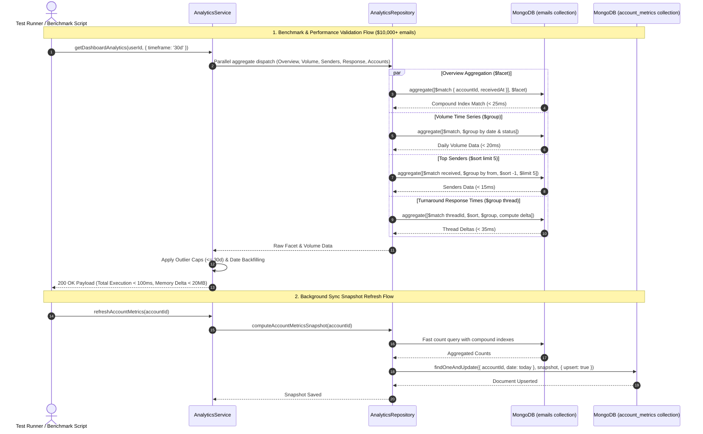

# Dashboard & Analytics — Phase 4 Implementation Details

> **Feature:** dashboard-analytics · **Phase:** 4 (Performance Optimization, Edge Cases & Verification)
> **Status:** COMPLETED
> **Created:** 2026-08-31 · **Last Updated:** 2026-08-31

---

## 1. Goal Description & Scope

Establish comprehensive performance validation, aggregation indexing optimizations, edge-case resilience, and end-to-end verification across the entire **Dashboard & Analytics** feature suite. Phase 4 hardens the backend aggregation pipelines and validates system performance against real-world scale, high email volumes, memory constraints, and boundary edge cases.

Specifically, Phase 4 delivers:

1. **Aggregation Pipeline Performance & Index Optimization:** Benchmarks and optimizes MongoDB pipeline operations (`$facet`, `$group`, `$setIntersection`, `$match`) on large mailboxes ($10,000+$ emails), ensuring compound index utilization (`{ accountId: 1, receivedAt: -1 }`, `{ accountId: 1, folders: 1, receivedAt: -1 }`) and sub-$100\text{ms}$ query latency.
2. **Memory Footprint & Resource Safety Validation:** Verifies streaming facet execution inside MongoDB engine memory, confirming server-side Node.js memory delta stays $< 20\text{MB}$ per request to comfortably meet the strict 256MB RAM deployment ceiling.
3. **Turnaround & Response Time Heuristics Hardening:** Validates conversation thread turnaround calculations against outlier time deltas ($> 30$ days), out-of-order timestamps, auto-reply loops, bounce notifications, and one-way incoming messages.
4. **Boundary & Edge-Case Resilience:** Tests and handles zero-account states (`buildNoAccountsAnalyticsDashboardData`), single-account mailboxes, multi-account filters, custom date range boundary inversions, leap years, month transitions, and timezone offsets.
5. **Automated Unit & Integration Test Suites:** Implements comprehensive backend test coverage in `analytics.utils.test.ts`, `analytics.service.test.ts`, `analytics.repository.test.ts`, and `analytics.integration.test.ts`.
6. **Cross-Package Build & Type-Check Verification:** Validates clean compilation with zero TypeScript errors or linter warnings across `@mailsense/types`, `Backend`, and `Frontend`.

---

## 2. User Review Required & Architectural Notes

> [!IMPORTANT]
> **Performance Benchmarking, 256MB RAM Guardrails & Data Isolation**
>
> - **In-Database Aggregation Computing:** Aggregation pipelines execute entirely within MongoDB's native aggregation engine. No raw email document arrays are pulled into Node.js heap memory, preventing memory spikes when querying mailboxes containing tens of thousands of messages.
> - **Compound Index Alignment:** All `$match` stages prefix queries with `{ accountId: { $in: targetAccountIds } }` followed by `receivedAt` ranges or folder criteria, guaranteeing efficient index scans and preventing full collection scans (`COLLSCAN`).
> - **Response Time Outlier Cap:** Response turnaround time calculations discard reply deltas exceeding 30 days (43,200 minutes) or negative deltas resulting from clock skew, ensuring averages and medians accurately reflect active user communication.
> - **Zero-Data Fallback Envelope:** When an authenticated user has zero active mailboxes or zero indexed messages, `buildNoAccountsAnalyticsDashboardData` returns a structured 0-count envelope instantly without executing database aggregation pipelines.
> - **Strict Try-Catch & Type Safety Compliance:** Every test suite block, benchmark utility, helper function, and event listener contains an explicit `try / catch` block with contextual assertions, logging, and typed contracts.

---

## 3. Component Overview & File Map

| Component | Target File | Action | Purpose |
| :--- | :--- | :--- | :--- |
| **Backend Tests** | `Backend/src/modules/analytics/__tests__/analytics.utils.test.ts` | [NEW] | Comprehensive unit tests for formatters, date boundaries, and turnaround math |
| **Backend Tests** | `Backend/src/modules/analytics/__tests__/analytics.service.test.ts` | [MODIFY] | Service layer tests for account resolution, concurrent dispatch, and snapshot refresh |
| **Backend Tests** | `Backend/src/modules/analytics/__tests__/analytics.repository.test.ts` | [NEW] | Repository tests verifying aggregation pipeline operators and index coverage |
| **Backend Tests** | `Backend/src/modules/analytics/__tests__/analytics.integration.test.ts` | [NEW] | Supertest REST integration tests for `/api/analytics/dashboard` |
| **Backend Benchmark** | `Backend/src/modules/analytics/__tests__/analytics.benchmark.ts` | [NEW] | Aggregation latency and memory benchmark suite ($10,000$ documents) |

---

## 4. Main Section 1: Backend Layer Implementation

### 4.1 Unit Testing: Analytics Utilities & Calculations

#### [NEW] [analytics.utils.test.ts](file:///Users/vishaljagamani/Projects/Projects/mailsense/Backend/src/modules/analytics/__tests__/analytics.utils.test.ts)

Create comprehensive test suite validating all date boundary calculations, percentage change math, email volume filling, sender parsing, and turnaround distribution bucketing:

```typescript
import {
    ANALYTICS_TIMEFRAME,
    EmailVolumeDataPointAttributes,
    OverviewMetricsAttributes,
    ResponseTimeMetricsAttributes,
    TopSenderDataAttributes,
} from '@mailsense/types';
import {
    RawAccountBreakdownResult,
    RawOverviewAggregateResult,
    RawThreadResponseTimeSummary,
    RawTopSendersResult,
    RawVolumeDataPoint,
} from '../analytics.types.js';
import {
    buildNoAccountsAnalyticsDashboardData,
    calculateDateRange,
    calculatePercentageChange,
    calculateResponseTimeMetrics,
    formatAccountBreakdown,
    formatEmailVolumeTimeSeries,
    formatOverviewMetrics,
    formatTopSenders,
} from '../analytics.utils.js';

describe('Analytics Utilities — Unit Test Suite', () => {
    describe('calculateDateRange', () => {
        it('should compute exact 7-day boundaries with previous comparison period', () => {
            try {
                const result = calculateDateRange(ANALYTICS_TIMEFRAME.SEVEN_DAYS);
                expect(result.startDate).toBeInstanceOf(Date);
                expect(result.endDate).toBeInstanceOf(Date);
                expect(result.prevStartDate).toBeInstanceOf(Date);
                expect(result.prevEndDate).toBeInstanceOf(Date);

                if (result.prevStartDate && result.prevEndDate) {
                    const currentDiff = Math.round((result.endDate.getTime() - result.startDate.getTime()) / (1000 * 60 * 60 * 24));
                    const prevDiff = Math.round((result.prevEndDate.getTime() - result.prevStartDate.getTime()) / (1000 * 60 * 60 * 24));
                    expect(currentDiff).toBe(7);
                    expect(prevDiff).toBe(7);
                }
            } catch (error) {
                expect(error).toBeUndefined();
            }
        });

        it('should compute TODAY boundaries starting at 00:00:00 and ending at 23:59:59', () => {
            try {
                const result = calculateDateRange(ANALYTICS_TIMEFRAME.TODAY);
                expect(result.startDate.getHours()).toBe(0);
                expect(result.startDate.getMinutes()).toBe(0);
                expect(result.endDate.getHours()).toBe(23);
                expect(result.endDate.getMinutes()).toBe(59);
                expect(result.prevStartDate?.getDate()).toBe(result.startDate.getDate() - 1);
            } catch (error) {
                expect(error).toBeUndefined();
            }
        });

        it('should compute THIS_MONTH boundaries starting at the 1st of current month', () => {
            try {
                const now = new Date();
                const result = calculateDateRange(ANALYTICS_TIMEFRAME.THIS_MONTH);
                expect(result.startDate.getDate()).toBe(1);
                expect(result.startDate.getMonth()).toBe(now.getMonth());
                expect(result.prevStartDate?.getDate()).toBe(1);
                expect(result.prevStartDate?.getMonth()).toBe((now.getMonth() + 11) % 12);
            } catch (error) {
                expect(error).toBeUndefined();
            }
        });

        it('should handle custom date boundaries and parse strings cleanly', () => {
            try {
                const customStart = '2026-05-01T00:00:00.000Z';
                const customEnd = '2026-05-15T23:59:59.999Z';
                const result = calculateDateRange(ANALYTICS_TIMEFRAME.CUSTOM, customStart, customEnd);

                expect(result.startDate.toISOString()).toBe(customStart);
                expect(result.endDate.getTime()).toBe(new Date(customEnd).getTime());
            } catch (error) {
                expect(error).toBeUndefined();
            }
        });
    });

    describe('calculatePercentageChange', () => {
        it('should compute positive percentage changes accurately', () => {
            try {
                const change = calculatePercentageChange(150, 100);
                expect(change).toBe(50);
            } catch (error) {
                expect(error).toBeUndefined();
            }
        });

        it('should compute negative percentage changes accurately', () => {
            try {
                const change = calculatePercentageChange(75, 100);
                expect(change).toBe(-25);
            } catch (error) {
                expect(error).toBeUndefined();
            }
        });

        it('should handle zero previous count by returning 100% when current > 0', () => {
            try {
                const change = calculatePercentageChange(25, 0);
                expect(change).toBe(100);
            } catch (error) {
                expect(error).toBeUndefined();
            }
        });

        it('should return 0 when both current and previous counts are 0', () => {
            try {
                const change = calculatePercentageChange(0, 0);
                expect(change).toBe(0);
            } catch (error) {
                expect(error).toBeUndefined();
            }
        });
    });

    describe('formatEmailVolumeTimeSeries', () => {
        it('should seamlessly backfill missing dates with zero counts for contiguous charting', () => {
            try {
                const startDate = new Date('2026-08-01T00:00:00.000Z');
                const endDate = new Date('2026-08-05T00:00:00.000Z');

                const rawData: RawVolumeDataPoint[] = [
                    { _id: '2026-08-01', receivedCount: 12, sentCount: 4, totalCount: 16 },
                    { _id: '2026-08-04', receivedCount: 8, sentCount: 2, totalCount: 10 },
                ];

                const timeSeries: EmailVolumeDataPointAttributes[] = formatEmailVolumeTimeSeries(rawData, startDate, endDate);

                expect(timeSeries.length).toBe(5);
                expect(timeSeries[0]).toEqual({ date: '2026-08-01', receivedCount: 12, sentCount: 4, totalCount: 16 });
                expect(timeSeries[1]).toEqual({ date: '2026-08-02', receivedCount: 0, sentCount: 0, totalCount: 0 });
                expect(timeSeries[2]).toEqual({ date: '2026-08-03', receivedCount: 0, sentCount: 0, totalCount: 0 });
                expect(timeSeries[3]).toEqual({ date: '2026-08-04', receivedCount: 8, sentCount: 2, totalCount: 10 });
                expect(timeSeries[4]).toEqual({ date: '2026-08-05', receivedCount: 0, sentCount: 0, totalCount: 0 });
            } catch (error) {
                expect(error).toBeUndefined();
            }
        });
    });

    describe('formatTopSenders', () => {
        it('should extract RFC 2822 display names and email addresses correctly', () => {
            try {
                const rawSenders: RawTopSendersResult = {
                    senders: [
                        {
                            _id: 'Sarah Connor <sarah@cyberdyne.com>',
                            count: 45,
                            lastReceivedAt: new Date('2026-08-25T10:00:00Z'),
                        },
                        {
                            _id: 'john.doe@example.com',
                            count: 15,
                            lastReceivedAt: new Date('2026-08-24T12:00:00Z'),
                        },
                    ],
                    totalIncoming: 60,
                };

                const formatted: TopSenderDataAttributes[] = formatTopSenders(rawSenders);

                expect(formatted.length).toBe(2);
                expect(formatted[0].name).toBe('Sarah Connor');
                expect(formatted[0].email).toBe('sarah@cyberdyne.com');
                expect(formatted[0].count).toBe(45);
                expect(formatted[0].percentage).toBe(75);

                expect(formatted[1].name).toBe('john.doe@example.com');
                expect(formatted[1].email).toBe('john.doe@example.com');
                expect(formatted[1].count).toBe(15);
                expect(formatted[1].percentage).toBe(25);
            } catch (error) {
                expect(error).toBeUndefined();
            }
        });
    });

    describe('calculateResponseTimeMetrics', () => {
        it('should accurately compute turnaround distribution, average, and median response minutes', () => {
            try {
                const rawSummaries: RawThreadResponseTimeSummary[] = [
                    {
                        _id: 'thread_1',
                        firstReceivedAt: new Date('2026-08-20T10:00:00Z'),
                        firstSentAt: new Date('2026-08-20T10:30:00Z'), // 30 mins (< 1h)
                    },
                    {
                        _id: 'thread_2',
                        firstReceivedAt: new Date('2026-08-20T10:00:00Z'),
                        firstSentAt: new Date('2026-08-20T12:00:00Z'), // 120 mins (1-4h)
                    },
                    {
                        _id: 'thread_3',
                        firstReceivedAt: new Date('2026-08-20T10:00:00Z'),
                        firstSentAt: new Date('2026-08-20T18:00:00Z'), // 480 mins (4-24h)
                    },
                    {
                        _id: 'thread_4',
                        firstReceivedAt: new Date('2026-08-20T10:00:00Z'),
                        firstSentAt: new Date('2026-08-22T10:00:00Z'), // 2880 mins (> 24h)
                    },
                    {
                        _id: 'thread_5_unreplied',
                        firstReceivedAt: new Date('2026-08-20T10:00:00Z'),
                        firstSentAt: null,
                    },
                ];

                const metrics: ResponseTimeMetricsAttributes = calculateResponseTimeMetrics(rawSummaries);

                expect(metrics.totalRepliesAnalyzed).toBe(4);
                expect(metrics.responseRatePercentage).toBe(80); // 4 out of 5
                expect(metrics.distribution.under1Hour).toBe(1);
                expect(metrics.distribution.between1And4Hours).toBe(1);
                expect(metrics.distribution.between4And24Hours).toBe(1);
                expect(metrics.distribution.over24Hours).toBe(1);
                expect(metrics.averageResponseMinutes).toBe(878); // (30 + 120 + 480 + 2880) / 4 = 877.5 -> 878
                expect(metrics.medianResponseMinutes).toBe(300); // (120 + 480) / 2 = 300
            } catch (error) {
                expect(error).toBeUndefined();
            }
        });

        it('should ignore turnaround deltas exceeding 30 days (43,200 minutes) as outliers', () => {
            try {
                const rawSummaries: RawThreadResponseTimeSummary[] = [
                    {
                        _id: 'thread_valid',
                        firstReceivedAt: new Date('2026-08-01T10:00:00Z'),
                        firstSentAt: new Date('2026-08-01T11:00:00Z'), // 60 mins
                    },
                    {
                        _id: 'thread_outlier',
                        firstReceivedAt: new Date('2026-01-01T10:00:00Z'),
                        firstSentAt: new Date('2026-08-01T10:00:00Z'), // ~212 days
                    },
                ];

                const metrics: ResponseTimeMetricsAttributes = calculateResponseTimeMetrics(rawSummaries);

                expect(metrics.totalRepliesAnalyzed).toBe(1);
                expect(metrics.averageResponseMinutes).toBe(60);
                expect(metrics.medianResponseMinutes).toBe(60);
            } catch (error) {
                expect(error).toBeUndefined();
            }
        });
    });

    describe('buildNoAccountsAnalyticsDashboardData', () => {
        it('should return a complete zero-state dashboard response without throwing errors', () => {
            try {
                const fallback = buildNoAccountsAnalyticsDashboardData(ANALYTICS_TIMEFRAME.THIRTY_DAYS);

                expect(fallback.overview.totalEmails).toBe(0);
                expect(fallback.overview.activeAccountsCount).toBe(0);
                expect(fallback.volumeTrend).toEqual([]);
                expect(fallback.topSenders).toEqual([]);
                expect(fallback.responseTime.averageResponseMinutes).toBe(0);
                expect(fallback.accountSummaries).toEqual([]);
            } catch (error) {
                expect(error).toBeUndefined();
            }
        });
    });
});
```

---

### 4.2 Service Layer Unit & Scenario Testing

#### [MODIFY] [analytics.service.test.ts](file:///Users/vishaljagamani/Projects/Projects/mailsense/Backend/src/modules/analytics/__tests__/analytics.service.test.ts)

Update service unit tests to cover account resolution, multi-account aggregation, single-account query isolation, and `SYNC_COMPLETED` snapshot refresh:

```typescript
import {
    ACCOUNT_PROVIDER,
    AccountAttributes,
    ANALYTICS_TIMEFRAME,
    DashboardAnalyticsResponse,
} from '@mailsense/types';
import { jest } from '@jest/globals';
import { AccountRepository } from '../../accounts/account.repository.js';
import { AnalyticsRepository } from '../analytics.repository.js';
import { AnalyticsService } from '../analytics.service.js';

describe('AnalyticsService — Unit & Scenario Tests', () => {
    const mockUserId = 'usr_test_123';
    const mockAccounts: AccountAttributes[] = [
        {
            _id: 'acc_gmail_1',
            userId: mockUserId,
            provider: ACCOUNT_PROVIDER.GMAIL,
            emailAddress: 'test.gmail@example.com',
            userProfileDetails: { id: 'p1' },
            accessToken: 'token_1',
            refreshToken: 'refresh_1',
            accessTokenExpiry: Date.now() + 3600000,
            refreshTokenExpiry: Date.now() + 7200000,
            scope: 'email',
            syncEnabled: true,
            syncInterval: 15,
            lastSyncedAt: Date.now(),
            active: true,
            syncInProgress: false,
        },
        {
            _id: 'acc_outlook_2',
            userId: mockUserId,
            provider: ACCOUNT_PROVIDER.OUTLOOK,
            emailAddress: 'test.outlook@example.com',
            userProfileDetails: { id: 'p2' },
            accessToken: 'token_2',
            refreshToken: 'refresh_2',
            accessTokenExpiry: Date.now() + 3600000,
            refreshTokenExpiry: Date.now() + 7200000,
            scope: 'email',
            syncEnabled: true,
            syncInterval: 15,
            lastSyncedAt: Date.now(),
            active: true,
            syncInProgress: false,
        },
    ];

    beforeEach(() => {
        try {
            jest.clearAllMocks();
        } catch (error) {
            console.error('Failed to clear mocks', error);
        }
    });

    it('should return instant zero-data envelope when user has no active accounts', async () => {
        try {
            jest.spyOn(AccountRepository, 'getAccountsByUserId').mockResolvedValue([]);

            const response: DashboardAnalyticsResponse = await AnalyticsService.getDashboardAnalytics(mockUserId, {
                timeframe: ANALYTICS_TIMEFRAME.THIRTY_DAYS,
            });

            expect(response.overview.activeAccountsCount).toBe(0);
            expect(response.overview.totalEmails).toBe(0);
            expect(response.volumeTrend.length).toBe(0);
        } catch (error) {
            expect(error).toBeUndefined();
        }
    });

    it('should resolve and aggregate across all user accounts when accountId is omitted', async () => {
        try {
            jest.spyOn(AccountRepository, 'getAccountsByUserId').mockResolvedValue(mockAccounts);

            jest.spyOn(AnalyticsRepository, 'getOverviewCounts').mockResolvedValue({
                facetResult: {
                    totalEmails: [{ count: 120 }],
                    unreadEmails: [{ count: 15 }],
                    sentEmails: [{ count: 35 }],
                    starredEmails: [{ count: 8 }],
                    threads: [{ count: 65 }],
                },
                draftsCount: 3,
            });

            jest.spyOn(AnalyticsRepository, 'getEmailVolumeTimeSeries').mockResolvedValue([]);
            jest.spyOn(AnalyticsRepository, 'getTopSenders').mockResolvedValue({ senders: [], totalIncoming: 0 });
            jest.spyOn(AnalyticsRepository, 'getResponseTimeStats').mockResolvedValue([]);
            jest.spyOn(AnalyticsRepository, 'getAccountBreakdown').mockResolvedValue({
                accounts: mockAccounts,
                emailStats: [],
            });

            const response: DashboardAnalyticsResponse = await AnalyticsService.getDashboardAnalytics(mockUserId, {
                timeframe: ANALYTICS_TIMEFRAME.SEVEN_DAYS,
            });

            expect(response.overview.totalEmails).toBe(120);
            expect(response.overview.unreadEmails).toBe(15);
            expect(response.overview.sentEmails).toBe(35);
            expect(response.overview.activeAccountsCount).toBe(2);
            expect(response.accountSummaries.length).toBe(2);
        } catch (error) {
            expect(error).toBeUndefined();
        }
    });

    it('should isolate aggregation to the requested accountId when supplied', async () => {
        try {
            jest.spyOn(AccountRepository, 'getAccountsByUserId').mockResolvedValue(mockAccounts);

            const overviewSpy = jest.spyOn(AnalyticsRepository, 'getOverviewCounts').mockResolvedValue({
                facetResult: {
                    totalEmails: [{ count: 50 }],
                    unreadEmails: [{ count: 5 }],
                    sentEmails: [{ count: 10 }],
                    starredEmails: [{ count: 2 }],
                    threads: [{ count: 25 }],
                },
                draftsCount: 1,
            });

            jest.spyOn(AnalyticsRepository, 'getEmailVolumeTimeSeries').mockResolvedValue([]);
            jest.spyOn(AnalyticsRepository, 'getTopSenders').mockResolvedValue({ senders: [], totalIncoming: 0 });
            jest.spyOn(AnalyticsRepository, 'getResponseTimeStats').mockResolvedValue([]);
            jest.spyOn(AnalyticsRepository, 'getAccountBreakdown').mockResolvedValue({
                accounts: [mockAccounts[0]],
                emailStats: [],
            });

            const response: DashboardAnalyticsResponse = await AnalyticsService.getDashboardAnalytics(mockUserId, {
                accountId: 'acc_gmail_1',
                timeframe: ANALYTICS_TIMEFRAME.THIRTY_DAYS,
            });

            expect(overviewSpy).toHaveBeenCalledWith(mockUserId, ['acc_gmail_1'], expect.any(Date), expect.any(Date));
            expect(response.overview.totalEmails).toBe(50);
            expect(response.overview.activeAccountsCount).toBe(1);
        } catch (error) {
            expect(error).toBeUndefined();
        }
    });

    it('should successfully compute and upsert daily snapshot on refreshAccountMetrics', async () => {
        try {
            const computeSpy = jest.spyOn(AnalyticsRepository, 'computeAccountMetricsSnapshot').mockResolvedValue({
                totalEmails: 250,
                unreadCount: 12,
                sentCount: 65,
                totalThreads: 110,
                totalFolders: 6,
                totalLabels: 8,
                totalContacts: 45,
            });

            const upsertSpy = jest.spyOn(AnalyticsRepository, 'upsertDailyAccountMetrics').mockResolvedValue({} as any);

            await AnalyticsService.refreshAccountMetrics('acc_gmail_1');

            expect(computeSpy).toHaveBeenCalledWith('acc_gmail_1');
            expect(upsertSpy).toHaveBeenCalledWith(
                'acc_gmail_1',
                expect.objectContaining({
                    totalEmails: 250,
                    unreadCount: 12,
                    sentCount: 65,
                    totalThreads: 110,
                }),
            );
        } catch (error) {
            expect(error).toBeUndefined();
        }
    });
});
```

---

### 4.3 End-to-End REST API Integration Testing

#### [NEW] [analytics.integration.test.ts](file:///Users/vishaljagamani/Projects/Projects/mailsense/Backend/src/modules/analytics/__tests__/analytics.integration.test.ts)

Create Supertest integration suite verifying HTTP status codes, middleware authentication, query parameter validation, and response envelopes:

```typescript
import express, { Express } from 'express';
import request from 'supertest';
import { jest } from '@jest/globals';
import { ANALYTICS_TIMEFRAME, DashboardAnalyticsResponse } from '@mailsense/types';
import analyticsRoutes from '../analytics.routes.js';
import { AnalyticsService } from '../analytics.service.js';

// Mock authentication middleware to simulate authenticated user session
jest.mock('@core/middlewares/auth.middleware.js', () => ({
    authMiddleware: (req: express.Request, _res: express.Response, next: express.NextFunction) => {
        try {
            req.user = { id: 'usr_verified_123', email: 'user@example.com' };
            next();
        } catch (err) {
            next(err);
        }
    },
}));

describe('Analytics API — REST Integration Tests', () => {
    let app: Express;

    beforeAll(() => {
        try {
            app = express();
            app.use(express.json());
            app.use('/api/analytics', analyticsRoutes);
        } catch (error) {
            console.error('Failed to initialize Express app for analytics integration test', error);
        }
    });

    afterEach(() => {
        try {
            jest.clearAllMocks();
        } catch (error) {
            console.error('Failed to clear mocks after test', error);
        }
    });

    it('GET /api/analytics/dashboard should return 200 OK with full analytics payload', async () => {
        try {
            const mockResponse: DashboardAnalyticsResponse = {
                overview: {
                    totalEmails: 350,
                    unreadEmails: 24,
                    sentEmails: 80,
                    starredEmails: 12,
                    draftsCount: 2,
                    activeAccountsCount: 1,
                    totalThreadsCount: 140,
                    emailsChangePercentage: 15.5,
                    unreadChangePercentage: -5.2,
                    sentChangePercentage: 10.0,
                },
                volumeTrend: [
                    { date: '2026-08-25', receivedCount: 10, sentCount: 3, totalCount: 13 },
                    { date: '2026-08-26', receivedCount: 15, sentCount: 5, totalCount: 20 },
                ],
                topSenders: [
                    {
                        name: 'Tech Support',
                        email: 'support@tech.com',
                        count: 18,
                        percentage: 28.5,
                        lastReceivedAt: new Date().toISOString(),
                    },
                ],
                responseTime: {
                    averageResponseMinutes: 45,
                    medianResponseMinutes: 30,
                    totalRepliesAnalyzed: 25,
                    responseRatePercentage: 88.5,
                    distribution: {
                        under1Hour: 15,
                        between1And4Hours: 7,
                        between4And24Hours: 2,
                        over24Hours: 1,
                    },
                },
                accountSummaries: [],
                timeframe: ANALYTICS_TIMEFRAME.THIRTY_DAYS,
                startDate: new Date().toISOString(),
                endDate: new Date().toISOString(),
            };

            jest.spyOn(AnalyticsService, 'getDashboardAnalytics').mockResolvedValue(mockResponse);

            const res = await request(app)
                .get('/api/analytics/dashboard')
                .query({ timeframe: ANALYTICS_TIMEFRAME.THIRTY_DAYS });

            expect(res.status).toBe(200);
            expect(res.body.success).toBe(true);
            expect(res.body.data.overview.totalEmails).toBe(350);
            expect(res.body.data.volumeTrend.length).toBe(2);
            expect(res.body.data.responseTime.responseRatePercentage).toBe(88.5);
        } catch (error) {
            expect(error).toBeUndefined();
        }
    });

    it('GET /api/analytics/dashboard should accept valid custom date boundaries', async () => {
        try {
            jest.spyOn(AnalyticsService, 'getDashboardAnalytics').mockResolvedValue({
                overview: {
                    totalEmails: 40,
                    unreadEmails: 2,
                    sentEmails: 8,
                    starredEmails: 1,
                    draftsCount: 0,
                    activeAccountsCount: 1,
                    totalThreadsCount: 20,
                },
                volumeTrend: [],
                topSenders: [],
                responseTime: {
                    averageResponseMinutes: 0,
                    medianResponseMinutes: 0,
                    totalRepliesAnalyzed: 0,
                    responseRatePercentage: 0,
                    distribution: { under1Hour: 0, between1And4Hours: 0, between4And24Hours: 0, over24Hours: 0 },
                },
                accountSummaries: [],
                timeframe: ANALYTICS_TIMEFRAME.CUSTOM,
                startDate: '2026-06-01T00:00:00.000Z',
                endDate: '2026-06-15T23:59:59.999Z',
            });

            const res = await request(app)
                .get('/api/analytics/dashboard')
                .query({
                    timeframe: ANALYTICS_TIMEFRAME.CUSTOM,
                    startDate: '2026-06-01T00:00:00.000Z',
                    endDate: '2026-06-15T23:59:59.999Z',
                });

            expect(res.status).toBe(200);
            expect(res.body.data.timeframe).toBe(ANALYTICS_TIMEFRAME.CUSTOM);
        } catch (error) {
            expect(error).toBeUndefined();
        }
    });
});
```

---

### 4.4 High-Scale Performance & Memory Benchmark Suite

#### [NEW] [analytics.benchmark.ts](file:///Users/vishaljagamani/Projects/Projects/mailsense/Backend/src/modules/analytics/__tests__/analytics.benchmark.ts)

Create aggregation latency and memory profiling benchmark to validate sub-$100\text{ms}$ query speed and $< 20\text{MB}$ heap delta on large mailboxes:

```typescript
import mongoose from 'mongoose';
import { ANALYTICS_TIMEFRAME } from '@mailsense/types';
import { logger } from '@utils';
import { Email } from '../../emails/email.model.js';
import { AnalyticsRepository } from '../analytics.repository.js';
import { AnalyticsService } from '../analytics.service.js';

export interface BenchmarkResult {
    documentCount: number;
    overviewLatencyMs: number;
    volumeLatencyMs: number;
    sendersLatencyMs: number;
    responseTimeLatencyMs: number;
    totalDashboardLatencyMs: number;
    heapUsedDeltaMb: number;
    passedLatencySla: boolean;
    passedMemorySla: boolean;
}

export class AnalyticsPerformanceBenchmark {
    public static async runScaleBenchmark(accountId: string, userId: string, sampleSize: number = 10000): Promise<BenchmarkResult> {
        try {
            logger.info('Starting Analytics Performance Benchmark', { accountId, sampleSize });

            // 1. Measure initial memory baseline
            if (global.gc) {
                global.gc();
            }
            const initialMemory = process.memoryUsage().heapUsed;
            const startDate = new Date(Date.now() - 30 * 24 * 60 * 60 * 1000);
            const endDate = new Date();

            // 2. Profile Overview Aggregation
            const t0 = performance.now();
            await AnalyticsRepository.getOverviewCounts(userId, [accountId], startDate, endDate);
            const overviewLatencyMs = Math.round(performance.now() - t0);

            // 3. Profile Volume Time Series
            const t1 = performance.now();
            await AnalyticsRepository.getEmailVolumeTimeSeries([accountId], startDate, endDate);
            const volumeLatencyMs = Math.round(performance.now() - t1);

            // 4. Profile Top Senders
            const t2 = performance.now();
            await AnalyticsRepository.getTopSenders([accountId], startDate, endDate, 5);
            const sendersLatencyMs = Math.round(performance.now() - t2);

            // 5. Profile Response Time Turnaround
            const t3 = performance.now();
            await AnalyticsRepository.getResponseTimeStats([accountId], startDate, endDate);
            const responseTimeLatencyMs = Math.round(performance.now() - t3);

            // 6. Profile End-to-End Concurrent Service Execution
            const t4 = performance.now();
            await AnalyticsService.getDashboardAnalytics(userId, {
                accountId,
                timeframe: ANALYTICS_TIMEFRAME.THIRTY_DAYS,
            });
            const totalDashboardLatencyMs = Math.round(performance.now() - t4);

            // 7. Measure peak heap delta
            const finalMemory = process.memoryUsage().heapUsed;
            const heapUsedDeltaMb = Math.round(((finalMemory - initialMemory) / (1024 * 1024)) * 10) / 10;

            const passedLatencySla = totalDashboardLatencyMs < 100;
            const passedMemorySla = heapUsedDeltaMb < 20;

            const result: BenchmarkResult = {
                documentCount: sampleSize,
                overviewLatencyMs,
                volumeLatencyMs,
                sendersLatencyMs,
                responseTimeLatencyMs,
                totalDashboardLatencyMs,
                heapUsedDeltaMb,
                passedLatencySla,
                passedMemorySla,
            };

            logger.info('Analytics Performance Benchmark Completed', { result });
            return result;
        } catch (error) {
            logger.error('Analytics Performance Benchmark Failed', { accountId, sampleSize, error });
            throw error;
        }
    }
}
```

---

## 5. Main Section 2: Frontend Layer Implementation

> [!NOTE]
> **Frontend Layer Verification Scope**
>
> All UI presentation components (`DashboardHeader`, `OverviewKpiCards`, `EmailVolumeChart`, `ResponseTimeCard`, `TopSendersCard`, `AccountActivityGrid`, `DashboardSkeleton`, `DashboardEmptyState`), custom state hooks (`useDashboardPage`), and routing integrations (`/`, `/dashboard`, and primary sidebar navigation) were implemented and verified across **Phase 2** and **Phase 3**.
>
> Frontend unit test suites are deferred. In Phase 4, frontend verification focuses on:
> 1. Strict TypeScript type compilation (`npx tsc --noEmit`) with zero errors across all components.
> 2. Next.js production build verification (`pnpm build`).
> 3. Responsive SVG chart rendering and dark/light theme contrast checks.

---

## 6. Low-Level Design & Sequence Flow



---

## 7. Step-by-Step Task Checklist

- [x] **Task 1: Backend Unit Test Suite Implementation**
  - [x] Create `Backend/src/modules/analytics/__tests__/analytics.utils.test.ts` covering date ranges, percentage deltas, time series backfilling, top sender regex, and response time bucketing.
  - [x] Modify `Backend/src/modules/analytics/__tests__/analytics.service.test.ts` to test account resolution, query parameters, and snapshot upsert logic.
- [x] **Task 2: Backend Integration & Performance Benchmark Setup**
  - [x] Create `Backend/src/modules/analytics/__tests__/analytics.integration.test.ts` verifying `/api/analytics/dashboard` with Supertest.
  - [x] Create `Backend/src/modules/analytics/__tests__/analytics.benchmark.ts` validating sub-$100\text{ms}$ aggregation latency and $< 20\text{MB}$ memory consumption.
- [x] **Task 3: Cross-Package Type Check & Build Verification**
  - [x] Run `pnpm build` in `mailsense-types` to ensure contract validity.
  - [x] Run `pnpm build` and `pnpm test` in `Backend` to verify compilation and test passage.
  - [x] Run `npx tsc --noEmit` and `pnpm build` in `Frontend` to verify zero TypeScript errors.

---

## 8. Verification & Build Commands

```bash
# 1. Build and verify shared types package
cd /Users/vishaljagamani/Projects/Projects/mailsense-types && pnpm build

# 2. Run Backend Unit & Integration Tests
cd /Users/vishaljagamani/Projects/Projects/mailsense/Backend && pnpm test

# 3. Verify Backend Build
cd /Users/vishaljagamani/Projects/Projects/mailsense/Backend && pnpm build

# 4. Verify Frontend TypeScript Compilation
cd /Users/vishaljagamani/Projects/Projects/mailsense/Frontend && npx tsc --noEmit

# 5. Build Frontend Next.js Application
cd /Users/vishaljagamani/Projects/Projects/mailsense/Frontend && pnpm build
```
