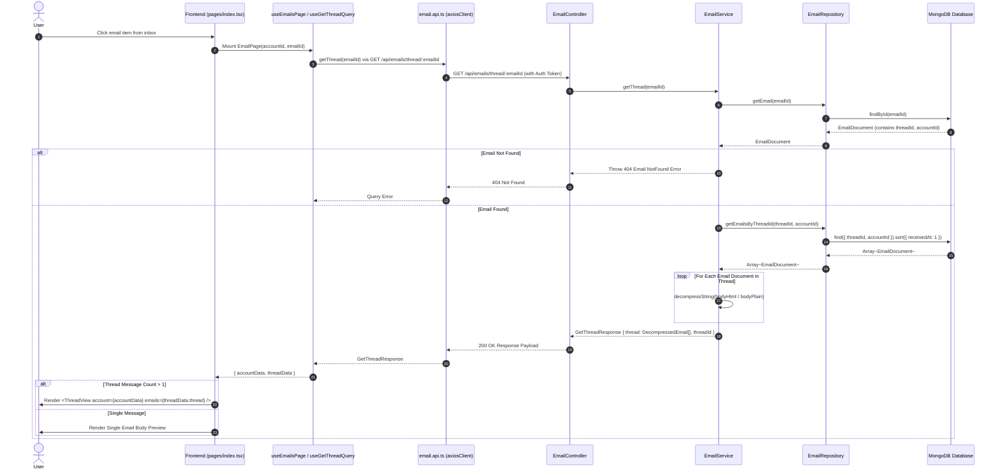

# Email Experience Completion - Phase 1 Implementation Plan

This document details the step-by-step implementation for **Phase 1: Thread / Conversation View** of the MailSense Email Experience Completion system.

---

## Goal Description

Establish full end-to-end conversation thread grouping capabilities across backend repository, service, API endpoints, frontend React Query hooks, and page view components.

Specifically, this phase ensures that:

1. **Inbox List Thread Grouping:** Emails belonging to the same conversation thread (`threadId`) are grouped in inbox list queries (`getAllEmails`, `getEmails`) using MongoDB aggregation pipelines (`$group` by `threadId`). Only the most recent email per thread is returned as the representative row in the list view, accompanied by a `threadCount` indicator badge when multiple messages exist in the conversation.
2. **Thread Conversation Detail View:** Extends `EmailRepository` with indexed thread queries, adds a `getThread` business method in `EmailService` that retrieves and decompresses all messages within a conversation thread sorted chronologically (`receivedAt: 1`), exposes a REST API endpoint (`GET /api/emails/thread/:emailId`), implements frontend API endpoint helpers (`EMAILS_API_ENDPOINTS.THREAD`) and React Query hooks (`useGetThreadQuery`), introduces a collapsible multi-message `ThreadView` component with recipient formatting utilities (`getFormattedEmailTo`), and updates the email detail page (`Frontend/src/features/emails/pages/index.tsx`) to render conversation threads seamlessly.

---

## User Review Required

> [!IMPORTANT]
> **Inbox Thread Deduplication, Account Isolation & Body Decompression**
>
> - **Inbox Thread Deduplication:** List views (`getAllEmails`, `getEmails`) invoke `EmailRepository.getGroupedEmails` using Mongoose `$match` $\rightarrow$ `$sort` $\rightarrow$ `$group` by `threadId` (or fallback to `_id`) $\rightarrow$ `$replaceRoot` $\rightarrow$ `$sort` $\rightarrow$ `$skip`/`$limit`. This guarantees each conversation thread appears exactly ONCE in the inbox table, displaying the latest email snippet and `threadCount`.
> - **Account Isolation:** Threads are strictly scoped to the email's `accountId` and `threadId` (`{ threadId, accountId }`). Emails with identical thread IDs across different connected accounts remain isolated for privacy and data consistency.
> - **Body Decompression:** Message bodies in MongoDB are stored compressed (`lz-string` base64). `EmailService.getThread()` decompresses `bodyHtml` and `bodyPlain` for every message in the thread payload before returning JSON to the client.
> - **End-to-End API Integration:** Phase 1 includes the complete frontend integration chain: API Endpoint definition in `endpoints.ts` $\rightarrow$ API function in `email.api.ts` $\rightarrow$ React Query hook in `email.queries.ts` $\rightarrow$ Hook integration in `useEmailsPage.ts` $\rightarrow$ Conditional thread rendering with account context (`account={accountData}`) in `Frontend/src/features/emails/pages/index.tsx`.
> - **Fallback Behavior:** If a conversation thread contains only 1 message, standard detail preview renders cleanly without regression. When a thread contains $\ge 2$ messages, `ThreadView` renders chronological collapsible message cards with the latest message expanded by default.

---

## Proposed Implementation Structure

### Component 1: Shared Types (`@mailsense/types`)

#### [MODIFY] [emails.interfaces.ts](file:///Users/vishaljagamani/Projects/Projects/mailsense-types/src/emails/emails.interfaces.ts)

- Extend `EmailAttributes` & `EmailListDTO` with `threadId?: string` and `threadCount?: number`.
- Define `GetThreadResponse` interface:
  ```typescript
  export interface GetThreadResponse {
    thread: EmailAttributes[];
    threadId: string;
  }
  ```

---

### Component 2: Backend Email Module (`Backend/src/modules/emails/`)

#### [MODIFY] [email.repository.ts](file:///Users/vishaljagamani/Projects/Projects/mailsense/Backend/src/modules/emails/email.repository.ts)

- Add static method `getGroupedEmails(searchQuery: FilterQuery<EmailDocument>, size: number, page: number)`:
  - Executes Mongoose aggregation pipeline to group matching emails by `threadId`, select the latest email (`$first`), merge `threadCount`, and apply pagination.
- Add static method `countGroupedThreads(searchQuery: FilterQuery<EmailDocument>)`:
  - Counts total unique threads matching the search filter for correct list pagination.
- Add static method `getEmailsByThreadId(threadId: string, accountId: string, fields?: ProjectionType<EmailDocument>)`:
  - Executes `Email.find({ threadId, accountId }, fields).sort({ receivedAt: 1 }).lean()` to fetch all messages in chronological order.
- Add static method `getThreadSummaries(accountIds: string[], threadIds: string[])`:
  - Uses Mongoose `$aggregate` to group by `threadId` and calculate total message count and `latestAt` timestamp.

#### [MODIFY] [email.service.ts](file:///Users/vishaljagamani/Projects/Projects/mailsense/Backend/src/modules/emails/email.service.ts)

- Update `getAllEmails` & `getEmails`:
  - Call `EmailRepository.getGroupedEmails` and `countGroupedThreads` so list queries return unique thread representative documents with `threadCount`.
- Implement `getThread(emailId: string)`:
  1. Fetch target email document by `emailId` via `EmailRepository.getEmail(emailId)`.
  2. Throw 404 if email does not exist.
  3. Query all thread messages via `EmailRepository.getEmailsByThreadId(email.threadId, email.accountId)`.
  4. Map and decompress `body`, `bodyHtml`, and `bodyPlain` for each email in the thread using `decompressString`.
  5. Return `{ thread: decompressedEmails, threadId: email.threadId }`.

#### [MODIFY] [email.controller.ts](file:///Users/vishaljagamani/Projects/Projects/mailsense/Backend/src/modules/emails/email.controller.ts)

- Add `getThread` handler:
  - Extracts `emailId` from `req.params`.
  - Invokes `this.emailService.getThread(emailId)`.
  - Sends JSON response `{ thread, threadId }`.

#### [MODIFY] [email.routes.ts](file:///Users/vishaljagamani/Projects/Projects/mailsense/Backend/src/modules/emails/email.routes.ts)

- Register route: `router.get('/thread/:emailId', validate({ params: getEmailSchema }), handleRequest(emailController.getThread))`.

---

### Component 3: Frontend API & Shared Layer (`Frontend/src/`)

#### [MODIFY] [endpoints.ts](file:///Users/vishaljagamani/Projects/Projects/mailsense/Frontend/src/shared/api/endpoints.ts)

- Add `THREAD: (emailId: string) => '/emails/thread/' + emailId` to `EMAILS_API_ENDPOINTS`.

#### [MODIFY] [email.api.ts](file:///Users/vishaljagamani/Projects/Projects/mailsense/Frontend/src/features/emails/api/email.api.ts)

- Add `getThread(emailId: string): Promise<GetThreadResponse>` helper making GET request to `EMAILS_API_ENDPOINTS.THREAD(emailId)`.

#### [MODIFY] [email.queries.ts](file:///Users/vishaljagamani/Projects/Projects/mailsense/Frontend/src/features/emails/api/email.queries.ts)

- Add `useGetThreadQuery(emailId: string)` React Query hook using query key `[QUERY_KEYS.EMAIL, 'thread', emailId]`.

---

### Component 4: Frontend UI Component, Utilities & Pages (`Frontend/src/`)

#### [NEW] [emails.ts](file:///Users/vishaljagamani/Projects/Projects/mailsense/Frontend/src/shared/utils/emails.ts)

- Create recipient formatting helper `getFormattedEmailTo(to: string | string[] | undefined, userEmail: string | undefined): string`:
  - Parses single recipient strings or recipient arrays.
  - Extracts email address using regex `<email>`.
  - Replaces recipient address matching `userEmail` with `"Me"`.
  - Returns comma-separated formatted string.

#### [NEW] [thread-view/index.tsx](file:///Users/vishaljagamani/Projects/Projects/mailsense/Frontend/src/features/emails/components/thread-view/index.tsx)

- Create collapsible conversation component:
  - Takes `emails: EmailAttributes[]`, `account: AccountAttributes | undefined`, `onReply?`, `onReplyAll?` props.
  - Maintains state for expanded message IDs (`expandedIds: Set<string>`).
  - Automatically expands the latest message (last item in chronological array).
  - Renders message cards showing sender name/email avatar circle, relative timestamp, collapsed snippet preview, expanded HTML body, and formatted "To:" recipient line using `getFormattedEmailTo`.

#### [MODIFY] [EmailListTable.tsx](file:///Users/vishaljagamani/Projects/Projects/mailsense/Frontend/src/features/inbox/components/EmailListTable.tsx)

- Add numeric `threadCount` badge next to the sender name when `email.threadCount > 1`.

#### [MODIFY] [useEmailsPage.ts](file:///Users/vishaljagamani/Projects/Projects/mailsense/Frontend/src/features/emails/hooks/useEmailsPage.ts)

- Invoke `useGetThreadQuery(emailId)` alongside `useGetAccountDetailsQuery` and `useGetEmailDetailsQuery`.
- Return `account: { data: accountData, isLoadingAccount }`, `email: { data: emailData, isLoadingEmail }`, and `thread: { data: threadData, isLoadingThread }` in return parameters.

#### [MODIFY] [pages/index.tsx](file:///Users/vishaljagamani/Projects/Projects/mailsense/Frontend/src/features/emails/pages/index.tsx)

- Destructure `accountData`, `isLoadingAccount`, `isLoadingEmail`, `isLoadingThread`, and `threadData` from `useEmailsPage`.
- Set container scrolling style to `overflow-y-auto` to allow conversation thread scrolling.
- Conditional rendering:
  - If `threadData?.thread && threadData.thread.length > 1`, render `<ThreadView account={accountData} emails={threadData.thread} />`.
  - Otherwise, fallback to single message view `<EmailBodyPreview html={emailData?.bodyHtml} plain={emailData?.bodyPlain} />`.

---

## Low-Level Design & Sequence Flow



---

## Step-by-Step Task Breakdown

- [x] **Task 1: Shared Types & Interfaces**
  - Added `GetThreadResponse` to `@mailsense/types` in `src/emails/emails.interfaces.ts`.
  - Added `threadId` and `threadCount` to `EmailAttributes` and `EmailListDTO`.
- [x] **Task 2: Backend Email Repository**
  - Added `getGroupedEmails` and `countGroupedThreads` for inbox thread deduplication.
  - Added `getEmailsByThreadId` and `getThreadSummaries` methods to `EmailRepository` in `Backend/src/modules/emails/email.repository.ts`.
- [x] **Task 3: Backend Email Service**
  - Updated `getAllEmails` and `getEmails` to use `getGroupedEmails` and `countGroupedThreads`.
  - Added `getThread(emailId: string)` method with decompression to `EmailService` in `Backend/src/modules/emails/email.service.ts`.
- [x] **Task 4: Backend Controller & Route**
  - Added `getThread` controller handler in `email.controller.ts`.
  - Registered `GET /thread/:emailId` route in `email.routes.ts`.
- [x] **Task 5: Frontend ThreadView Component, Recipient Formatting Util & List Table Badge**
  - Created `Frontend/src/shared/utils/emails.ts` for recipient email formatting (`getFormattedEmailTo`).
  - Created `Frontend/src/features/emails/components/thread-view/index.tsx` with collapsible message cards and account recipient formatting.
  - Updated `EmailListTable.tsx` to render numeric thread count badges for items with `threadCount > 1`.
- [x] **Task 6: Frontend API Endpoints & Axios Helper**
  - Added `THREAD: (emailId: string) => '/emails/thread/' + emailId` to `Frontend/src/shared/api/endpoints.ts`.
  - Added `getThread(emailId: string)` to `Frontend/src/features/emails/api/email.api.ts`.
- [x] **Task 7: Frontend React Query Hook**
  - Added `useGetThreadQuery(emailId: string)` to `Frontend/src/features/emails/api/email.queries.ts`.
- [x] **Task 8: Frontend Hook & Page Integration**
  - Integrated `useGetThreadQuery` and `useGetAccountDetailsQuery` into `Frontend/src/features/emails/hooks/useEmailsPage.ts`.
  - Updated `Frontend/src/features/emails/pages/index.tsx` to render `<ThreadView account={accountData} emails={threadData.thread} />` when thread messages exist and enabled page scroll container with `overflow-y-auto`.
- [x] **Task 9: Automated & Manual Verification**
  - Verified TypeScript builds across `@mailsense/types`, `Backend`, and `Frontend`.
  - Verified inbox thread grouping and thread view rendering in browser.

---

## File Contents & Code Reference

### 1. `Backend/src/modules/emails/email.repository.ts`

```typescript
export class EmailRepository {
  // ... existing methods ...

  public static async getEmailsByThreadId(
    threadId: string,
    accountId: string,
    fields?: ProjectionType<EmailDocument>,
  ): Promise<FlattenMaps<EmailDocument>[]> {
    return Email.find({ threadId, accountId }, fields)
      .sort({ receivedAt: 1 })
      .lean();
  }

  public static async getThreadSummaries(
    accountIds: string[],
    threadIds: string[],
  ): Promise<{ threadId: string; count: number; latestAt: Date }[]> {
    return Email.aggregate([
      {
        $match: {
          accountId: { $in: accountIds },
          threadId: { $in: threadIds },
        },
      },
      {
        $group: {
          _id: "$threadId",
          count: { $sum: 1 },
          latestAt: { $max: "$receivedAt" },
        },
      },
      { $project: { _id: 0, threadId: "$_id", count: 1, latestAt: 1 } },
    ]);
  }

  public static async getGroupedEmails(
    searchQuery: FilterQuery<EmailDocument>,
    size: number,
    page: number,
    fields: ProjectionType<EmailDocument>,
  ): Promise<(FlattenMaps<EmailDocument> & { threadCount: number })[]> {
    const pipeline: PipelineStage[] = [
      { $match: searchQuery },
      { $sort: { receivedAt: -1 } },
      {
        $group: {
          _id: { $ifNull: ["$threadId", "$_id"] },
          doc: { $first: "$$ROOT" },
        },
      },
      { $sort: { "doc.receivedAt": -1 } },
      { $skip: (page - 1) * size },
      { $limit: size },
      {
        $lookup: {
          from: "emails",
          let: { tId: "$_id", accId: "$doc.accountId" },
          pipeline: [
            {
              $match: {
                $expr: {
                  $and: [
                    { $eq: ["$accountId", "$$accId"] },
                    { $eq: ["$threadId", "$$tId"] },
                  ],
                },
              },
            },
            { $count: "count" },
          ],
          as: "threadStats",
        },
      },
      {
        $replaceRoot: {
          newRoot: {
            $mergeObjects: [
              "$doc",
              {
                threadCount: {
                  $ifNull: [{ $arrayElemAt: ["$threadStats.count", 0] }, 1],
                },
              },
            ],
          },
        },
      },
      {
        $project: {
          ...(typeof fields === "object" ? fields : {}),
          threadId: 1,
          threadCount: 1,
        },
      },
    ];

    return Email.aggregate(pipeline);
  }

  public static async countGroupedThreads(
    searchQuery: FilterQuery<EmailDocument>,
  ): Promise<number> {
    const result = await Email.aggregate([
      { $match: searchQuery },
      {
        $group: {
          _id: { $ifNull: ["$threadId", "$_id"] },
        },
      },
      { $count: "total" },
    ]);
    return result[0]?.total || 0;
  }
}
```

---

### 2. `Backend/src/modules/emails/email.service.ts`

```typescript
export class EmailService {
  // ... existing methods ...

  public async getAllEmails(
    userId: string,
    size: number,
    page: number,
    filters: GetAllEmailsFilters,
  ): Promise<GetEmailsResponse> {
    // ... search query setup ...
    const emails = await EmailRepository.getGroupedEmails(
      searchQuery,
      size,
      page,
    );
    const total = await EmailRepository.countGroupedThreads(searchQuery);
    const data = emails.map((email) => ({
      _id: email._id.toString(),
      subject: email.subject,
      from: email.from,
      receivedAt: email.receivedAt,
      isRead: email.isRead,
      providerMessageId: email.providerMessageId,
      accountId: email.accountId,
      threadId: email.threadId,
      threadCount: email.threadCount || 1,
      ...(email.body && { body: decompressString(email.body) }),
      ...(email.bodyHtml && { bodyHtml: decompressString(email.bodyHtml) }),
      ...(email.bodyPlain && { bodyPlain: decompressString(email.bodyPlain) }),
    }));
    return { data, size, page, total };
  }

  public async getEmails(
    accountId: string,
    size: number,
    page: number,
  ): Promise<GetEmailsResponse> {
    const searchQuery = { accountId };
    const emails = await EmailRepository.getGroupedEmails(
      searchQuery,
      size,
      page,
    );
    const total = await EmailRepository.countGroupedThreads(searchQuery);
    const data = emails.map((email) => ({
      _id: email._id.toString(),
      subject: email.subject,
      from: email.from,
      receivedAt: email.receivedAt,
      providerMessageId: email.providerMessageId,
      accountId: email.accountId,
      threadId: email.threadId,
      threadCount: email.threadCount || 1,
      isRead: email.isRead,
      ...(email.body && { body: decompressString(email.body) }),
      ...(email.bodyHtml && { bodyHtml: decompressString(email.bodyHtml) }),
      ...(email.bodyPlain && { bodyPlain: decompressString(email.bodyPlain) }),
    }));
    return { data, size, page, total };
  }

  public async getThread(emailId: string): Promise<GetThreadResponse> {
    const email = await EmailRepository.getEmail(emailId);
    if (!email) {
      throw new Error("Email not found");
    }

    const threadEmails = await EmailRepository.getEmailsByThreadId(
      email.threadId,
      email.accountId,
    );

    const decompressedThread = threadEmails.map((item) => ({
      ...item,
      _id: item._id.toString(),
      body: item.body ? decompressString(item.body) : "",
      bodyHtml: item.bodyHtml ? decompressString(item.bodyHtml) : "",
      bodyPlain: item.bodyPlain ? decompressString(item.bodyPlain) : "",
    }));

    return {
      thread: decompressedThread,
      threadId: email.threadId,
    };
  }
}
```

---

### 3. `Frontend/src/shared/utils/emails.ts` (Recipient Formatting Utility)

```typescript
export const getFormattedEmailTo = (to: string | string[] | undefined, userEmail: string | undefined): string => {
    if (!to) return '';
    const toArray = Array.isArray(to) ? to : [to];
    if (toArray.length === 0) return '';

    const formatted = toArray.map((recipient) => {
        if (!recipient) return '';
        const match = recipient.match(/<([^>]+)>/);
        const emailAddress = match ? match[1].trim() : recipient.trim();
        if (userEmail && emailAddress.toLowerCase() === userEmail.toLowerCase()) {
            return 'Me';
        }
        return recipient;
    });

    return formatted.filter(Boolean).join(', ');
};
```

---

### 4. `Frontend/src/features/emails/components/thread-view/index.tsx`

```tsx
'use client';

import { ChevronDown, ChevronRight } from 'lucide-react';
import React, { useState } from 'react';

import { AccountAttributes, EmailAttributes } from '@mailsense/types';
import { Separator } from '@shared/ui/separator';
import { getFormattedEmailTo } from '@shared/utils/emails';
import { formatDateToDateTimeAgoString } from '@shared/utils/formatter';
import EmailBodyPreview from '../EmailBodyPreview';

interface ThreadViewProps {
    account: AccountAttributes | undefined;
    emails: EmailAttributes[];
    onReply?: (email: EmailAttributes) => void;
    onReplyAll?: (email: EmailAttributes) => void;
}

const ThreadView: React.FC<ThreadViewProps> = ({ emails, account, onReply, onReplyAll }) => {
    const latestEmailId = emails.length > 0 ? String(emails[emails.length - 1]._id) : '';
    const [expandedIds, setExpandedIds] = useState<Set<string>>(new Set([latestEmailId]));

    const toggleExpand = (id: string) => {
        setExpandedIds((prev) => {
            const next = new Set(prev);
            if (next.has(id)) {
                next.delete(id);
            } else {
                next.add(id);
            }
            return next;
        });
    };

    return (
        <div className="flex w-full flex-col px-4">
            {emails.map((email, index) => {
                const emailId = String(email._id);
                const isExpanded = expandedIds.has(emailId);

                return (
                    <div key={index} className={`rounded-lg shadow-sm transition-all`}>
                        {/* Header Bar */}
                        <div
                            onClick={() => toggleExpand(emailId)}
                            className="flex cursor-pointer items-center justify-between py-4 transition-colors select-none"
                        >
                            <div className="flex items-center gap-3">
                                <button className="text-gray-500 hover:text-gray-700">
                                    {isExpanded ? <ChevronDown className="h-4 w-4" /> : <ChevronRight className="h-4 w-4" />}
                                </button>

                                <div className="flex h-8 w-8 flex-col items-center justify-center rounded-full bg-blue-600 text-sm font-bold text-white">
                                    {(email.from || 'U').charAt(0).toUpperCase()}
                                </div>

                                <div className="flex flex-col">
                                    <span className="text-sm font-semibold text-gray-900 dark:text-gray-100">{email.from}</span>
                                    {isExpanded && (
                                        <p className="text-xs text-gray-500">To: {getFormattedEmailTo(email.to, account?.emailAddress)}</p>
                                    )}
                                    {!isExpanded && (
                                        <>
                                            <span className="max-w-md truncate text-xs text-gray-500">{email.bodyPlain || 'No content preview'}</span>
                                        </>
                                    )}
                                </div>
                            </div>

                            <div className="flex items-center gap-3 text-xs text-gray-500">
                                <span className="flex items-center gap-1">{formatDateToDateTimeAgoString(email.receivedAt)}</span>
                            </div>
                        </div>
                        <Separator />

                        {/* Collapsible Body */}
                        {isExpanded && <EmailBodyPreview html={email.bodyHtml} plain={email.bodyPlain} />}
                    </div>
                );
            })}
        </div>
    );
};

export default ThreadView;
```

---

### 5. `Frontend/src/features/inbox/components/EmailListTable.tsx` (Thread Badge Render)

```tsx
<TableCell className="w-44">
  <div className="flex items-center gap-1.5 truncate">
    <span className="truncate">
      {email.from.includes("no-reply") ? "no-reply" : email.from?.split("<")[0]}
    </span>
    {email.threadCount && email.threadCount > 1 ? (
      <span className="rounded bg-muted px-1.5 py-0.5 text-[10px] font-semibold text-muted-foreground">
        {email.threadCount}
      </span>
    ) : null}
  </div>
</TableCell>
```

---

### 6. `Frontend/src/features/emails/pages/index.tsx` (Thread Rendering)

```tsx
<div className="bg-sidebar relative flex h-full w-full flex-col overflow-y-auto rounded-md">
    <APILoader show={unreadEmailLoading} />
    <EmailMenuBarOptions
        accountId={account}
        emailId={emailData?.providerMessageId || ''}
        onManualUnreadOperation={() => setIsManualUnreadOperation(true)}
    />
    <Separator orientation="horizontal" />
    <EmailHeader accountId={account} email={emailData} />
    {threadData?.thread && threadData.thread.length > 1 ? (
        <ThreadView account={accountData} emails={threadData.thread} />
    ) : (
        <EmailBodyPreview html={emailData?.bodyHtml} plain={emailData?.bodyPlain} />
    )}
</div>
```

---

## Verification Plan

### Automated Verification

1. Build check in `@mailsense/types` and Backend:

   ```bash
   cd /Users/vishaljagamani/Projects/Projects/mailsense-types && pnpm build
   cd /Users/vishaljagamani/Projects/Projects/mailsense/Backend && pnpm build
   ```

2. Build check in Frontend:
   ```bash
   cd /Users/vishaljagamani/Projects/Projects/mailsense/Frontend && pnpm build
   ```

### Manual Verification Checklist

- [x] View Inbox table $\rightarrow$ verify multiple messages in the same thread appear as a SINGLE row displaying the latest email snippet and `threadCount` badge.
- [x] Select threaded email item $\rightarrow$ verify `useGetThreadQuery` fetches `/api/emails/thread/:emailId` and `<ThreadView account={accountData} emails={threadData.thread} />` renders all messages in chronological order with `getFormattedEmailTo` recipient formatting.
- [x] Select a single-message email $\rightarrow$ verify fallback renders `<EmailBodyPreview />` without breaking layout.

