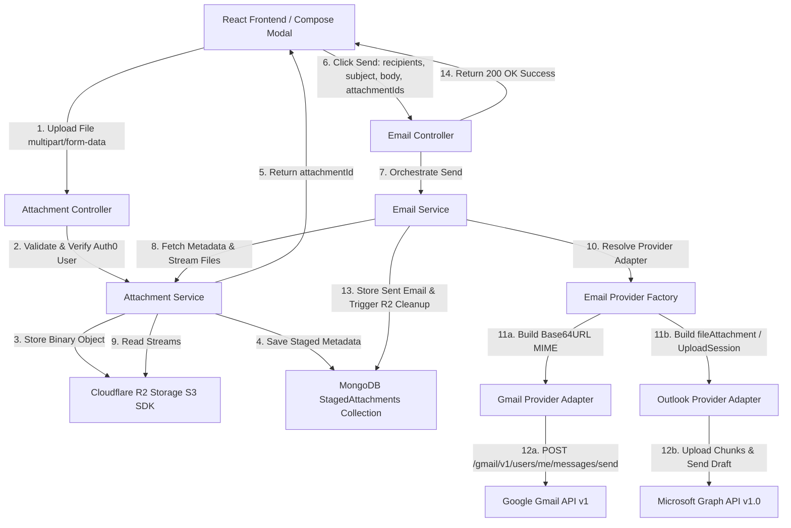
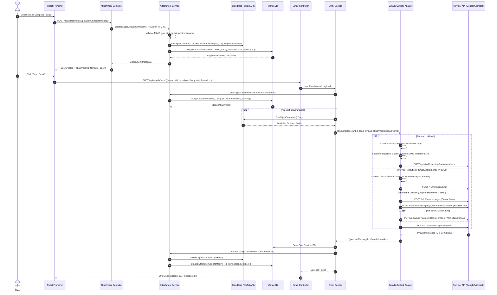

# Email Experience Completion - Phase 2 Attachments Specification

> **Phase:** Phase 2 (Attachments Preview, Download Proxy & Staged Compose Send Engine)
> **Status:** Part 2A (Inbound Preview & Download Proxy) COMPLETED · Part 2B (Outbound Compose & Staging Engine) COMPLETED
> **Last Updated:** 2026-08-18

---

## 1. Overview & System Scope

This document details the complete attachment specification for MailSense across two explicitly segregated functional areas:

1. **PART A: Inbound Email Attachments (Sync, Ingestion, Preview & Authenticated Download Proxy)** — Status: **COMPLETED**
   - Ingestion of attachment metadata during Gmail and Outlook synchronization.
   - On-demand streaming download proxy without raw binary storage in MongoDB.
   - Frontend UI rendering (`AttachmentBadge` paperclip icon in inbox rows, `AttachmentList` preview modal & authenticated blob download).

2. **PART B: Outbound Email Attachments (Compose Staging, Cloudflare R2 & Multi-Provider Send Engine)** — Status: **COMPLETED**
   - Uploading attachment files in Compose modal staged securely to Cloudflare R2 (S3 API).
   - Zero-trust backend validation and metadata tracking in MongoDB `StagedAttachment` collection.
   - Multi-provider outbound payload assembly (Gmail Base64URL MIME message vs. Outlook Graph API direct `fileAttachment` / chunked `createUploadSession`).
   - Post-send object cleanup and TTL expiration lifecycle.

---

## 2. PART A: Inbound Email Attachments (Sync, Preview & Download Proxy) — COMPLETED

### 2.1 Architecture Highlights & Highlights

- **Authenticated Client Download via `axiosClient`:**
  - In `AttachmentList.tsx`, `handleDownload` and `handlePreview` use `axiosClient` from `@shared/api`, automatically forwarding Auth0 Bearer tokens to Backend `NEXT_PUBLIC_API_BASE_URL` (`http://localhost:8020/api/emails/attachment/:emailId/:attId`).
  - Responses are fetched as binary `blob` payloads, generating temporary Blob URLs (`URL.createObjectURL`) for instant browser download and inline modal image preview.
- **Resilient Attachment ID Resolution:**
  - **Gmail Ingestion:** `extractGmailAttachments` in `gmail.utils.ts` extracts `part.body?.attachmentId || part.partId`.
  - **Resilient Fallback Stream Proxy:** In `gmail.service.ts`, `getAttachment` first attempts direct invocation of `GmailApi.getAttachment(accountId, messageId, attachmentId)`. If direct invocation throws (e.g., 404 because `attachmentId` is a `partId` like `"1"`), `getAttachment` automatically fetches message payload details, searches for the part matching `partId` or `attachmentId`, resolves the real Gmail `attachmentId` (or inline `body.data`), and streams the binary payload cleanly.
- **Recursive MIME Body Extraction:**
  - In `gmail.utils.ts`, `parseEmailBody` uses a recursive tree traversal function `traverse(part: GmailMimePart)` to locate `text/plain` and `text/html` parts regardless of MIME nesting depth.
- **On-Demand Streaming:** Attachment binary data is **never** permanently stored in MongoDB or disk. MailSense proxies the raw binary stream directly from provider APIs to the HTTP response stream.
- **Memory Safety:** Streaming chunk-by-chunk enforces strict compliance with the **256MB RAM system limit** even when users download large attachments.

---

### 2.2 Empirical Provider Ingestion Specifications

#### A. Gmail API Ingestion (`GET /gmail/v1/users/me/messages/{id}?format=full`)

When an email includes binary attachments (e.g. `image/jpeg`), Gmail returns a nested MIME tree:

- **Root Payload:** `mimeType: "multipart/mixed"`.
- **`parts[0]` (Body Container):** `mimeType: "multipart/alternative"` containing sub-parts:
  - `parts[0].parts[0]` (`partId: "0.0"`): `mimeType: "text/plain"`, `body.data` (Base64URL encoded text).
  - `parts[0].parts[1]` (`partId: "0.1"`): `mimeType: "text/html"`, `body.data` (Base64URL encoded HTML).
- **`parts[1]` (Attachment Part):** `mimeType: "image/jpeg"`, `filename: "Gy47enZXgAAdNjZ.jpeg"`, `headers` containing `Content-Disposition`, `Content-ID`, `X-Attachment-Id`, and `body: { attachmentId: "ANGjdJ8...", size: 208093 }`.

```json
{
  "id": "19fcdc4ed4f33c9f",
  "threadId": "19fcdc4ed4f33c9f",
  "snippet": "Hi attachment 3",
  "payload": {
    "partId": "",
    "mimeType": "multipart/mixed",
    "filename": "",
    "body": { "size": 0 },
    "parts": [
      {
        "partId": "0",
        "mimeType": "multipart/alternative",
        "filename": "",
        "parts": [
          {
            "partId": "0.0",
            "mimeType": "text/plain",
            "body": { "size": 20, "data": "SGkNCg0KYXR0YWNobWVudCAzDQo=" }
          },
          {
            "partId": "0.1",
            "mimeType": "text/html",
            "body": {
              "size": 63,
              "data": "PGRpdiBkaXI9Imx0ciI-SGk8ZGl2Pjxicj48L2Rpdj48ZGl2PmF0dGFjaG1lbnQgMzwvZGl2PjwvZGl2Pg0K"
            }
          }
        ]
      },
      {
        "partId": "1",
        "mimeType": "image/jpeg",
        "filename": "Gy47enZXgAAdNjZ.jpeg",
        "headers": [
          {
            "name": "Content-Type",
            "value": "image/jpeg; name=\"Gy47enZXgAAdNjZ.jpeg\""
          },
          {
            "name": "Content-Disposition",
            "value": "attachment; filename=\"Gy47enZXgAAdNjZ.jpeg\""
          },
          { "name": "Content-ID", "value": "<f_msex3sgz0>" },
          { "name": "X-Attachment-Id", "value": "f_msex3sgz0" }
        ],
        "body": {
          "attachmentId": "ANGjdJ8xhL_PywVzR44oX...",
          "size": 208093
        }
      }
    ]
  }
}
```

#### B. Microsoft Graph API Ingestion (`GET /v1.0/me/messages/{id}/attachments`)

Returns an array of attachment resource objects:

```json
{
  "@odata.context": "https://graph.microsoft.com/v1.0/$metadata#users(...)/messages(...)/attachments",
  "value": [
    {
      "@odata.type": "#microsoft.graph.fileAttachment",
      "@odata.mediaContentType": "image/jpeg",
      "id": "AQMkADAwATM3ZmYAZS02YWNmLWU5MTAtMDACLTAwCgBGAAADW3BXYNNZ2EeaRZZ9naXgnwc...",
      "lastModifiedDateTime": "2026-08-06T14:59:23Z",
      "name": "Brought the G to the Q (1).jpg",
      "contentType": "image/jpeg",
      "size": 102147,
      "isInline": false,
      "contentId": "f_mshn5tl40"
    }
  ]
}
```

---

### 2.3 Part A Implementation Code Steps

#### Step A.1: Shared Types & Database Model (`Backend/src/modules/emails/email.model.ts`)

```typescript
// Attachment Metadata Schema inside Email Document
export const AttachmentSchema = new Schema<EmailAttachment>(
    {
        attachmentId: { type: String, required: true },
        filename: { type: String, required: true },
        mimeType: { type: String, required: true },
        size: { type: Number, required: true },
        contentId: { type: String, required: false },
        isInline: { type: Boolean, default: false },
    },
    { _id: false },
);

// EmailSchema fields & sparse index definition
attachments: { type: [AttachmentSchema], default: [] },
EmailSchema.index({ accountId: 1, 'attachments.0': 1 }, { sparse: true });
```

#### Step A.2: Gmail Recursive MIME Body Traversal & Attachment Extraction (`Backend/src/integrations/gmail/gmail.utils.ts`)

```typescript
export const extractGmailAttachments = (
  messagePayload: GmailMessagePayload,
): EmailAttachment[] => {
  const attachments: EmailAttachment[] = [];

  const traverse = (part: GmailMessagePayload) => {
    if (part.filename && part.filename.length > 0 && part.body) {
      const attachmentId = part.body.attachmentId || part.partId || "";
      attachments.push({
        attachmentId,
        filename: part.filename,
        mimeType: part.mimeType || "application/octet-stream",
        size: part.body.size || 0,
        isInline: Boolean(
          part.headers?.some(
            (h) =>
              h.name.toLowerCase() === "content-disposition" &&
              h.value.toLowerCase().includes("inline"),
          ),
        ),
        contentId: part.headers?.find(
          (h) => h.name.toLowerCase() === "content-id",
        )?.value,
      });
    }
    if (part.parts) {
      part.parts.forEach(traverse);
    }
  };

  if (messagePayload) {
    traverse(messagePayload);
  }
  return attachments;
};
```

#### Step A.3: Microsoft Graph API Attachment Extraction (`Backend/src/integrations/outlook/outlook.utils.ts`)

```typescript
export const extractOutlookAttachments = (
  attachments: import("@mailsense/types").OutlookAttachmentObject[] = [],
): import("@mailsense/types").EmailAttachment[] => {
  return (attachments || []).map((att) => ({
    attachmentId: att.id || "",
    filename: att.name || "attachment",
    mimeType:
      att.contentType ||
      att["@odata.mediaContentType"] ||
      "application/octet-stream",
    size: att.size || 0,
    contentId: att.contentId || undefined,
    isInline: att.isInline || false,
  }));
};
```

#### Step A.4: Fallback Attachment Stream Proxy (`Backend/src/integrations/gmail/gmail.service.ts`)

```typescript
public async getAttachment(
    accountId: string,
    messageId: string,
    attachmentId: string,
): Promise<{ data: Buffer; mimeType: string; filename: string }> {
    try {
        return await GmailApi.getAttachment(accountId, messageId, attachmentId);
    } catch (err) {
        logger.warn(`Direct GmailApi.getAttachment failed for ${attachmentId}, attempting fallback resolution: ${err}`);
        const message = await GmailApi.fetchEmailById(messageId, accountId);
        let targetPart: Record<string, unknown> | null = null;

        const findPart = (parts: Record<string, unknown>[] | undefined) => {
            if (!parts) return;
            for (const part of parts) {
                const body = part.body as { attachmentId?: string; data?: string } | undefined;
                if (body?.attachmentId === attachmentId || part.partId === attachmentId) {
                    targetPart = part;
                    return;
                }
                if (Array.isArray(part.parts)) findPart(part.parts as Record<string, unknown>[]);
            }
        };

        if (message.payload?.parts) {
            findPart(message.payload.parts as unknown as Record<string, unknown>[]);
        }

        const targetBody = (targetPart as Record<string, unknown> | null)?.body as { attachmentId?: string; data?: string } | undefined;
        if (targetBody?.attachmentId) {
            return await GmailApi.getAttachment(accountId, messageId, targetBody.attachmentId);
        }
        if (targetBody?.data) {
            const data = Buffer.from(targetBody.data, 'base64url');
            return {
                data,
                mimeType: ((targetPart as Record<string, unknown> | null)?.mimeType as string) || 'application/octet-stream',
                filename: ((targetPart as Record<string, unknown> | null)?.filename as string) || 'attachment',
            };
        }
        throw err;
    }
}
```

#### Step A.5: Authenticated Proxy API Handler (`Backend/src/modules/emails/email.controller.ts` & `email.routes.ts`)

```typescript
// Route definition in email.routes.ts
router.get('/attachment/:emailId/:attachmentId', authenticate, validate(downloadAttachmentSchema), emailController.downloadAttachment);

// Controller handler in email.controller.ts
public downloadAttachment = async (
    req: Request<{ emailId: string; attachmentId: string }>,
    res: Response,
    next: NextFunction,
): Promise<void> => {
    try {
        const { emailId, attachmentId } = req.params;
        if (!emailId || !attachmentId) {
            throw new Error('Email ID and Attachment ID are required');
        }
        const attachment = await this.emailService.downloadAttachment(emailId, attachmentId);
        res.setHeader('Content-Type', attachment.mimeType);
        res.setHeader('Content-Disposition', `attachment; filename="${attachment.filename}"`);
        res.send(attachment.data);
    } catch (error) {
        next(error);
    }
};
```

#### Step A.6: Frontend UI Components (`Frontend/src/features/emails/components/`)

- **`AttachmentBadge.tsx`:**
  Renders paperclip icon (`h-3 w-3`) with attachment count badge on `EmailListTable` rows when `email.attachments?.length > 0`.
- **`AttachmentList.tsx`:**
  Renders attachment chips below email content in `ThreadView` and `EmailPage`. Uses `axiosClient` with `responseType: 'blob'` for secure downloading and inline image preview modal.

---

### 2.4 Part A Verification Checklist

- [x] Click Download on attachment $\rightarrow$ verify request routes via `axiosClient` with Bearer auth token to Backend API (`http://localhost:8020/api/emails/attachment/...`) and file downloads cleanly.
- [x] Click Eye icon on image attachment $\rightarrow$ verify inline modal opens image preview cleanly.
- [x] Sync Gmail account with incoming emails containing attachments $\rightarrow$ verify `bodyHtml` and `bodyPlain` are non-empty.
- [x] Sync Outlook account with `hasAttachments: true` $\rightarrow$ verify attachments are fetched via `getMessageAttachments` Graph API and stored in DB.

---

## 3. PART B: Outbound Email Attachments (Compose Staging & Multi-Provider Send Engine) — COMPLETED

### 3.1 Overview & System Architecture

Part B covers the end-to-end design for **uploading attachments during email compose** and dispatching them through Gmail API and Microsoft Graph API, utilizing **Cloudflare R2** (S3-compatible object storage) as temporary staging storage.



---

### 3.2 End-to-End Outbound Sequence Diagram



---

### 3.3 Outbound API Contracts

#### A. Upload Attachment Endpoint

`POST /api/attachments/upload` (`multipart/form-data`)

- **Response `201 Created`:** `{ success: true, attachment: { attachmentId, filename, mimeType, size } }`

#### B. Delete Staged Attachment Endpoint

`DELETE /api/attachments/:attachmentId`

- **Response `200 OK`:** `{ success: true, message: "Staged attachment removed" }`

#### C. Compose & Send Email Endpoint

`POST /api/emails/send`

- **Body:** `{ accountId, to, cc, bcc, subject, body, attachmentIds: string[] }`
- **Response `200 OK`:** `{ success: true, data: { messageId, sentAt } }`

---

### 3.5 Part B Implementation Code Steps

#### Step B.1: Cloudflare R2 S3 Client Service (`Backend/src/integrations/storage/cloud-storage.service.ts`)

```typescript
import {
  DeleteObjectCommand,
  GetObjectCommand,
  PutObjectCommand,
  S3Client,
} from "@aws-sdk/client-s3";
import { Readable } from "stream";

export class CloudStorageService {
  private client: S3Client;
  private bucketName: string;

  constructor() {
    this.bucketName =
      process.env.R2_BUCKET_NAME || "mailsense-attachments-staging";
    this.client = new S3Client({
      region: "auto",
      endpoint: `https://${process.env.CLOUDFLARE_ACCOUNT_ID}.r2.cloudflarestorage.com`,
      credentials: {
        accessKeyId: process.env.R2_ACCESS_KEY_ID || "",
        secretAccessKey: process.env.R2_SECRET_ACCESS_KEY || "",
      },
    });
  }

  async uploadObject(
    r2Key: string,
    body: Buffer | Readable,
    mimeType: string,
  ): Promise<void> {
    const command = new PutObjectCommand({
      Bucket: this.bucketName,
      Key: r2Key,
      Body: body,
      ContentType: mimeType,
    });
    await this.client.send(command);
  }

  async getObjectStream(
    r2Key: string,
  ): Promise<{ stream: Readable; contentLength?: number }> {
    const command = new GetObjectCommand({
      Bucket: this.bucketName,
      Key: r2Key,
    });
    const response = await this.client.send(command);
    return {
      stream: response.Body as Readable,
      contentLength: response.ContentLength,
    };
  }

  async deleteObject(r2Key: string): Promise<void> {
    const command = new DeleteObjectCommand({
      Bucket: this.bucketName,
      Key: r2Key,
    });
    await this.client.send(command);
  }
}
```

#### Step B.2: MongoDB `StagedAttachment` Model (`Backend/src/modules/attachments/attachment.model.ts`)

```typescript
import { Schema, model, Document } from "mongoose";

export interface IStagedAttachment extends Document {
  _id: string;
  userId: string;
  accountId: string;
  r2Key: string;
  filename: string;
  mimeType: string;
  size: number;
  isInline: boolean;
  contentId?: string;
  status: "STAGED" | "ATTACHED" | "EXPIRED";
  expiresAt: Date;
  createdAt: Date;
}

export const StagedAttachmentSchema = new Schema<IStagedAttachment>(
  {
    userId: { type: String, required: true, index: true },
    accountId: { type: String, required: true },
    r2Key: { type: String, required: true, unique: true },
    filename: { type: String, required: true },
    mimeType: { type: String, required: true },
    size: { type: Number, required: true },
    isInline: { type: Boolean, default: false },
    contentId: { type: String },
    status: {
      type: String,
      enum: ["STAGED", "ATTACHED", "EXPIRED"],
      default: "STAGED",
    },
    expiresAt: { type: Date, required: true, index: { expires: 0 } }, // 24h TTL index auto-purge
  },
  { timestamps: true },
);

export const StagedAttachmentModel = model<IStagedAttachment>(
  "StagedAttachment",
  StagedAttachmentSchema,
);
```

#### Step B.3: Attachment Staging Service (`Backend/src/modules/attachments/attachment.service.ts`)

```typescript
import mongoose from "mongoose";
import { CloudStorageService } from "../../integrations/storage/cloud-storage.service.js";
import {
  IStagedAttachment,
  StagedAttachmentModel,
} from "./attachment.model.js";

export class AttachmentService {
  private storageService: CloudStorageService;

  constructor() {
    this.storageService = new CloudStorageService();
  }

  async uploadStagedAttachment(
    userId: string,
    accountId: string,
    file: {
      buffer: Buffer;
      originalname: string;
      mimetype: string;
      size: number;
    },
  ): Promise<IStagedAttachment> {
    const attachmentId = new mongoose.Types.ObjectId().toString();
    const sanitizedFilename = file.originalname.replace(
      /[^a-zA-Z0-9_.-]/g,
      "_",
    );
    const r2Key = `staged/${userId}/${attachmentId}-${sanitizedFilename}`;
    const expiresAt = new Date(Date.now() + 24 * 60 * 60 * 1000); // 24 hours TTL

    await this.storageService.uploadObject(r2Key, file.buffer, file.mimetype);

    const staged = await StagedAttachmentModel.create({
      _id: attachmentId,
      userId,
      accountId,
      r2Key,
      filename: sanitizedFilename,
      mimeType: file.mimetype,
      size: file.size,
      expiresAt,
    });

    return staged;
  }

  async getStagedAttachmentWithStream(userId: string, attachmentId: string) {
    const staged = await StagedAttachmentModel.findOne({
      _id: attachmentId,
      userId,
    });
    if (!staged) {
      throw new Error(
        `Staged attachment ${attachmentId} not found or unauthorized`,
      );
    }
    const { stream } = await this.storageService.getObjectStream(staged.r2Key);
    return { staged, stream };
  }

  async cleanupStagedAttachments(attachmentIds: string[]): Promise<void> {
    const stagedItems = await StagedAttachmentModel.find({
      _id: { $in: attachmentIds },
    });
    for (const item of stagedItems) {
      await this.storageService.deleteObject(item.r2Key).catch(() => null);
    }
    await StagedAttachmentModel.deleteMany({ _id: { $in: attachmentIds } });
  }
}
```

#### Step B.4: Attachments Controller & Routes (`Backend/src/modules/attachments/`)

```typescript
// attachment.controller.ts
export class AttachmentsController {
    private attachmentsService: AttachmentsService;

    constructor() {
        this.attachmentsService = new AttachmentsService();
    }

    public uploadStagedAttachment = async (req: Request, res: Response, next: NextFunction): Promise<void> => {
        try {
            const userId = req.user?.id;
            if (!userId) throw new Error('User ID is required');
            const { accountId } = req.body;
            if (!accountId) throw new Error('Account ID is required');
            const file = req.file;
            if (!file) throw new Error('File is required');
            const uploadStagedAttachment = await this.attachmentsService.uploadStagedAttachment(userId, accountId, file);
            res.status(201).send({
                success: true,
                attachment: {
                    attachmentId: String(uploadStagedAttachment._id),
                    filename: uploadStagedAttachment.filename,
                    mimeType: uploadStagedAttachment.mimeType,
                    size: uploadStagedAttachment.size,
                    createdAt: uploadStagedAttachment.createdAt,
                },
            });
        } catch (err) {
            next(err);
        }
    };

    public deleteStagedAttachment = async (req: Request<{ attachmentId: string }>, res: Response, next: NextFunction): Promise<void> => {
        try {
            const { attachmentId } = req.params;
            if (!attachmentId) throw new Error('Attachment ID is required');
            await this.attachmentsService.deleteStagedAttachment(attachmentId);
            res.status(200).send({ success: true, message: 'Staged attachment deleted successfully' });
        } catch (err) {
            next(err);
        }
    };
}

// attachment.routes.ts
const router = Router();
const attachmentController = new AttachmentsController();

const upload = multer({
    limits: { fileSize: 25 * 1024 * 1024 }, // 25MB limit
    fileFilter: (req, file, cb) => {
        const forbiddenExts = ['.exe', '.bat', '.sh', '.vbs', '.js', '.jar'];
        const isForbidden = forbiddenExts.some((ext) => file.originalname.toLowerCase().endsWith(ext));
        if (isForbidden) return cb(new Error('File extension forbidden for security'));
        cb(null, true);
    },
});

router.post('/upload', upload.single('file'), handleRequest(attachmentController.uploadStagedAttachment));
router.delete('/:attachmentId', handleRequest(attachmentController.deleteStagedAttachment));

export default router;
```

#### Step B.5: Gmail Outbound Base64URL MIME Message Builder (`gmail.utils.ts` & `gmail.service.ts`)

```typescript
// gmail.utils.ts
export const constructGmailMimeMessage = (
    to: string[],
    subject: string,
    body: string,
    attachments: { filename: string; mimeType: string; buffer: Buffer }[],
): string => {
    const boundary = `====_MailSense_Boundary_${Date.now()}====`;
    const messageParts: string[] = [];

    messageParts.push(`To: ${to.join(', ')}`);
    messageParts.push(`Subject: ${subject}`);
    messageParts.push(`MIME-Version: 1.0`);
    messageParts.push(`Content-Type: multipart/mixed; boundary="${boundary}"\r\n`);

    // Body Subpart
    messageParts.push(`--${boundary}`);
    messageParts.push(`Content-Type: text/html; charset="UTF-8"`);
    messageParts.push(`Content-Transfer-Encoding: 7bit\r\n`);
    messageParts.push(body);

    // Attachment Subparts
    for (const att of attachments) {
        messageParts.push(`--${boundary}`);
        messageParts.push(`Content-Type: ${att.mimeType}; name="${att.filename}"`);
        messageParts.push(`Content-Disposition: attachment; filename="${att.filename}"`);
        messageParts.push(`Content-Transfer-Encoding: base64\r\n`);
        messageParts.push(att.buffer.toString('base64'));
    }

    messageParts.push(`--${boundary}--`);
    const rawMime = messageParts.join('\r\n');
    return Buffer.from(rawMime)
        .toString('base64')
        .replace(/\+/g, '-')
        .replace(/\//g, '_')
        .replace(/=+$/, '');
};

// gmail.service.ts
async sendMessage(composeEmailData: ComposeEmailBody): Promise<Partial<GmailMessageObjectFull>> {
    try {
        const { accountId, to, subject, body, attachments } = composeEmailData;
        const raw =
            attachments && attachments.length > 0
                ? GmailUtils.constructGmailMimeMessage(to, subject, body, attachments)
                : GmailUtils.buildGmailRawString(to, subject, body);
        const response = await GmailApi.sendMessage(accountId, { raw });
        const emailDetails = await GmailApi.fetchEmailById(response.id, accountId);
        const emilData = this.transformGmailMessageToEmailInput(emailDetails, accountId);
        await EmailRepository.upsertEmailsInBulk([emilData]);
        return response;
    } catch (err) {
        const errorMessage = err instanceof Error ? err.message : String(err);
        logger.error(`Error in GmailService.sendMessage: ${errorMessage}`, { error: err });
        throw new AxiosApiError(err);
    }
}
```

#### Step B.6: Microsoft Graph API SendMail Strategy (`outlook.service.ts` & `outlook.utils.ts`)

```typescript
// outlook.service.ts
async sendMail(composeEmailData: ComposeEmailBody): Promise<OutlookMessageObjectFull> {
    try {
        const { accountId, to, subject, body, attachments } = composeEmailData;
        const totalAttachmentSize = (attachments || []).reduce((sum, att) => sum + att.buffer.length, 0);
        const MAX_DIRECT_SIZE = 3 * 1024 * 1024; // 3MB threshold for Microsoft Graph API direct inline attachment

        if (!attachments || attachments.length === 0 || totalAttachmentSize <= MAX_DIRECT_SIZE) {
            // Strategy 1: Direct Inline Attachment Send (<= 3MB)
            let fileAttachments: OutlookAttachmentObject[] | undefined;
            if (attachments && attachments.length > 0) {
                fileAttachments = attachments.map((att) => ({
                    '@odata.type': '#microsoft.graph.fileAttachment',
                    name: att.filename,
                    contentType: att.mimeType,
                    contentBytes: att.buffer.toString('base64'),
                }));
            }
            const messageBody = OutlookUtils.buildOutlookMessagePayload(to, subject, body, 'HTML', fileAttachments);
            const draft = await OutlookApi.createDraftMessage(accountId, messageBody);
            await OutlookApi.sendDraftMessage(accountId, draft.id);
            const emailDetails = await OutlookApi.getMessageDetails(accountId, draft.id);
            const emailData = await this.parseEmailDetailsIntoPlainObject(accountId, emailDetails);
            await EmailRepository.upsertEmailsInBulk([emailData]);
            return draft;
        } else {
            // Strategy 2: Draft Creation + Chunked Upload Session for Large Attachments (> 3MB)
            const smallAttachments: OutlookAttachmentObject[] = [];
            const largeAttachments: { filename: string; mimeType: string; buffer: Buffer }[] = [];

            for (const att of attachments) {
                if (att.buffer.length <= MAX_DIRECT_SIZE) {
                    smallAttachments.push({
                        '@odata.type': '#microsoft.graph.fileAttachment',
                        name: att.filename,
                        contentType: att.mimeType,
                        contentBytes: att.buffer.toString('base64'),
                    });
                } else {
                    largeAttachments.push(att);
                }
            }

            // Create draft message with small attachments inline
            const messageBody = OutlookUtils.buildOutlookMessagePayload(to, subject, body, 'HTML', smallAttachments.length > 0 ? smallAttachments : undefined);
            const draft = await OutlookApi.createDraftMessage(accountId, messageBody);

            // Upload large attachments via Microsoft Graph upload sessions (3.2MB chunks)
            for (const att of largeAttachments) {
                const session = await OutlookApi.createUploadSession(accountId, draft.id, att.filename, att.buffer.length);
                const chunkSize = 320 * 1024 * 10; // 3.2MB chunks (multiple of 320 KiB)
                for (let start = 0; start < att.buffer.length; start += chunkSize) {
                    const chunk = att.buffer.subarray(start, start + chunkSize);
                    await OutlookApi.uploadChunk(session.uploadUrl, chunk, start, att.buffer.length);
                }
            }

            // Dispatch sent email draft & store email with extracted attachments
            return await this.finalizeSentOutlookDraft(accountId, draft);
        }
    } catch (err) {
        const errorMessage = err instanceof Error ? err.message : String(err);
        logger.error(`Error in OutlookService.sendMail: ${errorMessage}`, { error: err });
        throw err;
    }
}

private async finalizeSentOutlookDraft(accountId: string, draft: OutlookMessageObjectFull): Promise<OutlookMessageObjectFull> {
    await OutlookApi.sendDraftMessage(accountId, draft.id);

    // OutlookApi.getMessageDetails includes $expand=attachments query param
    const emailDetails = await OutlookApi.getMessageDetails(accountId, draft.id);
    const emailData = await this.parseEmailDetailsIntoPlainObject(accountId, emailDetails);

    await EmailRepository.upsertEmailsInBulk([emailData]);

    return draft;
}
```

#### Step B.7: Email Service Outbound Orchestration (`Backend/src/modules/emails/email.service.ts`)

```typescript
public async composeEmailWithAttachments(userId: string, reqBody: ComposeEmailBody): Promise<SuccessAPIResponse> {
    const { accountId, to, subject, body, attachmentIds } = reqBody;

    // 1. Resolve staged attachment files & streams from Cloudflare R2
    const stagedFiles: { filename: string; mimeType: string; buffer: Buffer }[] = [];
    if (attachmentIds && attachmentIds.length > 0) {
        for (const attId of attachmentIds) {
            const { staged, stream } = await this.attachmentService.getStagedAttachmentWithStream(userId, attId);
            const chunks: Buffer[] = [];
            for await (const chunk of stream) {
                chunks.push(Buffer.from(chunk));
            }
            stagedFiles.push({
                filename: staged.filename,
                mimeType: staged.mimeType,
                buffer: Buffer.concat(chunks),
            });
        }
    }

    // 2. Resolve Provider Adapter & Dispatch
    const account = await AccountRepository.getAccountById(accountId);
    if (!account) throw new Error('Account not found');

    const provider = EmailProviderFactory.getProvider(account.provider);
    await provider.sendMail({ ...reqBody, attachments: stagedFiles });

    // 3. Asynchronous post-send cleanup of R2 objects & MongoDB staging records
    if (attachmentIds && attachmentIds.length > 0) {
        this.attachmentService.cleanupStagedAttachments(attachmentIds).catch((err) => {
            logger.error(`Error cleaning up staged attachments post-send: ${err}`);
        });
    }

    return { status: true, message: 'Email composed and sent successfully' };
}
```

#### Step B.8: Frontend Compose Attachment Integration (`useComposeEmail.ts`, `ComposeEmailFooter.tsx`, and `index.tsx`)

In MailSense, the compose email interface is modularized across `useComposeEmail.ts`, `ComposeEmailFooter.tsx`, and `index.tsx` in `Frontend/src/features/emails/components/composeEmail/`.

##### 1. Hook Extension (`Frontend/src/features/emails/hooks/useComposeEmail.ts`)

```typescript
import { useCallback, useEffect, useState } from 'react';
import { axiosClient } from '@shared/api/axiosClient';
import { UploadAttachmentResponse, ComposeEmailRequestBody } from '@mailsense/types';
import { toast } from 'sonner';

export const useComposeEmail = () => {
    // ... existing store & mutation hooks ...
    const [stagedAttachments, setStagedAttachments] = useState<UploadAttachmentResponse['attachment'][]>([]);
    const [isUploadingAttachment, setIsUploadingAttachment] = useState<boolean>(false);

    const handleFileUpload = async (event: React.ChangeEvent<HTMLInputElement>) => {
        const files = event.target.files;
        if (!files || files.length === 0) return;
        if (!composeEmailBody.accountId) {
            toast.error('Please select a sender account first');
            return;
        }

        setIsUploadingAttachment(true);
        try {
            for (let i = 0; i < files.length; i++) {
                const formData = new FormData();
                formData.append('file', files[i]);
                formData.append('accountId', composeEmailBody.accountId);

                const res = await axiosClient.post<UploadAttachmentResponse>('/attachments/upload', formData, {
                    headers: { 'Content-Type': 'multipart/form-data' },
                });

                if (res.data.success) {
                    setStagedAttachments((prev) => [...prev, res.data.attachment]);
                }
            }
        } catch (err) {
            toast.error('Failed to upload attachment');
        } finally {
            setIsUploadingAttachment(false);
            event.target.value = ''; // reset file input
        }
    };

    const handleRemoveStagedAttachment = async (attachmentId: string) => {
        try {
            await axiosClient.delete(`/attachments/${attachmentId}`);
            setStagedAttachments((prev) => prev.filter((att) => att.attachmentId !== attachmentId));
        } catch (err) {
            setStagedAttachments((prev) => prev.filter((att) => att.attachmentId !== attachmentId));
        }
    };

    const sendEmail = async () => {
        composeEmail({
            accountId: composeEmailBody.accountId,
            to: composeEmailBody.to,
            subject: composeEmailBody.subject,
            body: composeEmailBody.body,
            attachmentIds: stagedAttachments.map((att) => att.attachmentId),
        });
    };

    // Reset staged attachments on modal close
    const handleClose = useCallback(() => {
        closeCompose();
        setComposeEmailBody({ accountId: '', to: [], subject: '', body: '' });
        setStagedAttachments([]);
        setToEmailSearchText('');
    }, [closeCompose]);

    return {
        // ...
        states: { ..., stagedAttachments, isUploadingAttachment },
        action: { handleClose, sendEmail, handleFileUpload, handleRemoveStagedAttachment },
    };
};
```

##### 2. Upload Button & File Input (`Frontend/src/features/emails/components/composeEmail/ComposeEmailFooter.tsx`)

```tsx
import React, { useRef } from 'react';
import { Paperclip, Loader2, Trash2 } from 'lucide-react';
import { Button } from '@shared/ui/button';

interface ComposeEmailFooterProps {
    accountsData: AccountAttributes[];
    composeEmailBody: ComposeEmailRequestBody;
    setComposeEmailBody: (body: ComposeEmailRequestBody) => void;
    sendEmail: () => Promise<void>;
    handleClose: () => void;
    isUploadingAttachment: boolean;
    handleFileUpload: (event: React.ChangeEvent<HTMLInputElement>) => Promise<void>;
}

const ComposeEmailFooter: React.FC<ComposeEmailFooterProps> = ({
    accountsData,
    composeEmailBody,
    setComposeEmailBody,
    sendEmail,
    handleClose,
    isUploadingAttachment,
    handleFileUpload,
}) => {
    const fileInputRef = useRef<HTMLInputElement | null>(null);

    const handlePaperclipClick = () => {
        if (!composeEmailBody?.accountId && accountsData && accountsData.length > 0) {
            setComposeEmailBody({ ...composeEmailBody, accountId: accountsData[0]._id });
        }
        fileInputRef.current?.click();
    };

    return (
        <div className="flex items-center justify-between md:p-2">
            <div className="flex w-full items-center">
                {/* Account selector dropdown */}
                <Select value={composeEmailBody?.accountId || ''} onValueChange={(val) => setComposeEmailBody({ ...composeEmailBody, accountId: val })}>
                    {/* Select Items */}
                </Select>

                {/* Send Button */}
                <Button className="cursor-pointer rounded-lg px-6 font-bold" onClick={sendEmail} disabled={isUploadingAttachment}>
                    Send
                </Button>

                {/* Hidden File Input & Paperclip Button */}
                <input type="file" ref={fileInputRef} className="hidden" multiple onChange={handleFileUpload} />
                <Button
                    type="button"
                    variant="ghost"
                    size="icon"
                    className="ml-2 cursor-pointer"
                    onClick={handlePaperclipClick}
                    disabled={isUploadingAttachment}
                >
                    {isUploadingAttachment ? <Loader2 className="size-4 animate-spin" /> : <Paperclip className="size-4" />}
                </Button>
            </div>
            <Trash2 className="size-4 cursor-pointer" onClick={handleClose} />
        </div>
    );
};
```

##### 3. Staged Attachment Chips Rendering (`Frontend/src/features/emails/components/composeEmail/index.tsx`)

```tsx
{/* Render Staged Attachment Chips above footer */}
{stagedAttachments && stagedAttachments.length > 0 && (
    <div className="flex flex-wrap gap-2 border-t border-border bg-sidebar/50 px-3 py-2">
        {stagedAttachments.map((att) => (
            <div key={att.attachmentId} className="bg-secondary text-secondary-foreground flex items-center gap-1.5 rounded-md px-2.5 py-1 text-xs font-medium">
                <Paperclip className="text-muted-foreground size-3" />
                <span className="max-w-[150px] truncate">{att.filename}</span>
                <span className="text-muted-foreground text-[10px]">({(att.size / 1024).toFixed(1)} KB)</span>
                <X className="hover:text-destructive size-3 cursor-pointer" onClick={() => handleRemoveStagedAttachment(att.attachmentId)} />
            </div>
        ))}
    </div>
)}
```

---

### 3.7 Part B Verification Checklist

- [x] Click paperclip icon in Compose modal → launch OS file selector and upload file to `POST /api/attachments/upload`.
- [x] Verify file streams to Cloudflare R2 bucket (`mailsense-attachments-staging`) and staged metadata is created in MongoDB (`StagedAttachment`).
- [x] Verify staged attachment chips display filename, formatted file size, and deletion button in Compose modal.
- [x] Click `X` icon on chip → execute `DELETE /api/attachments/:attachmentId` and remove from Cloudflare R2 & local UI state.
- [x] Compose email with attachments via Gmail account → verify MIME Base64URL string constructed and email sent with attachments.
- [x] Compose email with attachments via Outlook account ($\le$ 3MB direct inline / > 3MB chunked upload session) → verify Graph API send succeeds and sent message with expanded attachments is stored in MongoDB.
- [x] Verify post-send async cleanup purges R2 objects and MongoDB staging records.

---

### 3.8 Part B Future Enhancements

1. Inline image CID embedding (``).
2. React dropzone drag-and-drop with percentage upload progress.
3. Auto-save compose drafts linked to staged R2 attachments.
4. Asynchronous malware/virus scanning hook before provider dispatch.
