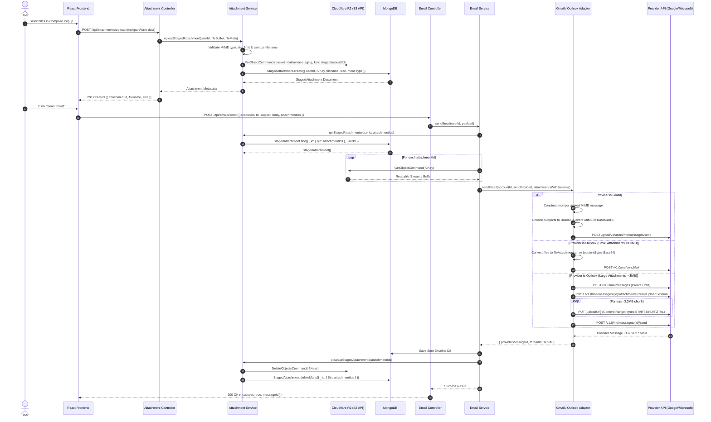

# Email Experience Completion - Phase 2 Implementation Plan

> **Phase:** Phase 2 (Attachments Preview & Download Proxy)
> **Status:** COMPLETED
> **Last Updated:** 2026-08-07

---

## Goal Description

Implement complete email attachment support across ingestion, database, provider abstraction (`IEmailProvider`), provider adapters (`GmailProvider`, `OutlookProvider`), proxy API, and UI layers. Previously, email attachments were discarded during synchronization, preventing users from viewing attachment indicators or downloading files attached to emails. Furthermore, emails containing attachments failed to populate `bodyPlain` and `bodyHtml` during sync due to non-recursive MIME part traversal, and attachment download requests failed with 404 error when frontend relative links hit Next.js port 3000 without Auth0 headers instead of Backend Express server.

This phase uses `@mailsense/types` `v1.2.0` (`EmailAttachment`, `OutlookAttachmentObject`, `EmailAttributes.attachments`, `EmailListDTO.attachmentCount`), extends `EmailModel` with attachment metadata (`attachmentId`, `filename`, `mimeType`, `size`, `contentId`, `isInline`), updates `IEmailProvider`, `GmailProvider`, `OutlookProvider`, `GmailService`, `GmailClient`, `OutlookService`, `OutlookApi`, `gmail.utils.ts`, and `outlook.utils.ts` to extract attachment metadata during ingestion (including Microsoft Graph API `hasAttachments` fetching via `OutlookApi.getMessageAttachments`), fixes `GmailUtils.parseEmailBody` to recursively traverse nested MIME structures (e.g. `multipart/mixed` $\rightarrow$ `multipart/related` $\rightarrow$ `multipart/alternative`), implements resilient fallback resolution in `GmailService.getAttachment` to resolve both long Gmail `attachmentId` strings and legacy MIME `partId` values, implements an on-demand authenticated streaming attachment download proxy via `axiosClient` (`GET /api/emails/attachment/:emailId/:attachmentId`), updates `compression.ts` with safe empty-string guards, updates `getMessageDetails` across `IEmailProvider` implementations to support `dbEmail` hydration with automated fallback attachment retrieval, builds frontend attachment components (`AttachmentBadge` and `AttachmentList`), and integrates attachment UI rendering across `EmailListTable` (inbox/folder email list rows), `ThreadViewHeaderBar` (collapsed thread item header), `ThreadView` (expanded conversation message detail view), and `EmailPage` (single email view).

---

## User Review Required

> [!IMPORTANT]
> **Authenticated Stream Proxy & Attachment Download Architecture**
>
> - **Authenticated Client Download via `axiosClient`:**
>   - Relative `<a href="/api/...">` links hit Next.js port 3000 where backend API handlers do not exist, causing Next.js to return 404 "File wasn't available on site". Furthermore, plain link navigation omits Auth0 `Authorization: Bearer` headers.
>   - In `AttachmentList.tsx`, `handleDownload` and `handlePreview` use `axiosClient` from `@shared/api`, automatically forwarding Auth0 Bearer tokens to Backend `NEXT_PUBLIC_API_BASE_URL` (`http://localhost:8020/api/emails/attachment/:emailId/:attId`).
>   - Responses are fetched as binary `blob` payloads, generating temporary Blob URLs (`URL.createObjectURL`) for instant browser download and inline modal image preview.
> - **Resilient Attachment ID Resolution:**
>   - **Gmail Ingestion:** `extractGmailAttachments` in `gmail.utils.ts` extracts `part.body?.attachmentId || part.partId`.
>   - **Resilient Fallback Stream Proxy:** In `gmail.service.ts`, `getAttachment` first attempts direct invocation of `GmailApi.getAttachment(accountId, messageId, attachmentId)`. If direct invocation throws (e.g., 404 because `attachmentId` is a `partId` like `"1"`), `getAttachment` automatically fetches message payload details, searches for the part matching `partId` or `attachmentId`, resolves the real Gmail `attachmentId` (or inline `body.data`), and streams the binary payload cleanly.
> - **Recursive MIME Body Extraction:**
>   - In `gmail.utils.ts`, `parseEmailBody` uses a recursive tree traversal function `traverse(part: GmailMimePart)` to locate `text/plain` and `text/html` parts regardless of MIME nesting depth.
> - **On-Demand Streaming:** Attachment binary data is **never** permanently stored in MongoDB or disk. MailSense proxies the raw binary stream directly from provider APIs to the HTTP response stream.
> - **Memory Safety:** Streaming chunk-by-chunk enforces strict compliance with the **256MB RAM system limit** even when users download large attachments.

---

## Empirical Gmail API Research & Payload Specifications

### 1. Gmail Message Endpoint: `GET /gmail/v1/users/me/messages/{id}?format=full`

#### A. Response With Attachments (`multipart/mixed`)
When an email includes binary attachments (e.g. `image/jpeg`), Gmail returns a nested MIME tree:
- **Root Payload:** `mimeType: "multipart/mixed"`.
- **`parts[0]` (Body Container):** `mimeType: "multipart/alternative"` containing sub-parts:
  - `parts[0].parts[0]` (`partId: "0.0"`): `mimeType: "text/plain"`, `body.data` (Base64URL encoded text).
  - `parts[0].parts[1]` (`partId: "0.1"`): `mimeType: "text/html"`, `body.data` (Base64URL encoded HTML).
- **`parts[1]` (Attachment Part):** `mimeType: "image/jpeg"`, `filename: "Gy47enZXgAAdNjZ.jpeg"`, `headers` containing `Content-Disposition`, `Content-ID`, `X-Attachment-Id`, and `body: { attachmentId: "ANGjdJ8...", size: 208093 }`.

```json
{
    "id": "19fcdc4ed4f33c9f",
    "threadId": "19fcdc4ed4f33c9f",
    "snippet": "Hi attachment 3",
    "payload": {
        "partId": "",
        "mimeType": "multipart/mixed",
        "filename": "",
        "body": { "size": 0 },
        "parts": [
            {
                "partId": "0",
                "mimeType": "multipart/alternative",
                "filename": "",
                "parts": [
                    { "partId": "0.0", "mimeType": "text/plain", "body": { "size": 20, "data": "SGkNCg0KYXR0YWNobWVudCAzDQo=" } },
                    { "partId": "0.1", "mimeType": "text/html", "body": { "size": 63, "data": "PGRpdiBkaXI9Imx0ciI-SGk8ZGl2Pjxicj48L2Rpdj48ZGl2PmF0dGFjaG1lbnQgMzwvZGl2PjwvZGl2Pg0K" } }
                ]
            },
            {
                "partId": "1",
                "mimeType": "image/jpeg",
                "filename": "Gy47enZXgAAdNjZ.jpeg",
                "headers": [
                    { "name": "Content-Type", "value": "image/jpeg; name=\"Gy47enZXgAAdNjZ.jpeg\"" },
                    { "name": "Content-Disposition", "value": "attachment; filename=\"Gy47enZXgAAdNjZ.jpeg\"" },
                    { "name": "Content-ID", "value": "<f_msex3sgz0>" },
                    { "name": "X-Attachment-Id", "value": "f_msex3sgz0" }
                ],
                "body": {
                    "attachmentId": "ANGjdJ8xhL_PywVzR44oX...",
                    "size": 208093
                }
            }
        ]
    }
}
```

#### B. Response Without Attachments (`multipart/alternative`)
When an email contains only text/HTML body content, `payload.mimeType` is `multipart/alternative`:
- `parts[0]` (`partId: "0"`): `mimeType: "text/plain"`, `filename: ""`, `body.data` (Base64URL encoded).
- `parts[1]` (`partId: "1"`): `mimeType: "text/html"`, `filename: ""`, `body.data` (Base64URL encoded).

```json
{
    "id": "19fcd9d5ebb5ea7e",
    "threadId": "19fcd9d5ebb5ea7e",
    "payload": {
        "partId": "",
        "mimeType": "multipart/alternative",
        "filename": "",
        "parts": [
            { "partId": "0", "mimeType": "text/plain", "filename": "", "body": { "size": 5173, "data": "KCBodHRwcz..." } },
            { "partId": "1", "mimeType": "text/html", "filename": "", "body": { "size": 65085, "data": "PCFET0NU..." } }
        ]
    }
}
```

### 2. Gmail Attachment Endpoint: `GET /gmail/v1/users/me/messages/{messageId}/attachments/{attachmentId}`

Returns a binary stream wrapper:
```json
{
    "size": 208093,
    "data": "_9j_4AAQSkZJRgABAQAASABIAAD..."
}
```
- `data` is encoded as a URL-safe Base64 (`base64url`) string (using `-` and `_`).
- In `gmail.utils.ts`, `gmail.service.ts`, and `gmail.client.ts`, decoding uses native Node.js `Buffer.from(data, 'base64url')` to ensure lossless binary reconstruction.

---

### 3. Microsoft Graph API Empirical Research & Specifications (Outlook)

#### A. Outlook Message Endpoint: `GET /v1.0/me/mailFolders/Inbox/messages/{id}`
Returns standard message metadata:
```json
{
    "id": "AQMkADAwATM3ZmYAZS02YWNmLWU5MTAtMDACLTAwCgBGAAADW3BXYNNZ2EeaRZZ9naXgnwc...",
    "hasAttachments": true,
    "subject": "outlook attachment 2",
    "receivedDateTime": "2026-08-06T14:59:23Z",
    "isRead": false
}
```
- When `hasAttachments: true`, the message summary object does not include inline attachment details.

#### B. Outlook Message Attachments Endpoint: `GET /v1.0/me/messages/{id}/attachments`
Returns an array of attachment resource objects:
```json
{
    "@odata.context": "https://graph.microsoft.com/v1.0/$metadata#users(...)/messages(...)/attachments",
    "value": [
        {
            "@odata.type": "#microsoft.graph.fileAttachment",
            "@odata.mediaContentType": "image/jpeg",
            "id": "AQMkADAwATM3ZmYAZS02YWNmLWU5MTAtMDACLTAwCgBGAAADW3BXYNNZ2EeaRZZ9naXgnwc...",
            "lastModifiedDateTime": "2026-08-06T14:59:23Z",
            "name": "Brought the G to the Q (1).jpg",
            "contentType": "image/jpeg",
            "size": 102147,
            "isInline": false,
            "contentId": "f_mshn5tl40"
        }
    ]
}
```

#### C. Outlook Attachment Content Raw Stream Endpoint: `GET /v1.0/me/messages/{id}/attachments/{attachmentId}/$value`
- **Architecture Strategy & Storage Policy:** `contentBytes` base64 strings are **never** stored in MongoDB to prevent database bloat, stay strictly within the 256MB system RAM limit, and prevent MongoDB BSON document size limit (16MB) errors.
- **On-Demand Streaming:** Ingestion parses and stores lightweight metadata (`attachmentId`, `filename`, `mimeType`, `size`, `isInline`, `contentId`) in MongoDB `email.attachments`. When preview or download is clicked in the UI, `GET /api/emails/attachment/:emailId/:attachmentId` proxies `GET /me/messages/{messageId}/attachments/{attachmentId}/$value` directly with `responseType: 'arraybuffer'`, streaming raw binary data directly from Microsoft Graph API to the user client.

---

## Proposed Implementation Structure

### Component: Shared Types (`@mailsense/types`)

#### [MODIFY] [outlook.interfaces.ts](file:///Users/vishaljagamani/Projects/Projects/mailsense-types/src/providers/outlook.interfaces.ts)
- Add `OutlookAttachmentObject` interface (`id`, `name`, `contentType`, `size`, `isInline`, `contentId`).
- Add `attachments?: OutlookAttachmentObject[]` to `OutlookMessageObjectFull` interface.

---

### Component: Backend Email Integration & Provider Layer (`Backend/src/integrations/`)

#### [MODIFY] [email.provider.ts](file:///Users/vishaljagamani/Projects/Projects/mailsense/Backend/src/integrations/email/email.provider.ts)
- Add `getAttachment(accountId: string, messageId: string, attachmentId: string): Promise<{ data: Buffer; mimeType: string; filename: string }>` to the `IEmailProvider` interface contract.

#### [MODIFY] [gmail.provider.ts](file:///Users/vishaljagamani/Projects/Projects/mailsense/Backend/src/integrations/gmail/gmail.provider.ts)
- Implement `getAttachment` on `GmailProvider` delegating to `GmailService.getAttachment`.

#### [MODIFY] [outlook.provider.ts](file:///Users/vishaljagamani/Projects/Projects/mailsense/Backend/src/integrations/outlook/outlook.provider.ts)
- Implement `getAttachment` on `OutlookProvider` delegating to `OutlookService.getAttachment`.

#### [MODIFY] [gmail.utils.ts](file:///Users/vishaljagamani/Projects/Projects/mailsense/Backend/src/integrations/gmail/gmail.utils.ts) & [gmail.service.ts](file:///Users/vishaljagamani/Projects/Projects/mailsense/Backend/src/integrations/gmail/gmail.service.ts)
- Update `parseEmailBody` in `gmail.utils.ts` to recursively parse nested MIME parts for `text/plain` and `text/html` body content.
- Export `extractGmailAttachments(parts?: GmailMessagePartsFull[]): EmailAttachment[]` in `gmail.utils.ts` extracting `part.body?.attachmentId || part.partId`.
- Implement `GmailService.getAttachment` with resilient fallback part resolution for legacy `partId` or missing `attachmentId` cases.

---

### Component: Frontend Email Feature & UI Integration (`Frontend/src/features/`)

#### [NEW] [index.tsx (AttachmentList)](file:///Users/vishaljagamani/Projects/Projects/mailsense/Frontend/src/features/emails/components/attachments/index.tsx)
- Authenticated attachment component:
  - Uses `axiosClient` from `@shared/api` to send Bearer authenticated GET requests to Backend `API_BASE_URL`.
  - Converts response binary stream to Blob URL (`URL.createObjectURL`).
  - Triggers instant browser download and inline image preview modal.
  - Displays loading spinner (`Loader2`) per attachment during fetch.

#### [MODIFY] [index.tsx (EmailPage)](file:///Users/vishaljagamani/Projects/Projects/mailsense/Frontend/src/features/emails/pages/index.tsx)
- Import `AttachmentList` from `../components/attachments`.
- Render `<AttachmentList emailId={String(emailData._id)} attachments={emailData.attachments} />` in single email view (`thread.length <= 1`) directly below `EmailBodyPreview`.

---

## File Contents & Code Reference

### 1. `Frontend/src/features/emails/components/attachments/index.tsx` (`AttachmentList`)

```tsx
'use client';

import { EmailAttachment } from '@mailsense/types';
import { axiosClient } from '@shared/api';
import { Download, Eye, FileArchive, FileCode, FileText, Film, Image as ImageIcon, Loader2, Music, X } from 'lucide-react';
import React, { useState } from 'react';

interface AttachmentListProps {
  emailId: string;
  attachments: EmailAttachment[];
}

const AttachmentList: React.FC<AttachmentListProps> = ({ emailId, attachments }) => {
  const [previewUrl, setPreviewUrl] = useState<string | null>(null);
  const [loadingAttId, setLoadingAttId] = useState<string | null>(null);

  if (!attachments || attachments.length === 0) return null;

  const handleDownload = async (attId: string, filename: string) => {
    try {
      setLoadingAttId(attId);
      const response = await axiosClient.get(`/emails/attachment/${emailId}/${attId}`, {
        responseType: 'blob',
      });
      const contentType = (response.headers['content-type'] as string) || 'application/octet-stream';
      const url = window.URL.createObjectURL(new Blob([response.data], { type: contentType }));
      const link = document.createElement('a');
      link.href = url;
      link.setAttribute('download', filename);
      document.body.appendChild(link);
      link.click();
      link.remove();
      window.URL.revokeObjectURL(url);
    } catch (err) {
      console.error('Error downloading attachment:', err);
    } finally {
      setLoadingAttId(null);
    }
  };

  const handlePreview = async (attId: string) => {
    try {
      setLoadingAttId(attId);
      const response = await axiosClient.get(`/emails/attachment/${emailId}/${attId}`, {
        responseType: 'blob',
      });
      const contentType = (response.headers['content-type'] as string) || 'application/octet-stream';
      const url = window.URL.createObjectURL(new Blob([response.data], { type: contentType }));
      setPreviewUrl(url);
    } catch (err) {
      console.error('Error previewing attachment:', err);
    } finally {
      setLoadingAttId(null);
    }
  };

  const closePreview = () => {
    if (previewUrl) {
      window.URL.revokeObjectURL(previewUrl);
      setPreviewUrl(null);
    }
  };

  return (
    <div className="mt-4 border-t border-gray-100 pt-4 dark:border-gray-800">
      <h4 className="mb-3 text-xs font-semibold tracking-wider text-gray-500 uppercase dark:text-gray-400">
        Attachments ({attachments.length})
      </h4>

      <div className="grid grid-cols-1 gap-3 sm:grid-cols-2 lg:grid-cols-3">
        {attachments.map((att) => {
          const isImage = att.mimeType.startsWith('image/');
          const isLoading = loadingAttId === att.attachmentId;

          return (
            <div key={att.attachmentId} className="group flex items-center justify-between rounded-lg border border-gray-200 bg-gray-50/50 p-3">
              <span className="truncate text-xs font-medium">{att.filename}</span>
              <div className="ml-2 flex items-center gap-1">
                {isLoading ? (
                  <Loader2 className="h-4 w-4 animate-spin text-gray-400" />
                ) : (
                  <>
                    {isImage && (
                      <button onClick={() => handlePreview(att.attachmentId)} className="rounded p-1.5 hover:bg-gray-200">
                        <Eye className="h-3.5 w-3.5" />
                      </button>
                    )}
                    <button onClick={() => handleDownload(att.attachmentId, att.filename)} className="rounded p-1.5 hover:bg-gray-200">
                      <Download className="h-3.5 w-3.5" />
                    </button>
                  </>
                )}
              </div>
            </div>
          );
        })}
      </div>

      {previewUrl && (
        <div className="fixed inset-0 z-50 flex items-center justify-center bg-black/80 p-4" onClick={closePreview}>
          
        </div>
      )}
    </div>
  );
};

export default AttachmentList;
```

---

### Manual Verification Checklist

- [x] Click Download on attachment $\rightarrow$ verify request routes via `axiosClient` with Bearer auth token to Backend API (`http://localhost:8020/api/emails/attachment/...`) and file downloads cleanly.
- [x] Click Eye icon on image attachment $\rightarrow$ verify inline modal opens image preview cleanly.
- [x] Sync Gmail account with incoming emails containing attachments $\rightarrow$ verify `bodyHtml` and `bodyPlain` are non-empty.

---

## Email Compose & Send with Attachments Specification (Cloudflare R2 Staging & Multi-Provider Integration)

This section extends Phase 2 to specify the end-to-end architecture and implementation workflow for **sending emails with attachments** via Gmail API and Microsoft Graph API, utilizing **Cloudflare R2** (S3-compatible object storage) as temporary staging storage.

### 1. High-Level Architecture & Component Interaction

```mermaid
graph TD
    Client[React Frontend / Compose Modal] -->|1. Upload File multipart/form-data| AttCtrl[Attachment Controller]
    AttCtrl -->|2. Validate & Verify Auth0 User| AttSvc[Attachment Service]
    AttSvc -->|3. Store Binary Object| R2Storage[Cloudflare R2 Storage S3 SDK]
    AttSvc -->|4. Save Staged Metadata| Mongo[MongoDB StagedAttachments Collection]
    AttSvc --|5. Return attachmentId| Client
    
    Client -->|6. Click Send: recipients, subject, body, attachmentIds| EmailCtrl[Email Controller]
    EmailCtrl -->|7. Orchestrate Send| EmailSvc[Email Service]
    EmailSvc -->|8. Fetch Metadata & Stream Files| AttSvc
    AttSvc -->|9. Read Streams| R2Storage
    EmailSvc -->|10. Resolve Provider Adapter| Factory[Email Provider Factory]
    Factory -->|11a. Build Base64URL MIME| GmailAdapter[Gmail Provider Adapter]
    Factory -->|11b. Build fileAttachment / UploadSession| OutlookAdapter[Outlook Provider Adapter]
    GmailAdapter -->|12a. POST /gmail/v1/users/me/messages/send| GmailAPI[Google Gmail API v1]
    OutlookAdapter -->|12b. Upload Chunks & Send Draft| GraphAPI[Microsoft Graph API v1.0]
    EmailSvc -->|13. Store Sent Email & Trigger R2 Cleanup| Mongo
    EmailCtrl --|14. Return 200 OK Success| Client
```

---

### 2. End-to-End Sequence Diagram



---

### 3. Cloudflare R2 Staging Storage Architecture

#### A. R2 Client Setup (`CloudStorageService`)
- **SDK:** `@aws-sdk/client-s3` (Cloudflare R2 provides standard S3 API compatibility).
- **Credentials Config:**
  ```typescript
  import { S3Client } from '@aws-sdk/client-s3';

  export const r2Client = new S3Client({
      region: 'auto',
      endpoint: `https://${process.env.CLOUDFLARE_ACCOUNT_ID}.r2.cloudflarestorage.com`,
      credentials: {
          accessKeyId: process.env.R2_ACCESS_KEY_ID || '',
          secretAccessKey: process.env.R2_SECRET_ACCESS_KEY || '',
      },
  });
  ```
- **Bucket Name:** `mailsense-attachments-staging`

#### B. MongoDB `StagedAttachment` Schema
```typescript
import { Schema, model, Document } from 'mongoose';

export interface IStagedAttachment extends Document {
    _id: string;
    userId: string;
    accountId: string;
    r2Key: string;
    filename: string;
    mimeType: string;
    size: number;
    isInline: boolean;
    contentId?: string;
    status: 'STAGED' | 'ATTACHED' | 'EXPIRED';
    expiresAt: Date;
    createdAt: Date;
}

export const StagedAttachmentSchema = new Schema<IStagedAttachment>(
    {
        userId: { type: String, required: true, index: true },
        accountId: { type: String, required: true },
        r2Key: { type: String, required: true, unique: true },
        filename: { type: String, required: true },
        mimeType: { type: String, required: true },
        size: { type: Number, required: true },
        isInline: { type: Boolean, default: false },
        contentId: { type: String },
        status: { type: String, enum: ['STAGED', 'ATTACHED', 'EXPIRED'], default: 'STAGED' },
        expiresAt: { type: Date, required: true, index: { expires: 0 } }, // TTL index auto-deletes expired records after 24h
    },
    { timestamps: true }
);

export const StagedAttachmentModel = model<IStagedAttachment>('StagedAttachment', StagedAttachmentSchema);
```

---

### 4. Provider-Specific Sending Details

#### A. Gmail API Send Implementation Specification

1. **Required OAuth Scopes:**
   - Primary: `https://www.googleapis.com/auth/gmail.send`
   - Full Mail Access: `https://mail.google.com/`

2. **MIME Message Construction Protocol:**
   - **Root Header:** `Content-Type: multipart/mixed; boundary="====_MailSense_Boundary_12345===="`
   - **Subpart 1 (Body Container):**
     - `Content-Type: multipart/alternative; boundary="====_MailSense_SubBoundary_67890===="`
     - Child 1: `Content-Type: text/plain; charset=UTF-8`
     - Child 2: `Content-Type: text/html; charset=UTF-8`
   - **Subpart 2..N (File Attachments):**
     - `Content-Type: <mimeType>; name="<sanitized_filename>"`
     - `Content-Disposition: attachment; filename="<sanitized_filename>"`
     - `Content-Transfer-Encoding: base64`
     - Body: Base64 string of file buffer split into 76-character lines.

3. **Base64URL Encoding:**
   - RFC 4648 Base64URL conversion:
     ```typescript
     const rawMimeString = mimeBuilder.build();
     const base64UrlMessage = Buffer.from(rawMimeString)
         .toString('base64')
         .replace(/\+/g, '-')
         .replace(/\//g, '_')
         .replace(/=+$/, '');
     ```
   - Request to Gmail API: `POST https://gmail.googleapis.com/gmail/v1/users/me/messages/send`
     ```json
     {
         "raw": "VGhpcyBpcyBhbiBleGFtcGxlIEJhc2U2NFVSTCBlbmNvZGVkIE1JTUUgc3RyaW5n..."
     }
     ```

4. **Gmail Size Limits:**
   - **Total MIME Payload Limit:** 35MB.
   - **Max Raw File Size:** ~25MB (due to Base64 encoding adding 33% overhead).

---

#### B. Microsoft Graph API (Outlook) Send Implementation Specification

1. **Required Permissions:**
   - Delegated / Application: `Mail.Send`, `Mail.ReadWrite`

2. **Strategy 1: Direct File Attachments ($\le$3MB total):**
   - Convert binary streams from R2 into base64 `contentBytes`:
     ```typescript
     const fileAttachment = {
         '@odata.type': '#microsoft.graph.fileAttachment',
         name: attachment.filename,
         contentType: attachment.mimeType,
         contentBytes: fileBuffer.toString('base64'),
         isInline: attachment.isInline,
     };
     ```
   - Direct Send payload to `POST /v1.0/me/sendMail`:
     ```json
     {
         "message": {
             "subject": "Project Proposal",
             "body": { "contentType": "HTML", "content": "<p>See attached documentation.</p>" },
             "toRecipients": [{ "emailAddress": { "address": "client@example.com" } }],
             "attachments": [ fileAttachment ]
         },
         "saveToSentItems": "true"
     }
     ```

3. **Strategy 2: Upload Session for Large Attachments (>3MB up to 150MB):**
   - **Step 1: Create Draft Message:**
     `POST https://graph.microsoft.com/v1.0/me/messages`
     Response returns draft `messageId`.
   - **Step 2: Create Upload Session:**
     `POST https://graph.microsoft.com/v1.0/me/messages/{messageId}/attachments/createUploadSession`
     ```json
     {
         "AttachmentItem": {
             "attachmentType": "file",
             "name": "DesignAssets.zip",
             "size": 15728640
         }
     }
     ```
     Response returns `uploadUrl`.
   - **Step 3: Chunked Stream Upload:**
     - Split file into multiples of 320 KiB (e.g. 3,276,800 bytes = 3.2MB per chunk).
     - `PUT {uploadUrl}`
       Headers:
       `Content-Length: 3276800`
       `Content-Range: bytes 0-3276799/15728640`
   - **Step 4: Send Draft:**
     `POST https://graph.microsoft.com/v1.0/me/messages/{messageId}/send`

---

### 5. API Contracts

#### A. Upload Attachment Endpoint
`POST /api/attachments/upload`
- **Content-Type:** `multipart/form-data`
- **Request Parameters:** `file` (File Binary), `accountId` (string)
- **Response `201 Created`:**
  ```json
  {
      "success": true,
      "attachment": {
          "attachmentId": "65b2f1a9e4b0123456789abc",
          "filename": "Q3_Report.pdf",
          "mimeType": "application/pdf",
          "size": 1048576,
          "createdAt": "2026-08-09T20:00:00.000Z"
      }
  }
  ```

#### B. Delete Staged Attachment Endpoint
`DELETE /api/attachments/:attachmentId`
- **Response `200 OK`:**
  ```json
  {
      "success": true,
      "message": "Staged attachment removed successfully"
  }
  ```

#### C. Compose & Send Email Endpoint (Updated Contract)
`POST /api/emails/send`
- **Content-Type:** `application/json`
- **Request Body:**
  ```json
  {
      "accountId": "65a1b2c3d4e5f67890123456",
      "to": ["recipient@example.com"],
      "cc": [],
      "bcc": [],
      "subject": "Q3 Financial Performance Report",
      "body": "Hi team, please find attached the Q3 report.",
      "attachmentIds": ["65b2f1a9e4b0123456789abc"]
  }
  ```
- **Response `200 OK`:**
  ```json
  {
      "success": true,
      "data": {
          "messageId": "19fcdc4ed4f33c9f",
          "sentAt": "2026-08-09T20:01:00.000Z"
      }
  }
  ```

---

### 6. Security, Validation & Error Handling Strategy

#### A. Security & Validation Rules
1. **Zero-Trust Client Submissions:** Frontend cannot supply arbitrary file URLs or raw binary blobs during `sendEmail`. Backend only accepts pre-validated `attachmentIds` verified against the authenticated Auth0 user's `userId`.
2. **MIME Type Whitelist & File Extensions:**
   - Allowed: `application/pdf`, `image/png`, `image/jpeg`, `image/gif`, `application/vnd.openxmlformats-officedocument.*`, `text/plain`, `application/zip`.
   - Denied (Executable/Script Risk): `.exe`, `.bat`, `.cmd`, `.sh`, `.vbs`, `.js`, `.jar`, `.msi`.
3. **Strict Size Limits:**
   - Max Single File Size: **25MB**.
   - Max Total Attachments Size per Email: **25MB** (Gmail) / **150MB** (Outlook chunked).
4. **Filename Sanitization:** Remove path traversal characters (`../`, `..\`) and control characters before headers/R2 storage.

#### B. Cleanup & Retry Resilience
1. **Post-Send Async Cleanup:** Upon successful email transmission, `EmailService` enqueues a background cleanup task to delete staged R2 objects and remove corresponding MongoDB `StagedAttachment` documents.
2. **Orphaned Object TTL Cleanup:** MongoDB TTL Index (`expiresAt: 24h`) automatically purges abandoned staged metadata. An automated daily BullMQ job cleans up unlinked keys in Cloudflare R2.
3. **Provider Failures:** If provider send fails (e.g. rate limit 429), staged attachments are preserved in R2 so the user can retry sending without re-uploading files.

---

### 7. Future Enhancements

1. **Inline Image Support (CID):** Support `Content-ID` embedding in HTML bodies (``).
2. **Drag-and-Drop Auto-Upload:** React dropzone integration with real-time percentage progress bar.
3. **Draft Auto-Save Integration:** Automatically link staged attachment IDs to draft email documents in MongoDB.
4. **Scheduled Send:** Store email draft and attachment IDs in Redis BullMQ queue for delayed execution.
5. **Malware/Virus Scan Hook:** Asynchronous scan of R2 objects via ClamAV or Cloudflare Workers before provider send.

