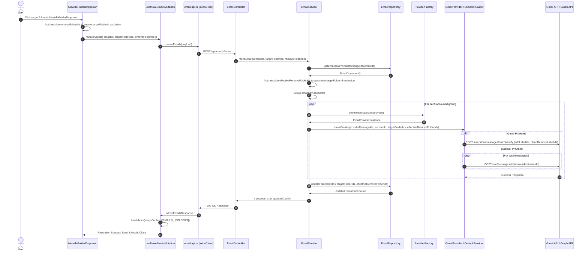
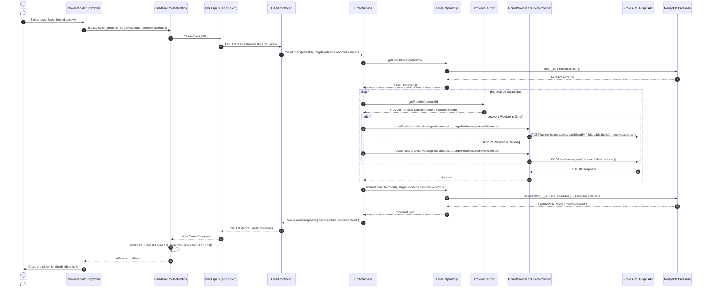

> **Feature:** email-experience-completion · **Phase:** 3 (Move to Folder / Apply Label)
> **Status:** COMPLETED
> **Created:** 2026-08-18 · **Last Updated:** 2026-08-24

---

## 1. Goal Description & Scope

Establish comprehensive backend and frontend capabilities for moving emails across folders and applying or removing labels.

Specifically, Phase 3 ensures that:

1. **Multi-Provider Folder Movement & Relabeling:** Supports moving single or multiple emails to target folders/labels across both Gmail (modifying labels via Gmail API `users.messages.batchModify` or `users.messages.modify`) and Outlook (relocating messages to target `parentFolderId` via Microsoft Graph API `POST /me/messages/{id}/move`).
2. **Account Grouping & Isolation:** Organizes email move operations by `accountId`, invoking appropriate provider adapters (`GmailProvider`, `OutlookProvider`) for external API updates before updating local MongoDB database records.
3. **Database Consistency:** Updates local MongoDB `Email` document `folders` arrays via `EmailRepository.updateFolders`, ensuring offline folder views reflect external provider state changes immediately.
4. **User Experience Integration:** Introduces a reusable `MoveToFolderDropdown` component in the frontend, wiring it into the inbox bulk action bar (`EmailListTable`) and email detail view header (`pages/index.tsx`) with optimistic React Query cache invalidation and user feedback toasts.

---

## 2. User Review Required & Architectural Notes

> [!IMPORTANT]
> **Provider Architectural Differences, Data Normalization & Account Isolation**
>
> - **Gmail vs. Outlook Folder Models:**
>   - **Gmail:** Emails can exist in multiple folders/labels simultaneously (`folders: string[]`). Moving an email to a folder involves adding the target `labelId` and removing existing labels (e.g. `INBOX`).
>   - **Outlook:** Emails reside in a single parent folder (`parentFolderId`). Moving an email physically moves the item to the destination folder ID.
> - **Previous Folder Tracking & Multi-Tier `removeFolderIds` Resolution:**
>   - **Tier 1 (Frontend Component Resolution):** If `currentFolderId` is explicitly passed as a prop (and differs from `targetFolderId`), `MoveToFolderDropdown` uses `removeFolderIds = [currentFolderId]`. Otherwise, it inspects existing `folders` on the selected email objects (excluding `targetFolderId`). It strictly filters out `targetFolderId` from `removeFolderIds` to prevent label ID duplication.
>   - **Tier 2 (Backend Safety Net & Deduplication):** `EmailService` and `GmailApi.batchModifyLabels` guarantee that any folder/label ID present in `targetFolderIds` (`addLabelIds`) is filtered out of `effectiveRemoveFolderIds` (`cleanRemoveLabelIds = removeLabelIds.filter(id => !addLabelIds.includes(id))`). This eliminates Gmail API errors caused by identical label IDs appearing in both add and remove lists.
> - **Account-Scoped Folder Filtering & Multi-Account UI Safeguards:**
>   - Folders/labels in email providers are strictly scoped to a single connected account.
>   - **Single-Account Selection:** When all selected emails belong to a single account (`selectedAccountIds.length === 1`), `MoveToFolderDropdown` automatically filters available folders to show **only** folders matching that account's `accountId` (`folder.accountId === singleAccountId`).
>   - **Multi-Account Selection:** When selected emails span multiple accounts (`selectedAccountIds.length > 1`), cross-account move is disabled at the UI level. The "Move to..." button is disabled and displays an explanatory tooltip on hover: *"Cannot move emails from multiple accounts at once. Select emails from a single account."*
> - **Batch Operations & Database Synchronization:**
>   - Gmail API supports `users.messages.batchModify` for modifying labels across multiple message IDs in a single HTTP request.
>   - Outlook Graph API moves items individually via `POST /me/messages/{id}/move` (or via `$batch` requests). The `OutlookService` handles iteration across message IDs safely.
>   - External provider updates execute **first**. If provider API calls fail, local database state is preserved to avoid state drift.
>   - Local MongoDB updates utilize `$addToSet` and `$pull` operators on the `folders` array for atomic modifications.

---

## 3. Component Overview & File Map

| Component | Target File | Action | Purpose |
| --- | --- | --- | --- |
| **Backend Integration** | `Backend/src/integrations/email/email.provider.ts` | [MODIFY] | Extend `IEmailProvider` interface with `moveEmails` signature |
| **Backend Integration** | `Backend/src/integrations/gmail/gmail.constants.ts` | [MODIFY] | Add `BATCH_MODIFY` constant to `GMAIL_APIs` |
| **Backend Integration** | `Backend/src/integrations/gmail/gmail.client.ts` | [MODIFY] | Add `batchModifyLabels` Gmail API wrapper method using `GMAIL_APIs.BATCH_MODIFY` |
| **Backend Integration** | `Backend/src/integrations/gmail/gmail.service.ts` | [MODIFY] | Add `moveEmails` label modification service logic |
| **Backend Integration** | `Backend/src/integrations/gmail/gmail.provider.ts` | [MODIFY] | Implement `moveEmails` in `GmailProvider` adapter |
| **Backend Integration** | `Backend/src/integrations/outlook/outlook.constants.ts` | [MODIFY] | Add `MOVE_MESSAGE` helper constant function to `OUTLOOK_APIs` |
| **Backend Integration** | `Backend/src/integrations/outlook/outlook.client.ts` | [MODIFY] | Add `moveMessage` Graph API wrapper method using `OUTLOOK_APIs.MOVE_MESSAGE` |
| **Backend Integration** | `Backend/src/integrations/outlook/outlook.service.ts` | [MODIFY] | Add `moveEmails` message relocation service logic |
| **Backend Integration** | `Backend/src/integrations/outlook/outlook.provider.ts` | [MODIFY] | Implement `moveEmails` in `OutlookProvider` adapter |
| **Backend Module** | `Backend/src/modules/emails/email.repository.ts` | [MODIFY] | Add `updateFolders` and `getEmailsByIds` static methods |
| **Backend Module** | `Backend/src/modules/emails/email.service.ts` | [MODIFY] | Implement `moveEmails` business method with account partitioning |
| **Backend Module** | `Backend/src/modules/emails/email.controller.ts` | [MODIFY] | Add `moveEmails` HTTP controller handler |
| **Backend Module** | `Backend/src/modules/emails/email.schema.ts` | [MODIFY] | Add `moveEmailsSchema` validation schema |
| **Backend Module** | `Backend/src/modules/emails/email.routes.ts` | [MODIFY] | Register `POST /api/emails/move` endpoint route |
| **Frontend Shared** | `Frontend/src/shared/api/endpoints.ts` | [MODIFY] | Add `MOVE: '/emails/move'` endpoint definition |
| **Frontend API** | `Frontend/src/features/emails/api/email.api.ts` | [MODIFY] | Add `moveEmails` client wrapper function |
| **Frontend Queries** | `Frontend/src/features/emails/api/email.mutations.ts` | [MODIFY] | Add `useMoveEmailsMutation` hook with cache invalidation |
| **Frontend UI** | `Frontend/src/features/emails/components/MoveToFolderDropdown.tsx` | [NEW] | Folder selection dropdown component with account isolation & tooltips |
| **Frontend UI** | `Frontend/src/features/inbox/components/EmailMenuBarOptions.tsx` | [MODIFY] | Integrate `MoveToFolderDropdown` into inbox action bar |
| **Frontend UI** | `Frontend/src/features/emails/components/EmailMenuBarOptions.tsx` | [MODIFY] | Integrate `MoveToFolderDropdown` into email detail header action bar |

---

## 4. Main Section 1: Backend Layer Implementation

### 4.1 Integration & Provider Layer (`Backend/src/integrations/`)

#### [MODIFY] [email.provider.ts](file:///Users/vishaljagamani/Projects/Projects/mailsense/Backend/src/integrations/email/email.provider.ts)

Extend `IEmailProvider` interface signature to mandate folder movement support across all email provider strategies:

```typescript
// Added method signature to IEmailProvider interface
export interface IEmailProvider<TAuthToken = IEmailTAuthToken, TUserProfile = IEmailTUserProfile, TSendMailResult = IEmailTSendEmailResult> {
    // ... existing interface signatures ...

    // Folder & Label Relocation Operations
    moveEmails(emailIds: string[], accountId: string, targetFolderIds: string[], removeFolderIds?: string[]): Promise<void>;
}
```

#### [MODIFY] [gmail.constants.ts](file:///Users/vishaljagamani/Projects/Projects/mailsense/Backend/src/integrations/gmail/gmail.constants.ts)

Add `BATCH_MODIFY` constant to `GMAIL_APIs`:

```typescript
export const GMAIL_APIs = {
    PROFILE: '/me/profile',
    MESSAGES: '/me/messages',
    BATCH_DELETE: '/me/messages/batchDelete',
    BATCH_MODIFY: '/me/messages/batchModify', // Centralized batch modify endpoint constant
    HISTORY: '/me/history',
    LABELS: '/me/labels',
};
```

#### [MODIFY] [gmail.client.ts](file:///Users/vishaljagamani/Projects/Projects/mailsense/Backend/src/integrations/gmail/gmail.client.ts)

Add `batchModifyLabels` to call Gmail API using `GMAIL_APIs.BATCH_MODIFY` constant:

```typescript
// Added to GmailApi class in Backend/src/integrations/gmail/gmail.client.ts
static async batchModifyLabels(
    accountId: string,
    messageIds: string[],
    addLabelIds: string[],
    removeLabelIds: string[]
): Promise<void> {
    try {
        const accessToken = await this.fetchAccessToken(accountId);
        const cleanRemoveLabelIds = removeLabelIds.filter((id) => !addLabelIds.includes(id));
        const options: AxiosRequestConfig = {
            url: `${GMAIL_API_BASE_URL}${GMAIL_APIs.BATCH_MODIFY}`,
            method: 'POST',
            headers: {
                Authorization: `Bearer ${accessToken}`,
                'Content-Type': 'application/json',
            },
            data: {
                ids: messageIds,
                addLabelIds,
                removeLabelIds: cleanRemoveLabelIds,
            },
        };
        await apiRequest(options);
    } catch (error) {
        const errorMessage = error instanceof Error ? error.message : String(error);
        logger.error(`Error in GmailApi.batchModifyLabels: ${errorMessage}`, { accountId, messageIds, error });
        throw error;
    }
}
```

#### [MODIFY] [gmail.service.ts](file:///Users/vishaljagamani/Projects/Projects/mailsense/Backend/src/integrations/gmail/gmail.service.ts)

Add `moveEmails` service method using `GmailApi.batchModifyLabels`:

```typescript
// Added to GmailService class in Backend/src/integrations/gmail/gmail.service.ts
async moveEmails(
    emailIds: string[],
    accountId: string,
    targetFolderIds: string[],
    removeFolderIds: string[] = []
): Promise<void> {
    try {
        if (!emailIds.length) return;
        await GmailApi.batchModifyLabels(accountId, emailIds, targetFolderIds, removeFolderIds);
    } catch (error) {
        const errorMessage = error instanceof Error ? error.message : String(error);
        logger.error('Failed to move emails in GmailService', { accountId, emailIds, targetFolderIds, removeFolderIds, error: errorMessage });
        throw error;
    }
}
```

#### [MODIFY] [gmail.provider.ts](file:///Users/vishaljagamani/Projects/Projects/mailsense/Backend/src/integrations/gmail/gmail.provider.ts)

Implement `moveEmails` in `GmailProvider`:

```typescript
// Added to GmailProvider class in Backend/src/integrations/gmail/gmail.provider.ts
async moveEmails(
    emailIds: string[],
    accountId: string,
    targetFolderIds: string[],
    removeFolderIds?: string[]
): Promise<void> {
    try {
        await this.gmailService.moveEmails(emailIds, accountId, targetFolderIds, removeFolderIds || []);
    } catch (error) {
        const errorMessage = error instanceof Error ? error.message : String(error);
        logger.error('Error in GmailProvider.moveEmails', { accountId, emailIds, error: errorMessage });
        throw error;
    }
}
```

#### [MODIFY] [outlook.constants.ts](file:///Users/vishaljagamani/Projects/Projects/mailsense/Backend/src/integrations/outlook/outlook.constants.ts)

Add `MOVE_MESSAGE` helper function to `OUTLOOK_APIs`:

```typescript
export const OUTLOOK_APIs = {
    PROFILE: '/me',
    MESSAGES: '/me/mailFolders/Inbox/messages',
    MESSAGES_DELTA: '/me/mailFolders/Inbox/messages/delta',
    FOLDERS: '/me/mailFolders',
    ATTACHMENTS: (messageId: string) => `/me/messages/${messageId}/attachments`,
    ATTACHMENT: (messageId: string, attachmentId: string) => `/me/messages/${messageId}/attachments/${attachmentId}/$value`,
    MOVE_MESSAGE: (messageId: string) => `/me/messages/${messageId}/move`, // Centralized move message endpoint constant
};
```

#### [MODIFY] [outlook.client.ts](file:///Users/vishaljagamani/Projects/Projects/mailsense/Backend/src/integrations/outlook/outlook.client.ts)

Add `moveMessage` method to `OutlookApi` using `OUTLOOK_APIs.MOVE_MESSAGE(messageId)` constant:

```typescript
// Added to OutlookApi class in Backend/src/integrations/outlook/outlook.client.ts
static async moveMessage(
    accountId: string,
    messageId: string,
    destinationId: string
): Promise<OutlookMessageObjectFull> {
    try {
        const accessToken = await this.fetchAccessToken(accountId);
        const options: AxiosRequestConfig = {
            url: `${OUTLOOK_API_BASE_URL}${OUTLOOK_APIs.MOVE_MESSAGE(messageId)}`,
            method: 'POST',
            headers: {
                Authorization: `Bearer ${accessToken}`,
                'Content-Type': 'application/json',
            },
            data: {
                destinationId,
            },
        };
        const response: OutlookMessageObjectFull = await apiRequest(options);
        return response;
    } catch (error) {
        const errorMessage = error instanceof Error ? error.message : String(error);
        logger.error(`Error in OutlookApi.moveMessage: ${errorMessage}`, { accountId, messageId, destinationId, error });
        throw error;
    }
}
```

#### [MODIFY] [outlook.service.ts](file:///Users/vishaljagamani/Projects/Projects/mailsense/Backend/src/integrations/outlook/outlook.service.ts)

Add `moveEmails` service method iterating through messages:

```typescript
// Added to OutlookService class in Backend/src/integrations/outlook/outlook.service.ts
async moveEmails(
    providerMessageIds: string[],
    accountId: string,
    targetFolderIds: string[]
): Promise<void> {
    try {
        if (!providerMessageIds.length || !targetFolderIds.length) return;
        const destinationId = targetFolderIds[0];
        
        for (const messageId of providerMessageIds) {
            await OutlookApi.moveMessage(accountId, messageId, destinationId);
        }
    } catch (error) {
        const errorMessage = error instanceof Error ? error.message : String(error);
        logger.error('Failed to move emails in OutlookService', { accountId, providerMessageIds, targetFolderIds, error: errorMessage });
        throw error;
    }
}
```

#### [MODIFY] [outlook.provider.ts](file:///Users/vishaljagamani/Projects/Projects/mailsense/Backend/src/integrations/outlook/outlook.provider.ts)

Implement `moveEmails` in `OutlookProvider`:

```typescript
// Added to OutlookProvider class in Backend/src/integrations/outlook/outlook.provider.ts
async moveEmails(
    emailIds: string[],
    accountId: string,
    targetFolderIds: string[],
    _removeFolderIds?: string[]
): Promise<void> {
    try {
        await this.outlookService.moveEmails(emailIds, accountId, targetFolderIds);
    } catch (error) {
        const errorMessage = error instanceof Error ? error.message : String(error);
        logger.error('Error in OutlookProvider.moveEmails', { accountId, emailIds, error: errorMessage });
        throw error;
    }
}
```

---

### 4.2 Repository Layer (`Backend/src/modules/emails/email.repository.ts`)

#### [MODIFY] [email.repository.ts](file:///Users/vishaljagamani/Projects/Projects/mailsense/Backend/src/modules/emails/email.repository.ts)

Add static methods `getEmailsByIds` and `updateFolders`:

```typescript
// Added to EmailRepository class in Backend/src/modules/emails/email.repository.ts
public static async getEmailsByIds(emailIds: string[]): Promise<EmailDocument[]> {
    if (!emailIds.length) return [];
    return await Email.find({ _id: { $in: emailIds } });
}

public static async updateFolders(
    emailIds: string[],
    targetFolderIds: string[],
    removeFolderIds: string[] = []
): Promise<number> {
    try {
        if (!emailIds.length) return 0;

        let modifiedCount = 0;

        if (removeFolderIds.length > 0) {
            const pullResult = await Email.updateMany(
                { _id: { $in: emailIds } },
                { $pull: { folders: { $in: removeFolderIds } } }
            );
            modifiedCount += pullResult.modifiedCount;
        }

        if (targetFolderIds.length > 0) {
            const addResult = await Email.updateMany(
                { _id: { $in: emailIds } },
                { $addToSet: { folders: { $each: targetFolderIds } } }
            );
            modifiedCount = Math.max(modifiedCount, addResult.modifiedCount);
        }

        return modifiedCount;
    } catch (error) {
        const errorMessage = error instanceof Error ? error.message : String(error);
        logger.error('Failed to update email folders in EmailRepository', { emailIds, targetFolderIds, removeFolderIds, error: errorMessage });
        throw error;
    }
}
```

---

### 4.3 Service Layer (`Backend/src/modules/emails/email.service.ts`)

#### [MODIFY] [email.service.ts](file:///Users/vishaljagamani/Projects/Projects/mailsense/Backend/src/modules/emails/email.service.ts)

Implement `moveEmails` business method with account grouping:

```typescript
// Added to EmailService class in Backend/src/modules/emails/email.service.ts
public async moveEmails(
    emailIds: string[],
    targetFolderIds: string[],
    removeFolderIds: string[] = []
): Promise<MoveEmailsResponse> {
    try {
        if (!emailIds.length) {
            return { success: true, updatedCount: 0 };
        }

        const emailDocs = await EmailRepository.getEmailsByProviderMessageIds(emailIds, EMAIL_LIST_DB_FIELD_MAPPING.LIST.projection);
        if (!emailDocs.length) {
            throw new Error('No matching emails found for relocation');
        }

        let effectiveRemoveFolderIds = removeFolderIds || [];
        if (!effectiveRemoveFolderIds.length) {
            const extractedFolders = new Set<string>();
            emailDocs.forEach((doc) => {
                if (Array.isArray(doc.folders)) {
                    doc.folders.forEach((fId) => {
                        if (!targetFolderIds.includes(fId)) {
                            extractedFolders.add(fId);
                        }
                    });
                }
            });
            effectiveRemoveFolderIds = Array.from(extractedFolders);
        }

        // Guarantee effectiveRemoveFolderIds never overlaps with targetFolderIds
        effectiveRemoveFolderIds = effectiveRemoveFolderIds.filter((fId) => !targetFolderIds.includes(fId));

        const groupedEmails = Object.groupBy(emailDocs, (item) => item.accountId);
        for (const [accountId, emails] of Object.entries(groupedEmails)) {
            const account = await AccountRepository.getAccountById(accountId, { provider: 1 });
            if (!account || !emails) continue;
            const provider = EmailProviderFactory.getProvider(account.provider as ACCOUNT_PROVIDER);
            const providerMessageIds = emails.map((d) => d.providerMessageId);

            await provider.moveEmails(providerMessageIds, accountId, targetFolderIds, effectiveRemoveFolderIds);
        }

        const dbIds = emailDocs.map((doc) => String(doc._id));
        const updatedCount = await EmailRepository.updateFolders(dbIds, targetFolderIds, effectiveRemoveFolderIds);

        return { success: true, updatedCount };
    } catch (error) {
        const errorMessage = error instanceof Error ? error.message : String(error);
        logger.error('Failed to execute moveEmails in EmailService', { emailIds, targetFolderIds, removeFolderIds, error: errorMessage });
        throw error;
    }
}
```

---

### 4.4 Controller Layer (`Backend/src/modules/emails/email.controller.ts`)

#### [MODIFY] [email.controller.ts](file:///Users/vishaljagamani/Projects/Projects/mailsense/Backend/src/modules/emails/email.controller.ts)

Add `moveEmails` handler method:

```typescript
// Added to EmailController class in Backend/src/modules/emails/email.controller.ts
public moveEmails = async (req: Request<object, object, MoveEmailsRequestBody, object>, res: Response, next: NextFunction): Promise<void> => {
    try {
        const payload = req.body;
        const result = await this.emailService.moveEmails(payload.emailIds, payload.targetFolderIds, payload.removeFolderIds || []);
        res.send(result);
    } catch (error) {
        next(error);
    }
};
```

---

### 4.5 Routes & Validation Schemas (`Backend/src/modules/emails/`)

#### [MODIFY] [email.schema.ts](file:///Users/vishaljagamani/Projects/Projects/mailsense/Backend/src/modules/emails/email.schema.ts)

Add validation schema for move request body:

```typescript
export const moveEmailsSchema = z.object({
    emailIds: z.array(z.string().min(1, 'Invalid email id')).nonempty('At least one email id is required'),
    targetFolderIds: z.array(z.string().min(1, 'Invalid folder id')).nonempty('At least one folder id is required'),
    removeFolderIds: z.array(z.string()).optional(),
});
```

#### [MODIFY] [email.routes.ts](file:///Users/vishaljagamani/Projects/Projects/mailsense/Backend/src/modules/emails/email.routes.ts)

Register `POST /api/emails/move` endpoint route:

```typescript
router.post('/move', validate({ body: moveEmailsSchema }), handleRequest(emailController.moveEmails));
```

---

## 5. Main Section 2: Frontend Layer Implementation

### 5.1 Endpoints & API Client (`Frontend/src/`)

#### [MODIFY] [endpoints.ts](file:///Users/vishaljagamani/Projects/Projects/mailsense/Frontend/src/shared/api/endpoints.ts)

Add `MOVE` endpoint:

```typescript
export const EMAILS_API_ENDPOINTS = {
    // ... existing endpoints ...
    MOVE: '/emails/move',
};
```

#### [MODIFY] [email.api.ts](file:///Users/vishaljagamani/Projects/Projects/mailsense/Frontend/src/features/emails/api/email.api.ts)

Add `moveEmails` API wrapper function:

```typescript
export async function moveEmails(body: MoveEmailsRequestBody): Promise<MoveEmailsResponse> {
    const { data } = await axiosClient.post<MoveEmailsResponse>(EMAILS_API_ENDPOINTS.MOVE, body);
    return data;
}
```

---

### 5.2 React Query Hooks (`Frontend/src/features/emails/api/email.mutations.ts`)

#### [MODIFY] [email.mutations.ts](file:///Users/vishaljagamani/Projects/Projects/mailsense/Frontend/src/features/emails/api/email.mutations.ts)

Add `useMoveEmailsMutation` hook with cache invalidation:

```typescript
export function useMoveEmailsMutation() {
    const queryClient = useQueryClient();

    return useMutation<MoveEmailsResponse, Error, MoveEmailsRequestBody>({
        mutationFn: (data: MoveEmailsRequestBody) => moveEmails(data),
        onSuccess: () => {
            // Invalidate inbox emails and folder queries
            queryClient.invalidateQueries({ queryKey: [EMAILS] });
            queryClient.invalidateQueries({ queryKey: [FOLDER_KEYS.FOLDERS] });
        },
    });
}
```

---

### 5.3 UI Components & Page Integration (`Frontend/src/features/`)

#### [NEW] [MoveToFolderDropdown.tsx](file:///Users/vishaljagamani/Projects/Projects/mailsense/Frontend/src/features/emails/components/MoveToFolderDropdown.tsx)

Create modular folder dropdown selector component with account isolation, tooltips, and theme popover styling:

```tsx
'use client';

import { EmailAttributes, FolderAttributes } from '@mailsense/types';
import { Check, Folder, Loader2, Search, X } from 'lucide-react';
import React, { useMemo, useState } from 'react';
import { toast } from 'sonner';

import { useGetAllFolders } from '@features/folders/api/folder.queries';
import { useAuthStore } from '@shared/store';
import { Button } from '@shared/ui/button';
import { Popover, PopoverContent, PopoverTrigger } from '@shared/ui/popover';
import { Tooltip, TooltipContent, TooltipTrigger } from '@shared/ui/tooltip';
import { useMoveEmailsMutation } from '../api/email.mutations';

interface MoveToFolderDropdownProps {
    emailIds: string[];
    selectedEmails?: EmailAttributes[];
    allEmails?: EmailAttributes[];
    accountId?: string;
    folders?: FolderAttributes[];
    currentFolderId?: string;
    onSuccess?: () => void;
    disabled?: boolean;
}

export const MoveToFolderDropdown: React.FC<MoveToFolderDropdownProps> = ({
    emailIds,
    selectedEmails,
    allEmails,
    accountId,
    folders,
    currentFolderId,
    onSuccess,
    disabled = false,
}) => {
    const [isOpen, setIsOpen] = useState(false);
    const [searchQuery, setSearchQuery] = useState('');
    const { user } = useAuthStore();

    // Fetch user folders if not explicitly passed
    const { data: fetchedFoldersData, isLoading: isLoadingFolders } = useGetAllFolders(
        !folders && user?.id ? { userId: user.id, size: 100, page: 1, filters: {} } : null,
    );

    const availableFolders = folders || fetchedFoldersData?.data || [];
    const moveEmailsMutation = useMoveEmailsMutation();

    // Resolve selected email objects
    const resolvedSelectedEmailObjects = useMemo(() => {
        if (selectedEmails && selectedEmails.length > 0) return selectedEmails;
        if (allEmails && emailIds.length > 0) {
            return allEmails.filter((email) => emailIds.includes(email.providerMessageId) || emailIds.includes(email._id));
        }
        return [];
    }, [selectedEmails, allEmails, emailIds]);

    // Determine unique account IDs among selected emails
    const selectedAccountIds = useMemo(() => {
        if (accountId) return [accountId];
        const accounts = new Set<string>();
        resolvedSelectedEmailObjects.forEach((email) => {
            if (email.accountId) accounts.add(email.accountId);
        });
        return Array.from(accounts);
    }, [accountId, resolvedSelectedEmailObjects]);

    const isMultiAccountSelected = selectedAccountIds.length > 1;
    const singleAccountId = selectedAccountIds.length === 1 ? selectedAccountIds[0] : null;

    // Filter destination folders by target account
    const filteredFolders = useMemo(() => {
        if (!availableFolders.length) return [];
        if (singleAccountId) {
            return availableFolders.filter((folder) => folder.accountId === singleAccountId);
        }
        return availableFolders;
    }, [availableFolders, singleAccountId]);

    // Filter destination folders by search query
    const searchedFolders = useMemo(() => {
        if (!filteredFolders.length) return [];
        if (!searchQuery.trim()) return filteredFolders;
        const query = searchQuery.toLowerCase().trim();
        return filteredFolders.filter((folder) => folder.name.toLowerCase().includes(query));
    }, [filteredFolders, searchQuery]);

    const isDisabled = disabled || emailIds.length === 0 || isMultiAccountSelected || moveEmailsMutation.isPending;

    const tooltipMessage = isMultiAccountSelected
        ? 'Cannot move emails from multiple accounts at once. Select emails from a single account.'
        : emailIds.length === 0
          ? 'Select emails to move'
          : 'Move selected emails to a folder';

    const handleOpenChange = (open: boolean) => {
        setIsOpen(open);
        if (!open) {
            setSearchQuery('');
        }
    };

    const handleSelectFolder = async (targetFolderId: string) => {
        try {
            if (targetFolderId === currentFolderId || emailIds.length === 0) {
                setIsOpen(false);
                setSearchQuery('');
                return;
            }

            let removeFolderIds: string[] = [];
            if (currentFolderId && currentFolderId !== targetFolderId) {
                removeFolderIds = [currentFolderId];
            } else if (resolvedSelectedEmailObjects.length > 0) {
                const existingFolders = new Set<string>();
                resolvedSelectedEmailObjects.forEach((email) => {
                    if (Array.isArray(email.folders)) {
                        email.folders.forEach((fId) => {
                            if (fId !== targetFolderId) existingFolders.add(fId);
                        });
                    }
                });
                removeFolderIds = Array.from(existingFolders);
            }

            // Guarantee removeFolderIds never contains targetFolderId
            removeFolderIds = removeFolderIds.filter((fId) => fId !== targetFolderId);

            const res = await moveEmailsMutation.mutateAsync({
                emailIds,
                targetFolderIds: [targetFolderId],
                removeFolderIds,
            });

            if (res?.success) {
                toast.success(`Moved ${res.updatedCount || emailIds.length} email(s) successfully`);
            } else {
                toast.success('Emails moved successfully');
            }

            setIsOpen(false);
            setSearchQuery('');
            if (onSuccess) {
                onSuccess();
            }
        } catch (error) {
            const errorMessage = error instanceof Error ? error.message : String(error);
            toast.error(`Failed to move emails: ${errorMessage}`);
            console.error('Failed to move emails to folder:', errorMessage);
        }
    };

    return (
        <Popover open={isOpen} onOpenChange={handleOpenChange}>
            <Tooltip>
                <TooltipTrigger asChild>
                    <span className="inline-block">
                        <PopoverTrigger asChild>
                            <Button variant="outline" disabled={isDisabled} className="cursor-pointer">
                                {moveEmailsMutation.isPending ? (
                                    <Loader2 className="text-muted-foreground size-4 animate-spin" />
                                ) : (
                                    <Folder className="text-muted-foreground size-4" />
                                )}
                                <span className="text-nowrap">Move to...</span>
                            </Button>
                        </PopoverTrigger>
                    </span>
                </TooltipTrigger>
                <TooltipContent>
                    <p className="text-xs font-medium">{tooltipMessage}</p>
                </TooltipContent>
            </Tooltip>

            <PopoverContent align="end" className="w-60 overflow-hidden p-0">
                <div className="border-border text-muted-foreground border-b px-3 py-2 text-xs font-semibold tracking-wider uppercase">
                    Select Destination Folder
                </div>

                {/* Search Input Box */}
                <div className="border-border relative border-b px-2 py-1.5">
                    <Search className="text-muted-foreground absolute top-1/2 left-4 size-3.5 -translate-y-1/2" />
                    <input
                        type="text"
                        value={searchQuery}
                        onChange={(e) => setSearchQuery(e.target.value)}
                        placeholder="Search folders..."
                        className="border-input bg-background/50 text-foreground placeholder:text-muted-foreground focus:border-ring focus:bg-background focus:ring-ring w-full rounded-md border py-1 pr-7 pl-8 text-xs focus:ring-1 focus:outline-none"
                        autoFocus
                    />
                    {searchQuery && (
                        <button
                            type="button"
                            onClick={() => setSearchQuery('')}
                            className="text-muted-foreground hover:text-foreground absolute top-1/2 right-3.5 -translate-y-1/2"
                        >
                            <X className="size-3" />
                        </button>
                    )}
                </div>

                {/* Folders List Container */}
                <div className="max-h-48 overflow-y-auto py-1">
                    {isLoadingFolders ? (
                        <div className="flex items-center justify-center p-4">
                            <Loader2 className="text-muted-foreground size-5 animate-spin" />
                        </div>
                    ) : searchedFolders.length === 0 ? (
                        <div className="text-muted-foreground px-4 py-3 text-center text-xs">
                            {searchQuery ? 'No matching folders found' : 'No folders available'}
                        </div>
                    ) : (
                        searchedFolders.map((folder) => {
                            const isCurrent = folder._id === currentFolderId;
                            return (
                                <button
                                    key={folder._id}
                                    type="button"
                                    onClick={() => handleSelectFolder(folder.providerFolderId)}
                                    disabled={isCurrent || moveEmailsMutation.isPending}
                                    className={`hover:bg-accent hover:text-accent-foreground flex w-full items-center justify-between px-3 py-1.5 text-left text-xs transition-colors ${
                                        isCurrent ? 'bg-accent/50 text-muted-foreground cursor-default font-medium' : 'text-foreground'
                                    }`}
                                >
                                    <span className="truncate">{folder.name}</span>
                                    {isCurrent && <Check className="text-muted-foreground size-4" />}
                                </button>
                            );
                        })
                    )}
                </div>
            </PopoverContent>
        </Popover>
    );
};

export default MoveToFolderDropdown;
```

#### [MODIFY] [EmailMenuBarOptions.tsx](file:///Users/vishaljagamani/Projects/Projects/mailsense/Frontend/src/features/inbox/components/EmailMenuBarOptions.tsx)

Integrate `MoveToFolderDropdown` with `allEmails` prop in inbox action bar:

```tsx
<MoveToFolderDropdown
    emailIds={emailIds}
    allEmails={allEmails}
    onSuccess={() => {
        onResetSelection();
        onRefetchEmails();
    }}
/>
```


---

## 6. Low-Level Design & Sequence Flow



---

## 7. Step-by-Step Task Checklist

- [x] **Task 1: Provider Strategy Interfaces & Adapters (`Backend/src/integrations/`)**
  - [x] Add `moveEmails` method signature to `IEmailProvider` in `email.provider.ts`.
  - [x] Add `batchModifyLabels` in `gmail.client.ts` and `moveEmails` in `gmail.service.ts` & `gmail.provider.ts`.
  - [x] Add `moveMessage` in `outlook.client.ts` and `moveEmails` in `outlook.service.ts` & `outlook.provider.ts`.
- [x] **Task 2: Backend Repository & Service Layers (`Backend/src/modules/emails/`)**
  - [x] Implement `EmailRepository.updateFolders` with `$pull` and `$addToSet` operators.
  - [x] Implement `EmailService.moveEmails` with account partitioning and provider invocation.
- [x] **Task 3: Backend Controller, Schema & Route Registration (`Backend/src/modules/emails/`)**
  - [x] Create `moveEmailsSchema` validation schema in `email.schema.ts`.
  - [x] Add `moveEmails` controller handler in `email.controller.ts`.
  - [x] Register `POST /api/emails/move` route in `email.routes.ts`.
- [x] **Task 4: Frontend API & React Query Hook (`Frontend/src/`)**
  - [x] Add `MOVE: '/emails/move'` to `EMAILS_API_ENDPOINTS` in `endpoints.ts`.
  - [x] Add `moveEmails` API wrapper in `email.api.ts`.
  - [x] Add `useMoveEmailsMutation` hook with cache invalidation in `email.mutations.ts`.
- [x] **Task 5: Frontend UI Component & Integration (`Frontend/src/`)**
  - [x] Build `MoveToFolderDropdown.tsx` component with Popover styling, account isolation, tooltips & real-time search.
  - [x] Integrate into inbox action bar in `EmailListTable.tsx` and `EmailMenuBarOptions.tsx`.
  - [x] Integrate into email detail header in `pages/index.tsx`.
- [x] **Task 6: Verification & Build Validation**
  - [x] Execute Backend and Frontend build checks (`0` errors).

---

## 8. Verification & Build Commands

### Verification Commands

```bash
# 1. Verify shared types package build
cd /Users/vishaljagamani/Projects/Projects/mailsense-types && pnpm build

# 2. Verify Backend build & TypeScript compilation
cd /Users/vishaljagamani/Projects/Projects/mailsense/Backend && pnpm build

# 3. Verify Frontend build & TypeScript compilation
cd /Users/vishaljagamani/Projects/Projects/mailsense/Frontend && npx tsc --noEmit
```

### Manual Verification Checklist

- [x] **Single Email Move:** Open email detail page -> click "Move to..." dropdown -> select folder -> verify email updates folder assignment and UI reflects change.
- [x] **Bulk Email Move:** Select 3 emails in inbox table -> click "Move to..." action button -> select folder -> verify all selected emails move to destination folder in DB and external provider.
- [x] **Provider Integrity:** Verify Gmail API label modification reflects in Gmail Web interface and Outlook message move reflects in Outlook Web app.


---

## 1. Goal Description & Scope

Establish comprehensive backend and frontend capabilities for moving emails across folders and applying or removing labels.

Specifically, Phase 3 ensures that:

1. **Multi-Provider Folder Movement & Relabeling:** Supports moving single or multiple emails to target folders/labels across both Gmail (modifying labels via Gmail API `users.messages.batchModify` or `users.messages.modify`) and Outlook (relocating messages to target `parentFolderId` via Microsoft Graph API `POST /me/messages/{id}/move`).
2. **Account Grouping & Isolation:** Organizes email move operations by `accountId`, invoking appropriate provider adapters (`GmailProvider`, `OutlookProvider`) for external API updates before updating local MongoDB database records.
3. **Database Consistency:** Updates local MongoDB `Email` document `folders` arrays via `EmailRepository.updateFolders`, ensuring offline folder views reflect external provider state changes immediately.
4. **User Experience Integration:** Introduces a reusable `MoveToFolderDropdown` component in the frontend, wiring it into the inbox bulk action bar (`EmailListTable`) and email detail view header (`pages/index.tsx`) with optimistic React Query cache invalidation and user feedback toasts.

---

## 2. User Review Required & Architectural Notes

> [!IMPORTANT]
> **Provider Architectural Differences, Data Normalization & Account Isolation**
>
> - **Gmail vs. Outlook Folder Models:**
>   - **Gmail:** Emails can exist in multiple folders/labels simultaneously (`folders: string[]`). Moving an email to a folder involves adding the target `labelId` and removing existing labels (e.g. `INBOX`).
>   - **Outlook:** Emails reside in a single parent folder (`parentFolderId`). Moving an email physically moves the item to the destination folder ID.
> - **Previous Folder Tracking & Multi-Tier `removeFolderIds` Resolution:**
>   - **Tier 1 (Frontend Component Resolution):** If `currentFolderId` is explicitly passed as a prop (and differs from `targetFolderId`), `MoveToFolderDropdown` uses `removeFolderIds = [currentFolderId]`. Otherwise, it inspects existing `folders` on the selected email objects (excluding `targetFolderId`). It strictly filters out `targetFolderId` from `removeFolderIds` to prevent label ID duplication.
>   - **Tier 2 (Backend Safety Net & Deduplication):** `EmailService` and `GmailApi.batchModifyLabels` guarantee that any folder/label ID present in `targetFolderIds` (`addLabelIds`) is filtered out of `effectiveRemoveFolderIds` (`cleanRemoveLabelIds = removeLabelIds.filter(id => !addLabelIds.includes(id))`). This eliminates Gmail API errors caused by identical label IDs appearing in both add and remove lists.
> - **Account-Scoped Folder Filtering & Multi-Account UI Safeguards:**
>   - Folders/labels in email providers are strictly scoped to a single connected account.
>   - **Single-Account Selection:** When all selected emails belong to a single account (`selectedAccountIds.length === 1`), `MoveToFolderDropdown` automatically filters available folders to show **only** folders matching that account's `accountId` (`folder.accountId === singleAccountId`).
>   - **Multi-Account Selection:** When selected emails span multiple accounts (`selectedAccountIds.length > 1`), cross-account move is disabled at the UI level. The "Move to..." button is disabled and displays an explanatory tooltip on hover: *"Cannot move emails from multiple accounts at once. Select emails from a single account."*
> - **Batch Operations & Database Synchronization:**
>   - Gmail API supports `users.messages.batchModify` for modifying labels across multiple message IDs in a single HTTP request.
>   - Outlook Graph API moves items individually via `POST /me/messages/{id}/move` (or via `$batch` requests). The `OutlookService` handles iteration across message IDs safely.
>   - External provider updates execute **first**. If provider API calls fail, local database state is preserved to avoid state drift.
>   - Local MongoDB updates utilize `$addToSet` and `$pull` operators on the `folders` array for atomic modifications.

---

## 3. Component Overview & File Map

| Component | Target File | Action | Purpose |
| --- | --- | --- | --- |
| **Backend Integration** | `Backend/src/integrations/email/email.provider.ts` | [MODIFY] | Extend `IEmailProvider` interface with `moveEmails` signature |
| **Backend Integration** | `Backend/src/integrations/gmail/gmail.constants.ts` | [MODIFY] | Add `BATCH_MODIFY` constant to `GMAIL_APIs` |
| **Backend Integration** | `Backend/src/integrations/gmail/gmail.client.ts` | [MODIFY] | Add `batchModifyLabels` Gmail API wrapper method using `GMAIL_APIs.BATCH_MODIFY` |
| **Backend Integration** | `Backend/src/integrations/gmail/gmail.service.ts` | [MODIFY] | Add `moveEmails` label modification service logic |
| **Backend Integration** | `Backend/src/integrations/gmail/gmail.provider.ts` | [MODIFY] | Implement `moveEmails` in `GmailProvider` adapter |
| **Backend Integration** | `Backend/src/integrations/outlook/outlook.constants.ts` | [MODIFY] | Add `MOVE_MESSAGE` helper constant function to `OUTLOOK_APIs` |
| **Backend Integration** | `Backend/src/integrations/outlook/outlook.client.ts` | [MODIFY] | Add `moveMessage` Graph API wrapper method using `OUTLOOK_APIs.MOVE_MESSAGE` |
| **Backend Integration** | `Backend/src/integrations/outlook/outlook.service.ts` | [MODIFY] | Add `moveEmails` message relocation service logic |
| **Backend Integration** | `Backend/src/integrations/outlook/outlook.provider.ts` | [MODIFY] | Implement `moveEmails` in `OutlookProvider` adapter |
| **Backend Module** | `Backend/src/modules/emails/email.repository.ts` | [MODIFY] | Add `updateFolders` and `getEmailsByIds` static methods |
| **Backend Module** | `Backend/src/modules/emails/email.service.ts` | [MODIFY] | Implement `moveEmails` business method with account partitioning |
| **Backend Module** | `Backend/src/modules/emails/email.controller.ts` | [MODIFY] | Add `moveEmails` HTTP controller handler |
| **Backend Module** | `Backend/src/modules/emails/email.schema.ts` | [MODIFY] | Add `moveEmailsSchema` validation schema |
| **Backend Module** | `Backend/src/modules/emails/email.routes.ts` | [MODIFY] | Register `POST /api/emails/move` endpoint route |
| **Frontend Shared** | `Frontend/src/shared/api/endpoints.ts` | [MODIFY] | Add `MOVE: '/emails/move'` endpoint definition |
| **Frontend API** | `Frontend/src/features/emails/api/email.api.ts` | [MODIFY] | Add `moveEmails` client wrapper function |
| **Frontend Queries** | `Frontend/src/features/emails/api/email.mutations.ts` | [MODIFY] | Add `useMoveEmailsMutation` hook with cache invalidation |
| **Frontend UI** | `Frontend/src/features/emails/components/MoveToFolderDropdown.tsx` | [NEW] | Folder selection dropdown component with account isolation & tooltips |
| **Frontend UI** | `Frontend/src/features/inbox/components/EmailMenuBarOptions.tsx` | [MODIFY] | Integrate `MoveToFolderDropdown` into inbox action bar |
| **Frontend UI** | `Frontend/src/features/emails/components/EmailMenuBarOptions.tsx` | [MODIFY] | Integrate `MoveToFolderDropdown` into email detail header action bar |

---

## 4. Main Section 1: Backend Layer Implementation

### 4.1 Integration & Provider Layer (`Backend/src/integrations/`)

#### [MODIFY] [email.provider.ts](file:///Users/vishaljagamani/Projects/Projects/mailsense/Backend/src/integrations/email/email.provider.ts)

Extend `IEmailProvider` interface signature to mandate folder movement support across all email provider strategies:

```typescript
// Added method signature to IEmailProvider interface
export interface IEmailProvider<TAuthToken = IEmailTAuthToken, TUserProfile = IEmailTUserProfile, TSendMailResult = IEmailTSendEmailResult> {
    // ... existing interface signatures ...

    // Folder & Label Relocation Operations
    moveEmails(emailIds: string[], accountId: string, targetFolderIds: string[], removeFolderIds?: string[]): Promise<void>;
}
```

#### [MODIFY] [gmail.constants.ts](file:///Users/vishaljagamani/Projects/Projects/mailsense/Backend/src/integrations/gmail/gmail.constants.ts)

Add `BATCH_MODIFY` constant to `GMAIL_APIs`:

```typescript
export const GMAIL_APIs = {
    PROFILE: '/me/profile',
    MESSAGES: '/me/messages',
    BATCH_DELETE: '/me/messages/batchDelete',
    BATCH_MODIFY: '/me/messages/batchModify', // Centralized batch modify endpoint constant
    HISTORY: '/me/history',
    LABELS: '/me/labels',
};
```

#### [MODIFY] [gmail.client.ts](file:///Users/vishaljagamani/Projects/Projects/mailsense/Backend/src/integrations/gmail/gmail.client.ts)

Add `batchModifyLabels` to call Gmail API using `GMAIL_APIs.BATCH_MODIFY` constant:

```typescript
// Added to GmailApi class in Backend/src/integrations/gmail/gmail.client.ts
static async batchModifyLabels(
    accountId: string,
    messageIds: string[],
    addLabelIds: string[],
    removeLabelIds: string[]
): Promise<void> {
    try {
        const accessToken = await this.fetchAccessToken(accountId);
        const options: AxiosRequestConfig = {
            url: `${GMAIL_API_BASE_URL}${GMAIL_APIs.BATCH_MODIFY}`,
            method: 'POST',
            headers: {
                Authorization: `Bearer ${accessToken}`,
                'Content-Type': 'application/json',
            },
            data: {
                ids: messageIds,
                addLabelIds,
                removeLabelIds,
            },
        };
        await apiRequest(options);
    } catch (error) {
        const errorMessage = error instanceof Error ? error.message : String(error);
        logger.error(`Error in GmailApi.batchModifyLabels: ${errorMessage}`, { accountId, messageIds, error });
        throw error;
    }
}
```

#### [MODIFY] [gmail.service.ts](file:///Users/vishaljagamani/Projects/Projects/mailsense/Backend/src/integrations/gmail/gmail.service.ts)

Add `moveEmails` service method using `GmailApi.batchModifyLabels`:

```typescript
// Added to GmailService class in Backend/src/integrations/gmail/gmail.service.ts
async moveEmails(
    emailIds: string[],
    accountId: string,
    targetFolderIds: string[],
    removeFolderIds: string[] = []
): Promise<void> {
    try {
        if (!emailIds.length) return;
        await GmailApi.batchModifyLabels(accountId, emailIds, targetFolderIds, removeFolderIds);
    } catch (error) {
        const errorMessage = error instanceof Error ? error.message : String(error);
        logger.error('Failed to move emails in GmailService', { accountId, emailIds, targetFolderIds, removeFolderIds, error: errorMessage });
        throw error;
    }
}
```

#### [MODIFY] [gmail.provider.ts](file:///Users/vishaljagamani/Projects/Projects/mailsense/Backend/src/integrations/gmail/gmail.provider.ts)

Implement `moveEmails` in `GmailProvider`:

```typescript
// Added to GmailProvider class in Backend/src/integrations/gmail/gmail.provider.ts
async moveEmails(
    emailIds: string[],
    accountId: string,
    targetFolderIds: string[],
    removeFolderIds?: string[]
): Promise<void> {
    try {
        await this.gmailService.moveEmails(emailIds, accountId, targetFolderIds, removeFolderIds || []);
    } catch (error) {
        const errorMessage = error instanceof Error ? error.message : String(error);
        logger.error('Error in GmailProvider.moveEmails', { accountId, emailIds, error: errorMessage });
        throw error;
    }
}
```

#### [MODIFY] [outlook.constants.ts](file:///Users/vishaljagamani/Projects/Projects/mailsense/Backend/src/integrations/outlook/outlook.constants.ts)

Add `MOVE_MESSAGE` helper function to `OUTLOOK_APIs`:

```typescript
export const OUTLOOK_APIs = {
    PROFILE: '/me',
    MESSAGES: '/me/mailFolders/Inbox/messages',
    MESSAGES_DELTA: '/me/mailFolders/Inbox/messages/delta',
    FOLDERS: '/me/mailFolders',
    ATTACHMENTS: (messageId: string) => `/me/messages/${messageId}/attachments`,
    ATTACHMENT: (messageId: string, attachmentId: string) => `/me/messages/${messageId}/attachments/${attachmentId}/$value`,
    MOVE_MESSAGE: (messageId: string) => `/me/messages/${messageId}/move`, // Centralized move message endpoint constant
};
```

#### [MODIFY] [outlook.client.ts](file:///Users/vishaljagamani/Projects/Projects/mailsense/Backend/src/integrations/outlook/outlook.client.ts)

Add `moveMessage` method to `OutlookApi` using `OUTLOOK_APIs.MOVE_MESSAGE(messageId)` constant:

```typescript
// Added to OutlookApi class in Backend/src/integrations/outlook/outlook.client.ts
static async moveMessage(
    accountId: string,
    messageId: string,
    destinationId: string
): Promise<OutlookMessageObjectFull> {
    try {
        const accessToken = await this.fetchAccessToken(accountId);
        const options: AxiosRequestConfig = {
            url: `${OUTLOOK_API_BASE_URL}${OUTLOOK_APIs.MOVE_MESSAGE(messageId)}`,
            method: 'POST',
            headers: {
                Authorization: `Bearer ${accessToken}`,
                'Content-Type': 'application/json',
            },
            data: {
                destinationId,
            },
        };
        const response: OutlookMessageObjectFull = await apiRequest(options);
        return response;
    } catch (error) {
        const errorMessage = error instanceof Error ? error.message : String(error);
        logger.error(`Error in OutlookApi.moveMessage: ${errorMessage}`, { accountId, messageId, destinationId, error });
        throw error;
    }
}
```

#### [MODIFY] [outlook.service.ts](file:///Users/vishaljagamani/Projects/Projects/mailsense/Backend/src/integrations/outlook/outlook.service.ts)

Add `moveEmails` service method iterating through messages:

```typescript
// Added to OutlookService class in Backend/src/integrations/outlook/outlook.service.ts
async moveEmails(
    providerMessageIds: string[],
    accountId: string,
    targetFolderIds: string[]
): Promise<void> {
    try {
        if (!providerMessageIds.length || !targetFolderIds.length) return;
        const destinationId = targetFolderIds[0];
        
        for (const messageId of providerMessageIds) {
            await OutlookApi.moveMessage(accountId, messageId, destinationId);
        }
    } catch (error) {
        const errorMessage = error instanceof Error ? error.message : String(error);
        logger.error('Failed to move emails in OutlookService', { accountId, providerMessageIds, targetFolderIds, error: errorMessage });
        throw error;
    }
}
```

#### [MODIFY] [outlook.provider.ts](file:///Users/vishaljagamani/Projects/Projects/mailsense/Backend/src/integrations/outlook/outlook.provider.ts)

Implement `moveEmails` in `OutlookProvider`:

```typescript
// Added to OutlookProvider class in Backend/src/integrations/outlook/outlook.provider.ts
async moveEmails(
    emailIds: string[],
    accountId: string,
    targetFolderIds: string[],
    _removeFolderIds?: string[]
): Promise<void> {
    try {
        await this.outlookService.moveEmails(emailIds, accountId, targetFolderIds);
    } catch (error) {
        const errorMessage = error instanceof Error ? error.message : String(error);
        logger.error('Error in OutlookProvider.moveEmails', { accountId, emailIds, error: errorMessage });
        throw error;
    }
}
```

---

### 4.2 Repository Layer (`Backend/src/modules/emails/email.repository.ts`)

#### [MODIFY] [email.repository.ts](file:///Users/vishaljagamani/Projects/Projects/mailsense/Backend/src/modules/emails/email.repository.ts)

Add static methods `getEmailsByIds` and `updateFolders`:

```typescript
// Added to EmailRepository class in Backend/src/modules/emails/email.repository.ts
public static async getEmailsByIds(emailIds: string[]): Promise<EmailDocument[]> {
    if (!emailIds.length) return [];
    return await Email.find({ _id: { $in: emailIds } });
}

public static async updateFolders(
    emailIds: string[],
    targetFolderIds: string[],
    removeFolderIds: string[] = []
): Promise<number> {
    try {
        if (!emailIds.length) return 0;

        let modifiedCount = 0;

        if (removeFolderIds.length > 0) {
            const pullResult = await Email.updateMany(
                { _id: { $in: emailIds } },
                { $pull: { folders: { $in: removeFolderIds } } }
            );
            modifiedCount += pullResult.modifiedCount;
        }

        if (targetFolderIds.length > 0) {
            const addResult = await Email.updateMany(
                { _id: { $in: emailIds } },
                { $addToSet: { folders: { $each: targetFolderIds } } }
            );
            modifiedCount = Math.max(modifiedCount, addResult.modifiedCount);
        }

        return modifiedCount;
    } catch (error) {
        const errorMessage = error instanceof Error ? error.message : String(error);
        logger.error('Failed to update email folders in EmailRepository', { emailIds, targetFolderIds, removeFolderIds, error: errorMessage });
        throw error;
    }
}
```

---

### 4.3 Service Layer (`Backend/src/modules/emails/email.service.ts`)

#### [MODIFY] [email.service.ts](file:///Users/vishaljagamani/Projects/Projects/mailsense/Backend/src/modules/emails/email.service.ts)

Implement `moveEmails` business method with account grouping:

```typescript
// Added to EmailService class in Backend/src/modules/emails/email.service.ts
public async moveEmails(
    emailIds: string[],
    targetFolderIds: string[],
    removeFolderIds: string[] = []
): Promise<MoveEmailsResponse> {
    try {
        if (!emailIds.length) {
            return { success: true, updatedCount: 0 };
        }

        const emailDocs = await EmailRepository.getEmailsByProviderMessageIds(emailIds, EMAIL_LIST_DB_FIELD_MAPPING.LIST.projection);
        if (!emailDocs.length) {
            throw new Error('No matching emails found for relocation');
        }

        const groupedEmails = Object.groupBy(emailDocs, (item) => item.accountId);
        for (const [accountId, emails] of Object.entries(groupedEmails)) {
            const account = await AccountRepository.getAccountById(accountId, { provider: 1 });
            if (!account || !emails) continue;
            const provider = EmailProviderFactory.getProvider(account.provider as ACCOUNT_PROVIDER);
            const providerMessageIds = emails.map((d) => d.providerMessageId);

            await provider.moveEmails(providerMessageIds, accountId, targetFolderIds, removeFolderIds);
        }

        const dbIds = emailDocs.map((doc) => String(doc._id));
        const updatedCount = await EmailRepository.updateFolders(dbIds, targetFolderIds, removeFolderIds);

        return { success: true, updatedCount };
    } catch (error) {
        const errorMessage = error instanceof Error ? error.message : String(error);
        logger.error('Failed to execute moveEmails in EmailService', { emailIds, targetFolderIds, removeFolderIds, error: errorMessage });
        throw error;
    }
}
```

---

### 4.4 Controller Layer (`Backend/src/modules/emails/email.controller.ts`)

#### [MODIFY] [email.controller.ts](file:///Users/vishaljagamani/Projects/Projects/mailsense/Backend/src/modules/emails/email.controller.ts)

Add `moveEmails` handler method:

```typescript
// Added to EmailController class in Backend/src/modules/emails/email.controller.ts
public moveEmails = async (req: Request<object, object, MoveEmailsRequestBody, object>, res: Response, next: NextFunction): Promise<void> => {
    try {
        const payload = req.body;
        const result = await this.emailService.moveEmails(payload.emailIds, payload.targetFolderIds, payload.removeFolderIds || []);
        res.send(result);
    } catch (error) {
        next(error);
    }
};
```

---

### 4.5 Routes & Validation Schemas (`Backend/src/modules/emails/`)

#### [MODIFY] [email.schema.ts](file:///Users/vishaljagamani/Projects/Projects/mailsense/Backend/src/modules/emails/email.schema.ts)

Add validation schema for move request body:

```typescript
export const moveEmailsSchema = z.object({
    emailIds: z.array(z.string().min(1, 'Invalid email id')).nonempty('At least one email id is required'),
    targetFolderIds: z.array(z.string().min(1, 'Invalid folder id')).nonempty('At least one folder id is required'),
    removeFolderIds: z.array(z.string()).optional(),
});
```

#### [MODIFY] [email.routes.ts](file:///Users/vishaljagamani/Projects/Projects/mailsense/Backend/src/modules/emails/email.routes.ts)

Register `POST /api/emails/move` endpoint route:

```typescript
router.post('/move', validate({ body: moveEmailsSchema }), handleRequest(emailController.moveEmails));
```

---

## 5. Main Section 2: Frontend Layer Implementation

### 5.1 Endpoints & API Client (`Frontend/src/`)

#### [MODIFY] [endpoints.ts](file:///Users/vishaljagamani/Projects/Projects/mailsense/Frontend/src/shared/api/endpoints.ts)

Add `MOVE` endpoint:

```typescript
export const EMAILS_API_ENDPOINTS = {
    // ... existing endpoints ...
    MOVE: '/emails/move',
};
```

#### [MODIFY] [email.api.ts](file:///Users/vishaljagamani/Projects/Projects/mailsense/Frontend/src/features/emails/api/email.api.ts)

Add `moveEmails` API wrapper function:

```typescript
export async function moveEmails(body: MoveEmailsRequestBody): Promise<MoveEmailsResponse> {
    const { data } = await axiosClient.post<MoveEmailsResponse>(EMAILS_API_ENDPOINTS.MOVE, body);
    return data;
}
```

---

### 5.2 React Query Hooks (`Frontend/src/features/emails/api/email.mutations.ts`)

#### [MODIFY] [email.mutations.ts](file:///Users/vishaljagamani/Projects/Projects/mailsense/Frontend/src/features/emails/api/email.mutations.ts)

Add `useMoveEmailsMutation` hook with cache invalidation:

```typescript
export function useMoveEmailsMutation() {
    const queryClient = useQueryClient();

    return useMutation<MoveEmailsResponse, Error, MoveEmailsRequestBody>({
        mutationFn: (data: MoveEmailsRequestBody) => moveEmails(data),
        onSuccess: () => {
            // Invalidate inbox emails and folder queries
            queryClient.invalidateQueries({ queryKey: [EMAILS] });
            queryClient.invalidateQueries({ queryKey: [FOLDER_KEYS.FOLDERS] });
        },
    });
}
```

---

### 5.3 UI Components & Page Integration (`Frontend/src/features/`)

#### [NEW] [MoveToFolderDropdown.tsx](file:///Users/vishaljagamani/Projects/Projects/mailsense/Frontend/src/features/emails/components/MoveToFolderDropdown.tsx)

Create modular folder dropdown selector component with account isolation & tooltips:

```tsx
'use client';

import { EmailAttributes, FolderAttributes } from '@mailsense/types';
import { Check, Folder, Loader2 } from 'lucide-react';
import React, { useMemo, useState } from 'react';
import { toast } from 'sonner';

import { useGetAllFolders } from '@features/folders/api/folder.queries';
import { useAuthStore } from '@shared/store';
import { Tooltip, TooltipContent, TooltipTrigger } from '@shared/ui/tooltip';
import { useMoveEmailsMutation } from '../api/email.mutations';

interface MoveToFolderDropdownProps {
    emailIds: string[];
    selectedEmails?: EmailAttributes[];
    allEmails?: EmailAttributes[];
    accountId?: string;
    folders?: FolderAttributes[];
    currentFolderId?: string;
    onSuccess?: () => void;
    disabled?: boolean;
}

export const MoveToFolderDropdown: React.FC<MoveToFolderDropdownProps> = ({
    emailIds,
    selectedEmails,
    allEmails,
    accountId,
    folders,
    currentFolderId,
    onSuccess,
    disabled = false,
}) => {
    const [isOpen, setIsOpen] = useState(false);
    const { user } = useAuthStore();

    // Fetch user folders if not explicitly passed
    const { data: fetchedFoldersData, isLoading: isLoadingFolders } = useGetAllFolders(
        !folders && user?.id ? { userId: user.id, size: 100, page: 1, filters: {} } : null,
    );

    const availableFolders = folders || fetchedFoldersData?.data || [];
    const moveEmailsMutation = useMoveEmailsMutation();

    // Resolve selected email objects
    const resolvedSelectedEmailObjects = useMemo(() => {
        if (selectedEmails && selectedEmails.length > 0) return selectedEmails;
        if (allEmails && emailIds.length > 0) {
            return allEmails.filter((email) => emailIds.includes(email.providerMessageId) || emailIds.includes(email._id));
        }
        return [];
    }, [selectedEmails, allEmails, emailIds]);

    // Determine unique account IDs among selected emails
    const selectedAccountIds = useMemo(() => {
        if (accountId) return [accountId];
        const accounts = new Set<string>();
        resolvedSelectedEmailObjects.forEach((email) => {
            if (email.accountId) accounts.add(email.accountId);
        });
        return Array.from(accounts);
    }, [accountId, resolvedSelectedEmailObjects]);

    const isMultiAccountSelected = selectedAccountIds.length > 1;
    const singleAccountId = selectedAccountIds.length === 1 ? selectedAccountIds[0] : null;

    // Filter destination folders by target account
    const filteredFolders = useMemo(() => {
        if (!availableFolders.length) return [];
        if (singleAccountId) {
            return availableFolders.filter((folder) => folder.accountId === singleAccountId);
        }
        return availableFolders;
    }, [availableFolders, singleAccountId]);

    const isDisabled = disabled || emailIds.length === 0 || isMultiAccountSelected || moveEmailsMutation.isPending;

    const tooltipMessage = isMultiAccountSelected
        ? 'Cannot move emails from multiple accounts at once. Select emails from a single account.'
        : emailIds.length === 0
          ? 'Select emails to move'
          : 'Move selected emails to a folder';

    const handleOpenToggle = () => {
        setIsOpen((prev) => {
            const nextState = !prev;
            if (!nextState) setSearchQuery('');
            return nextState;
        });
    };

    const handleSelectFolder = async (targetFolderId: string) => {
        try {
            if (targetFolderId === currentFolderId || emailIds.length === 0) {
                setIsOpen(false);
                setSearchQuery('');
                return;
            }

            let removeFolderIds: string[] = [];
            if (currentFolderId && currentFolderId !== targetFolderId) {
                removeFolderIds = [currentFolderId];
            } else if (resolvedSelectedEmailObjects.length > 0) {
                const existingFolders = new Set<string>();
                resolvedSelectedEmailObjects.forEach((email) => {
                    if (Array.isArray(email.folders)) {
                        email.folders.forEach((fId) => {
                            if (fId !== targetFolderId) existingFolders.add(fId);
                        });
                    }
                });
                removeFolderIds = Array.from(existingFolders);
            }

            // Guarantee removeFolderIds never contains targetFolderId
            removeFolderIds = removeFolderIds.filter((fId) => fId !== targetFolderId);

            const res = await moveEmailsMutation.mutateAsync({
                emailIds,
                targetFolderIds: [targetFolderId],
                removeFolderIds,
            });

            if (res?.success) {
                toast.success(`Moved ${res.updatedCount || emailIds.length} email(s) successfully`);
            } else {
                toast.success('Emails moved successfully');
            }

            setIsOpen(false);
            setSearchQuery('');
            if (onSuccess) {
                onSuccess();
            }
        } catch (error) {
            const errorMessage = error instanceof Error ? error.message : String(error);
            toast.error(`Failed to move emails: ${errorMessage}`);
            console.error('Failed to move emails to folder:', errorMessage);
        }
    };

    return (
        <Popover open={isOpen} onOpenChange={handleOpenChange}>
            <Tooltip>
                <TooltipTrigger asChild>
                    <span className="inline-block">
                        <PopoverTrigger asChild>
                            <Button variant="outline" disabled={isDisabled} className="cursor-pointer">
                                {moveEmailsMutation.isPending ? (
                                    <Loader2 className="size-4 animate-spin text-muted-foreground" />
                                ) : (
                                    <Folder className="size-4 text-muted-foreground" />
                                )}
                                <span className="text-nowrap">Move to...</span>
                            </Button>
                        </PopoverTrigger>
                    </span>
                </TooltipTrigger>
                <TooltipContent>
                    <p className="text-xs font-medium">{tooltipMessage}</p>
                </TooltipContent>
            </Tooltip>

            <PopoverContent align="end" className="w-60 overflow-hidden p-0">
                <div className="border-b border-border px-3 py-2 text-xs font-semibold tracking-wider text-muted-foreground uppercase">
                    Select Destination Folder
                </div>

                {/* Search Input Box */}
                <div className="relative border-b border-border px-2 py-1.5">
                    <Search className="absolute top-1/2 left-4 size-3.5 -translate-y-1/2 text-muted-foreground" />
                    <input
                        type="text"
                        value={searchQuery}
                        onChange={(e) => setSearchQuery(e.target.value)}
                        placeholder="Search folders..."
                        className="w-full rounded-md border border-input bg-background/50 py-1 pr-7 pl-8 text-xs text-foreground placeholder:text-muted-foreground focus:border-ring focus:bg-background focus:ring-1 focus:ring-ring focus:outline-none"
                        autoFocus
                    />
                    {searchQuery && (
                        <button
                            type="button"
                            onClick={() => setSearchQuery('')}
                            className="absolute top-1/2 right-3.5 -translate-y-1/2 text-muted-foreground hover:text-foreground"
                        >
                            <X className="size-3" />
                        </button>
                    )}
                </div>

                {/* Folders List Container */}
                <div className="max-h-48 overflow-y-auto py-1">
                    {isLoadingFolders ? (
                        <div className="flex items-center justify-center p-4">
                            <Loader2 className="size-5 animate-spin text-muted-foreground" />
                        </div>
                    ) : searchedFolders.length === 0 ? (
                        <div className="px-4 py-3 text-center text-xs text-muted-foreground">
                            {searchQuery ? 'No matching folders found' : 'No folders available'}
                        </div>
                    ) : (
                        searchedFolders.map((folder) => {
                            const isCurrent = folder._id === currentFolderId;
                            return (
                                <button
                                    key={folder._id}
                                    type="button"
                                    onClick={() => handleSelectFolder(folder.providerFolderId)}
                                    disabled={isCurrent || moveEmailsMutation.isPending}
                                    className={`flex w-full items-center justify-between px-3 py-1.5 text-left text-xs transition-colors hover:bg-accent hover:text-accent-foreground ${
                                        isCurrent ? 'cursor-default bg-accent/50 font-medium text-muted-foreground' : 'text-foreground'
                                    }`}
                                >
                                    <span className="truncate">{folder.name}</span>
                                    {isCurrent && <Check className="size-4 text-muted-foreground" />}
                                </button>
                            );
                        })
                    )}
                </div>
            </PopoverContent>
        </Popover>
    );
};

export default MoveToFolderDropdown;
```

#### [MODIFY] [EmailMenuBarOptions.tsx](file:///Users/vishaljagamani/Projects/Projects/mailsense/Frontend/src/features/inbox/components/EmailMenuBarOptions.tsx)

Integrate `MoveToFolderDropdown` with `allEmails` prop in inbox action bar:

```tsx
<MoveToFolderDropdown
    emailIds={emailIds}
    allEmails={allEmails}
    onSuccess={() => {
        onResetSelection();
        onRefetchEmails();
    }}
/>
```


---

## 6. Low-Level Design & Sequence Flow



---

## 7. Step-by-Step Task Checklist

- [ ] **Task 1: Provider Strategy Interfaces & Adapters (`Backend/src/integrations/`)**
  - [ ] Add `moveEmails` method signature to `IEmailProvider` in `email.provider.ts`.
  - [ ] Add `batchModifyLabels` in `gmail.client.ts` and `moveEmails` in `gmail.service.ts` & `gmail.provider.ts`.
  - [ ] Add `moveMessage` in `outlook.client.ts` and `moveEmails` in `outlook.service.ts` & `outlook.provider.ts`.
- [ ] **Task 2: Backend Repository & Service Layers (`Backend/src/modules/emails/`)**
  - [ ] Implement `EmailRepository.updateFolders` with `$pull` and `$addToSet` operators.
  - [ ] Implement `EmailService.moveEmails` with account partitioning and provider invocation.
- [ ] **Task 3: Backend Controller, Schema & Route Registration (`Backend/src/modules/emails/`)**
  - [ ] Create `moveEmailsSchema` validation schema in `email.schema.ts`.
  - [ ] Add `moveEmails` controller handler in `email.controller.ts`.
  - [ ] Register `POST /api/emails/move` route in `email.routes.ts`.
- [ ] **Task 4: Frontend API & React Query Hook (`Frontend/src/`)**
  - [ ] Add `MOVE: '/emails/move'` to `EMAILS_API_ENDPOINTS` in `endpoints.ts`.
  - [ ] Add `moveEmails` API wrapper in `email.api.ts`.
  - [ ] Add `useMoveEmailsMutation` hook with cache invalidation in `email.queries.ts`.
- [ ] **Task 5: Frontend UI Component & Integration (`Frontend/src/`)**
  - [ ] Build `MoveToFolderDropdown.tsx` component.
  - [ ] Integrate into inbox action bar in `EmailListTable.tsx`.
  - [ ] Integrate into email detail header in `pages/index.tsx`.
- [ ] **Task 6: Verification & Build Validation**
  - [ ] Execute Backend and Frontend build checks.

---

## 8. Verification & Build Commands

### Verification Commands

```bash
# 1. Verify shared types package build
cd /Users/vishaljagamani/Projects/Projects/mailsense-types && pnpm build

# 2. Verify Backend build & TypeScript compilation
cd /Users/vishaljagamani/Projects/Projects/mailsense/Backend && pnpm build

# 3. Verify Frontend build & TypeScript compilation
cd /Users/vishaljagamani/Projects/Projects/mailsense/Frontend && npx tsc --noEmit
```

### Manual Verification Checklist

- [ ] **Single Email Move:** Open email detail page -> click "Move to..." dropdown -> select folder -> verify email updates folder assignment and UI reflects change.
- [ ] **Bulk Email Move:** Select 3 emails in inbox table -> click "Move to..." action button -> select folder -> verify all selected emails move to destination folder in DB and external provider.
- [ ] **Provider Integrity:** Verify Gmail API label modification reflects in Gmail Web interface and Outlook message move reflects in Outlook Web app.
