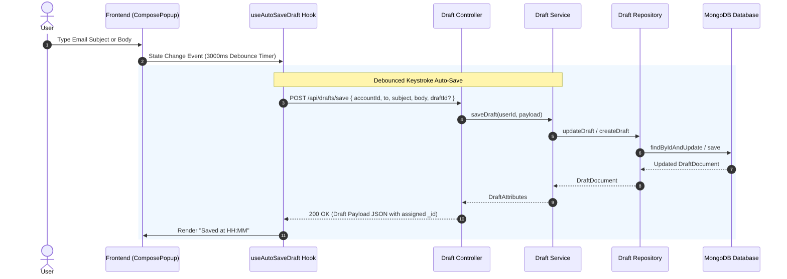
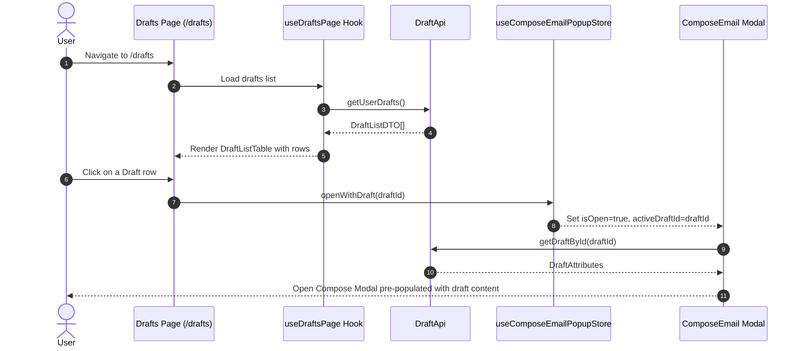

# Email Experience Completion — Phase 4 Implementation Details

> **Feature:** email-experience-completion · **Phase:** 4 (Drafts System)
> **Status:** COMPLETED
> **Created:** 2026-08-24 · **Last Updated:** 2026-08-29

---

## 1. Goal Description & Scope

Establish comprehensive backend and frontend capabilities for draft creation, auto-saving, draft list management, and sending drafts in MailSense.

Specifically, Phase 4 ensures that:

1. **Local MongoDB Draft Engine:** Provides a dedicated `drafts` collection in MongoDB for persisting user drafts locally (`DraftAttributes`), eliminating data loss during compose modal accidental closure or browser refresh.
2. **Debounced Keystroke Auto-Save:** Implements a frontend auto-save mechanism (`useAutoSaveDraft`) that debounces user edits by 3000ms, automatically saving draft title, recipient list, CC/BCC, HTML body content, account binding, and staged attachment references to the backend (`POST /api/drafts/save`).
3. **Compose Modal Draft Integration:** Integrates auto-save status feedback (saving indicator, last saved timestamp) and draft recovery into `ComposeEmailModal` (`ComposeEmail`, `ComposeEmailFooter`, `useComposeEmail`, and `useComposeEmailPopupStore`), allowing seamless auto-saving and opening of existing drafts.
4. **Dedicated Drafts Table & Page View:** Implements a full-featured Drafts table page (`DraftsPage`, `DraftListHeader`, `DraftListTable`, `useDraftsPage`) supporting pagination, recipient and subject search, multi-selection, bulk and single deletion, and one-click draft editing.
5. **Draft Lifecycle & Provider Sending:** Supports re-opening saved drafts from the Drafts list, completing message edits, and sending drafts. Sending a draft dispatches the email via the target provider strategy (`GmailProvider` or `OutlookProvider`), creates a sent `Email` record in MongoDB, and deletes the local draft document atomically upon success.
6. **Navigation & Sidebar Integration:** Adds a "Drafts" folder route in the primary sidebar navigation (`app-sidebar.tsx`, `sidebar.constants.ts`, `routes.ts`) with live draft count badges.

---

## 2. User Review Required & Architectural Notes

> [!IMPORTANT]
> **Draft Storage Strategy, Keystroke Throttle & Provider Isolation**
>
> - **Local MongoDB Storage vs. Provider Sync (MVP Choice):**
>   - **Local Storage (Selected for MVP):** Drafts are saved exclusively in MailSense's MongoDB `drafts` collection. This prevents API rate-limiting issues with Gmail/Outlook when auto-saving frequently on every debounced keystroke and avoids provider sync latencies.
>   - **Future Provider Sync (v3.1+):** Bidirectional provider draft folder synchronization (`syncedToProvider: boolean`) is designed into the contract schema for seamless future expansion.
> - **Auto-Save Debounce & Optimistic ID Resolution:**
>   - The auto-save hook (`useAutoSaveDraft`) monitors compose state changes (`to`, `cc`, `bcc`, `subject`, `body`, `accountId`, `stagedAttachments`).
>   - When auto-save triggers for a newly opened compose window (no initial `draftId`), the backend creates a new `Draft` document and returns its assigned `_id`.
>   - The frontend stores the returned `draftId` in compose state, ensuring that subsequent auto-save triggers perform updates on the existing `Draft` record (`draftId` parameter included in `SaveDraftRequestBody`).
> - **Draft Dispatch & Atomic Deletion:**
>   - Dispatching a draft (`POST /api/drafts/:draftId/send`) invokes `DraftService.sendDraft`, which retrieves the draft document, invokes the target provider strategy to transmit the outbound message via `EmailService.composeEmail`, and upon verified response from the provider API, hard-deletes the draft record from MongoDB (`DraftRepository.deleteDraftById`).
>   - If provider delivery fails (e.g. rate limit, invalid OAuth token), the draft document remains intact in MongoDB so the user does not lose their written email.
> - **User & Account Access Isolation:**
>   - All draft endpoints enforce `authMiddleware`. Draft queries are strictly constrained by `userId: req.user.id`. Users can only view, modify, or delete drafts belonging to their authenticated session.

---

## 3. Component Overview & File Map

| Component | Target File | Action | Purpose |
| --- | --- | --- | --- |
| **Backend Model** | `Backend/src/modules/drafts/draft.model.ts` | [NEW] | Mongoose schema and document interface for local `drafts` collection |
| **Backend Repository** | `Backend/src/modules/drafts/draft.repository.ts` | [NEW] | Database query repository for CRUD operations on `Draft` documents |
| **Backend Service** | `Backend/src/modules/drafts/draft.service.ts` | [NEW] | Business logic for draft saving, listing, retrieval, deletion, and dispatch |
| **Backend Controller** | `Backend/src/modules/drafts/draft.controller.ts` | [NEW] | HTTP route handlers for draft API endpoints |
| **Backend Validation** | `Backend/src/modules/drafts/draft.schema.ts` | [NEW] | Joi validation schemas for draft HTTP request bodies and params |
| **Backend Routes** | `Backend/src/modules/drafts/draft.routes.ts` | [NEW] | Express router mapping draft endpoints with `authMiddleware` |
| **Backend Gateway** | `Backend/src/routes.ts` | [MODIFY] | Register `/drafts` route module with Express router |
| **Frontend Shared** | `Frontend/src/shared/api/endpoints.ts` | [MODIFY] | Export `DRAFTS_API_ENDPOINTS` centralized path constants |
| **Frontend API** | `Frontend/src/features/drafts/api/draft.api.ts` | [NEW] | Axios API wrapper functions for draft endpoints |
| **Frontend Queries** | `Frontend/src/features/drafts/api/draft.queries.ts` | [NEW] | React Query hooks (`useGetUserDraftsQuery`, `useGetDraftByIdQuery`) |
| **Frontend Mutations** | `Frontend/src/features/drafts/api/draft.mutations.ts` | [NEW] | React Query mutations (`useSaveDraftMutation`, `useDeleteDraftMutation`, `useSendDraftMutation`) |
| **Frontend Store** | `Frontend/src/shared/store/composeEmailPopup.store.ts` | [MODIFY] | Add `activeDraftId` state and `openWithDraft` store action |
| **Frontend Custom Hook** | `Frontend/src/features/drafts/hooks/useAutoSaveDraft.ts` | [NEW] | Debounced auto-save hook for compose window |
| **Frontend Custom Hook** | `Frontend/src/features/emails/hooks/useComposeEmail.ts` | [MODIFY] | Integrate draft auto-saving, draft re-opening, and save status in compose hook |
| **Frontend Custom Hook** | `Frontend/src/features/drafts/hooks/useDraftsPage.ts` | [NEW] | Page state hook managing drafts pagination, search, selection, and deletion |
| **Frontend Component** | `Frontend/src/features/emails/components/composeEmail/index.tsx` | [MODIFY] | Compose modal integrating draft auto-save indicator and draft state |
| **Frontend Component** | `Frontend/src/features/emails/components/composeEmail/ComposeEmailFooter.tsx` | [MODIFY] | Compose footer displaying live auto-save status and discard draft action |
| **Frontend Component** | `Frontend/src/features/drafts/components/DraftListHeader.tsx` | [NEW] | Header toolbar with search input, bulk deletion, and draft count |
| **Frontend Component** | `Frontend/src/features/drafts/components/DraftListTable.tsx` | [NEW] | Table component displaying drafts list with checkboxes, row click to open, and delete action |
| **Frontend Page** | `Frontend/src/features/drafts/pages/index.tsx` | [MODIFY] | Drafts page view combining header, table, loader, empty state, and pagination |
| **Frontend Route** | `Frontend/src/app/(home)/drafts/page.tsx` | [NEW] | Next.js App Router page route for `/drafts` |
| **Frontend Navigation** | `Frontend/src/shared/constants/routes.ts` | [MODIFY] | Add `DRAFTS` route constant to `ROUTES` |
| **Frontend Navigation** | `Frontend/src/shared/constants/sidebar.constants.ts` | [MODIFY] | Add Drafts navigation entry in sidebar items |
| **Frontend Navigation** | `Frontend/src/shared/components/sidebar/app-sidebar.tsx` | [MODIFY] | Add Drafts navigation entry with active state |

---

## 4. Main Section 1: Backend Layer Implementation

### 4.1 Schema & Model Layer (`Backend/src/modules/drafts/draft.model.ts`)

#### [NEW] [draft.model.ts](file:///Users/vishaljagamani/Projects/Projects/mailsense/Backend/src/modules/drafts/draft.model.ts)

Create the Mongoose schema for storing drafts in MongoDB:

```typescript
import { DraftAttributes, EmailAttachment } from '@mailsense/types';
import mongoose, { Document, Schema } from 'mongoose';

export interface DraftDocument extends Omit<DraftAttributes, '_id'>, Document {}

export type DraftInput = Omit<DraftAttributes, '_id' | 'createdAt' | 'updatedAt' | 'lastSavedAt'>;

const AttachmentSchema = new Schema<EmailAttachment>(
    {
        attachmentId: { type: String, required: true },
        filename: { type: String, required: true },
        mimeType: { type: String, required: true },
        size: { type: Number, required: true },
        contentId: { type: String, required: false },
        isInline: { type: Boolean, default: false },
    },
    { _id: false },
);

const DraftSchema = new Schema<DraftDocument>(
    {
        userId: { type: String, required: true, index: true },
        accountId: { type: String, required: true, index: true },
        providerDraftId: { type: String, required: false },
        to: { type: [String], default: [] },
        cc: { type: [String], default: [] },
        bcc: { type: [String], default: [] },
        subject: { type: String, default: '' },
        body: { type: String, default: '' },
        bodyPlain: { type: String, default: '' },
        inReplyTo: { type: String, required: false },
        attachments: { type: [AttachmentSchema], default: [] },
        lastSavedAt: { type: Date, default: Date.now },
        syncedToProvider: { type: Boolean, default: false },
    },
    {
        timestamps: true,
    },
);

// Compound indexes for user draft list queries and account filtering
DraftSchema.index({ userId: 1, lastSavedAt: -1 });
DraftSchema.index({ userId: 1, accountId: 1 });

export const DraftModel = mongoose.model<DraftDocument>('Draft', DraftSchema);
```

---

### 4.2 Repository Layer (`Backend/src/modules/drafts/draft.repository.ts`)

#### [NEW] [draft.repository.ts](file:///Users/vishaljagamani/Projects/Projects/mailsense/Backend/src/modules/drafts/draft.repository.ts)

Create `DraftRepository` class providing compiler-enforced data access methods:

```typescript
import { logger } from '@utils';
import { DraftDocument, DraftInput, DraftModel } from './draft.model.js';

export class DraftRepository {
    public static async createDraft(payload: Partial<DraftInput>): Promise<DraftDocument> {
        try {
            const newDraft = new DraftModel({
                ...payload,
                lastSavedAt: new Date(),
                syncedToProvider: false,
            });
            return await newDraft.save();
        } catch (error) {
            const errorMessage = error instanceof Error ? error.message : String(error);
            logger.error(`Error in DraftRepository.createDraft: ${errorMessage}`, { payload, error });
            throw error;
        }
    }

    public static async updateDraft(draftId: string, payload: Partial<DraftInput>): Promise<DraftDocument> {
        try {
            const updated = await DraftModel.findByIdAndUpdate(
                draftId,
                {
                    $set: {
                        ...payload,
                        lastSavedAt: new Date(),
                    },
                },
                { new: true, runValidators: true },
            ).exec();

            if (!updated) {
                throw new Error(`Draft with ID ${draftId} not found for update`);
            }
            return updated;
        } catch (error) {
            const errorMessage = error instanceof Error ? error.message : String(error);
            logger.error(`Error in DraftRepository.updateDraft: ${errorMessage}`, { draftId, payload, error });
            throw error;
        }
    }

    public static async getDraftById(draftId: string, userId: string): Promise<DraftDocument | null> {
        try {
            return await DraftModel.findOne({ _id: draftId, userId }).exec();
        } catch (error) {
            const errorMessage = error instanceof Error ? error.message : String(error);
            logger.error(`Error in DraftRepository.getDraftById: ${errorMessage}`, { draftId, userId, error });
            throw error;
        }
    }

    public static async getDraftsByUserId(userId: string): Promise<DraftDocument[]> {
        try {
            return await DraftModel.find({ userId }).sort({ lastSavedAt: -1 }).exec();
        } catch (error) {
            const errorMessage = error instanceof Error ? error.message : String(error);
            logger.error(`Error in DraftRepository.getDraftsByUserId: ${errorMessage}`, { userId, error });
            throw error;
        }
    }

    public static async deleteDraftById(draftId: string, userId: string): Promise<boolean> {
        try {
            const result = await DraftModel.deleteOne({ _id: draftId, userId }).exec();
            return result.deletedCount > 0;
        } catch (error) {
            const errorMessage = error instanceof Error ? error.message : String(error);
            logger.error(`Error in DraftRepository.deleteDraftById: ${errorMessage}`, { draftId, userId, error });
            throw error;
        }
    }

    public static async deleteDraftsByIds(draftIds: string[], userId: string): Promise<number> {
        try {
            const result = await DraftModel.deleteMany({ _id: { $in: draftIds }, userId }).exec();
            return result.deletedCount;
        } catch (error) {
            const errorMessage = error instanceof Error ? error.message : String(error);
            logger.error(`Error in DraftRepository.deleteDraftsByIds: ${errorMessage}`, { draftIds, userId, error });
            throw error;
        }
    }

    public static async getDraftCountByUserId(userId: string): Promise<number> {
        try {
            return await DraftModel.countDocuments({ userId }).exec();
        } catch (error) {
            const errorMessage = error instanceof Error ? error.message : String(error);
            logger.error(`Error in DraftRepository.getDraftCountByUserId: ${errorMessage}`, { userId, error });
            throw error;
        }
    }
}
```

---

### 4.3 Service Layer (`Backend/src/modules/drafts/draft.service.ts`)

#### [NEW] [draft.service.ts](file:///Users/vishaljagamani/Projects/Projects/mailsense/Backend/src/modules/drafts/draft.service.ts)

Create `DraftService` handling draft saving, listing, retrieval, deletion, and dispatch:

```typescript
import { DraftAttributes, DraftListDTO, SaveDraftRequestBody, SuccessAPIResponse } from '@mailsense/types';
import { EmailService } from '@modules/emails/email.service.js';
import { logger } from '@utils';
import { DraftDocument, DraftInput } from './draft.model.js';
import { DraftRepository } from './draft.repository.js';

export class DraftService {
    private emailService: EmailService;

    constructor() {
        this.emailService = new EmailService();
    }

    public async saveDraft(userId: string, payload: SaveDraftRequestBody): Promise<DraftAttributes> {
        try {
            const draftInput: Partial<DraftInput> = {
                userId,
                accountId: payload.accountId,
                to: payload.to || [],
                cc: payload.cc || [],
                bcc: payload.bcc || [],
                subject: payload.subject || '',
                body: payload.body || '',
                inReplyTo: payload.inReplyTo || undefined,
            };

            if (payload.draftId) {
                // Verify ownership before updating
                const existing = await DraftRepository.getDraftById(payload.draftId, userId);
                if (existing) {
                    const draftDoc = await DraftRepository.updateDraft(payload.draftId, draftInput);
                    return this.formatDraftDocument(draftDoc);
                }
            }

            const draftDoc = await DraftRepository.createDraft(draftInput);
            return this.formatDraftDocument(draftDoc);
        } catch (error) {
            const errorMessage = error instanceof Error ? error.message : String(error);
            logger.error(`Error in DraftService.saveDraft: ${errorMessage}`, { userId, payload, error });
            throw error;
        }
    }

    public async getDraftById(draftId: string, userId: string): Promise<DraftAttributes> {
        try {
            const draftDoc = await DraftRepository.getDraftById(draftId, userId);
            if (!draftDoc) {
                throw new Error(`Draft with ID ${draftId} not found`);
            }
            return this.formatDraftDocument(draftDoc);
        } catch (error) {
            const errorMessage = error instanceof Error ? error.message : String(error);
            logger.error(`Error in DraftService.getDraftById: ${errorMessage}`, { draftId, userId, error });
            throw error;
        }
    }

    public async getUserDrafts(userId: string): Promise<DraftListDTO[]> {
        try {
            const draftDocs = await DraftRepository.getDraftsByUserId(userId);
            return draftDocs.map((doc) => ({
                _id: doc._id.toString(),
                accountId: doc.accountId,
                to: doc.to,
                subject: doc.subject || '(No Subject)',
                lastSavedAt: doc.lastSavedAt,
                snippet: doc.body ? doc.body.replace(/<[^>]*>?/gm, '').substring(0, 120) : '',
                createdAt: doc.createdAt,
                updatedAt: doc.updatedAt,
            }));
        } catch (error) {
            const errorMessage = error instanceof Error ? error.message : String(error);
            logger.error(`Error in DraftService.getUserDrafts: ${errorMessage}`, { userId, error });
            throw error;
        }
    }

    public async deleteDraft(draftId: string, userId: string): Promise<boolean> {
        try {
            const deleted = await DraftRepository.deleteDraftById(draftId, userId);
            if (!deleted) {
                throw new Error(`Draft with ID ${draftId} not found or unauthorized`);
            }
            return true;
        } catch (error) {
            const errorMessage = error instanceof Error ? error.message : String(error);
            logger.error(`Error in DraftService.deleteDraft: ${errorMessage}`, { draftId, userId, error });
            throw error;
        }
    }

    public async sendDraft(draftId: string, userId: string): Promise<SuccessAPIResponse> {
        try {
            const draftDoc = await DraftRepository.getDraftById(draftId, userId);
            if (!draftDoc) {
                throw new Error(`Draft with ID ${draftId} not found or unauthorized`);
            }

            // Dispatch message via EmailService
            const composeResult = await this.emailService.composeEmail(userId, {
                accountId: draftDoc.accountId,
                to: draftDoc.to,
                subject: draftDoc.subject,
                body: draftDoc.body,
                attachmentIds: draftDoc.attachments ? draftDoc.attachments.map((att) => att.attachmentId) : [],
            });

            if (!composeResult || !composeResult._id) {
                throw new Error('Failed to dispatch email from draft');
            }

            // Hard delete local draft document atomically upon verified dispatch
            await DraftRepository.deleteDraftById(draftId, userId);

            return {
                status: true,
                message: 'Draft sent successfully',
            };
        } catch (error) {
            const errorMessage = error instanceof Error ? error.message : String(error);
            logger.error(`Error in DraftService.sendDraft: ${errorMessage}`, { draftId, userId, error });
            throw error;
        }
    }

    private formatDraftDocument(doc: DraftDocument): DraftAttributes {
        try {
            return {
                _id: doc._id.toString(),
                userId: doc.userId,
                accountId: doc.accountId,
                providerDraftId: doc.providerDraftId,
                to: doc.to,
                cc: doc.cc,
                bcc: doc.bcc,
                subject: doc.subject,
                body: doc.body,
                bodyPlain: doc.bodyPlain,
                inReplyTo: doc.inReplyTo,
                attachments: doc.attachments,
                lastSavedAt: doc.lastSavedAt,
                syncedToProvider: doc.syncedToProvider,
                createdAt: doc.createdAt,
                updatedAt: doc.updatedAt,
            };
        } catch (error) {
            const errorMessage = error instanceof Error ? error.message : String(error);
            logger.error(`Error in DraftService.formatDraftDocument: ${errorMessage}`, { error });
            throw error;
        }
    }
}
```

---

### 4.4 Controller Layer (`Backend/src/modules/drafts/draft.controller.ts`)

#### [NEW] [draft.controller.ts](file:///Users/vishaljagamani/Projects/Projects/mailsense/Backend/src/modules/drafts/draft.controller.ts)

Create `DraftController` HTTP handler methods:

```typescript
import { SaveDraftRequestBody } from '@mailsense/types';
import { logger } from '@utils';
import { NextFunction, Request, Response } from 'express';
import { DraftService } from './draft.service.js';

export class DraftController {
    private draftService: DraftService;

    constructor() {
        this.draftService = new DraftService();
    }

    public saveDraft = async (req: Request<object, object, SaveDraftRequestBody>, res: Response, next: NextFunction): Promise<void> => {
        try {
            const userId = req.user?.id;
            if (!userId) {
                throw new Error('User ID is required');
            }
            const draft = await this.draftService.saveDraft(userId, req.body);
            res.status(200).json(draft);
        } catch (error) {
            const errorMessage = error instanceof Error ? error.message : String(error);
            logger.error(`Error in DraftController.saveDraft: ${errorMessage}`, { error });
            next(error);
        }
    };

    public getUserDrafts = async (req: Request, res: Response, next: NextFunction): Promise<void> => {
        try {
            const userId = req.user?.id;
            if (!userId) {
                throw new Error('User ID is required');
            }
            const drafts = await this.draftService.getUserDrafts(userId);
            res.status(200).json(drafts);
        } catch (error) {
            const errorMessage = error instanceof Error ? error.message : String(error);
            logger.error(`Error in DraftController.getUserDrafts: ${errorMessage}`, { error });
            next(error);
        }
    };

    public getDraftById = async (req: Request<{ draftId: string }>, res: Response, next: NextFunction): Promise<void> => {
        try {
            const userId = req.user?.id;
            if (!userId) {
                throw new Error('User ID is required');
            }
            const { draftId } = req.params;
            const draft = await this.draftService.getDraftById(draftId, userId);
            res.status(200).json(draft);
        } catch (error) {
            const errorMessage = error instanceof Error ? error.message : String(error);
            logger.error(`Error in DraftController.getDraftById: ${errorMessage}`, { error });
            next(error);
        }
    };

    public deleteDraft = async (req: Request<{ draftId: string }>, res: Response, next: NextFunction): Promise<void> => {
        try {
            const userId = req.user?.id;
            if (!userId) {
                throw new Error('User ID is required');
            }
            const { draftId } = req.params;
            await this.draftService.deleteDraft(draftId, userId);
            res.status(200).json({ success: true });
        } catch (error) {
            const errorMessage = error instanceof Error ? error.message : String(error);
            logger.error(`Error in DraftController.deleteDraft: ${errorMessage}`, { error });
            next(error);
        }
    };

    public sendDraft = async (req: Request<{ draftId: string }>, res: Response, next: NextFunction): Promise<void> => {
        try {
            const userId = req.user?.id;
            if (!userId) {
                throw new Error('User ID is required');
            }
            const { draftId } = req.params;
            const result = await this.draftService.sendDraft(draftId, userId);
            res.status(200).json(result);
        } catch (error) {
            const errorMessage = error instanceof Error ? error.message : String(error);
            logger.error(`Error in DraftController.sendDraft: ${errorMessage}`, { error });
            next(error);
        }
    };
}
```

---

### 4.5 Validation Schemas & Routes (`Backend/src/modules/drafts/draft.schema.ts`, `draft.routes.ts`)

#### [NEW] [draft.schema.ts](file:///Users/vishaljagamani/Projects/Projects/mailsense/Backend/src/modules/drafts/draft.schema.ts)

```typescript
import Joi from 'joi';

export const saveDraftSchema = Joi.object({
    draftId: Joi.string().optional().allow(''),
    accountId: Joi.string().required(),
    to: Joi.array().items(Joi.string().email()).default([]),
    cc: Joi.array().items(Joi.string().email()).optional(),
    bcc: Joi.array().items(Joi.string().email()).optional(),
    subject: Joi.string().allow('').optional(),
    body: Joi.string().allow('').optional(),
    inReplyTo: Joi.string().optional(),
});

export const draftParamSchema = Joi.object({
    draftId: Joi.string().required(),
});
```

#### [NEW] [draft.routes.ts](file:///Users/vishaljagamani/Projects/Projects/mailsense/Backend/src/modules/drafts/draft.routes.ts)

```typescript
import { authMiddleware, validate } from '@middlewares';
import { Router } from 'express';
import { handleRequest } from 'shared/utils/index.js';
import { DraftController } from './draft.controller.js';
import { draftParamSchema, saveDraftSchema } from './draft.schema.js';

const router = Router();
const draftController = new DraftController();

router.use(authMiddleware);

router.post('/save', validate({ body: saveDraftSchema }), handleRequest(draftController.saveDraft));
router.get('/', handleRequest(draftController.getUserDrafts));
router.get('/:draftId', validate({ params: draftParamSchema }), handleRequest(draftController.getDraftById));
router.delete('/:draftId', validate({ params: draftParamSchema }), handleRequest(draftController.deleteDraft));
router.post('/:draftId/send', validate({ params: draftParamSchema }), handleRequest(draftController.sendDraft));

export default router;
```

---

### 4.6 Module Registration (`Backend/src/routes.ts`)

#### [MODIFY] [routes.ts](file:///Users/vishaljagamani/Projects/Projects/mailsense/Backend/src/routes.ts)

Mount `draftRoutes` under `/drafts`:

```typescript
import draftRoutes from '@modules/drafts/draft.routes.js';

// Registered with Express router
router.use('/drafts', draftRoutes);
```

---

## 5. Main Section 2: Frontend Layer Implementation

### 5.1 Endpoints & API Client (`Frontend/src/shared/api/endpoints.ts`, `Frontend/src/features/drafts/api/draft.api.ts`)

#### [MODIFY] [endpoints.ts](file:///Users/vishaljagamani/Projects/Projects/mailsense/Frontend/src/shared/api/endpoints.ts)

```typescript
export const DRAFTS_API_ENDPOINTS = {
    BASE: '/drafts',
    SAVE: '/drafts/save',
    DETAILS: (draftId: string) => `/drafts/${draftId}`,
    SEND: (draftId: string) => `/drafts/${draftId}/send`,
} as const;
```

#### [NEW] [draft.api.ts](file:///Users/vishaljagamani/Projects/Projects/mailsense/Frontend/src/features/drafts/api/draft.api.ts)

```typescript
import { DraftAttributes, DraftListDTO, SaveDraftRequestBody, SuccessAPIResponse } from '@mailsense/types';
import { axiosClient, DRAFTS_API_ENDPOINTS } from '@shared/api';

export async function saveDraft(payload: SaveDraftRequestBody): Promise<DraftAttributes> {
    try {
        const { data } = await axiosClient.post<DraftAttributes>(DRAFTS_API_ENDPOINTS.SAVE, payload);
        return data;
    } catch (error) {
        const errorMessage = error instanceof Error ? error.message : String(error);
        console.error(`Error in saveDraft: ${errorMessage}`, { error });
        throw error;
    }
}

export async function getUserDrafts(): Promise<DraftListDTO[]> {
    try {
        const { data } = await axiosClient.get<DraftListDTO[]>(DRAFTS_API_ENDPOINTS.BASE);
        return data;
    } catch (error) {
        const errorMessage = error instanceof Error ? error.message : String(error);
        console.error(`Error in getUserDrafts: ${errorMessage}`, { error });
        throw error;
    }
}

export async function getDraftById(draftId: string): Promise<DraftAttributes> {
    try {
        const { data } = await axiosClient.get<DraftAttributes>(DRAFTS_API_ENDPOINTS.DETAILS(draftId));
        return data;
    } catch (error) {
        const errorMessage = error instanceof Error ? error.message : String(error);
        console.error(`Error in getDraftById: ${errorMessage}`, { draftId, error });
        throw error;
    }
}

export async function deleteDraft(draftId: string): Promise<SuccessAPIResponse> {
    try {
        const { data } = await axiosClient.delete<SuccessAPIResponse>(DRAFTS_API_ENDPOINTS.DETAILS(draftId));
        return data;
    } catch (error) {
        const errorMessage = error instanceof Error ? error.message : String(error);
        console.error(`Error in deleteDraft: ${errorMessage}`, { draftId, error });
        throw error;
    }
}

export async function sendDraft(draftId: string): Promise<SuccessAPIResponse> {
    try {
        const { data } = await axiosClient.post<SuccessAPIResponse>(DRAFTS_API_ENDPOINTS.SEND(draftId));
        return data;
    } catch (error) {
        const errorMessage = error instanceof Error ? error.message : String(error);
        console.error(`Error in sendDraft: ${errorMessage}`, { draftId, error });
        throw error;
    }
}
```

---

### 5.2 React Query Hooks (`Frontend/src/features/drafts/api/draft.queries.ts`, `draft.mutations.ts`)

#### [NEW] [draft.queries.ts](file:///Users/vishaljagamani/Projects/Projects/mailsense/Frontend/src/features/drafts/api/draft.queries.ts)

```typescript
import { DraftAttributes, DraftListDTO } from '@mailsense/types';
import { useQuery, UseQueryResult } from '@tanstack/react-query';
import { getDraftById, getUserDrafts } from './draft.api';

export const DRAFT_QUERY_KEYS = {
    all: ['drafts'] as const,
    list: () => [...DRAFT_QUERY_KEYS.all, 'list'] as const,
    detail: (draftId: string) => [...DRAFT_QUERY_KEYS.all, 'detail', draftId] as const,
};

export const useGetUserDraftsQuery = (): UseQueryResult<DraftListDTO[], Error> => {
    return useQuery<DraftListDTO[], Error>({
        queryKey: DRAFT_QUERY_KEYS.list(),
        queryFn: async () => {
            try {
                return await getUserDrafts();
            } catch (error) {
                console.error('Error in useGetUserDraftsQuery', error);
                throw error;
            }
        },
    });
};

export const useGetDraftByIdQuery = (draftId: string, enabled: boolean = true): UseQueryResult<DraftAttributes, Error> => {
    return useQuery<DraftAttributes, Error>({
        queryKey: DRAFT_QUERY_KEYS.detail(draftId),
        queryFn: async () => {
            try {
                return await getDraftById(draftId);
            } catch (error) {
                console.error('Error in useGetDraftByIdQuery', error);
                throw error;
            }
        },
        enabled: Boolean(draftId) && enabled,
    });
};
```

#### [NEW] [draft.mutations.ts](file:///Users/vishaljagamani/Projects/Projects/mailsense/Frontend/src/features/drafts/api/draft.mutations.ts)

```typescript
import { DraftAttributes, SaveDraftRequestBody, SuccessAPIResponse } from '@mailsense/types';
import { useMutation, UseMutationResult, useQueryClient } from '@tanstack/react-query';
import { deleteDraft, saveDraft, sendDraft } from './draft.api';
import { DRAFT_QUERY_KEYS } from './draft.queries';

export const useSaveDraftMutation = (): UseMutationResult<DraftAttributes, Error, SaveDraftRequestBody> => {
    const queryClient = useQueryClient();
    return useMutation<DraftAttributes, Error, SaveDraftRequestBody>({
        mutationFn: async (payload) => {
            try {
                return await saveDraft(payload);
            } catch (error) {
                console.error('Error in useSaveDraftMutation', error);
                throw error;
            }
        },
        onSuccess: () => {
            queryClient.invalidateQueries({ queryKey: DRAFT_QUERY_KEYS.list() });
        },
    });
};

export const useDeleteDraftMutation = (): UseMutationResult<SuccessAPIResponse, Error, string> => {
    const queryClient = useQueryClient();
    return useMutation<SuccessAPIResponse, Error, string>({
        mutationFn: async (draftId) => {
            try {
                return await deleteDraft(draftId);
            } catch (error) {
                console.error('Error in useDeleteDraftMutation', error);
                throw error;
            }
        },
        onSuccess: () => {
            queryClient.invalidateQueries({ queryKey: DRAFT_QUERY_KEYS.all });
        },
    });
};

export const useSendDraftMutation = (): UseMutationResult<SuccessAPIResponse, Error, string> => {
    const queryClient = useQueryClient();
    return useMutation<SuccessAPIResponse, Error, string>({
        mutationFn: async (draftId) => {
            try {
                return await sendDraft(draftId);
            } catch (error) {
                console.error('Error in useSendDraftMutation', error);
                throw error;
            }
        },
        onSuccess: () => {
            queryClient.invalidateQueries({ queryKey: DRAFT_QUERY_KEYS.all });
            queryClient.invalidateQueries({ queryKey: ['emails'] });
        },
    });
};
```

---

### 5.3 Custom Hooks & State

#### [MODIFY] [composeEmailPopup.store.ts](file:///Users/vishaljagamani/Projects/Projects/mailsense/Frontend/src/shared/store/composeEmailPopup.store.ts)

Update the Compose store to maintain `activeDraftId` and support opening a specific draft:

```typescript
import { create } from 'zustand';

export interface ComposeEmailPopupStore {
    isOpen: boolean;
    activeDraftId?: string;
    openCompose: () => void;
    openWithDraft: (draftId: string) => void;
    closeCompose: () => void;
    toggleCompose: (isOpen: boolean) => void;
}

export const useComposeEmailPopupStore = create<ComposeEmailPopupStore>((set) => ({
    isOpen: false,
    activeDraftId: undefined,
    openCompose: () => set({ isOpen: true, activeDraftId: undefined }),
    openWithDraft: (draftId: string) => set({ isOpen: true, activeDraftId: draftId }),
    closeCompose: () => set({ isOpen: false, activeDraftId: undefined }),
    toggleCompose: (isOpen: boolean) => set({ isOpen, activeDraftId: undefined }),
}));
```

---

#### [NEW] [useAutoSaveDraft.ts](file:///Users/vishaljagamani/Projects/Projects/mailsense/Frontend/src/features/drafts/hooks/useAutoSaveDraft.ts)

Create auto-save debounced hook monitoring compose state:

```typescript
import { ComposeEmailRequestBody } from '@mailsense/types';
import { useEffect, useRef, useState } from 'react';
import { useSaveDraftMutation } from '../api/draft.mutations';

export interface UseAutoSaveDraftParams {
    composeBody: ComposeEmailRequestBody;
    isOpen: boolean;
    activeDraftId?: string;
    onDraftSaved?: (draftId: string) => void;
}

export interface UseAutoSaveDraftResult {
    draftId: string | undefined;
    isSaving: boolean;
    lastSavedAt: Date | null;
}

export const useAutoSaveDraft = ({
    composeBody,
    isOpen,
    activeDraftId,
    onDraftSaved,
}: UseAutoSaveDraftParams): UseAutoSaveDraftResult => {
    const [draftId, setDraftId] = useState<string | undefined>(activeDraftId);
    const [lastSavedAt, setLastSavedAt] = useState<Date | null>(null);
    const { mutate: saveDraft, isPending: isSaving, data: saveDraftData } = useSaveDraftMutation();
    const timeoutRef = useRef<NodeJS.Timeout | null>(null);

    useEffect(() => {
        setDraftId(activeDraftId);
    }, [activeDraftId]);

    useEffect(() => {
        if (!isOpen) return;

        // Skip saving if content is completely empty
        const hasContent = Boolean(
            composeBody.accountId &&
                (composeBody.subject?.trim() || composeBody.body?.trim() || (composeBody.to && composeBody.to.length > 0)),
        );

        if (!hasContent) return;

        if (timeoutRef.current) {
            clearTimeout(timeoutRef.current);
        }

        timeoutRef.current = setTimeout(() => {
            try {
                saveDraft({
                    draftId,
                    accountId: composeBody.accountId,
                    to: composeBody.to || [],
                    cc: composeBody.cc,
                    bcc: composeBody.bcc,
                    subject: composeBody.subject || '',
                    body: composeBody.body || '',
                    inReplyTo: composeBody.inReplyTo,
                });
            } catch (error) {
                console.error('Auto-save draft execution error', error);
            }
        }, 3000);

        return () => {
            if (timeoutRef.current) {
                clearTimeout(timeoutRef.current);
            }
        };
    }, [composeBody, isOpen, draftId, saveDraft, onDraftSaved]);

    useEffect(() => {
        if (saveDraftData) {
            setDraftId(saveDraftData._id);
            setLastSavedAt(new Date(saveDraftData.lastSavedAt));
            if (onDraftSaved) {
                onDraftSaved(saveDraftData._id);
            }
        }
    }, [saveDraftData, onDraftSaved]);

    return { draftId, isSaving, lastSavedAt };
};
```

---

#### [MODIFY] [useComposeEmail.ts](file:///Users/vishaljagamani/Projects/Projects/mailsense/Frontend/src/features/emails/hooks/useComposeEmail.ts)

Integrate draft retrieval, auto-saving, save indicator feedback, and draft dispatch into `useComposeEmail`:

```typescript
import { useCallback, useEffect, useState } from 'react';

import { useGetAccountsQuery } from '@features/accounts/api/accounts.queries';
import { useGetDraftByIdQuery } from '@features/drafts/api/draft.queries';
import { useDeleteDraftMutation, useSendDraftMutation } from '@features/drafts/api/draft.mutations';
import { useAutoSaveDraft } from '@features/drafts/hooks/useAutoSaveDraft';
import { ComposeEmailRequestBody, UploadAttachmentResponse } from '@mailsense/types';
import { axiosClient } from '@shared/api';
import { MESSAGES, UI_CONSTANTS } from '@shared/constants';
import { UseDebounceQuery } from '@shared/hooks';
import { useAuthStore, useComposeEmailPopupStore } from '@shared/store';
import { toast } from 'sonner';
import { useComposeEmailMutation, useSearchOtherContactsMutation } from '../api/email.mutations';

export const useComposeEmail = () => {
    const user = useAuthStore((state) => state.user);
    const { isOpen, activeDraftId, closeCompose } = useComposeEmailPopupStore();

    const [isToFocused, setIsToFocused] = useState<boolean>(false);
    const [composeEmailBody, setComposeEmailBody] = useState<ComposeEmailRequestBody>({
        accountId: '',
        to: [],
        subject: '',
        body: '',
    });
    const [toEmailSearchText, setToEmailSearchText] = useState<string>('');
    const debouncedToEmailSearchText = UseDebounceQuery({ text: toEmailSearchText });
    const [stagedAttachments, setStagedAttachments] = useState<UploadAttachmentResponse['attachment'][]>([]);
    const [isUploadingAttachment, setIsUploadingAttachment] = useState<boolean>(false);

    const { data: accounts } = useGetAccountsQuery(user?.id ?? '');
    const { mutate: searchOtherContacts, data: searchOtherContactsData } = useSearchOtherContactsMutation();
    const { mutate: composeEmail, data: composeEmailData, isPending: composeEmailLoading, error: composeEmailError } = useComposeEmailMutation();
    const { mutate: sendDraft, isPending: sendDraftLoading } = useSendDraftMutation();
    const { mutate: deleteDraft } = useDeleteDraftMutation();

    // Query draft content if opening an existing draft
    const { data: existingDraftData, isLoading: isDraftLoading } = useGetDraftByIdQuery(activeDraftId || '', Boolean(activeDraftId && isOpen));

    // Auto-save debounced hook
    const { draftId, isSaving: isSavingDraft, lastSavedAt } = useAutoSaveDraft({
        composeBody: composeEmailBody,
        isOpen,
        activeDraftId,
    });

    // Populate compose form when existing draft is loaded
    useEffect(() => {
        if (existingDraftData && isOpen) {
            setComposeEmailBody({
                accountId: existingDraftData.accountId,
                to: existingDraftData.to || [],
                cc: existingDraftData.cc || [],
                bcc: existingDraftData.bcc || [],
                subject: existingDraftData.subject || '',
                body: existingDraftData.body || '',
                inReplyTo: existingDraftData.inReplyTo,
            });

            if (existingDraftData.attachments && existingDraftData.attachments.length > 0) {
                setStagedAttachments(
                    existingDraftData.attachments.map((att) => ({
                        attachmentId: att.attachmentId,
                        filename: att.filename,
                        mimeType: att.mimeType,
                        size: att.size,
                        createdAt: new Date(),
                    })),
                );
            }
        }
    }, [existingDraftData, isOpen]);

    useEffect(() => {
        const q = debouncedToEmailSearchText?.trim() ?? '';
        if (q.length > 2) {
            searchOtherContacts(q);
        }
    }, [debouncedToEmailSearchText, searchOtherContacts]);

    const handleClose = useCallback(() => {
        closeCompose();
        setComposeEmailBody({ accountId: '', to: [], subject: '', body: '' });
        setStagedAttachments([]);
        setToEmailSearchText('');
    }, [closeCompose]);

    const handleDiscardDraft = useCallback(() => {
        try {
            const currentDraftId = draftId || activeDraftId;
            if (currentDraftId) {
                deleteDraft(currentDraftId, {
                    onSuccess: () => toast.success('Draft discarded'),
                    onError: () => toast.error('Failed to discard draft'),
                });
            }
            handleClose();
        } catch (error) {
            console.error('Error discarding draft', error);
            handleClose();
        }
    }, [draftId, activeDraftId, deleteDraft, handleClose]);

    useEffect(() => {
        if (composeEmailData) {
            toast.success(MESSAGES.EMAILS.SEND_EMAIL_SUCCESS, { duration: UI_CONSTANTS.TOAST.DURATION });
            handleClose();
        }
        if (composeEmailError) {
            toast.error(MESSAGES.EMAILS.SEND_EMAIL_ERROR, { duration: UI_CONSTANTS.TOAST.DURATION });
        }
    }, [composeEmailData, composeEmailError, handleClose]);

    useEffect(() => {
        if (accounts && accounts.length > 0 && !composeEmailBody.accountId && !activeDraftId) {
            setComposeEmailBody((prev) => ({ ...prev, accountId: accounts[0]._id }));
        }
    }, [accounts, composeEmailBody.accountId, activeDraftId]);

    const handleFileUpload = async (event: React.ChangeEvent<HTMLInputElement>): Promise<void> => {
        try {
            const files = event.target.files;
            if (!files || files.length === 0) return;

            let targetAccountId = composeEmailBody.accountId;
            if (!targetAccountId && accounts && accounts.length > 0) {
                targetAccountId = accounts[0]._id;
                setComposeEmailBody((prev) => ({ ...prev, accountId: targetAccountId }));
            }

            if (!targetAccountId) {
                toast.error('Please select or connect an account first');
                event.target.value = '';
                return;
            }

            setIsUploadingAttachment(true);
            for (let i = 0; i < files.length; i++) {
                const formData = new FormData();
                formData.append('file', files[i]);
                formData.append('accountId', targetAccountId);

                const res = await axiosClient.post<UploadAttachmentResponse>('/attachments/upload', formData, {
                    headers: { 'Content-Type': 'multipart/form-data' },
                });

                const attachmentData = res.data?.attachment || (res.data as Record<string, unknown>);
                const attachmentId = attachmentData?.attachmentId || (attachmentData as Record<string, unknown>)?._id;

                if (attachmentData && attachmentId) {
                    setStagedAttachments((prev) => [
                        ...prev,
                        {
                            attachmentId: String(attachmentId),
                            filename: String(attachmentData.filename || 'attachment'),
                            mimeType: String(attachmentData.mimeType || 'application/octet-stream'),
                            size: Number(attachmentData.size || 0),
                            createdAt: (attachmentData.createdAt as Date) || new Date(),
                        },
                    ]);
                }
            }
        } catch (err) {
            toast.error('Failed to upload attachment');
        } finally {
            setIsUploadingAttachment(false);
            event.target.value = '';
        }
    };

    const handleRemoveStagedAttachment = async (attachmentId: string): Promise<void> => {
        try {
            await axiosClient.delete(`/attachments/${attachmentId}`);
            setStagedAttachments((prev) => prev.filter((att) => att.attachmentId !== attachmentId));
        } catch (err) {
            setStagedAttachments((prev) => prev.filter((att) => att.attachmentId !== attachmentId));
        }
    };

    const sendEmail = async (): Promise<void> => {
        try {
            const currentDraftId = draftId || activeDraftId;
            if (currentDraftId) {
                sendDraft(currentDraftId, {
                    onSuccess: () => {
                        toast.success(MESSAGES.EMAILS.SEND_EMAIL_SUCCESS, { duration: UI_CONSTANTS.TOAST.DURATION });
                        handleClose();
                    },
                    onError: () => {
                        toast.error(MESSAGES.EMAILS.SEND_EMAIL_ERROR, { duration: UI_CONSTANTS.TOAST.DURATION });
                    },
                });
            } else {
                composeEmail({
                    accountId: composeEmailBody.accountId,
                    to: composeEmailBody.to,
                    subject: composeEmailBody.subject,
                    body: composeEmailBody.body,
                    attachmentIds: stagedAttachments.map((att) => att.attachmentId),
                });
            }
        } catch (error) {
            console.error('Error sending email', error);
            toast.error(MESSAGES.EMAILS.SEND_EMAIL_ERROR, { duration: UI_CONSTANTS.TOAST.DURATION });
        }
    };

    return {
        accounts: { data: accounts },
        searchOtherContacts: { data: searchOtherContactsData },
        composeEmail: { isLoading: composeEmailLoading || sendDraftLoading || isDraftLoading },
        action: { handleClose, handleDiscardDraft, sendEmail, handleFileUpload, handleRemoveStagedAttachment },
        states: {
            isOpen,
            isToFocused,
            composeEmailBody,
            toEmailSearchText,
            debouncedToEmailSearchText,
            stagedAttachments,
            isUploadingAttachment,
            isSavingDraft,
            lastSavedAt,
            draftId: draftId || activeDraftId,
        },
        setter: { setIsToFocused, setComposeEmailBody, setToEmailSearchText },
    };
};
```

---

#### [NEW] [useDraftsPage.ts](file:///Users/vishaljagamani/Projects/Projects/mailsense/Frontend/src/features/drafts/hooks/useDraftsPage.ts)

Create the Drafts page custom hook managing queries, search filtering, multi-select, and pagination:

```typescript
import { DraftListDTO } from '@mailsense/types';
import { EMAILS_PAGE_SIZE } from '@shared/constants';
import { UseDebounceQuery } from '@shared/hooks';
import { useBreadcrumbStore, useComposeEmailPopupStore } from '@shared/store';
import { useEffect, useMemo, useState } from 'react';
import { toast } from 'sonner';
import { useDeleteDraftMutation } from '../api/draft.mutations';
import { useGetUserDraftsQuery } from '../api/draft.queries';

export interface UseDraftsPageResult {
    drafts: {
        data: DraftListDTO[];
        total: number;
        isLoading: boolean;
        isError: boolean;
        refetch: () => void;
    };
    actions: {
        handleDraftSelect: (draftIds: string[]) => void;
        handlePageSizeChange: (newPageSize: number) => void;
        handleResetPage: () => void;
        handleResetSelection: () => void;
        handleDeleteDraft: (draftId: string) => Promise<void>;
        handleBulkDelete: () => Promise<void>;
        handleOpenDraft: (draftId: string) => void;
    };
    states: {
        selectedDrafts: string[];
        page: number;
        pageSize: number;
        searchValue: string;
        isDeleting: boolean;
    };
    setters: {
        setPage: (page: number) => void;
        setSearchValue: (val: string) => void;
    };
}

export const useDraftsPage = (): UseDraftsPageResult => {
    const { data: userDraftsData, isLoading: userDraftsLoading, isError: userDraftsError, refetch } = useGetUserDraftsQuery();
    const { mutateAsync: deleteDraftMutate, isPending: isDeleting } = useDeleteDraftMutation();
    const { openWithDraft } = useComposeEmailPopupStore();

    const [page, setPage] = useState<number>(1);
    const [pageSize, setPageSize] = useState<number>(EMAILS_PAGE_SIZE);
    const [searchValue, setSearchValue] = useState<string>('');
    const [selectedDrafts, setSelectedDrafts] = useState<string[]>([]);
    const debouncedSearchValue = UseDebounceQuery({ text: searchValue, delay: 300 });

    useEffect(() => {
        try {
            useBreadcrumbStore.setState({ items: [{ title: 'Drafts', url: '/drafts' }] });
        } catch (error) {
            console.error('Error setting breadcrumbs in useDraftsPage', error);
        }
    }, []);

    // Filter drafts based on search query
    const filteredDrafts = useMemo(() => {
        if (!userDraftsData) return [];
        const q = (debouncedSearchValue || '').trim().toLowerCase();
        if (!q) return userDraftsData;

        return userDraftsData.filter((draft) => {
            const matchesSubject = draft.subject?.toLowerCase().includes(q);
            const matchesRecipient = draft.to?.some((recipient) => recipient.toLowerCase().includes(q));
            const matchesSnippet = draft.snippet?.toLowerCase().includes(q);
            return matchesSubject || matchesRecipient || matchesSnippet;
        });
    }, [userDraftsData, debouncedSearchValue]);

    // Paginate filtered drafts
    const paginatedDrafts = useMemo(() => {
        const startIndex = (page - 1) * pageSize;
        return filteredDrafts.slice(startIndex, startIndex + pageSize);
    }, [filteredDrafts, page, pageSize]);

    const handleDraftSelect = (draftIds: string[]) => {
        try {
            setSelectedDrafts(draftIds);
        } catch (error) {
            console.error('Error in handleDraftSelect', error);
        }
    };

    const handlePageSizeChange = (newPageSize: number) => {
        try {
            setPageSize(newPageSize);
            setPage(1);
        } catch (error) {
            console.error('Error in handlePageSizeChange', error);
        }
    };

    const handleResetPage = () => {
        try {
            setPage(1);
        } catch (error) {
            console.error('Error in handleResetPage', error);
        }
    };

    const handleResetSelection = () => {
        try {
            setSelectedDrafts([]);
        } catch (error) {
            console.error('Error in handleResetSelection', error);
        }
    };

    const handleDeleteDraft = async (draftId: string): Promise<void> => {
        try {
            const res = await deleteDraftMutate(draftId);
            if (res && res.status) {
                toast.success('Draft deleted successfully');
                setSelectedDrafts((prev) => prev.filter((id) => id !== draftId));
                refetch();
            } else {
                toast.error('Failed to delete draft');
            }
        } catch (error) {
            console.error('Error deleting draft', error);
            toast.error('Error deleting draft');
        }
    };

    const handleBulkDelete = async (): Promise<void> => {
        try {
            if (selectedDrafts.length === 0) return;
            for (const draftId of selectedDrafts) {
                await deleteDraftMutate(draftId);
            }
            toast.success(`${selectedDrafts.length} drafts deleted successfully`);
            setSelectedDrafts([]);
            refetch();
        } catch (error) {
            console.error('Error in bulk draft deletion', error);
            toast.error('Failed to delete selected drafts');
        }
    };

    const handleOpenDraft = (draftId: string) => {
        try {
            openWithDraft(draftId);
        } catch (error) {
            console.error('Error opening draft in compose modal', error);
        }
    };

    return {
        drafts: {
            data: paginatedDrafts,
            total: filteredDrafts.length,
            isLoading: userDraftsLoading,
            isError: userDraftsError,
            refetch,
        },
        actions: {
            handleDraftSelect,
            handlePageSizeChange,
            handleResetPage,
            handleResetSelection,
            handleDeleteDraft,
            handleBulkDelete,
            handleOpenDraft,
        },
        states: {
            selectedDrafts,
            page,
            pageSize,
            searchValue,
            isDeleting,
        },
        setters: {
            setPage,
            setSearchValue,
        },
    };
};
```

---

### 5.4 UI Components & Page Integration

#### [MODIFY] [index.tsx](file:///Users/vishaljagamani/Projects/Projects/mailsense/Frontend/src/features/emails/components/composeEmail/index.tsx)

Update the compose modal to render live auto-save status and draft lifecycle:

```typescript
'use client';

import { Paperclip, X } from 'lucide-react';
import React from 'react';

import RichTextEditor from '@features/emails/components/rich-text-editor';
import { useComposeEmail } from '@features/emails/hooks';
import APILoader from '@shared/components/apiLoader';
import { useIsMobile } from '@shared/hooks';
import ComposeEmailFooter from './ComposeEmailFooter';
import ComposeEmailHeader from './ComposeEmailHeader';

const ComposeEmail: React.FC = () => {
    const isMobile = useIsMobile();

    const {
        accounts: { data: accountsData },
        searchOtherContacts: { data: searchOtherContactsData },
        composeEmail: { isLoading: composeEmailLoading },
        action: { handleClose, handleDiscardDraft, sendEmail, handleFileUpload, handleRemoveStagedAttachment },
        states: {
            isOpen,
            isToFocused,
            composeEmailBody,
            toEmailSearchText,
            debouncedToEmailSearchText,
            stagedAttachments,
            isUploadingAttachment,
            isSavingDraft,
            lastSavedAt,
        },
        setter: { setIsToFocused, setComposeEmailBody, setToEmailSearchText },
    } = useComposeEmail();

    if (!isOpen) {
        return null;
    }

    return (
        <div className="bg-secondary fixed right-4 bottom-0 z-50 flex h-3/4 w-5/6 flex-col rounded-t-lg shadow-2xl md:w-1/3">
            <APILoader show={composeEmailLoading} size="small" />
            <div className="bg-sidebar flex items-center justify-between rounded-t-lg p-2 px-3">
                <div className="flex items-center gap-2">
                    <p className="text-xs font-bold md:text-sm">New Message</p>
                    {isSavingDraft ? (
                        <span className="text-[11px] text-muted-foreground animate-pulse">Saving draft...</span>
                    ) : lastSavedAt ? (
                        <span className="text-[11px] text-muted-foreground">
                            Saved {lastSavedAt.toLocaleTimeString([], { hour: '2-digit', minute: '2-digit' })}
                        </span>
                    ) : null}
                </div>
                <X className="size-4 cursor-pointer" strokeWidth={isMobile ? 2 : 3} onClick={handleClose} />
            </div>

            <ComposeEmailHeader
                composeEmailBody={composeEmailBody}
                setComposeEmailBody={setComposeEmailBody}
                isToFocused={isToFocused}
                setIsToFocused={setIsToFocused}
                toEmailSearchText={toEmailSearchText}
                setToEmailSearchText={setToEmailSearchText}
                searchOtherContactsData={searchOtherContactsData || null}
                debouncedToEmailSearchText={debouncedToEmailSearchText}
            />
            <div className="min-h-0 flex-1 overflow-hidden p-2 pr-0 pb-0">
                <RichTextEditor
                    content={composeEmailBody.body || ''}
                    onContentChange={(content) => setComposeEmailBody({ ...composeEmailBody, body: content })}
                    placeholder="Write your email..."
                />
            </div>
            {/* Render Staged Attachment Chips */}
            {stagedAttachments && stagedAttachments.length > 0 && (
                <div className="border-border bg-sidebar/50 flex flex-wrap gap-2 border-t px-3 py-2">
                    {stagedAttachments.map((att) => (
                        <div
                            key={att.attachmentId}
                            className="bg-secondary text-secondary-foreground flex items-center gap-1.5 rounded-md px-2.5 py-1 text-xs font-medium"
                        >
                            <Paperclip className="text-muted-foreground size-3" />
                            <span className="max-w-[150px] truncate">{att.filename}</span>
                            <span className="text-muted-foreground text-[10px]">({(att.size / 1024).toFixed(1)} KB)</span>
                            <X
                                className="hover:text-destructive size-3 cursor-pointer"
                                onClick={() => handleRemoveStagedAttachment(att.attachmentId)}
                            />
                        </div>
                    ))}
                </div>
            )}
            <ComposeEmailFooter
                accountsData={accountsData || []}
                composeEmailBody={composeEmailBody}
                setComposeEmailBody={setComposeEmailBody}
                handleClose={handleClose}
                handleDiscardDraft={handleDiscardDraft}
                sendEmail={sendEmail}
                isUploadingAttachment={isUploadingAttachment}
                handleFileUpload={handleFileUpload}
            />
        </div>
    );
};

export default ComposeEmail;
```

---

#### [MODIFY] [ComposeEmailFooter.tsx](file:///Users/vishaljagamani/Projects/Projects/mailsense/Frontend/src/features/emails/components/composeEmail/ComposeEmailFooter.tsx)

```typescript
'use client';

import React, { useRef } from 'react';

import { AccountProviderIcon } from '@entities/account';
import { AccountAttributes, ComposeEmailRequestBody } from '@mailsense/types';
import { useIsMobile } from '@shared/hooks';
import { Button } from '@shared/ui/button';
import { Select, SelectContent, SelectItem, SelectTrigger, SelectValue } from '@shared/ui/select';
import { Loader2, Paperclip, Trash2 } from 'lucide-react';

export interface ComposeEmailFooterProps {
    accountsData: AccountAttributes[];
    composeEmailBody: ComposeEmailRequestBody;
    setComposeEmailBody: (body: ComposeEmailRequestBody) => void;
    sendEmail: () => Promise<void>;
    handleClose: () => void;
    handleDiscardDraft: () => void;
    isUploadingAttachment: boolean;
    handleFileUpload: (event: React.ChangeEvent<HTMLInputElement>) => Promise<void>;
}

const ComposeEmailFooter: React.FC<ComposeEmailFooterProps> = ({
    accountsData,
    composeEmailBody,
    setComposeEmailBody,
    sendEmail,
    handleDiscardDraft,
    isUploadingAttachment,
    handleFileUpload,
}) => {
    const isMobile = useIsMobile();
    const fileInputRef = useRef<HTMLInputElement | null>(null);

    const handlePaperclipClick = () => {
        try {
            if (!composeEmailBody?.accountId && accountsData && accountsData.length > 0) {
                setComposeEmailBody({ ...composeEmailBody, accountId: accountsData[0]._id });
            }
            fileInputRef.current?.click();
        } catch (error) {
            console.error('Error handling paperclip click', error);
        }
    };

    return (
        <div className="flex items-center justify-between md:p-2">
            <div className="flex w-full items-center">
                <div className="my-2 flex w-3/6 px-2">
                    <Select
                        value={composeEmailBody?.accountId || ''}
                        onValueChange={(value) => setComposeEmailBody({ ...composeEmailBody, accountId: value })}
                    >
                        <SelectTrigger className="w-full">
                            <SelectValue placeholder="Select account" className="text-xs" />
                        </SelectTrigger>
                        <SelectContent position="popper">
                            {accountsData &&
                                accountsData.map((item, index) => {
                                    return (
                                        <SelectItem key={index + 1} value={item?._id} className="text-xs">
                                            <AccountProviderIcon provider={item.provider} className="size-4" />
                                            {item?.emailAddress}
                                        </SelectItem>
                                    );
                                })}
                        </SelectContent>
                    </Select>
                </div>
                <Button className="cursor-pointer rounded-lg px-6 font-bold" onClick={sendEmail} disabled={isUploadingAttachment}>
                    Send
                </Button>
                <input type="file" ref={fileInputRef} className="hidden" multiple onChange={handleFileUpload} />
                <Button
                    type="button"
                    variant="ghost"
                    size="icon"
                    className="ml-2 cursor-pointer"
                    onClick={handlePaperclipClick}
                    disabled={isUploadingAttachment}
                >
                    {isUploadingAttachment ? <Loader2 className="size-4 animate-spin" /> : <Paperclip className="size-4" />}
                </Button>
            </div>
            <Trash2
                className={`cursor-pointer text-muted-foreground hover:text-destructive transition-colors ${
                    isMobile ? 'size-6' : 'size-4'
                }`}
                title="Discard draft"
                onClick={handleDiscardDraft}
            />
        </div>
    );
};

export default ComposeEmailFooter;
```

---

#### [NEW] [DraftListHeader.tsx](file:///Users/vishaljagamani/Projects/Projects/mailsense/Frontend/src/features/drafts/components/DraftListHeader.tsx)

Create header toolbar with search bar, draft count, and bulk actions:

```typescript
'use client';

import { Search, Trash2 } from 'lucide-react';
import React from 'react';

import { Button } from '@shared/ui/button';
import { Input } from '@shared/ui/input';

export interface DraftListHeaderProps {
    searchValue: string;
    setSearchValue: (value: string) => void;
    selectedDrafts: string[];
    totalDrafts: number;
    handleBulkDelete: () => Promise<void>;
    handleResetPage: () => void;
}

export const DraftListHeader: React.FC<DraftListHeaderProps> = ({
    searchValue,
    setSearchValue,
    selectedDrafts,
    totalDrafts,
    handleBulkDelete,
    handleResetPage,
}) => {
    return (
        <div className="bg-secondary/40 flex w-full flex-col gap-3 rounded-lg border p-3 md:flex-row md:items-center md:justify-between">
            <div className="relative flex flex-1 items-center">
                <Search className="text-muted-foreground absolute left-3 size-4" />
                <Input
                    placeholder="Search drafts by recipient, subject, or content..."
                    value={searchValue}
                    onChange={(e) => {
                        try {
                            setSearchValue(e.target.value);
                            handleResetPage();
                        } catch (error) {
                            console.error('Error handling search change', error);
                        }
                    }}
                    className="pl-9 text-xs md:text-sm"
                />
            </div>

            <div className="flex items-center justify-between gap-3 md:justify-end">
                <span className="text-muted-foreground text-xs font-medium">
                    {totalDrafts} {totalDrafts === 1 ? 'draft' : 'drafts'}
                </span>

                {selectedDrafts.length > 0 && (
                    <Button
                        variant="destructive"
                        size="sm"
                        onClick={handleBulkDelete}
                        className="flex items-center gap-1.5 text-xs"
                    >
                        <Trash2 className="size-3.5" />
                        Delete ({selectedDrafts.length})
                    </Button>
                )}
            </div>
        </div>
    );
};

export default DraftListHeader;
```

---

#### [NEW] [DraftListTable.tsx](file:///Users/vishaljagamani/Projects/Projects/mailsense/Frontend/src/features/drafts/components/DraftListTable.tsx)

Create full-featured drafts table rendering rows, selection checkboxes, recipient formatting, timestamp, and delete action:

```typescript
'use client';

import React from 'react';
import { Clock, FileText, Trash2 } from 'lucide-react';
import { DraftListDTO } from '@mailsense/types';
import { useIsMobile } from '@shared/hooks';
import { Checkbox } from '@shared/ui/checkbox';
import { Table, TableCell, TableHead, TableHeader, TableRow } from '@shared/ui/table';
import { formatDateToMonthDateString } from '@shared/utils/formatter';

export interface DraftListTableProps {
    data: DraftListDTO[];
    selectedDrafts: string[];
    onDraftSelect: (draftIds: string[]) => void;
    onDeleteDraft: (draftId: string) => Promise<void>;
    onOpenDraft: (draftId: string) => void;
}

export const DraftListTable: React.FC<DraftListTableProps> = ({
    data,
    selectedDrafts,
    onDraftSelect,
    onDeleteDraft,
    onOpenDraft,
}) => {
    const isMobile = useIsMobile();

    if (!data || data.length === 0) {
        return (
            <div className="flex flex-1 flex-col items-center justify-center p-12 text-center text-muted-foreground">
                <FileText className="size-12 mb-3 stroke-1 text-muted-foreground/60" />
                <p className="text-base font-semibold">No Drafts Saved</p>
                <p className="text-xs text-muted-foreground/80 mt-1">
                    Emails you compose auto-save here until sent.
                </p>
            </div>
        );
    }

    const allSelected = data.length > 0 && selectedDrafts.length === data.length;

    const handleSelectAll = () => {
        try {
            if (allSelected) {
                onDraftSelect([]);
            } else {
                onDraftSelect(data.map((d) => d._id));
            }
        } catch (error) {
            console.error('Error selecting all drafts', error);
        }
    };

    const handleCheckboxChange = (draftId: string, checked: boolean) => {
        try {
            if (checked) {
                onDraftSelect([...selectedDrafts, draftId]);
            } else {
                onDraftSelect(selectedDrafts.filter((id) => id !== draftId));
            }
        } catch (error) {
            console.error('Error changing draft selection', error);
        }
    };

    return (
        <div className="flex h-full w-full flex-col">
            {/* Fixed Table Header */}
            <div className="bg-secondary sticky top-0 z-10 rounded-t-md">
                <Table>
                    <TableHeader>
                        <TableRow>
                            <TableHead className="w-10">
                                <Checkbox
                                    id="select-all-drafts"
                                    aria-label="Select all drafts"
                                    checked={allSelected}
                                    onCheckedChange={(checked) => handleSelectAll()}
                                    className="cursor-pointer"
                                />
                            </TableHead>
                            {isMobile ? (
                                <>
                                    <TableHead className="w-80">Draft Details</TableHead>
                                    <TableHead className="w-16 whitespace-nowrap">Saved</TableHead>
                                </>
                            ) : (
                                <>
                                    <TableHead className="w-56">To</TableHead>
                                    <TableHead className="max-w-60">Subject & Content</TableHead>
                                    <TableHead className="w-28 whitespace-nowrap">Last Saved</TableHead>
                                </>
                            )}
                            <TableHead className="w-12 whitespace-nowrap"></TableHead>
                        </TableRow>
                    </TableHeader>
                </Table>
            </div>

            {/* Scrollable Table Body */}
            <div className="flex-1 overflow-y-auto">
                <Table>
                    <tbody>
                        {data.map((draft) => {
                            const isSelected = selectedDrafts.includes(draft._id);
                            return (
                                <TableRow
                                    key={draft._id}
                                    className={`cursor-pointer transition-colors ${
                                        isSelected
                                            ? 'bg-blue-500/10 hover:bg-blue-500/20 dark:bg-blue-900/30'
                                            : 'hover:bg-muted/50'
                                    }`}
                                    onClick={() => onOpenDraft(draft._id)}
                                >
                                    <TableCell className="w-10" onClick={(e) => e.stopPropagation()}>
                                        <Checkbox
                                            id={draft._id}
                                            checked={isSelected}
                                            onCheckedChange={(checked) => handleCheckboxChange(draft._id, Boolean(checked))}
                                            className="cursor-pointer"
                                        />
                                    </TableCell>

                                    {isMobile ? (
                                        <TableCell className="flex max-w-64 flex-col">
                                            <p className="font-semibold text-foreground truncate text-xs">
                                                {draft.to && draft.to.length > 0 ? draft.to.join(', ') : '(No Recipient)'}
                                            </p>
                                            <p className="truncate text-xs font-medium text-foreground/90">{draft.subject}</p>
                                            <p className="text-muted-foreground line-clamp-2 truncate text-[11px]">{draft.snippet}</p>
                                        </TableCell>
                                    ) : (
                                        <>
                                            <TableCell className="w-56">
                                                <span className="font-medium text-foreground truncate block text-xs md:text-sm">
                                                    {draft.to && draft.to.length > 0 ? draft.to.join(', ') : <span className="italic text-muted-foreground">(No Recipient)</span>}
                                                </span>
                                            </TableCell>
                                            <TableCell className="max-w-60 truncate">
                                                <span className="font-medium text-foreground">{draft.subject}</span>
                                                {draft.snippet && <span className="text-muted-foreground"> — {draft.snippet}</span>}
                                            </TableCell>
                                        </>
                                    )}

                                    <TableCell className="w-16 whitespace-nowrap text-xs text-muted-foreground md:w-28">
                                        <div className="flex items-center gap-1">
                                            <Clock className="size-3 hidden md:inline" />
                                            <span>{formatDateToMonthDateString(draft.lastSavedAt)}</span>
                                        </div>
                                    </TableCell>

                                    <TableCell className="w-12 whitespace-nowrap text-right" onClick={(e) => e.stopPropagation()}>
                                        <button
                                            onClick={(e) => {
                                                e.stopPropagation();
                                                onDeleteDraft(draft._id);
                                            }}
                                            className="p-1.5 text-muted-foreground hover:text-destructive hover:bg-destructive/10 rounded-md transition-colors"
                                            title="Delete Draft"
                                        >
                                            <Trash2 className="size-4" />
                                        </button>
                                    </TableCell>
                                </TableRow>
                            );
                        })}
                    </tbody>
                </Table>
            </div>
        </div>
    );
};

export default DraftListTable;
```

---

#### [MODIFY] [index.tsx](file:///Users/vishaljagamani/Projects/Projects/mailsense/Frontend/src/features/drafts/pages/index.tsx)

Implement the full Drafts page view combining header, table, loader, and pagination:

```typescript
'use client';

import React, { Suspense } from 'react';

import APILoader from '@shared/components/apiLoader';
import Loader from '@shared/components/loader';
import PaginationComponent from '@shared/components/table/Pagination';
import { useIsMobile } from '@shared/hooks';
import DraftListHeader from '../components/DraftListHeader';
import DraftListTable from '../components/DraftListTable';
import { useDraftsPage } from '../hooks/useDraftsPage';

const DraftsPage: React.FC = () => {
    const isMobile = useIsMobile();

    const {
        drafts: { data: draftsData, total, isLoading },
        actions: { handleDraftSelect, handlePageSizeChange, handleResetPage, handleDeleteDraft, handleBulkDelete, handleOpenDraft },
        states: { selectedDrafts, page, pageSize, searchValue },
        setters: { setPage, setSearchValue },
    } = useDraftsPage();

    return (
        <div className="flex items-center justify-center gap-4 px-4 py-2">
            <div className="flex h-full w-full flex-col items-center justify-center gap-4">
                <APILoader show={isLoading} />

                <DraftListHeader
                    searchValue={searchValue}
                    setSearchValue={setSearchValue}
                    selectedDrafts={selectedDrafts}
                    totalDrafts={total}
                    handleBulkDelete={handleBulkDelete}
                    handleResetPage={handleResetPage}
                />

                <div className={`flex w-full flex-col ${isMobile ? 'h-[calc(100vh-220px)]' : 'h-[calc(100vh-160px)]'}`}>
                    <DraftListTable
                        data={draftsData}
                        selectedDrafts={selectedDrafts}
                        onDraftSelect={handleDraftSelect}
                        onDeleteDraft={handleDeleteDraft}
                        onOpenDraft={handleOpenDraft}
                    />
                </div>

                {total > 0 && (
                    <PaginationComponent
                        total={total}
                        currentPage={page}
                        onPageChange={setPage}
                        onPageSizeChange={handlePageSizeChange}
                        pageSize={pageSize}
                    />
                )}
            </div>
        </div>
    );
};

const DraftsPageWrapper: React.FC = () => (
    <Suspense fallback={<Loader />}>
        <DraftsPage />
    </Suspense>
);

export default DraftsPageWrapper;
```

---

#### [NEW] [page.tsx](file:///Users/vishaljagamani/Projects/Projects/mailsense/Frontend/src/app/(home)/drafts/page.tsx)

Create the Next.js App Router entry for `/drafts`:

```typescript
import React from 'react';
import DraftsPageWrapper from '@features/drafts/pages';

const DraftsRoutePage: React.FC = () => {
    return (
        <React.Suspense fallback={null}>
            <DraftsPageWrapper />
        </React.Suspense>
    );
};

export default DraftsRoutePage;
```

---

#### [MODIFY] [routes.ts](file:///Users/vishaljagamani/Projects/Projects/mailsense/Frontend/src/shared/constants/routes.ts) & [sidebar.constants.ts](file:///Users/vishaljagamani/Projects/Projects/mailsense/Frontend/src/shared/constants/sidebar.constants.ts)

Add `DRAFTS` to routes and navigation constants:

```typescript
// Frontend/src/shared/constants/routes.ts
export const ROUTES = {
    GET_STARTED: '/get_started',
    SETTINGS: '/settings',
    ACCOUNTS: '/accounts',
    DRAFTS: '/drafts',
} as const;
```

```typescript
// Frontend/src/shared/constants/sidebar.constants.ts
import { CircleUser, FileText, Folder, Inbox, Settings } from 'lucide-react';
import { SidebarData } from '../types/sidebar.types';
import { HOME_ROUTES, ROUTES } from './routes';

export const SIDEBAR_DATA: SidebarData = {
    user: {
        name: 'shadcn',
        email: 'm@example.com',
        avatar: '/avatars/shadcn.jpg',
    },
    navMain: [
        {
            title: 'Inbox',
            url: HOME_ROUTES.UNIFIED_INBOX,
            icon: Inbox,
            isActive: true,
            items: [],
        },
        {
            title: 'Drafts',
            url: ROUTES.DRAFTS,
            icon: FileText,
            isActive: true,
        },
        {
            title: 'Folders',
            url: HOME_ROUTES.ALL_FOLDERS,
            icon: Folder,
            isActive: true,
        },
    ],
    projects: [
        {
            name: 'Connected Accounts',
            url: ROUTES.ACCOUNTS,
            icon: CircleUser,
        },
        {
            name: 'Settings',
            url: ROUTES.SETTINGS,
            icon: Settings,
        },
    ],
};
```

---

## 6. Low-Level Design & Sequence Flow





---

## 7. Step-by-Step Task Checklist

- [x] **Task 1: Backend Data Model & Repository**
  - Create `Backend/src/modules/drafts/draft.model.ts` with compound indexes.
  - Implement `Backend/src/modules/drafts/draft.repository.ts` with explicit `try / catch` handling.
- [x] **Task 2: Backend Service, Controller & Routes**
  - Implement `Backend/src/modules/drafts/draft.service.ts` connecting `EmailService` compose and delete operations.
  - Create `DraftController`, validation schemas, and mount `/drafts` router in `Backend/src/routes.ts`.
- [x] **Task 3: Frontend API & React Query Hooks**
  - Add `DRAFTS_API_ENDPOINTS` in `endpoints.ts`.
  - Create `DraftApi` client wrapper in `draft.api.ts`.
  - Add query & mutation hooks in `draft.queries.ts` and `draft.mutations.ts`.
- [x] **Task 4: Auto-Save Hook & Compose Modal Integration**
  - Update `useComposeEmailPopupStore.ts` with `activeDraftId` and `openWithDraft`.
  - Build `useAutoSaveDraft` hook with 3000ms debouncing.
  - Integrate auto-save state, indicator, and discard into `useComposeEmail.ts`, `ComposeEmail` index, and `ComposeEmailFooter.tsx`.
- [x] **Task 5: Drafts List Table & Page Route Implementation**
  - Create `useDraftsPage.ts` custom hook with search filtering, pagination, and multi-select deletion.
  - Implement `DraftListHeader.tsx` and `DraftListTable.tsx`.
  - Implement `DraftsPage` in `Frontend/src/features/drafts/pages/index.tsx` and App Router route `Frontend/src/app/(home)/drafts/page.tsx`.
  - Update sidebar navigation in `routes.ts` and `sidebar.constants.ts`.
- [x] **Task 6: End-to-End Verification & Build Checks**
  - Run typechecks across `Backend` and `Frontend`.
  - Test auto-save creation, draft editing, manual deletion, and draft sending flow.

---

## 8. Verification & Build Commands

```bash
# 1. Verify @mailsense/types package build
cd /Users/vishaljagamani/Projects/Projects/mailsense-types && pnpm build

# 2. Verify Backend compilation and type checking
cd /Users/vishaljagamani/Projects/Projects/mailsense/Backend && pnpm build

# 3. Verify Frontend compilation and type checking
cd /Users/vishaljagamani/Projects/Projects/mailsense/Frontend && npx tsc --noEmit
```
