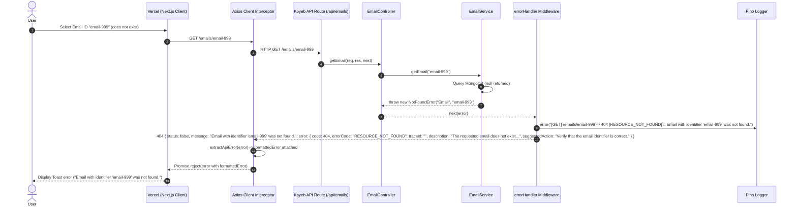

# Observability & Reliability - Phase 1 Implementation Details

> **Feature:** observability-reliability · **Phase:** 1 (Custom Exception Hierarchy & Error Codes)
> **Status:** COMPLETED
> **Created:** 2026-09-13 · **Last Updated:** 2026-09-13

---

## 1. Goal Description & Scope

Establish a unified, strictly typed custom exception hierarchy and standardized error response architecture across the MailSense backend and frontend API client layers.

Specifically, this phase ensures that:

1. **Elimination of Duplicate & Inconsistent Error Classes:** Deprecates and deletes the redundant `ApiError` class in `Backend/src/shared/utils/api.error.ts`. Consolidates all application exceptions under a single hardened `AppError` base class in `Backend/src/core/errors/AppError.ts`.
2. **Complete Removal of Legacy Demo Module:** Completely removes the obsolete `demo` module (`Backend/src/modules/demo/` and its route registration in `Backend/src/routes.ts`), eliminating unused endpoints, controller tests, and the only legacy call sites of `createApiError`.
3. **Machine-Readable Error Codes:** Introduces a comprehensive string enum `ErrorCode` in `src/core/errors/ErrorCodes.ts` providing compiler-enforced error categorization across client errors, third-party provider failures, and internal system errors.
4. **11 Domain-Specific Error Subclasses:** Implements 11 explicit subclasses (`NotFoundError`, `BadRequestError`, `UnauthorizedError`, `ForbiddenError`, `ConflictError`, `ValidationError`, `ProviderApiError`, `TokenExpiredError`, `RateLimitError`, `SyncError`, `ExternalServiceError`), encapsulating standard HTTP status codes, error codes, and structured metadata. Clean, idiomatic constructors and factories without unnecessary try/catch boilerplate.
5. **Elimination of `any` Casts:** Rewrites `AxiosApiError` to extend `ProviderApiError` using typed Axios error generics (`AxiosError<ProviderErrorResponse>`), completely eliminating `AxiosError<any>`. Removes the `(error as any).originalError` cast in `errorHandler` middleware.
6. **Standardized Response Envelope (`status: false`):** Aligns the error response shape with the project-wide `APIResponse<T>` standard by returning `{ status: false, message: string, error: { code, errorCode, traceId, description, suggestedAction, details?, stack? } }`.
7. **Frontend Error Normalization & Dedicated Types:** Defines strongly typed API error interfaces in `Frontend/src/shared/types/errors.types.ts` and implements a clean, direct error extraction utility (`Frontend/src/shared/api/errors.ts`) without try/catch overhead, intercepting response rejections in `Frontend/src/shared/api/client.ts` to seamlessly parse error codes, suggested actions, and distributed `traceId`s.

---

## 2. User Review Required & Architectural Notes

> [!IMPORTANT]
> **Key Architectural Decisions & Standards Adherence**
>
> - **Response Envelope Consistency (`status: false`):** Previous middleware returned `{ success: false, error: { ... } }`. MailSense core contracts (`APIResponse`, `UpdateAPIResponse`, `SuccessAPIResponse` in `@mailsense/types`) use `status: boolean`. The error handler now outputs `{ status: false, message: string, error: { ... } }`, ensuring 100% uniformity across all HTTP responses.
> - **Clean Error Classes & Pure Data Utilities:** In `AppError`, domain error subclasses, error factories, `AxiosApiError`, and frontend `extractApiError`, constructors and functions perform pure object instantiation and synchronous data transformation. They do NOT perform I/O or throw, and therefore intentionally avoid redundant `try/catch` wrapping. Only the Express `errorHandler` middleware and Axios interceptors maintain robust `try/catch` error protection.
> - **Complete Removal of Demo Module:** The entire `Backend/src/modules/demo/` folder (controller, service, schema, routes, model, tests) and its route mount in `Backend/src/routes.ts` are removed, removing dead code from the project.
> - **Types Organization:** All backend error interfaces (`ValidationDetail`, `ErrorContext`, `ErrorDetailPayload`, `ErrorResponsePayload`, `ProviderApiErrorParams`, `SyncErrorParams`, `ProviderErrorResponse`) reside in `Backend/src/core/types/error.types.ts` and are exported via `@types`. Frontend error types reside in `Frontend/src/shared/types/errors.types.ts` and are exported via `@shared/types`.
> - **Zero `any`, `never`, or `unknown` Types:** All error metadata is strictly constrained by `ErrorContext`, `ValidationDetail`, and `ProviderApiErrorParams`. In `catch (error)` clauses, type narrowing is strictly applied via `error instanceof Error ? error.message : String(error)`.

---

## 3. Component Overview & File Map

| Component | Target File | Action | Purpose |
| --------- | ----------- | ------ | ------- |
| Backend | `Backend/src/core/errors/ErrorCodes.ts` | **[NEW]** | Machine-readable `ErrorCode` string enum |
| Backend | `Backend/src/core/types/error.types.ts` | **[NEW]** | Strict interfaces for error context, validation details, and payloads |
| Backend | `Backend/src/core/types/index.ts` | **[MODIFY]** | Re-export error types from `@types` |
| Backend | `Backend/src/core/errors/AppError.ts` | **[MODIFY]** | Base class with `httpStatus`, `errorCode`, `traceId`, `toJSON()` |
| Backend | `Backend/src/core/errors/DomainErrors.ts` | **[NEW]** | 11 domain-specific error subclasses |
| Backend | `Backend/src/core/errors/ErrorFactories.ts` | **[NEW]** | Ergonomic factory functions for error creation |
| Backend | `Backend/src/core/errors/AxiosApiError.ts` | **[MODIFY]** | Typed Axios wrapper eliminating `any` cast |
| Backend | `Backend/src/core/errors/index.ts` | **[MODIFY]** | Barrel exports for core errors module |
| Backend | `Backend/src/middlewares/error.handler.ts` | **[MODIFY]** | Global Express error handler returning `{ status: false, error }` |
| Backend | `Backend/src/routes.ts` | **[MODIFY]** | Unmount `/demo` routes |
| Backend | `Backend/src/modules/demo/` | **[DELETE]** | Delete entire demo module directory (controller, service, schema, model, routes, tests) |
| Backend | `Backend/src/shared/utils/api.error.ts` | **[DELETE]** | Remove duplicate and legacy `ApiError` class |
| Backend | `Backend/src/shared/utils/index.ts` | **[MODIFY]** | Remove export of deleted `api.error.js` |
| Frontend | `Frontend/src/shared/types/errors.types.ts` | **[NEW]** | Frontend error response interfaces and client error shapes |
| Frontend | `Frontend/src/shared/types/index.ts` | **[MODIFY]** | Re-export error types from shared types barrel |
| Frontend | `Frontend/src/shared/api/errors.ts` | **[NEW]** | Pure data extraction utility converting API errors to formatted client errors |
| Frontend | `Frontend/src/shared/api/index.ts` | **[MODIFY]** | Re-export `errors.ts` in shared API barrel |
| Frontend | `Frontend/src/shared/api/client.ts` | **[MODIFY]** | Axios response interceptor for formatted API error propagation |

---

## 4. Main Section 1: Backend Layer Implementation

### 4.1 Error Codes Enum (`Backend/src/core/errors/ErrorCodes.ts`)

```typescript
/**
 * Machine-readable error codes for client and server errors.
 * Enables automated handling, localization, and analytics tagging.
 */
export enum ErrorCode {
    // 4xx Client Errors
    RESOURCE_NOT_FOUND = 'RESOURCE_NOT_FOUND',
    BAD_REQUEST = 'BAD_REQUEST',
    VALIDATION_FAILED = 'VALIDATION_FAILED',
    UNAUTHORIZED = 'UNAUTHORIZED',
    FORBIDDEN = 'FORBIDDEN',
    CONFLICT = 'CONFLICT',

    // Provider & External API Errors
    PROVIDER_API_ERROR = 'PROVIDER_API_ERROR',
    PROVIDER_RATE_LIMITED = 'PROVIDER_RATE_LIMITED',
    TOKEN_EXPIRED = 'TOKEN_EXPIRED',

    // 5xx System & Internal Errors
    SYNC_FAILED = 'SYNC_FAILED',
    EXTERNAL_SERVICE_ERROR = 'EXTERNAL_SERVICE_ERROR',
    INTERNAL_ERROR = 'INTERNAL_ERROR',
}
```

---

### 4.2 Error Interfaces (`Backend/src/core/types/error.types.ts`)

```typescript
import { ErrorCode } from '../errors/ErrorCodes.js';

export interface ValidationDetail {
    field: string;
    message: string;
    value?: string | number | boolean;
}

export interface ErrorContext {
    resource?: string;
    identifier?: string;
    provider?: string;
    details?: ValidationDetail[];
    metadata?: Record<string, string | number | boolean>;
}

export interface AppErrorConstructorParams {
    message: string;
    httpStatus?: number;
    errorCode?: ErrorCode;
    isOperational?: boolean;
    description?: string;
    suggestedAction?: string;
    traceId?: string;
    context?: ErrorContext;
}

export interface ErrorDetailPayload {
    code: number;
    errorCode: ErrorCode;
    traceId: string;
    description: string;
    suggestedAction: string;
    details?: ValidationDetail[];
    stack?: string;
    external?: Record<string, string | number | boolean>;
}

export interface ErrorResponsePayload {
    status: false;
    message: string;
    error: ErrorDetailPayload;
}

export interface ProviderApiErrorParams {
    provider: string;
    message: string;
    providerStatusCode?: number;
    providerErrorMessage?: string;
    description?: string;
    suggestedAction?: string;
    traceId?: string;
}

export interface SyncErrorParams {
    accountId: string;
    syncJobId?: string;
    provider?: string;
    message: string;
    description?: string;
    traceId?: string;
}

export interface ProviderErrorResponse {
    error?: {
        message?: string;
        code?: number | string;
        status?: string;
    };
    message?: string;
}
```

---

### 4.3 Types Barrel Export (`Backend/src/core/types/index.ts`)

```typescript
export * from './error.types.js';
```

---

### 4.4 Base AppError Class (`Backend/src/core/errors/AppError.ts`)

```typescript
import { AppErrorConstructorParams, ErrorContext, ErrorResponsePayload } from '@types';
import { ErrorCode } from './ErrorCodes.js';

export class AppError extends Error {
    public readonly httpStatus: number;
    public readonly errorCode: ErrorCode;
    public readonly isOperational: boolean;
    public readonly description: string;
    public readonly suggestedAction: string;
    public readonly traceId: string;
    public readonly context?: ErrorContext;

    constructor(params: AppErrorConstructorParams) {
        super(params.message);

        Object.setPrototypeOf(this, new.target.prototype);

        this.httpStatus = params.httpStatus ?? 500;
        this.errorCode = params.errorCode ?? ErrorCode.INTERNAL_ERROR;
        this.isOperational = params.isOperational ?? true;
        this.description = params.description ?? 'An unexpected error occurred while processing your request.';
        this.suggestedAction = params.suggestedAction ?? 'Please try again later or contact support if the issue persists.';
        this.traceId = params.traceId ?? '';
        this.context = params.context;

        Error.captureStackTrace(this, this.constructor);
    }

    public toJSON(isDevelopment = false): ErrorResponsePayload {
        return {
            status: false,
            message: this.message,
            error: {
                code: this.httpStatus,
                errorCode: this.errorCode,
                traceId: this.traceId,
                description: this.description,
                suggestedAction: this.suggestedAction,
                ...(this.context?.details ? { details: this.context.details } : {}),
                ...(isDevelopment && this.stack ? { stack: this.stack } : {}),
            },
        };
    }
}
```

---

### 4.5 Domain Error Subclasses (`Backend/src/core/errors/DomainErrors.ts`)

```typescript
import { ProviderApiErrorParams, SyncErrorParams, ValidationDetail } from '@types';
import { AppError } from './AppError.js';
import { ErrorCode } from './ErrorCodes.js';

export class NotFoundError extends AppError {
    constructor(resource: string, identifier: string, traceId?: string) {
        super({
            message: `${resource} with identifier '${identifier}' was not found.`,
            httpStatus: 404,
            errorCode: ErrorCode.RESOURCE_NOT_FOUND,
            isOperational: true,
            description: `The requested ${resource.toLowerCase()} does not exist or has been deleted.`,
            suggestedAction: `Verify that the ${resource.toLowerCase()} identifier is correct.`,
            traceId,
            context: { resource, identifier },
        });
    }
}

export class BadRequestError extends AppError {
    constructor(message: string, description?: string, suggestedAction?: string, traceId?: string) {
        super({
            message,
            httpStatus: 400,
            errorCode: ErrorCode.BAD_REQUEST,
            isOperational: true,
            description: description ?? 'The request payload or parameters are invalid.',
            suggestedAction: suggestedAction ?? 'Check the request format and try again.',
            traceId,
        });
    }
}

export class UnauthorizedError extends AppError {
    constructor(message = 'Authentication required', suggestedAction?: string, traceId?: string) {
        super({
            message,
            httpStatus: 401,
            errorCode: ErrorCode.UNAUTHORIZED,
            isOperational: true,
            description: 'You must be authenticated to access this resource.',
            suggestedAction: suggestedAction ?? 'Please log in and include a valid Bearer token.',
            traceId,
        });
    }
}

export class ForbiddenError extends AppError {
    constructor(message = 'Access forbidden', suggestedAction?: string, traceId?: string) {
        super({
            message,
            httpStatus: 403,
            errorCode: ErrorCode.FORBIDDEN,
            isOperational: true,
            description: 'You do not have permission to perform this action on the specified resource.',
            suggestedAction: suggestedAction ?? 'Contact the workspace administrator for appropriate permissions.',
            traceId,
        });
    }
}

export class ConflictError extends AppError {
    constructor(message: string, resource?: string, traceId?: string) {
        super({
            message,
            httpStatus: 409,
            errorCode: ErrorCode.CONFLICT,
            isOperational: true,
            description: 'The requested operation conflicts with the current state of the resource.',
            suggestedAction: 'Reload the latest data and resolve any conflicting updates.',
            traceId,
            context: resource ? { resource } : undefined,
        });
    }
}

export class ValidationError extends AppError {
    public readonly details: ValidationDetail[];

    constructor(message: string, details: ValidationDetail[], traceId?: string) {
        super({
            message,
            httpStatus: 422,
            errorCode: ErrorCode.VALIDATION_FAILED,
            isOperational: true,
            description: 'One or more fields in the request failed validation.',
            suggestedAction: 'Correct the invalid input fields according to the error details.',
            traceId,
            context: { details },
        });
        this.details = details;
    }
}

export class ProviderApiError extends AppError {
    public readonly provider: string;
    public readonly providerStatusCode?: number;
    public readonly providerErrorMessage?: string;

    constructor(params: ProviderApiErrorParams) {
        super({
            message: `[${params.provider.toUpperCase()}] ${params.message}`,
            httpStatus: 502,
            errorCode: ErrorCode.PROVIDER_API_ERROR,
            isOperational: true,
            description: params.description ?? `External email provider (${params.provider}) returned an error.`,
            suggestedAction: params.suggestedAction ?? 'Please try again in a few moments.',
            traceId: params.traceId,
            context: {
                provider: params.provider,
                metadata: {
                    ...(params.providerStatusCode ? { providerStatusCode: params.providerStatusCode } : {}),
                    ...(params.providerErrorMessage ? { providerErrorMessage: params.providerErrorMessage } : {}),
                },
            },
        });
        this.provider = params.provider;
        this.providerStatusCode = params.providerStatusCode;
        this.providerErrorMessage = params.providerErrorMessage;
    }
}

export class TokenExpiredError extends AppError {
    public readonly accountId: string;
    public readonly provider: string;

    constructor(accountId: string, provider: string, traceId?: string) {
        super({
            message: `OAuth access token for ${provider} account has expired or was revoked.`,
            httpStatus: 401,
            errorCode: ErrorCode.TOKEN_EXPIRED,
            isOperational: true,
            description: `Authentication with ${provider} failed because credentials have expired.`,
            suggestedAction: 'Please reconnect your email account in Account Settings.',
            traceId,
            context: { resource: 'Account', identifier: accountId, provider },
        });
        this.accountId = accountId;
        this.provider = provider;
    }
}

export class RateLimitError extends AppError {
    public readonly provider: string;
    public readonly retryAfterMs?: number;

    constructor(provider: string, retryAfterMs?: number, traceId?: string) {
        const seconds = retryAfterMs ? Math.ceil(retryAfterMs / 1000) : 60;
        super({
            message: `Rate limit exceeded for ${provider} API.`,
            httpStatus: 429,
            errorCode: ErrorCode.PROVIDER_RATE_LIMITED,
            isOperational: true,
            description: `The maximum allowed API request quota for ${provider} was reached.`,
            suggestedAction: `Please wait ${seconds} seconds before retrying this operation.`,
            traceId,
            context: {
                provider,
                metadata: retryAfterMs ? { retryAfterMs } : undefined,
            },
        });
        this.provider = provider;
        this.retryAfterMs = retryAfterMs;
    }
}

export class SyncError extends AppError {
    public readonly accountId: string;
    public readonly syncJobId?: string;

    constructor(params: SyncErrorParams) {
        super({
            message: `Sync operation failed: ${params.message}`,
            httpStatus: 500,
            errorCode: ErrorCode.SYNC_FAILED,
            isOperational: true,
            description: params.description ?? `An error occurred while syncing account '${params.accountId}'.`,
            suggestedAction: 'Trigger a manual sync from the Accounts settings page or wait for scheduled sync.',
            traceId: params.traceId,
            context: {
                resource: 'AccountSync',
                identifier: params.accountId,
                ...(params.provider ? { provider: params.provider } : {}),
                metadata: params.syncJobId ? { syncJobId: params.syncJobId } : undefined,
            },
        });
        this.accountId = params.accountId;
        this.syncJobId = params.syncJobId;
    }
}

export class ExternalServiceError extends AppError {
    public readonly serviceName: string;

    constructor(serviceName: string, message: string, traceId?: string) {
        super({
            message: `External service '${serviceName}' failed: ${message}`,
            httpStatus: 502,
            errorCode: ErrorCode.EXTERNAL_SERVICE_ERROR,
            isOperational: true,
            description: `Dependency service '${serviceName}' is currently unavailable or returned an error.`,
            suggestedAction: 'Retry the request shortly. If the issue continues, check external service health.',
            traceId,
            context: { resource: serviceName },
        });
        this.serviceName = serviceName;
    }
}
```

---

### 4.6 Error Factory Helpers (`Backend/src/core/errors/ErrorFactories.ts`)

```typescript
import { ValidationDetail } from '@types';
import { BadRequestError, NotFoundError, ValidationError } from './DomainErrors.js';

export function createNotFoundError(resource: string, identifier: string, traceId?: string): NotFoundError {
    return new NotFoundError(resource, identifier, traceId);
}

export function createBadRequestError(message: string, description?: string, suggestedAction?: string, traceId?: string): BadRequestError {
    return new BadRequestError(message, description, suggestedAction, traceId);
}

export function createValidationError(message: string, details: ValidationDetail[], traceId?: string): ValidationError {
    return new ValidationError(message, details, traceId);
}
```

---

### 4.7 Refactored AxiosApiError (`Backend/src/core/errors/AxiosApiError.ts`)

```typescript
import { ProviderErrorResponse } from '@types';
import axios, { AxiosError } from 'axios';
import { ProviderApiError } from './DomainErrors.js';

export class AxiosApiError extends ProviderApiError {
    public readonly originalError?: Record<string, string | number | boolean>;

    constructor(error: unknown, providerName = 'ExternalAPI', traceId?: string) {
        if (axios.isAxiosError(error)) {
            const typedAxiosError = error as AxiosError<ProviderErrorResponse>;
            const statusCode = typedAxiosError.response?.status ?? 502;
            const responseData = typedAxiosError.response?.data;

            const extractedMessage =
                responseData?.error?.message ?? responseData?.message ?? typedAxiosError.message ?? 'External HTTP request failed';

            super({
                provider: providerName,
                message: extractedMessage,
                providerStatusCode: statusCode,
                providerErrorMessage: extractedMessage,
                traceId,
            });

            if (responseData && typeof responseData === 'object') {
                this.originalError = {
                    status: statusCode,
                    url: typedAxiosError.config?.url ?? 'unknown',
                    method: typedAxiosError.config?.method ?? 'unknown',
                };
            }
        } else {
            const standardError = error instanceof Error ? error : new Error(String(error));
            super({
                provider: providerName,
                message: standardError.message,
                providerStatusCode: 500,
                providerErrorMessage: standardError.message,
                traceId,
            });
            this.originalError = {
                message: standardError.message,
            };
        }
    }
}
```

---

### 4.8 Core Errors Barrel Export (`Backend/src/core/errors/index.ts`)

```typescript
export * from './AppError.js';
export * from './AxiosApiError.js';
export * from './ErrorCodes.js';
export * from './DomainErrors.js';
export * from './ErrorFactories.js';
```

---

### 4.9 Global Error Handler Middleware (`Backend/src/middlewares/error.handler.ts`)

```typescript
import { NODE_ENV } from '@config';
import { AppError, AxiosApiError, ErrorCode } from '@errors';
import { ErrorResponsePayload } from '@types';
import { NextFunction, Request, Response } from 'express';
import { logger } from '../shared/utils/logger.js';

export const errorHandler = (err: unknown, req: Request, res: Response, _next: NextFunction): void => {
    try {
        let appError: AppError;

        if (err instanceof AppError) {
            appError = err;
        } else if (err instanceof Error) {
            appError = new AppError({
                message: err.message,
                httpStatus: 500,
                errorCode: ErrorCode.INTERNAL_ERROR,
                isOperational: false,
                description: 'An unhandled internal application error occurred.',
                suggestedAction: 'Please try again later. System administrators have been alerted.',
            });
            appError.stack = err.stack;
        } else {
            appError = new AppError({
                message: 'An unexpected and unclassified error occurred.',
                httpStatus: 500,
                errorCode: ErrorCode.INTERNAL_ERROR,
                isOperational: false,
            });
        }

        const statusCode = appError.httpStatus || 500;
        const isDev = NODE_ENV === 'local' || NODE_ENV === 'development';

        logger.error(`[${req.method}] ${req.url} -> ${statusCode} [${appError.errorCode}] :: ${appError.message}`, {
            errorCode: appError.errorCode,
            traceId: appError.traceId,
            httpStatus: statusCode,
            stack: appError.stack,
        });

        const errorPayload: ErrorResponsePayload = appError.toJSON(isDev);

        // Safely extract typed original error if present in AxiosApiError during development
        if (isDev && appError instanceof AxiosApiError && appError.originalError) {
            errorPayload.error.external = appError.originalError;
        }

        res.status(statusCode).json(errorPayload);
    } catch (criticalHandlerError) {
        const fallbackMessage = criticalHandlerError instanceof Error ? criticalHandlerError.message : String(criticalHandlerError);
        logger.error(`Critical failure in errorHandler middleware: ${fallbackMessage}`);

        res.status(500).json({
            status: false,
            message: 'Internal Server Error',
            error: {
                code: 500,
                errorCode: ErrorCode.INTERNAL_ERROR,
                traceId: '',
                description: 'Fatal error while building error response envelope.',
                suggestedAction: 'Contact support.',
            },
        });
    }
};
```

---

### 4.10 Unmount Demo Module in Router (`Backend/src/routes.ts`)

```typescript
import { Router } from 'express';

import accountsRoutes from '@modules/accounts/account.routes.js';
import analyticsRoutes from '@modules/analytics/analytics.routes.js';
import attachmentRoutes from '@modules/attachments/attachment.routes.js';
import draftRoutes from '@modules/drafts/draft.routes.js';
import emailsRoutes from '@modules/emails/email.routes.js';
import foldersRoutes from '@modules/folders/folder.routes.js';
import usersRoutes from '@modules/user/user.routes.js';
import utilsRoutes from '@modules/utils/index.js';

const router = Router();

router.get('/', (_req, res) => {
    res.send('MailSense Backend!');
});

router.use('/users', usersRoutes);

router.use('/accounts', accountsRoutes);

router.use('/emails', emailsRoutes);

router.use('/folders', foldersRoutes);

router.use('/attachments', attachmentRoutes);

router.use('/analytics', analyticsRoutes);

router.use('/drafts', draftRoutes);

router.use('/utils', utilsRoutes);

export default router;
```

---

### 4.11 Delete Legacy Demo Module & ApiError

- **Directories & Files Deleted:**
  - `Backend/src/modules/demo/` (entire directory containing `demo.controller.ts`, `demo.service.ts`, `demo.routes.ts`, `demo.schema.ts`, `demo.model.ts`, and `__tests__/`)
  - `Backend/src/shared/utils/api.error.ts`
- **Updated Shared Utils Barrel (`Backend/src/shared/utils/index.ts`):**

```typescript
export * from './axios.js';
export * from './batchProcessor.js';
export * from './common.js';
export * from './compression.js';
export * from './crypto.js';
export * from './logger.js';
export * from './request.handler.js';
```

---

## 5. Main Section 2: Frontend Layer Implementation

### 5.1 Frontend Error Types (`Frontend/src/shared/types/errors.types.ts`)

```typescript
export interface ApiValidationDetail {
    field: string;
    message: string;
    value?: string | number | boolean;
}

export interface ApiErrorDetail {
    code: number;
    errorCode: string;
    traceId: string;
    description: string;
    suggestedAction: string;
    details?: ApiValidationDetail[];
}

export interface ApiErrorResponse {
    status: false;
    message: string;
    error: ApiErrorDetail;
}

export interface FormattedClientError {
    message: string;
    errorCode: string;
    traceId: string;
    description: string;
    suggestedAction: string;
    httpStatus: number;
}
```

---

### 5.2 Re-Export Error Types (`Frontend/src/shared/types/index.ts`)

```typescript
export * from './common.types';
export * from './errors.types';
export * from './sidebar.types';
```

---

### 5.3 Pure Data Extraction Utility (`Frontend/src/shared/api/errors.ts`)

```typescript
import axios, { AxiosError } from 'axios';
import { ApiErrorResponse, FormattedClientError } from '@shared/types';

/**
 * Normalizes backend error responses conforming to `{ status: false, message, error }`.
 * Pure data transformation without try/catch overhead.
 */
export function extractApiError(error: unknown): FormattedClientError {
    if (axios.isAxiosError(error)) {
        const axiosError = error as AxiosError<ApiErrorResponse>;
        const responseData = axiosError.response?.data;

        if (responseData && responseData.error) {
            return {
                message: responseData.message || axiosError.message,
                errorCode: responseData.error.errorCode || 'UNKNOWN_ERROR',
                traceId: responseData.error.traceId || '',
                description: responseData.error.description || '',
                suggestedAction: responseData.error.suggestedAction || 'Please try again later.',
                httpStatus: responseData.error.code || axiosError.response?.status || 500,
            };
        }

        return {
            message: axiosError.message || 'Network request failed',
            errorCode: 'NETWORK_ERROR',
            traceId: '',
            description: 'Failed to communicate with the server.',
            suggestedAction: 'Please check your internet connection and try again.',
            httpStatus: axiosError.response?.status || 500,
        };
    }

    if (error instanceof Error) {
        return {
            message: error.message,
            errorCode: 'CLIENT_ERROR',
            traceId: '',
            description: 'An unexpected client error occurred.',
            suggestedAction: 'Please refresh the page and try again.',
            httpStatus: 500,
        };
    }

    return {
        message: String(error),
        errorCode: 'UNKNOWN_ERROR',
        traceId: '',
        description: 'An unknown error occurred.',
        suggestedAction: 'Please contact support if this continues.',
        httpStatus: 500,
    };
}
```

---

### 5.4 API Barrel Export (`Frontend/src/shared/api/index.ts`)

```typescript
export * from './client';
export * from './endpoints';
export * from './errors';
export * from './query-keys';
```

---

### 5.5 Axios Client Response Interceptor Update (`Frontend/src/shared/api/client.ts`)

```typescript
import { getAccessToken } from '@auth0/nextjs-auth0/client';
import { API_BASE_URL } from '@config/config';
import axios from 'axios';
import { extractApiError } from './errors';

const apiClient = axios.create({
    baseURL: API_BASE_URL,
});

apiClient.interceptors.request.use(async (config) => {
    try {
        const accessToken = await getAccessToken();
        if (accessToken) {
            config.headers.Authorization = `Bearer ${accessToken}`;
        }
        return config;
    } catch (tokenError) {
        return config;
    }
});

apiClient.interceptors.response.use(
    (response) => {
        return response;
    },
    (error) => {
        try {
            const formatted = extractApiError(error);
            Object.assign(error, { formattedError: formatted });
        } catch (interceptorError) {
            // Preserve original error if enrichment fails
        }
        return Promise.reject(error);
    },
);

export const axiosClient = apiClient;

export const auth0ApiClient = axios.create({
    baseURL: 'http://localhost:3000/auth',
    withCredentials: true,
});
```

---

## 6. Low-Level Design & Sequence Flow



---

## 7. Step-by-Step Task Checklist

- [x] **Task 1: Backend Error Infrastructure Foundations**
  - [x] Create `Backend/src/core/errors/ErrorCodes.ts` with complete `ErrorCode` enum
  - [x] Create `Backend/src/core/types/error.types.ts` with all strict interfaces and re-export in `Backend/src/core/types/index.ts`
  - [x] Rewrite `Backend/src/core/errors/AppError.ts` implementing clean constructor and `toJSON()` with `status: false`
- [x] **Task 2: Domain Errors & Factories**
  - [x] Create `Backend/src/core/errors/DomainErrors.ts` implementing 11 domain error classes
  - [x] Create `Backend/src/core/errors/ErrorFactories.ts` with factory helpers
  - [x] Rewrite `Backend/src/core/errors/AxiosApiError.ts` extending `ProviderApiError` and removing `any` cast
  - [x] Update `Backend/src/core/errors/index.ts` with clean barrel exports
- [x] **Task 3: Delete Demo Module & Legacy ApiError**
  - [x] Delete `Backend/src/modules/demo/` directory completely
  - [x] Remove `demoRoutes` import and `/demo` route mount from `Backend/src/routes.ts`
  - [x] Delete `Backend/src/shared/utils/api.error.ts`
  - [x] Remove `api.error.js` export from `Backend/src/shared/utils/index.ts`
  - [x] Update `Backend/src/middlewares/error.handler.ts` using `appError.toJSON()` and strict type guards
- [x] **Task 4: Frontend Error Normalization Layer**
  - [x] Create `Frontend/src/shared/types/errors.types.ts` with dedicated error interfaces
  - [x] Update `Frontend/src/shared/types/index.ts` re-exporting error types
  - [x] Create `Frontend/src/shared/api/errors.ts` with pure `extractApiError` utility
  - [x] Update `Frontend/src/shared/api/index.ts` re-exporting errors utility
  - [x] Update `Frontend/src/shared/api/client.ts` Axios response rejection interceptor
- [x] **Task 5: Verification & Compilation**
  - [x] Execute `pnpm build` in `Backend/` ensuring zero TypeScript compiler errors
  - [x] Execute `npx tsc --noEmit` in `Frontend/` ensuring zero TypeScript compiler errors
  - [x] Execute `pnpm test` in `Backend/` verifying existing test suite integrity (10 test suites, 42 tests passing)

---

## 8. Verification & Build Commands

```bash
# 1. Backend Verification
cd /Users/vishaljagamani/Projects/Projects/mailsense/Backend
pnpm build
pnpm type-check

# 2. Frontend Verification
cd /Users/vishaljagamani/Projects/Projects/mailsense/Frontend
npx tsc --noEmit

# 3. Test Suite Verification
cd /Users/vishaljagamani/Projects/Projects/mailsense/Backend
pnpm test
```
