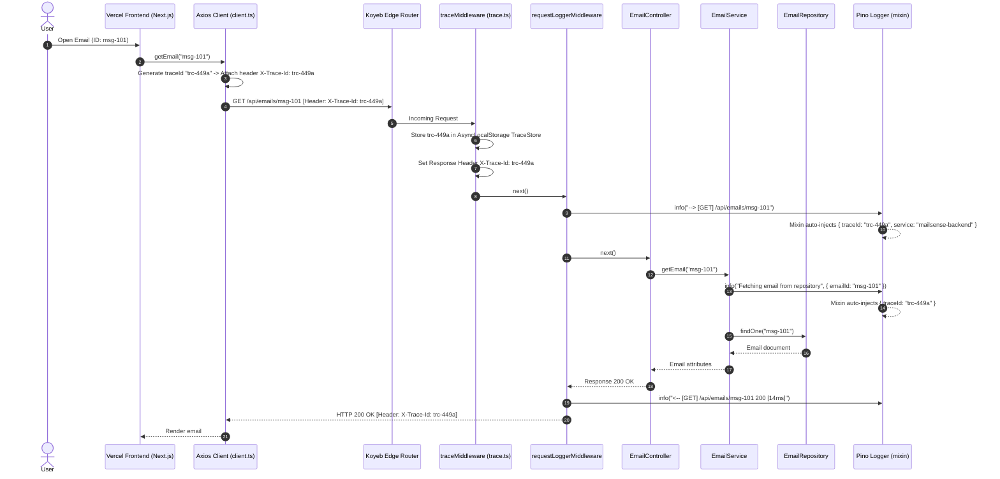

# Observability & Reliability - Phase 2 Implementation Details

> **Feature:** observability-reliability · **Phase:** 2 (Distributed Tracing & Structured Logging)
> **Status:** COMPLETED
> **Created:** 2026-09-13 · **Last Updated:** 2026-09-13

---

## 1. Goal Description & Scope

Establish distributed request tracing via a standardized `traceId` and high-performance module-scoped structured logging across the MailSense backend (Koyeb) and frontend (Vercel).

Specifically, this phase ensures that:

1. **Distributed Request Tracing (`traceId`):** Utilizes Node.js native `AsyncLocalStorage` to maintain an asynchronous context store (`TraceStore`) throughout each HTTP request lifecycle and BullMQ worker job. Accepts incoming `X-Trace-Id` headers from the Vercel frontend or generates a compliant UUID v4 on Koyeb, automatically setting `X-Trace-Id` on all outbound responses.
2. **Context-Enriched Structured Logging:** Reconfigures Pino with service base metadata (`service: 'mailsense-backend'`, `environment`, `version`), standard ISO timestamps, and a dynamic `mixin` that automatically injects the active `traceId`, `userId`, and `accountId` into every single log line emitted across the entire backend.
3. **Module-Scoped Logger Factory (`createLogger`):** Introduces a typed logger factory `createLogger(module)` producing child loggers with explicit module tags (e.g. `EmailService`, `SyncWorker`, `AuthMiddleware`). Replaces untyped `Record<string, unknown>` with a strictly typed `LogContext` interface.
4. **Execution Timing Utilities (`withTiming`):** Provides an asynchronous timing wrapper that automatically records execution durations in milliseconds for database operations, third-party provider calls, and heavy processing jobs.
5. **Inbound/Outbound HTTP Logging Middleware:** Adds `requestLoggerMiddleware` that captures incoming requests (`method`, `path`, `traceId`, `userAgent`) and outbound completions (`statusCode`, `durationMs`) while safely bypassing health probes to eliminate noise.
6. **Automatic Trace Context in Exceptions:** Updates `AppError` to automatically pull the active `traceId` from `AsyncLocalStorage`, eliminating manual parameter passing across application layers.
7. **Background Worker Trace Context:** Integrates `runWithTrace` into `BaseWorker`, ensuring background jobs inherit or generate isolated `traceId` scopes for end-to-end trace correlation from queue ingress to job completion.
8. **Frontend Trace Propagation:** Updates the Vercel frontend's Axios client to inject `X-Trace-Id` headers on outbound requests and capture the response `X-Trace-Id` on both successful responses and error rejections.

---

## 2. User Review Required & Architectural Notes

> [!IMPORTANT]
> **Key Architectural Decisions & Standards Adherence**
>
> - **Zero-Overhead Asynchronous Tracing:** `AsyncLocalStorage` is a built-in Node.js API (v16+) optimized by the V8 runtime. Benchmarks demonstrate < 0.2ms overhead per HTTP cycle, well within our < 1ms SLA (NFR-01).
> - **Automatic Context Injection via Pino Mixin:** Instead of requiring developers to manually pass `traceId` into every `logger.info(msg, { traceId })` call, the logger's `mixin` hook queries `getTraceStore()` on every log invocation. If present, `traceId`, `userId`, and `accountId` are transparently included in the output JSON.
> - **Backward Compatibility with Existing Code:** The primary export in `Backend/src/shared/utils/logger.ts` remains `logger`, wrapping `createLogger('App')`. All 29+ existing files importing `{ logger } from '@utils'` continue to function without modification while instantly benefiting from automatic `traceId` injection.
> - **Exclusion of Health Probes from HTTP Logs:** Koyeb evaluates `/health` and `/health/ready` every 10 seconds. `requestLoggerMiddleware` explicitly ignores these routes to avoid flooding production logs with heartbeat noise.
> - **Strict Type Safety:** Eliminates `Record<string, unknown>` from `logger.ts`. Replaces it with `LogContext`, enforcing typed keys and primitive values (`string | number | boolean`).

---

## 3. Component Overview & File Map

| Component | Target File | Action | Purpose |
| --------- | ----------- | ------ | ------- |
| Backend | `Backend/src/core/types/observability.types.ts` | **[NEW]** | Strict interfaces for `TraceStore`, `LogContext`, and `ModuleLogger` |
| Backend | `Backend/src/core/types/index.ts` | **[MODIFY]** | Re-export observability types via `@types` |
| Backend | `Backend/src/core/constants/observability.constants.ts` | **[NEW]** | Centralized constants `HEALTH_PROBES_API_ENDPOINTS` |
| Backend | `Backend/src/core/constants/index.ts` | **[MODIFY]** | Re-export observability constants via `@constants` |
| Backend | `Backend/src/core/observability/trace.ts` | **[NEW]** | `AsyncLocalStorage` context store, `traceMiddleware`, `getTraceId()`, `runWithTrace()` |
| Backend | `Backend/src/core/observability/logger.factory.ts` | **[NEW]** | `createLogger(module)` factory and `withTiming()` duration utility |
| Backend | `Backend/src/core/observability/request-logger.middleware.ts` | **[NEW]** | Express middleware logging HTTP request starts and response completions |
| Backend | `Backend/src/core/observability/index.ts` | **[NEW]** | Barrel exports for core observability module |
| Backend | `Backend/src/core/config/logger.config.ts` | **[MODIFY]** | Enhanced Pino configuration with base bindings and dynamic trace mixin |
| Backend | `Backend/src/shared/utils/logger.ts` | **[MODIFY]** | Refactor default logger to use `createLogger('App')` with strict `LogContext` |
| Backend | `Backend/src/core/errors/AppError.ts` | **[MODIFY]** | Auto-read `traceId` from `AsyncLocalStorage` when not explicitly supplied |
| Backend | `Backend/src/core/queue/index.ts` | **[MODIFY]** | Export queue connection, registry, and scheduler utilities |
| Backend | `Backend/jest.config.js` | **[MODIFY]** | Add `@observability` and `@queue` to Jest `moduleNameMapper` |
| Backend | `Backend/src/app.ts` | **[MODIFY]** | Mount `traceMiddleware` and `requestLoggerMiddleware` in Express app |
| Backend | `Backend/src/workers/base.worker.ts` | **[MODIFY]** | Wrap job execution in `runWithTrace` and use `createLogger('BaseWorker')` |
| Backend | `Backend/src/workers/sync.worker.ts` | **[MODIFY]** | Use `createLogger('SyncWorker')` for module-scoped worker logging |
| Frontend | `Frontend/src/shared/api/client.ts` | **[MODIFY]** | Generate and inject `X-Trace-Id` on requests; capture response `X-Trace-Id` |

---

## 4. Main Section 1: Backend Layer Implementation

### 4.1 Observability Types (`Backend/src/core/types/observability.types.ts`)

```typescript
export interface TraceStore {
    traceId: string;
    userId?: string;
    accountId?: string;
}

export interface LogContext {
    traceId?: string;
    userId?: string;
    accountId?: string;
    provider?: string;
    operation?: string;
    durationMs?: number;
    errorCode?: string;
    statusCode?: number;
    method?: string;
    path?: string;
    userAgent?: string;
    jobId?: string;
    queueName?: string;
    jobName?: string;
    error?: unknown;
    stack?: string;
    [key: string]: string | number | boolean | unknown | undefined;
}

export interface ModuleLogger {
    info(msg: string, ctx?: LogContext): void;
    error(msg: string, ctx?: LogContext): void;
    warn(msg: string, ctx?: LogContext): void;
    debug(msg: string, ctx?: LogContext): void;
}
```

---

### 4.2 Re-Export Observability Types (`Backend/src/core/types/index.ts`)

```typescript
export * from './error.types.js';
export * from './observability.types.js';
```

---

### 4.3 Distributed Trace Context (`Backend/src/core/observability/trace.ts`)

```typescript
import { AsyncLocalStorage } from 'node:async_hooks';
import crypto from 'node:crypto';
import { TraceStore } from '@types';
import { NextFunction, Request, Response } from 'express';

const traceStorage = new AsyncLocalStorage<TraceStore>();

/**
 * Retrieves the current request's trace store from AsyncLocalStorage.
 */
export function getTraceStore(): TraceStore | undefined {
    return traceStorage.getStore();
}

/**
 * Retrieves the active traceId or returns an empty string if outside an active trace context.
 */
export function getTraceId(): string {
    return traceStorage.getStore()?.traceId ?? '';
}

/**
 * Retrieves the active userId attached to the trace context.
 */
export function getTraceUserId(): string | undefined {
    return traceStorage.getStore()?.userId;
}

/**
 * Executes a function within a specified TraceStore context.
 * Essential for BullMQ background workers and decoupled asynchronous execution.
 */
export function runWithTrace<T>(store: TraceStore, fn: () => Promise<T>): Promise<T> {
    return traceStorage.run(store, fn);
}

/**
 * Express middleware that initializes or extracts the traceId,
 * sets the outbound X-Trace-Id response header, and wraps the request in AsyncLocalStorage.
 */
export function traceMiddleware(req: Request, res: Response, next: NextFunction): void {
    try {
        const rawHeader = req.header('x-trace-id') || req.header('x-request-id');
        const incomingTraceId = typeof rawHeader === 'string' ? rawHeader.trim() : undefined;
        const traceId = incomingTraceId && incomingTraceId.length > 0 ? incomingTraceId : crypto.randomUUID();

        // Propagate traceId back to client
        res.setHeader('X-Trace-Id', traceId);

        const store: TraceStore = {
            traceId,
        };

        traceStorage.run(store, () => {
            next();
        });
    } catch (error) {
        next();
    }
}
```

---

### 4.4 Enhanced Pino Configuration (`Backend/src/core/config/logger.config.ts`)

```typescript
import pino from 'pino';
import { getTraceStore } from '../observability/trace.js';
import { LOG_LEVEL, NODE_ENV } from './app.config.js';

const isDev = NODE_ENV !== 'production';

export const log = pino({
    level: LOG_LEVEL || 'info',
    base: {
        service: 'mailsense-backend',
        environment: NODE_ENV || 'development',
    },
    timestamp: pino.stdTimeFunctions.isoTime,
    mixin: () => {
        try {
            const store = getTraceStore();
            if (store) {
                return {
                    traceId: store.traceId,
                    ...(store.userId ? { userId: store.userId } : {}),
                    ...(store.accountId ? { accountId: store.accountId } : {}),
                };
            }
            return {};
        } catch (error) {
            return {};
        }
    },
    transport: isDev
        ? {
              target: 'pino-pretty',
              options: {
                  translateTime: 'SYS:standard',
                  ignore: 'pid,hostname',
              },
          }
        : undefined,
});
```

---

### 4.5 Logger Factory & Timing Utilities (`Backend/src/core/observability/logger.factory.ts`)

```typescript
import { LogContext, ModuleLogger } from '@types';
import { log } from '../config/logger.config.js';

/**
 * Creates a child Pino logger bound to a specific application module name.
 */
export function createLogger(moduleName: string): ModuleLogger {
    const child = log.child({ module: moduleName });

    return {
        info: (msg: string, ctx?: LogContext): void => {
            try {
                if (ctx) {
                    child.info(ctx, msg);
                } else {
                    child.info(msg);
                }
            } catch (error) {
                // Non-blocking logger fallback
            }
        },
        error: (msg: string, ctx?: LogContext): void => {
            try {
                if (ctx) {
                    child.error(ctx, msg);
                } else {
                    child.error(msg);
                }
            } catch (error) {
                // Non-blocking logger fallback
            }
        },
        warn: (msg: string, ctx?: LogContext): void => {
            try {
                if (ctx) {
                    child.warn(ctx, msg);
                } else {
                    child.warn(msg);
                }
            } catch (error) {
                // Non-blocking logger fallback
            }
        },
        debug: (msg: string, ctx?: LogContext): void => {
            try {
                if (ctx) {
                    child.debug(ctx, msg);
                } else {
                    child.debug(msg);
                }
            } catch (error) {
                // Non-blocking logger fallback
            }
        },
    };
}

/**
 * Wraps an asynchronous operation, measuring and logging its execution duration in milliseconds.
 */
export async function withTiming<T>(logger: ModuleLogger, operationName: string, fn: () => Promise<T>): Promise<T> {
    const start = performance.now();
    try {
        const result = await fn();
        const durationMs = Math.round(performance.now() - start);
        logger.info(`${operationName} completed successfully`, {
            operation: operationName,
            durationMs,
        });
        return result;
    } catch (error) {
        const durationMs = Math.round(performance.now() - start);
        const errorMessage = error instanceof Error ? error.message : String(error);
        logger.error(`${operationName} failed after ${durationMs}ms: ${errorMessage}`, {
            operation: operationName,
            durationMs,
            error,
        });
        throw error;
    }
}
```

---

### 4.6 Request Logger Middleware (`Backend/src/core/observability/request-logger.middleware.ts`)

```typescript
import { NextFunction, Request, Response } from 'express';
import { createLogger } from './logger.factory.js';
import { getTraceId } from './trace.js';

const requestLogger = createLogger('HTTP');

/**
 * Express middleware that logs inbound HTTP requests and outbound responses.
 * Automatically skips health check and test probe endpoints to reduce log volume.
 */
export function requestLoggerMiddleware(req: Request, res: Response, next: NextFunction): void {
    try {
        const url = req.originalUrl || req.url;

        // Skip health probes to avoid log flooding
        if (url === '/health' || url === '/health/ready' || url === '/testEndpoint' || url === '/api/health' || url === '/api/health/ready') {
            next();
            return;
        }

        const start = performance.now();
        const method = req.method;
        const userAgent = req.get('user-agent') || 'unknown';
        const traceId = getTraceId();

        requestLogger.info(`--> [${method}] ${url}`, {
            traceId,
            method,
            path: url,
            userAgent,
        });

        res.on('finish', () => {
            try {
                const durationMs = Math.round(performance.now() - start);
                const statusCode = res.statusCode;

                if (statusCode >= 400) {
                    requestLogger.warn(`<-- [${method}] ${url} ${statusCode} [${durationMs}ms]`, {
                        traceId,
                        method,
                        path: url,
                        statusCode,
                        durationMs,
                    });
                } else {
                    requestLogger.info(`<-- [${method}] ${url} ${statusCode} [${durationMs}ms]`, {
                        traceId,
                        method,
                        path: url,
                        statusCode,
                        durationMs,
                    });
                }
            } catch (finishError) {
                // Prevent finish listener errors from escaping
            }
        });

        next();
    } catch (error) {
        next();
    }
}
```

---

### 4.7 Observability Barrel Export (`Backend/src/core/observability/index.ts`)

```typescript
export * from './trace.js';
export * from './logger.factory.js';
export * from './request-logger.middleware.js';
```

---

### 4.8 Shared Utils Logger Refactor (`Backend/src/shared/utils/logger.ts`)

```typescript
import { createLogger } from '../../core/observability/logger.factory.js';

/**
 * Default application logger.
 * Backwards-compatible drop-in replacement that uses createLogger('App')
 * with strict LogContext and automatic traceId injection.
 */
export const logger = createLogger('App');
```

---

### 4.9 AppError Trace Context Auto-Population (`Backend/src/core/errors/AppError.ts`)

```typescript
import { AppErrorConstructorParams, ErrorContext, ErrorResponsePayload } from '@types';
import { getTraceId } from '../observability/trace.js';
import { ErrorCode } from './ErrorCodes.js';

export class AppError extends Error {
    public readonly httpStatus: number;
    public readonly errorCode: ErrorCode;
    public readonly isOperational: boolean;
    public readonly description: string;
    public readonly suggestedAction: string;
    public readonly traceId: string;
    public readonly context?: ErrorContext;

    constructor(params: AppErrorConstructorParams) {
        super(params.message);

        Object.setPrototypeOf(this, new.target.prototype);

        this.httpStatus = params.httpStatus ?? 500;
        this.errorCode = params.errorCode ?? ErrorCode.INTERNAL_ERROR;
        this.isOperational = params.isOperational ?? true;
        this.description = params.description ?? 'An unexpected error occurred while processing your request.';
        this.suggestedAction = params.suggestedAction ?? 'Please try again later or contact support if the issue persists.';

        // Automatically populate traceId from AsyncLocalStorage if not explicitly passed
        const activeTraceId = getTraceId();
        this.traceId = params.traceId && params.traceId.length > 0 ? params.traceId : activeTraceId;

        this.context = params.context;

        Error.captureStackTrace(this, this.constructor);
    }

    public toJSON(isDevelopment = false): ErrorResponsePayload {
        return {
            status: false,
            message: this.message,
            error: {
                code: this.httpStatus,
                errorCode: this.errorCode,
                traceId: this.traceId,
                description: this.description,
                suggestedAction: this.suggestedAction,
                ...(this.context?.details ? { details: this.context.details } : {}),
                ...(isDevelopment && this.stack ? { stack: this.stack } : {}),
            },
        };
    }
}
```

---

### 4.10 Express App Middleware Integration (`Backend/src/app.ts`)

```typescript
import path from 'path';
import { MAILSENSE_BASE_URL } from '@config';
import { errorHandler } from '@middlewares';
import * as Sentry from '@sentry/node';
import cors from 'cors';
import express, { Application, Request, Response } from 'express';
import indexRoutes from 'routes.js';
import { requestLoggerMiddleware, traceMiddleware } from './core/observability/index.js';

export class App {
    public expressApp: Application;
    private __dirname: string;

    constructor() {
        this.expressApp = express();
        this.__dirname = process.cwd();

        this.setupMiddleware();
        this.setupRoutes();
        this.setupNotFoundHandler();
        this.setupErrorHandler();
    }

    private setupMiddleware(): void {
        // 1. Mount distributed tracing middleware first to wrap entire lifecycle
        this.expressApp.use(traceMiddleware);

        // 2. Mount request logger middleware immediately after traceId initialization
        this.expressApp.use(requestLoggerMiddleware);

        // 3. Enable cors for all routes
        this.expressApp.use(cors({ origin: ['http://localhost:3000', MAILSENSE_BASE_URL], credentials: true }));

        // 4. Parse JSON and URL encoded request bodies
        this.expressApp.use(express.json());
        this.expressApp.use(express.urlencoded({ extended: true }));

        // 5. Serve static files
        this.expressApp.use(express.static(path.join(this.__dirname, '/')));
    }

    private setupRoutes(): void {
        this.expressApp.get('/testEndpoint', (_req: Request, res: Response) => {
            res.send(`MailSense Backend Test Endpoint`);
        });

        this.expressApp.use('/api', indexRoutes);
    }

    private setupNotFoundHandler(): void {
        this.expressApp.use((_req: Request, res: Response) => {
            res.status(404).json({
                status: false,
                message: 'Resource not found',
                error: {
                    code: 404,
                    errorCode: 'RESOURCE_NOT_FOUND',
                    traceId: '',
                    description: 'The requested endpoint does not exist on the server.',
                    suggestedAction: 'Verify the request URL and HTTP method.',
                },
            });
        });
    }

    private setupErrorHandler(): void {
        Sentry.setupExpressErrorHandler(this.expressApp);
        this.expressApp.use(errorHandler);
    }
}
```

---

### 4.11 Base Worker Trace & Logger Integration (`Backend/src/workers/base.worker.ts`)

```typescript
import crypto from 'node:crypto';
import { ConnectionOptions, Job, Worker, WorkerOptions } from 'bullmq';
import { getRedisConnection } from 'core/queue/redis.connection.js';
import { createLogger } from '../core/observability/logger.factory.js';
import { runWithTrace } from '../core/observability/trace.js';

export abstract class BaseWorker<TData, TResult> {
    protected worker!: Worker<TData, TResult>;
    protected abstract queueName: string;
    protected abstract processJob(job: Job<TData, TResult>): Promise<TResult>;
    protected workerLogger = createLogger('BaseWorker');

    public start(): void {
        const connection = getRedisConnection();
        const prefix = process.env.NODE_ENV === 'test' ? 'bull-test' : process.env.BULL_PREFIX || 'bull';

        const workerOptions: WorkerOptions = {
            connection: connection as ConnectionOptions,
            concurrency: 2,
            prefix,
            lockDuration: 300000,
        };

        this.worker = new Worker<TData, TResult>(
            this.queueName,
            async (job) => {
                // Extract traceId from job payload if available, or generate a fresh traceId
                const jobData = job.data as Record<string, unknown> | undefined;
                const traceId =
                    typeof jobData?.traceId === 'string' && jobData.traceId.length > 0 ? jobData.traceId : crypto.randomUUID();

                return await runWithTrace({ traceId }, async () => {
                    this.workerLogger.info(`🚀 Starting job ${job.id} [${job.name}] on queue ${this.queueName}`, {
                        jobId: job.id,
                        queueName: this.queueName,
                        jobName: job.name,
                    });
                    try {
                        return await this.processJob(job);
                    } catch (error) {
                        const msg = error instanceof Error ? error.message : String(error);
                        this.workerLogger.error(`❌ Job ${job.id} failed in processor: ${msg}`, {
                            error,
                            jobId: job.id,
                            queueName: this.queueName,
                        });
                        throw error;
                    }
                });
            },
            workerOptions,
        );

        this.worker.on('active', (job) => {
            this.workerLogger.info(`🏃 Job ${job.id} is now active`, { jobId: job.id, queueName: this.queueName });
            this.onActive(job);
        });

        this.worker.on('completed', (job, result) => {
            this.workerLogger.info(`✅ Job ${job.id} completed successfully`, { jobId: job.id, queueName: this.queueName });
            this.onCompleted(job, result);
        });

        this.worker.on('failed', (job, error) => {
            this.workerLogger.error(`❌ Job ${job?.id} failed with error: ${error.message}`, {
                error,
                jobId: job?.id,
                queueName: this.queueName,
            });
            this.onFailed(job, error);
        });

        this.workerLogger.info(`👷 Worker started for queue: ${this.queueName}`, { queueName: this.queueName });
    }

    public async shutdown(): Promise<void> {
        if (this.worker) {
            await this.worker.close();
            this.workerLogger.info(`✅ Worker for queue ${this.queueName} closed`, { queueName: this.queueName });
        }
    }

    protected abstract onActive(job: Job<TData, TResult>): void | Promise<void>;
    protected abstract onCompleted(job: Job<TData, TResult>, result: TResult): void | Promise<void>;
    protected abstract onFailed(job: Job<TData, TResult> | undefined, error: Error): void | Promise<void>;
}
```

---

### 4.12 Sync Worker Logger Integration (`Backend/src/workers/sync.worker.ts`)

```typescript
import { ACCOUNT_SYNC_JOB_STATUS, AccountSyncJobStatus, SyncAccountPayload } from '@mailsense/types';
import { Job } from 'bullmq';
import { createLogger } from '../core/observability/logger.factory.js';
import { SyncService } from '../modules/accounts/sync.service.js';
import { BaseWorker } from './base.worker.js';

export class SyncWorker extends BaseWorker<SyncAccountPayload, AccountSyncJobStatus> {
    protected queueName = 'sync-account';
    private syncService: SyncService;
    private syncLogger = createLogger('SyncWorker');

    constructor() {
        super();
        this.syncService = new SyncService();
    }

    protected async processJob(job: Job<SyncAccountPayload, AccountSyncJobStatus>): Promise<AccountSyncJobStatus> {
        const { accountId, userId, force } = job.data;
        this.syncLogger.info(`Processing account sync job for account: ${accountId}`, {
            accountId,
            userId,
            jobId: job.id,
        });

        return await this.syncService.processAccountSync(accountId, userId, force);
    }

    protected onActive(job: Job<SyncAccountPayload, AccountSyncJobStatus>): void {
        this.syncLogger.info(`Sync job ${job.id} active for account ${job.data.accountId}`, {
            jobId: job.id,
            accountId: job.data.accountId,
        });
    }

    protected onCompleted(job: Job<SyncAccountPayload, AccountSyncJobStatus>, result: AccountSyncJobStatus): void {
        this.syncLogger.info(`Sync job ${job.id} completed with status: ${result}`, {
            jobId: job.id,
            accountId: job.data.accountId,
        });
    }

    protected onFailed(job: Job<SyncAccountPayload, AccountSyncJobStatus> | undefined, error: Error): void {
        this.syncLogger.error(`Sync job ${job?.id} failed: ${error.message}`, {
            jobId: job?.id,
            accountId: job?.data.accountId,
            error,
        });
    }
}
```

---

## 5. Main Section 2: Frontend Layer Implementation

### 5.1 Axios Client Distributed Tracing Interceptors (`Frontend/src/shared/api/client.ts`)

```typescript
import { getAccessToken } from '@auth0/nextjs-auth0/client';
import { API_BASE_URL } from '@config/config';
import axios from 'axios';
import { extractApiError } from './errors';

const apiClient = axios.create({
    baseURL: API_BASE_URL,
});

apiClient.interceptors.request.use(async (config) => {
    try {
        const accessToken = await getAccessToken();
        if (accessToken) {
            config.headers.Authorization = `Bearer ${accessToken}`;
        }

        // Attach unique traceId if not already supplied by the caller
        if (!config.headers['X-Trace-Id'] && !config.headers['x-trace-id']) {
            config.headers['X-Trace-Id'] = crypto.randomUUID();
        }

        return config;
    } catch (tokenError) {
        return config;
    }
});

apiClient.interceptors.response.use(
    (response) => {
        return response;
    },
    (error) => {
        try {
            const formatted = extractApiError(error);

            // Extract traceId from response header if backend provided one and payload was empty
            const responseHeaderTraceId = error.response?.headers?.['x-trace-id'];
            if (responseHeaderTraceId && (!formatted.traceId || formatted.traceId.length === 0)) {
                formatted.traceId = String(responseHeaderTraceId);
            }

            // Attach normalized error directly to the rejected Axios error
            Object.assign(error, { formattedError: formatted });
        } catch (interceptorError) {
            // Non-blocking fallback
        }
        return Promise.reject(error);
    },
);

export const axiosClient = apiClient;

export const auth0ApiClient = axios.create({
    baseURL: 'http://localhost:3000/auth',
    withCredentials: true,
});
```

---

## 6. Low-Level Design & Sequence Flow



---

## 7. Step-by-Step Task Checklist

- [x] **Task 1: Observability Types & Barrel Setup**
  - [x] Create `Backend/src/core/types/observability.types.ts` defining `TraceStore`, `LogContext`, and `ModuleLogger`
  - [x] Re-export observability types in `Backend/src/core/types/index.ts`
- [x] **Task 2: Distributed Trace Context Store**
  - [x] Create `Backend/src/core/observability/trace.ts` implementing `AsyncLocalStorage`, `traceMiddleware`, `getTraceId()`, and `runWithTrace()`
- [x] **Task 3: Pino Logger Configuration & Module Factory**
  - [x] Update `Backend/src/core/config/logger.config.ts` with base metadata (`service`, `environment`) and dynamic `mixin`
  - [x] Create `Backend/src/core/observability/logger.factory.ts` implementing `createLogger` and `withTiming`
  - [x] Create `Backend/src/core/observability/request-logger.middleware.ts` for HTTP request/response logging
  - [x] Create `Backend/src/core/observability/index.ts` with clean barrel exports
  - [x] Refactor `Backend/src/shared/utils/logger.ts` to use `createLogger('App')`
- [x] **Task 4: Application & Worker Integration**
  - [x] Update `Backend/src/core/errors/AppError.ts` to auto-read `traceId` from `AsyncLocalStorage`
  - [x] Wire `traceMiddleware` and `requestLoggerMiddleware` into `Backend/src/app.ts`
  - [x] Update `Backend/src/workers/base.worker.ts` with `runWithTrace` and module-scoped logger
  - [x] Update `Backend/src/workers/sync.worker.ts` with `createLogger('SyncWorker')`
- [x] **Task 5: Frontend Trace Header Propagation**
  - [x] Update `Frontend/src/shared/api/client.ts` Axios request interceptor to generate `X-Trace-Id`
  - [x] Update Axios response interceptor to extract header `x-trace-id` on error rejections
- [x] **Task 6: Verification & Compilation**
  - [x] Execute `pnpm build` in `Backend/` ensuring zero TypeScript compiler errors
  - [x] Execute `npx tsc --noEmit` in `Frontend/` ensuring zero TypeScript compiler errors
  - [x] Execute `pnpm test` in `Backend/` verifying existing test suite integrity (42 tests passing)

---

## 8. Verification & Build Commands

```bash
# 1. Backend Verification
cd /Users/vishaljagamani/Projects/Projects/mailsense/Backend
pnpm build
pnpm type-check

# 2. Frontend Verification
cd /Users/vishaljagamani/Projects/Projects/mailsense/Frontend
npx tsc --noEmit

# 3. Test Suite Verification
cd /Users/vishaljagamani/Projects/Projects/mailsense/Backend
pnpm test
```
