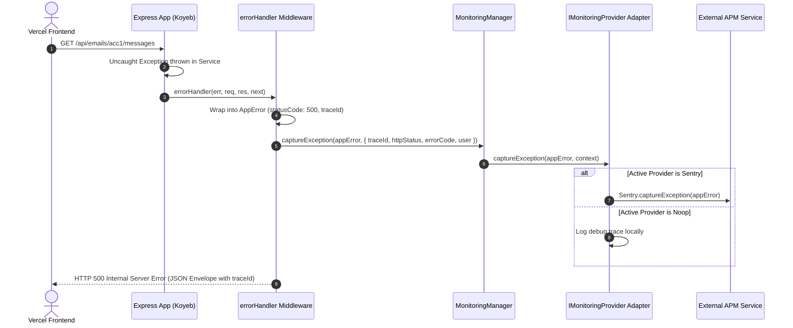

# Observability & Reliability - Phase 3 Implementation Details

> **Feature:** observability-reliability · **Phase:** 3 (Pluggable Monitoring Provider Architecture)
> **Status:** COMPLETED
> **Created:** 2026-09-14 · **Last Updated:** 2026-09-14

---

## 1. Goal Description & Scope

Decouple Application Performance Monitoring (APM) and centralized exception tracking from Sentry using the **Strategy / Adapter design pattern**. 

Prior to this phase, Sentry was tightly coupled and statically initialized in a legacy script (`Backend/src/instruction.mjs`) with zero abstraction, preventing the platform from switching monitoring vendors (e.g. New Relic, Datadog) or running isolated local/test environments without leaking error events. Furthermore, unused logging packages (such as `winston`) remained in `Backend/package.json`, causing configuration bloat.

Specifically, this phase accomplishes:

1. **Pluggable Strategy Contract (`IMonitoringProvider`):** Establishes a vendor-agnostic monitoring interface defining standardized lifecycle hooks: `init()`, `captureException()`, `captureMessage()`, `setUser()`, `addBreadcrumb()`, and `reportWorkerError()`.
2. **Concrete Provider Adapters:**
   - `SentryMonitoringProvider`: Encapsulates `@sentry/node` with full breadcrumb, user identification, and worker error reporting capabilities.
   - `NoopMonitoringProvider`: High-performance no-op fallback for CI/CD test runs and local offline development, preventing unwanted network calls or fake DSN alerts.
3. **Monitoring Manager Singleton (`MonitoringManager`):** Manages provider instantiation, lifecycle initialization, and dynamic provider switching controlled by the `MONITORING_PROVIDER` environment variable (`sentry | noop`).
4. **Clean Application Entrypoint Integration (`server.ts`):** Replaces legacy `import './instruction.mjs'` with early asynchronous monitoring initialization as the very first step in server bootstrap.
5. **Worker & HTTP Middleware Error Wiring:**
   - Integrates `monitoring.captureException()` directly into `Backend/src/middlewares/error.handler.ts` with HTTP request context, user identity, and active `traceId`.
   - Integrates `monitoring.reportWorkerError()` directly into `Backend/src/workers/base.worker.ts` with queue name, job ID, and job name.
6. **Dependency & File Cleanup:** Deletes legacy `Backend/src/instruction.mjs` and uninstalls obsolete `winston` from `Backend/package.json`.

---

## 2. User Review Required & Architectural Notes

> [!IMPORTANT]
> **Key Architectural Decisions & Standards Adherence**
>
> - **Vendor Independence via Strategy Pattern:** The rest of the codebase (`errorHandler`, `BaseWorker`, services) NEVER imports `@sentry/node` directly. Instead, all layers interact exclusively through `monitoring` exported from `@monitoring`. Changing APM vendors requires zero business logic changes.
> - **Zero Test Side Effects (`noop` Provider in Tests):** When `NODE_ENV === 'test'` or `MONITORING_PROVIDER === 'noop'`, `NoopMonitoringProvider` is selected. This guarantees that running `pnpm test` will never emit network calls to external monitoring vendors or pollute APM dashboards.
> - **Strict Exception Context Preservation:** The active `traceId` from `AsyncLocalStorage` is automatically passed into `captureException` and `reportWorkerError`. This enables Sentry issues to be directly correlated with Pino server logs and Vercel frontend request traces.
> - **Strict Error Handling in Monitoring:** If a monitoring provider throws during error capture (e.g. invalid credentials or network socket failure), the failure is caught and logged via `createLogger('MonitoringManager')` without interrupting the primary HTTP response or BullMQ job execution.

---

## 3. Component Overview & File Map

| Component | Target File | Action | Purpose |
| --------- | ----------- | ------ | ------- |
| Backend | `Backend/src/core/types/monitoring.types.ts` | **[NEW]** | Strict interfaces for `IMonitoringProvider`, `LOG_LEVELS`, `MonitoringConfig`, `MonitoringErrorContext`, and `WorkerJobMetadata` |
| Backend | `Backend/src/core/types/index.ts` | **[MODIFY]** | Re-export monitoring types via `@types` |
| Backend | `Backend/src/core/constants/monitoring.constants.ts` | **[NEW]** | Centralized constants `MONITORING_PROVIDERS` and default config keys |
| Backend | `Backend/src/core/constants/index.ts` | **[MODIFY]** | Re-export monitoring constants via `@constants` |
| Backend | `Backend/src/core/config/logger.config.ts` | **[MODIFY]** | Use `LOG_LEVELS.INFO` constant for default log level |
| Backend | `Backend/src/core/monitoring/providers/sentry.provider.ts` | **[NEW]** | Concrete Sentry APM adapter wrapping `@sentry/node` |
| Backend | `Backend/src/core/monitoring/providers/noop.provider.ts` | **[NEW]** | Zero-dependency no-op adapter for testing and local development |
| Backend | `Backend/src/core/monitoring/monitoring.manager.ts` | **[NEW]** | Singleton strategy manager and provider factory |
| Backend | `Backend/src/core/monitoring/index.ts` | **[NEW]** | Clean barrel exports for `@monitoring` |
| Backend | `Backend/tsconfig.json` | **[MODIFY]** | Register `@monitoring` path mapping |
| Backend | `Backend/jest.config.js` | **[MODIFY]** | Register `^@monitoring$` in Jest `moduleNameMapper` |
| Backend | `Backend/src/server.ts` | **[MODIFY]** | Initialize monitoring on startup; remove `import './instruction.mjs'` |
| Backend | `Backend/src/instruction.mjs` | **[DELETE]** | Remove legacy un-abstracted Sentry initialization |
| Backend | `Backend/src/middlewares/error.handler.ts` | **[MODIFY]** | Transmit unhandled/critical errors to active monitoring provider |
| Backend | `Backend/src/workers/base.worker.ts` | **[MODIFY]** | Report background worker job failures to monitoring provider |
| Backend | `Backend/package.json` | **[MODIFY]** | Remove obsolete `winston` dependency |
| Frontend | `Frontend/src/...` | **[N/A]** | Frontend APM & session tracking scheduled for Phase 3.5 |

---

## 4. Main Section 1: Backend Layer Implementation

### 4.1 Monitoring Contracts & DTOs (`Backend/src/core/types/monitoring.types.ts`)

```typescript
import { ErrorCode } from '../errors/ErrorCodes.js';

export type MonitoringProviderName = 'sentry' | 'newrelic' | 'noop';

export interface MonitoringConfig {
    provider: MonitoringProviderName;
    dsn?: string;
    environment: string;
    release?: string;
    sampleRate?: number;
    sendDefaultPii?: boolean;
    debug?: boolean;
}

export interface MonitoringUserContext {
    id: string;
    email?: string;
    username?: string;
    ipAddress?: string;
}

export interface MonitoringBreadcrumb {
    category: string;
    message: string;
    level?: 'info' | 'warn' | 'error' | 'debug';
    timestamp?: number;
    data?: Record<string, string | number | boolean>;
}

export interface MonitoringErrorContext {
    traceId?: string;
    httpStatus?: number;
    errorCode?: ErrorCode;
    user?: MonitoringUserContext;
    tags?: Record<string, string | number | boolean>;
    extra?: Record<string, string | number | boolean>;
}

export interface WorkerJobMetadata {
    queueName: string;
    jobId: string;
    jobName: string;
    traceId?: string;
}

export interface IMonitoringProvider {
    readonly name: MonitoringProviderName;
    init(config: MonitoringConfig): Promise<void> | void;
    captureException(error: Error, context?: MonitoringErrorContext): void;
    captureMessage(message: string, level?: 'info' | 'warn' | 'error', context?: Record<string, string | number | boolean>): void;
    setUser(user: MonitoringUserContext | null): void;
    addBreadcrumb(breadcrumb: MonitoringBreadcrumb): void;
    reportWorkerError(error: Error, metadata: WorkerJobMetadata): void;
}
```

---

### 4.2 Re-export in Types Barrel (`Backend/src/core/types/index.ts`)

```typescript
export * from './auth.types.js';
export * from './common.types.js';
export * from './database.types.js';
export * from './error.types.js';
export * from './monitoring.types.js';
export * from './observability.types.js';
export * from './redis.types.js';
export * from './repository.types.js';
export * from './request.types.js';
```

---

### 4.3 Monitoring Constants (`Backend/src/core/constants/monitoring.constants.ts`)

```typescript
export const MONITORING_PROVIDERS = {
    SENTRY: 'sentry',
    NEW_RELIC: 'newrelic',
    NOOP: 'noop',
} as const;

export const DEFAULT_MONITORING_CONFIG = {
    DEFAULT_PROVIDER: MONITORING_PROVIDERS.NOOP,
    DEFAULT_SAMPLE_RATE: 1.0,
    DEFAULT_SEND_DEFAULT_PII: true,
} as const;
```

---

### 4.4 Re-export in Constants Barrel (`Backend/src/core/constants/index.ts`)

```typescript
export * from './app.constants.js';
export * from './database.constants.js';
export * from './email.constants.js';
export * from './monitoring.constants.js';
export * from './observability.constants.js';
export * from './redis.constants.js';
```

---

### 4.5 Concrete Sentry Provider (`Backend/src/core/monitoring/providers/sentry.provider.ts`)

```typescript
import { createLogger } from '@observability';
import { IMonitoringProvider, MonitoringBreadcrumb, MonitoringConfig, MonitoringErrorContext, MonitoringProviderName, MonitoringUserContext, WorkerJobMetadata } from '@types';
import * as Sentry from '@sentry/node';

export class SentryMonitoringProvider implements IMonitoringProvider {
    public readonly name: MonitoringProviderName = 'sentry';
    private readonly providerLogger = createLogger('SentryProvider');
    private initialized = false;

    public init(config: MonitoringConfig): void {
        try {
            if (!config.dsn) {
                this.providerLogger.warn('Sentry DSN not provided. Falling back to local logging mode.');
                return;
            }

            Sentry.init({
                dsn: config.dsn,
                environment: config.environment,
                release: config.release,
                tracesSampleRate: config.sampleRate ?? 1.0,
                sendDefaultPii: config.sendDefaultPii ?? true,
                integrations: [Sentry.expressIntegration()],
            });

            this.initialized = true;
            this.providerLogger.info('✅ Sentry monitoring provider initialized successfully', {
                environment: config.environment,
                release: config.release ?? 'unknown',
            });
        } catch (error) {
            const msg = error instanceof Error ? error.message : String(error);
            this.providerLogger.error(`Failed to initialize Sentry provider: ${msg}`, { error });
        }
    }

    public captureException(error: Error, context?: MonitoringErrorContext): void {
        try {
            if (!this.initialized) {
                this.providerLogger.debug(`[Sentry Not Initialized] captureException: ${error.message}`);
                return;
            }

            Sentry.withScope((scope) => {
                if (context?.traceId) {
                    scope.setTag('traceId', context.traceId);
                }
                if (context?.errorCode) {
                    scope.setTag('errorCode', context.errorCode);
                }
                if (context?.httpStatus) {
                    scope.setExtra('httpStatus', context.httpStatus);
                }
                if (context?.user) {
                    scope.setUser({
                        id: context.user.id,
                        email: context.user.email,
                        username: context.user.username,
                        ip_address: context.user.ipAddress,
                    });
                }
                if (context?.tags) {
                    for (const [key, value] of Object.entries(context.tags)) {
                        scope.setTag(key, String(value));
                    }
                }
                if (context?.extra) {
                    for (const [key, value] of Object.entries(context.extra)) {
                        scope.setExtra(key, value);
                    }
                }

                Sentry.captureException(error);
            });
        } catch (captureError) {
            const msg = captureError instanceof Error ? captureError.message : String(captureError);
            this.providerLogger.error(`Error in Sentry captureException: ${msg}`, { error: captureError });
        }
    }

    public captureMessage(message: string, level: 'info' | 'warn' | 'error' = 'info', context?: Record<string, string | number | boolean>): void {
        try {
            if (!this.initialized) {
                return;
            }

            Sentry.withScope((scope) => {
                if (context) {
                    for (const [key, value] of Object.entries(context)) {
                        scope.setExtra(key, value);
                    }
                }
                Sentry.captureMessage(message, level);
            });
        } catch (err) {
            const msg = err instanceof Error ? err.message : String(err);
            this.providerLogger.error(`Error in Sentry captureMessage: ${msg}`, { error: err });
        }
    }

    public setUser(user: MonitoringUserContext | null): void {
        try {
            if (!this.initialized) return;

            if (user) {
                Sentry.setUser({
                    id: user.id,
                    email: user.email,
                    username: user.username,
                    ip_address: user.ipAddress,
                });
            } else {
                Sentry.setUser(null);
            }
        } catch (err) {
            const msg = err instanceof Error ? err.message : String(err);
            this.providerLogger.error(`Error in Sentry setUser: ${msg}`, { error: err });
        }
    }

    public addBreadcrumb(breadcrumb: MonitoringBreadcrumb): void {
        try {
            if (!this.initialized) return;

            Sentry.addBreadcrumb({
                category: breadcrumb.category,
                message: breadcrumb.message,
                level: breadcrumb.level ?? 'info',
                timestamp: breadcrumb.timestamp ? breadcrumb.timestamp / 1000 : undefined,
                data: breadcrumb.data,
            });
        } catch (err) {
            const msg = err instanceof Error ? err.message : String(err);
            this.providerLogger.error(`Error in Sentry addBreadcrumb: ${msg}`, { error: err });
        }
    }

    public reportWorkerError(error: Error, metadata: WorkerJobMetadata): void {
        try {
            if (!this.initialized) return;

            Sentry.withScope((scope) => {
                scope.setTag('workerQueue', metadata.queueName);
                scope.setTag('jobName', metadata.jobName);
                scope.setExtra('jobId', metadata.jobId);
                if (metadata.traceId) {
                    scope.setTag('traceId', metadata.traceId);
                }
                Sentry.captureException(error);
            });
        } catch (err) {
            const msg = err instanceof Error ? err.message : String(err);
            this.providerLogger.error(`Error in Sentry reportWorkerError: ${msg}`, { error: err });
        }
    }
}
```

---

### 4.6 Concrete New Relic Provider (`Backend/src/core/monitoring/providers/newrelic.provider.ts`)

```typescript
import { createLogger } from '@observability';
import { IMonitoringProvider, MonitoringBreadcrumb, MonitoringConfig, MonitoringErrorContext, MonitoringProviderName, MonitoringUserContext, WorkerJobMetadata } from '@types';

export class NewRelicMonitoringProvider implements IMonitoringProvider {
    public readonly name: MonitoringProviderName = 'newrelic';
    private readonly providerLogger = createLogger('NewRelicProvider');
    private initialized = false;

    public init(config: MonitoringConfig): void {
        try {
            // Check if New Relic agent is loaded in Node process
            const globalWithNr = global as typeof globalThis & { newrelic?: { noticeError: (err: Error, customAttributes?: Record<string, string | number | boolean>) => void } };
            if (!globalWithNr.newrelic && process.env.NEW_RELIC_LICENSE_KEY) {
                this.providerLogger.warn('New Relic license key specified, but newrelic module is not pre-loaded via -r newrelic.');
            }

            this.initialized = true;
            this.providerLogger.info('✅ New Relic monitoring provider registered', {
                environment: config.environment,
            });
        } catch (error) {
            const msg = error instanceof Error ? error.message : String(error);
            this.providerLogger.error(`Failed to initialize New Relic provider: ${msg}`, { error });
        }
    }

    public captureException(error: Error, context?: MonitoringErrorContext): void {
        try {
            if (!this.initialized) return;

            const globalWithNr = global as typeof globalThis & { newrelic?: { noticeError: (err: Error, customAttributes?: Record<string, string | number | boolean>) => void } };
            if (globalWithNr.newrelic) {
                const attributes: Record<string, string | number | boolean> = {
                    ...(context?.tags || {}),
                    ...(context?.extra || {}),
                };
                if (context?.traceId) attributes.traceId = context.traceId;
                if (context?.errorCode) attributes.errorCode = context.errorCode;
                if (context?.httpStatus) attributes.httpStatus = context.httpStatus;
                if (context?.user?.id) attributes.userId = context.user.id;

                globalWithNr.newrelic.noticeError(error, attributes);
            } else {
                this.providerLogger.debug(`[New Relic] noticeError: ${error.message}`, {
                    traceId: context?.traceId,
                    errorCode: context?.errorCode,
                });
            }
        } catch (err) {
            const msg = err instanceof Error ? err.message : String(err);
            this.providerLogger.error(`Error in New Relic captureException: ${msg}`, { error: err });
        }
    }

    public captureMessage(message: string, level: 'info' | 'warn' | 'error' = 'info', context?: Record<string, string | number | boolean>): void {
        try {
            this.providerLogger.info(`[New Relic Message] [${level.toUpperCase()}] ${message}`, context);
        } catch (err) {
            const msg = err instanceof Error ? err.message : String(err);
            this.providerLogger.error(`Error in New Relic captureMessage: ${msg}`, { error: err });
        }
    }

    public setUser(user: MonitoringUserContext | null): void {
        try {
            if (user) {
                this.providerLogger.debug(`[New Relic] Set user: ${user.id}`);
            }
        } catch (err) {
            const msg = err instanceof Error ? err.message : String(err);
            this.providerLogger.error(`Error in New Relic setUser: ${msg}`, { error: err });
        }
    }

    public addBreadcrumb(breadcrumb: MonitoringBreadcrumb): void {
        try {
            this.providerLogger.debug(`[New Relic Breadcrumb] ${breadcrumb.category}: ${breadcrumb.message}`);
        } catch (err) {
            const msg = err instanceof Error ? err.message : String(err);
            this.providerLogger.error(`Error in New Relic addBreadcrumb: ${msg}`, { error: err });
        }
    }

    public reportWorkerError(error: Error, metadata: WorkerJobMetadata): void {
        try {
            this.captureException(error, {
                traceId: metadata.traceId,
                tags: {
                    queueName: metadata.queueName,
                    jobName: metadata.jobName,
                    jobId: metadata.jobId,
                },
            });
        } catch (err) {
            const msg = err instanceof Error ? err.message : String(err);
            this.providerLogger.error(`Error in New Relic reportWorkerError: ${msg}`, { error: err });
        }
    }
}
```

---

### 4.7 Concrete No-Op Provider (`Backend/src/core/monitoring/providers/noop.provider.ts`)

```typescript
import { createLogger } from '@observability';
import { IMonitoringProvider, MonitoringBreadcrumb, MonitoringConfig, MonitoringErrorContext, MonitoringProviderName, MonitoringUserContext, WorkerJobMetadata } from '@types';

export class NoopMonitoringProvider implements IMonitoringProvider {
    public readonly name: MonitoringProviderName = 'noop';
    private readonly providerLogger = createLogger('NoopMonitoringProvider');

    public init(config: MonitoringConfig): void {
        try {
            this.providerLogger.debug('No-op monitoring provider initialized (local/test mode)', {
                environment: config.environment,
            });
        } catch (error) {
            const msg = error instanceof Error ? error.message : String(error);
            this.providerLogger.error(`Error in Noop init: ${msg}`, { error });
        }
    }

    public captureException(error: Error, context?: MonitoringErrorContext): void {
        try {
            this.providerLogger.debug(`[Noop Capture] Exception: ${error.message}`, {
                traceId: context?.traceId,
                errorCode: context?.errorCode,
            });
        } catch (err) {
            const msg = err instanceof Error ? err.message : String(err);
            this.providerLogger.error(`Error in Noop captureException: ${msg}`, { error: err });
        }
    }

    public captureMessage(message: string, level: 'info' | 'warn' | 'error' = 'info', context?: Record<string, string | number | boolean>): void {
        try {
            this.providerLogger.debug(`[Noop Message] [${level}] ${message}`, context);
        } catch (err) {
            const msg = err instanceof Error ? err.message : String(err);
            this.providerLogger.error(`Error in Noop captureMessage: ${msg}`, { error: err });
        }
    }

    public setUser(_user: MonitoringUserContext | null): void {
        // No-op by design
    }

    public addBreadcrumb(_breadcrumb: MonitoringBreadcrumb): void {
        // No-op by design
    }

    public reportWorkerError(error: Error, metadata: WorkerJobMetadata): void {
        try {
            this.providerLogger.debug(`[Noop Worker Error] Queue: ${metadata.queueName} - Job: ${metadata.jobId}: ${error.message}`);
        } catch (err) {
            const msg = err instanceof Error ? err.message : String(err);
            this.providerLogger.error(`Error in Noop reportWorkerError: ${msg}`, { error: err });
        }
    }
}
```

---

### 4.8 Monitoring Manager Singleton (`Backend/src/core/monitoring/monitoring.manager.ts`)

```typescript
import { NODE_ENV } from '@config';
import { MONITORING_PROVIDERS } from '@constants';
import { createLogger } from '@observability';
import { IMonitoringProvider, MonitoringBreadcrumb, MonitoringConfig, MonitoringErrorContext, MonitoringProviderName, MonitoringUserContext, WorkerJobMetadata } from '@types';
import { NewRelicMonitoringProvider } from './providers/newrelic.provider.js';
import { NoopMonitoringProvider } from './providers/noop.provider.js';
import { SentryMonitoringProvider } from './providers/sentry.provider.js';

export class MonitoringManager implements IMonitoringProvider {
    private static instance: MonitoringManager | null = null;
    private provider: IMonitoringProvider;
    private readonly managerLogger = createLogger('MonitoringManager');
    private isInitialized = false;

    private constructor() {
        this.provider = this.createDefaultProvider();
    }

    public static getInstance(): MonitoringManager {
        if (!MonitoringManager.instance) {
            MonitoringManager.instance = new MonitoringManager();
        }
        return MonitoringManager.instance;
    }

    public get name(): MonitoringProviderName {
        return this.provider.name;
    }

    private createDefaultProvider(): IMonitoringProvider {
        try {
            // For tests, default to noop to prevent any remote API calls
            if (NODE_ENV === 'test') {
                return new NoopMonitoringProvider();
            }

            const configuredProvider = (process.env.MONITORING_PROVIDER || '').toLowerCase();

            switch (configuredProvider) {
                case MONITORING_PROVIDERS.SENTRY:
                    return new SentryMonitoringProvider();
                case MONITORING_PROVIDERS.NEW_RELIC:
                    return new NewRelicMonitoringProvider();
                case MONITORING_PROVIDERS.NOOP:
                    return new NoopMonitoringProvider();
                default:
                    // If Sentry DSN is present, default to Sentry; otherwise Noop
                    if (process.env.SENTRY_DSN) {
                        return new SentryMonitoringProvider();
                    }
                    return new NoopMonitoringProvider();
            }
        } catch (error) {
            const msg = error instanceof Error ? error.message : String(error);
            this.managerLogger.error(`Failed to resolve default monitoring provider: ${msg}`, { error });
            return new NoopMonitoringProvider();
        }
    }

    public init(config?: Partial<MonitoringConfig>): void {
        try {
            if (this.isInitialized) {
                this.managerLogger.warn('MonitoringManager is already initialized. Skipping re-init.');
                return;
            }

            const effectiveConfig: MonitoringConfig = {
                provider: this.provider.name,
                dsn: config?.dsn ?? process.env.SENTRY_DSN,
                environment: config?.environment ?? NODE_ENV ?? 'development',
                release: config?.release ?? process.env.APP_VERSION ?? '3.2.0',
                sampleRate: config?.sampleRate ?? 1.0,
                sendDefaultPii: config?.sendDefaultPii ?? true,
                debug: config?.debug ?? false,
            };

            this.provider.init(effectiveConfig);
            this.isInitialized = true;
            this.managerLogger.info(`Monitoring initialized with provider: [${this.provider.name}]`);
        } catch (error) {
            const msg = error instanceof Error ? error.message : String(error);
            this.managerLogger.error(`Critical error during MonitoringManager initialization: ${msg}`, { error });
        }
    }

    public setProvider(newProvider: IMonitoringProvider, config?: Partial<MonitoringConfig>): void {
        try {
            this.provider = newProvider;
            this.isInitialized = false;
            this.init(config);
            this.managerLogger.info(`Switched active monitoring provider to: [${newProvider.name}]`);
        } catch (error) {
            const msg = error instanceof Error ? error.message : String(error);
            this.managerLogger.error(`Failed to switch monitoring provider: ${msg}`, { error });
        }
    }

    public captureException(error: Error, context?: MonitoringErrorContext): void {
        this.provider.captureException(error, context);
    }

    public captureMessage(message: string, level: LOG_LEVELS = LOG_LEVELS.INFO, context?: Record<string, string | number | boolean>): void {
        this.provider.captureMessage(message, level, context);
    }

    public setUser(user: MonitoringUserContext | null): void {
        this.provider.setUser(user);
    }

    public addBreadcrumb(breadcrumb: MonitoringBreadcrumb): void {
        this.provider.addBreadcrumb(breadcrumb);
    }

    public reportWorkerError(error: Error, metadata: WorkerJobMetadata): void {
        this.provider.reportWorkerError(error, metadata);
    }
}

export const monitoring = MonitoringManager.getInstance();
```

---

### 4.9 Core Monitoring Barrel (`Backend/src/core/monitoring/index.ts`)

```typescript
export * from './monitoring.manager.js';
export * from './providers/newrelic.provider.js';
export * from './providers/noop.provider.js';
export * from './providers/sentry.provider.js';
```

---

### 4.10 Path Aliases & Jest Mapping Updates

#### `Backend/tsconfig.json`
```json
{
    "compilerOptions": {
        "paths": {
            "@config": ["core/config/index.js"],
            "@constants": ["core/constants/index.js"],
            "@errors": ["core/errors/index.js"],
            "@monitoring": ["core/monitoring/index.js"],
            "@observability": ["core/observability/index.js"],
            "@queue": ["core/queue/index.js"],
            "@middlewares": ["middlewares/index.js"],
            "@modules/*": ["modules/*"],
            "@integrations/*": ["integrations/*"],
            "@routes/*": ["routes/*"],
            "@types": ["core/types/index.js"],
            "@utils": ["shared/utils/index.js"]
        }
    }
}
```

#### `Backend/jest.config.js`
```javascript
moduleNameMapper: {
    '^@config$': '<rootDir>/src/core/config/index.ts',
    '^@constants$': '<rootDir>/src/core/constants/index.ts',
    '^@errors$': '<rootDir>/src/core/errors/index.ts',
    '^@monitoring$': '<rootDir>/src/core/monitoring/index.ts',
    '^@observability$': '<rootDir>/src/core/observability/index.ts',
    '^@queue$': '<rootDir>/src/core/queue/index.ts',
    // ...
}
```

---

### 4.11 Server Bootstrap Integration (`Backend/src/server.ts`)

```typescript
// Initialize monitoring as the very first import before database or Express
import { monitoring } from '@monitoring';
monitoring.init();

import { connectDB, PORT } from '@config';
import { App } from './app.js';
import { logger } from './shared/utils/logger.js';
import { initBackgroundJobs, shutdownBackgroundJobs } from './core/queue/index.js';

// Create app instance
const appInstance = new App();
const app = appInstance.expressApp;

const startServer = async () => {
    try {
        // Connect MongoDB (with pooling)
        await connectDB();

        // Initialize Background Queues
        initBackgroundJobs();

        // Start Express only after DB is ready
        const server = app.listen(PORT, () => {
            logger.info(`🚀 MailSense Backend is running on port ${PORT}`);
        });

        // Graceful shutdown helper
        const gracefulShutdown = async (signal: string) => {
            logger.info(`Received ${signal}. Starting graceful shutdown...`);

            // Close background jobs & Redis connections
            await shutdownBackgroundJobs();

            // Close server HTTP connections
            server.close(() => {
                logger.info('HTTP server closed.');
                process.exit(0);
            });

            // Force close if server takes too long to shut down
            setTimeout(() => {
                logger.warn('Could not close connections in time, forcefully shutting down');
                process.exit(1);
            }, 10000);
        };

        // Capture termination signals
        process.on('SIGINT', () => gracefulShutdown('SIGINT'));
        process.on('SIGTERM', () => gracefulShutdown('SIGTERM'));
    } catch (error: unknown) {
        const errorMessage = error instanceof Error ? error.message : String(error);
        logger.error(`❌ Failed to start server: ${errorMessage}`, { error });
        process.exit(1);
    }
};

// Start server
startServer();
```

---

### 4.12 Global Error Handler Integration (`Backend/src/middlewares/error.handler.ts`)

```typescript
import { NODE_ENV } from '@config';
import { AppError, AxiosApiError, ErrorCode } from '@errors';
import { monitoring } from '@monitoring';
import { AuthenticatedRequest, ErrorResponsePayload } from '@types';
import { NextFunction, Request, Response } from 'express';
import { logger } from '../shared/utils/logger.js';

export const errorHandler = (err: unknown, req: Request, res: Response, _next: NextFunction): void => {
    try {
        let appError: AppError;

        if (err instanceof AppError) {
            appError = err;
        } else if (err instanceof Error) {
            appError = new AppError({
                message: err.message,
                httpStatus: 500,
                errorCode: ErrorCode.INTERNAL_ERROR,
                isOperational: false,
                description: 'An unhandled internal application error occurred.',
                suggestedAction: 'Please try again later. System administrators have been alerted.',
            });
            appError.stack = err.stack;
        } else {
            appError = new AppError({
                message: 'An unexpected and unclassified error occurred.',
                httpStatus: 500,
                errorCode: ErrorCode.INTERNAL_ERROR,
                isOperational: false,
            });
        }

        const statusCode = appError.httpStatus || 500;
        const isDev = NODE_ENV === 'local' || NODE_ENV === 'development';

        logger.error(`[${req.method}] ${req.url} -> ${statusCode} [${appError.errorCode}] :: ${appError.message}`, {
            errorCode: appError.errorCode,
            traceId: appError.traceId,
            httpStatus: statusCode,
            stack: appError.stack,
        });

        // Transmit non-operational or 5xx server errors to the active monitoring provider
        if (!appError.isOperational || statusCode >= 500) {
            const authReq = req as AuthenticatedRequest;
            monitoring.captureException(appError, {
                traceId: appError.traceId,
                httpStatus: statusCode,
                errorCode: appError.errorCode,
                user: authReq.user ? { id: authReq.user.id, email: authReq.user.email } : undefined,
                tags: {
                    method: req.method,
                    path: req.path,
                },
                extra: {
                    url: req.originalUrl,
                    query: JSON.stringify(req.query),
                },
            });
        }

        const errorPayload: ErrorResponsePayload = appError.toJSON(isDev);

        // Safely extract typed original error if present in AxiosApiError during development
        if (isDev && appError instanceof AxiosApiError && appError.originalError) {
            errorPayload.error.external = appError.originalError;
        }

        res.status(statusCode).json(errorPayload);
    } catch (criticalHandlerError) {
        const fallbackMessage = criticalHandlerError instanceof Error ? criticalHandlerError.message : String(criticalHandlerError);
        logger.error(`Critical failure in errorHandler middleware: ${fallbackMessage}`);

        res.status(500).json({
            status: false,
            message: 'Internal Server Error',
            error: {
                code: 500,
                errorCode: ErrorCode.INTERNAL_ERROR,
                traceId: '',
                description: 'A critical unexpected error occurred while processing the error response.',
            },
        });
    }
};
```

---

### 4.13 Base Worker Integration (`Backend/src/workers/base.worker.ts`)

```typescript
import { monitoring } from '@monitoring';
import { createLogger, runWithTrace } from '@observability';
import { getRedisConnection } from '@queue';
import { ConnectionOptions, Job, Worker, WorkerOptions } from 'bullmq';
import crypto from 'node:crypto';

export abstract class BaseWorker<TData, TResult> {
    protected worker!: Worker<TData, TResult>;
    protected abstract queueName: string;
    protected abstract processJob(job: Job<TData, TResult>): Promise<TResult>;
    protected workerLogger = createLogger('BaseWorker');

    public start(): void {
        const connection = getRedisConnection();
        const prefix = process.env.NODE_ENV === 'test' ? 'bull-test' : process.env.BULL_PREFIX || 'bull';

        const workerOptions: WorkerOptions = {
            connection: connection as ConnectionOptions,
            concurrency: 2,
            prefix,
            lockDuration: 300000,
        };

        this.worker = new Worker<TData, TResult>(
            this.queueName,
            async (job) => {
                // Extract traceId from job payload if available, or generate a fresh traceId
                const jobData = job.data as Record<string, unknown> | undefined;
                const traceId = typeof jobData?.traceId === 'string' && jobData.traceId.length > 0 ? jobData.traceId : crypto.randomUUID();

                return await runWithTrace({ traceId }, async () => {
                    this.workerLogger.info(`🚀 Starting job ${job.id} [${job.name}] on queue ${this.queueName}`, {
                        jobId: job.id,
                        queueName: this.queueName,
                        jobName: job.name,
                    });
                    try {
                        return await this.processJob(job);
                    } catch (error) {
                        const err = error instanceof Error ? error : new Error(String(error));
                        this.workerLogger.error(`❌ Job ${job.id} failed in processor: ${err.message}`, {
                            error: err,
                            jobId: job.id,
                            queueName: this.queueName,
                        });

                        // Report background worker failure to active APM provider
                        monitoring.reportWorkerError(err, {
                            queueName: this.queueName,
                            jobId: String(job.id),
                            jobName: job.name,
                            traceId,
                        });

                        throw err;
                    }
                });
            },
            workerOptions,
        );

        this.worker.on('active', (job) => {
            this.workerLogger.info(`🏃 Job ${job.id} is now active`, { jobId: job.id, queueName: this.queueName });
            this.onActive(job);
        });

        this.worker.on('completed', (job, result) => {
            this.workerLogger.info(`✅ Job ${job.id} completed successfully`, { jobId: job.id, queueName: this.queueName });
            this.onCompleted(job, result);
        });

        this.worker.on('failed', (job, err) => {
            this.workerLogger.error(`💥 Job ${job?.id} failed with error: ${err.message}`, {
                error: err,
                jobId: job?.id,
                queueName: this.queueName,
            });
            this.onFailed(job, err);
        });
    }

    protected async onActive(_job: Job<TData, TResult>): Promise<void> {}
    protected async onCompleted(_job: Job<TData, TResult>, _result: TResult): Promise<void> {}
    protected async onFailed(_job: Job<TData, TResult> | undefined, _error: Error): Promise<void> {}

    public async close(): Promise<void> {
        try {
            if (this.worker) {
                await this.worker.close();
                this.workerLogger.info(`🔒 Worker for queue ${this.queueName} closed`);
            }
        } catch (error) {
            const msg = error instanceof Error ? error.message : String(error);
            this.workerLogger.error(`Error closing worker for queue ${this.queueName}: ${msg}`, { error });
        }
    }
}
```

---

### 4.14 Package Dependencies & File Cleanup

1. **Delete File:** `Backend/src/instruction.mjs`
2. **Remove Dependency from `Backend/package.json`:**
   - Remove `"winston": "^3.19.0"` from `"dependencies"`.

---

## 5. Main Section 2: Frontend Layer Implementation

*Note: Phase 3.3 focuses strictly on the Backend Pluggable APM architecture. The Frontend user session recording, error boundary with trace ID presentation, and Sentry Replay integration are scheduled for **Phase 3.5: Frontend Error Boundary & Session Tracking** in alignment with the master roadmap.*

---

## 6. Low-Level Design & Sequence Flow

### 6.1 Strategy Pattern Class Diagram

```mermaid
classDiagram
    class IMonitoringProvider {
        <<interface>>
        +name: MonitoringProviderName
        +init(config: MonitoringConfig): void
        +captureException(error: Error, context?: MonitoringErrorContext): void
        +captureMessage(message: string, level?: string, context?: Record): void
        +setUser(user: MonitoringUserContext | null): void
        +addBreadcrumb(breadcrumb: MonitoringBreadcrumb): void
        +reportWorkerError(error: Error, metadata: WorkerJobMetadata): void
    }

    class SentryMonitoringProvider {
        -initialized: boolean
        -providerLogger: ModuleLogger
        +name: 'sentry'
        +init(config: MonitoringConfig): void
        +captureException(error: Error, context?: MonitoringErrorContext): void
        +captureMessage(message: string, level?: string, context?: Record): void
        +setUser(user: MonitoringUserContext | null): void
        +addBreadcrumb(breadcrumb: MonitoringBreadcrumb): void
        +reportWorkerError(error: Error, metadata: WorkerJobMetadata): void
    }

    class NewRelicMonitoringProvider {
        -initialized: boolean
        -providerLogger: ModuleLogger
        +name: 'newrelic'
        +init(config: MonitoringConfig): void
        +captureException(error: Error, context?: MonitoringErrorContext): void
        +captureMessage(message: string, level?: string, context?: Record): void
        +setUser(user: MonitoringUserContext | null): void
        +addBreadcrumb(breadcrumb: MonitoringBreadcrumb): void
        +reportWorkerError(error: Error, metadata: WorkerJobMetadata): void
    }

    class NoopMonitoringProvider {
        -providerLogger: ModuleLogger
        +name: 'noop'
        +init(config: MonitoringConfig): void
        +captureException(error: Error, context?: MonitoringErrorContext): void
        +captureMessage(message: string, level?: string, context?: Record): void
        +setUser(user: MonitoringUserContext | null): void
        +addBreadcrumb(breadcrumb: MonitoringBreadcrumb): void
        +reportWorkerError(error: Error, metadata: WorkerJobMetadata): void
    }

    class MonitoringManager {
        -instance: MonitoringManager
        -provider: IMonitoringProvider
        -managerLogger: ModuleLogger
        -isInitialized: boolean
        +getInstance(): MonitoringManager
        +init(config?: Partial~MonitoringConfig~): void
        +setProvider(newProvider: IMonitoringProvider, config?: Partial~MonitoringConfig~): void
        +captureException(error: Error, context?: MonitoringErrorContext): void
        +captureMessage(message: string, level?: string, context?: Record): void
        +setUser(user: MonitoringUserContext | null): void
        +addBreadcrumb(breadcrumb: MonitoringBreadcrumb): void
        +reportWorkerError(error: Error, metadata: WorkerJobMetadata): void
    }

    IMonitoringProvider <|.. SentryMonitoringProvider
    IMonitoringProvider <|.. NewRelicMonitoringProvider
    IMonitoringProvider <|.. NoopMonitoringProvider
    IMonitoringProvider <|.. MonitoringManager
    MonitoringManager o-- IMonitoringProvider
```



---

### 6.2 Error Ingestion Sequence Flow



---

## 7. Step-by-Step Task Checklist

- [x] **Task 1: Monitoring Types & Constants Setup**
  - [x] Create `Backend/src/core/types/monitoring.types.ts` defining `IMonitoringProvider`, `LOG_LEVELS`, `MonitoringConfig`, `MonitoringUserContext`, `MonitoringBreadcrumb`, `MonitoringErrorContext`, and `WorkerJobMetadata`
  - [x] Re-export monitoring types in `Backend/src/core/types/index.ts`
  - [x] Create `Backend/src/core/constants/monitoring.constants.ts` defining `MONITORING_PROVIDERS` and default settings
  - [x] Re-export monitoring constants in `Backend/src/core/constants/index.ts`
- [x] **Task 2: Concrete Monitoring Adapters Implementation**
  - [x] Implement `Backend/src/core/monitoring/providers/sentry.provider.ts` wrapping `@sentry/node`
  - [x] Implement `Backend/src/core/monitoring/providers/noop.provider.ts` for zero-overhead testing
- [x] **Task 3: Monitoring Manager Singleton & Module Barrel**
  - [x] Implement `Backend/src/core/monitoring/monitoring.manager.ts`
  - [x] Create `Backend/src/core/monitoring/index.ts` with clean barrel exports
  - [x] Add `@monitoring` alias to `Backend/tsconfig.json` and `Backend/jest.config.js`
- [x] **Task 4: Server Bootstrap & Legacy Cleanup**
  - [x] Update `Backend/src/server.ts` to initialize `monitoring.init()` on startup
  - [x] Delete legacy un-abstracted `Backend/src/instruction.mjs`
  - [x] Remove obsolete `winston` dependency from `Backend/package.json`
- [x] **Task 5: Error Handler & Base Worker Integration**
  - [x] Connect `monitoring.captureException` in `Backend/src/middlewares/error.handler.ts`
  - [x] Connect `monitoring.reportWorkerError` in `Backend/src/workers/base.worker.ts`
- [x] **Task 6: Verification & Compilation**
  - [x] Execute `pnpm build` in `Backend/` ensuring zero TypeScript compiler errors
  - [x] Execute `pnpm type-check` in `Backend/` ensuring zero diagnostic errors
  - [x] Execute `pnpm test` in `Backend/` verifying existing test suite integrity (all 42 tests passing)

---

## 8. Verification & Build Commands

```bash
# 1. Backend Verification
cd /Users/vishaljagamani/Projects/Projects/mailsense/Backend
pnpm build
pnpm type-check

# 2. Test Suite Verification (Ensures Noop provider works in tests)
cd /Users/vishaljagamani/Projects/Projects/mailsense/Backend
pnpm test

# 3. Frontend Verification
cd /Users/vishaljagamani/Projects/Projects/mailsense/Frontend
npx tsc --noEmit
```
