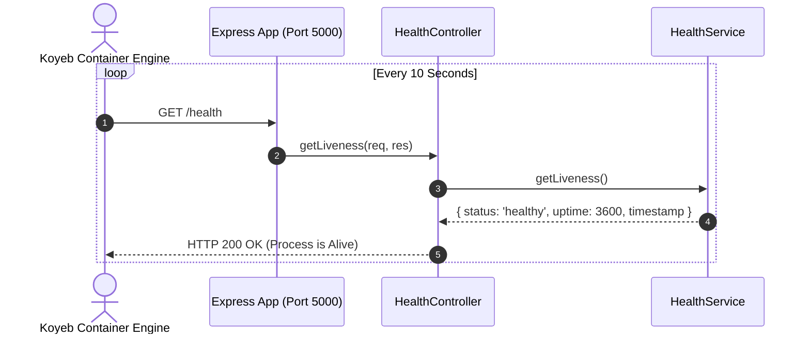

# Observability & Reliability - Phase 4 Implementation Details

> **Feature:** observability-reliability · **Phase:** 4 (Koyeb Health Probes & Readiness Checks)
> **Status:** COMPLETED
> **Created:** 2026-09-14 · **Last Updated:** 2026-09-14

---

## 1. Goal Description & Scope

Establish automated, production-grade health probes and dependency-aware readiness validation for MailSense deployed on Koyeb.

In cloud container environments (such as Koyeb), the orchestrator requires distinct probes to manage container lifecycles:
1. **Liveness Probe (`/health`):** Verifies that the Node.js Express process is up, responsive, and not deadlock-blocked on the event loop. If this probe fails repeatedly, Koyeb automatically restarts the container.
2. **Readiness Probe (`/health/ready`):** Validates that all external dependencies necessary to process user traffic and queue background jobs (specifically **MongoDB** and **Redis**) are connected and responding. If this probe returns HTTP `503 Service Unavailable`, Koyeb stops routing incoming traffic to the container without forcibly killing it, allowing transient connection blips to recover gracefully.

Specifically, this phase accomplishes:

1. **Health Domain Contracts & DTOs:** Defines strict TypeScript interfaces (`LivenessResponse`, `ReadinessResponse`, `ComponentHealth`, `DependencyCheckResult`) in `Backend/src/core/types/health.types.ts`.
2. **Centralized Health Constants:** Defines health status enums and probe path constants in `Backend/src/core/constants/health.constants.ts`.
3. **Health Service (`HealthService`):** Implements lightweight, non-blocking connection checks:
   - **MongoDB Check:** Evaluates `mongoose.connection.readyState === 1` and runs a timeout-guarded `db.admin().ping()`.
   - **Redis Check:** Evaluates Redis connection readiness via `redis.status === 'ready'` and a timeout-guarded `redis.ping()`.
4. **Health Controller (`HealthController`):** Handles HTTP requests:
   - `getLiveness`: Responds immediately with HTTP `200 OK`, server uptime in seconds, and ISO timestamp.
   - `getReadiness`: Asynchronously inspects MongoDB and Redis. Returns HTTP `200 OK` if all dependencies are healthy, or HTTP `503 Service Unavailable` if any dependency is down.
5. **Health Routes (`HealthRoutes`):** Mounts `/health` and `/health/ready` unauthenticated at the application root and optionally under `/api/health` and `/api/health/ready`.
6. **Zero-Log Noise Configuration:** Bypasses `requestLoggerMiddleware` using `HEALTH_PROBES_API_ENDPOINTS` so Koyeb's 10-second polling does not flood application logs.
7. **Express Application Integration:** Integrates `healthRoutes` in `Backend/src/app.ts` before authentication middleware.

---

## 2. User Review Required & Architectural Notes

> [!IMPORTANT]
> **Key Architectural Decisions & Standards Adherence**
>
> - **Separation of Liveness vs. Readiness:**
>   - `/health` ONLY checks if the Node.js Express process can answer HTTP requests. It deliberately NEVER pings the database or Redis. This prevents cascading container restarts across Koyeb when MongoDB or Redis experiences brief network partitions.
>   - `/health/ready` inspects both MongoDB and Redis. If either is disconnected, it returns `503 Service Unavailable` with detailed component statuses (`{ mongodb: "up", redis: "down" }`).
> - **Timeout-Guarded Pings (< 2000ms):** Both MongoDB and Redis pings are protected by a 2-second timeout promise. If a database hangs indefinitely on socket read, the health check will not deadlock; it fails fast with `503`, allowing Koyeb to detect the unhealthy state within its probe deadline.
> - **Unauthenticated Public Endpoints:** Koyeb health checkers cannot transmit user JWTs. Therefore, `/health` and `/health/ready` are mounted publicly before any authentication or session validation middleware.
> - **Zero Pino Log Pollution:** Koyeb polls health endpoints every 5 to 10 seconds. In Phase 2, `requestLoggerMiddleware` was specifically engineered to bypass all endpoints listed in `HEALTH_PROBES_API_ENDPOINTS`, ensuring production logs remain clean and signal-dense.

---

## 3. Component Overview & File Map

| Component | Target File | Action | Purpose |
| --------- | ----------- | ------ | ------- |
| Backend | `Backend/src/core/types/health.types.ts` | **[NEW]** | Strict interfaces for `LivenessResponse`, `ReadinessResponse`, and `ComponentCheck` |
| Backend | `Backend/src/core/types/index.ts` | **[MODIFY]** | Re-export health types via `@types` |
| Backend | `Backend/src/core/constants/health.constants.ts` | **[NEW]** | Centralized constants `HEALTH_STATUS`, `DEPENDENCY_STATUS`, and `HEALTH_ROUTES` |
| Backend | `Backend/src/core/constants/index.ts` | **[MODIFY]** | Re-export health constants via `@constants` |
| Backend | `Backend/src/core/health/health.service.ts` | **[NEW]** | Business logic verifying process uptime, MongoDB ping, and Redis ping |
| Backend | `Backend/src/core/health/health.controller.ts` | **[NEW]** | Controller returning HTTP 200 for healthy or 503 for unhealthy readiness |
| Backend | `Backend/src/core/health/health.routes.ts` | **[NEW]** | Express router mounting `/health` and `/health/ready` |
| Backend | `Backend/src/core/health/index.ts` | **[NEW]** | Clean barrel exports for `@health` module |
| Backend | `Backend/tsconfig.json` | **[MODIFY]** | Register `@health` path mapping |
| Backend | `Backend/jest.config.js` | **[MODIFY]** | Register `^@health$` in Jest `moduleNameMapper` |
| Backend | `Backend/src/app.ts` | **[MODIFY]** | Mount health routes unauthenticated in Express application |
| Frontend | `Frontend/src/...` | **[N/A]** | Health probes are server-side infrastructure for Koyeb deployment |

---

## 4. Main Section 1: Backend Layer Implementation

### 4.1 Health Contracts & DTOs (`Backend/src/core/types/health.types.ts`)

```typescript
export type HealthStatusValue = 'healthy' | 'unhealthy';
export type DependencyStatusValue = 'up' | 'down';

export interface LivenessResponse {
    status: HealthStatusValue;
    uptime: number;
    timestamp: string;
}

export interface DependencyCheckDetails {
    status: DependencyStatusValue;
    latencyMs?: number;
    error?: string;
}

export interface ReadinessChecks {
    mongodb: DependencyStatusValue;
    redis: DependencyStatusValue;
}

export interface ReadinessResponse {
    status: HealthStatusValue;
    checks: ReadinessChecks;
    timestamp: string;
    details?: {
        mongodb?: DependencyCheckDetails;
        redis?: DependencyCheckDetails;
    };
}
```

---

### 4.2 Re-export in Types Barrel (`Backend/src/core/types/index.ts`)

```typescript
export * from './auth.types.js';
export * from './common.types.js';
export * from './database.types.js';
export * from './error.types.js';
export * from './health.types.js';
export * from './monitoring.types.js';
export * from './observability.types.js';
export * from './redis.types.js';
export * from './repository.types.js';
export * from './request.types.js';
```

---

### 4.3 Health Constants (`Backend/src/core/constants/health.constants.ts`)

```typescript
export const HEALTH_STATUS = {
    HEALTHY: 'healthy',
    UNHEALTHY: 'unhealthy',
} as const;

export const DEPENDENCY_STATUS = {
    UP: 'up',
    DOWN: 'down',
} as const;

export const HEALTH_CHECK_CONFIG = {
    PING_TIMEOUT_MS: 2000,
} as const;
```

---

### 4.4 Re-export in Constants Barrel (`Backend/src/core/constants/index.ts`)

```typescript
export * from './account.constants.js';
export * from './app.constants.js';
export * from './crypto.constants.js';
export * from './database.constants.js';
export * from './email.constants.js';
export * from './health.constants.js';
export * from './monitoring.constants.js';
export * from './oauth.constants.js';
export * from './observability.constants.js';
export * from './redis.constants.js';
```

---

### 4.5 Health Service (`Backend/src/core/health/health.service.ts`)

```typescript
import { DEPENDENCY_STATUS, HEALTH_CHECK_CONFIG, HEALTH_STATUS } from '@constants';
import { createLogger } from '@observability';
import { getRedisConnection } from '@queue';
import { DependencyCheckDetails, LivenessResponse, ReadinessResponse } from '@types';
import mongoose from 'mongoose';

export class HealthService {
    private static readonly logger = createLogger('HealthService');

    /**
     * Executes a promise with a hard timeout guarantee to prevent deadlocks
     */
    private static async withTimeout<T>(promise: Promise<T>, timeoutMs: number, fallbackValue: T): Promise<T> {
        try {
            let timer: NodeJS.Timeout | null = null;
            const timeoutPromise = new Promise<T>((resolve) => {
                timer = setTimeout(() => resolve(fallbackValue), timeoutMs);
            });

            const result = await Promise.race([promise, timeoutPromise]);
            if (timer) clearTimeout(timer);
            return result;
        } catch {
            return fallbackValue;
        }
    }

    /**
     * Evaluates Node.js Express process liveness
     */
    public static getLiveness(): LivenessResponse {
        try {
            return {
                status: HEALTH_STATUS.HEALTHY,
                uptime: Math.round(process.uptime()),
                timestamp: new Date().toISOString(),
            };
        } catch (error) {
            const msg = error instanceof Error ? error.message : String(error);
            this.logger.error(`Error generating liveness response: ${msg}`, { error });
            return {
                status: HEALTH_STATUS.UNHEALTHY,
                uptime: 0,
                timestamp: new Date().toISOString(),
            };
        }
    }

    /**
     * Inspects MongoDB connection state and executes ping
     */
    public static async checkMongo(): Promise<DependencyCheckDetails> {
        const start = Date.now();
        try {
            if (mongoose.connection.readyState !== 1) {
                return {
                    status: DEPENDENCY_STATUS.DOWN,
                    latencyMs: Date.now() - start,
                    error: `MongoDB readyState is ${mongoose.connection.readyState} (expected 1)`,
                };
            }

            const db = mongoose.connection.db;
            if (!db) {
                return {
                    status: DEPENDENCY_STATUS.DOWN,
                    latencyMs: Date.now() - start,
                    error: 'MongoDB connection db object is unavailable',
                };
            }

            const pingResult = await this.withTimeout(
                db.admin().ping(),
                HEALTH_CHECK_CONFIG.PING_TIMEOUT_MS,
                null,
            );

            if (!pingResult) {
                return {
                    status: DEPENDENCY_STATUS.DOWN,
                    latencyMs: Date.now() - start,
                    error: `MongoDB ping timed out after ${HEALTH_CHECK_CONFIG.PING_TIMEOUT_MS}ms`,
                };
            }

            return {
                status: DEPENDENCY_STATUS.UP,
                latencyMs: Date.now() - start,
            };
        } catch (error) {
            const msg = error instanceof Error ? error.message : String(error);
            return {
                status: DEPENDENCY_STATUS.DOWN,
                latencyMs: Date.now() - start,
                error: msg,
            };
        }
    }

    /**
     * Inspects Redis connection state and executes ping
     */
    public static async checkRedis(): Promise<DependencyCheckDetails> {
        const start = Date.now();
        try {
            const redis = getRedisConnection();
            if (!redis || redis.status !== 'ready') {
                return {
                    status: DEPENDENCY_STATUS.DOWN,
                    latencyMs: Date.now() - start,
                    error: `Redis status is "${redis?.status ?? 'null'}" (expected "ready")`,
                };
            }

            const pingResult = await this.withTimeout(
                redis.ping(),
                HEALTH_CHECK_CONFIG.PING_TIMEOUT_MS,
                null,
            );

            if (pingResult !== 'PONG') {
                return {
                    status: DEPENDENCY_STATUS.DOWN,
                    latencyMs: Date.now() - start,
                    error: `Redis ping timed out or returned unexpected result: "${String(pingResult)}"`,
                };
            }

            return {
                status: DEPENDENCY_STATUS.UP,
                latencyMs: Date.now() - start,
            };
        } catch (error) {
            const msg = error instanceof Error ? error.message : String(error);
            return {
                status: DEPENDENCY_STATUS.DOWN,
                latencyMs: Date.now() - start,
                error: msg,
            };
        }
    }

    /**
     * Evaluates comprehensive dependency readiness across MongoDB and Redis
     */
    public static async getReadiness(): Promise<ReadinessResponse> {
        try {
            const [mongoCheck, redisCheck] = await Promise.all([
                this.checkMongo(),
                this.checkRedis(),
            ]);

            const isMongoUp = mongoCheck.status === DEPENDENCY_STATUS.UP;
            const isRedisUp = redisCheck.status === DEPENDENCY_STATUS.UP;
            const isHealthy = isMongoUp && isRedisUp;

            if (!isHealthy) {
                this.logger.warn('Dependency readiness check failed', {
                    mongoStatus: mongoCheck.status,
                    mongoError: mongoCheck.error,
                    redisStatus: redisCheck.status,
                    redisError: redisCheck.error,
                });
            }

            return {
                status: isHealthy ? HEALTH_STATUS.HEALTHY : HEALTH_STATUS.UNHEALTHY,
                checks: {
                    mongodb: mongoCheck.status,
                    redis: redisCheck.status,
                },
                timestamp: new Date().toISOString(),
                details: {
                    mongodb: mongoCheck,
                    redis: redisCheck,
                },
            };
        } catch (error) {
            const msg = error instanceof Error ? error.message : String(error);
            this.logger.error(`Unhandled failure during readiness evaluation: ${msg}`, { error });
            return {
                status: HEALTH_STATUS.UNHEALTHY,
                checks: {
                    mongodb: DEPENDENCY_STATUS.DOWN,
                    redis: DEPENDENCY_STATUS.DOWN,
                },
                timestamp: new Date().toISOString(),
            };
        }
    }
}
```

---

### 4.6 Health Controller (`Backend/src/core/health/health.controller.ts`)

```typescript
import { HEALTH_STATUS } from '@constants';
import { createLogger } from '@observability';
import { Request, Response } from 'express';
import { HealthService } from './health.service.js';

export class HealthController {
    private static readonly logger = createLogger('HealthController');

    /**
     * GET /health - Koyeb Liveness Probe
     */
    public static getLiveness(_req: Request, res: Response): void {
        try {
            const liveness = HealthService.getLiveness();
            const httpStatus = liveness.status === HEALTH_STATUS.HEALTHY ? 200 : 503;
            res.status(httpStatus).json(liveness);
        } catch (error) {
            const msg = error instanceof Error ? error.message : String(error);
            HealthController.logger.error(`Failed to handle liveness probe: ${msg}`, { error });
            res.status(503).json({
                status: HEALTH_STATUS.UNHEALTHY,
                uptime: 0,
                timestamp: new Date().toISOString(),
            });
        }
    }

    /**
     * GET /health/ready - Koyeb Readiness Probe
     */
    public static async getReadiness(_req: Request, res: Response): Promise<void> {
        try {
            const readiness = await HealthService.getReadiness();
            const httpStatus = readiness.status === HEALTH_STATUS.HEALTHY ? 200 : 503;
            res.status(httpStatus).json(readiness);
        } catch (error) {
            const msg = error instanceof Error ? error.message : String(error);
            HealthController.logger.error(`Failed to handle readiness probe: ${msg}`, { error });
            res.status(503).json({
                status: HEALTH_STATUS.UNHEALTHY,
                checks: { mongodb: 'down', redis: 'down' },
                timestamp: new Date().toISOString(),
            });
        }
    }
}
```

---

### 4.7 Health Routes (`Backend/src/core/health/health.routes.ts`)

```typescript
import { Router } from 'express';
import { HealthController } from './health.controller.js';

const router = Router();

// Liveness probe (container running & process event loop responsive)
router.get('/health', HealthController.getLiveness);

// Readiness probe (external MongoDB & Redis dependencies connected)
router.get('/health/ready', HealthController.getReadiness);

export const healthRoutes = router;
```

---

### 4.8 Core Health Barrel (`Backend/src/core/health/index.ts`)

```typescript
export * from './health.controller.js';
export * from './health.routes.js';
export * from './health.service.js';
```

---

### 4.9 Path Aliases & Jest Mapping Updates

#### `Backend/tsconfig.json`
```json
{
    "compilerOptions": {
        "paths": {
            "@config": ["core/config/index.js"],
            "@constants": ["core/constants/index.js"],
            "@errors": ["core/errors/index.js"],
            "@health": ["core/health/index.js"],
            "@monitoring": ["core/monitoring/index.js"],
            "@observability": ["core/observability/index.js"],
            "@queue": ["core/queue/index.js"],
            "@middlewares": ["middlewares/index.js"],
            "@modules/*": ["modules/*"],
            "@integrations/*": ["integrations/*"],
            "@routes/*": ["routes/*"],
            "@types": ["core/types/index.js"],
            "@utils": ["shared/utils/index.js"]
        }
    }
}
```

#### `Backend/jest.config.js`
```javascript
moduleNameMapper: {
    '^@config$': '<rootDir>/src/core/config/index.ts',
    '^@constants$': '<rootDir>/src/core/constants/index.ts',
    '^@errors$': '<rootDir>/src/core/errors/index.ts',
    '^@health$': '<rootDir>/src/core/health/index.ts',
    '^@monitoring$': '<rootDir>/src/core/monitoring/index.ts',
    '^@observability$': '<rootDir>/src/core/observability/index.ts',
    '^@queue$': '<rootDir>/src/core/queue/index.ts',
    // ...
}
```

---

### 4.10 Express Application Integration (`Backend/src/app.ts`)

```typescript
import { MAILSENSE_BASE_URL } from '@config';
import { healthRoutes } from '@health';
import { errorHandler } from '@middlewares';
import cors from 'cors';
import express, { Application, Request, Response } from 'express';
import path from 'path';
import indexRoutes from 'routes.js';
import { requestLoggerMiddleware, traceMiddleware } from './core/observability/index.js';

export class App {
    public expressApp: Application;
    private __dirname: string;

    constructor() {
        this.expressApp = express();
        this.__dirname = process.cwd();

        this.setupMiddleware();
        this.setupRoutes();
        this.setupNotFoundHandler();
        this.setupErrorHandler();
    }

    private setupMiddleware(): void {
        // 1. Mount distributed tracing middleware first to wrap entire lifecycle
        this.expressApp.use(traceMiddleware);

        // 2. Mount request logger middleware (automatically ignores HEALTH_PROBES_API_ENDPOINTS)
        this.expressApp.use(requestLoggerMiddleware);

        // 3. Enable cors for all routes
        this.expressApp.use(cors({ origin: ['http://localhost:3000', MAILSENSE_BASE_URL], credentials: true }));

        // 4. Parse JSON and URL encoded request bodies
        this.expressApp.use(express.json());
        this.expressApp.use(express.urlencoded({ extended: true }));

        // 5. Serve static files
        this.expressApp.use(express.static(path.join(this.__dirname, '/')));
    }

    private setupRoutes(): void {
        // Mount health probes at both root and /api for cloud orchestrator compatibility
        this.expressApp.use(healthRoutes);
        this.expressApp.use('/api', healthRoutes);

        this.expressApp.get('/testEndpoint', (_req: Request, res: Response) => {
            res.send(`MailSense Backend Test Endpoint`);
        });

        this.expressApp.use('/api', indexRoutes);
    }

    private setupNotFoundHandler(): void {
        this.expressApp.use((_req: Request, res: Response) => {
            res.status(404).json({
                status: false,
                message: 'Resource not found',
                error: {
                    code: 404,
                    errorCode: 'RESOURCE_NOT_FOUND',
                    traceId: '',
                    description: 'The requested endpoint does not exist on the server.',
                    suggestedAction: 'Verify the request URL and HTTP method.',
                },
            });
        });
    }

    private setupErrorHandler(): void {
        this.expressApp.use(errorHandler);
    }
}
```

---

## 5. Main Section 2: Frontend Layer Implementation

*Note: Phase 4 focuses strictly on Koyeb container health and readiness infrastructure on the Backend. Frontend user interaction recording, React Error Boundary, and session tracing are scheduled for **Phase 3.5: Frontend Session Capture & Error Boundary** in alignment with the master roadmap.*

---

## 6. Low-Level Design & Sequence Flow

### 6.1 Liveness Probe Sequence Flow



---

### 6.2 Readiness Probe Sequence Flow (All Healthy vs Dependency Down)

```mermaid
sequenceDiagram
    autonumber
    actor Koyeb as Koyeb Router
    participant Express as Express App
    participant Ctrl as HealthController
    participant Svc as HealthService
    participant Mongo as MongoDB Connection
    participant Redis as Redis Connection

    rect rgb(235, 255, 235)
        note over Koyeb,Redis: Scenario A: All Dependencies Connected (HTTP 200)
        Koyeb->>Express: GET /health/ready
        Express->>Ctrl: getReadiness(req, res)
        Ctrl->>Svc: getReadiness()
        par Check Mongo & Redis Parallel
            Svc->>Mongo: checkMongo() [readyState & admin.ping()]
            Mongo-->>Svc: { status: 'up', latencyMs: 5 }
        and
            Svc->>Redis: checkRedis() [status == 'ready' & ping()]
            Redis-->>Svc: { status: 'up', latencyMs: 2 }
        end
        Svc-->>Ctrl: { status: 'healthy', checks: { mongodb: 'up', redis: 'up' } }
        Ctrl-->>Koyeb: HTTP 200 OK (Route Incoming Traffic)
    end

    rect rgb(255, 235, 235)
        note over Koyeb,Redis: Scenario B: Redis Network Disconnection (HTTP 503)
        Koyeb->>Express: GET /health/ready
        Express->>Ctrl: getReadiness(req, res)
        Ctrl->>Svc: getReadiness()
        par Check Mongo & Redis Parallel
            Svc->>Mongo: checkMongo()
            Mongo-->>Svc: { status: 'up', latencyMs: 4 }
        and
            Svc->>Redis: checkRedis()
            Redis-->>Svc: { status: 'down', error: 'Redis client connection error' }
        end
        Svc-->>Ctrl: { status: 'unhealthy', checks: { mongodb: 'up', redis: 'down' } }
        Ctrl-->>Koyeb: HTTP 503 Service Unavailable (Hold Traffic Routing)
    end
```



---

## 7. Step-by-Step Task Checklist

- [x] **Task 1: Health Types & Constants Setup**
  - [x] Create `Backend/src/core/types/health.types.ts` defining `LivenessResponse`, `ReadinessResponse`, `ReadinessChecks`, and `DependencyCheckDetails`
  - [x] Re-export health types in `Backend/src/core/types/index.ts`
  - [x] Create `Backend/src/core/constants/health.constants.ts` defining `HEALTH_STATUS`, `DEPENDENCY_STATUS`, and `HEALTH_CHECK_CONFIG`
  - [x] Re-export health constants in `Backend/src/core/constants/index.ts`
- [x] **Task 2: Health Service Implementation**
  - [x] Implement `Backend/src/core/health/health.service.ts` with `getLiveness()`, `checkMongo()`, `checkRedis()`, and `getReadiness()`
  - [x] Add timeout protection to Mongo and Redis pings to avoid hung probes
- [x] **Task 3: Controller, Routes & Module Barrel**
  - [x] Implement `Backend/src/core/health/health.controller.ts` returning 200 or 503
  - [x] Create `Backend/src/core/health/health.routes.ts`
  - [x] Create `Backend/src/core/health/index.ts` with clean barrel exports
  - [x] Add `@health` alias to `Backend/tsconfig.json` and `Backend/jest.config.js`
- [x] **Task 4: Express Application Integration**
  - [x] Mount `healthRoutes` in `Backend/src/app.ts` under `/` and `/api`
  - [x] Verify that `requestLoggerMiddleware` bypasses health checks without logging noise
- [x] **Task 5: Verification & Testing**
  - [x] Execute `pnpm build` in `Backend/` ensuring zero TypeScript compiler errors
  - [x] Execute `pnpm type-check` in `Backend/` ensuring zero diagnostic errors
  - [x] Execute `pnpm test` in `Backend/` verifying existing test suite integrity (all 42 tests passing)

---

## 8. Verification & Build Commands

```bash
# 1. Backend Verification
cd /Users/vishaljagamani/Projects/Projects/mailsense/Backend
pnpm build
pnpm type-check

# 2. Test Suite Verification
cd /Users/vishaljagamani/Projects/Projects/mailsense/Backend
pnpm test

# 3. Frontend Verification
cd /Users/vishaljagamani/Projects/Projects/mailsense/Frontend
npx tsc --noEmit
```
