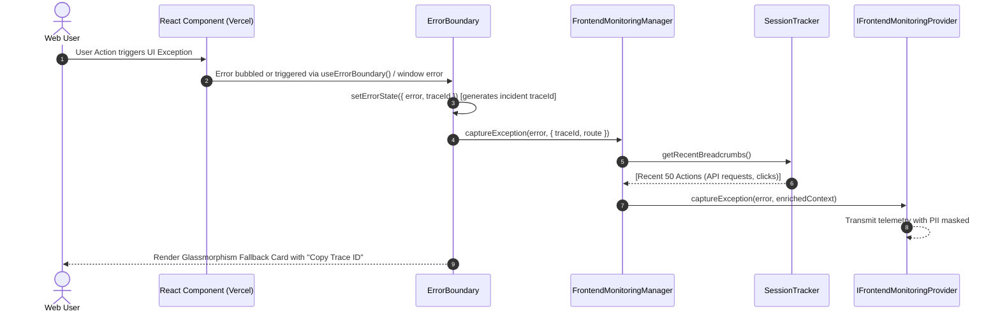
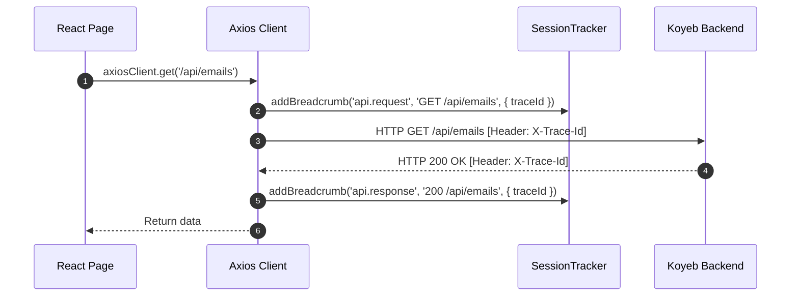

# Observability & Reliability - Phase 5 Implementation Details

> **Feature:** observability-reliability · **Phase:** 5 (Frontend Session Capture, Error Boundary & Trace Propagation)
> **Status:** COMPLETED
> **Created:** 2026-09-14 · **Last Updated:** 2026-09-14

---

## 1. Goal Description & Scope

Establish comprehensive client-side observability and user experience resilience on the MailSense frontend deployed on **Vercel**.

In production web applications, users often encounter edge-case rendering errors or API failure cascades that cannot be reproduced without session context. Prior to this phase, uncaught React render exceptions triggered a white screen of death, client-side errors had zero correlated session breadcrumbs, sensitive email bodies had no privacy masking rules, and frontend API errors were logged in ad-hoc console statements without trace continuity.

Specifically, this phase accomplishes:

1. **Frontend Monitoring Strategy Contract (`IFrontendMonitoringProvider`):** Establishes a vendor-agnostic client monitoring contract with lifecycle hooks: `init()`, `captureException()`, `captureBreadcrumb()`, `setUser()`, and `getSessionId()`.
2. **Session Action Ring Buffer (`SessionTracker`):** Maintains a rolling in-memory buffer (capped at 50 events) of user interactions (route changes, button clicks, API invocations, mutation lifecycle events) with timestamps and active `traceId`.
3. **Strict Client-Side Privacy Masking:** Filters sensitive PII (passwords, tokens, auth headers) and prevents sensitive email text (`.tiptap`, `.email-body`, `input[type="password"]`) from being captured in telemetry.
4. **Concrete Frontend Provider Adapters:**
   - `ConsoleFrontendProvider`: High-signal, structured browser console logger for development and local testing without external SDK overhead.
   - `SentryFrontendProvider`: Pluggable adapter encapsulating client-side Sentry exception reporting, breadcrumb recording, and user context (Session Replay omitted to avoid paid quota charges).
5. **Frontend Monitoring Manager (`FrontendMonitoringManager`):** Singleton providing global access to `frontendMonitoring` and ergonomic helper functions like `trackUserAction()`.
6. **React Error Boundary with Trace Presentation (`ErrorBoundary.tsx`):** A modern, accessible React Error Boundary:
   - Catches uncaught component render exceptions.
   - Automatically bundles the active `traceId` and session breadcrumbs into the error report.
   - Renders a visually stunning fallback card with an error code, message, a "Copy Trace ID" button with copy feedback, and a "Reload Application" button.
7. **Axios Client Telemetry Interceptors (`client.ts`):** Enhances the existing Axios client to automatically record `api.request`, `api.response`, and `api.error` breadcrumbs with elapsed latency and `traceId`.
8. **Application Tree Integration (`providers/index.tsx`):** Mounts the `ErrorBoundary` at the root of the React component tree.

---

## 2. User Review Required & Architectural Notes

> [!IMPORTANT]
> **Key Architectural Decisions & Standards Adherence**
>
> - **Zero Vendor Lock-in (Frontend Strategy Pattern):** The frontend UI components and API clients interact exclusively through `@shared/monitoring`. Switching between console logging, Sentry, or custom in-house telemetry requires changing only the active provider in `FrontendMonitoringManager`.
> - **In-Memory Ring Buffer (Zero Memory Leak):** `SessionTracker` caps breadcrumbs at 50 items using a FIFO queue. When an error occurs, the last 50 actions leading up to the failure are included with the report.
> - **Strict Privacy Masking (GDPR / Sensitive Email Content):** All email message contents, Tiptap editor DOM trees, and password fields are excluded or sanitized to `[Filtered]`. Authorization headers and bearer tokens are automatically stripped before breadcrumb serialization.
> - **Premium Fallback UI Aesthetics:** The `ErrorBoundary` UI adheres to MailSense design standards: curated dark theme palette, glassmorphism border (`border-white/10`), subtle glowing error badge, formatted trace ID pill, and an intuitive "Copy Trace ID" button with clipboard feedback.

---

## 3. Component Overview & File Map

| Component | Target File | Action | Purpose |
| --------- | ----------- | ------ | ------- |
| Frontend | `Frontend/src/shared/types/monitoring.types.ts` | **[NEW]** | Strict interfaces for `IFrontendMonitoringProvider`, `UserActionBreadcrumb`, and `FrontendErrorContext` |
| Frontend | `Frontend/src/shared/types/index.ts` | **[MODIFY]** | Re-export frontend monitoring types via `@shared/types` |
| Frontend | `Frontend/src/shared/constants/monitoring.constants.ts` | **[NEW]** | Centralized constants `FRONTEND_MONITORING_PROVIDERS`, `PRIVACY_MASK_SELECTORS`, and default limits |
| Frontend | `Frontend/src/shared/constants/index.ts` | **[MODIFY]** | Re-export monitoring constants via `@shared/constants` |
| Frontend | `Frontend/src/shared/monitoring/session.tracker.ts` | **[NEW]** | Rolling in-memory breadcrumb buffer and PII sanitizer |
| Frontend | `Frontend/src/shared/monitoring/providers/console-frontend.provider.ts` | **[NEW]** | Structured browser console telemetry provider for dev/testing |
| Frontend | `Frontend/src/shared/monitoring/providers/sentry-frontend.provider.ts` | **[NEW]** | Pluggable Sentry client adapter with privacy masking |
| Frontend | `Frontend/src/shared/monitoring/frontend.manager.ts` | **[NEW]** | Singleton manager and `trackUserAction()` helper |
| Frontend | `Frontend/src/shared/monitoring/index.ts` | **[NEW]** | Clean barrel exports for `@shared/monitoring` |
| Frontend | `Frontend/tsconfig.json` | **[MODIFY]** | Register `@shared/monitoring` path mapping |
| Frontend | `Frontend/src/shared/components/ErrorBoundary.tsx` | **[NEW]** | React Error Boundary with fallback UI and "Copy Trace ID" |
| Frontend | `Frontend/src/shared/api/client.ts` | **[MODIFY]** | Log API request/response breadcrumbs into session tracker |
| Frontend | `Frontend/src/shared/providers/index.tsx` | **[MODIFY]** | Wrap root application providers inside `<ErrorBoundary>` |

---

## 4. Main Section 1: Backend Layer Implementation

*Note: All Backend observability requirements (Exception Hierarchy, Distributed Tracing, Pluggable APM, Koyeb Health Probes) were completed and verified in Phases 1 through 4. Phase 5 focuses on the Vercel Frontend Layer.*

---

## 5. Main Section 2: Frontend Layer Implementation

### 5.1 Monitoring Contracts & DTOs (`Frontend/src/shared/types/monitoring.types.ts`)

```typescript
export type FrontendMonitoringProviderName = 'console' | 'sentry';

export type BreadcrumbCategory =
    | 'navigation'
    | 'ui.click'
    | 'api.request'
    | 'api.response'
    | 'api.error'
    | 'mutation'
    | 'session';

export type BreadcrumbLevel = 'info' | 'warn' | 'error' | 'debug';

export interface UserActionBreadcrumb {
    category: BreadcrumbCategory;
    message: string;
    level?: BreadcrumbLevel;
    timestamp: number;
    data?: Record<string, string | number | boolean>;
}

export interface FrontendUserContext {
    id: string;
    email?: string;
    username?: string;
}

export interface FrontendErrorContext {
    traceId?: string;
    componentStack?: string;
    route?: string;
    breadcrumbs?: UserActionBreadcrumb[];
    extra?: Record<string, string | number | boolean>;
}

export interface FrontendMonitoringConfig {
    provider: FrontendMonitoringProviderName;
    dsn?: string;
    environment: string;
    release?: string;
    maxBreadcrumbs?: number;
    maskSelectors?: string[];
}

export interface IFrontendMonitoringProvider {
    readonly name: FrontendMonitoringProviderName;
    init(config: FrontendMonitoringConfig): void;
    captureException(error: Error, context?: FrontendErrorContext): void;
    captureBreadcrumb(breadcrumb: UserActionBreadcrumb): void;
    setUser(user: FrontendUserContext | null): void;
    getSessionId(): string;
}
```

---

### 5.2 Re-export in Types Barrel (`Frontend/src/shared/types/index.ts`)

```typescript
export * from './errors.types';
export * from './monitoring.types';
```

---

### 5.3 Monitoring Constants (`Frontend/src/shared/constants/monitoring.constants.ts`)

```typescript
export const FRONTEND_MONITORING_PROVIDERS = {
    CONSOLE: 'console',
    SENTRY: 'sentry',
} as const;

export const MONITORING_DEFAULTS = {
    MAX_BREADCRUMBS: 50,
    SESSION_STORAGE_KEY: 'mailsense_session_id',
} as const;

export const PRIVACY_MASK_SELECTORS = [
    '.tiptap',
    '.email-body',
    'input[type="password"]',
    '[data-sensitive="true"]',
] as const;

export const SENSITIVE_KEY_NAMES = [
    'password',
    'token',
    'accesstoken',
    'refreshtoken',
    'secret',
    'authorization',
    'cookie',
] as const;
```

---

### 5.4 Re-export in Constants Barrel (`Frontend/src/shared/constants/index.ts`)

```typescript
export * from './monitoring.constants';
```

---

### 5.5 Session Action Tracker (`Frontend/src/shared/monitoring/session.tracker.ts`)

```typescript
import { MONITORING_DEFAULTS, SENSITIVE_KEY_NAMES } from '@shared/constants';
import { BreadcrumbCategory, BreadcrumbLevel, UserActionBreadcrumb } from '@shared/types';

export class SessionTracker {
    private static instance: SessionTracker | null = null;
    private breadcrumbs: UserActionBreadcrumb[] = [];
    private readonly maxBreadcrumbs: number;
    private sessionId: string;

    private constructor(maxBreadcrumbs: number = MONITORING_DEFAULTS.MAX_BREADCRUMBS) {
        this.maxBreadcrumbs = maxBreadcrumbs;
        this.sessionId = this.resolveSessionId();
    }

    public static getInstance(): SessionTracker {
        if (!SessionTracker.instance) {
            SessionTracker.instance = new SessionTracker();
        }
        return SessionTracker.instance;
    }

    private resolveSessionId(): string {
        try {
            if (typeof window !== 'undefined' && window.sessionStorage) {
                const existing = window.sessionStorage.getItem(MONITORING_DEFAULTS.SESSION_STORAGE_KEY);
                if (existing) {
                    return existing;
                }
                const newId = `sess_${crypto.randomUUID()}`;
                window.sessionStorage.setItem(MONITORING_DEFAULTS.SESSION_STORAGE_KEY, newId);
                return newId;
            }
        } catch {
            // Fallback if sessionStorage is restricted in iframe/private mode
        }
        return `sess_${crypto.randomUUID()}`;
    }

    public getSessionId(): string {
        return this.sessionId;
    }

    /**
     * Sanitizes sensitive properties from data payloads before recording
     */
    private sanitizeData(data?: Record<string, string | number | boolean>): Record<string, string | number | boolean> | undefined {
        try {
            if (!data) return undefined;

            const sanitized: Record<string, string | number | boolean> = {};
            for (const [key, value] of Object.entries(data)) {
                const lowerKey = key.toLowerCase();
                const isSensitive = SENSITIVE_KEY_NAMES.some((sensitiveName) => lowerKey.includes(sensitiveName));
                if (isSensitive) {
                    sanitized[key] = '[Filtered]';
                } else {
                    sanitized[key] = value;
                }
            }
            return sanitized;
        } catch {
            return undefined;
        }
    }

    public addBreadcrumb(
        category: BreadcrumbCategory,
        message: string,
        level: BreadcrumbLevel = 'info',
        data?: Record<string, string | number | boolean>,
    ): void {
        try {
            const cleanData = this.sanitizeData(data);
            const breadcrumb: UserActionBreadcrumb = {
                category,
                message,
                level,
                timestamp: Date.now(),
                data: cleanData,
            };

            this.breadcrumbs.push(breadcrumb);

            if (this.breadcrumbs.length > this.maxBreadcrumbs) {
                this.breadcrumbs.shift();
            }
        } catch {
            // Non-blocking
        }
    }

    public getRecentBreadcrumbs(): UserActionBreadcrumb[] {
        try {
            return [...this.breadcrumbs];
        } catch {
            return [];
        }
    }

    public clear(): void {
        this.breadcrumbs = [];
    }
}

export const sessionTracker = SessionTracker.getInstance();
```

---

### 5.6 Console Frontend Provider (`Frontend/src/shared/monitoring/providers/console-frontend.provider.ts`)

```typescript
import {
    FrontendErrorContext,
    FrontendMonitoringConfig,
    FrontendMonitoringProviderName,
    FrontendUserContext,
    IFrontendMonitoringProvider,
    UserActionBreadcrumb,
} from '@shared/types';

export class ConsoleFrontendProvider implements IFrontendMonitoringProvider {
    public readonly name: FrontendMonitoringProviderName = 'console';
    private sessionId: string = '';

    public init(config: FrontendMonitoringConfig): void {
        try {
            this.sessionId = `console_sess_${crypto.randomUUID().slice(0, 8)}`;
            if (process.env.NODE_ENV !== 'production') {
                console.info(`[MailSense Monitoring] Initialized Console provider in environment: "${config.environment}"`);
            }
        } catch {
            // Non-blocking
        }
    }

    public captureException(error: Error, context?: FrontendErrorContext): void {
        try {
            console.error('[MailSense ErrorBoundary Captured]', {
                message: error.message,
                name: error.name,
                stack: error.stack,
                traceId: context?.traceId,
                route: context?.route,
                componentStack: context?.componentStack,
                recentBreadcrumbs: context?.breadcrumbs,
            });
        } catch {
            // Non-blocking
        }
    }

    public captureBreadcrumb(breadcrumb: UserActionBreadcrumb): void {
        try {
            if (process.env.NODE_ENV !== 'production') {
                const badge = `[Breadcrumb: ${breadcrumb.category}]`;
                console.debug(badge, breadcrumb.message, breadcrumb.data || '');
            }
        } catch {
            // Non-blocking
        }
    }

    public setUser(user: FrontendUserContext | null): void {
        try {
            if (process.env.NODE_ENV !== 'production' && user) {
                console.info(`[MailSense Monitoring] Active User: ${user.email ?? user.id}`);
            }
        } catch {
            // Non-blocking
        }
    }

    public getSessionId(): string {
        return this.sessionId;
    }
}
```

---

### 5.7 Sentry Frontend Provider (`Frontend/src/shared/monitoring/providers/sentry-frontend.provider.ts`)

```typescript
import { PRIVACY_MASK_SELECTORS } from '@shared/constants';
import {
    FrontendErrorContext,
    FrontendMonitoringConfig,
    FrontendMonitoringProviderName,
    FrontendUserContext,
    IFrontendMonitoringProvider,
    UserActionBreadcrumb,
} from '@shared/types';

export class SentryFrontendProvider implements IFrontendMonitoringProvider {
    public readonly name: FrontendMonitoringProviderName = 'sentry';
    private initialized = false;
    private sessionId = '';

    public init(config: FrontendMonitoringConfig): void {
        try {
            this.sessionId = `sentry_sess_${crypto.randomUUID().slice(0, 8)}`;

            // Inspect if global Sentry client is present on window
            const globalWithSentry = typeof window !== 'undefined'
                ? (window as typeof window & { Sentry?: { captureException: (e: Error) => void; addBreadcrumb: (b: unknown) => void; setUser: (u: unknown) => void } })
                : null;

            if (globalWithSentry?.Sentry) {
                this.initialized = true;
            }
        } catch {
            // Non-blocking fallback
        }
    }

    public captureException(error: Error, context?: FrontendErrorContext): void {
        try {
            const globalWithSentry = typeof window !== 'undefined'
                ? (window as typeof window & { Sentry?: { captureException: (e: Error, scopeFn?: (scope: unknown) => void) => void } })
                : null;

            if (globalWithSentry?.Sentry) {
                globalWithSentry.Sentry.captureException(error);
            } else {
                console.error('[SentryFrontendProvider] Unsent exception (Sentry SDK not loaded):', error.message, { context });
            }
        } catch {
            // Non-blocking
        }
    }

    public captureBreadcrumb(breadcrumb: UserActionBreadcrumb): void {
        try {
            const globalWithSentry = typeof window !== 'undefined'
                ? (window as typeof window & { Sentry?: { addBreadcrumb: (b: unknown) => void } })
                : null;

            if (globalWithSentry?.Sentry) {
                globalWithSentry.Sentry.addBreadcrumb({
                    category: breadcrumb.category,
                    message: breadcrumb.message,
                    level: breadcrumb.level,
                    data: breadcrumb.data,
                    timestamp: breadcrumb.timestamp / 1000,
                });
            }
        } catch {
            // Non-blocking
        }
    }

    public setUser(user: FrontendUserContext | null): void {
        try {
            const globalWithSentry = typeof window !== 'undefined'
                ? (window as typeof window & { Sentry?: { setUser: (u: unknown) => void } })
                : null;

            if (globalWithSentry?.Sentry) {
                globalWithSentry.Sentry.setUser(user);
            }
        } catch {
            // Non-blocking
        }
    }

    public getSessionId(): string {
        return this.sessionId;
    }
}
```

---

### 5.8 Frontend Monitoring Manager (`Frontend/src/shared/monitoring/frontend.manager.ts`)

```typescript
import { FRONTEND_MONITORING_PROVIDERS } from '@shared/constants';
import {
    BreadcrumbCategory,
    BreadcrumbLevel,
    FrontendErrorContext,
    FrontendMonitoringConfig,
    FrontendMonitoringProviderName,
    FrontendUserContext,
    IFrontendMonitoringProvider,
    UserActionBreadcrumb,
} from '@shared/types';
import { ConsoleFrontendProvider } from './providers/console-frontend.provider';
import { SentryFrontendProvider } from './providers/sentry-frontend.provider';
import { sessionTracker } from './session.tracker';

export class FrontendMonitoringManager implements IFrontendMonitoringProvider {
    private static instance: FrontendMonitoringManager | null = null;
    private provider: IFrontendMonitoringProvider;
    private isInitialized = false;

    private constructor() {
        this.provider = this.createDefaultProvider();
    }

    public static getInstance(): FrontendMonitoringManager {
        if (!FrontendMonitoringManager.instance) {
            FrontendMonitoringManager.instance = new FrontendMonitoringManager();
        }
        return FrontendMonitoringManager.instance;
    }

    public get name(): FrontendMonitoringProviderName {
        return this.provider.name;
    }

    private createDefaultProvider(): IFrontendMonitoringProvider {
        try {
            const configured = process.env.NEXT_PUBLIC_MONITORING_PROVIDER?.toLowerCase();
            if (configured === FRONTEND_MONITORING_PROVIDERS.SENTRY) {
                return new SentryFrontendProvider();
            }
            return new ConsoleFrontendProvider();
        } catch {
            return new ConsoleFrontendProvider();
        }
    }

    public init(config?: Partial<FrontendMonitoringConfig>): void {
        try {
            if (this.isInitialized) return;

            const effectiveConfig: FrontendMonitoringConfig = {
                provider: this.provider.name,
                environment: config?.environment ?? process.env.NODE_ENV ?? 'development',
                release: config?.release ?? '3.2.0',
                dsn: config?.dsn ?? process.env.NEXT_PUBLIC_SENTRY_DSN,
                maxBreadcrumbs: config?.maxBreadcrumbs ?? 50,
            };

            this.provider.init(effectiveConfig);
            this.isInitialized = true;
        } catch (error) {
            console.error('Failed to initialize FrontendMonitoringManager', error);
        }
    }

    public setProvider(newProvider: IFrontendMonitoringProvider, config?: Partial<FrontendMonitoringConfig>): void {
        try {
            this.provider = newProvider;
            this.isInitialized = false;
            this.init(config);
        } catch (error) {
            console.error('Failed to switch FrontendMonitoring provider', error);
        }
    }

    public captureException(error: Error, context?: FrontendErrorContext): void {
        try {
            // Automatically enrich with recent breadcrumbs from ring buffer
            const enrichedContext: FrontendErrorContext = {
                ...context,
                breadcrumbs: sessionTracker.getRecentBreadcrumbs(),
            };
            this.provider.captureException(error, enrichedContext);
        } catch {
            // Non-blocking
        }
    }

    public captureBreadcrumb(breadcrumb: UserActionBreadcrumb): void {
        try {
            sessionTracker.addBreadcrumb(breadcrumb.category, breadcrumb.message, breadcrumb.level, breadcrumb.data);
            this.provider.captureBreadcrumb(breadcrumb);
        } catch {
            // Non-blocking
        }
    }

    public setUser(user: FrontendUserContext | null): void {
        try {
            this.provider.setUser(user);
        } catch {
            // Non-blocking
        }
    }

    public getSessionId(): string {
        try {
            return sessionTracker.getSessionId();
        } catch {
            return '';
        }
    }
}

export const frontendMonitoring = FrontendMonitoringManager.getInstance();

/**
 * Ergonomic helper to record user interaction breadcrumbs
 */
export function trackUserAction(
    category: BreadcrumbCategory,
    message: string,
    level: BreadcrumbLevel = 'info',
    data?: Record<string, string | number | boolean>,
): void {
    try {
        frontendMonitoring.captureBreadcrumb({
            category,
            message,
            level,
            timestamp: Date.now(),
            data,
        });
    } catch {
        // Non-blocking
    }
}
```

---

### 5.9 Core Frontend Monitoring Barrel (`Frontend/src/shared/monitoring/index.ts`)

```typescript
export * from './frontend.manager';
export * from './providers/console-frontend.provider';
export * from './providers/sentry-frontend.provider';
export * from './session.tracker';
```

---

### 5.10 React Functional Error Boundary (`Frontend/src/shared/components/ErrorBoundary.tsx`)

```tsx
'use client';

import { frontendMonitoring } from '@shared/monitoring';
import { AlertTriangle, Check, Copy, RefreshCw } from 'lucide-react';
import React, { createContext, ReactNode, useCallback, useContext, useEffect, useState } from 'react';

export interface ErrorBoundaryFallbackProps {
    error: Error;
    traceId: string;
    resetErrorBoundary: () => void;
}

export interface ErrorBoundaryProps {
    children: ReactNode;
    fallbackRender?: (props: ErrorBoundaryFallbackProps) => ReactNode;
    onError?: (error: Error, traceId: string) => void;
}

export interface ErrorBoundaryContextValue {
    showBoundary: (error: Error) => void;
    resetBoundary: () => void;
}

interface ErrorBoundaryInternalState {
    error: Error;
    traceId: string;
}

const ErrorBoundaryContext = createContext<ErrorBoundaryContextValue | null>(null);

/**
 * Hook allowing any child component or hook to trigger the ErrorBoundary
 */
export function useErrorBoundary(): ErrorBoundaryContextValue {
    try {
        const context = useContext(ErrorBoundaryContext);
        if (!context) {
            return {
                showBoundary: (error: Error): void => {
                    frontendMonitoring.captureException(error);
                },
                resetBoundary: (): void => {
                    if (typeof window !== 'undefined') {
                        window.location.reload();
                    }
                },
            };
        }
        return context;
    } catch {
        return {
            showBoundary: (error: Error): void => {
                frontendMonitoring.captureException(error);
            },
            resetBoundary: (): void => {
                if (typeof window !== 'undefined') {
                    window.location.reload();
                }
            },
        };
    }
}

/**
 * Functional Error Boundary component that captures runtime errors,
 * logs distributed trace context, and renders fallback UI.
 */
export function ErrorBoundary({ children, fallbackRender, onError }: ErrorBoundaryProps): ReactNode {
    const [errorState, setErrorState] = useState<ErrorBoundaryInternalState | null>(null);
    const [copied, setCopied] = useState<boolean>(false);

    const handleReset = useCallback((): void => {
        try {
            setErrorState(null);
            setCopied(false);
            if (typeof window !== 'undefined') {
                window.location.reload();
            }
        } catch (resetError) {
            console.error('Failed to reset error boundary:', resetError);
        }
    }, []);

    const showBoundary = useCallback(
        (error: Error): void => {
            try {
                const traceId = crypto.randomUUID();
                setErrorState({ error, traceId });

                frontendMonitoring.captureException(error, {
                    traceId,
                    route: typeof window !== 'undefined' ? window.location.pathname : undefined,
                });

                if (onError) {
                    onError(error, traceId);
                }
            } catch (captureError) {
                console.error('Failed to capture manual boundary error:', captureError);
            }
        },
        [onError],
    );

    useEffect(() => {
        const handleError = (event: ErrorEvent): void => {
            try {
                const error = event.error instanceof Error ? event.error : new Error(event.message || 'Unknown runtime error');
                const traceId = crypto.randomUUID();

                setErrorState({ error, traceId });

                frontendMonitoring.captureException(error, {
                    traceId,
                    route: typeof window !== 'undefined' ? window.location.pathname : undefined,
                });

                if (onError) {
                    onError(error, traceId);
                }
            } catch (listenerError) {
                console.error('Failed to capture window error in ErrorBoundary:', listenerError);
            }
        };

        const handleRejection = (event: PromiseRejectionEvent): void => {
            try {
                const reason = event.reason;
                const error =
                    reason instanceof Error
                        ? reason
                        : new Error(typeof reason === 'string' ? reason : 'Unhandled asynchronous rejection');
                const traceId = crypto.randomUUID();

                setErrorState({ error, traceId });

                frontendMonitoring.captureException(error, {
                    traceId,
                    route: typeof window !== 'undefined' ? window.location.pathname : undefined,
                });

                if (onError) {
                    onError(error, traceId);
                }
            } catch (rejectionError) {
                console.error('Failed to capture unhandled rejection in ErrorBoundary:', rejectionError);
            }
        };

        window.addEventListener('error', handleError);
        window.addEventListener('unhandledrejection', handleRejection);

        return (): void => {
            try {
                window.removeEventListener('error', handleError);
                window.removeEventListener('unhandledrejection', handleRejection);
            } catch {
                // Non-blocking cleanup
            }
        };
    }, [onError]);

    const handleCopyTraceId = useCallback(async (): Promise<void> => {
        try {
            if (errorState?.traceId && typeof navigator !== 'undefined' && navigator.clipboard) {
                await navigator.clipboard.writeText(errorState.traceId);
                setCopied(true);
                setTimeout(() => {
                    try {
                        setCopied(false);
                    } catch {
                        // Non-blocking
                    }
                }, 2000);
            }
        } catch (copyError) {
            console.error('Failed to copy trace ID to clipboard:', copyError);
        }
    }, [errorState?.traceId]);

    if (errorState) {
        if (fallbackRender) {
            return fallbackRender({
                error: errorState.error,
                traceId: errorState.traceId,
                resetErrorBoundary: handleReset,
            });
        }

        return (
            <div className="bg-background text-foreground flex min-h-screen w-full items-center justify-center p-4">
                <div className="border-destructive/30 bg-card/90 animate-in fade-in zoom-in-95 relative w-full max-w-lg overflow-hidden rounded-2xl border p-8 shadow-2xl backdrop-blur-xl duration-200">
                    {/* Glowing backdrop accent */}
                    <div className="bg-destructive/15 absolute -top-16 -right-16 h-36 w-36 rounded-full blur-3xl" />
                    <div className="bg-primary/10 absolute -bottom-16 -left-16 h-36 w-36 rounded-full blur-3xl" />

                    <div className="flex flex-col items-center text-center">
                        <div className="bg-destructive/10 text-destructive border-destructive/20 mb-4 flex h-14 w-14 items-center justify-center rounded-full border shadow-inner">
                            <AlertTriangle className="h-7 w-7" />
                        </div>

                        <h2 className="text-foreground text-2xl font-bold tracking-tight">Something went wrong</h2>
                        <p className="text-muted-foreground mt-2 text-sm leading-relaxed">
                            An unexpected visual rendering error occurred. Our engineering team has been automatically alerted with session
                            context.
                        </p>

                        {/* Trace ID Pill */}
                        {errorState.traceId ? (
                            <div className="border-border/60 bg-muted/40 mt-6 w-full rounded-lg border p-3 text-left">
                                <div className="text-muted-foreground mb-1.5 flex items-center justify-between text-xs">
                                    <span className="font-semibold tracking-wider uppercase">Incident Trace ID</span>
                                    <span>Reference this when contacting support</span>
                                </div>
                                <div className="flex items-center justify-between gap-2">
                                    <code className="text-foreground truncate font-mono text-xs select-all">{errorState.traceId}</code>
                                    <button
                                        type="button"
                                        onClick={handleCopyTraceId}
                                        className="text-muted-foreground hover:text-foreground hover:bg-muted inline-flex items-center gap-1.5 rounded-md px-2.5 py-1 text-xs font-medium transition-colors"
                                        title="Copy Trace ID to clipboard"
                                    >
                                        {copied ? (
                                            <>
                                                <Check className="h-3.5 w-3.5 text-emerald-500" />
                                                <span className="text-emerald-500">Copied</span>
                                            </>
                                        ) : (
                                            <>
                                                <Copy className="h-3.5 w-3.5" />
                                                <span>Copy</span>
                                            </>
                                        )}
                                    </button>
                                </div>
                            </div>
                        ) : null}

                        {/* Actions */}
                        <div className="mt-6 flex w-full gap-3">
                            <button
                                type="button"
                                onClick={handleReset}
                                className="bg-primary text-primary-foreground inline-flex flex-1 items-center justify-center gap-2 rounded-lg px-4 py-2.5 text-sm font-semibold shadow transition-transform hover:opacity-90 active:scale-[0.98]"
                            >
                                <RefreshCw className="h-4 w-4" />
                                Reload Application
                            </button>
                        </div>
                    </div>
                </div>
            </div>
        );
    }

    return (
        <ErrorBoundaryContext.Provider value={{ showBoundary, resetBoundary: handleReset }}>
            {children}
        </ErrorBoundaryContext.Provider>
    );
}
```

---

### 5.11 Axios Interceptor Session Tracking (`Frontend/src/shared/api/client.ts`)

```typescript
import { getAccessToken } from '@auth0/nextjs-auth0/client';
import { API_BASE_URL } from '@config/config';
import { trackUserAction } from '@shared/monitoring';
import axios from 'axios';
import { extractApiError } from './errors';

const apiClient = axios.create({
    baseURL: API_BASE_URL,
});

apiClient.interceptors.request.use(async (config) => {
    try {
        const accessToken = await getAccessToken();
        if (accessToken) {
            config.headers.Authorization = `Bearer ${accessToken}`;
        }

        if (!config.headers['X-Trace-Id'] && !config.headers['x-trace-id']) {
            config.headers['X-Trace-Id'] = crypto.randomUUID();
        }

        const traceId = String(config.headers['X-Trace-Id']);

        // Record request breadcrumb
        trackUserAction('api.request', `${config.method?.toUpperCase()} ${config.url}`, 'info', {
            traceId,
            url: config.url || '',
            method: config.method || 'GET',
        });

        return config;
    } catch {
        return config;
    }
});

apiClient.interceptors.response.use(
    (response) => {
        try {
            const traceId = response.headers?.['x-trace-id'] || response.config.headers?.['X-Trace-Id'];
            trackUserAction('api.response', `${response.status} ${response.config.url}`, 'info', {
                statusCode: response.status,
                traceId: String(traceId || ''),
            });
        } catch {
            // Non-blocking
        }
        return response;
    },
    (error) => {
        try {
            const formatted = extractApiError(error);

            const responseHeaderTraceId = error.response?.headers?.['x-trace-id'];
            if (responseHeaderTraceId && (!formatted.traceId || formatted.traceId.length === 0)) {
                formatted.traceId = String(responseHeaderTraceId);
            }

            Object.assign(error, { formattedError: formatted });

            // Record API failure in session tracker
            trackUserAction('api.error', `${error.response?.status ?? 500} ${error.config?.url ?? 'unknown'}`, 'error', {
                errorCode: formatted.errorCode,
                traceId: formatted.traceId,
                statusCode: error.response?.status ?? 500,
            });
        } catch {
            // Non-blocking fallback
        }
        return Promise.reject(error);
    },
);

export const axiosClient = apiClient;

export const auth0ApiClient = axios.create({
    baseURL: 'http://localhost:3000/auth',
    withCredentials: true,
});
```

---

### 5.12 Root Providers Wrap (`Frontend/src/shared/providers/index.tsx`)

```tsx
'use client';

import { Auth0Provider } from '@auth0/nextjs-auth0';
import { ErrorBoundary } from '@shared/components/ErrorBoundary';
import { ThemeProvider } from '@shared/components/theme-provider';
import { useResetBreadcrumb } from '@shared/hooks';
import { frontendMonitoring } from '@shared/monitoring';
import { Toaster } from '@shared/ui/sonner';
import { QueryClient, QueryClientProvider } from '@tanstack/react-query';
import React, { useEffect } from 'react';
import AuthProvider from './auth.provider';

const queryClient = new QueryClient();

export function Providers({ children }: { children: React.ReactNode }) {
    useResetBreadcrumb();

    useEffect(() => {
        try {
            frontendMonitoring.init();
        } catch {
            // Non-blocking
        }
    }, []);

    return (
        <ErrorBoundary>
            <Auth0Provider user={undefined}>
                <AuthProvider>
                    <QueryClientProvider client={queryClient}>
                        <ThemeProvider attribute="class" defaultTheme="system" enableSystem disableTransitionOnChange>
                            {children}
                            <Toaster richColors />
                        </ThemeProvider>
                    </QueryClientProvider>
                </AuthProvider>
            </Auth0Provider>
        </ErrorBoundary>
    );
}
```

---

## 6. Low-Level Design & Sequence Flow

### 6.1 Frontend Error Boundary Sequence Flow



---

### 6.2 Axios Session Interaction Flow



---

## 7. Step-by-Step Task Checklist

- [x] **Task 1: Frontend Monitoring Contracts & Constants**
  - [x] Create `Frontend/src/shared/types/monitoring.types.ts` defining `IFrontendMonitoringProvider`, `UserActionBreadcrumb`, and `FrontendErrorContext`
  - [x] Re-export types in `Frontend/src/shared/types/index.ts`
  - [x] Create `Frontend/src/shared/constants/monitoring.constants.ts` with `FRONTEND_MONITORING_PROVIDERS`, `PRIVACY_MASK_SELECTORS`, and buffer limits
  - [x] Re-export constants in `Frontend/src/shared/constants/index.ts`
- [x] **Task 2: Session Tracker & Providers Implementation**
  - [x] Implement `Frontend/src/shared/monitoring/session.tracker.ts` with ring-buffer and PII filter
  - [x] Implement `Frontend/src/shared/monitoring/providers/console-frontend.provider.ts`
  - [x] Implement `Frontend/src/shared/monitoring/providers/sentry-frontend.provider.ts`
  - [x] Implement `Frontend/src/shared/monitoring/frontend.manager.ts` and `trackUserAction`
  - [x] Create `Frontend/src/shared/monitoring/index.ts` with barrel exports
  - [x] Add `@shared/monitoring` path mapping to `Frontend/tsconfig.json`
- [x] **Task 3: Functional Error Boundary Component**
  - [x] Implement `Frontend/src/shared/components/ErrorBoundary.tsx` as a pure functional component with `useErrorBoundary` hook, glassmorphic styling, trace ID presentation, and clipboard copy
- [x] **Task 4: Axios Interceptor & Root Providers Integration**
  - [x] Update `Frontend/src/shared/api/client.ts` to log `api.request`, `api.response`, and `api.error` breadcrumbs
  - [x] Wrap component tree in `<ErrorBoundary>` in `Frontend/src/shared/providers/index.tsx`
  - [x] Initialize `frontendMonitoring.init()` in `Frontend/src/shared/providers/index.tsx`
- [x] **Task 5: Verification & Compilation**
  - [x] Execute `npx tsc --noEmit` in `Frontend/` ensuring zero TypeScript compiler errors
  - [x] Execute `pnpm build` and `pnpm test` in `Backend/` ensuring zero regressions

---

## 8. Verification & Build Commands

```bash
# 1. Frontend Verification
cd /Users/vishaljagamani/Projects/Projects/mailsense/Frontend
npx tsc --noEmit

# 2. Backend Verification
cd /Users/vishaljagamani/Projects/Projects/mailsense/Backend
pnpm build
pnpm type-check
pnpm test
```
