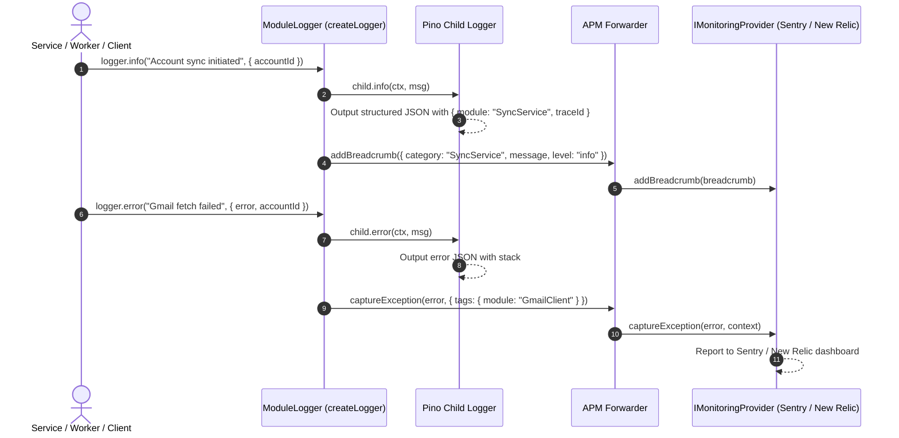

# Observability & Reliability - Phase 6 Implementation Details

> **Feature:** observability-reliability · **Phase:** 6 (Codebase-Wide Structured Logger Migration & APM Log Bridge)
> **Status:** COMPLETED
> **Created:** 2026-09-14 · **Last Updated:** 2026-09-14

---

## 1. Goal Description & Scope

Establish automatic, bidirectional integration between structured application logging (`Pino`) and active Application Performance Monitoring (`IMonitoringProvider` - Sentry, New Relic, Noop), and migrate all backend services, background workers, event handlers, and integration clients across the codebase from the generic fallback `logger` (`module: 'App'`) to module-scoped child loggers (`createLogger('<ModuleName>')`).

Prior to this phase:
1. `createLogger(moduleName)` only outputted formatted text to stdout/JSON stream via Pino; it had **zero connectivity** to the active monitoring provider (`monitoring`).
2. When services, integration clients, or background processors caught errors and invoked `logger.error(...)`, those errors were **never reported to APM** unless they happened to crash an Express request handler (handled by `errorHandler`) or BullMQ worker (handled by `base.worker.ts`). Any error caught, logged, and handled within internal workflows was completely invisible to Sentry/New Relic.
3. `logger.info()` and `logger.warn()` logs were not captured as APM breadcrumbs, leaving exception stack traces without preceding operational context.
4. Throughout the codebase, over 30 files were still importing the generic `export const logger = createLogger('App')` from `shared/utils/logger.ts`, causing all log lines to be attributed to the generic module `'App'`.

This phase accomplishes:
1. **APM Log Bridge in Logger Factory (`logger.factory.ts`):**
   - Automatically dispatches `info` and `warn` logs to `monitoring.addBreadcrumb({ category: moduleName, message, level, data: ctx })`.
   - Automatically extracts `Error` objects from `ctx.error` or constructs a typed `Error` from message and dispatches to `monitoring.captureException(err, { tags: { module: moduleName }, extra: ctx })`.
   - Embeds a strict **recursion guard** (`forwardToMonitoring: false`) for monitoring internals (`monitoring.manager.ts`, `sentry.provider.ts`, `noop.provider.ts`) to prevent infinite recursion.
   - Wraps all forwarding operations in non-blocking `try / catch` blocks to guarantee that logging never throws or interrupts business execution.
2. **Codebase-Wide Logger Migration:**
   - Migrates core infrastructure (`db.config.ts`, `redis.connection.ts`, `queue.service.ts`, `scheduler.service.ts`, `queue.registry.ts`, `event-bus.ts`, handlers).
   - Migrates provider integration clients (`gmail.client.ts`, `gmail.service.ts`, `outlook.client.ts`, `outlook.service.ts`, `auth0.client.ts`, `auth0.service.ts`, `ObjectStorageService.service.ts`).
   - Migrates domain business services (`account.service.ts`, `email.service.ts`, `attachment.service.ts`, `folder.service.ts`, `draft.service.ts`, `analytics.service.ts`, `analytics.utils.ts`).
   - Migrates background workers & job processors (`sync-account.processor.ts`, `refresh-token.processor.ts`, `sync.worker.ts`, `token-refresh.worker.ts`, `base.worker.ts`).
   - Migrates runtime bootstrapping (`server.ts`, `app.ts`).
   - Preserves `export const logger = createLogger('App')` in `shared/utils/logger.ts` for full backward compatibility.
3. **Sentry Structured Logs & Automatic User Context Propagation:**
   - Enabled native structured log forwarding (`enableLogs: true`, `Sentry.logger.*` API) directly to Sentry's dedicated **Logs Explorer** (`https://docs.sentry.io/product/logs/getting-started/`).
   - Implemented `setTraceContext()` in `trace.ts` to update the active `TraceStore` in `AsyncLocalStorage`.
   - Wired `auth.ts` to automatically enrich `TraceStore` and `monitoring.setUser({ id, email, username })` on every authenticated request.
   - Wired `base.worker.ts` to extract `userId` and `accountId` from job data, pass to `runWithTrace`, and set `monitoring.setUser`.
   - Wired `sync-account.processor.ts` and `refresh-token.processor.ts` to enrich `TraceStore` and `monitoring.setUser` with `account.userId` and `account.emailAddress`.
   - Updated `sentry.provider.ts` to automatically inject `user.id`, `userId`, `user_id`, `user.email`, `user_email`, `accountId`, and `traceId` attributes into all logs sent to Sentry Logs Explorer.

---

## 2. User Review Required & Architectural Notes

> [!IMPORTANT]
> **Key Architectural Decisions & Recursion Prevention**
>
> - **Recursion Prevention Guard:** Because `MonitoringManager` and `SentryMonitoringProvider` use `createLogger` for internal logging, forwarding their errors to `monitoring.captureException` would result in infinite recursion and stack overflow. To prevent this, `createLogger` accepts an options contract `CreateLoggerOptions { forwardToMonitoring?: boolean }`. Monitoring internal adapters instantiate with `{ forwardToMonitoring: false }`.
> - **Non-Blocking Observability:** The APM bridge is fully fault-tolerant. If `monitoring` throws or encounters delivery issues, the error is swallowed non-blockingly, guaranteeing that logging and request processing always succeed.
> - **Breadcrumb Context Enrichment:** Routine `info` and `warn` logs now populate the APM breadcrumb trail. When a critical exception is thrown, developers and SREs see the complete sequence of operations leading up to the failure.
> - **Sentry Logs Explorer High-Cardinality User Attributes:** Normal logs (`info`, `warn`, `debug`) are forwarded to `Sentry.logger` with standard attributes (`user.id`, `user.email`, `userId`, `accountId`, `traceId`). Both Sentry's automatic scope mapper and explicit attribute payload ensure user details are searchable and filterable in Sentry's Logs tab.
> - **Type Safety Standard (No `unknown`):** The `LogContext` interface in `observability.types.ts` is tightened to remove `unknown`, replacing it with `Error | string | number | boolean | Record<string, string | number | boolean>`.

---

## 3. Component Overview & File Map

| Component | Target File | Action | Purpose |
| --------- | ----------- | ------ | ------- |
| Backend | `Backend/src/core/constants/observability.constants.ts` | **[MODIFY]** | Define `LOGGER_MODULE` enum for strongly-typed module names |
| Backend | `Backend/src/core/types/observability.types.ts` | **[MODIFY]** | Add `CreateLoggerOptions`, remove `unknown` from `LogContext` |
| Backend | `Backend/src/core/observability/logger.factory.ts` | **[MODIFY]** | Implement APM bridge (`addBreadcrumb`, `captureException`) with `LOGGER_MODULE` enum support and recursion guard; break circular dependency with `@config` by importing pino from `../config/logger.config.js` |
| Backend | `Backend/src/workers/index.ts` | **[NEW]** | Worker barrel export file for `@workers` path alias |
| Backend | `Backend/tsconfig.json` & `Backend/jest.config.js` | **[MODIFY]** | Configure `@workers` path mapping for TypeScript and Jest |
| Backend | `Backend/src/core/monitoring/monitoring.manager.ts` | **[MODIFY]** | Configure with `createLogger(LOGGER_MODULE.MONITORING_MANAGER, { forwardToMonitoring: false })` |
| Backend | `Backend/src/core/monitoring/providers/sentry.provider.ts` | **[MODIFY]** | Configure with `createLogger(LOGGER_MODULE.SENTRY_PROVIDER, { forwardToMonitoring: false })` |
| Backend | `Backend/src/core/monitoring/providers/noop.provider.ts` | **[MODIFY]** | Configure with `createLogger(LOGGER_MODULE.NOOP_MONITORING_PROVIDER, { forwardToMonitoring: false })` |
| Backend | `Backend/src/core/config/db.config.ts` | **[MODIFY]** | Bind to `createLogger(LOGGER_MODULE.DATABASE)` |
| Backend | `Backend/src/core/queue/redis.connection.ts` | **[MODIFY]** | Bind to `createLogger(LOGGER_MODULE.REDIS_CONNECTION)` |
| Backend | `Backend/src/core/queue/queue.service.ts` | **[MODIFY]** | Bind to `createLogger(LOGGER_MODULE.QUEUE_SERVICE)` |
| Backend | `Backend/src/core/queue/scheduler.service.ts` | **[MODIFY]** | Bind to `createLogger(LOGGER_MODULE.SCHEDULER_SERVICE)` |
| Backend | `Backend/src/core/queue/queue.registry.ts` | **[MODIFY]** | Bind to `createLogger(LOGGER_MODULE.QUEUE_REGISTRY)` |
| Backend | `Backend/src/core/queue/index.ts` | **[MODIFY]** | Bind to `createLogger(LOGGER_MODULE.QUEUE_SERVICE)`, import workers via `@workers` |
| Backend | `Backend/src/core/events/event-bus.ts` | **[MODIFY]** | Bind to `createLogger(LOGGER_MODULE.EVENT_BUS)` |
| Backend | `Backend/src/core/events/handlers/email-created.handler.ts` | **[MODIFY]** | Bind to `createLogger(LOGGER_MODULE.EMAIL_CREATED_HANDLER)` |
| Backend | `Backend/src/core/events/handlers/sync-completed.handler.ts` | **[MODIFY]** | Bind to `createLogger(LOGGER_MODULE.SYNC_COMPLETED_HANDLER)` |
| Backend | `Backend/src/integrations/gmail/gmail.client.ts` | **[MODIFY]** | Bind to `createLogger(LOGGER_MODULE.GMAIL_CLIENT)` |
| Backend | `Backend/src/integrations/gmail/gmail.service.ts` | **[MODIFY]** | Bind to `createLogger(LOGGER_MODULE.GMAIL_SERVICE)` |
| Backend | `Backend/src/integrations/outlook/outlook.client.ts` | **[MODIFY]** | Bind to `createLogger(LOGGER_MODULE.OUTLOOK_CLIENT)` |
| Backend | `Backend/src/integrations/outlook/outlook.service.ts` | **[MODIFY]** | Bind to `createLogger(LOGGER_MODULE.OUTLOOK_SERVICE)` |
| Backend | `Backend/src/integrations/auth0/auth0.client.ts` | **[MODIFY]** | Bind to `createLogger(LOGGER_MODULE.AUTH0_CLIENT)` |
| Backend | `Backend/src/integrations/auth0/auth0.service.ts` | **[MODIFY]** | Bind to `createLogger(LOGGER_MODULE.AUTH0_SERVICE)` |
| Backend | `Backend/src/integrations/storage/ObjectStorageService.service.ts` | **[MODIFY]** | Bind to `createLogger(LOGGER_MODULE.OBJECT_STORAGE_SERVICE)` |
| Backend | `Backend/src/modules/accounts/account.service.ts` | **[MODIFY]** | Bind to `createLogger(LOGGER_MODULE.ACCOUNT_SERVICE)` |
| Backend | `Backend/src/modules/emails/email.service.ts` | **[MODIFY]** | Bind to `createLogger(LOGGER_MODULE.EMAIL_SERVICE)` |
| Backend | `Backend/src/modules/attachments/attachment.service.ts` | **[MODIFY]** | Bind to `createLogger(LOGGER_MODULE.ATTACHMENT_SERVICE)` |
| Backend | `Backend/src/modules/folders/folder.service.ts` | **[MODIFY]** | Bind to `createLogger(LOGGER_MODULE.FOLDER_SERVICE)` |
| Backend | `Backend/src/modules/drafts/draft.service.ts` | **[MODIFY]** | Bind to `createLogger(LOGGER_MODULE.DRAFT_SERVICE)` |
| Backend | `Backend/src/modules/analytics/analytics.service.ts` | **[MODIFY]** | Bind to `createLogger(LOGGER_MODULE.ANALYTICS_SERVICE)` |
| Backend | `Backend/src/modules/analytics/analytics.utils.ts` | **[MODIFY]** | Bind to `createLogger(LOGGER_MODULE.ANALYTICS_UTILS)` |
| Backend | `Backend/src/workers/processors/sync-account.processor.ts` | **[MODIFY]** | Bind to `createLogger(LOGGER_MODULE.SYNC_ACCOUNT_PROCESSOR)` |
| Backend | `Backend/src/workers/processors/refresh-token.processor.ts` | **[MODIFY]** | Bind to `createLogger(LOGGER_MODULE.REFRESH_TOKEN_PROCESSOR)` |
| Backend | `Backend/src/workers/sync.worker.ts` | **[MODIFY]** | Bind to `createLogger(LOGGER_MODULE.SYNC_WORKER)` |
| Backend | `Backend/src/workers/token-refresh.worker.ts` | **[MODIFY]** | Bind to `createLogger(LOGGER_MODULE.TOKEN_REFRESH_WORKER)` |
| Backend | `Backend/src/workers/base.worker.ts` | **[MODIFY]** | Bind to `createLogger(LOGGER_MODULE.BASE_WORKER)` |
| Backend | `Backend/src/server.ts` | **[MODIFY]** | Bind to `createLogger(LOGGER_MODULE.SERVER)` |
| Backend | `Backend/src/app.ts` | **[MODIFY]** | Bind to `createLogger(LOGGER_MODULE.APP)` |

---

## 4. Main Section 1: Backend Layer Implementation

### 4.1 Observability Types Update (`Backend/src/core/types/observability.types.ts`)

```typescript
export interface TraceStore {
    traceId: string;
    userId?: string;
    accountId?: string;
}

export type LogContextValue = string | number | boolean | Error | Record<string, string | number | boolean> | undefined;

export interface LogContext {
    traceId?: string;
    userId?: string;
    accountId?: string;
    provider?: string;
    operation?: string;
    durationMs?: number;
    errorCode?: string;
    statusCode?: number;
    method?: string;
    path?: string;
    userAgent?: string;
    jobId?: string;
    queueName?: string;
    jobName?: string;
    error?: Error | Record<string, string | number | boolean> | string;
    stack?: string;
    [key: string]: LogContextValue;
}

export interface CreateLoggerOptions {
    forwardToMonitoring?: boolean;
}

export interface ModuleLogger {
    info(msg: string, ctx?: LogContext): void;
    error(msg: string, ctx?: LogContext): void;
    warn(msg: string, ctx?: LogContext): void;
    debug(msg: string, ctx?: LogContext): void;
}
```

---

### 4.2 Logger Factory & APM Bridge (`Backend/src/core/observability/logger.factory.ts`)

```typescript
import { log } from '../config/logger.config.js';
import { LOGGER_MODULE } from '@constants';
import { CreateLoggerOptions, LogContext, ModuleLogger } from '@types';
import { monitoring } from '../monitoring/index.js';

/**
 * Creates a child Pino logger bound to a specific application module name,
 * with automatic, non-blocking telemetry bridging to the active APM provider.
 */
export function createLogger(moduleName: LOGGER_MODULE | string, options?: CreateLoggerOptions): ModuleLogger {
    const child = log.child({ module: moduleName });
    const shouldForward = options?.forwardToMonitoring !== false;

    return {
        info: (msg: string, ctx?: LogContext): void => {
            try {
                if (ctx) child.info(ctx, msg);
                else child.info(msg);

                if (shouldForward) {
                    monitoring.addBreadcrumb({
                        category: moduleName,
                        message: msg,
                        level: 'info',
                        data: ctx ? sanitizeContext(ctx) : undefined,
                    });
                }
            } catch (err) {
                // Non-blocking fallback
            }
        },

        error: (msg: string, ctx?: LogContext): void => {
            try {
                if (ctx) child.error(ctx, msg);
                else child.error(msg);

                if (shouldForward) {
                    const extractedError = resolveError(msg, ctx);
                    monitoring.captureException(extractedError, {
                        tags: { module: moduleName },
                        extra: ctx ? sanitizeContext(ctx) : undefined,
                    });
                }
            } catch (err) {
                // Non-blocking fallback
            }
        },

        warn: (msg: string, ctx?: LogContext): void => {
            try {
                if (ctx) child.warn(ctx, msg);
                else child.warn(msg);

                if (shouldForward) {
                    monitoring.addBreadcrumb({
                        category: moduleName,
                        message: msg,
                        level: 'warn',
                        data: ctx ? sanitizeContext(ctx) : undefined,
                    });
                }
            } catch (err) {
                // Non-blocking fallback
            }
        },

        debug: (msg: string, ctx?: LogContext): void => {
            try {
                if (ctx) child.debug(ctx, msg);
                else child.debug(msg);
            } catch (err) {
                // Non-blocking fallback
            }
        },
    };
}

/**
 * Resolves or constructs an Error object from context or message
 */
function resolveError(msg: string, ctx?: LogContext): Error {
    try {
        if (ctx?.error instanceof Error) {
            return ctx.error;
        }
        if (typeof ctx?.error === 'string') {
            return new Error(`${msg}: ${ctx.error}`);
        }
        return new Error(msg);
    } catch {
        return new Error(msg);
    }
}

/**
 * Sanitizes LogContext into string/number/boolean map for APM data contracts
 */
function sanitizeContext(ctx: LogContext): Record<string, string | number | boolean> {
    try {
        const sanitized: Record<string, string | number | boolean> = {};
        for (const [key, value] of Object.entries(ctx)) {
            if (typeof value === 'string' || typeof value === 'number' || typeof value === 'boolean') {
                sanitized[key] = value;
            } else if (value instanceof Error) {
                sanitized[key] = value.message;
            }
        }
        return sanitized;
    } catch {
        return {};
    }
}

/**
 * Wraps an asynchronous operation, measuring and logging its execution duration in milliseconds.
 */
export async function withTiming<T>(logger: ModuleLogger, operationName: string, fn: () => Promise<T>): Promise<T> {
    const start = performance.now();
    try {
        const result = await fn();
        const durationMs = Math.round(performance.now() - start);
        logger.info(`${operationName} completed successfully`, {
            operation: operationName,
            durationMs,
        });
        return result;
    } catch (error) {
        const durationMs = Math.round(performance.now() - start);
        const errorMessage = error instanceof Error ? error.message : String(error);
        logger.error(`${operationName} failed after ${durationMs}ms: ${errorMessage}`, {
            operation: operationName,
            durationMs,
            error,
        });
        throw error;
    }
}
```

---

### 4.3 Monitoring Internals Recursion Guard (`Backend/src/core/monitoring/`)

#### [MODIFY] `Backend/src/core/monitoring/monitoring.manager.ts`
```typescript
import { LOGGER_MODULE } from '@constants';
import { createLogger } from '@observability';
// Guard: forwardToMonitoring: false prevents recursive calls
const logger = createLogger(LOGGER_MODULE.MONITORING_MANAGER, { forwardToMonitoring: false });
```

#### [MODIFY] `Backend/src/core/monitoring/providers/sentry.provider.ts`
```typescript
import { LOGGER_MODULE } from '@constants';
import { createLogger } from '@observability';
// Guard: forwardToMonitoring: false prevents recursive calls
const logger = createLogger(LOGGER_MODULE.SENTRY_PROVIDER, { forwardToMonitoring: false });
```

#### [MODIFY] `Backend/src/core/monitoring/providers/noop.provider.ts`
```typescript
import { LOGGER_MODULE } from '@constants';
import { createLogger } from '@observability';
const logger = createLogger(LOGGER_MODULE.NOOP_MONITORING_PROVIDER, { forwardToMonitoring: false });
```

---

### 4.4 Core Infrastructure Logger Migration (`Backend/src/core/`)

#### [MODIFY] `Backend/src/core/config/db.config.ts`
```typescript
import { LOGGER_MODULE } from '@constants';
import { createLogger } from '@observability';
const logger = createLogger(LOGGER_MODULE.DATABASE);
```

#### [MODIFY] `Backend/src/core/queue/redis.connection.ts`
```typescript
import { LOGGER_MODULE } from '@constants';
import { createLogger } from '@observability';
const logger = createLogger(LOGGER_MODULE.REDIS_CONNECTION);
```

#### [MODIFY] `Backend/src/core/queue/queue.service.ts`
```typescript
import { LOGGER_MODULE } from '@constants';
import { createLogger } from '@observability';
const logger = createLogger(LOGGER_MODULE.QUEUE_SERVICE);
```

#### [MODIFY] `Backend/src/core/queue/scheduler.service.ts`
```typescript
import { LOGGER_MODULE } from '@constants';
import { createLogger } from '@observability';
const logger = createLogger(LOGGER_MODULE.SCHEDULER_SERVICE);
```

#### [MODIFY] `Backend/src/core/queue/queue.registry.ts`
```typescript
import { LOGGER_MODULE } from '@constants';
import { createLogger } from '@observability';
const logger = createLogger(LOGGER_MODULE.QUEUE_REGISTRY);
```

#### [MODIFY] `Backend/src/core/queue/index.ts`
```typescript
import { LOGGER_MODULE } from '@constants';
import { createLogger } from '@observability';
import { SyncWorker, TokenRefreshWorker } from '@workers';
const logger = createLogger(LOGGER_MODULE.QUEUE_SERVICE);
```

#### [MODIFY] `Backend/src/core/events/event-bus.ts`
```typescript
import { LOGGER_MODULE } from '@constants';
import { createLogger } from '@observability';
const logger = createLogger(LOGGER_MODULE.EVENT_BUS);
```

#### [MODIFY] `Backend/src/core/events/handlers/email-created.handler.ts`
```typescript
import { LOGGER_MODULE } from '@constants';
import { createLogger } from '@observability';
const logger = createLogger(LOGGER_MODULE.EMAIL_CREATED_HANDLER);
```

#### [MODIFY] `Backend/src/core/events/handlers/sync-completed.handler.ts`
```typescript
import { LOGGER_MODULE } from '@constants';
import { createLogger } from '@observability';
const logger = createLogger(LOGGER_MODULE.SYNC_COMPLETED_HANDLER);
```

---

### 4.5 Integration Clients Logger Migration (`Backend/src/integrations/`)

#### [MODIFY] `Backend/src/integrations/gmail/gmail.client.ts`
```typescript
import { LOGGER_MODULE } from '@constants';
import { createLogger } from '@observability';
const logger = createLogger(LOGGER_MODULE.GMAIL_CLIENT);
```

#### [MODIFY] `Backend/src/integrations/gmail/gmail.service.ts`
```typescript
import { LOGGER_MODULE } from '@constants';
import { createLogger } from '@observability';
const logger = createLogger(LOGGER_MODULE.GMAIL_SERVICE);
```

#### [MODIFY] `Backend/src/integrations/outlook/outlook.client.ts`
```typescript
import { LOGGER_MODULE } from '@constants';
import { createLogger } from '@observability';
const logger = createLogger(LOGGER_MODULE.OUTLOOK_CLIENT);
```

#### [MODIFY] `Backend/src/integrations/outlook/outlook.service.ts`
```typescript
import { LOGGER_MODULE } from '@constants';
import { createLogger } from '@observability';
const logger = createLogger(LOGGER_MODULE.OUTLOOK_SERVICE);
```

#### [MODIFY] `Backend/src/integrations/auth0/auth0.client.ts`
```typescript
import { LOGGER_MODULE } from '@constants';
import { createLogger } from '@observability';
const logger = createLogger(LOGGER_MODULE.AUTH0_CLIENT);
```

#### [MODIFY] `Backend/src/integrations/auth0/auth0.service.ts`
```typescript
import { LOGGER_MODULE } from '@constants';
import { createLogger } from '@observability';
const logger = createLogger(LOGGER_MODULE.AUTH0_SERVICE);
```

#### [MODIFY] `Backend/src/integrations/storage/ObjectStorageService.service.ts`
```typescript
import { LOGGER_MODULE } from '@constants';
import { createLogger } from '@observability';
const logger = createLogger(LOGGER_MODULE.OBJECT_STORAGE_SERVICE);
```

---

### 4.6 Feature Services Logger Migration (`Backend/src/modules/`)

#### [MODIFY] `Backend/src/modules/accounts/account.service.ts`
```typescript
import { LOGGER_MODULE } from '@constants';
import { createLogger } from '@observability';
const logger = createLogger(LOGGER_MODULE.ACCOUNT_SERVICE);
```

#### [MODIFY] `Backend/src/modules/emails/email.service.ts`
```typescript
import { LOGGER_MODULE } from '@constants';
import { createLogger } from '@observability';
const logger = createLogger(LOGGER_MODULE.EMAIL_SERVICE);
```

#### [MODIFY] `Backend/src/modules/attachments/attachment.service.ts`
```typescript
import { LOGGER_MODULE } from '@constants';
import { createLogger } from '@observability';
const logger = createLogger(LOGGER_MODULE.ATTACHMENT_SERVICE);
```

#### [MODIFY] `Backend/src/modules/folders/folder.service.ts`
```typescript
import { LOGGER_MODULE } from '@constants';
import { createLogger } from '@observability';
const logger = createLogger(LOGGER_MODULE.FOLDER_SERVICE);
```

#### [MODIFY] `Backend/src/modules/drafts/draft.service.ts`
```typescript
import { LOGGER_MODULE } from '@constants';
import { createLogger } from '@observability';
const logger = createLogger(LOGGER_MODULE.DRAFT_SERVICE);
```

#### [MODIFY] `Backend/src/modules/analytics/analytics.service.ts`
```typescript
import { LOGGER_MODULE } from '@constants';
import { createLogger } from '@observability';
const logger = createLogger(LOGGER_MODULE.ANALYTICS_SERVICE);
```

#### [MODIFY] `Backend/src/modules/analytics/analytics.utils.ts`
```typescript
import { LOGGER_MODULE } from '@constants';
import { createLogger } from '@observability';
const logger = createLogger(LOGGER_MODULE.ANALYTICS_UTILS);
```

---

### 4.7 Workers & Processors Logger Migration (`Backend/src/workers/`)

#### [MODIFY] `Backend/src/workers/processors/sync-account.processor.ts`
```typescript
import { LOGGER_MODULE } from '@constants';
import { createLogger } from '@observability';
const logger = createLogger(LOGGER_MODULE.SYNC_ACCOUNT_PROCESSOR);
```

#### [MODIFY] `Backend/src/workers/processors/refresh-token.processor.ts`
```typescript
import { LOGGER_MODULE } from '@constants';
import { createLogger } from '@observability';
const logger = createLogger(LOGGER_MODULE.REFRESH_TOKEN_PROCESSOR);
```

#### [MODIFY] `Backend/src/workers/sync.worker.ts`
```typescript
import { LOGGER_MODULE } from '@constants';
import { createLogger } from '@observability';
const logger = createLogger(LOGGER_MODULE.SYNC_WORKER);
```

#### [MODIFY] `Backend/src/workers/token-refresh.worker.ts`
```typescript
import { LOGGER_MODULE } from '@constants';
import { createLogger } from '@observability';
const logger = createLogger(LOGGER_MODULE.TOKEN_REFRESH_WORKER);
```

#### [MODIFY] `Backend/src/workers/base.worker.ts`
```typescript
import { LOGGER_MODULE } from '@constants';
import { createLogger } from '@observability';
const logger = createLogger(LOGGER_MODULE.BASE_WORKER);
```

---

### 4.8 Bootstrapping Logger Migration (`Backend/src/server.ts` & `Backend/src/app.ts`)

#### [MODIFY] `Backend/src/server.ts`
```typescript
import { LOGGER_MODULE } from '@constants';
import { createLogger } from '@observability';
const logger = createLogger(LOGGER_MODULE.SERVER);
```

#### [MODIFY] `Backend/src/app.ts`
```typescript
import { LOGGER_MODULE } from '@constants';
import { createLogger } from '@observability';
const logger = createLogger(LOGGER_MODULE.APP);
```

---

### 4.9 User Details Deduplication & Canonical Sentry User Modeling (`Backend/src/core/monitoring/providers/sentry.provider.ts`)

To adhere to Sentry best practices and OpenTelemetry semantic conventions, user identity is kept exclusively in Sentry's canonical nested `user` object (`user.id`, `user.email`, `user.username`) rather than polluting root-level attributes with duplicate keys (`userId`, `user_id`, `userName`, etc.).

```typescript
const REDUNDANT_USER_KEYS = new Set([
    'userId',
    'user_id',
    'user.id',
    'userEmail',
    'user_email',
    'user.email',
    'userName',
    'user_name',
    'user.username',
]);

function omitUserKeys(data?: Record<string, string | number | boolean>): Record<string, string | number | boolean> {
    if (!data) return {};
    const result: Record<string, string | number | boolean> = {};
    for (const [key, value] of Object.entries(data)) {
        if (!REDUNDANT_USER_KEYS.has(key)) {
            result[key] = value;
        }
    }
    return result;
}
```

#### Sentry Server-Side Data Scrubbing Resolution for `[Filtered]` User ID
- **Root Cause**: Sentry's server-side ingestion pipeline applies automated data scrubbers. Numerical strings (such as Google OAuth 16+ digit sub identifiers) match credit card regex heuristics, and fields named `id` or `userId` are automatically redacted to `[Filtered]`.
- **Resolution**: In Sentry project settings (**Settings -> Projects -> [Project] -> Security & Privacy -> Safe Fields**), add `user.id` (and `userId` / `id`) to **Safe Fields**. This explicitly instructs Sentry to exempt user identifiers from redaction.

---

## 5. Main Section 2: Frontend Layer Implementation

### 5.1 Frontend User Context in Auth Provider (`Frontend/src/shared/providers/auth.provider.tsx`)
Connects authenticated Auth0 user state to `frontendMonitoring.setUser()` on login and teardown:

```typescript
if (!isLoading && user) {
    setIsAuthenticated(true);
    setUser({ id: user.sub, name: user.name ?? '', email: user.email ?? '' });
    frontendMonitoring.setUser({
        id: user.sub,
        email: user.email ?? '',
        username: user.name ?? '',
    });
} else if (!isLoading && !user) {
    setIsAuthenticated(false);
    setUser(null);
    frontendMonitoring.setUser(null);
}
```

### 5.2 Axios Client Context Headers (`Frontend/src/shared/api/client.ts`)
Injects `X-User-Id`, `X-User-Email`, and `X-User-Name` headers into outbound backend HTTP requests:

```typescript
// Attach user context headers so backend tracing and logs capture user details
const user = useAuthStore.getState().user;
if (user) {
    if (user.id) config.headers['X-User-Id'] = user.id;
    if (user.email) config.headers['X-User-Email'] = user.email;
    if (user.name) config.headers['X-User-Name'] = encodeURIComponent(user.name);
}
```

---

## 6. Low-Level Design & Sequence Flow

### 6.1 Logger Execution & APM Bridge Flow



---

## 7. Step-by-Step Task Checklist

- [x] **Task 1: Types, Constants & APM Log Bridge Implementation**
  - [x] Define `LOGGER_MODULE` enum in `Backend/src/core/constants/observability.constants.ts`
  - [x] Update `Backend/src/core/types/observability.types.ts` with `CreateLoggerOptions` and strict typing
  - [x] Enhance `Backend/src/core/observability/logger.factory.ts` with APM bridge (`addBreadcrumb`, `captureException`), `LOGGER_MODULE` support, and recursion guard
  - [x] Add `{ forwardToMonitoring: false }` to `monitoring.manager.ts`, `sentry.provider.ts`, and `noop.provider.ts`
  - [x] Break circular dependency with `@config` by importing base pino directly from `../config/logger.config.js`
  - [x] Configure `@workers` barrel and path alias in `Backend/src/workers/index.ts`, `tsconfig.json`, and `jest.config.js`
- [x] **Task 2: Core Infrastructure Logger Migration**
  - [x] Migrate `db.config.ts` to `createLogger(LOGGER_MODULE.DATABASE)`
  - [x] Migrate `redis.connection.ts` to `createLogger(LOGGER_MODULE.REDIS_CONNECTION)`
  - [x] Migrate `queue.service.ts` to `createLogger(LOGGER_MODULE.QUEUE_SERVICE)`
  - [x] Migrate `scheduler.service.ts` to `createLogger(LOGGER_MODULE.SCHEDULER_SERVICE)`
  - [x] Migrate `queue.registry.ts` to `createLogger(LOGGER_MODULE.QUEUE_REGISTRY)`
  - [x] Migrate `queue/index.ts` to `createLogger(LOGGER_MODULE.QUEUE_SERVICE)` and import workers via `@workers`
  - [x] Migrate `event-bus.ts` to `createLogger(LOGGER_MODULE.EVENT_BUS)`
  - [x] Migrate `email-created.handler.ts` to `createLogger(LOGGER_MODULE.EMAIL_CREATED_HANDLER)`
  - [x] Migrate `sync-completed.handler.ts` to `createLogger(LOGGER_MODULE.SYNC_COMPLETED_HANDLER)`
- [x] **Task 3: Integration Clients Logger Migration**
  - [x] Migrate `gmail.client.ts` to `createLogger(LOGGER_MODULE.GMAIL_CLIENT)`
  - [x] Migrate `gmail.service.ts` to `createLogger(LOGGER_MODULE.GMAIL_SERVICE)`
  - [x] Migrate `outlook.client.ts` to `createLogger(LOGGER_MODULE.OUTLOOK_CLIENT)`
  - [x] Migrate `outlook.service.ts` to `createLogger(LOGGER_MODULE.OUTLOOK_SERVICE)`
  - [x] Migrate `auth0.client.ts` to `createLogger(LOGGER_MODULE.AUTH0_CLIENT)`
  - [x] Migrate `auth0.service.ts` to `createLogger(LOGGER_MODULE.AUTH0_SERVICE)`
  - [x] Migrate `ObjectStorageService.service.ts` to `createLogger(LOGGER_MODULE.OBJECT_STORAGE_SERVICE)`
- [x] **Task 4: Domain Feature Services Logger Migration**
  - [x] Migrate `account.service.ts` to `createLogger(LOGGER_MODULE.ACCOUNT_SERVICE)`
  - [x] Migrate `email.service.ts` to `createLogger(LOGGER_MODULE.EMAIL_SERVICE)`
  - [x] Migrate `attachment.service.ts` to `createLogger(LOGGER_MODULE.ATTACHMENT_SERVICE)`
  - [x] Migrate `folder.service.ts` to `createLogger(LOGGER_MODULE.FOLDER_SERVICE)`
  - [x] Migrate `draft.service.ts` to `createLogger(LOGGER_MODULE.DRAFT_SERVICE)`
  - [x] Migrate `analytics.service.ts` to `createLogger(LOGGER_MODULE.ANALYTICS_SERVICE)`
  - [x] Migrate `analytics.utils.ts` to `createLogger(LOGGER_MODULE.ANALYTICS_UTILS)`
- [x] **Task 5: Workers, Processors & Server Bootstrap Migration**
  - [x] Migrate `sync-account.processor.ts` to `createLogger(LOGGER_MODULE.SYNC_ACCOUNT_PROCESSOR)`
  - [x] Migrate `refresh-token.processor.ts` to `createLogger(LOGGER_MODULE.REFRESH_TOKEN_PROCESSOR)`
  - [x] Migrate `sync.worker.ts` to `createLogger(LOGGER_MODULE.SYNC_WORKER)`
  - [x] Migrate `token-refresh.worker.ts` to `createLogger(LOGGER_MODULE.TOKEN_REFRESH_WORKER)`
  - [x] Migrate `base.worker.ts` to `createLogger(LOGGER_MODULE.BASE_WORKER)`
  - [x] Migrate `server.ts` to `createLogger(LOGGER_MODULE.SERVER)`
  - [x] Migrate `app.ts` to `createLogger(LOGGER_MODULE.APP)`
- [x] **Task 6: Verification & Test Execution**
  - [x] Run `cd Backend && pnpm type-check` ensuring zero TypeScript compilation errors
  - [x] Run `cd Backend && pnpm test` ensuring all 11 test suites and 50 tests pass
  - [x] Run `cd Backend && pnpm build` ensuring successful production bundle compilation
- [x] **Task 7: Sentry Structured Logs & User Details Propagation**
  - [x] Implement `setTraceContext(context: Partial<TraceStore>)` in `Backend/src/core/observability/trace.ts`
  - [x] Enrich trace context and `monitoring.setUser()` on authenticated requests in `Backend/src/middlewares/auth.ts`
  - [x] Extract `userId` and `accountId` from BullMQ job data and attach to `runWithTrace` in `Backend/src/workers/base.worker.ts`
  - [x] Streamline Sentry attributes by omitting redundant flat user keys (`userId`, `user_id`, `userName`, etc.) and centralizing user identity exclusively in Sentry's canonical nested `user` object (`user.id`, `user.email`, `user.username`)
  - [x] Document resolution for Sentry server-side data scrubbing masking `userId` as `[Filtered]` (add `user.id` to Safe Fields in Sentry Project Settings)
  - [x] Simplify `sanitizeContext` in `logger.factory.ts` by removing redundant user unpacking, relying cleanly on trace and Sentry user context

---

## 8. Verification & Build Commands

```bash
# 1. Backend Type Check
cd /Users/vishaljagamani/Projects/Projects/mailsense/Backend
pnpm type-check

# 2. Backend Automated Test Suite
pnpm test

# 3. Backend Production Build
pnpm build
```
