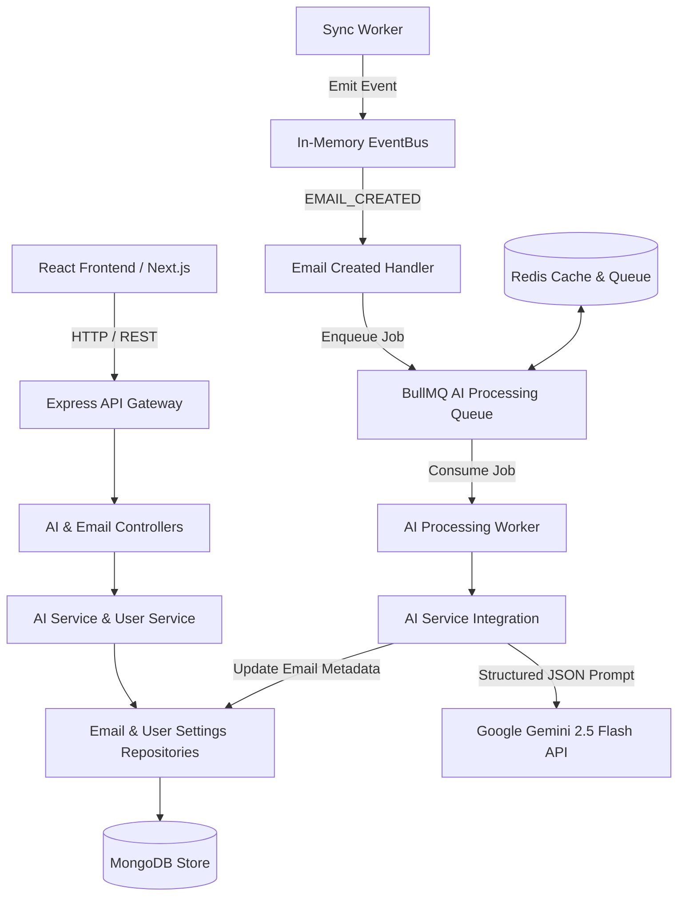
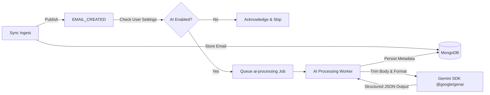
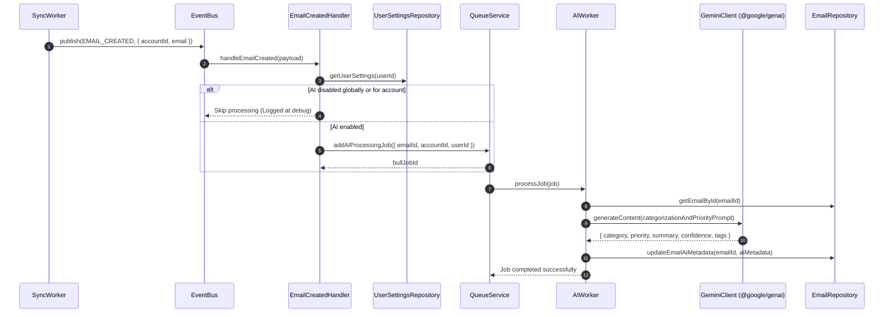
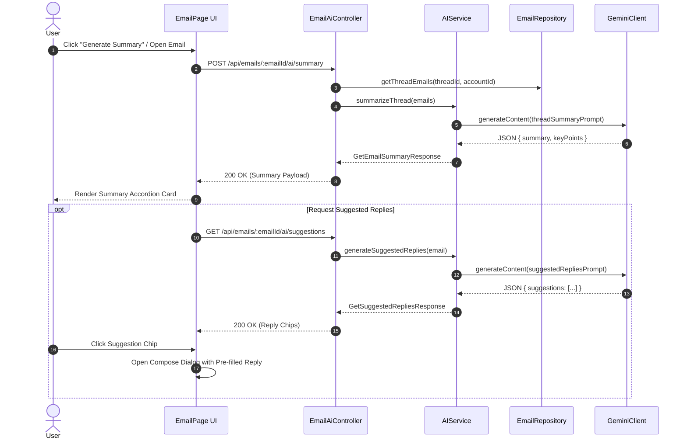
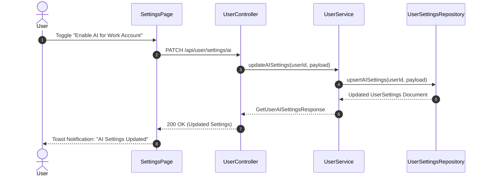
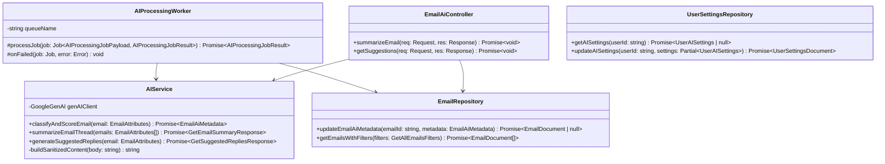
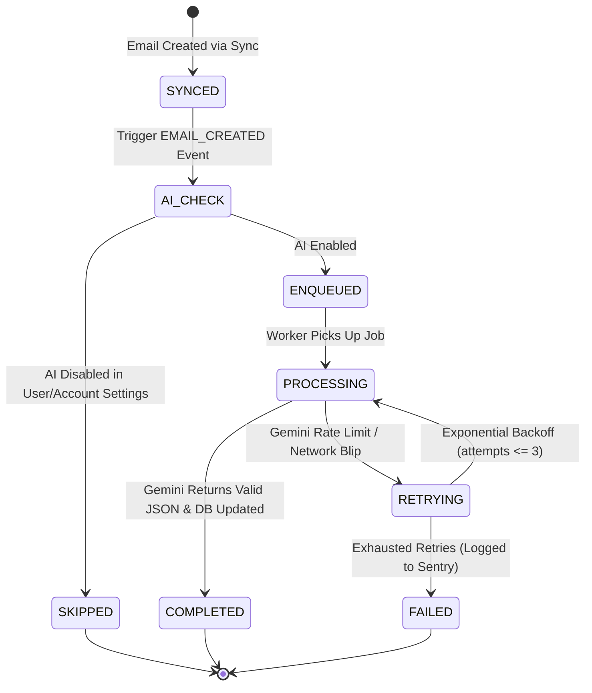

# AI Foundation & Core AI (Gemini) — Implementation Plan

> **Phase:** Phase 4 from Roadmap · **Release Target:** v3.3.0
> **Priority:** 🟡 MEDIUM-HIGH — Core differentiator transforming MailSense from simple aggregator to intelligent email hub
> **Status:** DRAFT
> **Created:** 2026-09-14 · **Last Updated:** 2026-09-14

---

## 1. Overview

### Problem Statement

MailSense currently provides full email aggregation, two-way provider synchronization (Gmail & Outlook), thread management, drafts, search, and analytics. However, users still suffer from cognitive overload when dealing with cluttered inboxes:
- Sifting through hundreds of marketing, automated, and transaction emails to find actionable messages is manual and slow.
- Critical messages from executives, clients, or urgent alerts blend indistinguishably with newsletters.
- Long email threads require full reading to catch up on decisions or pending action items.
- Composing standard acknowledgments or replies is repetitive and time-consuming.

The event-driven foundation (Event Bus, BullMQ workers, and `EMAIL_CREATED` events) and Phase 3's Observability & Reliability infrastructure (standardized exception hierarchy, structured Pino logging, correlation IDs) are fully deployed. The system is ready for an asynchronous AI pipeline.

### Goals

- **AI Infrastructure & Worker Pipeline:** Establish robust integration with Google Gemini via the official `@google/genai` SDK, utilizing a dedicated BullMQ queue (`ai-processing`) subscribing to `EMAIL_CREATED` events.
- **Smart Categorization:** Automatically categorize synced emails into Work, Personal, Finance, Social, Promotions, Updates, or General using structured JSON outputs.
- **Priority Scoring:** Score emails into Critical, High, Normal, or Low priority based on urgency, relationship context, and deadlines. Support a dedicated "Priority Inbox" view.
- **Email & Thread Summarization:** Generate instant one-line TL;DRs for list view previews and provide on-demand multi-bullet comprehensive thread summaries.
- **Suggested Replies:** Generate 2–3 contextual, tone-adapted quick replies that immediately populate the compose window.
- **AI Settings & Privacy Controls:** Provide granular global, per-feature, and per-account AI toggles, coupled with explicit user consent tracking and data minimization guarantees.

### Non-Goals

- **Email Auto-Sending:** AI will never send emails automatically on behalf of the user; suggested replies require explicit user review and sending in the composer.
- **Fine-Tuning / Model Training:** We will not fine-tune custom Gemini models or retain user email content for external model training. Data transmission strictly adheres to zero-retention API agreements.
- **Natural Language Search / Agentic Actions:** Natural language email queries (e.g. "Find invoices from last month") and autonomous multi-step tool use are slated for Phase 7 (Advanced AI).
- **Rule Engine Execution:** Custom user-defined filtering rules (e.g. "If sender = boss, mark important") belong to Phase 5.

### Background / Context

In the MailSense architecture, email ingestion occurs via background sync jobs (`SyncWorker`) which process changes from Gmail and Outlook. Upon creating an email record in MongoDB, an `EMAIL_CREATED` event is broadcast through `EventBus`. The handler in `Backend/src/core/events/handlers/email-created.handler.ts` was deliberately designed with a placeholder to enqueue AI jobs.

Building on the Phase 3 Observability framework, all Gemini API calls and background worker executions will carry correlation IDs, performance timers, structured metadata, and strict error classification (`ExternalServiceError`, `AiProcessingError`).

---

## 2. Requirements

### Functional Requirements

1. **FR-01 (Asynchronous Classification):** When a new email arrives via sync, the system enqueues an AI processing job without blocking the sync worker. Gemini classifies the email category (`work`, `personal`, `finance`, `social`, `promotions`, `updates`, `general`) and priority (`critical`, `high`, `normal`, `low`).
2. **FR-02 (Inbox Category Badges & Filtering):** The frontend email list renders colored category badges on email rows and enables filtering by category in the inbox filter bar.
3. **FR-03 (Priority Inbox View):** Users can switch between "All" and "Priority" inbox views or filter by priority level. Critical and High priority emails feature visual priority indicators.
4. **FR-04 (Email & Thread Summaries):** 
   - A single-sentence summary is pre-generated and displayed as a tooltip or secondary line in the email table.
   - Users can trigger an on-demand "AI Summary" inside the email detail view to receive structured key bullet points of lengthy conversations.
5. **FR-05 (Contextual Suggested Replies):** The email detail view provides 2–3 smart reply chips (e.g. Formal confirmation, Casual acknowledgment, Quick decline). Clicking a suggestion launches the compose modal pre-populated with the recipient, subject, and suggested text.
6. **FR-06 (Granular Privacy & Account Controls):** Users can enable or disable AI globally, toggle specific sub-features, or disable AI for sensitive accounts. If AI is disabled for an account, incoming emails skip AI queue ingestion entirely.

### Non-Functional Requirements

- **NFR-01 (Throughput & Latency):** Background email classification must complete within 3 seconds of queue pickup under standard load. On-demand summary and suggestion endpoints must return responses within 2.5 seconds.
- **NFR-02 (API Quota Protection & Backoff):** The Gemini client must enforce rate limiting, exponential backoff (starting at 2s with 3 retries), and graceful degradation if quota limits are encountered.
- **NFR-03 (Data Minimization & Privacy):** Prompts sent to Gemini must only contain necessary fields (`subject`, `from`, `receivedAt`, and trimmed `bodyPlain` up to 4,000 characters). HTML tags, raw base64 payloads, and binary attachments must never be passed to the LLM.
- **NFR-04 (Type Safety & Code Standards):** Zero tolerance for `any`, `never`, or `unknown` types across backend and frontend codebases. All data models and API payloads must derive directly from `@mailsense/types`.
- **NFR-05 (Fault Isolation):** Failures in the AI worker must never cause email sync failures or prevent users from reading, composing, or managing emails.

### Acceptance Criteria

- [ ] New emails ingested during sync receive `aiCategory`, `aiPriority`, and `aiSummary` in MongoDB within 5 seconds.
- [ ] Email table displays category pills and priority flags without layout shift or UI stutter.
- [ ] Users can filter emails by category and priority in `GET /api/emails`.
- [ ] Clicking "Summarize" in email view returns a concise bulleted summary within 3 seconds.
- [ ] Clicking a suggested reply populates the compose window with accurate context.
- [ ] Disabling AI for an account stops AI processing for all future emails of that account.
- [ ] Backend build (`pnpm build`) and Frontend TypeScript verification (`npx tsc --noEmit`) pass with zero errors.

---

## 3. Design

### 3.1 High-Level Design

#### System Architecture Topology



#### Data Flow & Pipeline



---

### 3.2 Low-Level Design

#### Sequence Diagrams

##### Flow 1: Asynchronous AI Classification & Scoring Pipeline



##### Flow 2: On-Demand Thread Summarization & Suggested Replies



##### Flow 3: AI Settings & Privacy Management



#### Class & Interface Diagram



#### State Machine Diagram: Email AI Ingestion Lifecycle



---

### 3.3 Data Models

#### Modified `EmailSchema` (`Backend/src/modules/emails/email.model.ts`)

```typescript
import { EMAIL_AI_CATEGORY, EMAIL_AI_PRIORITY, EmailAttributes } from '@mailsense/types';
import { Document, model, Schema } from 'mongoose';

// Existing EmailAttachmentSchema unchanged...

const EmailSchema = new Schema<EmailDocument>(
    {
        accountId: { type: String, required: true },
        providerMessageId: { type: String, required: true },
        threadId: { type: String, required: true },
        from: { type: String, required: true },
        to: { type: [String], required: true },
        cc: { type: [String], required: true },
        bcc: { type: [String], required: true },
        subject: { type: String, required: true },
        body: { type: String, required: true },
        bodyHtml: { type: String, required: true },
        bodyPlain: { type: String, required: true },
        receivedAt: { type: Date, required: true },
        isRead: { type: Boolean, required: true },
        folders: { type: [String], required: true },
        attachments: { type: [EmailAttachmentSchema], default: [] },
        
        // Phase 4: AI Foundation fields
        aiCategory: {
            type: String,
            enum: Object.values(EMAIL_AI_CATEGORY),
            index: true,
        },
        aiPriority: {
            type: String,
            enum: Object.values(EMAIL_AI_PRIORITY),
            index: true,
        },
        aiSummary: { type: String },
        aiTags: { type: [String], default: [] },
        aiProcessedAt: { type: Date },
    },
    { timestamps: true, versionKey: false },
);

// Compound indexes for high performance query filtering
EmailSchema.index({ accountId: 1, aiCategory: 1, receivedAt: -1 });
EmailSchema.index({ accountId: 1, aiPriority: 1, receivedAt: -1 });
```

#### Extended `UserSettingsSchema` (`Backend/src/modules/user/user.model.ts`)

```typescript
import { UserAISettings } from '@mailsense/types';

const UserAISettingsSchema = new Schema<UserAISettings>(
    {
        enabled: { type: Boolean, default: true },
        categorizationEnabled: { type: Boolean, default: true },
        priorityScoringEnabled: { type: Boolean, default: true },
        summarizationEnabled: { type: Boolean, default: true },
        suggestedRepliesEnabled: { type: Boolean, default: true },
        consentGivenAt: { type: Number, default: () => Date.now() },
        accountOverrides: { type: Map, of: Boolean, default: () => ({}) },
    },
    { _id: false },
);

// Added to UserSettingsSchema:
// ai: { type: UserAISettingsSchema, default: () => ({}) }
```

---

### 3.4 API Contracts

| Method | Path | Request Body | Response Shape | Status Codes | Description |
| :--- | :--- | :--- | :--- | :--- | :--- |
| `POST` | `/api/emails/:emailId/ai/summary` | `{}` | `ApiResponse<GetEmailSummaryResponse>` | `200`, `400`, `404`, `502` | Generate comprehensive summary of email/thread |
| `GET` | `/api/emails/:emailId/ai/suggestions` | — | `ApiResponse<GetSuggestedRepliesResponse>` | `200`, `404`, `502` | Generate 2–3 contextual quick reply suggestions |
| `GET` | `/api/user/settings/ai` | — | `ApiResponse<GetUserAISettingsResponse>` | `200`, `401`, `500` | Fetch current user's AI preferences & feature flags |
| `PATCH` | `/api/user/settings/ai` | `UpdateUserAISettingsRequestBody` | `ApiResponse<GetUserAISettingsResponse>` | `200`, `400`, `401`, `500` | Update user AI preferences & account overrides |
| `GET` | `/api/emails` | Query: `?aiCategory=work&aiPriority=high` | `ApiResponse<GetEmailsResponse>` | `200`, `400`, `401` | Existing list endpoint extended with AI filter parameters |

---

### 3.5 State Management

#### React Query Keys (`Frontend/src/features/emails/api/email.queries.ts`, `Frontend/src/features/settings/api/settings.queries.ts`)

| Query / Mutation | Query Key / Mutation Key | Cache Invalidation Rules | Notes |
| :--- | :--- | :--- | :--- |
| `useEmailSummary(emailId)` | `['email', 'ai-summary', emailId]` | Invalidate on explicit re-summarize | Cached for 30 minutes |
| `useSuggestedReplies(emailId)` | `['email', 'ai-suggestions', emailId]` | Cache per emailId | Stale after 15 minutes |
| `useUserAISettings()` | `['user', 'settings', 'ai']` | Invalidate on mutation | Stored in settings cache |
| `useUpdateUserAISettings()` | `['user', 'settings', 'ai', 'update']` | Invalidates `['user', 'settings', 'ai']` and `['emails']` | Instant optimistic UI update |
| `useEmails(filter)` | `['emails', accountId, folder, aiCategory, aiPriority, page]` | Invalidates on email updates, deletions, and sync | Refetches filtered results |

---

## 4. Proposed Changes

### Backend

#### Shared Config & Integrations
- [MODIFY] [env.config.ts](file:///Users/vishaljagamani/Projects/Projects/mailsense/Backend/src/core/config/env.config.ts): Add `GEMINI_API_KEY` and `FEATURE_AI_ENABLED`.
- [NEW] `Backend/src/integrations/ai/gemini.client.ts`: Initialize Google GenAI client instance with structured output schemas and error handling.
- [NEW] `Backend/src/integrations/ai/ai.service.ts`: Core AI service wrapping classification, scoring, summarization, and suggested reply prompts.
- [NEW] `Backend/src/integrations/ai/prompts/`: Versioned prompt templates for categorization, prioritization, summarization, and replies.

#### Queues & Workers
- [MODIFY] [queue.config.ts](file:///Users/vishaljagamani/Projects/Projects/mailsense/Backend/src/core/queue/queue.config.ts): Add `QUEUE_NAMES.AI_PROCESSING = 'ai-processing'`.
- [MODIFY] [queue.service.ts](file:///Users/vishaljagamani/Projects/Projects/mailsense/Backend/src/core/queue/queue.service.ts): Add `addAIProcessingJob(payload: AIProcessingJobPayload)`.
- [NEW] `Backend/src/workers/ai-processing.worker.ts`: BullMQ worker extending `BaseWorker` to consume `ai-processing` jobs.
- [NEW] `Backend/src/workers/processors/ai-processing.processor.ts`: Processor function handling text sanitization, Gemini inference, and database updates.
- [MODIFY] [email-created.handler.ts](file:///Users/vishaljagamani/Projects/Projects/mailsense/Backend/src/core/events/handlers/email-created.handler.ts): Replace stub with check on User AI Settings and dispatch to `QueueService.addAIProcessingJob`.

#### Modules & APIs
- [MODIFY] [email.model.ts](file:///Users/vishaljagamani/Projects/Projects/mailsense/Backend/src/modules/emails/email.model.ts): Add AI fields and indexes.
- [MODIFY] [email.repository.ts](file:///Users/vishaljagamani/Projects/Projects/mailsense/Backend/src/modules/emails/email.repository.ts): Add `updateEmailAiMetadata`, update `getEmails` query builder to support `aiCategory` and `aiPriority`.
- [NEW] `Backend/src/modules/emails/email-ai.controller.ts`: Endpoints for on-demand summarization and quick replies.
- [MODIFY] [email.routes.ts](file:///Users/vishaljagamani/Projects/Projects/mailsense/Backend/src/modules/emails/email.routes.ts): Register `/ai/summary` and `/ai/suggestions` routes with validation schemas.
- [MODIFY] [user.model.ts](file:///Users/vishaljagamani/Projects/Projects/mailsense/Backend/src/modules/user/user.model.ts): Add `UserAISettingsSchema` to `UserSettings`.
- [MODIFY] [user-settings.repository.ts](file:///Users/vishaljagamani/Projects/Projects/mailsense/Backend/src/modules/user/user-settings.repository.ts): Add `getAISettings` and `updateAISettings`.
- [MODIFY] [user.controller.ts](file:///Users/vishaljagamani/Projects/Projects/mailsense/Backend/src/modules/user/user.controller.ts): Add `getAISettingsHandler` and `updateAISettingsHandler`.
- [MODIFY] [user.routes.ts](file:///Users/vishaljagamani/Projects/Projects/mailsense/Backend/src/modules/user/user.routes.ts): Add `/settings/ai` endpoints.

---

### Frontend

#### API Client & Endpoints
- [MODIFY] `Frontend/src/shared/api/endpoints.ts`: Add `AI_API_ENDPOINTS` constants (`EMAILS_AI_SUMMARY`, `EMAILS_AI_SUGGESTIONS`, `USER_AI_SETTINGS`).
- [NEW] `Frontend/src/features/emails/api/email-ai.api.ts`: Typed API client wrappers for summary and suggestions.
- [NEW] `Frontend/src/features/emails/api/email-ai.queries.ts`: React Query hooks (`useEmailSummary`, `useSuggestedReplies`).
- [NEW] `Frontend/src/features/settings/api/ai-settings.api.ts`: API client for AI settings.
- [NEW] `Frontend/src/features/settings/api/ai-settings.queries.ts`: React Query hooks (`useAISettings`, `useUpdateAISettings`).

#### UI Components & Views
- [NEW] `Frontend/src/features/emails/components/CategoryBadge.tsx`: Color-coded category badge pill for email rows.
- [NEW] `Frontend/src/features/emails/components/PriorityFlag.tsx`: Visual priority icon and indicator.
- [NEW] `Frontend/src/features/emails/components/EmailAiSummaryCard.tsx`: Collapsible AI Summary card in email detail view.
- [NEW] `Frontend/src/features/emails/components/SuggestedRepliesBar.tsx`: Contextual reply chips with compose modal integration.
- [MODIFY] [EmailListTable.tsx](file:///Users/vishaljagamani/Projects/Projects/mailsense/Frontend/src/features/inbox/components/EmailListTable.tsx): Render category badge, priority flag, and inline summary hover preview.
- [MODIFY] [EmailHeader.tsx](file:///Users/vishaljagamani/Projects/Projects/mailsense/Frontend/src/features/emails/components/EmailHeader.tsx): Display priority and category pills in header.
- [MODIFY] [index.tsx (Email Page)](file:///Users/vishaljagamani/Projects/Projects/mailsense/Frontend/src/features/emails/pages/index.tsx): Integrate `EmailAiSummaryCard` and `SuggestedRepliesBar`.
- [NEW] `Frontend/src/features/settings/pages/ai/index.tsx`: Full AI Settings tab with global toggle, per-feature toggles, per-account overrides, and data privacy disclosures.
- [MODIFY] [index.tsx (Settings Page)](file:///Users/vishaljagamani/Projects/Projects/mailsense/Frontend/src/features/settings/pages/index.tsx): Add "AI Settings" tab to `TabsList`.

---

## 5. Implementation Phases

### Phase 1: AI Infrastructure & Worker Pipeline

**Objective:** Install `@google/genai`, establish Gemini client wrapper with structured JSON generation, configure BullMQ `ai-processing` queue, and connect the `EMAIL_CREATED` event subscriber.  
**Estimated Effort:** Medium

#### Tasks

- [ ] Add `@google/genai` dependency to `Backend/package.json`.
- [ ] Add `GEMINI_API_KEY` and `FEATURE_AI_ENABLED` to `env.config.ts` with validation.
- [ ] Create `Backend/src/integrations/ai/gemini.client.ts` implementing `GoogleGenAI` initialization, structured schema definitions, and retry logic.
- [ ] Add `QUEUE_NAMES.AI_PROCESSING` to `queue.config.ts` and `QueueService.addAIProcessingJob` to `queue.service.ts`.
- [ ] Create `AIProcessingWorker` in `Backend/src/workers/ai-processing.worker.ts` extending `BaseWorker`.
- [ ] Create `aiProcessingProcessor` in `Backend/src/workers/processors/ai-processing.processor.ts`.
- [ ] Update `email-created.handler.ts` to check AI settings and enqueue jobs on `EMAIL_CREATED`.
- [ ] Add unit tests verifying prompt sanitization, queue job addition, and error backoff.

#### Files to Create
- `Backend/src/integrations/ai/gemini.client.ts`
- `Backend/src/integrations/ai/ai.service.ts`
- `Backend/src/integrations/ai/ai.types.ts`
- `Backend/src/workers/ai-processing.worker.ts`
- `Backend/src/workers/processors/ai-processing.processor.ts`

#### Files to Modify
- `Backend/src/core/config/env.config.ts`
- `Backend/src/core/queue/queue.config.ts`
- `Backend/src/core/queue/queue.service.ts`
- `Backend/src/core/events/handlers/email-created.handler.ts`
- `Backend/src/server.ts`

#### Acceptance Criteria
1. When an email is synced, a background job is enqueued in the `ai-processing` queue.
2. The AI worker picks up the job and successfully executes Gemini structured generation.
3. If the Gemini API fails or returns rate limit errors, the job retries with exponential backoff up to 3 times without crashing the worker.

---

### Phase 2: Smart Categorization

**Objective:** Implement email categorization into Work, Personal, Finance, Social, Promotions, Updates, or General, storing results in MongoDB and displaying category badges in the frontend email list with filter support.  
**Estimated Effort:** Medium

#### Tasks

- [ ] Update `EmailSchema` with `aiCategory` field and compound indexes.
- [ ] Implement classification prompt with enum schema constraint in `AIService`.
- [ ] Update `EmailRepository.updateEmailAiMetadata` to persist `aiCategory`.
- [ ] Extend `EmailRepository.getEmails` to support filtering by `aiCategory`.
- [ ] Create `CategoryBadge.tsx` component with distinct color mappings (e.g., Work: Indigo, Personal: Emerald, Finance: Amber, Social: Purple, Promotions: Pink, Updates: Sky).
- [ ] Update `EmailListTable.tsx` to render `CategoryBadge` in the email subject/details column.
- [ ] Add Category filter dropdown to Inbox filter bar.

#### Files to Create
- `Frontend/src/features/emails/components/CategoryBadge.tsx`
- `Backend/src/integrations/ai/prompts/categorization.prompt.ts`

#### Files to Modify
- `Backend/src/modules/emails/email.model.ts`
- `Backend/src/modules/emails/email.repository.ts`
- `Backend/src/modules/emails/email.controller.ts`
- `Frontend/src/features/inbox/components/EmailListTable.tsx`
- `Frontend/src/features/inbox/components/EmailListHeader.tsx`

#### Acceptance Criteria
1. Synced emails receive accurate category labels based on their subject and body text.
2. The frontend email table displays the appropriate colored category pill for classified emails.
3. Users can select a category from the filter menu and see only emails belonging to that category.

---

### Phase 3: Priority Scoring & Priority Inbox View

**Objective:** Score emails as Critical, High, Normal, or Low priority, display visual priority indicators in the email list, and introduce a "Priority Inbox" view.  
**Estimated Effort:** Medium

#### Tasks

- [ ] Update `EmailSchema` with `aiPriority` field and compound index.
- [ ] Extend AI classification prompt to evaluate priority based on urgency, deadline signals, and sender context.
- [ ] Update `EmailRepository.updateEmailAiMetadata` to persist `aiPriority`.
- [ ] Extend `EmailRepository.getEmails` to support `aiPriority` filtering.
- [ ] Create `PriorityFlag.tsx` component (Critical: Red flame/alert, High: Orange flag, Normal: Neutral, Low: Subdued down arrow).
- [ ] Update `EmailListTable.tsx` to render priority flags next to sender names.
- [ ] Add "Priority" toggle/tab to Inbox view (`/inbox?priority=critical,high`).

#### Files to Create
- `Frontend/src/features/emails/components/PriorityFlag.tsx`
- `Backend/src/integrations/ai/prompts/priority.prompt.ts`

#### Files to Modify
- `Backend/src/modules/emails/email.model.ts`
- `Backend/src/modules/emails/email.repository.ts`
- `Frontend/src/features/inbox/components/EmailListTable.tsx`
- `Frontend/src/features/inbox/components/EmailListHeader.tsx`
- `Frontend/src/features/inbox/pages/index.tsx`

#### Acceptance Criteria
1. Incoming emails are evaluated and assigned an `aiPriority` score.
2. Critical and High priority emails display distinct warning indicators in the list view.
3. Switching to the Priority view filters the list to show only Critical and High priority items.

---

### Phase 4: Email & Thread Summarization

**Objective:** Generate one-line TL;DR summaries during background ingestion for quick previewing, and provide on-demand multi-bullet thread summarization in the email detail view.  
**Estimated Effort:** Low-Medium

#### Tasks

- [ ] Add `aiSummary` field to `EmailSchema` and compute short 1-sentence summaries during ingestion.
- [ ] Display `aiSummary` as a subtle secondary line or hover tooltip in `EmailListTable.tsx`.
- [ ] Create `POST /api/emails/:emailId/ai/summary` endpoint for comprehensive thread summarization.
- [ ] Implement `AIService.summarizeEmailThread` taking thread messages and returning structured key takeaways and action items.
- [ ] Create `EmailAiSummaryCard.tsx` in frontend with loading skeleton, key bullet points, and action items accordion.
- [ ] Integrate `EmailAiSummaryCard` into `Frontend/src/features/emails/pages/index.tsx`.

#### Files to Create
- `Backend/src/modules/emails/email-ai.controller.ts`
- `Backend/src/integrations/ai/prompts/summary.prompt.ts`
- `Frontend/src/features/emails/components/EmailAiSummaryCard.tsx`
- `Frontend/src/features/emails/api/email-ai.api.ts`
- `Frontend/src/features/emails/api/email-ai.queries.ts`

#### Files to Modify
- `Backend/src/modules/emails/email.routes.ts`
- `Frontend/src/features/emails/pages/index.tsx`
- `Frontend/src/features/inbox/components/EmailListTable.tsx`
- `Frontend/src/shared/api/endpoints.ts`

#### Acceptance Criteria
1. Email list previews show concise one-line summaries.
2. Clicking "Generate Summary" on a multi-message thread retrieves and renders bulleted takeaways within 3 seconds.
3. Subsequent requests for the same summary use cached results without duplicate Gemini invocations.

---

### Phase 5: Contextual Suggested Replies

**Objective:** Generate 2–3 contextual quick reply suggestions adapted to email tone and intent, enabling one-click compose pre-fill.  
**Estimated Effort:** Medium

#### Tasks

- [ ] Create `GET /api/emails/:emailId/ai/suggestions` endpoint.
- [ ] Implement `AIService.generateSuggestedReplies` prompt returning 3 suggestions (e.g. Acknowledgment, Affirmation/Agreement, Follow-up/Clarification question).
- [ ] Create `SuggestedRepliesBar.tsx` rendering clickable suggestion pill chips below the email body.
- [ ] Connect click action on a chip to open Compose modal with:
  - Recipient pre-filled (`to: [email.from]`)
  - Subject pre-filled (`Re: ${email.subject}`)
  - Body pre-filled with suggestion text.
- [ ] Handle error states gracefully (hide bar or display "Unable to generate replies").

#### Files to Create
- `Frontend/src/features/emails/components/SuggestedRepliesBar.tsx`
- `Backend/src/integrations/ai/prompts/suggested-replies.prompt.ts`

#### Files to Modify
- `Backend/src/modules/emails/email-ai.controller.ts`
- `Backend/src/modules/emails/email.routes.ts`
- `Frontend/src/features/emails/pages/index.tsx`
- `Frontend/src/shared/api/endpoints.ts`

#### Acceptance Criteria
1. Opening an incoming email displays contextual reply chips below the message.
2. Clicking any chip opens the Compose window with the reply text seamlessly populated.
3. Suggestions reflect the actual context of the email conversation accurately.

---

### Phase 6: AI Settings, Privacy Controls & Consent

**Objective:** Implement user AI settings allowing global disable, per-feature toggles, per-account overrides, and explicit user consent tracking with clear privacy disclosures.  
**Estimated Effort:** Low-Medium

#### Tasks

- [ ] Add `UserAISettingsSchema` to `UserSettingsModel` in `Backend/src/modules/user/user.model.ts`.
- [ ] Implement `getAISettings` and `updateAISettings` in `user-settings.repository.ts`.
- [ ] Add `GET /api/user/settings/ai` and `PATCH /api/user/settings/ai` endpoints in `user.controller.ts` and `user.routes.ts`.
- [ ] Update `EmailCreatedHandler` and `AIProcessingWorker` to check user AI settings and skip processing if disabled.
- [ ] Create `Frontend/src/features/settings/pages/ai/index.tsx` featuring:
  - Master AI toggle (Enable / Disable MailSense AI)
  - Feature checkboxes (Categorization, Priority Scoring, Summaries, Suggested Replies)
  - Per-account AI toggle list (Enable/disable for specific connected accounts)
  - Privacy policy callout clarifying data transmission and zero-training guarantees.
- [ ] Add "AI Settings" tab to main Settings page navigation.

#### Files to Create
- `Frontend/src/features/settings/pages/ai/index.tsx`
- `Frontend/src/features/settings/api/ai-settings.api.ts`
- `Frontend/src/features/settings/api/ai-settings.queries.ts`

#### Files to Modify
- `Backend/src/modules/user/user.model.ts`
- `Backend/src/modules/user/user-settings.repository.ts`
- `Backend/src/modules/user/user.service.ts`
- `Backend/src/modules/user/user.controller.ts`
- `Backend/src/modules/user/user.routes.ts`
- `Frontend/src/features/settings/pages/index.tsx`
- `Frontend/src/shared/constants/settings.ts`

#### Acceptance Criteria
1. Toggling off AI globally stops all AI queue processing and hides AI features from the UI.
2. Disabling AI for an individual account skips AI classification exclusively for that account's emails.
3. AI Settings persist across sessions in the database.

---

## 6. Dependencies & Constraints

### New Dependencies

| Package | Version | Purpose |
| :--- | :--- | :--- |
| `@google/genai` | `^0.1.2` (or latest stable) | Official modern Google GenAI SDK for Gemini 2.5 Flash API calls |

### Infrastructure Requirements

- **Redis Instance:** BullMQ `ai-processing` queue utilizes existing Redis infrastructure.
- **Gemini API Key:** Active `GEMINI_API_KEY` configured in environment variables.

### Existing Dependencies (leveraged)

| Dependency | Purpose |
| :--- | :--- |
| `@mailsense/types` | Shared contracts (`v1.5.0` after types release) |
| `bullmq` (`^5.41.0`) | Background job queue management |
| `pino` (`^9.6.0`) | Structured logging and correlation ID propagation |
| `@tanstack/react-query` | Frontend caching, state management, and optimistic updates |

### Constraints

- **Gemini Rate Limits:** Free tier / standard tier quotas must be respected using BullMQ rate limiting (`limiter: { max: 60, duration: 60000 }`) and exponential backoff.
- **Memory Limits:** Server deployment target memory limit of 512MB RAM. Plain text email bodies sent to Gemini are truncated to max 4,000 characters to prevent high memory allocation.
- **Zero Inline Types:** Named interfaces must be used for all payloads containing 3 or more properties.

---

## 7. Risk Assessment & Mitigation

| Risk | Impact | Likelihood | Mitigation |
| :--- | :--- | :--- | :--- |
| **Gemini API Rate Limiting (HTTP 429)** | HIGH | MEDIUM | Configure BullMQ queue rate limiter to match API limits; retry with exponential backoff up to 3 attempts; log warning and delay job. |
| **Unintended Privacy Leak to LLM** | HIGH | LOW | Strict input sanitization: strip HTML tags, exclude attachments, sanitize sensitive auth tokens or password-reset links prior to prompt construction. |
| **LLM Output Formatting Drift / Invalid JSON** | MEDIUM | LOW | Use Gemini SDK structured outputs (`responseMimeType: 'application/json'` with explicit JSON schema); validate output via Zod/Joi before updating DB. |
| **Worker Queue Overload During Large Account Initial Sync** | MEDIUM | MEDIUM | Batch AI job enqueuing; assign lower priority (e.g. priority 5) to initial backfills, reserving high priority (priority 1) for live incremental syncs. |
| **AI Processing Delay Blocking Email Rendering** | LOW | LOW | Ingestion is 100% decoupled; emails render immediately in inbox with fallback neutral tags while AI background processing completes. |

---

## 8. Verification Plan

### Automated Tests

```bash
# 1. Build and test types
cd /Users/vishaljagamani/Projects/Projects/mailsense-types
pnpm build
pnpm type-check

# 2. Backend Verification
cd /Users/vishaljagamani/Projects/Projects/mailsense/Backend
pnpm test
pnpm build

# 3. Frontend Verification
cd /Users/vishaljagamani/Projects/Projects/mailsense/Frontend
npx tsc --noEmit
pnpm build
```

#### Unit Test Cases

| Feature | Test Case | Expected Result |
| :--- | :--- | :--- |
| **AI Prompt Sanitization** | Pass 10,000 char HTML email body | Strips HTML tags, trims to 4,000 chars, preserves plain text |
| **AI Structured Parsing** | Mock valid Gemini JSON response | Correctly parses into `EmailAiMetadata` with typed enums |
| **AI Malformed Response** | Mock non-JSON or invalid enum string | Throws `ExternalServiceError`, triggers BullMQ retry |
| **AI Settings Check** | Process email when user disabled AI | Returns `{ skippedReason: 'AI_DISABLED_BY_USER' }`, skips Gemini call |
| **Email Repository Query** | Query emails with `aiCategory: 'work'` | Returns only emails matching category |

### Integration Tests

- Sync test: Trigger manual account sync → verify `EMAIL_CREATED` fires → verify BullMQ job processes → check email document in MongoDB for `aiCategory`, `aiPriority`, `aiSummary`.
- On-demand summary test: Send `POST /api/emails/:emailId/ai/summary` with authenticated user → verify 200 response with structured summary.
- Suggested replies test: Send `GET /api/emails/:emailId/ai/suggestions` → verify array of 3 suggestion items.

### Manual Verification

- [ ] Synchronize new emails from Gmail/Outlook and observe category pills rendering in real time.
- [ ] Filter email table by "Work" and "Finance" categories.
- [ ] Toggle "Priority" view and observe Critical/High priority emails isolated.
- [ ] Open long thread and click "Generate Summary" — verify bullet points render smoothly.
- [ ] Click a suggested reply chip — verify compose modal opens with pre-filled content.
- [ ] Navigate to Settings → AI Settings, toggle off AI for an account, sync new mail, and verify no AI tags are generated.

---

## 9. Open Questions & Decisions

> [!IMPORTANT]
> **Q1: Model Choice & Tiering**
> We recommend using `gemini-2.5-flash` for all Phase 4 features (categorization, priority scoring, summarization, suggested replies). It provides sub-second latency, low token costs, and high accuracy with native JSON schema structured outputs.
> - **Recommendation:** Adopt `gemini-2.5-flash` as the default model.

> [!NOTE]
> **Q2: AI Processing Trigger Strategy on Initial Sync**
> When a user first connects an account with 500+ emails, should all 500 emails be enqueued for AI processing immediately?
> - **Option A (Recommended):** Cap initial AI processing to the latest 50 emails to avoid token exhaustion and rate limits. Older emails are categorized on-demand if opened.
> - **Option B:** Process all 500 emails in low-priority background queue batches.

### Resolved Decisions

| Decision | Resolution | Date |
| :--- | :--- | :--- |
| **Official SDK Selection** | Use modern `@google/genai` instead of deprecated `@google/generative-ai`. | 2026-09-14 |
| **Decoupling Architecture** | AI processing is 100% decoupled from sync via `EMAIL_CREATED` event and BullMQ queue. | 2026-09-14 |
| **User Privacy & Training** | Email data is never used for training; prompts are sanitized and truncated. | 2026-09-14 |
| **Strict Type Safety** | Centralize contracts in `@mailsense/types` `v1.5.0` with zero `any`, `never`, or `unknown`. | 2026-09-14 |
