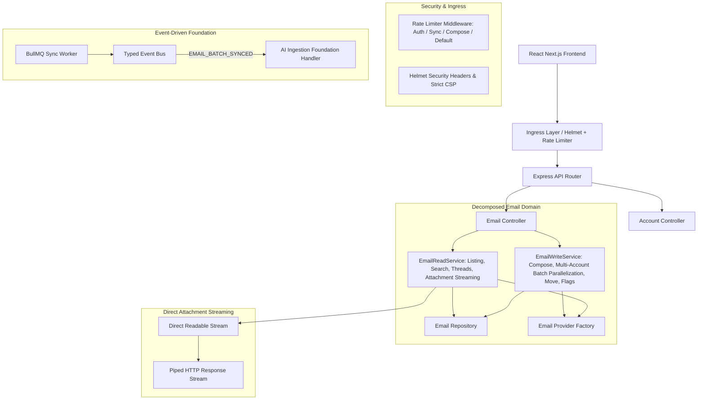
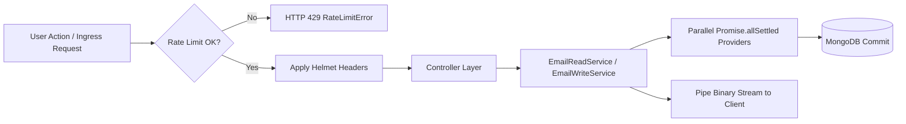
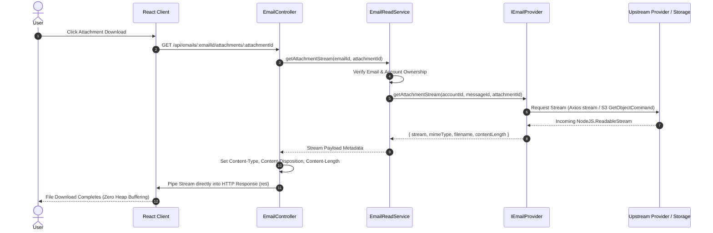
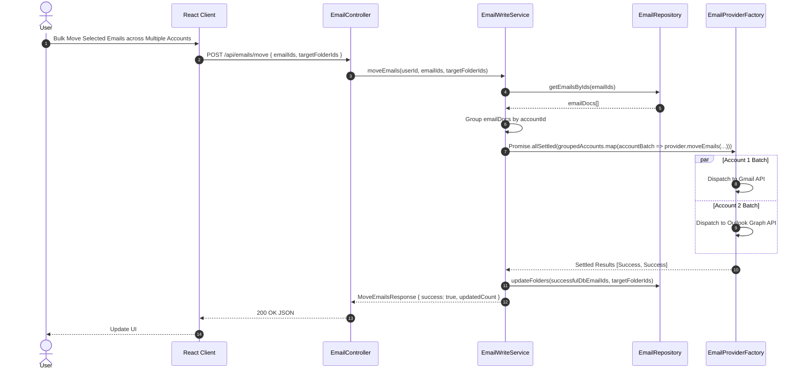
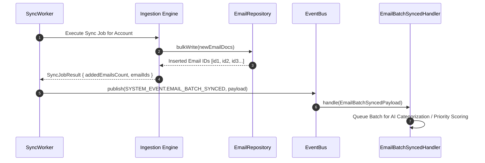
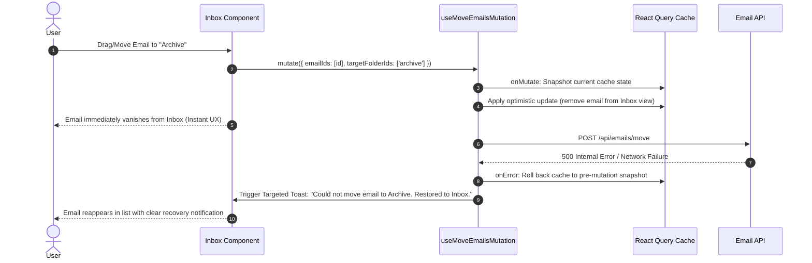
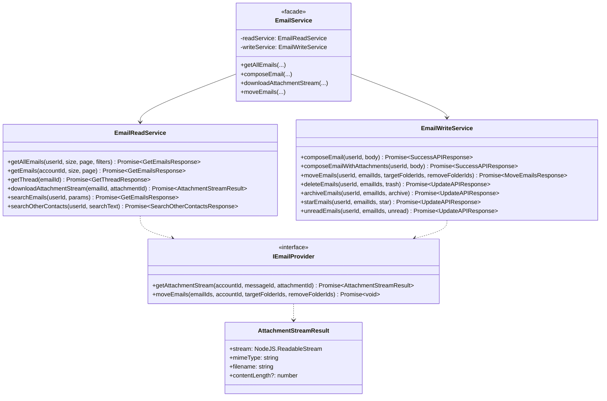
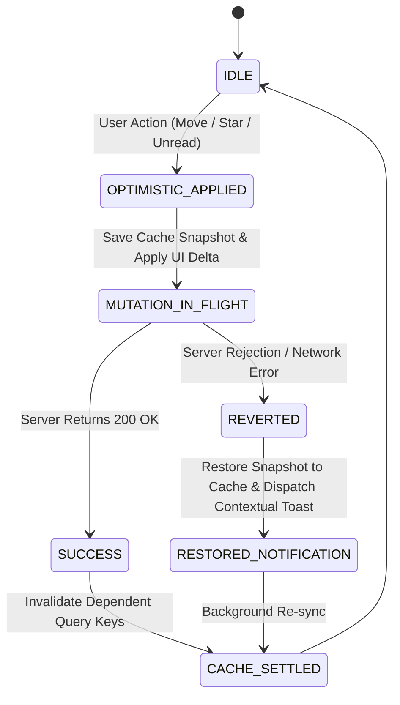

# Platform Resilience & Codebase Enhancements — Implementation Plan

> **Phase:** Sprint P4 (Hardening, Resilience & Performance) · **Release Target:** `Backend v3.4.0` / `Frontend v3.4.0` / `@mailsense/types v1.5.0`
> **Priority:** 🔴 HIGH — Addresses critical findings from the v1.1.0 codebase health audit: API ingress rate limiting, HTTP security headers (CSP), memory-safe attachment streaming, parallelized multi-account processing, EmailService decomposition, post-sync AI event hooks, and frontend optimistic UI resilience & keyboard navigation.
> **Status:** COMPLETED
> **Created:** 2026-09-26 · **Last Updated:** 2026-09-27

---

## 1. Overview

### Problem Statement

Following the completion of the baseline hardening and stabilization sprint ([v1.1.0 Audit Report](file:///Users/vishaljagamani/Projects/Projects/mailsense/.agents/plans/codebase-health-audit-report.md)), a re-assessment of the MailSense codebase surfaced key operational, architectural, and security vulnerabilities that must be resolved prior to deploying the Phase 4 AI module:

1. **Ingress Security & DOS Exposure (`SEC-NEXT-01`, `SEC-NEXT-02`):** The Express API lacks rate-limiting middleware on sensitive and high-throughput routes (`/api/accounts/sync`, `/api/emails/compose`, `/api/auth/login`). Unauthenticated or malicious bursts can exhaust external Google/Microsoft API quotas or trigger denial-of-service. Furthermore, the application lacks `helmet()` HTTP security headers and Content Security Policy (CSP) protections against clickjacking and MIME-type sniffing.
2. **Memory Leaks & Throughput Bottlenecks (`PERF-NEXT-01`, `PERF-NEXT-02`):** Attachment downloads buffer entire file contents into Node.js `Buffer` objects in memory before writing to HTTP responses. Downloading multiple concurrent attachments (>25MB) creates severe heap pressure. Additionally, multi-account batch email operations (`moveEmails`, `archiveEmails`) iterate serially over connected accounts in `for...of` loops, multiplying latency by the number of accounts.
3. **Architectural Monolith & God Service (`ARCH-NEXT-01`, `ARCH-NEXT-02`):** [email.service.ts](file:///Users/vishaljagamani/Projects/Projects/mailsense/Backend/src/modules/emails/email.service.ts) has grown past 580 lines, conflating read concerns (listing, threads, search, attachments) with write concerns (composition, provider movement, staging cleanup, state mutation). Concurrently, background sync workers do not emit post-sync domain events (`EMAIL_BATCH_SYNCED`), blocking the downstream AI intelligence pipeline from asynchronously processing newly ingested email batches.
4. **UX Fragility & Power-User Friction (`UI-NEXT-01`, `UI-NEXT-02`):** When frontend optimistic updates fail (e.g. moving an email or marking read), React Query rolls back state, but the user is provided only a generic error toast with no action context or explanation. Power users also lack standard keyboard shortcut workflows (`j`/`k`, `e`, `r`, `s`, `/`, `c`), forcing repetitive mouse interactions.

### Goals

- **Harden API Ingress:** Implement `express-rate-limit` with bucketed policies for authentication, manual sync triggers, transactional email dispatch, and general API endpoints. Mount `helmet` with strict security headers and CSP directives.
- **Implement Direct Streaming:** Refactor provider attachment retrieval and Express controllers to stream binary data directly from upstream sources (Gmail Base64 stream, Microsoft Graph API stream, S3/R2 stream) to the client HTTP response without buffering full payloads in RAM.
- **Parallelize Multi-Account Batch Processing:** Group multi-account email operations by provider account and execute batch calls concurrently using `Promise.allSettled()`, aggregating partial successes and reporting discrete failures.
- **Decompose EmailService:** Split `EmailService` into focused `EmailReadService` and `EmailWriteService` layers, while maintaining a unified `EmailService` facade for backward compatibility.
- **Establish AI Event Pipeline Readiness:** Emit `SYSTEM_EVENT.EMAIL_BATCH_SYNCED` from the background sync worker upon batch ingestion, preparing the event hook for Phase 4 AI ingestion.
- **Enhance Frontend Optimistic Rollbacks & UX:** Provide explicit, context-rich error and rollback toast messaging in React Query mutation lifecycle hooks.
- **Build Keyboard Navigation & Shortcuts:** Implement a lightweight, type-safe keyboard navigation engine with configurable bindings and an accessible shortcuts cheatsheet modal.

### Non-Goals

- Implementing actual Gemini AI categorization or priority scoring models (reserved for Phase 4: `ai-foundation-core-ai`).
- Modifying MongoDB database clustering or sharding configurations.
- Replacing Zustand or TanStack React Query with alternative state management libraries.

### Background

This implementation plan directly operationalizes the findings documented in Section 2 and Section 4 of the [MailSense Codebase Health Audit Report v1.1.0](file:///Users/vishaljagamani/Projects/Projects/mailsense/.agents/plans/codebase-health-audit-report.md). Completing this sprint elevates the codebase health score from **94/100** to the target **97/100 (GREEN)** rating, stabilizing system infrastructure for AI workflows.

---

## 2. Requirements

### Functional Requirements

1. **FR-01 (API Ingress Rate Limiting):** The backend MUST enforce distinct rate limit policies:
   - *Auth Endpoints:* 10 requests per minute per IP.
   - *Manual Account Sync:* 5 requests per minute per user.
   - *Email Composition / Dispatch:* 20 requests per minute per user.
   - *Default API Endpoints:* 300 requests per 15-minute window per IP/user.
   - Requests exceeding limits MUST return HTTP 429 with standard `AppError` payload formatting.
2. **FR-02 (HTTP Security Headers):** All HTTP responses MUST include `helmet`-generated security headers including `X-Content-Type-Options: nosniff`, `X-Frame-Options: DENY`, `Strict-Transport-Security`, and a strict `Content-Security-Policy`.
3. **FR-03 (Attachment Streaming):** The attachment download endpoint (`GET /api/emails/:emailId/attachments/:attachmentId`) MUST pipe the provider's binary stream directly into the Express `Response` object with appropriate `Content-Type`, `Content-Disposition`, and `Content-Length` headers, without accumulating the entire file in Node.js heap memory.
4. **FR-04 (Concurrent Multi-Account Operations):** Operations impacting emails across multiple connected accounts (`moveEmails`, `archiveEmails`, `deleteEmail`, `starEmails`) MUST dispatch provider API updates concurrently across unique accounts using `Promise.allSettled()`.
5. **FR-05 (Email Service Separation):** Read operations (`getAllEmails`, `getEmails`, `getThread`, `downloadAttachment`, `searchEmails`, `searchOtherContacts`) MUST reside in `EmailReadService`. Mutation operations (`composeEmail`, `composeEmailWithAttachments`, `moveEmails`, `deleteEmail`, `archiveEmails`, `starEmails`, `unreadEmails`) MUST reside in `EmailWriteService`.
6. **FR-06 (Post-Sync Event Emission):** Upon completing email batch ingestion, `SyncWorker` MUST publish `SYSTEM_EVENT.EMAIL_BATCH_SYNCED` on the internal `eventBus` carrying the `accountId`, `userId`, `emailIds: string[]`, `batchSize: number`, and `timestamp`.
7. **FR-07 (Contextual Optimistic Rollback Feedback):** When an optimistic email action (move, archive, star, unread) fails on the network or server, the UI MUST automatically roll back cache state to the pre-mutation snapshot and display a toast specifying the failed action and recovery state (e.g. *"Could not move email to Archive. Restored to Inbox."*).
8. **FR-08 (Keyboard Navigation Shortcuts):** Users on inbox and thread views MUST be able to navigate and trigger actions via keyboard shortcuts:
   - `j` / `ArrowDown`: Select next email row.
   - `k` / `ArrowUp`: Select previous email row.
   - `Enter` / `o`: Open selected email thread.
   - `e`: Move selected email(s) to Archive.
   - `#` / `Delete`: Move selected email(s) to Trash.
   - `s`: Toggle star/flag on selected email(s).
   - `u`: Toggle unread/read state on selected email(s).
   - `c`: Trigger compose modal.
   - `/`: Focus search input.
   - `?`: Open keyboard shortcuts cheat-sheet modal.
   - Shortcuts MUST automatically deactivate when focus is within `<input>`, `<textarea>`, or content-editable elements.

### Non-Functional Requirements

- **NFR-01 (Memory Efficiency):** Downloading attachments of any size (up to provider maximum of 25MB) MUST maintain server memory delta under 5MB per download session through direct stream piping.
- **NFR-02 (Multi-Account Throughput):** Bulk operations spanning 3 distinct email accounts MUST complete within $\max(T_1, T_2, T_3) + 50\text{ms}$ rather than $\sum T_i$.
- **NFR-03 (Type Safety Standards):** Zero usage of `any`, `never`, or `unknown` (excluding third-party dynamic metadata), and zero inline object types containing $\ge 3$ keys across all backend and frontend changes.
- **NFR-04 (Error Tracing & Observability):** All new middleware, rate limiters, and split services MUST utilize structured logging with `X-Correlation-Id` propagation and contextual metadata.

### Acceptance Criteria

- [ ] Rate limiters reject abusive traffic on `/auth`, `/sync`, and `/compose` with HTTP 429 and structured error codes.
- [ ] Security scan confirms `helmet` headers (`X-Frame-Options: DENY`, `X-Content-Type-Options: nosniff`, CSP) present on all responses.
- [ ] Attachment download streams large files without spike in heap memory usage.
- [ ] Multi-account move executes provider requests in parallel via `Promise.allSettled`.
- [ ] `EmailService` decomposed into `EmailReadService` and `EmailWriteService` with full unit test parity.
- [ ] `SyncWorker` publishes `EMAIL_BATCH_SYNCED` event with populated `emailIds` payload.
- [ ] Failed email move/star actions roll back frontend cache and show contextual recovery toast.
- [ ] Power-user keyboard shortcuts (`j`/`k`, `e`, `s`, `u`, `/`, `c`, `?`) function across desktop viewport.

---

## 3. Design

### 3.1 High-Level Design

#### System Architecture Topology



#### Data Flow & Pipeline



---

### 3.2 Low-Level Design

#### Sequence Diagram 1: Direct Memory-Safe Attachment Streaming (`PERF-NEXT-01`)



#### Sequence Diagram 2: Parallelized Multi-Account Batch Operation (`PERF-NEXT-02`)



#### Sequence Diagram 3: Post-Sync AI Event Dispatch (`ARCH-NEXT-02`)



#### Sequence Diagram 4: Optimistic UI Rollback & Targeted Notification (`UI-NEXT-01`)



#### Class & Interface Diagram (`ARCH-NEXT-01`, `PERF-NEXT-01`)



#### State Machine Diagram: Optimistic Email Mutation Lifecycle (`UI-NEXT-01`)



---

### 3.3 Data Models & Contracts

Contract changes for `@mailsense/types` are centrally specified in [types-implementation-plan.md](file:///Users/vishaljagamani/Projects/Projects/mailsense/.agents/plans/codebase-enhancements-and-performance/types-implementation-plan.md). The backend directly consumes these contracts:

```typescript
// Attachment Stream Result Model in Backend
export interface AttachmentStreamResult {
    stream: NodeJS.ReadableStream;
    mimeType: string;
    filename: string;
    contentLength?: number;
}

// Rate Limiter Configuration Options Model
export interface RateLimiterOptions {
    windowMs: number;
    maxRequests: number;
    message: string;
    keyPrefix: string;
}
```

---

### 3.4 API Contracts

| Method | Path | Request Body | Response Shape | Status Codes | Description |
|---|---|---|---|---|---|
| `GET` | `/api/emails/:emailId/attachments/:attachmentId/stream` | None | Binary Stream (Piped) | `200`, `400`, `401`, `404`, `500` | Stream binary attachment data without server memory buffering |
| `POST` | `/api/emails/move` | `MoveEmailsRequestBody` | `MoveEmailsResponse` | `200`, `400`, `401`, `403`, `429`, `500` | Move emails across accounts in parallel |
| `POST` | `/api/accounts/sync/:accountId` | None | `APIResponse<{ jobId: string }>` | `200`, `401`, `404`, `429`, `500` | Rate-limited manual sync trigger (5/min) |
| `POST` | `/api/emails/compose` | `ComposeEmailRequestBody` | `SuccessAPIResponse` | `200`, `400`, `401`, `403`, `429`, `500` | Rate-limited transactional compose (20/min) |

---

### 3.5 State Management (Frontend)

| Mutation Hook | Query Key Dependencies | Optimistic Cache Action | Rollback Behavior & Message |
|---|---|---|---|
| `useMoveEmailsMutation` | `EMAIL_QUERY_KEYS.all`, `[FOLDER_KEYS.FOLDERS]` | Filter moved emails out of active folder list query | Re-insert cached items; Toast: *"Could not move email(s) to [Folder]. Restored to previous location."* |
| `useStarEmailMutation` | `EMAIL_QUERY_KEYS.all` | Toggle `isStarred` boolean on matched email in cache | Invert `isStarred` back; Toast: *"Could not update star status. State reverted."* |
| `useUnreadEmailMutation` | `EMAIL_QUERY_KEYS.all` | Toggle `isRead` boolean on matched email in cache | Invert `isRead` back; Toast: *"Could not mark email as unread. State reverted."* |
| `useDeleteEmail` | `EMAIL_QUERY_KEYS.all` | Remove email item from list cache | Re-insert cached email; Toast: *"Could not delete email. Restored to inbox."* |

---

## 4. Proposed Changes

### Backend Changes

#### 1. Ingress Security & Rate Limiting (`Backend/src/core/security/`)
- **[NEW] `Backend/src/core/security/rate-limit.config.ts`**: Centralized rate limiting configurations and middleware instances using `express-rate-limit`.
- **[NEW] `Backend/src/core/security/helmet.config.ts`**: Helmet security configuration and Content-Security-Policy rules.
- **[MODIFY] [app.ts](file:///Users/vishaljagamani/Projects/Projects/mailsense/Backend/src/app.ts)**: Mount `helmet()` and route-level rate limiters inside `setupMiddleware()`.
- **[MODIFY] [package.json](file:///Users/vishaljagamani/Projects/Projects/mailsense/Backend/package.json)**: Add dependencies `helmet` and `express-rate-limit`.

#### 2. Streaming & Attachment Optimization (`Backend/src/modules/emails/` & `Backend/src/integrations/`)
- **[MODIFY] [email.provider.ts](file:///Users/vishaljagamani/Projects/Projects/mailsense/Backend/src/integrations/email/email.provider.ts)**: Add `getAttachmentStream` method signature to `IEmailProvider`.
- **[MODIFY] [gmail.client.ts](file:///Users/vishaljagamani/Projects/Projects/mailsense/Backend/src/integrations/gmail/gmail.client.ts)**: Implement `getAttachmentStream` converting base64url data into a `Readable` stream without holding large buffer arrays.
- **[MODIFY] [outlook.client.ts](file:///Users/vishaljagamani/Projects/Projects/mailsense/Backend/src/integrations/outlook/outlook.client.ts)**: Implement `getAttachmentStream` using Axios `responseType: 'stream'`.
- **[MODIFY] [gmail.provider.ts](file:///Users/vishaljagamani/Projects/Projects/mailsense/Backend/src/integrations/gmail/gmail.provider.ts)** & **[outlook.provider.ts](file:///Users/vishaljagamani/Projects/Projects/mailsense/Backend/src/integrations/outlook/outlook.provider.ts)**: Delegate `getAttachmentStream` to respective clients.

#### 3. Service Decomposition & Multi-Account Concurrency (`Backend/src/modules/emails/`)
- **[NEW] `Backend/src/modules/emails/email-read.service.ts`**: Encapsulate listing, grouped threads, search, contacts, and attachment streaming.
- **[NEW] `Backend/src/modules/emails/email-write.service.ts`**: Encapsulate composition, folder movement with `Promise.allSettled`, and flag mutations.
- **[MODIFY] [email.service.ts](file:///Users/vishaljagamani/Projects/Projects/mailsense/Backend/src/modules/emails/email.service.ts)**: Refactor into a unified Facade delegating to `EmailReadService` and `EmailWriteService`.
- **[MODIFY] [email.controller.ts](file:///Users/vishaljagamani/Projects/Projects/mailsense/Backend/src/modules/emails/email.controller.ts)**: Update `downloadAttachment` to pipe stream directly to `res`.

#### 4. Event Bus Post-Sync AI Foundation (`Backend/src/workers/` & `Backend/src/core/events/`)
- **[MODIFY] [sync.worker.ts](file:///Users/vishaljagamani/Projects/Projects/mailsense/Backend/src/workers/sync.worker.ts)**: Publish `SYSTEM_EVENT.EMAIL_BATCH_SYNCED` in `onCompleted` with synced `emailIds`.
- **[NEW] `Backend/src/core/events/handlers/email-batch-synced.handler.ts`**: Foundation event subscriber logging batch readiness for AI pipeline.

---

### Frontend Changes

#### 1. State Resilience & Optimistic Rollbacks (`Frontend/src/features/emails/`)
- **[MODIFY] [email.mutations.ts](file:///Users/vishaljagamani/Projects/Projects/mailsense/Frontend/src/features/emails/api/email.mutations.ts)**: Enhance `useMoveEmailsMutation`, `useStarEmailMutation`, and `useUnreadEmailMutation` with `onMutate` snapshotting, `onError` rollback logic, and context-specific toasts.
- **[MODIFY] [MoveToFolderDropdown.tsx](file:///Users/vishaljagamani/Projects/Projects/mailsense/Frontend/src/features/emails/components/MoveToFolderDropdown.tsx)**: Display targeted folder recovery toasts upon operation failure.

#### 2. Keyboard Navigation & Shortcuts (`Frontend/src/features/emails/`)
- **[NEW] `Frontend/src/features/emails/hooks/useEmailKeyboardShortcuts.ts`**: Global keyboard shortcut listener managing `j`/`k` list cursor selection, `e` archive, `s` star, `u` unread, `c` compose, `/` search, and `?` modal trigger.
- **[NEW] `Frontend/src/features/emails/components/KeyboardShortcutsModal.tsx`**: Accessible cheat-sheet modal displaying all shortcut key-bindings.
- **[MODIFY] [EmailListTable.tsx](file:///Users/vishaljagamani/Projects/Projects/mailsense/Frontend/src/features/emails/components/EmailListTable.tsx)**: Highlight active keyboard-selected email row and attach navigation hooks.

---

## 5. Implementation Phases

### Phase 1: AI Event Pipeline Readiness & Post-Sync Dispatch (`ARCH-NEXT-02`)

**Objective:** Wire the `EMAIL_BATCH_SYNCED` domain contract across `@mailsense/types` and the background sync worker.
**Estimated Effort:** Low (1–2 hours)

#### Tasks
- [x] Task 1.1: Verify `@mailsense/types` contains `SYSTEM_EVENT.EMAIL_BATCH_SYNCED` and `EmailBatchSyncedPayload` as per [types-implementation-plan.md](file:///Users/vishaljagamani/Projects/Projects/mailsense/.agents/plans/codebase-enhancements-and-performance/types-implementation-plan.md). (Published in `@mailsense/types@1.5.0`)
- [x] Task 1.2: Update [sync-account.processor.ts](file:///Users/vishaljagamani/Projects/Projects/mailsense/Backend/src/workers/processors/sync-account.processor.ts) to resolve ingested `emailIds` via `EmailRepository.getEmailIdsByProviderMessageIds` and publish `SYSTEM_EVENT.EMAIL_BATCH_SYNCED` on the `eventBus`.
- [x] Task 1.3: Create foundation handler [email-batch-synced.handler.ts](file:///Users/vishaljagamani/Projects/Projects/mailsense/Backend/src/core/events/handlers/email-batch-synced.handler.ts) subscribing to `EMAIL_BATCH_SYNCED` with structured logging.

#### Files Created
- `Backend/src/core/events/handlers/email-batch-synced.handler.ts`
- `Backend/src/core/events/__tests__/email-batch-synced.handler.test.ts`

#### Files Modified
- `Backend/src/core/constants/observability.constants.ts`
- `Backend/src/core/events/index.ts`
- `Backend/src/modules/emails/email.repository.ts`
- `Backend/src/workers/processors/sync-account.processor.ts`

#### Acceptance Criteria
1. Background sync completion publishes `SYSTEM_EVENT.EMAIL_BATCH_SYNCED`.
2. Event handler logs receipt of batch containing valid `accountId`, `userId`, and `emailIds`.

---

### Phase 2: Ingress Security, Helmet & Rate Limiting (`SEC-NEXT-01`, `SEC-NEXT-02`)

**Objective:** Protect backend APIs with `helmet` security headers and fine-grained `express-rate-limit` policies.
**Estimated Effort:** Medium (2 hours)

#### Tasks
- [x] Task 2.1: Install `helmet` and `express-rate-limit` in `Backend/package.json`.
- [x] Task 2.2: Create `Backend/src/core/security/rate-limit.config.ts` defining rate limiters for auth (10/min), sync (5/min), compose (20/min), and general APIs (300/15min) with domain error mapping.
- [x] Task 2.3: Create `Backend/src/core/security/helmet.config.ts` with strict CSP, frame-guard, and no-sniff headers.
- [x] Task 2.4: Mount helmet and rate limiting middleware in `app.ts` and routes.
- [x] Task 2.5: Enhance `Frontend/src/shared/api/errors.ts` for HTTP 429 rate limit response parsing.
- [x] Task 2.6: Write unit test suites for helmet and rate limiters (`src/core/security/__tests__/`).

#### Files Created
- `Backend/src/core/security/rate-limit.config.ts`
- `Backend/src/core/security/helmet.config.ts`
- `Backend/src/core/security/index.ts`
- `Backend/src/core/security/__tests__/rate-limit.test.ts`
- `Backend/src/core/security/__tests__/helmet.test.ts`

#### Files Modified
- `Backend/package.json`
- `Backend/tsconfig.json`
- `Backend/src/app.ts`
- `Backend/src/modules/accounts/account.routes.ts`
- `Backend/src/modules/emails/email.routes.ts`
- `Frontend/src/shared/api/errors.ts`

#### Acceptance Criteria
1. All API responses carry `X-Frame-Options: DENY`, `X-Content-Type-Options: nosniff`, and CSP headers.
2. Bursting `/api/accounts/sync/:id` past 5 requests within 1 minute returns HTTP 429 `RateLimitError`.
3. Frontend parses HTTP 429 with actionable retry countdown messages.

---

### Phase 3: Attachment Streaming & Multi-Account Batch Parallelization (`PERF-NEXT-01`, `PERF-NEXT-02`)

**Objective:** Eliminate memory buffering during attachment downloads and accelerate multi-account email moves via `Promise.allSettled`.
**Estimated Effort:** Medium (3–4 hours)

#### Tasks
- [x] Task 3.1: Add `getAttachmentStream` method to `IEmailProvider` and implement in `GmailClient`, `OutlookClient`, `GmailProvider`, and `OutlookProvider`.
- [x] Task 3.2: Refactor `downloadAttachment` in controller to pipe stream into `res` using Node.js stream pipeline.
- [x] Task 3.3: Refactor multi-account batch iteration in `moveEmails` to group emails by account and execute `Promise.allSettled()`.
- [x] Task 3.4: Aggregate settled results, updating DB folders only for successful account dispatches and logging partial failures.
- [x] Task 3.5: Centralize `EMAILS_API_ENDPOINTS.ATTACHMENT` in frontend endpoints and attachment utilities.

#### Files Modified
- `Backend/src/integrations/email/email.provider.types.ts`
- `Backend/src/integrations/email/email.provider.ts`
- `Backend/src/integrations/gmail/gmail.client.ts`
- `Backend/src/integrations/gmail/gmail.service.ts`
- `Backend/src/integrations/gmail/gmail.provider.ts`
- `Backend/src/integrations/outlook/outlook.client.ts`
- `Backend/src/integrations/outlook/outlook.service.ts`
- `Backend/src/integrations/outlook/outlook.provider.ts`
- `Backend/src/modules/emails/email.service.ts`
- `Backend/src/modules/emails/email.controller.ts`
- `Backend/src/workers/processors/sync-account.processor.ts`
- `Backend/src/workers/__tests__/sync.worker.test.ts`
- `Frontend/src/shared/api/endpoints.ts`
- `Frontend/src/features/emails/utils/attachments.ts`

#### Acceptance Criteria
1. Large attachment downloads pipe data directly to client with near-zero memory footprint.
2. Bulk email moves spanning multiple accounts execute concurrently, completing in $\approx$ duration of the slowest provider call.
3. Partial account failures are handled gracefully without aborting successful updates.

---

### Phase 4: Service Decomposition (`EmailReadService` & `EmailWriteService`) (`ARCH-NEXT-01`)

**Objective:** Split monolithic `EmailService` into cohesive read and write domain services while preserving facade compatibility.
**Estimated Effort:** Medium (3 hours)

#### Tasks
- [x] Task 4.1: Create `EmailReadService` containing `getAllEmails`, `getEmails`, `getFilters`, `getEmail`, `getThread`, `downloadAttachmentStream`, `searchEmails`, and search filter helpers.
- [x] Task 4.2: Create `EmailWriteService` containing `composeEmail`, `composeEmailWithAttachments`, `moveEmails`, `deleteEmail`, `archiveEmails`, `starEmails`, and `unreadEmails`.
- [x] Task 4.3: Refactor `EmailService` into a lightweight facade delegating calls to `EmailReadService` and `EmailWriteService`.
- [x] Task 4.4: Verify caller compatibility (`EmailController` and `DraftService` remain unchanged via `EmailService` facade).

#### Files to Create
- `Backend/src/modules/emails/email-read.service.ts`
- `Backend/src/modules/emails/email-write.service.ts`

#### Files to Modify
- `Backend/src/modules/emails/email.service.ts`

#### Acceptance Criteria
1. Zero regression in existing email endpoints or test suites.
2. Read operations and write operations isolated in independent, cohesive service files under 300 lines each.
3. `EmailController` and `DraftService` continue functioning with zero code modifications.

---

### Phase 5: Frontend Optimistic Rollback Messaging & Keyboard Navigation (`UI-NEXT-01`, `UI-NEXT-02`)

**Objective:** Provide rock-solid optimistic UI rollback messaging and power-user keyboard navigation shortcuts.
**Estimated Effort:** Medium (3 hours)

#### Tasks
- [x] Task 5.1: Create `@entities/email` (`model/email.types.ts`) containing dedicated mutation params, mutation contexts, hook params, and modal props interfaces.
- [x] Task 5.2: Implement React Query `onMutate` cache snapshots and `onError` rollbacks with targeted toasts across `email.mutations.ts`.
- [x] Task 5.3: Create `useEmailKeyboardShortcuts.ts` supporting `j`/`k`, `e`, `s`, `u`, `c`, `/`, `?`, `Delete`/`Backspace` with focus guards (`isInputElement`) on inputs.
- [x] Task 5.4: Build `KeyboardShortcutsModal.tsx` displaying organized shortcut cheat-sheet with centralized constants (`DEFAULT_KEYBOARD_SHORTCUT_GROUPS`).
- [x] Task 5.5: Integrate keyboard navigation cursor into `EmailListTable.tsx` via `focusedIndex`.
- [x] Task 5.6: Implement Bulk Operations & Delete Confirmation Parity Across Mouse and Keyboard (`DeleteModal.tsx` window `Enter`/`Escape` capture key listener with custom title/description, `onDeleteRequest` on `EmailListTable`, keyboard shortcuts `s`, `u`, `e`, and `Delete`/`Backspace` routing all `selectedEmails` to batch operations when checkboxes are selected or single email when unselected, `EmailMenuBarOptions` and `useInboxEmailMenuBarOptions` supporting `allEmails`, `Archive`, and count-based toast notifications for Star, Mark Unread, Archive, and Delete, and optimistic state updates with success feedback toasts across `useInboxPage` and `useFolderEmailListPage`).
- [x] Task 5.7: ErrorBoundary & API Resilience for Bulk Operations (`ErrorBoundary.tsx` updated to isolate `unhandledrejection` to observability/monitoring instead of crashing to full-screen fallback on HTTP 500/network failures; `email.mutations.ts`, `inbox.queries.ts`, `useInboxPage.ts`, and `useFolderEmailListPage.ts` aligned on `.mutate()` with `onError` rollbacks and polite retry-in-some-time toast notifications).

#### Files to Create
- `Frontend/src/entities/email/model/email.types.ts`
- `Frontend/src/features/emails/hooks/useEmailKeyboardShortcuts.ts`
- `Frontend/src/features/emails/components/KeyboardShortcutsModal.tsx`
- `Frontend/src/features/emails/components/DeleteModal.tsx`
- `Frontend/src/features/emails/utils/emails.ts`

#### Files to Modify
- `Frontend/src/features/emails/api/email.mutations.ts`
- `Frontend/src/features/emails/components/MoveToFolderDropdown.tsx`
- `Frontend/src/features/inbox/api/inbox.queries.ts`
- `Frontend/src/features/inbox/components/EmailListTable.tsx`
- `Frontend/src/features/inbox/components/EmailMenuBarOptions.tsx`
- `Frontend/src/features/inbox/hooks/useInboxEmailMenuBarOptions.ts`
- `Frontend/src/features/inbox/hooks/useInboxPage.ts`
- `Frontend/src/features/inbox/pages/index.tsx`
- `Frontend/src/features/inbox/pages/account-inbox/index.tsx`
- `Frontend/src/features/folders/components/folder-email-list-header/index.tsx`
- `Frontend/src/features/folders/hooks/useFolderEmailListPage.ts`
- `Frontend/src/features/folders/pages/folder-email-list/index.tsx`
- `Frontend/src/shared/components/ErrorBoundary.tsx`
- `Frontend/src/shared/constants/email.ts`
- `Frontend/src/shared/constants/messages.ts`
- `Frontend/package.json`

#### Acceptance Criteria
1. When a network error or HTTP 500 error occurs during email move/archive/star/delete, the UI does NOT render full-screen ErrorBoundary fallback; it displays a polite sonner toast instructing the user to retry in some time and restores previous mailbox state.
2. Pressing `j`/`k` navigates email rows with visible focus styling; pressing `e` archives; pressing `?` opens the shortcuts modal.
3. All email bulk operations (Star `s`, Mark Unread `u`, Archive `e`, Delete `Delete`/`Backspace`, and Move to Folder) work identically across keyboard shortcuts and mouse clicks: operating on all selected emails (`selectedEmails`) when checkboxes are selected or single focused email when none are selected; deleting emails prompts the confirmation dialog with full keyboard parity (`Enter` to confirm deletion, `Escape` to cancel); all actions optimistically update UI state and display accurate count-based confirmation toasts with selection reset.

---

## 6. Dependencies & Constraints

### New Dependencies

| Package | Target Version | Scope | Purpose |
|---|---|---|---|
| `helmet` | `^8.0.0` | Backend | HTTP security headers and Content Security Policy |
| `express-rate-limit` | `^7.5.0` | Backend | Ingress rate limiting on public and transactional routes |

### Infrastructure Requirements

- In-memory rate limiting stores configured by default with seamless Redis store upgrade path for clustered instances.

### Existing Dependencies Leveraged

| Dependency | Notes |
|---|---|
| `@mailsense/types` | Consumes `v1.5.0` contracts (`EMAIL_BATCH_SYNCED`, `KEYBOARD_SHORTCUT_ACTION`) |
| `pino` | Contextual logging with correlation IDs |
| `sonner` | Rich toast notifications for optimistic rollback feedback |
| `@tanstack/react-query` | Query cache snapshotting and invalidation |

### Constraints

- Attachment streaming must gracefully handle client disconnects (destroy stream on socket close).
- Keyboard shortcuts must strictly ignore events when user focus is in `<input>`, `<textarea>`, or `contenteditable` elements.

---

## 7. Risk Assessment & Mitigation

| Risk | Impact | Likelihood | Mitigation |
|---|---|---|---|
| Rate limiter blocks legitimate power users | MEDIUM | LOW | Generous limits for authenticated users; distinct rate buckets per endpoint category |
| Stream interruption causes dangling upstream sockets | MEDIUM | LOW | Bind `pipeline()` error handlers and listen to `res.on('close')` to destroy upstream streams |
| Service decomposition breaks external callers | HIGH | LOW | Maintain `EmailService` as a transparent facade implementing all legacy methods |
| Keyboard shortcut collisions with browser hotkeys | LOW | MEDIUM | Use standard Gmail/Superhuman single-key conventions (`j`/`k`, `e`, `s`) without overriding system Ctrl/Cmd shortcuts |

---

## 8. Verification Plan

### Automated Tests

```bash
# Backend build and unit verification
cd /Users/vishaljagamani/Projects/Projects/mailsense/Backend
pnpm test
pnpm build

# Frontend type verification and build
cd /Users/vishaljagamani/Projects/Projects/mailsense/Frontend
npx tsc --noEmit
pnpm build
```

#### Unit Test Cases

| Component | Test Case | Expected Result |
|---|---|---|
| `rate-limit.config` | Exceed 5 sync requests in 60s | Responds with 429 Too Many Requests |
| `EmailReadService` | Stream download valid attachment | Streams chunks to response with correct headers |
| `EmailWriteService` | Move emails with 1 failing account provider | Successful accounts updated in DB; partial error logged |
| `useEmailKeyboardShortcuts` | Press `j` while focused in text input | Key ignored; input receives character |
| `useEmailKeyboardShortcuts` | Press `j` on inbox table | Selection index increments by 1 |

### Manual Verification Checklist

- [ ] Inspect network headers on any endpoint to confirm `helmet` security headers (`X-Frame-Options`, CSP).
- [ ] Spam the manual sync button on connected accounts and verify 429 toast alert.
- [ ] Download a 10MB+ attachment and monitor backend memory usage to verify zero memory accumulation.
- [ ] Move emails spanning two accounts and check that both account providers process in parallel.
- [ ] Disconnect network, move an email, and observe optimistic removal followed by rollback and contextual toast.
- [ ] Press `?` in the inbox view to verify keyboard shortcuts modal displays correctly.

---

## 9. Open Questions & Decisions

> [!NOTE]
> **Q1: Rate Limiter Store Strategy**
> Should rate limiting use in-memory storage or Redis `rate-limit-redis` initially?
> - **Decision (Recommended):** In-memory storage with IP/User key hashing for single-instance development and low complexity, easily switchable to Redis via `ioredis` client when scaled to multiple instances.

> [!IMPORTANT]
> **Q2: Attachment Stream Client Disconnect Handling**
> How should aborted downloads be handled?
> - **Decision:** Use Node.js `stream.pipeline` with `res.on('close')` listener to immediately call `stream.destroy()` if client closes connection early, freeing upstream sockets.

### Resolved Decisions

| Decision | Resolution | Date |
|---|---|---|
| Service Decomposition | Use Facade pattern on `EmailService` delegating to `EmailReadService` & `EmailWriteService` | 2026-09-26 |
| Keyboard Shortcuts Engine | Native React hook without external dependencies, guarded against input focus | 2026-09-26 |
| AI Pipeline Trigger | Emit `EMAIL_BATCH_SYNCED` system event containing ingested `emailIds` upon sync worker completion | 2026-09-26 |
