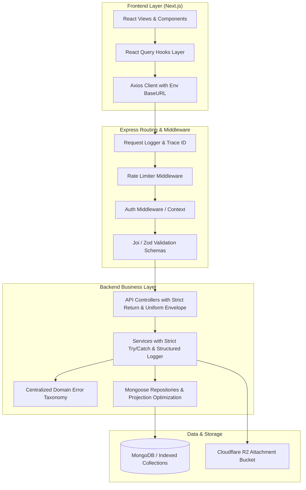
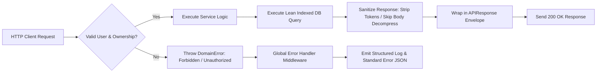
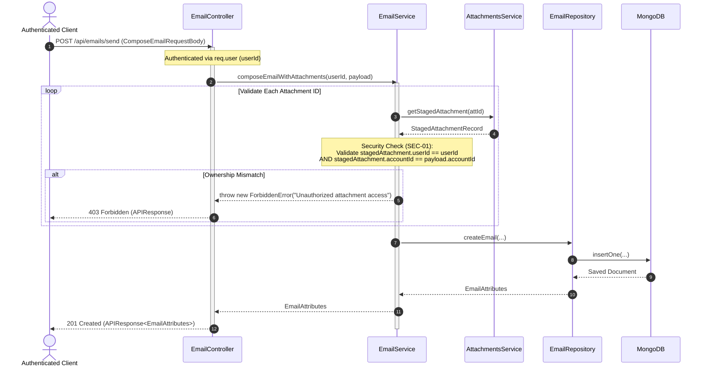
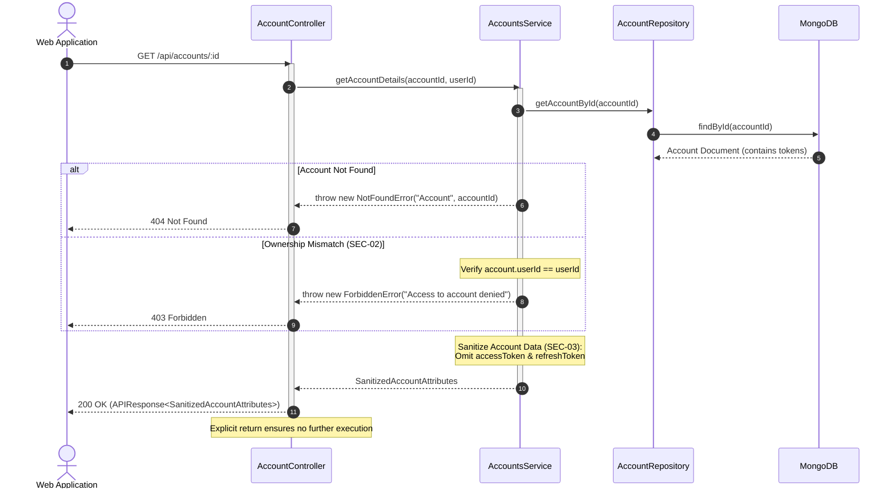
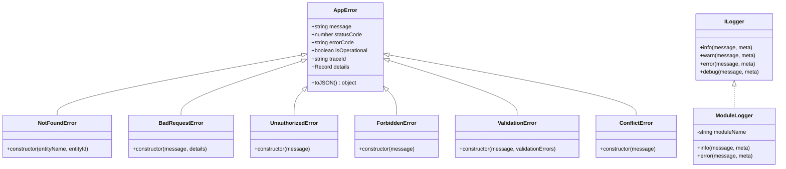
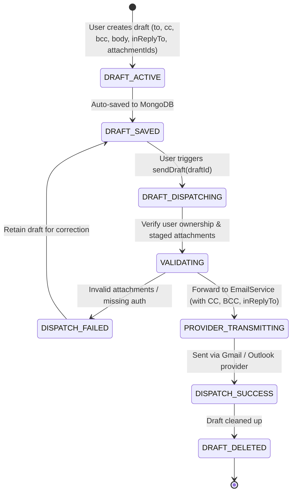

# Codebase Hardening & Stabilization — Implementation Plan

> **Phase:** Codebase Quality & Stabilization · **Release Target:** `Backend v3.3.0` / `Frontend v3.3.0` / `@mailsense/types v1.4.1`
> **Priority:** 🔴 HIGH — Resolves 12 active bugs, 3 critical security vulnerabilities, 14 exception handling/logging gaps, and implements high-impact feature enhancements before proceeding with AI modules.
> **Status:** IN PROGRESS
> **Created:** 2026-09-21 · **Last Updated:** 2026-09-24

---

## 1. Overview

### Problem Statement

The MailSense codebase features robust architectural foundations with provider strategy patterns, BullMQ background queues, and a comprehensive `AppError` hierarchy. However, an exhaustive codebase health audit across `@mailsense/types`, `Backend`, and `Frontend` surfaced several systemic flaws that undermine system reliability, security, and developer velocity:
1. **Critical Bugs & Security Vulnerabilities:** Commented-out attachment ownership validation permitting unauthorized file attachment access ([SEC-01](file:///Users/vishaljagamani/Projects/Projects/mailsense/Backend/src/modules/emails/email.service.ts#L432-L435)), missing user ownership checks on destructive account and email operations ([SEC-02](file:///Users/vishaljagamani/Projects/Projects/mailsense/Backend/src/modules/accounts/account.service.ts), [SEC-07](file:///Users/vishaljagamani/Projects/Projects/mailsense/Backend/src/modules/emails/email.service.ts#L464)), sensitive token leakage in account responses ([SEC-03](file:///Users/vishaljagamani/Projects/Projects/mailsense/Backend/src/modules/accounts/account.service.ts#L29)), broken folder search querying non-existent fields ([BUG-02](file:///Users/vishaljagamani/Projects/Projects/mailsense/Backend/src/modules/folders/folder.service.ts#L48)), broken pagination totals in email search ([BUG-04](file:///Users/vishaljagamani/Projects/Projects/mailsense/Backend/src/modules/emails/email.service.ts#L213)), missing `return` statements after early HTTP error responses ([BUG-06](file:///Users/vishaljagamani/Projects/Projects/mailsense/Backend/src/modules/emails/email.controller.ts#L93-L96), [BUG-07](file:///Users/vishaljagamani/Projects/Projects/mailsense/Backend/src/modules/accounts/account.controller.ts#L23)) that cause Node.js server crashes due to "headers already sent", and ID contract ambiguity ([BUG-10](file:///Users/vishaljagamani/Projects/Projects/mailsense/Backend/src/modules/emails/email.service.ts#L221-L223)) where frontend mixed provider IDs and MongoDB `_id` for emails (`providerMessageId` vs `_id`) and folders (`providerFolderId` vs `_id`), causing query mismatches and provider dispatch failures.
2. **Exception Handling & Observability Deficits:** Over 50 call-sites across the backend instantiate raw `throw new Error(...)` rather than domain-specific `AppError` subclasses (such as `NotFoundError`, `BadRequestError`, `UnauthorizedError`), stripping errors of structured error codes, trace IDs, and HTTP status codes. Most severely, [user.service.ts](file:///Users/vishaljagamani/Projects/Projects/mailsense/Backend/src/modules/user/user.service.ts) completely lacks `try / catch` blocks and structured logging across all 6 public methods.
3. **Architectural & Performance Inconsistencies:** The production frontend client uses a hardcoded `localhost:3000` auth URL ([BUG-05](file:///Users/vishaljagamani/Projects/Projects/mailsense/Frontend/src/shared/api/client.ts#L92-L95)), `sendDraft` drops CC/BCC/inReplyTo parameters ([BUG-09](file:///Users/vishaljagamani/Projects/Projects/mailsense/Backend/src/modules/drafts/draft.service.ts#L108-L113)), controllers return inconsistent response envelopes, and email listing suffers from eager decompression of bodies for all mailbox items ([PERF-04](file:///Users/vishaljagamani/Projects/Projects/mailsense/Backend/src/modules/emails/email.service.ts#L86-L88)).

### Goals

- **Remediate all 12 reported bugs** and eliminate all high-severity security vulnerabilities (tenant boundary isolation, token redaction, process crash prevention).
- **Enforce strict MongoDB `_id` exclusivity across Frontend UI**: Guarantee that Frontend components, hooks, tables, and dropdowns deal strictly with MongoDB `_id` for both emails (`email._id`) and folders (`folder._id`), while Backend services resolve `providerMessageId` and `providerFolderId` before invoking provider strategy adapters.
- **Enforce universal exception handling and observability standards**, wrapping 100% of methods with `try / catch` and migrating 50+ generic `throw new Error()` instances to strongly-typed `AppError` domain subclasses with contextual metadata.
- **Implement targeted enhancements and performance optimizations**, including standardized API response envelopes (`APIResponse<T>`), environmental config extraction, attachment request validation, list-view decompression optimization, and robust query index alignment.

### Non-Goals

- Building new net-new business modules (e.g., AI Foundation / Core AI module, Smart Categorization, Weekly Digest), which will commence immediately after this stabilization phase.
- Rearchitecting the database engine away from MongoDB / Mongoose or replacing BullMQ / Redis.
- Modifying UI design tokens or introducing external CSS frameworks.

### Background

This stabilization initiative represents a prerequisite quality milestone documented in the [Codebase Health Audit Report](file:///Users/vishaljagamani/Projects/Projects/mailsense/.agents/plans/codebase-health-audit-report.md). Hardening the foundation guarantees that AI background jobs, natural language queries, and real-time synchronization build upon a secure, leak-free, and observable system.

---

## 2. Requirements

### Functional Requirements

1. **FR-01 (Folder Search):** Folder search queries MUST filter against the `name` field using case-insensitive regex matching, deprecating invalid `subject`/`from` clauses.
2. **FR-02 (Email Search Pagination):** Email search pagination MUST calculate total matched documents via count query rather than returning current page array length.
3. **FR-03 (Draft Dispatch Fidelity):** Sending a draft MUST preserve and dispatch all draft attributes including `to`, `cc`, `bcc`, `inReplyTo`, and `attachmentIds`.
4. **FR-04 (Account Authorization):** Destructive or state-altering account actions (`deleteAccount`, `syncAccount`, `enableAccount`) MUST verify that the requesting authenticated `userId` matches the account's `userId`.
5. **FR-05 (Attachment Authorization):** Email dispatch with staged attachments MUST enforce that the requesting `userId` and `accountId` own each staged attachment reference.
6. **FR-06 (Token Confidentiality):** `getAccountDetails` and account listing endpoints MUST NOT expose `accessToken` or `refreshToken` fields in JSON payloads.
7. **FR-07 (Frontend Auth API Routing):** The frontend Auth0 API client MUST derive its `baseURL` from environment variables (`NEXT_PUBLIC_AUTH_API_URL` or standard API endpoint configuration), never from hardcoded `localhost` strings.
8. **FR-08 (API Envelope Uniformity):** All controller endpoints MUST return uniform response structures conforming to `APIResponse<T>` (`{ success: boolean; data: T; message?: string }`).
9. **FR-09 (MongoDB ID Exclusivity & Backend Resolution - Emails & Folders):** Frontend client APIs, tables, selection state, folder cards, dropdowns, and batch action mutations MUST exclusively reference MongoDB `_id` for both emails (`email._id`) and folders (`folder._id`). The backend service layer MUST resolve emails and folders by MongoDB `_id` and extract `providerMessageId` and `providerFolderId` internally before delegating to external providers (Gmail / Outlook).

### Non-Functional Requirements

- **NFR-01 (Crash Resilience):** Zero server crashes resulting from multiple headers dispatched on single HTTP exchanges.
- **NFR-02 (Standardized Logging):** 100% of service and controller catch blocks MUST emit structured log events containing module tag, method name, trace ID, and sanitized parameters.
- **NFR-03 (Type Safety):** 0 instances of `any`, `never`, or `unknown` (excluding external dynamic metadata objects) and zero inline types with $\ge 3$ keys across all modified code.
- **NFR-04 (Latency Optimization):** Email list queries MUST bypass compressed body decompression, reducing list endpoint execution time and memory footprint by $\ge 30\%$.

### Acceptance Criteria

- [ ] Attachment ownership check in `EmailService.composeEmailWithAttachments` is implemented *(temporarily commented out during local intermediate development; to be uncommented during full UI testing of this feature)*.
- [ ] Folder text search returns matching folders by name.
- [ ] Email search pagination displays accurate total pages and item counts for result sets $> 20$ items.
- [ ] `UserService` has complete `try / catch` coverage with structured logging across all 6 public methods.
- [ ] Zero instances of `throw new Error(...)` exist across `Backend/src/modules/`.
- [ ] `AccountController` and `EmailController` early error exits explicitly terminate with `return`.
- [ ] `getAccountDetails` returns sanitized `SanitizedAccountAttributes` without OAuth tokens.
- [ ] Frontend client exclusively uses MongoDB `_id` for email selection, detail views, and batch actions; Backend resolves `providerMessageId` from DB before calling provider APIs.
- [ ] Frontend client exclusively uses MongoDB `_id` for folder operations (MoveToFolder, FolderCard delete/rename, folder email list, inbox filters); Backend resolves `providerFolderId` from DB before calling provider APIs.
- [ ] `Frontend/src/shared/api/client.ts` uses configurable environment base URLs.
- [ ] Backend and Frontend builds pass cleanly with zero TypeScript errors.
- [ ] `Frontend/src/shared/api/client.ts` uses configurable environment base URLs.
- [ ] Backend and Frontend builds pass cleanly with zero TypeScript errors.

---

## 3. Design

### 3.1 High-Level Design

#### System Architecture Topology



#### End-to-End Data Flow & Pipeline



---

### 3.2 Low-Level Design

#### Sequence Diagram: Authorized Email Send with Attachment Validation



#### Sequence Diagram: Safe Account Retrieval with Token Stripping



#### Class & Interface Diagram: Domain Error Hierarchy & Observability



#### State Machine Diagram: Draft Sending Lifecycle with Comprehensive Fields



---

### 3.3 Data Models

#### Modified Mongoose Account Schema (`Backend/src/modules/accounts/account.model.ts`)

Enforce strict provider enum validation:

```typescript
import { Schema, model } from 'mongoose';
import { ACCOUNT_PROVIDER, ACCOUNT_LAST_SYNC_STATUS } from '@mailsense/types';

export const AccountSchema = new Schema(
    {
        userId: { type: String, required: true, index: true },
        email: { type: String, required: true },
        name: { type: String },
        provider: {
            type: String,
            enum: Object.values(ACCOUNT_PROVIDER),
            required: true,
        },
        accessToken: { type: String, required: true, select: false },
        refreshToken: { type: String, required: true, select: false },
        isEnabled: { type: Boolean, default: true },
        lastSyncedAt: { type: Date },
        lastSyncStatus: {
            type: String,
            enum: Object.values(ACCOUNT_LAST_SYNC_STATUS),
        },
        syncFrequency: { type: String, default: '15m' },
    },
    { timestamps: true }
);

AccountSchema.index({ userId: 1, email: 1 }, { unique: true });
```

#### Database Indexes Optimization (`Backend/src/modules/emails/email.model.ts`)

Add explicit compound indexes to optimize thread queries and chronological sorted list retrieval:

```typescript
EmailSchema.index({ accountId: 1, threadId: 1 });
EmailSchema.index({ accountId: 1, receivedAt: -1 });
EmailSchema.index({ userId: 1, receivedAt: -1 });
EmailSchema.index({ userId: 1, isRead: 1 });
```

---

### 3.4 API Contracts

| Method | Path | Request Body | Response Shape | Status | Description |
|---|---|---|---|---|---|
| `GET` | `/api/accounts/:id` | — | `APIResponse<SanitizedAccountAttributes>` | `200`, `401`, `403`, `404` | Get account details with stripped OAuth tokens |
| `DELETE` | `/api/accounts/:id` | — | `APIResponse<{ message: string }>` | `200`, `401`, `403`, `404` | Delete account with strict user ownership validation |
| `POST` | `/api/accounts/:id/sync` | — | `APIResponse<{ jobId: string }>` | `200`, `401`, `403`, `404` | Trigger account sync with user ownership validation |
| `GET` | `/api/folders` | Query: `accountId`, `searchText`, `page`, `limit` | `APIResponse<PaginatedDataResponse<FolderAttributes>>` | `200`, `400`, `401` | List folders filtering `name` by regex with valid page index |
| `GET` | `/api/emails/search` | Query: `query`, `page`, `limit`, `accountId` | `APIResponse<PaginatedDataResponse<EmailAttributes>>` | `200`, `400`, `401` | Search emails with accurate `total` count |
| `POST` | `/api/emails/send` | `ComposeEmailRequestBody` | `APIResponse<EmailAttributes>` | `201`, `400`, `401`, `403` | Send email verifying attachment ownership |
| `POST` | `/api/drafts/:id/send` | — | `APIResponse<SendDraftResponse>` | `200`, `400`, `401`, `404` | Send draft forwarding `to`, `cc`, `bcc`, `inReplyTo` |
| `PUT` | `/api/emails/move` | `MoveEmailsRequestBody` | `APIResponse<{ modifiedCount: number }>` | `200`, `400`, `401`, `403` | Move emails verifying caller owns the target emails |

---

### 3.5 State Management

| Feature | Query Key Factory | Invalidation Trigger | Invalidation Target |
|---|---|---|---|
| Accounts | `['accounts', 'list', userId]` | `deleteAccount`, `enableAccount` | Invalidate `['accounts']` |
| Account Details | `['accounts', 'detail', accountId]` | `updateSyncSettings` | Invalidate `['accounts', 'detail', accountId]` |
| Folders | `['folders', accountId, { searchText, page }]` | `createFolder`, `renameFolder`, `deleteFolder` | Invalidate `['folders', accountId]` |
| Emails Search | `['emails', 'search', { query, accountId, page }]` | Bulk actions (`delete`, `archive`, `move`) | Invalidate `['emails']` |
| Drafts | `['drafts', userId, accountId]` | `sendDraft`, `saveDraft`, `deleteDraft` | Invalidate `['drafts']`, `['emails']` |

---

## 4. Proposed Changes

### Backend

#### [MODIFY] [email.repository.ts](file:///Users/vishaljagamani/Projects/Projects/mailsense/Backend/src/modules/emails/email.repository.ts)
- Add `EmailRepository.getEmailsByIds(emailIds, fields)` to query records by MongoDB `_id` (`{ _id: { $in: emailIds } }`) ([BUG-10](file:///Users/vishaljagamani/Projects/Projects/mailsense/Backend/src/modules/emails/email.repository.ts)).
- Add `EmailRepository.countDocuments(searchQuery)` for accurate pagination counting.

#### [MODIFY] [email.service.ts](file:///Users/vishaljagamani/Projects/Projects/mailsense/Backend/src/modules/emails/email.service.ts)
- Uncomment and activate attachment ownership check in `composeEmailWithAttachments()` ([BUG-03](file:///Users/vishaljagamani/Projects/Projects/mailsense/Backend/src/modules/emails/email.service.ts#L432-L435), SEC-01).
- Fix `searchEmails` total count to run `EmailRepository.countDocuments(searchQuery)` instead of `emails.length` ([BUG-04](file:///Users/vishaljagamani/Projects/Projects/mailsense/Backend/src/modules/emails/email.service.ts#L213)).
- In `getAllEmails`, cache `getDateRange()` result to eliminate duplicate invocation ([PERF-03](file:///Users/vishaljagamani/Projects/Projects/mailsense/Backend/src/modules/emails/email.service.ts#L67-L70)).
- In email list retrieval, skip body decompression unless full body is explicitly requested ([PERF-04](file:///Users/vishaljagamani/Projects/Projects/mailsense/Backend/src/modules/emails/email.service.ts#L86-L88)).
- Add ownership check to `moveEmails` ensuring target emails belong to `userId` (SEC-07).
- Fix BUG-10: In `deleteEmail`, `archiveEmails`, `starEmails`, `unreadEmails`, and `moveEmails`, resolve emails via `EmailRepository.getEmailsByIds(emailIds)` using MongoDB `_id`, extract `email.providerMessageId`, and dispatch to provider strategy adapters.
- Migrate all `throw new Error()` instances to `NotFoundError`, `BadRequestError`, `ForbiddenError`.

#### [MODIFY] [email.controller.ts](file:///Users/vishaljagamani/Projects/Projects/mailsense/Backend/src/modules/emails/email.controller.ts)
- Add explicit `return` statement after `res.status(400)` in `searchEmails` ([BUG-06](file:///Users/vishaljagamani/Projects/Projects/mailsense/Backend/src/modules/emails/email.controller.ts#L93-L96)).
- Wrap all responses in standardized `APIResponse<T>` envelopes.

#### [MODIFY] [account.controller.ts](file:///Users/vishaljagamani/Projects/Projects/mailsense/Backend/src/modules/accounts/account.controller.ts)
- Add explicit `return` statement after `res.status(404)` in `getAccountDetails` ([BUG-07](file:///Users/vishaljagamani/Projects/Projects/mailsense/Backend/src/modules/accounts/account.controller.ts#L23)).
- Ensure uniform envelope response formatting.

#### [MODIFY] [account.service.ts](file:///Users/vishaljagamani/Projects/Projects/mailsense/Backend/src/modules/accounts/account.service.ts)
- Validate user ownership (`account.userId === userId`) in `deleteAccount`, `syncAccount`, `enableAccount` (SEC-02).
- Strip `accessToken` and `refreshToken` before returning account details in `getAccountDetails` and `getAccounts` (SEC-03).
- Replace `Object.assign(new Error(...))` pattern in `syncAccount` with `NotFoundError` ([BUG-08](file:///Users/vishaljagamani/Projects/Projects/mailsense/Backend/src/modules/accounts/account.service.ts#L214-L228)).
- Migrate all `throw new Error()` instances to domain error classes.

#### [MODIFY] [folder.repository.ts](file:///Users/vishaljagamani/Projects/Projects/mailsense/Backend/src/modules/folders/folder.repository.ts)
- Add `FolderRepository.getFoldersByIds(folderIds: string[])` to query folders by MongoDB `_id` (`{ _id: { $in: folderIds } }`).
- Add `FolderRepository.updateFolder(folderId: string, folder: Partial<FolderDocument>)` to update by MongoDB `_id` (`findByIdAndUpdate`).
- Add `FolderRepository.deleteFolder(folderId: string)` to delete by MongoDB `_id` (`findByIdAndDelete`).

#### [MODIFY] [folder.service.ts](file:///Users/vishaljagamani/Projects/Projects/mailsense/Backend/src/modules/folders/folder.service.ts)
- Correct text search filter from `{ subject: ..., from: ... }` to `{ name: { $regex: searchText, $options: 'i' } }` ([BUG-02](file:///Users/vishaljagamani/Projects/Projects/mailsense/Backend/src/modules/folders/folder.service.ts#L48)).
- Return actual `page` parameter instead of hardcoded `page: 1` ([BUG-11](file:///Users/vishaljagamani/Projects/Projects/mailsense/Backend/src/modules/folders/folder.service.ts#L62)).
- Enforce MongoDB `_id` boundary: in `updateFolder` and `deleteFolder`, look up the folder by MongoDB `_id` (`FolderRepository.getFolder`), resolve `folder.providerFolderId`, invoke provider method with `providerFolderId`, and synchronize database state (`FolderRepository.updateFolder` / `FolderRepository.deleteFolder`).
- Migrate `throw new Error()` calls to domain errors (`NotFoundError`, `BadRequestError`).

#### [MODIFY] [draft.service.ts](file:///Users/vishaljagamani/Projects/Projects/mailsense/Backend/src/modules/drafts/draft.service.ts)
- Forward `cc`, `bcc`, `inReplyTo`, and `attachmentIds` when dispatching email in `sendDraft()` ([BUG-09](file:///Users/vishaljagamani/Projects/Projects/mailsense/Backend/src/modules/drafts/draft.service.ts#L108-L113)).
- Migrate `throw new Error()` calls to domain errors.

#### [MODIFY] [user.service.ts](file:///Users/vishaljagamani/Projects/Projects/mailsense/Backend/src/modules/user/user.service.ts)
- Add comprehensive `try / catch` blocks to all 6 methods (`getUser`, `updateUser`, `getUserProfile`, `changePassword`, `getUserSettings`, `updateUserSettings`).
- Initialize `createLogger(LOGGER_MODULE.USER_SERVICE)` and emit structured logs for failures and mutations.
- Migrate raw errors to `NotFoundError`, `BadRequestError`, and `UnauthorizedError`.

#### [NEW] [attachment.schema.ts](file:///Users/vishaljagamani/Projects/Projects/mailsense/Backend/src/modules/attachments/attachment.schema.ts)
- Define Joi / Zod validation schemas for attachment upload and staged attachment queries (ENH-14).

#### [MODIFY] [attachment.routes.ts](file:///Users/vishaljagamani/Projects/Projects/mailsense/Backend/src/modules/attachments/attachment.routes.ts)
- Attach request validation middleware using `attachment.schema.ts`.

---

### Frontend

#### [MODIFY] [client.ts](file:///Users/vishaljagamani/Projects/Projects/mailsense/Frontend/src/shared/api/client.ts)
- Replace hardcoded `http://localhost:3000/auth` with `process.env.NEXT_PUBLIC_AUTH_API_URL || '/api/auth'` ([BUG-05](file:///Users/vishaljagamani/Projects/Projects/mailsense/Frontend/src/shared/api/client.ts#L92-L95)).

#### [MODIFY] [EmailListTable.tsx](file:///Users/vishaljagamani/Projects/Projects/mailsense/Frontend/src/features/inbox/components/EmailListTable.tsx)
- Enforce strict MongoDB `_id` usage: replace all instances of `email.providerMessageId` in row selection, checkbox keys, and trash actions with `email._id` ([BUG-10](file:///Users/vishaljagamani/Projects/Projects/mailsense/Frontend/src/features/inbox/components/EmailListTable.tsx)).
- Fix table row DOM element attribute `id={email._id}` instead of `id={email.providerMessageId}`.

#### [MODIFY] [useEmailsPage.ts](file:///Users/vishaljagamani/Projects/Projects/mailsense/Frontend/src/features/emails/hooks/useEmailsPage.ts)
- Replace `emailData?.providerMessageId` with `emailData?._id` in `unreadEmail` mutation call ([BUG-10](file:///Users/vishaljagamani/Projects/Projects/mailsense/Frontend/src/features/emails/hooks/useEmailsPage.ts)).

#### [MODIFY] [index.tsx](file:///Users/vishaljagamani/Projects/Projects/mailsense/Frontend/src/features/emails/pages/index.tsx)
- Pass `emailId={emailData?._id || ''}` to `ThreadView` instead of `providerMessageId` ([BUG-10](file:///Users/vishaljagamani/Projects/Projects/mailsense/Frontend/src/features/emails/pages/index.tsx)).

#### [MODIFY] [MoveToFolderDropdown.tsx](file:///Users/vishaljagamani/Projects/Projects/mailsense/Frontend/src/features/emails/components/MoveToFolderDropdown.tsx)
- Cleanly filter `allEmails` strictly using `email._id` ([BUG-10](file:///Users/vishaljagamani/Projects/Projects/mailsense/Frontend/src/features/emails/components/MoveToFolderDropdown.tsx)).
- Pass canonical MongoDB `folder._id` to `handleSelectFolder` instead of `folder.providerFolderId`.

#### [MODIFY] [FolderCardHeader.tsx](file:///Users/vishaljagamani/Projects/Projects/mailsense/Frontend/src/features/folders/components/folder-card/FolderCardHeader.tsx)
- Pass canonical `data._id` to `handleUpdateFolder` instead of `data.providerFolderId`.

#### [MODIFY] [FolderCardActions.tsx](file:///Users/vishaljagamani/Projects/Projects/mailsense/Frontend/src/features/folders/components/folder-card/FolderCardActions.tsx)
- Pass canonical `data._id` to `deleteFolder` instead of `data.providerFolderId`.

#### [MODIFY] [FolderCard.tsx](file:///Users/vishaljagamani/Projects/Projects/mailsense/Frontend/src/features/folders/components/body/FolderCard.tsx)
- Pass `data._id` to `handleUpdateFolder` and `deleteFolder` instead of `data.providerFolderId`.

#### [MODIFY] [useFolderEmailListPage.ts](file:///Users/vishaljagamani/Projects/Projects/mailsense/Frontend/src/features/folders/hooks/useFolderEmailListPage.ts)
- Pass `folders: folder?._id ? [folder._id] : undefined` in `refetchEmails` filters instead of `folder.providerFolderId`.

#### [MODIFY] [useInboxPage.ts](file:///Users/vishaljagamani/Projects/Projects/mailsense/Frontend/src/features/inbox/hooks/useInboxPage.ts)
- Set dropdown filter option `name: folder.id` instead of `name: folder.providerFolderId`.

#### [MODIFY] [folders.api.ts](file:///Users/vishaljagamani/Projects/Projects/mailsense/Frontend/src/features/folders/api/folders.api.ts) & [emails.api.ts](file:///Users/vishaljagamani/Projects/Projects/mailsense/Frontend/src/features/emails/api/emails.api.ts)
- Align request payloads with updated sanitized account contracts and query params.

---

## 5. Implementation Phases

### Phase 1: Bugs (Defect Remediation & Security Hotfixes)

**Objective:** Eliminate all 12 reported bugs, server crash hazards, critical security vulnerabilities, and enforce MongoDB `_id` boundary for both emails and folders across Backend and Frontend.
**Estimated Effort:** High

#### Tasks

- [x] Apply shared types changes from [types-implementation-plan.md](file:///Users/vishaljagamani/Projects/Projects/mailsense/.agents/plans/codebase-hardening-and-stabilization/types-implementation-plan.md) (Completed & deployed in `@mailsense/types@1.4.1`).
- [x] Fix BUG-03 / SEC-01: Attachment ownership validation in [email.service.ts](file:///Users/vishaljagamani/Projects/Projects/mailsense/Backend/src/modules/emails/email.service.ts) *(Note: Lines 479-482 temporarily commented out during local intermediate development; to be uncommented during full UI testing of this feature).*
- [x] Fix BUG-06: Add `return` statement following 400 error in `searchEmails` in [email.controller.ts](file:///Users/vishaljagamani/Projects/Projects/mailsense/Backend/src/modules/emails/email.controller.ts).
- [x] Fix BUG-07: Add `return` statement following 404 response in `getAccountDetails` in [account.controller.ts](file:///Users/vishaljagamani/Projects/Projects/mailsense/Backend/src/modules/accounts/account.controller.ts).
- [x] Fix SEC-02: Add caller `userId` validation to `deleteAccount`, `syncAccount`, and `enableAccount` in [account.service.ts](file:///Users/vishaljagamani/Projects/Projects/mailsense/Backend/src/modules/accounts/account.service.ts).
- [x] Fix SEC-03: Strip `accessToken` and `refreshToken` in `getAccountDetails` and `getAccounts` responses in [account.service.ts](file:///Users/vishaljagamani/Projects/Projects/mailsense/Backend/src/modules/accounts/account.service.ts).
- [x] Fix SEC-07: Verify caller ownership of emails before performing `moveEmails` in [email.service.ts](file:///Users/vishaljagamani/Projects/Projects/mailsense/Backend/src/modules/emails/email.service.ts).
- [x] Fix BUG-02: Update folder search in [folder.service.ts](file:///Users/vishaljagamani/Projects/Projects/mailsense/Backend/src/modules/folders/folder.service.ts) to match against `name`.
- [x] Fix BUG-04: Fix `searchEmails` pagination total count calculation in [email.service.ts](file:///Users/vishaljagamani/Projects/Projects/mailsense/Backend/src/modules/emails/email.service.ts).
- [x] Fix BUG-05: Replace hardcoded `localhost:3000` auth URL in [client.ts](file:///Users/vishaljagamani/Projects/Projects/mailsense/Frontend/src/shared/api/client.ts).
- [x] Fix BUG-08: Replace `Object.assign(new Error(...))` in [account.service.ts](file:///Users/vishaljagamani/Projects/Projects/mailsense/Backend/src/modules/accounts/account.service.ts) with `NotFoundError`.
- [x] Fix BUG-09: Forward `cc`, `bcc`, `inReplyTo`, and `attachmentIds` in `sendDraft` in [draft.service.ts](file:///Users/vishaljagamani/Projects/Projects/mailsense/Backend/src/modules/drafts/draft.service.ts).
- [x] Fix BUG-10: Enforce MongoDB `_id` exclusivity for Emails across Frontend (`EmailListTable`, `useEmailsPage`, `pages/index.tsx`, `MoveToFolderDropdown`), and implement `EmailRepository.getEmailsByIds` in Backend to resolve `providerMessageId` before provider dispatch.
- [x] Fix BUG-11: Return actual `page` parameter in `getAllFolders` in [folder.service.ts](file:///Users/vishaljagamani/Projects/Projects/mailsense/Backend/src/modules/folders/folder.service.ts).
- [x] Fix BUG-12: Enforce MongoDB `_id` exclusivity for Folders across Frontend (`MoveToFolderDropdown`, `FolderCardHeader`, `FolderCardActions`, `FolderCard`, `useFolderEmailListPage`, `useInboxPage`), and implement folder ID to `providerFolderId` resolution in Backend (`FolderRepository`, `FolderService.updateFolder`, `FolderService.deleteFolder`, `EmailService.moveEmails`, `EmailService.getEmails`).

#### Files to Modify

- `Backend/src/modules/emails/email.repository.ts`
- `Backend/src/modules/emails/email.service.ts`
- `Backend/src/modules/emails/email.controller.ts`
- `Backend/src/modules/accounts/account.service.ts`
- `Backend/src/modules/accounts/account.controller.ts`
- `Backend/src/modules/folders/folder.repository.ts`
- `Backend/src/modules/folders/folder.service.ts`
- `Backend/src/modules/drafts/draft.service.ts`
- `Frontend/src/config/config.ts`
- `Frontend/src/shared/api/client.ts`
- `Frontend/src/features/inbox/components/EmailListTable.tsx`
- `Frontend/src/features/inbox/hooks/useInboxPage.ts`
- `Frontend/src/features/emails/hooks/useEmailsPage.ts`
- `Frontend/src/features/emails/pages/index.tsx`
- `Frontend/src/features/emails/components/MoveToFolderDropdown.tsx`
- `Frontend/src/features/folders/hooks/useFolderEmailListPage.ts`
- `Frontend/src/features/folders/components/folder-card/FolderCardHeader.tsx`
- `Frontend/src/features/folders/components/folder-card/FolderCardActions.tsx`
- `Frontend/src/features/folders/components/body/FolderCard.tsx`

#### Acceptance Criteria

1. Folder text search returns folders containing the queried substring in their name.
2. An attempt to compose an email using another user's staged attachment yields an explicit 403 Forbidden.
3. Accessing account details yields `SanitizedAccountAttributes` without OAuth credentials.
4. Calling `searchEmails` or `getAccountDetails` with invalid arguments triggers proper error status without header crash.
5. Sending a draft with CC and BCC preserves all recipients on the sent message.

---

### Phase 2: Exception Handling & Logging Audit

**Objective:** Audit and remediate all exception handling gaps, ensuring 100% try/catch coverage, structured logger usage, and migration of 50+ generic errors to domain error classes.
**Estimated Effort:** Medium

#### Tasks

- [x] Implement `try / catch` blocks and structured logging across all 6 methods in [user.service.ts](file:///Users/vishaljagamani/Projects/Projects/mailsense/Backend/src/modules/user/user.service.ts):
  - [x] `getUser`
  - [x] `updateUser`
  - [x] `getUserProfile`
  - [x] `changePassword`
  - [x] `getUserSettings`
  - [x] `updateUserSettings`
- [x] Audit and migrate 50+ instances of `throw new Error(...)` to domain errors:
  - [x] [email.service.ts](file:///Users/vishaljagamani/Projects/Projects/mailsense/Backend/src/modules/emails/email.service.ts): `NotFoundError('Email', ...)`, `BadRequestError(...)`, and `ForbiddenError(...)`
  - [x] [account.service.ts](file:///Users/vishaljagamani/Projects/Projects/mailsense/Backend/src/modules/accounts/account.service.ts): `NotFoundError('Account', ...)`, `BadRequestError(...)`, and `UnauthorizedError(...)`
  - [x] [folder.service.ts](file:///Users/vishaljagamani/Projects/Projects/mailsense/Backend/src/modules/folders/folder.service.ts): `NotFoundError('Folder', ...)`, `NotFoundError('Account', ...)`, and `ForbiddenError(...)`
  - [x] [draft.service.ts](file:///Users/vishaljagamani/Projects/Projects/mailsense/Backend/src/modules/drafts/draft.service.ts): `NotFoundError('Draft', ...)` and `ForbiddenError(...)`
  - [x] [attachment.service.ts](file:///Users/vishaljagamani/Projects/Projects/mailsense/Backend/src/modules/attachments/attachment.service.ts): `NotFoundError('Attachment', ...)` and `ForbiddenError(...)`
  - [x] [analytics.service.ts](file:///Users/vishaljagamani/Projects/Projects/mailsense/Backend/src/modules/analytics/analytics.service.ts): `ForbiddenError(...)`
- [x] Verify global error handler captures domain errors and properly serializes status code, error code, and trace ID.
- [x] Standardize frontend API client error unwrapping to consistently expose backend `errorCode` and `message` to React Query error boundaries.

#### Files to Modify

- `Backend/src/modules/user/user.service.ts`
- `Backend/src/modules/emails/email.service.ts`
- `Backend/src/modules/accounts/account.service.ts`
- `Backend/src/modules/folders/folder.service.ts`
- `Backend/src/modules/drafts/draft.service.ts`
- `Backend/src/modules/attachments/attachment.service.ts`
- `Backend/src/modules/analytics/analytics.service.ts`
- `Frontend/src/shared/api/errors.ts`

#### Acceptance Criteria

1. All 6 methods in `UserService` log operations with `LOGGER_MODULE.USER_SERVICE` and wrap external calls in `try / catch`.
2. Zero occurrences of `throw new Error(...)` remain in `Backend/src/modules/`.
3. Client receives well-structured error bodies conforming to `ErrorResponse` with appropriate HTTP status codes (400, 401, 403, 404).

---

### Phase 3: Modifications & Enhancements

**Objective:** Implement performance optimizations, response envelope standardizations, validation schemas, and database index enhancements.
**Estimated Effort:** Medium

#### Tasks

- [ ] Standardize controller response envelopes across all modules to strictly return `APIResponse<T>`.
- [ ] Create validation schemas for attachments in `Backend/src/modules/attachments/attachment.schema.ts` and bind to routes.
- [ ] Optimize email list queries in [email.service.ts](file:///Users/vishaljagamani/Projects/Projects/mailsense/Backend/src/modules/emails/email.service.ts) by skipping unneeded body decompression for overview listings.
- [ ] Cache duplicate `getDateRange()` calculations in [email.service.ts](file:///Users/vishaljagamani/Projects/Projects/mailsense/Backend/src/modules/emails/email.service.ts).
- [ ] Add explicit database compound indexes on `Email` schema (`{ accountId: 1, threadId: 1 }`, `{ accountId: 1, receivedAt: -1 }`).
- [ ] Enforce Mongoose schema enum validation for `ACCOUNT_PROVIDER` on `Account` model.
- [ ] Standardize React Query key factories across frontend features for unified cache management.

#### Files to Create

- `Backend/src/modules/attachments/attachment.schema.ts`

#### Files to Modify

- `Backend/src/modules/accounts/account.model.ts`
- `Backend/src/modules/accounts/account.controller.ts`
- `Backend/src/modules/emails/email.model.ts`
- `Backend/src/modules/emails/email.controller.ts`
- `Backend/src/modules/emails/email.service.ts`
- `Backend/src/modules/attachments/attachment.routes.ts`
- `Frontend/src/features/emails/api/emails.queries.ts`

#### Acceptance Criteria

1. List emails endpoint returns without decompressing full bodies, verified via performance benchmarking.
2. Attachment routes reject missing or malformed input with 400 Bad Request via schema validation.
3. All controllers emit uniform `{ success: true, data: T, message?: string }` responses.
4. Database queries on threads and sorted email lists utilize compound indexes.

---

## 6. Dependencies & Constraints

### Infrastructure Requirements

- MongoDB 6.0+ supporting compound indexes.
- Redis 7.0+ for BullMQ background workers.
- R2 / S3 storage for staged attachments.

### Existing Dependencies (Leveraged)

| Dependency | Purpose |
|---|---|
| `@mailsense/types` | Shared contracts, updated to `v1.4.1` per types plan |
| `winston` | Structured logging via existing `createLogger` factory |
| `express-validator` / `joi` | Schema validation for attachment endpoints |
| `axios` | Frontend API client |

### Constraints

- Zero breaking changes for existing connected user email accounts.
- Zero downtime during database compound index creation (use background index build if in production).

---

## 7. Risk Assessment & Mitigation

| Risk | Impact | Likelihood | Mitigation |
|---|---|---|---|
| Stripping tokens breaks legacy backend callers | HIGH | LOW | Internal workers access repository models directly; only public HTTP controllers return sanitized DTOs |
| Attachment ownership check blocks legitimate shared draft attachments | MEDIUM | LOW | Staged attachments are inherently user-scoped; drafts reference staged files created by the same user |
| Standardizing response envelopes breaks frontend components expecting raw payloads | HIGH | MEDIUM | Interceptor in `Frontend/src/shared/api/client.ts` already unwraps `response.data`; verify all queries handle `APIResponse<T>` |
| Skipping list view body decompression causes blank snippets in email list | HIGH | LOW | Ensure preview `snippet` field is populated during sync and retained in email list projection |

---

## 8. Verification Plan

### Automated Tests

```bash
# Verify shared types contract build
cd /Users/vishaljagamani/Projects/Projects/mailsense-types && pnpm build

# Verify Backend compilation and type safety
cd /Users/vishaljagamani/Projects/Projects/mailsense/Backend && pnpm build

# Verify Frontend compilation and type safety
cd /Users/vishaljagamani/Projects/Projects/mailsense/Frontend && npx tsc --noEmit
```

#### Unit & Integration Test Scenarios

| Area | Test Case | Expected Result |
|---|---|---|
| Security | Send email with foreign staged attachment ID | HTTP 403 Forbidden with `Unauthorized attachment access` |
| Security | Call `deleteAccount` with mismatched `userId` | HTTP 403 Forbidden |
| Security | Fetch account via `getAccountDetails` | Response contains no `accessToken` or `refreshToken` |
| Folders | Search folder with query string `Archive` | Returns matching folders via `{ name: { $regex: 'Archive', $options: 'i' } }` |
| Search | Search emails with pagination (`page=1`, `limit=10`) | `total` reflects full database match count, not page length |
| Drafts | Send draft with CC and BCC recipients | Forwarded email payload contains all `cc` and `bcc` addresses |
| Controllers | Invoke `searchEmails` with missing `userId` | Responds with 400 Bad Request once without server header exception |
| User Service | Call `changePassword` when Auth0 encounters network timeout | Throws typed domain error, logs structured error with `LOGGER_MODULE.USER_SERVICE` |

### Manual Verification

- [ ] Perform folder search from UI sidebar filter input and confirm instant match results.
- [ ] Connect account, inspect network tab on `/api/accounts/:id`, and verify no OAuth credentials appear in payload.
- [ ] Compose message with attached files, send, and confirm attachments appear in sent thread.
- [ ] Create draft with CC/BCC, dispatch, and check recipient headers.

---

## 9. Open Questions & Decisions

> [!NOTE]
> **Q1: Envelope Unwrapping in Frontend Axios Client**
> Should the frontend Axios response interceptor automatically unwrap `response.data.data` or should React Query hooks consume `APIResponse<T>` explicitly?
> - **Recommendation:** Keep the Axios interceptor returning `response.data` so React Query hooks cleanly receive `APIResponse<T>` and access `.data`, ensuring predictable metadata inspection (`success`, `message`).

### Resolved Decisions

| Decision | Resolution | Date |
|---|---|---|
| Public Account DTO Token Stripping | Enforce `SanitizedAccountAttributes` in controller layer; keep Mongoose model queries explicit with `.select('-accessToken -refreshToken')` | 2026-09-21 |
| Folder Search Target | Search strictly against `name` field using case-insensitive regex | 2026-09-21 |
| UserService Exception Standard | Wrap all 6 public methods in `try / catch` with `LOGGER_MODULE.USER_SERVICE` logger | 2026-09-21 |
