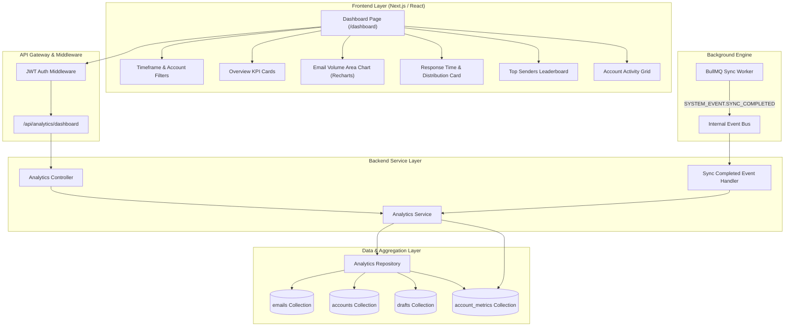
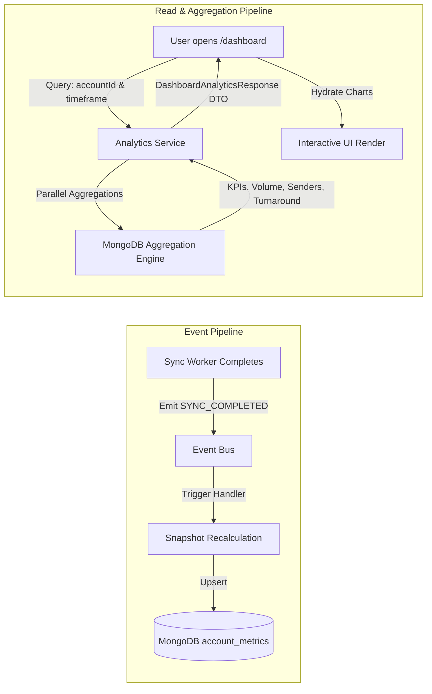
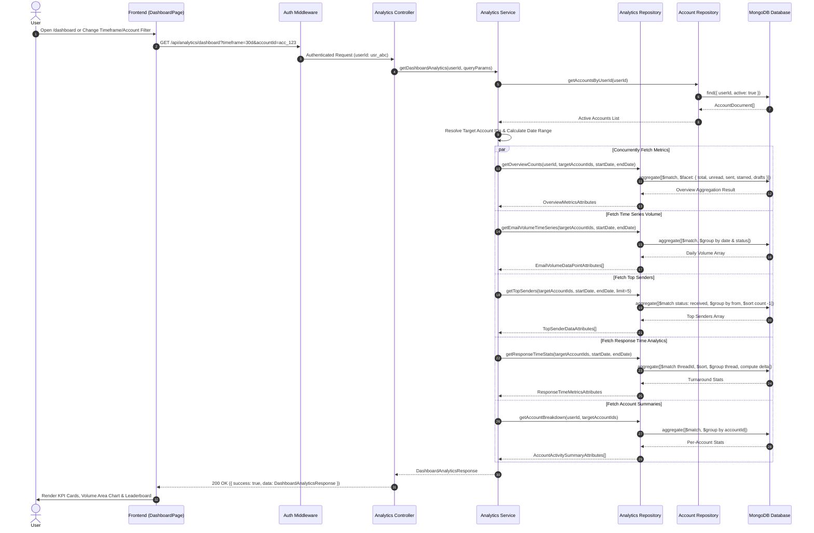
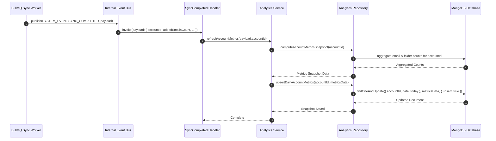
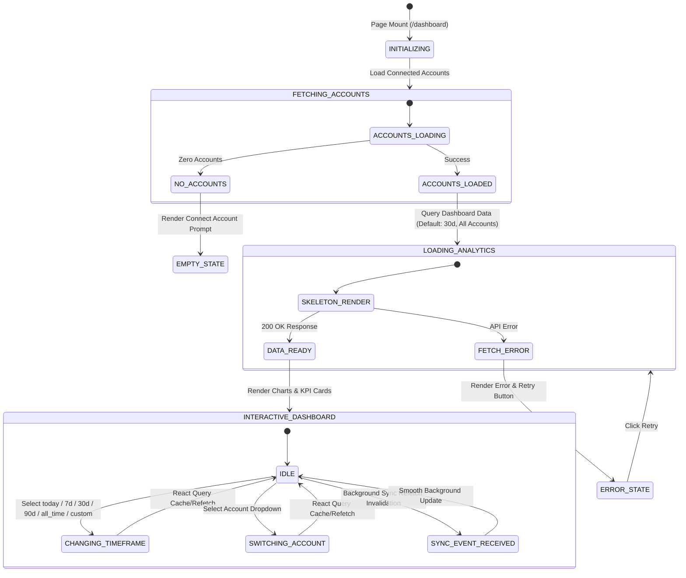

# Dashboard & Analytics — Implementation Plan

> **Phase:** Phase 2 (from MailSense Development Roadmap) · **Release Target:** v3.1.0
> **Priority:** 🟡 MEDIUM — High-impact overview, metrics collection & productivity analytics
> **Status:** DRAFT
> **Created:** 2026-08-29 · **Last Updated:** 2026-08-30

---

## 1. Overview

### Problem Statement

With the completion and deployment of the Email Experience features (v3.0.0 — Thread View, Attachments, Drafts, Folder Relocation), users have a fully capable email client. However, MailSense currently lacks a centralized **Dashboard & Analytics** workspace. Users currently have no bird's-eye view of their cross-mailbox activity, incoming vs. outgoing email volume trends, contact communication patterns, turnaround response time metrics, or mailbox health status. 

Furthermore, while the event-driven background sync engine publishes `SYSTEM_EVENT.SYNC_COMPLETED` events, account-level metrics snapshots are not yet populated or aggregated for real-time reporting.

### Goals

- Implement an end-to-end **Dashboard & Analytics** system that provides unified and per-account email productivity metrics.
- Build high-performance backend aggregation pipelines in a dedicated `analytics` module (`Overview KPIs`, `Email Volume Time-Series`, `Top Senders Leaderboard`, `Thread Response Time Analytics`, and `Account Activity Summaries`) adhering strictly to the `*Attributes` naming convention.
- Integrate the event bus by subscribing to `SYSTEM_EVENT.SYNC_COMPLETED` events to maintain up-to-date `AccountMetrics` snapshots in MongoDB.
- Deliver a modern, visually stunning React dashboard experience with rich data charts (using `recharts`), customizable timeframes (`today`, `7d`, `30d`, `90d`, `this_month`, `1y`, `all_time`, `custom`), account filtering, skeleton states, and responsive layouts.
- Integrate Dashboard navigation smoothly into the primary sidebar and route hierarchy.

### Non-Goals

- Real-time WebSocket streaming for analytics (HTTP polling & React Query cache invalidation upon background sync completion are sufficient and resource-conscious).
- Machine-learning classification or AI insights (deferred to Phase 3: AI Foundation & Core AI).
- Cross-user organization-wide analytics (MailSense metrics remain strictly isolated to the authenticated user).

### Background

This implementation builds upon the BullMQ + Redis background sync architecture (v2.1.0) and the rich data schemas established in v3.0.0. The `Email` collection already indexes `threadId`, `accountId`, `receivedAt`, `isRead`, `isStarred`, and `folders`. The `AccountMetrics` model already exists in the backend database schema. This phase activates and exposes these data streams into an actionable, delightful user interface.

---

## 2. Requirements

### Functional Requirements

1. **FR-01 (Overview KPI Cards):** Users can view high-level summary cards showing Total Emails, Unread Count, Sent Count, Starred Emails, Drafts, and Active Mailboxes with period-over-period percentage indicators.
2. **FR-02 (Email Volume Trend Chart):** Users can analyze daily/weekly email volume patterns with a responsive dual-area/bar chart comparing Received vs. Sent messages over the selected timeframe.
3. **FR-03 (Top Senders Leaderboard):** Users can view their most frequent contacts and domains, including email count, volume percentage of total incoming mail, and last received timestamp.
4. **FR-04 (Response Time Analytics):** Users can track their email responsiveness, including average and median reply times, overall response rate percentage, and distribution buckets (`<1h`, `1–4h`, `4–24h`, `>24h`).
5. **FR-05 (Account Breakdown Grid):** Users can view and compare mailbox-level statistics (total messages, unread count, sync status, and last synced timestamp) with direct jump links to each mailbox.
6. **FR-06 (Timeframe & Account Filtering):** Users can dynamically filter all dashboard metrics across "All Accounts" (Unified) or a specific connected account, as well as by standard time ranges (`today`, `7d`, `30d`, `90d`, `this_month`, `1y`, `all_time`, `custom`).

### Non-Functional Requirements

- **NFR-01 (Query Latency):** All dashboard aggregation endpoints must complete execution in $< 100\text{ms}$ for mailboxes with up to 50,000 emails by leveraging targeted MongoDB compound indexes.
- **NFR-02 (Memory Overhead):** Aggregation pipelines must execute streaming `$facet` and `$group` operations within database engine memory, avoiding server-side buffering to adhere to the 256MB RAM cap.
- **NFR-03 (Client Responsiveness):** Dashboard charts must render smoothly without UI jank, reflow cleanly across mobile and desktop breakpoints, and preserve dark/light theme aesthetics.

### Acceptance Criteria

- [ ] `GET /api/analytics/dashboard` returns full analytics payload conforming to `DashboardAnalyticsResponse`.
- [ ] `AccountMetrics` snapshots update automatically whenever `SYNC_COMPLETED` events are processed.
- [ ] Changing timeframe or account selector in UI updates all dashboard charts and metric cards without full-page reloads.
- [ ] Dashboard is accessible via `/dashboard` and listed as a primary navigation item in the sidebar.
- [ ] Skeletons display during data fetch; empty states render gracefully when no accounts or emails exist.

---

## 3. Design

### 3.1 High-Level Design

#### System Architecture Topology



#### End-to-End Data Flow & Pipeline Architecture



---

### 3.2 Low-Level Design

#### Sequence Diagram 1: Dashboard Analytics Query Flow (`GET /api/analytics/dashboard`)



#### Sequence Diagram 2: Background Sync Event Metrics Collection Flow



#### Class & Interface Diagram

```mermaid
classDiagram
    class AnalyticsQueryParams {
        +string accountId
        +ANALYTICS_TIMEFRAME timeframe
        +string startDate
        +string endDate
    }

    class OverviewMetricsAttributes {
        +number totalEmails
        +number unreadEmails
        +number sentEmails
        +number starredEmails
        +number draftsCount
        +number activeAccountsCount
        +number totalThreadsCount
        +number emailsChangePercentage
        +number unreadChangePercentage
        +number sentChangePercentage
    }

    class EmailVolumeDataPointAttributes {
        +string date
        +number receivedCount
        +number sentCount
        +number totalCount
    }

    class TopSenderDataAttributes {
        +string email
        +string name
        +number count
        +number percentage
        +string lastReceivedAt
    }

    class ResponseTimeDistributionAttributes {
        +number under1Hour
        +number between1And4Hours
        +number between4And24Hours
        +number over24Hours
    }

    class ResponseTimeMetricsAttributes {
        +number averageResponseMinutes
        +number medianResponseMinutes
        +number totalRepliesAnalyzed
        +number responseRatePercentage
        +ResponseTimeDistributionAttributes distribution
    }

    class AccountActivitySummaryAttributes {
        +string accountId
        +string emailAddress
        +ACCOUNT_PROVIDER provider
        +number totalEmails
        +number unreadEmails
        +number sentEmails
        +number lastSyncedAt
    }

    class DashboardAnalyticsResponse {
        +OverviewMetricsAttributes overview
        +EmailVolumeDataPointAttributes[] volumeTrend
        +TopSenderDataAttributes[] topSenders
        +ResponseTimeMetricsAttributes responseTime
        +AccountActivitySummaryAttributes[] accountSummaries
        +ANALYTICS_TIMEFRAME timeframe
        +string startDate
        +string endDate
    }

    class AnalyticsRepository {
        +getOverviewCounts(userId, accountIds, startDate, endDate) Promise~OverviewMetricsAttributes~
        +getEmailVolumeTimeSeries(accountIds, startDate, endDate) Promise~EmailVolumeDataPointAttributes[]~
        +getTopSenders(accountIds, startDate, endDate, limit) Promise~TopSenderDataAttributes[]~
        +getResponseTimeStats(accountIds, startDate, endDate) Promise~ResponseTimeMetricsAttributes~
        +getAccountBreakdown(userId, accountIds) Promise~AccountActivitySummaryAttributes[]~
        +upsertDailyAccountMetrics(accountId, metrics) Promise~AccountMetricsDocument~
    }

    class AnalyticsService {
        -AnalyticsRepository analyticsRepo
        -AccountRepository accountRepo
        +getDashboardAnalytics(userId, queryParams) Promise~DashboardAnalyticsResponse~
        +refreshAccountMetrics(accountId) Promise~void~
    }

    class AnalyticsController {
        +getDashboard(req, res) Promise~Response~
    }

    DashboardAnalyticsResponse "1" *-- "1" OverviewMetricsAttributes
    DashboardAnalyticsResponse "1" *-- "many" EmailVolumeDataPointAttributes
    DashboardAnalyticsResponse "1" *-- "many" TopSenderDataAttributes
    DashboardAnalyticsResponse "1" *-- "1" ResponseTimeMetricsAttributes
    DashboardAnalyticsResponse "1" *-- "many" AccountActivitySummaryAttributes
    ResponseTimeMetricsAttributes "1" *-- "1" ResponseTimeDistributionAttributes

    AnalyticsController --> AnalyticsService
    AnalyticsService --> AnalyticsRepository
```



#### State Machine Diagram: Dashboard View & Filter State Lifecycle



---

### 3.3 Data Models

#### Schema Updates (`Backend/src/modules/accounts/account.model.ts`)

```typescript
// Extended AccountMetrics Schema
const AccountMetricsSchema = new Schema<AccountMetricsDocument>(
    {
        accountId: { type: String, required: true },
        totalEmails: { type: Number, required: true, default: 0 },
        totalThreads: { type: Number, required: true, default: 0 },
        totalLabels: { type: Number, required: true, default: 0 },
        totalFolders: { type: Number, required: true, default: 0 },
        totalContacts: { type: Number, required: true, default: 0 },
        unreadCount: { type: Number, required: false, default: 0 },
        sentCount: { type: Number, required: false, default: 0 },
        date: { type: Date, required: true, default: Date.now },
    },
    { timestamps: true }
);

// Indexes
AccountMetricsSchema.index({ accountId: 1, date: -1 });
AccountMetricsSchema.index({ accountId: 1 }, { unique: false });
```

#### New Database Indexes on `emails` Collection (`Backend/src/modules/emails/email.model.ts`)

To guarantee high aggregation performance:

```typescript
// Compound indexes for analytics queries
EmailSchema.index({ accountId: 1, receivedAt: -1 });
EmailSchema.index({ accountId: 1, folders: 1, receivedAt: -1 });
EmailSchema.index({ accountId: 1, isRead: 1 });
EmailSchema.index({ accountId: 1, from: 1 });
EmailSchema.index({ accountId: 1, threadId: 1, receivedAt: 1 });
```

---

### 3.4 API Contracts

| Method | Path                       | Query Parameters                                                                                     | Response Body                                                                          | Status Codes | Description                                                          |
| :----- | :------------------------- | :--------------------------------------------------------------------------------------------------- | :------------------------------------------------------------------------------------- | :----------- | :------------------------------------------------------------------- |
| `GET`  | `/api/analytics/dashboard` | `accountId` (optional)<br>`timeframe` (optional: `today`,`7d`,`30d`,`90d`,`this_month`,`1y`,`all_time`,`custom`)<br>`startDate` (optional)<br>`endDate` (optional) | `{ success: true, data: DashboardAnalyticsResponse, message: "Dashboard analytics retrieved successfully" }` | `200`, `401`, `500` | Retrieve complete aggregated metrics for the requested scope and timeframe |

---

### 3.5 State Management

- **React Query Cache Keys**:
  - `['analytics', 'dashboard', { accountId, timeframe, startDate, endDate }]`
- **Cache Invalidation Strategy**:
  - When `useSyncAccountMutation` or background sync completes, invalidate `['analytics', 'dashboard']`.
  - Stale Time: 60,000ms (1 minute) to avoid excessive database aggregation during fast tab switching.
  - Background refetch when window regains focus.

---

## 4. Proposed Changes

### Backend (`Backend/src`)

#### [MODIFY] [account.model.ts](file:///Users/vishaljagamani/Projects/Projects/mailsense/Backend/src/modules/accounts/account.model.ts)
- Update `AccountMetricsSchema` to include `unreadCount` and `sentCount` defaults.
- Adjust indexing for historical date range queries.

#### [MODIFY] [email.model.ts](file:///Users/vishaljagamani/Projects/Projects/mailsense/Backend/src/modules/emails/email.model.ts)
- Add compound aggregation indexes for analytics queries (`{ accountId: 1, receivedAt: 1, status: 1 }`, `{ accountId: 1, from: 1 }`).

#### [NEW] `Backend/src/modules/analytics/`
| File | Purpose |
| :--- | :--- |
| `analytics.repository.ts` | MongoDB aggregate pipelines for KPIs, volume time series, top senders, response times, and account summaries. |
| `analytics.service.ts` | Business logic resolving user accounts, timeframe calculation (handling `today`, `7d`, `30d`, `90d`, `this_month`, `1y`, `all_time`, `custom`), concurrent aggregate dispatch, and DTO assembly. |
| `analytics.controller.ts` | HTTP request handler parsing query params and executing service queries with standard JSON response wrapping. |
| `analytics.schema.ts` | Zod schema validation for dashboard query parameters. |
| `analytics.routes.ts` | Express router mounting `/api/analytics/dashboard` with auth middleware and validation. |

#### [MODIFY] [routes.ts](file:///Users/vishaljagamani/Projects/Projects/mailsense/Backend/src/routes.ts)
- Mount analytics router at `/api/analytics`.

#### [MODIFY] [sync-completed.handler.ts](file:///Users/vishaljagamani/Projects/Projects/mailsense/Backend/src/core/events/handlers/sync-completed.handler.ts)
- Connect `AnalyticsService.refreshAccountMetrics(payload.accountId)` to update `AccountMetrics` snapshots on `SYSTEM_EVENT.SYNC_COMPLETED`.

---

### Frontend (`Frontend/src`)

#### [MODIFY] [package.json](file:///Users/vishaljagamani/Projects/Projects/mailsense/Frontend/package.json)
- Add `recharts` and `@types/recharts` dependencies.

#### [MODIFY] [endpoints.ts](file:///Users/vishaljagamani/Projects/Projects/mailsense/Frontend/src/shared/api/endpoints.ts)
- Add `ANALYTICS.DASHBOARD` constant pointing to `/analytics/dashboard`.

#### [MODIFY] [routes.ts](file:///Users/vishaljagamani/Projects/Projects/mailsense/Frontend/src/shared/constants/routes.ts)
- Add `DASHBOARD: '/dashboard'` to `HOME_ROUTES`.

#### [MODIFY] [sidebar.constants.ts](file:///Users/vishaljagamani/Projects/Projects/mailsense/Frontend/src/shared/constants/sidebar.constants.ts)
- Add `Dashboard` nav item with `LayoutDashboard` Lucide icon at the top of `navMain`.

#### [MODIFY] [page.tsx](file:///Users/vishaljagamani/Projects/Projects/mailsense/Frontend/src/app/(home)/page.tsx)
- Update default redirection to `/dashboard` (or preserve user-preferred home view).

#### [NEW] `Frontend/src/features/dashboard/`
| File | Purpose |
| :--- | :--- |
| `api/analytics.api.ts` | Axios client wrapper for fetching dashboard analytics. |
| `api/analytics.queries.ts` | React Query `useGetDashboardAnalyticsQuery` hook. |
| `hooks/useDashboard.ts` | Custom hook managing timeframe selection, account filter, and formatted chart datasets. |
| `components/DashboardHeader.tsx` | Header bar with title, timeframe pills (`Today`, `7D`, `30D`, `90D`, `This Month`, `1Y`, `All Time`), account selector, and refresh button. |
| `components/OverviewKpiCards.tsx` | Grid of metric cards with KPI numbers, icons, and trend indicators. |
| `components/EmailVolumeChart.tsx` | Recharts responsive dual-area chart for Received vs Sent emails over time. |
| `components/ResponseTimeCard.tsx` | Response time stats card with distribution progress bars. |
| `components/TopSendersCard.tsx` | Leaderboard table of top contacts with avatars and message percentages. |
| `components/AccountActivityGrid.tsx` | Mailbox summary cards with unread badges, total counts, and quick inbox links. |
| `components/DashboardSkeleton.tsx` | Skeleton loading placeholder matching dashboard layout. |
| `components/DashboardEmptyState.tsx` | Clean empty state with account connection CTA when no data exists. |
| `pages/index.tsx` | Main dashboard page composition component. |

#### [NEW] `Frontend/src/app/(home)/dashboard/page.tsx`
- Next.js server page component rendering `@features/dashboard/pages`.

---

## 5. Implementation Phases

### Phase 1: Backend Analytics Engine & Event Bus Metrics Collection

**Objective:** Build the complete backend `analytics` module with high-performance MongoDB aggregation pipelines and wire up event-driven snapshot recalculation.
**Estimated Effort:** Medium

#### Tasks

- [x] Create `Backend/src/modules/analytics/analytics.schema.ts` with Zod query validation supporting `today`, `7d`, `30d`, `90d`, `this_month`, `1y`, `all_time`, `custom`.
- [x] Create `Backend/src/modules/analytics/analytics.repository.ts` with pipelines for Overview KPIs, Volume Time-Series, Top Senders, Response Times, and Account Breakdown returning typed `*Attributes`.
- [x] Create `Backend/src/modules/analytics/analytics.service.ts` with multi-account resolution, date boundary calculations, concurrent query dispatch, and metric snapshot refresh logic.
- [x] Create `Backend/src/modules/analytics/analytics.controller.ts` and `analytics.routes.ts`.
- [x] Mount `/api/analytics` in `Backend/src/routes.ts`.
- [x] Update `sync-completed.handler.ts` to call `AnalyticsService.refreshAccountMetrics`.
- [x] Add compound MongoDB indexes in `email.model.ts` and `account.model.ts`.
- [x] Write unit tests for `AnalyticsRepository` and `AnalyticsService`.

#### Files to Create

- `Backend/src/modules/analytics/analytics.repository.ts`
- `Backend/src/modules/analytics/analytics.service.ts`
- `Backend/src/modules/analytics/analytics.controller.ts`
- `Backend/src/modules/analytics/analytics.schema.ts`
- `Backend/src/modules/analytics/analytics.routes.ts`
- `Backend/src/modules/analytics/__tests__/analytics.service.test.ts`

#### Files to Modify

- [account.model.ts](file:///Users/vishaljagamani/Projects/Projects/mailsense/Backend/src/modules/accounts/account.model.ts)
- [email.model.ts](file:///Users/vishaljagamani/Projects/Projects/mailsense/Backend/src/modules/emails/email.model.ts)
- [routes.ts](file:///Users/vishaljagamani/Projects/Projects/mailsense/Backend/src/routes.ts)
- [sync-completed.handler.ts](file:///Users/vishaljagamani/Projects/Projects/mailsense/Backend/src/core/events/handlers/sync-completed.handler.ts)

#### Acceptance Criteria

1. `GET /api/analytics/dashboard` returns 200 with complete `DashboardAnalyticsResponse` payload.
2. Background sync completion triggers `AccountMetrics` document upsert.
3. Query executes in $< 100\text{ms}$ on test datasets.

---

### Phase 2: Frontend API Client, Hooks & Recharts Integration

**Objective:** Install chart dependencies, establish strongly typed API client wrappers, and build the custom `useDashboard` hook.
**Estimated Effort:** Low-Medium

#### Tasks

- [ ] Install `recharts` and `@types/recharts` in `Frontend`.
- [ ] Add `ANALYTICS.DASHBOARD` to `Frontend/src/shared/api/endpoints.ts`.
- [ ] Create `Frontend/src/features/dashboard/api/analytics.api.ts` with error handling.
- [ ] Create `Frontend/src/features/dashboard/api/analytics.queries.ts` with React Query hooks.
- [ ] Create `Frontend/src/features/dashboard/hooks/useDashboard.ts` to handle filter state and chart data formatting.

#### Files to Create

- `Frontend/src/features/dashboard/api/analytics.api.ts`
- `Frontend/src/features/dashboard/api/analytics.queries.ts`
- `Frontend/src/features/dashboard/hooks/useDashboard.ts`

#### Files to Modify

- [package.json](file:///Users/vishaljagamani/Projects/Projects/mailsense/Frontend/package.json)
- [endpoints.ts](file:///Users/vishaljagamani/Projects/Projects/mailsense/Frontend/src/shared/api/endpoints.ts)

#### Acceptance Criteria

1. Frontend compiles with `recharts` without TypeScript errors.
2. `useGetDashboardAnalyticsQuery` correctly fetches and caches analytics data based on active filters.

---

### Phase 3: Dashboard UI Components & Navigation Integration

**Objective:** Build all interactive dashboard visualization components, skeleton loaders, empty states, and integrate navigation into the sidebar.
**Estimated Effort:** Medium-High

#### Tasks

- [ ] Build `DashboardHeader.tsx` with timeframe buttons (`Today`, `7D`, `30D`, `90D`, `This Month`, `1Y`, `All Time`, `Custom`) and account selector.
- [ ] Build `OverviewKpiCards.tsx` with animated counters and trend indicators.
- [ ] Build `EmailVolumeChart.tsx` with customized Recharts Area/Bar chart, gradient fill, and theme-styled tooltips.
- [ ] Build `ResponseTimeCard.tsx` with turnaround badges and distribution progress bars.
- [ ] Build `TopSendersCard.tsx` with contact avatars and volume bars.
- [ ] Build `AccountActivityGrid.tsx` with mailbox cards and status indicators.
- [ ] Build `DashboardSkeleton.tsx` and `DashboardEmptyState.tsx`.
- [ ] Assemble `Frontend/src/features/dashboard/pages/index.tsx`.
- [ ] Create route `Frontend/src/app/(home)/dashboard/page.tsx`.
- [ ] Update `HOME_ROUTES` and `SIDEBAR_DATA` to add Dashboard navigation item with `LayoutDashboard` icon.

#### Files to Create

- `Frontend/src/features/dashboard/components/DashboardHeader.tsx`
- `Frontend/src/features/dashboard/components/OverviewKpiCards.tsx`
- `Frontend/src/features/dashboard/components/EmailVolumeChart.tsx`
- `Frontend/src/features/dashboard/components/ResponseTimeCard.tsx`
- `Frontend/src/features/dashboard/components/TopSendersCard.tsx`
- `Frontend/src/features/dashboard/components/AccountActivityGrid.tsx`
- `Frontend/src/features/dashboard/components/DashboardSkeleton.tsx`
- `Frontend/src/features/dashboard/components/DashboardEmptyState.tsx`
- `Frontend/src/features/dashboard/pages/index.tsx`
- `Frontend/src/app/(home)/dashboard/page.tsx`

#### Files to Modify

- [routes.ts](file:///Users/vishaljagamani/Projects/Projects/mailsense/Frontend/src/shared/constants/routes.ts)
- [sidebar.constants.ts](file:///Users/vishaljagamani/Projects/Projects/mailsense/Frontend/src/shared/constants/sidebar.constants.ts)
- [page.tsx](file:///Users/vishaljagamani/Projects/Projects/mailsense/Frontend/src/app/(home)/page.tsx)

#### Acceptance Criteria

1. Dashboard renders at `/dashboard` with full theme support (light and dark mode).
2. Switching timeframe or connected account dynamically updates all charts and metric cards.
3. Sidebar displays "Dashboard" link and highlights when active.

---

### Phase 4: Performance Optimization, Edge Cases & Verification

**Objective:** Verify aggregation performance under large data sets, validate edge cases (zero emails, single account, long reply threads), and ensure clean type checking across packages.
**Estimated Effort:** Low-Medium

#### Tasks

- [ ] Test aggregation pipelines against empty accounts and accounts with $\ge 10,000$ emails.
- [ ] Verify response time calculation ignores automated bounce emails or invalid timestamp deltas.
- [ ] Verify memory footprint remains well within the 256MB deployment limit during heavy dashboard queries.
- [ ] Run full project type checks (`pnpm build` in `@mailsense/types`, `Backend`, and `Frontend`).

#### Acceptance Criteria

1. Zero TypeScript or ESLint errors across all packages.
2. Fast load times ($< 500\text{ms}$ end-to-end page render).
3. Graceful handling of single-account, multi-account, and zero-data states.

---

## 6. Dependencies & Constraints

### New Dependencies

| Package | Version | Component | Purpose |
| :--- | :--- | :--- | :--- |
| `recharts` | `^2.15.x` | Frontend | Responsive SVG chart visualizations (AreaChart, BarChart, ResponsiveContainer) |
| `@types/recharts` | `^1.8.x` | Frontend | TypeScript type definitions for Recharts components |

### Infrastructure Requirements

- MongoDB 6.0+ with support for aggregation `$facet`, `$dateToString`, and `$bucket` operators (standard in existing setup).
- Redis for BullMQ event delivery (already running in v2.1.0).

### Existing Dependencies (Leveraged)

| Dependency | Notes |
| :--- | :--- |
| `@mailsense/types` | Provides shared analytics contracts, DTOs, and enums |
| `@tanstack/react-query` | Provides query caching, background polling, and cache invalidation |
| `lucide-react` | Dashboard UI icons (`LayoutDashboard`, `TrendingUp`, `Clock`, `Users`, `MailCheck`) |

### Constraints

- **Memory Limitation:** Server deployment has 256MB RAM cap. All aggregations must be computed in MongoDB engine via pipelines; no large message arrays may be buffered into Node.js heap.
- **Data Isolation:** All database queries must be strictly scoped to `userId` and verified against account ownership.

---

## 7. Risk Assessment & Mitigation

| Risk | Impact | Likelihood | Mitigation |
| :--- | :--- | :--- | :--- |
| **Heavy aggregation query lag on large mailboxes** | HIGH | MEDIUM | Create compound indexes on `{ accountId: 1, receivedAt: 1, status: 1 }` and `{ accountId: 1, from: 1 }`. Limit time ranges and top sender limits ($N \le 10$). |
| **Thread reply response time outliers (e.g. replies sent months later)** | MEDIUM | LOW | Cap valid response calculation windows to $\le 30$ days and filter out non-user self-replies. |
| **SSR / Hydration mismatch with Recharts in Next.js** | MEDIUM | MEDIUM | Wrap chart components in client-only wrappers with dynamic loading or `isMounted` state guards. |
| **Out-of-memory during event handler metrics calculation** | HIGH | LOW | Use targeted count and update queries in event handlers rather than pulling full document lists. |

---

## 8. Verification Plan

### Automated Tests

```bash
# 1. Type-check & build all packages
cd /Users/vishaljagamani/Projects/Projects/mailsense-types && pnpm build
cd /Users/vishaljagamani/Projects/Projects/mailsense/Backend && pnpm build
cd /Users/vishaljagamani/Projects/Projects/mailsense/Frontend && pnpm build

# 2. Run Backend Unit & Integration Tests
cd /Users/vishaljagamani/Projects/Projects/mailsense/Backend && pnpm test
```

### Unit Test Cases

| Component | Test Case | Expected Result |
| :--- | :--- | :--- |
| `AnalyticsRepository` | `getOverviewCounts` with 10 received, 5 sent, 3 unread | Correctly facets and calculates exact totals and unread counts |
| `AnalyticsRepository` | `getEmailVolumeTimeSeries` across 7 days | Returns contiguous daily array with correct `receivedCount` and `sentCount` |
| `AnalyticsRepository` | `getResponseTimeStats` with thread having 2h gap | Returns `averageResponseMinutes = 120` and categorizes into `between1And4Hours` bucket |
| `AnalyticsService` | `getDashboardAnalytics` with invalid accountId | Throws `UnauthorizedError` or `NotFoundError` |
| `AnalyticsController` | `getDashboard` with valid auth token | Returns 200 OK with `DashboardAnalyticsResponse` |

### Integration Tests

- Simulate background sync completion -> verify `AccountMetrics` document is updated in MongoDB.
- Request `/api/analytics/dashboard?timeframe=7d` -> verify query executes and returns formatted data within $< 100\text{ms}$.

### Manual Verification

- [ ] Navigate to `/dashboard` in browser -> verify KPI cards, volume chart, top senders, and response time cards render correctly.
- [ ] Toggle between "All Accounts" and individual connected accounts -> verify charts update dynamically.
- [ ] Switch timeframe between `Today`, `7d`, `30d`, `90d`, `This Month`, `1y`, `All Time` -> verify chart X-axis and totals adjust accurately.
- [ ] Test in both Light Mode and Dark Mode -> verify charts, tooltips, and card backgrounds maintain high contrast and aesthetic polish.
- [ ] Test on mobile/tablet viewport -> verify responsive grid wraps cleanly into single-column cards.

---

## 9. Open Questions & Decisions

> [!IMPORTANT]
> **Q1: Dashboard Default Landing Page vs. Inbox Default**
> Should logging in navigate the user directly to `/dashboard` (providing an immediate executive summary) or `/inbox`?
> - **Option A (Recommended):** Make `/dashboard` the primary landing route with top placement in the sidebar, while providing a 1-click jump to `/inbox`.
> - **Option B:** Keep `/inbox` as default landing and keep `/dashboard` accessible via sidebar.

> [!NOTE]
> **Q2: Historical Snapshot Retention**
> How long should historical daily snapshots in `account_metrics` be retained?
> - **Resolution:** Retain daily snapshots for 90 days, with automated MongoDB TTL index or rolling aggregation for older data to save disk space.

### Resolved Decisions

| Decision | Resolution | Date |
| :--- | :--- | :--- |
| Chart Library Selection | `recharts` (standard React visualization library with SVG responsiveness) | 2026-08-29 |
| Analytics Architecture | Dedicated `analytics` module with MongoDB aggregation pipelines | 2026-08-29 |
| Response Time Calculation | Thread-based delta calculation between incoming message and user's first reply | 2026-08-29 |
