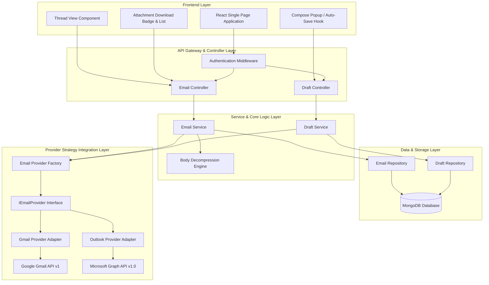
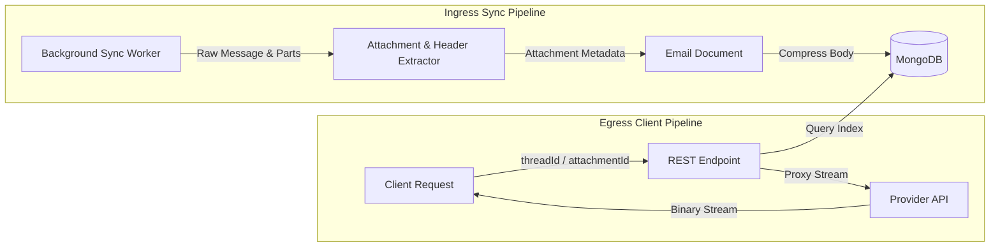
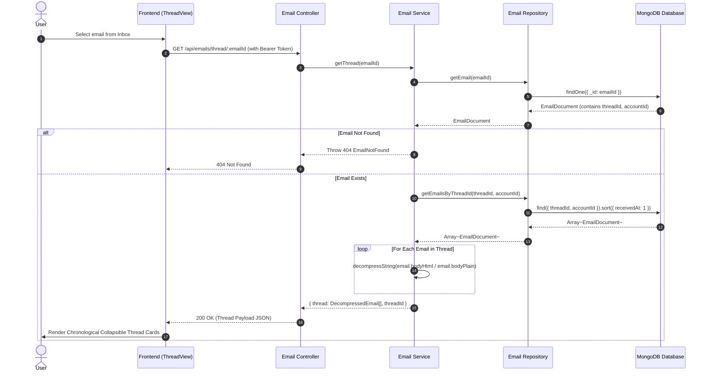
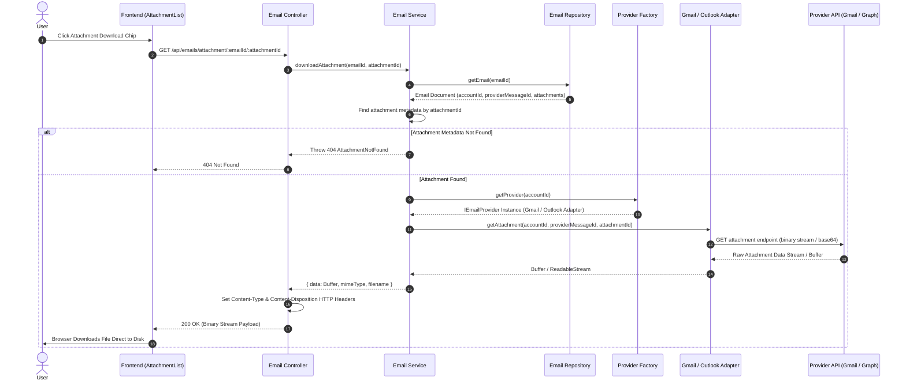
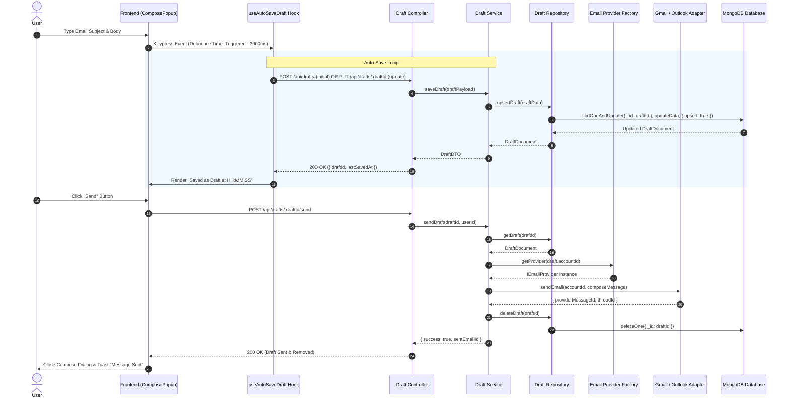
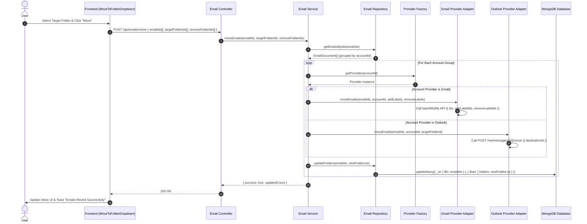
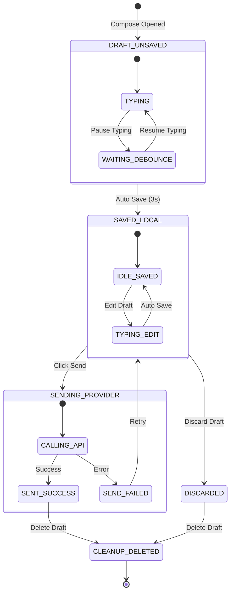

# Email Experience Completion — Implementation Plan

> **Phase:** Phase 1 (from MailSense Development Roadmap) · **Release Target:** v3.0.0
> **Priority:** 🔴 HIGH — Core email features required for daily-driver usage
> **Status:** IN PROGRESS (Phase 1 COMPLETED)
> **Created:** 2026-08-01 · **Last Updated:** 2026-08-04

---

## 1. Overview

### Problem Statement

Currently, MailSense has a robust background sync engine (v2.1.0 with BullMQ & Redis), but lacks four core email experience features:

1. **Thread/Conversation View:** Emails with the same `threadId` are shown as standalone list items without conversation context.
2. **Attachments Handling:** Email attachments are discarded during sync; users cannot view or download attachments.
3. **Drafts Engine:** Compose state is not saved, and draft operations do not exist in the backend.
4. **Move to Folder / Apply Label:** No bulk or single email action to move emails across folders/labels.

Without these features, users cannot rely on MailSense as their primary email client.

### Goals

- Group emails by `threadId` in conversation views with expanded/collapsible message cards.
- Extract attachment metadata during Gmail/Outlook sync and provide stream-based proxy downloads.
- Create a dedicated `drafts` backend module with debounced auto-save UI and draft list navigation.
- Implement folder movement across Gmail (label modification) and Outlook (`parentFolderId` update) providers.

### Non-Goals

- Real-time provider draft sync (MVP will store drafts locally in MongoDB; provider sync deferred to v3.1+).
- Permanent local attachment binary storage in MongoDB/Disk (on-demand streaming proxy will be used to adhere to memory limits).
- Cross-account thread merging (threads remain strictly scoped to individual account IDs).

### Background

This phase builds directly on top of the completed Background Sync architecture (v2.1.0). Data models already store `threadId` per email. Provider integrations (Gmail and Outlook API clients) already have access to attachment details and folder modification endpoints, requiring feature-level implementations rather than structural re-architecting.

---

## 2. Requirements

### Functional Requirements

- **FR-01 (Thread View):** Users can view an email thread with messages chronologically sorted, latest expanded, and past messages collapsible.
- **FR-02 (Thread Actions):** Users can reply or reply-all directly from the thread view with pre-filled context (`inReplyTo`, subject `Re:`).
- **FR-03 (Attachment Preview & Download):** Email list displays attachment badges; detail view shows attachment metadata (name, size, type) with on-demand download proxy.
- **FR-04 (Draft Auto-Save):** Compose dialog auto-saves content every 3 seconds of inactivity, updating a local draft record in MongoDB.
- **FR-05 (Draft Management):** Users can access a Drafts folder in the sidebar, re-open saved drafts, send drafts, or discard drafts.
- **FR-06 (Move to Folder):** Users can select one or multiple emails and move them to a specified folder/label across connected accounts.

### Non-Functional Requirements

- **NFR-01 (Memory Overhead):** Attachment downloads must stream directly from provider APIs to client HTTP responses without buffering full payloads into memory (staying within 256MB RAM limit).
- **NFR-02 (Thread Query Performance):** Thread queries must execute in < 50ms for threads with up to 50 emails using database compound indexing (`{ threadId: 1, accountId: 1, receivedAt: 1 }`).
- **NFR-03 (Auto-Save Throttle):** Auto-save requests must be debounced by 3000ms to minimize database write operations during typing.

### Acceptance Criteria

- [x] `GET /api/emails/thread/:emailId` returns all emails in the thread sorted by `receivedAt` ascending.
- [ ] `GET /api/emails/attachment/:emailId/:attachmentId` streams file binary with correct `Content-Type` and `Content-Disposition`.
- [ ] `POST /api/drafts` and `PUT /api/drafts/:draftId` store and update draft documents in MongoDB.
- [ ] Sending a draft executes provider `sendEmail`, deletes local draft, and creates a sent `Email` record.
- [ ] `POST /api/emails/move` modifies Gmail labels via `batchModify` and Outlook `parentFolderId` via `move` endpoint.

---

## 3. Design

### 3.1 High-Level Design

#### System Architecture Topology



#### Data Flow & Pipeline Architecture



---

### 3.2 Low-Level Design

#### Sequence Diagram 1: Thread Retrieval & Decompression Flow (`GET /api/emails/thread/:emailId`)



#### Sequence Diagram 2: On-Demand Attachment Download Proxy Flow (`GET /api/emails/attachment/:emailId/:attachmentId`)



#### Sequence Diagram 3: Debounced Draft Auto-Save & Send Lifecycle (`POST/PUT /api/drafts` & `POST /api/drafts/:draftId/send`)



#### Sequence Diagram 4: Move Emails Across Folders/Labels Flow (`POST /api/emails/move`)



#### Class Diagram: Core Classes, Interfaces, and Strategy Pattern

```mermaid
classDiagram
    class BaseEntity {
        +string _id
        +Date createdAt
        +Date updatedAt
    }

    class EmailAttributes {
        +string accountId
        +string providerMessageId
        +string threadId
        +string from
        +string[] to
        +string subject
        +string bodyHtml
        +string bodyPlain
        +EmailAttachment[] attachments
        +EMAIL_STATUS status
        +string[] folders
        +Date receivedAt
    }

    class DraftAttributes {
        +string userId
        +string accountId
        +string providerDraftId
        +string[] to
        +string[] cc
        +string subject
        +string body
        +EmailAttachment[] attachments
        +Date lastSavedAt
        +boolean syncedToProvider
    }

    class EmailAttachment {
        +string attachmentId
        +string filename
        +string mimeType
        +number size
        +string contentId
        +boolean isInline
    }

    class IEmailProvider {
        <<interface>>
        +getAttachment(accountId: string, messageId: string, attachmentId: string) Promise~Buffer~
        +moveEmails(emailIds: string[], accountId: string, targetFolderIds: string[], removeFolderIds?: string[]) Promise~void~
        +sendEmail(accountId: string, message: ComposeEmailRequestBody) Promise~{ providerMessageId: string }~
    }

    class GmailProvider {
        -GmailClient gmailClient
        +getAttachment(accountId, messageId, attachmentId) Promise~Buffer~
        +moveEmails(emailIds, accountId, targetFolderIds, removeFolderIds) Promise~void~
        +sendEmail(accountId, message) Promise~{ providerMessageId }~
    }

    class OutlookProvider {
        -OutlookClient outlookClient
        +getAttachment(accountId, messageId, attachmentId) Promise~Buffer~
        +moveEmails(emailIds, accountId, targetFolderIds, removeFolderIds) Promise~void~
        +sendEmail(accountId, message) Promise~{ providerMessageId }~
    }

    class EmailRepository {
        +getEmail(emailId: string) Promise~EmailDocument~
        +getEmailsByThreadId(threadId: string, accountId: string) Promise~EmailDocument[]~
        +updateFolders(emailIds: string[], folders: string[]) Promise~void~
    }

    class DraftRepository {
        +getDraft(draftId: string) Promise~DraftDocument~
        +upsertDraft(draft: DraftAttributes) Promise~DraftDocument~
        +deleteDraft(draftId: string) Promise~void~
        +getDraftsByUser(userId: string) Promise~DraftDocument[]~
    }

    class EmailService {
        -EmailRepository emailRepo
        -ProviderFactory providerFactory
        +getThread(emailId: string) Promise~{ thread: EmailDocument[], threadId: string }~
        +downloadAttachment(emailId: string, attachmentId: string) Promise~AttachmentResult~
        +moveEmails(emailIds: string[], targetFolderIds: string[]) Promise~void~
    }

    class DraftService {
        -DraftRepository draftRepo
        -ProviderFactory providerFactory
        +saveDraft(draftData: DraftAttributes) Promise~DraftDocument~
        +sendDraft(draftId: string, userId: string) Promise~void~
        +deleteDraft(draftId: string) Promise~void~
    }

    BaseEntity <|-- EmailAttributes
    BaseEntity <|-- DraftAttributes
    EmailAttributes "1" *-- "many" EmailAttachment
    DraftAttributes "1" *-- "many" EmailAttachment

    IEmailProvider <|.. GmailProvider
    IEmailProvider <|.. OutlookProvider

    EmailService --> EmailRepository
    EmailService --> IEmailProvider
    DraftService --> DraftRepository
    DraftService --> IEmailProvider
```

#### State Machine Diagram: Draft Lifecycle State Transitions



---

### 3.3 Data Models

#### Shared Types Additions (`@mailsense/types`)

```typescript
export interface EmailAttachment {
  attachmentId: string;
  filename: string;
  mimeType: string;
  size: number;
  contentId?: string;
  isInline: boolean;
}

export enum EMAIL_STATUS {
  RECEIVED = "received",
  DRAFT = "draft",
  SENT = "sent",
}

export interface DraftAttributes extends BaseEntity {
  userId: string;
  accountId: string;
  providerDraftId?: string;
  to: string[];
  cc: string[];
  bcc: string[];
  subject: string;
  body: string;
  bodyPlain: string;
  inReplyTo?: string;
  attachments: EmailAttachment[];
  lastSavedAt: Date;
  syncedToProvider: boolean;
}
```

#### MongoDB Schemas (`Backend`)

```typescript
// Email Schema Updates in email.model.ts
const AttachmentSchema = new Schema<EmailAttachment>({
    attachmentId: { type: String, required: true },
    filename: { type: String, required: true },
    mimeType: { type: String, required: true },
    size: { type: Number, required: true },
    contentId: { type: String, required: false },
    isInline: { type: Boolean, default: false },
}, { _id: false });

// Added fields in EmailSchema
attachments: { type: [AttachmentSchema], default: [] },
status: { type: String, enum: Object.values(EMAIL_STATUS), default: EMAIL_STATUS.RECEIVED },
inReplyTo: { type: String, required: false },

// Indexes
EmailSchema.index({ threadId: 1, accountId: 1, receivedAt: 1 });
EmailSchema.index({ accountId: 1, 'attachments.0': 1 }, { sparse: true });
```

---

### 3.4 API Contracts

| Method   | Path                                            | Request Body                                                                    | Response Body                                     | Description                 |
| -------- | ----------------------------------------------- | ------------------------------------------------------------------------------- | ------------------------------------------------- | --------------------------- |
| `GET`    | `/api/emails/thread/:emailId`                   | —                                                                               | `{ thread: EmailAttributes[], threadId: string }` | Get all emails in a thread  |
| `GET`    | `/api/emails/attachment/:emailId/:attachmentId` | —                                                                               | Binary Stream                                     | Proxy download attachment   |
| `POST`   | `/api/emails/move`                              | `{ emailIds: string[], targetFolderIds: string[], removeFolderIds?: string[] }` | `{ success: boolean, updatedCount: number }`      | Move emails to folder/label |
| `POST`   | `/api/drafts`                                   | `DraftAttributes`                                                               | `DraftAttributes`                                 | Create new draft            |
| `PUT`    | `/api/drafts/:draftId`                          | `Partial<DraftAttributes>`                                                      | `DraftAttributes`                                 | Update draft (auto-save)    |
| `GET`    | `/api/drafts`                                   | —                                                                               | `DraftAttributes[]`                               | List user drafts            |
| `DELETE` | `/api/drafts/:draftId`                          | —                                                                               | `{ success: boolean }`                            | Delete draft                |
| `POST`   | `/api/drafts/:draftId/send`                     | —                                                                               | `{ success: boolean, sentEmailId: string }`       | Send draft email            |

---

### 3.5 State Management

- **React Query Keys**:
  - `['emails', 'thread', emailId]`
  - `['drafts', userId]`
  - `['draft', draftId]`
- **Invalidation Strategy**:
  - Sending draft invalidates `['drafts']` and `['emails']`.
  - Moving folder invalidates `['emails']` and `['folders']`.

---

## 4. Proposed Changes

### Shared Types (`@mailsense/types`)

#### [MODIFY] [emails.interfaces.ts](file:///Users/vishaljagamani/Projects/Projects/mailsense-types/src/emails/emails.interfaces.ts)

- Add `EmailAttachment` interface, `EMAIL_STATUS` enum.
- Extend `EmailAttributes` with `attachments`, `status`, `inReplyTo`.
- Extend `EmailListDTO` with `attachmentCount`, `threadId`.

#### [NEW] [drafts.interfaces.ts](file:///Users/vishaljagamani/Projects/Projects/mailsense-types/src/drafts/drafts.interfaces.ts)

- Add `DraftAttributes` interface and DTO types.

---

### Backend (`Backend/src`)

#### [MODIFY] [email.model.ts](file:///Users/vishaljagamani/Projects/Projects/mailsense/Backend/src/modules/emails/email.model.ts)

- Add `AttachmentSchema` and update `EmailSchema`.
- Add compound indexes for `threadId` and attachments.

#### [MODIFY] [email.repository.ts](file:///Users/vishaljagamani/Projects/Projects/mailsense/Backend/src/modules/emails/email.repository.ts)

- Add `getEmailsByThreadId` and `getThreadSummaries`.

#### [MODIFY] [email.service.ts](file:///Users/vishaljagamani/Projects/Projects/mailsense/Backend/src/modules/emails/email.service.ts)

- Add `getThread`, `downloadAttachment`, and `moveEmails`.

#### [MODIFY] [email.controller.ts](file:///Users/vishaljagamani/Projects/Projects/mailsense/Backend/src/modules/emails/email.controller.ts)

- Add `getThread`, `downloadAttachment`, and `moveEmails` endpoints.

#### [MODIFY] [email.routes.ts](file:///Users/vishaljagamani/Projects/Projects/mailsense/Backend/src/modules/emails/email.routes.ts)

- Mount `/thread/:emailId`, `/attachment/:emailId/:attachmentId`, and `/move`.

#### [MODIFY] [email.provider.ts](file:///Users/vishaljagamani/Projects/Projects/mailsense/Backend/src/integrations/email/email.provider.ts)

- Extend `IEmailProvider` with `getAttachment` and `moveEmails`.

#### [MODIFY] [gmail.service.ts](file:///Users/vishaljagamani/Projects/Projects/mailsense/Backend/src/integrations/gmail/gmail.service.ts) & [gmail.client.ts](file:///Users/vishaljagamani/Projects/Projects/mailsense/Backend/src/integrations/gmail/gmail.client.ts)

- Extract attachment metadata during sync and implement `getAttachment` / `batchModify` label changes.

#### [MODIFY] [outlook.service.ts](file:///Users/vishaljagamani/Projects/Projects/mailsense/Backend/src/integrations/outlook/outlook.service.ts) & [outlook.api.ts](file:///Users/vishaljagamani/Projects/Projects/mailsense/Backend/src/integrations/outlook/outlook.api.ts)

- Extract attachment metadata during sync and implement attachment download / message move endpoints.

#### [NEW] `Backend/src/modules/drafts/`

- `draft.model.ts`: Mongoose schema.
- `draft.repository.ts`: Database query methods.
- `draft.service.ts`: Draft business logic & auto-save processing.
- `draft.controller.ts`: API route controllers.
- `draft.routes.ts`: Express routes.

---

### Frontend (`Frontend/src`)

#### [NEW] `Frontend/src/features/emails/components/ThreadView.tsx`

- Collapsible conversation thread component displaying chronological messages.

#### [NEW] `Frontend/src/features/emails/components/AttachmentList.tsx` & `AttachmentBadge.tsx`

- Attachment list UI with download handlers and list view paperclip badge.

#### [NEW] `Frontend/src/features/emails/components/MoveToFolderDropdown.tsx`

- Folder selector dropdown for moving emails.

#### [NEW] `Frontend/src/features/drafts/`

- `api/drafts.queries.ts` & `api/drafts.mutations.ts`: React Query hooks.
- `components/DraftList.tsx`: Drafts list view.
- `hooks/useAutoSaveDraft.ts`: Auto-save debounced hook.

---

## 5. Implementation Phases

### Phase 1: Thread / Conversation View

**Objective:** Enable chronological message grouping by `threadId` in inbox list views and detail views across frontend and backend.
**Estimated Effort:** Medium

#### Tasks

- [x] Add `getEmailsByThreadId`, `getThreadSummaries`, `getGroupedEmails`, and `countGroupedThreads` to `EmailRepository`.
- [x] Update `getAllEmails` & `getEmails` in `EmailService` to deduplicate list views by `threadId`.
- [x] Implement `getThread` in `EmailService` with body decompression.
- [x] Add `GET /api/emails/thread/:emailId` endpoint and controller.
- [x] Create `ThreadView` component and `EmailListTable` thread count badge in Frontend.
- [x] Integrate `useGetThreadQuery` hook and update email detail page to render `ThreadView` when thread contains multiple messages.

#### Files to Create

- `Frontend/src/features/emails/components/thread-view/index.tsx`
- `Frontend/src/shared/utils/emails.ts`

#### Files to Modify

- [emails.interfaces.ts](file:///Users/vishaljagamani/Projects/Projects/mailsense-types/src/emails/emails.interfaces.ts)
- [email.repository.ts](file:///Users/vishaljagamani/Projects/Projects/mailsense/Backend/src/modules/emails/email.repository.ts)
- [email.service.ts](file:///Users/vishaljagamani/Projects/Projects/mailsense/Backend/src/modules/emails/email.service.ts)
- [email.controller.ts](file:///Users/vishaljagamani/Projects/Projects/mailsense/Backend/src/modules/emails/email.controller.ts)
- [email.routes.ts](file:///Users/vishaljagamani/Projects/Projects/mailsense/Backend/src/modules/emails/email.routes.ts)
- `Frontend/src/shared/api/endpoints.ts`
- `Frontend/src/features/emails/api/email.api.ts`
- `Frontend/src/features/emails/api/email.queries.ts`
- `Frontend/src/features/emails/hooks/useEmailsPage.ts`
- `Frontend/src/features/emails/pages/index.tsx`
- `Frontend/src/features/inbox/components/EmailListTable.tsx`

#### Acceptance Criteria

1. Inbox email list queries (`getAllEmails`, `getEmails`) return 1 representative email per `threadId` with `threadCount`.
2. `GET /api/emails/thread/:emailId` returns all emails in thread in ascending date order.
3. `ThreadView` renders message list with collapsible past messages and expanded latest message.

---

### Phase 2: Attachments (Preview & Download Proxy)

**Objective:** Parse attachment metadata on sync and serve attachment file streams.
**Estimated Effort:** Medium-High

#### Tasks

- [x] Update `@mailsense/types` with `EmailAttachment` interface.
- [ ] Update `EmailSchema` with `attachments` field and sparse index.
- [ ] Modify `GmailService` and `OutlookService` sync parsers to capture attachment metadata.
- [ ] Implement `getAttachment` in `GmailClient`, `OutlookApi`, and `EmailProvider`.
- [ ] Add `GET /api/emails/attachment/:emailId/:attachmentId` proxy endpoint in backend.
- [ ] Create `AttachmentList.tsx` and `AttachmentBadge.tsx` components in frontend.

#### Files to Create

- `Frontend/src/features/emails/components/AttachmentList.tsx`
- `Frontend/src/features/emails/components/AttachmentBadge.tsx`

#### Files to Modify

- [emails.interfaces.ts](file:///Users/vishaljagamani/Projects/Projects/mailsense-types/src/emails/emails.interfaces.ts)
- [email.model.ts](file:///Users/vishaljagamani/Projects/Projects/mailsense/Backend/src/modules/emails/email.model.ts)
- [gmail.service.ts](file:///Users/vishaljagamani/Projects/Projects/mailsense/Backend/src/integrations/gmail/gmail.service.ts)
- [outlook.service.ts](file:///Users/vishaljagamani/Projects/Projects/mailsense/Backend/src/integrations/outlook/outlook.service.ts)
- [email.controller.ts](file:///Users/vishaljagamani/Projects/Projects/mailsense/Backend/src/modules/emails/email.controller.ts)

#### Acceptance Criteria

1. Attachments are parsed during email sync and stored in `attachments` array.
2. Clicking attachment chip streams binary file from provider without crashing memory.

---

### Phase 3: Move to Folder / Apply Label

**Objective:** Provide backend and UI mechanisms to move emails between folders/labels.
**Estimated Effort:** Low-Medium

#### Tasks

- [ ] Extend `IEmailProvider` with `moveEmails`.
- [ ] Implement `batchModify` in Gmail provider and `move` in Outlook provider.
- [ ] Add `POST /api/emails/move` endpoint and service method.
- [ ] Create `MoveToFolderDropdown.tsx` component in frontend.
- [ ] Wire folder dropdown into inbox action bar and email detail header.

#### Files to Create

- `Frontend/src/features/emails/components/MoveToFolderDropdown.tsx`

#### Files to Modify

- [email.provider.ts](file:///Users/vishaljagamani/Projects/Projects/mailsense/Backend/src/integrations/email/email.provider.ts)
- [gmail.provider.ts](file:///Users/vishaljagamani/Projects/Projects/mailsense/Backend/src/integrations/gmail/gmail.provider.ts)
- [outlook.provider.ts](file:///Users/vishaljagamani/Projects/Projects/mailsense/Backend/src/integrations/outlook/outlook.provider.ts)
- [email.service.ts](file:///Users/vishaljagamani/Projects/Projects/mailsense/Backend/src/modules/emails/email.service.ts)

#### Acceptance Criteria

1. Moving email in UI calls `/api/emails/move` and updates local DB + provider labels/folders.

---

### Phase 4: Drafts System

**Objective:** Build complete backend module and frontend auto-save composition flow for drafts.
**Estimated Effort:** Medium-High

#### Tasks

- [x] Define `DraftAttributes` in `@mailsense/types`.
- [ ] Create backend `drafts` module (`model`, `repository`, `service`, `controller`, `routes`).
- [ ] Build `useAutoSaveDraft` debounced hook in frontend.
- [ ] Integrate auto-save logic into `ComposePopup`.
- [ ] Build `DraftList.tsx` component and add Drafts link to main navigation sidebar.

#### Files to Create

- `Backend/src/modules/drafts/draft.model.ts`
- `Backend/src/modules/drafts/draft.repository.ts`
- `Backend/src/modules/drafts/draft.service.ts`
- `Backend/src/modules/drafts/draft.controller.ts`
- `Backend/src/modules/drafts/draft.routes.ts`
- `Frontend/src/features/drafts/hooks/useAutoSaveDraft.ts`
- `Frontend/src/features/drafts/components/DraftList.tsx`

#### Files to Modify

- [drafts.interfaces.ts](file:///Users/vishaljagamani/Projects/Projects/mailsense-types/src/drafts/drafts.interfaces.ts)
- `Frontend/src/features/emails/components/composeEmail/ComposePopup.tsx`
- `Frontend/src/components/layout/Sidebar.tsx`

#### Acceptance Criteria

1. In-progress email edits auto-save to MongoDB every 3s of inactivity.
2. Saved draft can be re-opened from sidebar, completed, and sent.

---

## 6. Dependencies & Constraints

### New Dependencies

None required. All features will be implemented using existing project dependencies (`express`, `mongoose`, `react-query`, `@tanstack/react-query`, `lucide-react`, `tiptap`).

### Infrastructure Requirements

- Redis & BullMQ (already existing from v2.1.0 background sync).
- MongoDB index updates for `threadId` and `drafts`.

### Existing Dependencies (leveraged)

- `@mailsense/types` (shared data transfer objects and interfaces).
- Gmail & Outlook OAuth clients (already configured in integrations).

### Constraints

- **RAM Constraint:** Deployment target limited to 256MB RAM — attachments must stream on demand.
- **Provider API Quotas:** Attachment downloads and batch label modifications must respect provider rate limits.

---

## 7. Risk Assessment & Mitigation

| Risk                                               | Impact | Likelihood | Mitigation                                                                                               |
| -------------------------------------------------- | ------ | ---------- | -------------------------------------------------------------------------------------------------------- |
| Large attachment downloads cause server OOM        | HIGH   | MEDIUM     | Stream attachment binary chunks directly to HTTP response stream rather than buffering Buffer in memory. |
| Gmail rate limit on frequent auto-saves            | MEDIUM | LOW        | Keep MVP drafts local-only in MongoDB; defer real-time provider draft sync.                              |
| Large thread view performance lag (100+ emails)    | MEDIUM | LOW        | Limit initial thread load to latest 20 emails with a "load earlier messages" pagination toggle.          |
| Schema migration missing fields on existing emails | LOW    | LOW        | Mongoose default values (`attachments: []`) and sparse indexing prevent breaking existing records.       |

---

## 8. Verification Plan

### Automated Tests

```bash
# Type-checking across packages
cd /Users/vishaljagamani/Projects/Projects/mailsense-types && pnpm build
cd /Users/vishaljagamani/Projects/Projects/mailsense/Backend && pnpm build
cd /Users/vishaljagamani/Projects/Projects/mailsense/Frontend && pnpm build

# Unit test suite execution
cd /Users/vishaljagamani/Projects/Projects/mailsense/Backend && pnpm test
```

### Unit Test Cases

| Feature     | Test Case                           | Expected Result                                                      |
| ----------- | ----------------------------------- | -------------------------------------------------------------------- |
| Thread View | `getEmailsByThreadId(threadId)`     | Returns matching emails in ascending chronological order             |
| Attachments | Gmail payload attachment extraction | Correctly parses `attachmentId`, `filename`, `size`, `mimeType`      |
| Drafts      | `createDraft` / `updateDraft`       | Inserts or updates draft record in MongoDB with timestamp            |
| Move Folder | `moveEmails` with Gmail account     | Invokes `batchModify` with target `addLabelIds` and `removeLabelIds` |

### Integration Tests

- Verify draft creation -> auto-save updates -> send draft flow successfully sends email and removes draft document.
- Verify attachment download endpoint proxies file bytes from provider API with valid HTTP content headers.

### Manual Verification

- [ ] Open a multi-message thread in frontend UI -> verify conversation cards collapse/expand correctly.
- [ ] Download an image and PDF attachment from an email -> verify file saves cleanly without corruption.
- [ ] Edit a draft, close browser, reopen app -> verify draft is preserved in Drafts sidebar and editable.
- [ ] Select 3 emails and move to "Work" label -> verify emails reflect new label in inbox and provider web app.

---

## 9. Open Questions & Decisions

> [!IMPORTANT]
> **Q1: Attachment Download Caching Strategy**
> Should attachment binaries be stored in MongoDB GridFS/Disk or always fetched live from Gmail/Outlook?
>
> - **Resolution / Option A (Recommended):** Fetch live via on-demand stream proxy. Prevents storage bloat and respects the 256MB memory cap.

> [!IMPORTANT]
> **Q2: Draft Provider Synchronization**
> Should local drafts sync to Gmail/Outlook drafts folder in real time?
>
> - **Resolution / Option A (Recommended):** Keep drafts local in MongoDB for MVP. Syncing on every debounced keystroke introduces high API latency and rate-limit risks.

> [!NOTE]
> **Q3: Cross-Account Thread Grouping**
> If an email is sent to two connected accounts in MailSense, should the thread combine messages across both accounts?
>
> - **Resolution:** No. Threads will be scoped strictly to `accountId` to preserve data isolation and privacy.

### Resolved Decisions

| Decision                 | Resolution                                | Date       |
| ------------------------ | ----------------------------------------- | ---------- |
| Draft storage model      | Separate `drafts` collection in MongoDB   | 2026-08-01 |
| Attachment storage model | On-demand streaming proxy                 | 2026-08-01 |
| Thread scope             | Account-scoped (`accountId` + `threadId`) | 2026-08-01 |
