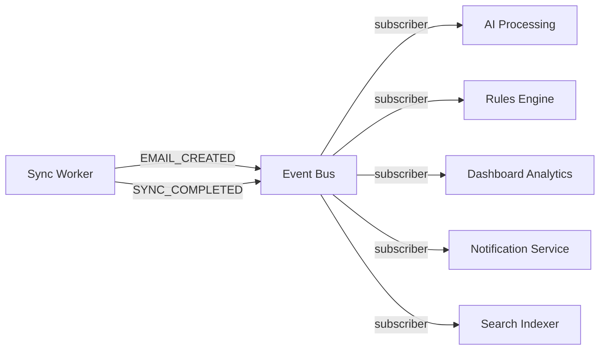

# MailSense Development Roadmap

##### **Type:** Master Plan · **Scope:** Full product feature roadmap

**Baseline:** v3.1.0 (post Dashboard & Analytics)
**Status:** IN PROGRESS · **Created:** 2026-08-01 · **Last Updated:** 2026-09-13

This is the **master development roadmap** for MailSense. It defines the strategic feature sequence, priorities, and architectural direction for all future development. All recommendations are grounded in actual codebase analysis.

---

## How This Roadmap Works

This document is a **stable north-star plan** — not a living status tracker. It should only be updated when the strategic direction changes (phases added, reordered, or dropped). It does **not** need to be updated after every release.

### Document Hierarchy

```
mailsense/.agents/plans/
├── mailsense-development-roadmap.md            ← THIS FILE (master plan, rarely updated)
├── email-experience-completion/                ← Feature plan directory
│   ├── implementation-plan.md                  ← Feature high-level plan
│   └── types-implementation-plan.md            ← Shared types plan (@mailsense/types)
└── [future-feature]/                           ← Created before each new feature phase
```

| Document                 | Purpose                                                         | Update Frequency                    |
| ------------------------ | --------------------------------------------------------------- | ----------------------------------- |
| **This Roadmap**         | Strategic direction, phase ordering, feature scope              | Only when strategy changes          |
| **Implementation Plans** | Detailed file-level changes for each phase, created in `plans/` | One per phase, before starting work |
| **CHANGELOG.md**         | What shipped and when (user-facing release notes)               | Every release                       |
| **CODEBASE_INDEX.md**    | Current architecture and file map                               | After significant changes           |
| **features-list.md**     | Feature checklist with done/not-done status                     | After features complete             |

### Workflow Per Phase

1. Consult this roadmap to identify the next phase
2. Create a detailed implementation plan in `plans/` (e.g., `email-experience-completion-plan.md`)
3. Execute the implementation plan
4. Update `CHANGELOG.md`, `CODEBASE_INDEX.md`, and `features-list.md` upon completion
5. Move to the next phase

---

## Baseline: Implementation Status (as of v3.1.0)

> [!NOTE]
> This section is a **frozen snapshot** of the implementation state when this roadmap was created. It is not actively maintained. Check `CHANGELOG.md` and `features-list.md` for the current state.

### ✅ Fully Implemented

| #   | Feature Area                         | Status                                                                                                |
| --- | ------------------------------------ | ----------------------------------------------------------------------------------------------------- |
| 1   | **Authentication & User Management** | ✅ Auth0 OAuth, JWT sessions, profile CRUD, password change                                           |
| 2   | **Email Account Integrations**       | ✅ Gmail + Outlook OAuth 2.0, multi-account, enable/disable, sync controls                            |
| 3   | **Email Aggregation (Core Engine)**  | ✅ Unified inbox, per-account view, folder/label mapping, normalization, pagination, incremental sync |
| 4   | **Background Job Queue**             | ✅ BullMQ + Redis, sync workers, token refresh workers, event bus, scheduler, DLQ + retry             |
| 5   | **Compose Email**                    | ✅ Sender account selection, rich-text TipTap editor, contact suggestions, compose popup              |
| 6   | **Email Actions**                    | ✅ Mark read/unread, star/flag, delete/archive, multi-select bulk actions                             |
| 7   | **Search & Basic Filters**           | ✅ Subject/sender search, date range, account filter, folder filter, unread filter                    |
| 8   | **Folder / Label Management**        | ✅ Unified + per-account views, CRUD, provider sync, color support (Gmail)                            |
| 9   | **Settings**                         | ✅ Profile, password, dark/light mode, account sync settings (global + per-account)                   |
| 10  | **Responsive Design**                | ✅ Mobile + desktop layouts across inbox, accounts, email details, folders, settings                  |
| 11  | **Provider Strategy Pattern**        | ✅ `IEmailProvider` interface, factory pattern, Gmail + Outlook adapters                              |
| 12  | **Event-Driven Architecture**        | ✅ Internal event bus with `SYNC_COMPLETED` + `EMAIL_CREATED` events, typed payloads                  |
| 13  | **Security**                         | ✅ OAuth token encryption, secure refresh, data deletion on account removal                           |
| 14  | **Thread / Conversation View**       | ✅ Thread grouping API, `ThreadView` component, collapsible message cards per thread                  |
| 15  | **Attachments**                      | ✅ Sync, download proxy, staging upload, inline preview, R2 storage integration                       |
| 16  | **Drafts System**                    | ✅ Gmail `drafts.create/update/send`, Outlook `createDraft/sendDraft`, auto-save compose, draft list  |
| 17  | **Move to Folder / Apply Label**     | ✅ `moveEmails` on `IEmailProvider`, Gmail/Outlook providers, folder picker UI                        |
| 18  | **Dashboard & Analytics**            | ✅ Analytics module, aggregation pipelines, dashboard overview, email volume charts, top senders, response time |

### ❌ Not Implemented

| #   | Feature Area                          | Notes                                                                                    |
| --- | ------------------------------------- | ---------------------------------------------------------------------------------------- |
| 1   | **Exception Handling & Custom Errors**| Basic `AppError` + `ApiError` exist but no domain-specific exceptions, no error codes, no correlation IDs |
| 2   | **Structured Logging & Monitoring**   | Basic pino logger exists, no structured metadata, no correlation IDs, no health/metrics endpoints |
| 3   | **AI Features (Gemini)**              | No AI service, no categorization, no priority scoring, no summarization                  |
| 4   | **Notifications**                     | No browser notifications, no notification center, no WebSocket/SSE                       |
| 5   | **Custom Rules**                      | No rules engine, no user-defined filters                                                 |
| 6   | **Keyboard Shortcuts**                | None                                                                                     |
| 7   | **Account Deletion (GDPR)**           | Backend has account delete but no full user data wipe flow                               |
| 8   | **Feature Flags**                     | None                                                                                     |

---

## Prioritized Development Phases

### Phase 1: Email Experience Completion ✅ COMPLETED

**Timeline:** 2–3 weeks · **Release:** v3.0.0 · **Completed:** Sep 2026

Core email features that users expect from any modern email client.

#### 1.1 Thread / Conversation View (✅ COMPLETED)

- **Backend:** `getEmailsByThreadId`, `getThreadSummaries`, `getGroupedEmails` in `EmailRepository`, `getThread` in `EmailService`, endpoint `GET /api/emails/thread/:emailId`
- **Frontend:** `ThreadView` component, collapsible message cards per thread, `AttachmentList` per message

#### 1.2 Attachments (Preview, Download Proxy & Staging Send Flow) (✅ COMPLETED)

- **Shared Types:** Added `attachments` field to `EmailAttributes` and `OutlookAttachmentObject` in `@mailsense/types` (v1.2.0)
- **Backend:** Extended `EmailSchema` with attachments, parse attachments during sync, download proxy, Cloudflare R2 staging, Base64URL MIME for Gmail, Graph API chunked uploads for Outlook
- **Frontend:** Attachment badges, attachment list with icons, inline image preview, file upload staging in Compose

#### 1.3 Drafts System (✅ COMPLETED)

- **Backend:** New `drafts` module (model, repository, service, controller, routes). Gmail `drafts.create/update/send`, Outlook `createDraftMessage/sendDraftMessage`
- **Frontend:** Auto-save on compose (debounced), draft list in sidebar, resume draft editing

#### 1.4 Move to Folder / Apply Label (✅ COMPLETED)

- **Backend:** Added `moveEmails(emailIds, targetFolderId)` to `IEmailProvider` and both Gmail/Outlook providers
- **Frontend:** "Move to" dropdown in email action bar, folder picker component

---

### Phase 2: Dashboard & Analytics ✅ COMPLETED

**Timeline:** 2 weeks · **Release:** v3.1.0 · **Completed:** Sep 2026

#### 2.1 Dashboard Overview Page (✅ COMPLETED)

- **Backend:** Analytics module with aggregation pipelines — total emails, unread count, emails per day/week/month, top senders
- **Frontend:** Dashboard route `/dashboard`, overview cards, email volume chart (recharts), top senders list

#### 2.2 Account Metrics Collection (✅ COMPLETED)

- **Backend:** `SYNC_COMPLETED` event subscriber updating `AccountMetrics` collection, cross-account aggregation

#### 2.3 Response Time Analytics (✅ COMPLETED)

- **Backend:** Average response time from sent-email vs received-email timestamps per thread
- **Frontend:** Response time chart on dashboard

---

### Phase 3: Observability & Reliability 🔴 HIGH PRIORITY

**Timeline:** 1.5–2 weeks · **Release Target:** v3.2.0

**Why now:** The codebase has grown significantly — 30+ files use the logger, 3 different error classes exist (`AppError`, `ApiError`, `AxiosApiError`) with overlapping responsibilities, and there is no correlation ID tracking, no domain-specific exceptions, and no standardized log format. Before building AI pipelines and background processing, proper observability is **essential** to debug production issues quickly. Sentry is already integrated but the error hierarchy doesn't leverage it properly. This is foundational infrastructure — every future feature benefits from it.

#### 3.1 Custom Exception Hierarchy & Error Codes

- **Problem:** Currently, `AppError` (core) and `ApiError` (shared/utils) are two overlapping base error classes with different constructor signatures. `AxiosApiError` uses `any` casts. There are no domain-specific exceptions (e.g., `NotFoundError`, `UnauthorizedError`, `ValidationError`, `ConflictError`, `ProviderApiError`, `TokenExpiredError`, `RateLimitError`, `SyncError`). Catch blocks across the codebase throw generic `AppError` or re-throw raw errors without classification.
- **Backend:**
  - **Unified error hierarchy** under `src/core/errors/` — single base `AppError` with proper `errorCode` (enum-based machine-readable codes like `EMAIL_NOT_FOUND`, `PROVIDER_RATE_LIMITED`, `TOKEN_EXPIRED`, `SYNC_FAILED`), `httpStatus`, `isOperational` flag, `correlationId`, and `context` metadata object
  - **Domain-specific error subclasses:** `NotFoundError`, `BadRequestError`, `UnauthorizedError`, `ForbiddenError`, `ConflictError`, `ValidationError`, `ProviderApiError` (for Gmail/Outlook API failures with provider error details), `TokenExpiredError`, `RateLimitError`, `SyncError`, `ExternalServiceError`
  - **Deprecate and remove** `ApiError` from `shared/utils/api.error.ts` — consolidate into `AppError` hierarchy
  - **Refactor `AxiosApiError`** to remove `any` casts, use typed Axios error extraction with proper `ProviderApiError` subclass
  - **Error serialization** — `toJSON()` method on `AppError` for consistent log/response formatting
  - **Updated `errorHandler` middleware** — map error subclasses to correct HTTP status codes and structured JSON responses, include `errorCode` and `correlationId` in response
  - **Error factory functions** — `createNotFoundError('Email', emailId)`, `createProviderError('gmail', originalError)` for ergonomic creation
- **Effort:** Medium

#### 3.2 Structured Logging System

- **Problem:** Current logger is a thin wrapper around pino with no structured metadata, no correlation IDs, no request context propagation, no service/module tagging, no performance timing, and inconsistent log message formatting across 30+ files.
- **Backend:**
  - **Enhanced pino configuration** in `logger.config.ts` — structured JSON output in production (with `timestamp`, `level`, `service`, `environment`, `version` base fields), pino-pretty for development
  - **Correlation ID middleware** — generate `X-Correlation-Id` (UUID v4) per request via Express middleware, propagate through `AsyncLocalStorage` so all downstream logs include the same `correlationId` without manual passing
  - **Child logger factory** — `createLogger(module: string)` returns a pino child logger with `module` binding (e.g., `createLogger('EmailService')`, `createLogger('SyncWorker')`) so every log line includes the originating module
  - **Standardized log metadata interface** — `LogContext` interface with typed fields: `{ correlationId, userId, accountId, provider, operation, duration, errorCode, ...extra }` — no more ad-hoc `Record<string, unknown>` metadata
  - **Request logging middleware** — log incoming request (method, path, userId, correlationId) and outgoing response (statusCode, duration) with consistent format
  - **Performance timing utility** — `logger.time(label)` / `logger.timeEnd(label)` pattern or `withTiming(fn)` wrapper that auto-logs execution duration for service methods
  - **Log level strategy:** `info` for business events (sync completed, email sent, user logged in), `warn` for recoverable issues (rate limit approaching, token refresh needed), `error` for failures (API errors, sync failures, unhandled exceptions), `debug` for development traces (query details, payload inspection)
- **Effort:** Medium

#### 3.3 Health Check & Metrics Endpoints

- **Backend:**
  - `GET /health` — lightweight liveness probe (responds 200 if server is running)
  - `GET /health/ready` — readiness probe checking MongoDB connection, Redis connection, and critical service availability
  - `GET /metrics` (optional) — Prometheus-compatible metrics endpoint using `prom-client` for request count, response time histograms, error rate, queue depth, sync job metrics
- **Effort:** Low

#### 3.4 Sentry Integration Enhancement

- **Problem:** Sentry is installed (`@sentry/node ^10.70.0`) and `setupExpressErrorHandler` is called, but there is no proper Sentry initialization with environment/release tagging, no breadcrumb enrichment, no user context attachment, and errors from background workers (BullMQ) are not reported to Sentry.
- **Backend:**
  - **Proper `Sentry.init()`** in `server.ts` with `environment`, `release` (from `package.json` version), `tracesSampleRate`, `integrations` configuration
  - **User context attachment** — set `Sentry.setUser()` in auth middleware after JWT validation
  - **Breadcrumb enrichment** — add breadcrumbs for key operations (email sync started, provider API called, database query)
  - **Worker error reporting** — catch unhandled errors in BullMQ workers/processors and report to Sentry with job metadata context
  - **Custom error tags** — propagate `errorCode`, `provider`, `accountId` as Sentry tags for filtering in dashboard
- **Effort:** Low-Medium

---

### Phase 4: AI Foundation & Core AI (Gemini) 🟡 MEDIUM-HIGH PRIORITY

**Timeline:** 3–4 weeks · **Release Target:** v3.3.0

**Why now:** The event-driven architecture (event bus + background workers) is the prerequisite for AI — and it's done. The `EMAIL_CREATED` event already fires for every synced email, making it the perfect trigger point for AI processing pipelines. With Phase 3's structured logging and exception hierarchy in place, debugging AI pipeline issues in production will be significantly easier.

#### 4.1 AI Service Infrastructure

- **Backend:** Install `@google/generative-ai`, create `AIService` under `src/integrations/ai/`, add `GEMINI_API_KEY` to env config, create AI worker subscribing to `EMAIL_CREATED` events
- **Shared Types:** Add AI-related fields to `EmailAttributes` (`aiCategory`, `aiPriority`, `aiSummary`, `aiTags`)
- **Feature Flags:** Simple config-based feature flag system (`FEATURE_AI_ENABLED`, per-feature toggles)
- **Effort:** Medium

#### 4.2 Smart Categorization

- **Implementation:** Classify emails into Work, Personal, Finance, Social, Promotions, Updates using Gemini
- **Backend:** Process in AI worker queue, store category on email document, batch processing to minimize API calls
- **Frontend:** Category labels/badges on email list, filter by category
- **Effort:** Medium

#### 4.3 Priority Scoring

- **Implementation:** Score emails as Critical / High / Normal / Low priority
- **Backend:** Priority field on email, computed by AI worker, cacheable prompt templates
- **Frontend:** Priority indicator in email list, "Priority Inbox" view
- **Effort:** Medium

#### 4.4 Email Summarization

- **Implementation:** One-line summaries for quick scanning, on-demand full summaries for long threads
- **Backend:** Summary field on email, generated during sync or on-demand API
- **Frontend:** Summary preview in email list hover, "Summarize" button in email detail
- **Effort:** Low-Medium

#### 4.5 Suggested Replies

- **Implementation:** 2–3 contextual reply suggestions per email
- **Backend:** `POST /emails/:emailId/suggestions` endpoint, generated on-demand via Gemini
- **Frontend:** Suggestion chips below email body, click-to-compose flow
- **Effort:** Medium

#### 4.6 AI Settings & Privacy Controls

- **Backend:** Add AI settings to User model, per-account AI toggle, consent tracking
- **Frontend:** AI settings page with global + per-account controls
- **Effort:** Low

---

### Phase 5: Custom Rules Engine 🟡 MEDIUM PRIORITY

**Timeline:** 2 weeks · **Release Target:** v3.4.0

**Why now:** Listed as "VERY IMPORTANT FEATURE" in the features list. The background sync pipeline makes rule execution during sync natural — subscribe to `EMAIL_CREATED`, evaluate rules, apply labels.

#### 5.1 Rules Module

- **Backend:** New `rules` module — `Rule` model (conditions + actions), CRUD endpoints, rule execution engine
- **Conditions:** sender matches, subject contains, domain equals, body contains
- **Actions:** apply label, move to folder, mark as read, star, archive
- **Execution:** During sync via event subscriber, optionally hybrid with AI categorization

#### 5.2 Rules Management UI

- **Frontend:** Rules page under settings, rule builder (condition → action), test rule against existing emails, enable/disable individual rules
- **Effort:** Medium-High (UI builder is complex)

---

### Phase 6: Notifications System 🟡 MEDIUM PRIORITY

**Timeline:** 2 weeks · **Release Target:** v3.5.0

**Why now:** `EMAIL_CREATED` events are the perfect trigger for notifications. The infrastructure exists.

#### 6.1 Real-Time Notifications

- **Backend:** SSE (Server-Sent Events) endpoint for push notifications — lighter than WebSocket for this use case. Notification service subscribing to `EMAIL_CREATED` (for new emails) and AI events (for important mail alerts)
- **Frontend:** `EventSource` connection, browser notification permission, notification toast

#### 6.2 Notification Center

- **Backend:** `Notification` model + CRUD, store in MongoDB
- **Frontend:** Notification bell in header, dropdown panel with notification list, mark read/clear all
- **Per-account toggle** in account settings

---

### Phase 7: UX Polish & Power Features 🟢 LOWER PRIORITY

**Timeline:** 1–2 weeks · **Release Target:** v3.6.0

#### 7.1 Keyboard Shortcuts

- Global shortcut manager hook (`useKeyboardShortcuts`)
- Essential shortcuts: C (compose), R (reply), E (archive), # (delete), S (star), U (unread), J/K (navigate), ? (help)
- Shortcut help modal

#### 7.2 Enhanced Loading & Empty States

- Skeleton components already exist (`skeleton.tsx` in shared/ui) but are minimally used
- Add email list skeletons, folder skeletons, account card skeletons
- Add empty state illustrations for no emails, no accounts, no search results

#### 7.3 Infinite Scroll / Virtual Scrolling

- Replace pagination with infinite scroll option
- Use `react-virtual` or `@tanstack/react-virtual` for large email lists
- Toggle in settings between pagination and infinite scroll

---

### Phase 8: Advanced AI & Intelligence 🔵 STRETCH

**Timeline:** 3+ weeks · **Release Target:** v4.0.0

#### 8.1 Natural Language Search

- "Show me invoices from last month" → translate to structured query via Gemini
- Enhance existing search endpoint to accept NL queries

#### 8.2 AI Auto-Tagging

- Invoice, Meeting, Receipt, Newsletter, Shipping detection
- Tags stored on email, filterable

#### 8.3 Smart Reminders

- "Reply pending" / "Follow-up needed" detection
- Reminder system with scheduled notifications

#### 8.4 Action Extraction

- Detect tasks/events embedded in email content
- Display as actionable cards

#### 8.5 Weekly AI Digest

- Generated summary of the week's important emails, top contacts, missed responses
- Scheduled job running weekly

#### 8.6 Spam / Phishing Detection

- AI-assisted suspicious email flagging
- Warning banners in email detail view

---

### Phase 9: Developer & Production Readiness 🔵 ONGOING

**Timeline:** Continuous · **Integrated across releases**

> [!NOTE]
> Structured Logging & Monitoring has been elevated to Phase 3 as a standalone priority. The items below cover remaining production-readiness work.

#### 9.1 Feature Flags

- Config-driven feature flag system (JSON or env-based)
- Frontend feature flag hook for conditional UI rendering
- Gate all AI features behind flags

#### 9.2 GDPR Account Deletion

- Full user data wipe flow (all accounts, emails, folders, sync jobs, metrics, settings, user record)
- Confirmation flow in UI, cascading delete in backend

---

## Architecture Advantages Unlocked by Background Sync

The completed BullMQ + event bus architecture opens these patterns:



Every future feature plugs into the existing event system as a subscriber — **zero changes to the sync pipeline**.

---

## Technical Dependencies By Phase

| Phase                          | New Backend Deps                     | New Frontend Deps                    | New Infra      |
| ------------------------------ | ------------------------------------ | ------------------------------------ | -------------- |
| ~~**1. Email Experience**~~    | ✅ Done                              | ✅ Done                              | ✅ Done        |
| ~~**2. Dashboard**~~           | ✅ Done                              | ✅ Done                              | ✅ Done        |
| **3. Observability**           | `prom-client` (optional)             | —                                    | —              |
| **4. AI Foundation**           | `@google/generative-ai`              | —                                    | Gemini API key |
| **5. Custom Rules**            | —                                    | —                                    | —              |
| **6. Notifications**           | —                                    | —                                    | —              |
| **7. UX Polish**               | —                                    | `@tanstack/react-virtual` (optional) | —              |
| **8. Advanced AI**             | —                                    | —                                    | —              |
| **9. Production Readiness**    | —                                    | —                                    | —              |

---

## Release Timeline Summary

| Release    | Phase                                                | Target       | Est. Duration | Status         |
| ---------- | ---------------------------------------------------- | ------------ | ------------- | -------------- |
| **v3.0.0** | Email Experience (Thread, Attachments, Drafts, Move) | Aug–Sep 2026 | 2–3 weeks     | ✅ COMPLETED   |
| **v3.1.0** | Dashboard & Analytics                                | Sep 2026     | 2 weeks       | ✅ COMPLETED   |
| **v3.2.0** | Observability & Reliability                          | Sep 2026     | 1.5–2 weeks   | ⬜ NEXT        |
| **v3.3.0** | AI Foundation + Core AI MVP                          | Oct 2026     | 3–4 weeks     | ⬜ PLANNED     |
| **v3.4.0** | Custom Rules Engine                                  | Oct–Nov 2026 | 2 weeks       | ⬜ PLANNED     |
| **v3.5.0** | Notifications System                                 | Nov 2026     | 2 weeks       | ⬜ PLANNED     |
| **v3.6.0** | UX Polish (Keyboard, Skeletons, Virtual Scroll)      | Nov 2026     | 1–2 weeks     | ⬜ PLANNED     |
| **v4.0.0** | Advanced AI + Production Readiness                   | Dec 2026     | 3+ weeks      | ⬜ PLANNED     |

**Total Remaining Duration: ~15–17 weeks**

---

## Risk Register

| Risk                                                  | Impact | Mitigation                                                                         |
| ----------------------------------------------------- | ------ | ---------------------------------------------------------------------------------- |
| Gemini API costs at scale                             | HIGH   | Batch processing, response caching, user opt-in, rate limiting                     |
| Resource constraints (0.1 vCPU, 256MB)                | MEDIUM | Worker concurrency limits (already configured), stream pagination, lazy loading    |
| Gmail/Outlook API rate limits during attachment fetch | MEDIUM | Attachment fetch on-demand (not during sync), provider-specific rate limit headers |
| Complex rules engine UI                               | MEDIUM | Start with simple condition→action pairs, iterate to visual builder                |
| SSE connection stability                              | LOW    | Auto-reconnect in EventSource, fallback to polling                                 |
| Logging overhead in production                        | LOW    | Pino is zero-overhead JSON logger; use log level filtering, avoid debug in prod    |
| AsyncLocalStorage perf cost for correlation IDs       | LOW    | Negligible overhead per Node.js benchmarks; no alternatives for auto-propagation   |

---

## Success Criteria Per Phase

Each phase should deliver:

- ✅ Working implementation with automated tests
- ✅ Updated `@mailsense/types` contracts where applicable
- ✅ Updated `CODEBASE_INDEX.md` and `CHANGELOG.md`
- ✅ Updated `features-list.md` (mark completed features as done)
- ✅ Performance validation under resource constraints
- ✅ No regressions in existing functionality
- ✅ Archived implementation plan in `plans/` for future reference
