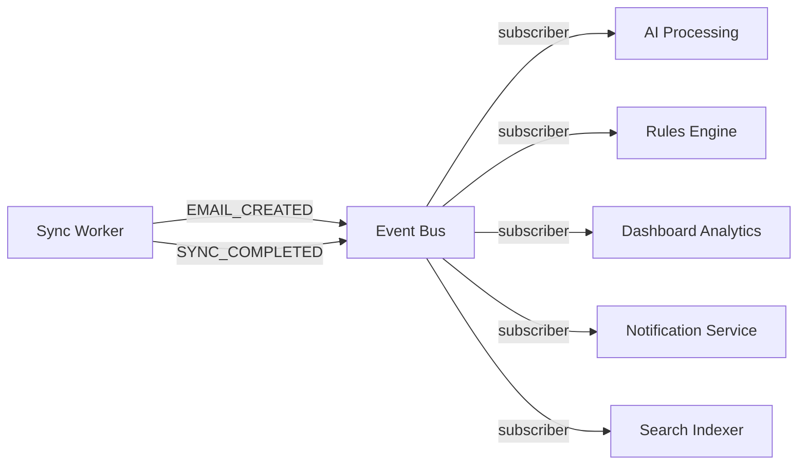

# MailSense Development Roadmap

##### **Type:** Master Plan · **Scope:** Full product feature roadmap

**Baseline:** v2.1.0 (post Background Sync)
**Status:** IN PROGRESS · **Created:** 2026-08-01 · **Last Updated:** 2026-08-08

This is the **master development roadmap** for MailSense. It defines the strategic feature sequence, priorities, and architectural direction for all future development. All recommendations are grounded in actual codebase analysis.

---

## How This Roadmap Works

This document is a **stable north-star plan** — not a living status tracker. It should only be updated when the strategic direction changes (phases added, reordered, or dropped). It does **not** need to be updated after every release.

### Document Hierarchy

```
mailsense/.agents/plans/
├── mailsense-development-roadmap.md            ← THIS FILE (master plan, rarely updated)
├── email-experience-completion/                ← Feature plan directory
│   ├── implementation-plan.md                  ← Feature high-level plan
│   └── types-implementation-plan.md            ← Shared types plan (@mailsense/types)
└── [future-feature]/                           ← Created before each new feature phase
```

| Document                 | Purpose                                                         | Update Frequency                    |
| ------------------------ | --------------------------------------------------------------- | ----------------------------------- |
| **This Roadmap**         | Strategic direction, phase ordering, feature scope              | Only when strategy changes          |
| **Implementation Plans** | Detailed file-level changes for each phase, created in `plans/` | One per phase, before starting work |
| **CHANGELOG.md**         | What shipped and when (user-facing release notes)               | Every release                       |
| **CODEBASE_INDEX.md**    | Current architecture and file map                               | After significant changes           |
| **features-list.md**     | Feature checklist with done/not-done status                     | After features complete             |

### Workflow Per Phase

1. Consult this roadmap to identify the next phase
2. Create a detailed implementation plan in `plans/` (e.g., `email-experience-completion-plan.md`)
3. Execute the implementation plan
4. Update `CHANGELOG.md`, `CODEBASE_INDEX.md`, and `features-list.md` upon completion
5. Move to the next phase

---

## Baseline: Implementation Status (as of v2.1.0)

> [!NOTE]
> This section is a **frozen snapshot** of the implementation state when this roadmap was created. It is not actively maintained. Check `CHANGELOG.md` and `features-list.md` for the current state.

### ✅ Fully Implemented

| #   | Feature Area                         | Status                                                                                                |
| --- | ------------------------------------ | ----------------------------------------------------------------------------------------------------- |
| 1   | **Authentication & User Management** | ✅ Auth0 OAuth, JWT sessions, profile CRUD, password change                                           |
| 2   | **Email Account Integrations**       | ✅ Gmail + Outlook OAuth 2.0, multi-account, enable/disable, sync controls                            |
| 3   | **Email Aggregation (Core Engine)**  | ✅ Unified inbox, per-account view, folder/label mapping, normalization, pagination, incremental sync |
| 4   | **Background Job Queue**             | ✅ BullMQ + Redis, sync workers, token refresh workers, event bus, scheduler, DLQ + retry             |
| 5   | **Compose Email**                    | ✅ Sender account selection, rich-text TipTap editor, contact suggestions, compose popup              |
| 6   | **Email Actions**                    | ✅ Mark read/unread, star/flag, delete/archive, multi-select bulk actions                             |
| 7   | **Search & Basic Filters**           | ✅ Subject/sender search, date range, account filter, folder filter, unread filter                    |
| 8   | **Folder / Label Management**        | ✅ Unified + per-account views, CRUD, provider sync, color support (Gmail)                            |
| 9   | **Settings**                         | ✅ Profile, password, dark/light mode, account sync settings (global + per-account)                   |
| 10  | **Responsive Design**                | ✅ Mobile + desktop layouts across inbox, accounts, email details, folders, settings                  |
| 11  | **Provider Strategy Pattern**        | ✅ `IEmailProvider` interface, factory pattern, Gmail + Outlook adapters                              |
| 12  | **Event-Driven Architecture**        | ✅ Internal event bus with `SYNC_COMPLETED` + `EMAIL_CREATED` events, typed payloads                  |
| 13  | **Security**                         | ✅ OAuth token encryption, secure refresh, data deletion on account removal                           |

### ❌ Not Implemented

| #   | Feature Area                 | Notes                                                                           |
| --- | ---------------------------- | ------------------------------------------------------------------------------- |
| 1   | **Thread/Conversation View** | `threadId` stored per email but no grouping API or UI                           |
| 2   | **Attachments**              | Zero implementation — no schema fields, no provider fetch, no UI                |
| 3   | **Drafts**                   | Outlook has `createDraft`/`sendDraft` API calls but no module, no schema, no UI |
| 4   | **Dashboard & Analytics**    | No dashboard page, no analytics endpoints, no charts                            |
| 5   | **AI Features (Gemini)**     | No AI service, no categorization, no priority scoring, no summarization         |
| 6   | **Notifications**            | No browser notifications, no notification center, no WebSocket/SSE              |
| 7   | **Custom Rules**             | No rules engine, no user-defined filters                                        |
| 8   | **Keyboard Shortcuts**       | None                                                                            |
| 9   | **Account Deletion (GDPR)**  | Backend has account delete but no full user data wipe flow                      |
| 10  | **Feature Flags**            | None                                                                            |
| 11  | **Logging & Monitoring**     | Basic pino logger exists, no structured metrics or health endpoint              |
| 12  | **Move to Folder/Label**     | Email actions don't include "move to folder"                                    |

---

## Prioritized Development Phases

### Phase 1: Email Experience Completion 🔴 HIGH PRIORITY

**Timeline:** 2–3 weeks · **Release Target:** v3.0.0

These are core email features that users expect from any modern email client. Without them, the product feels incomplete.

#### 1.1 Thread / Conversation View (✅ COMPLETED)

- **Why:** `threadId` is already stored on every email (Gmail `threadId`, Outlook `conversationId`). Users universally expect threaded conversations.
- **Backend:** `getEmailsByThreadId`, `getThreadSummaries`, `getGroupedEmails` in `EmailRepository`, `getThread` in `EmailService`, endpoint `GET /api/emails/thread/:emailId`
- **Frontend:** `ThreadView` component replacing single-email view, collapsible message cards per thread, `AttachmentList` per message
- **Status:** ✅ COMPLETED

#### 1.2 Attachments (Preview, Download Proxy & Staging Send Flow) (✅ COMPLETED)

- **Why:** A huge portion of emails have attachments. Without this, users must switch to their native email client.
- **Shared Types:** Added `attachments` field to `EmailAttributes` and `OutlookAttachmentObject` in `@mailsense/types` (v1.2.0)
- **Backend:** Extended `EmailSchema` with `attachments: [{ filename, mimeType, size, attachmentId }]`, parse attachments during sync (Gmail `payload.parts`, Outlook `getMessageAttachments` Graph API), `GET /api/emails/attachment/:emailId/:attachmentId` authenticated download proxy, Cloudflare R2 staging bucket integration (`mailsense-attachments-staging`), Base64URL MIME message generator for Gmail (`users.messages.send`), and Graph API chunked upload sessions (`createUploadSession`) for Outlook.
- **Frontend:** Attachment paperclip badge in email list (`AttachmentBadge`), attachment list with icons in email detail (`AttachmentList`), inline image preview modal, `axiosClient` authenticated download action, and file upload staging in Compose Modal.
- **Status:** ✅ COMPLETED

#### 1.3 Drafts System

- **Why:** Auto-saving compose state prevents data loss. Both Gmail and Outlook APIs support drafts natively.
- **Backend:** New `drafts` module (model, repository, service, controller, routes) — or extend emails with draft status. Gmail `drafts.create/update/send`, Outlook already has `createDraftMessage/sendDraftMessage`
- **Frontend:** Auto-save on compose (debounced), draft list in sidebar, resume draft editing
- **Effort:** Medium

#### 1.4 Move to Folder / Apply Label

- **Why:** Core email operation missing from actions. Backend folder CRUD exists, provider label/folder APIs exist, but no "move email to X" action.
- **Backend:** Add `moveEmails(emailIds, targetFolderId)` to `IEmailProvider` and both Gmail/Outlook providers
- **Frontend:** "Move to" dropdown in email action bar, folder picker component
- **Effort:** Low-Medium

---

### Phase 2: Dashboard & Analytics 🟡 MEDIUM PRIORITY

**Timeline:** 2 weeks · **Release Target:** v3.1.0

**Why now:** The background sync system + event bus make this achievable. `SYNC_COMPLETED` events carry `addedEmailsCount`/`deletedEmailsCount` data. `AccountMetrics` model already exists (though unused). This is the most visible "wow factor" feature.

#### 2.1 Dashboard Overview Page

- **Backend:** New `analytics` module with aggregation pipelines — total emails, unread count, emails per day/week/month, top senders
- **Frontend:** Dashboard route `/dashboard`, overview cards, email volume chart (recharts), top senders list
- **Effort:** Medium

#### 2.2 Account Metrics Collection

- **Backend:** Subscribe to `SYNC_COMPLETED` events to update `AccountMetrics` collection, aggregate across accounts for dashboard
- **Effort:** Low (event bus subscriber pattern is established)

#### 2.3 Response Time Analytics

- **Backend:** Calculate average response time from sent-email timestamps vs received-email timestamps per thread
- **Frontend:** Response time chart on dashboard
- **Effort:** Medium

---

### Phase 3: AI Foundation & Core AI (Gemini) 🟡 MEDIUM-HIGH PRIORITY

**Timeline:** 3–4 weeks · **Release Target:** v3.2.0

**Why now:** The event-driven architecture (event bus + background workers) is the prerequisite for AI — and it's done. The `EMAIL_CREATED` event already fires for every synced email, making it the perfect trigger point for AI processing pipelines.

#### 3.1 AI Service Infrastructure

- **Backend:** Install `@google/generative-ai`, create `AIService` under `src/integrations/ai/`, add `GEMINI_API_KEY` to env config, create AI worker subscribing to `EMAIL_CREATED` events
- **Shared Types:** Add AI-related fields to `EmailAttributes` (`aiCategory`, `aiPriority`, `aiSummary`, `aiTags`)
- **Feature Flags:** Simple config-based feature flag system (`FEATURE_AI_ENABLED`, per-feature toggles)
- **Effort:** Medium

#### 3.2 Smart Categorization

- **Implementation:** Classify emails into Work, Personal, Finance, Social, Promotions, Updates using Gemini
- **Backend:** Process in AI worker queue, store category on email document, batch processing to minimize API calls
- **Frontend:** Category labels/badges on email list, filter by category
- **Effort:** Medium

#### 3.3 Priority Scoring

- **Implementation:** Score emails as Critical / High / Normal / Low priority
- **Backend:** Priority field on email, computed by AI worker, cacheable prompt templates
- **Frontend:** Priority indicator in email list, "Priority Inbox" view
- **Effort:** Medium

#### 3.4 Email Summarization

- **Implementation:** One-line summaries for quick scanning, on-demand full summaries for long threads
- **Backend:** Summary field on email, generated during sync or on-demand API
- **Frontend:** Summary preview in email list hover, "Summarize" button in email detail
- **Effort:** Low-Medium

#### 3.5 Suggested Replies

- **Implementation:** 2–3 contextual reply suggestions per email
- **Backend:** `POST /emails/:emailId/suggestions` endpoint, generated on-demand via Gemini
- **Frontend:** Suggestion chips below email body, click-to-compose flow
- **Effort:** Medium

#### 3.6 AI Settings & Privacy Controls

- **Backend:** Add AI settings to User model, per-account AI toggle, consent tracking
- **Frontend:** AI settings page with global + per-account controls
- **Effort:** Low

---

### Phase 4: Custom Rules Engine 🟡 MEDIUM PRIORITY

**Timeline:** 2 weeks · **Release Target:** v3.3.0

**Why now:** Listed as "VERY IMPORTANT FEATURE" in the features list. The background sync pipeline makes rule execution during sync natural — subscribe to `EMAIL_CREATED`, evaluate rules, apply labels.

#### 4.1 Rules Module

- **Backend:** New `rules` module — `Rule` model (conditions + actions), CRUD endpoints, rule execution engine
- **Conditions:** sender matches, subject contains, domain equals, body contains
- **Actions:** apply label, move to folder, mark as read, star, archive
- **Execution:** During sync via event subscriber, optionally hybrid with AI categorization

#### 4.2 Rules Management UI

- **Frontend:** Rules page under settings, rule builder (condition → action), test rule against existing emails, enable/disable individual rules
- **Effort:** Medium-High (UI builder is complex)

---

### Phase 5: Notifications System 🟡 MEDIUM PRIORITY

**Timeline:** 2 weeks · **Release Target:** v3.4.0

**Why now:** `EMAIL_CREATED` events are the perfect trigger for notifications. The infrastructure exists.

#### 5.1 Real-Time Notifications

- **Backend:** SSE (Server-Sent Events) endpoint for push notifications — lighter than WebSocket for this use case. Notification service subscribing to `EMAIL_CREATED` (for new emails) and AI events (for important mail alerts)
- **Frontend:** `EventSource` connection, browser notification permission, notification toast

#### 5.2 Notification Center

- **Backend:** `Notification` model + CRUD, store in MongoDB
- **Frontend:** Notification bell in header, dropdown panel with notification list, mark read/clear all
- **Per-account toggle** in account settings

---

### Phase 6: UX Polish & Power Features 🟢 LOWER PRIORITY

**Timeline:** 1–2 weeks · **Release Target:** v3.5.0

#### 6.1 Keyboard Shortcuts

- Global shortcut manager hook (`useKeyboardShortcuts`)
- Essential shortcuts: C (compose), R (reply), E (archive), # (delete), S (star), U (unread), J/K (navigate), ? (help)
- Shortcut help modal

#### 6.2 Enhanced Loading & Empty States

- Skeleton components already exist (`skeleton.tsx` in shared/ui) but are minimally used
- Add email list skeletons, folder skeletons, account card skeletons
- Add empty state illustrations for no emails, no accounts, no search results

#### 6.3 Infinite Scroll / Virtual Scrolling

- Replace pagination with infinite scroll option
- Use `react-virtual` or `@tanstack/react-virtual` for large email lists
- Toggle in settings between pagination and infinite scroll

---

### Phase 7: Advanced AI & Intelligence 🔵 STRETCH

**Timeline:** 3+ weeks · **Release Target:** v4.0.0

#### 7.1 Natural Language Search

- "Show me invoices from last month" → translate to structured query via Gemini
- Enhance existing search endpoint to accept NL queries

#### 7.2 AI Auto-Tagging

- Invoice, Meeting, Receipt, Newsletter, Shipping detection
- Tags stored on email, filterable

#### 7.3 Smart Reminders

- "Reply pending" / "Follow-up needed" detection
- Reminder system with scheduled notifications

#### 7.4 Action Extraction

- Detect tasks/events embedded in email content
- Display as actionable cards

#### 7.5 Weekly AI Digest

- Generated summary of the week's important emails, top contacts, missed responses
- Scheduled job running weekly

#### 7.6 Spam / Phishing Detection

- AI-assisted suspicious email flagging
- Warning banners in email detail view

---

### Phase 8: Developer & Production Readiness 🔵 ONGOING

**Timeline:** Continuous · **Integrated across releases**

#### 8.1 Structured Logging & Monitoring

- Enhance pino logger with structured JSON output, correlation IDs
- Health check endpoint (`GET /health`)
- Prometheus-compatible metrics endpoint (`GET /metrics`)

#### 8.2 Feature Flags

- Config-driven feature flag system (JSON or env-based)
- Frontend feature flag hook for conditional UI rendering
- Gate all AI features behind flags

#### 8.3 GDPR Account Deletion

- Full user data wipe flow (all accounts, emails, folders, sync jobs, metrics, settings, user record)
- Confirmation flow in UI, cascading delete in backend

---

## Architecture Advantages Unlocked by Background Sync

The completed BullMQ + event bus architecture opens these patterns:



Every future feature plugs into the existing event system as a subscriber — **zero changes to the sync pipeline**.

---

## Technical Dependencies By Phase

| Phase                   | New Backend Deps         | New Frontend Deps                    | New Infra      |
| ----------------------- | ------------------------ | ------------------------------------ | -------------- |
| **1. Email Experience** | —                        | —                                    | —              |
| **2. Dashboard**        | —                        | `recharts`                           | —              |
| **3. AI Foundation**    | `@google/generative-ai`  | —                                    | Gemini API key |
| **4. Custom Rules**     | —                        | —                                    | —              |
| **5. Notifications**    | —                        | —                                    | —              |
| **6. UX Polish**        | —                        | `@tanstack/react-virtual` (optional) | —              |
| **7. Advanced AI**      | —                        | —                                    | —              |
| **8. Production**       | `prom-client` (optional) | —                                    | —              |

---

## Release Timeline Summary

| Release    | Phase                                                | Target       | Est. Duration |
| ---------- | ---------------------------------------------------- | ------------ | ------------- |
| **v3.0.0** | Email Experience (Thread, Attachments, Drafts, Move) | Aug–Sep 2026 | 2–3 weeks     |
| **v3.1.0** | Dashboard & Analytics                                | Sep 2026     | 2 weeks       |
| **v3.2.0** | AI Foundation + Core AI MVP                          | Sep–Oct 2026 | 3–4 weeks     |
| **v3.3.0** | Custom Rules Engine                                  | Oct 2026     | 2 weeks       |
| **v3.4.0** | Notifications System                                 | Oct–Nov 2026 | 2 weeks       |
| **v3.5.0** | UX Polish (Keyboard, Skeletons, Virtual Scroll)      | Nov 2026     | 1–2 weeks     |
| **v4.0.0** | Advanced AI + Production Readiness                   | Nov–Dec 2026 | 3+ weeks      |

**Total Estimated Duration: ~16–18 weeks**

---

## Risk Register

| Risk                                                  | Impact | Mitigation                                                                         |
| ----------------------------------------------------- | ------ | ---------------------------------------------------------------------------------- |
| Gemini API costs at scale                             | HIGH   | Batch processing, response caching, user opt-in, rate limiting                     |
| Resource constraints (0.1 vCPU, 256MB)                | MEDIUM | Worker concurrency limits (already configured), stream pagination, lazy loading    |
| Gmail/Outlook API rate limits during attachment fetch | MEDIUM | Attachment fetch on-demand (not during sync), provider-specific rate limit headers |
| Complex rules engine UI                               | MEDIUM | Start with simple condition→action pairs, iterate to visual builder                |
| SSE connection stability                              | LOW    | Auto-reconnect in EventSource, fallback to polling                                 |

---

## Success Criteria Per Phase

Each phase should deliver:

- ✅ Working implementation with automated tests
- ✅ Updated `@mailsense/types` contracts where applicable
- ✅ Updated `CODEBASE_INDEX.md` and `CHANGELOG.md`
- ✅ Updated `features-list.md` (mark completed features as done)
- ✅ Performance validation under resource constraints
- ✅ No regressions in existing functionality
- ✅ Archived implementation plan in `plans/` for future reference
