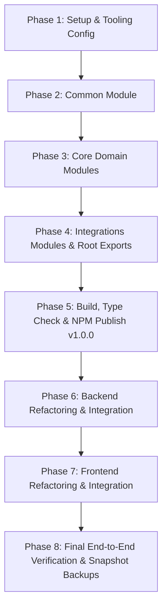

# Implementation Phases: `@vishaljagamani/mailsense-types` Library & Integration

This document outlines the step-by-step implementation phases for extracting, publishing, and integrating the `@vishaljagamani/mailsense-types` NPM package into the MailSense ecosystem.

---

## Phase Overview & Checklist

---

## Phase 1: Repository Setup & Tooling Configuration

**Goal**: Initialize the standalone `mailsense-types` repository structure, dual ESM/CJS build system, subpath exports, and Git branching workflow.

### Tasks
- [ ] Initialize repository structure with `package.json`, `tsconfig.json`, `tsup.config.ts`, `.gitignore`, `README.md`, and `LICENSE`.
- [ ] Configure `package.json` for public NPM package `@vishaljagamani/mailsense-types` with `publishConfig.access: "public"`.
- [ ] Setup `package.json` `"exports"` subpaths:
  - `.` -> `./dist/index.d.ts`, `./dist/index.js`, `./dist/index.cjs`
  - `./common` -> `./dist/common/index.d.ts`, `./dist/common/index.js`, `./dist/common/index.cjs`
  - `./accounts` -> `./dist/accounts/index.d.ts`, `./dist/accounts/index.js`, `./dist/accounts/index.cjs`
  - `./emails` -> `./dist/emails/index.d.ts`, `./dist/emails/index.js`, `./dist/emails/index.cjs`
  - `./folders` -> `./dist/folders/index.d.ts`, `./dist/folders/index.js`, `./dist/folders/index.cjs`
  - `./user` -> `./dist/user/index.d.ts`, `./dist/user/index.js`, `./dist/user/index.cjs`
  - `./providers` -> `./dist/providers/index.d.ts`, `./dist/providers/index.js`, `./dist/providers/index.cjs`
  - `./events` -> `./dist/events/index.d.ts`, `./dist/events/index.js`, `./dist/events/index.cjs`
  - `./workers` -> `./dist/workers/index.d.ts`, `./dist/workers/index.js`, `./dist/workers/index.cjs`
- [ ] Setup GitHub Actions workflow `.github/workflows/publish.yml` for automated NPM release upon git tag push.
- [ ] Initialize Git branches: `main`, `develop`, and initial snapshot `backup/v1.0.0-initial`.

---

## Phase 2: Base Infrastructure Module (`common`)

**Goal**: Build the shared `common` module with dedicated files for constants, enums, interfaces, and types.

### Tasks
- [ ] Create `src/common/common.constants.ts` (Pagination default constants like `DEFAULT_PAGE_SIZE = 20`).
- [ ] Create `src/common/common.enums.ts`:
  - `DATE_RANGE` (`TODAY`, `LAST_WEEK`, `LAST_MONTH`, `LAST_3_MONTHS`, `ALL_TIME`)
  - `FilterOptionType` (`STRING`, `TOGGLE`, `DROPDOWN`)
- [ ] Create `src/common/common.interfaces.ts`:
  - `APIResponse<T>`
  - `PaginatedDataResponse<T>`
  - `UpdateAPIResponse`
  - `SuccessAPIResponse`
  - `Filter`
  - `FilterOption`
  - `FilterOptionData`
- [ ] Create `src/common/common.types.ts` (Shared generic type aliases).
- [ ] Create `src/common/index.ts` (Barrel export re-exporting all `common` files).

---

## Phase 3: Core Domain Modules (`accounts`, `emails`, `folders`, `user`)

**Goal**: Implement modular domain files with clean file separation per module.

### Tasks
- [ ] **`accounts` Module (`src/accounts/`)**:
  - [ ] `accounts.constants.ts`: Provider constants (`SUPPORTED_ACCOUNT_PROVIDERS`).
  - [ ] `accounts.enums.ts`: `AccountProvider`, `ACCOUNT_LAST_SYNC_STATUS`, `ACCOUNT_SYNC_JOB_STATUS`, `ACCOUNT_SYNC_JOB_TRIGGER_TYPE`.
  - [ ] `accounts.interfaces.ts`: `AccountProviderType`, `AccountAttributes`, `AccountMetricsAttributes`, `SyncJobAttributes`, `GetAccountsResponse`, `GetAccountEmailsResponse`, OAuth DTOs (`GmailOAuthAccessTokenResponse`, `OutlookOAuthAccessTokenResponse`).
  - [ ] `accounts.types.ts`: `AccountId`.
  - [ ] `index.ts`: Barrel export.

- [ ] **`emails` Module (`src/emails/`)**:
  - [ ] `emails.constants.ts`: Email search and default sort constants.
  - [ ] `emails.enums.ts`: `EmailSearchSortOrder`.
  - [ ] `emails.interfaces.ts`: `Email` / `EmailAttributes`, `EmailListDTO`, `FetchEmailRequestOptions`, `SearchEmailsParams`, `GetAllEmailsFilters`, `ComposeEmailRequestBody`, `SearchOtherContactsResponse`, `GetFiltersResponse`, `GetEmailsResponse`.
  - [ ] `emails.types.ts`: `EmailId`, `RecipientAddress`.
  - [ ] `index.ts`: Barrel export.

- [ ] **`folders` Module (`src/folders/`)**:
  - [ ] `folders.constants.ts`: System folder roles list.
  - [ ] `folders.enums.ts`: `FolderKind` (`SYSTEM`, `CUSTOM`), `FolderRole` (`INBOX`, `SENT`, `DRAFTS`, etc.).
  - [ ] `folders.interfaces.ts`: `FolderAttributes`, `GetAllFoldersRequestOptions`, `GetAllFoldersFilters`, `CreateFolderBodyParams`.
  - [ ] `folders.types.ts`: `FolderId`.
  - [ ] `index.ts`: Barrel export.

- [ ] **`user` Module (`src/user/`)**:
  - [ ] `user.constants.ts`: User module constants.
  - [ ] `user.enums.ts`: User status enums.
  - [ ] `user.interfaces.ts`: `User`, `UserDetailsObject` (Auth0), `UpdatePasswordResponseObject`, `ProfileSettingsDataObject`, `UpdateUserProfileSettingsResponse`.
  - [ ] `user.types.ts`: `UserId`.
  - [ ] `index.ts`: Barrel export.

---

## Phase 4: Integrations Modules & Root Exports (`providers`, `events`, `workers`)

**Goal**: Complete provider payload structures, event payloads, worker job result interfaces, and root index export.

### Tasks
- [ ] **`providers` Module (`src/providers/`)**:
  - [ ] `gmail.enums.ts`: `GMAIL_LABELS`, `GmailLabelType`, `GmailLabelMessageListVisibility`, `GmailLabelLabelListVisibility`.
  - [ ] `gmail.interfaces.ts`: `GmailUserProfile`, `GmailMessages`, `GmailMessageObjectFull`, `GmailHistoryRecord`, `GmailHistoryResponse`, `GmailLabel`, `GooglePerson`, `GoogleOtherContactsSearchResponse`.
  - [ ] `outlook.enums.ts`: `OutlookFolders`, `OutlookMessageRemovedReason`.
  - [ ] `outlook.interfaces.ts`: `OutlookUserProfile`, `OutlookMessageObjectFull`, `OutlookMessagesResponse`.
  - [ ] `provider.interfaces.ts`: `EmailSyncResult`, `IEmailTAuthToken`, `IEmailTUserProfile`, `IEmailTSendEmailResult`.
  - [ ] `provider.types.ts`: Provider union types.
  - [ ] `index.ts`: Barrel export.

- [ ] **`events` Module (`src/events/`)**:
  - [ ] `events.enums.ts`: `SystemEvent` (`sync:completed`, `email:created`).
  - [ ] `events.interfaces.ts`: `SyncCompletedPayload`, `EmailCreatedPayload`, `SystemEventPayloads`.
  - [ ] `index.ts`: Barrel export.

- [ ] **`workers` Module (`src/workers/`)**:
  - [ ] `workers.interfaces.ts`: `SyncJobResult`.
  - [ ] `index.ts`: Barrel export.

- [ ] **Root Barrel Export (`src/index.ts`)**:
  - [ ] Re-export all submodules (`common`, `accounts`, `emails`, `folders`, `user`, `providers`, `events`, `workers`).

---

## Phase 5: Build, Type Verification & Initial NPM Release (`v1.0.0`)

**Goal**: Build the bundle, verify ESM/CJS outputs, push to GitHub, and publish to NPM.

### Tasks
- [ ] Run `npm run type-check` (`tsc --noEmit`).
- [ ] Run `npm run build` (`tsup`).
- [ ] Verify `dist/` directory output: `dist/index.js`, `dist/index.cjs`, `dist/index.d.ts`, and subpath declaration files.
- [ ] Commit all changes to `develop` branch.
- [ ] Create pull request `develop` -> `main`.
- [ ] Tag git commit `v1.0.0` on `main`.
- [ ] Publish `@vishaljagamani/mailsense-types` to NPM (`npm publish --access public`).
- [ ] Push backup snapshot branch `backup/v1.0.0-snapshot`.

---

## Phase 6: Backend Refactoring & Integration

**Goal**: Integrate `@vishaljagamani/mailsense-types` into `Backend` and remove duplicate backend type definitions.

### Tasks
- [ ] Add dependency to `Backend/package.json`: `"@vishaljagamani/mailsense-types": "^1.0.0"`.
- [ ] Run `pnpm install` in `Backend/`.
- [ ] Update imports across `Backend/src/`:
  - Replace imports from `Backend/src/core/types/*` with `@vishaljagamani/mailsense-types` imports.
  - Replace imports from `Backend/src/modules/*/*.types.ts` with `@vishaljagamani/mailsense-types` imports.
  - Replace imports from `Backend/src/integrations/*/*.types.ts` with `@vishaljagamani/mailsense-types` imports.
- [ ] Remove obsolete duplicate type files in `Backend/src`.
- [ ] Run `pnpm type-check` and `pnpm build` in `Backend/` to verify zero type errors or broken references.
- [ ] Run `pnpm test` in `Backend/` to ensure all tests pass.

---

## Phase 7: Frontend Refactoring & Integration

**Goal**: Integrate `@vishaljagamani/mailsense-types` into `Frontend` and remove duplicate frontend type definitions.

### Tasks
- [ ] Add dependency to `Frontend/package.json`: `"@vishaljagamani/mailsense-types": "^1.0.0"`.
- [ ] Run `pnpm install` in `Frontend/`.
- [ ] Update imports across `Frontend/src/`:
  - Replace imports from `Frontend/src/shared/types/*` with `@vishaljagamani/mailsense-types` imports.
  - Replace imports from `Frontend/src/entities/*/*/types.ts` with `@vishaljagamani/mailsense-types` imports.
- [ ] Remove obsolete duplicate type files in `Frontend/src` (retaining UI-only component props).
- [ ] Run `pnpm dev` and `pnpm build` in `Frontend/` to verify clean compilation.

---

## Phase 8: End-to-End Verification, Documentation & Backup Snapshots

**Goal**: Validate full end-to-end platform functionality, update documentation, and create final integration backup snapshot branches.

### Tasks
- [ ] Test full account connection, sync job execution, email search, folder creation, and user profile management end-to-end.
- [ ] Update repository `README.md` with package usage examples for `@vishaljagamani/mailsense-types`.
- [ ] Create snapshot backup branch `backup/mailsense-types-integration-complete` in the main `mailsense` repository.
