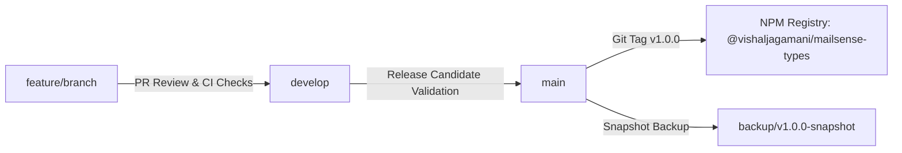

# Technical Design & Implementation Plan: `@vishaljagamani/mailsense-types` Common Types NPM Package

## Executive Summary

Currently, TypeScript interfaces, DTOs, enums, type aliases, and request/response models are duplicated across the `Backend/` and `Frontend/` directories in the `mailsense` repository. This leads to type drift, duplicate definitions, inconsistent naming conventions, and unnecessary maintenance overhead.

This document details the updated design, module segregation, directory file structure per module, Git branching and backup strategy, package configuration, and migration roadmap for publishing the common types package: **`@vishaljagamani/mailsense-types`**.

---

## 1. Package Name & Scope

- **Official Public NPM Package Name**: `@vishaljagamani/mailsense-types`
- **NPM Organization/User Scope**: `@vishaljagamani`
- **Visibility**: Public NPM Package (`publishConfig.access: "public"`)
- **Primary Goal**: Centralize all shared constants, enums, interfaces, type aliases, and DTOs for the MailSense ecosystem with zero runtime dependencies.

---

## 2. Granular Module File Architecture & Segregation Strategy

To adhere to strict modular separation and clean architecture, **each module inside `src/` will maintain dedicated files** for:
- `*.constants.ts` (Literal arrays, default config values, constant mappings)
- `*.enums.ts` (TypeScript enums emitting JS objects at runtime)
- `*.interfaces.ts` (TypeScript interface contracts for entities, payloads, responses)
- `*.types.ts` (Type aliases, union types, generic utility types)
- `index.ts` (Module barrel export re-exporting all constants, enums, interfaces, and types)

### Module Breakdown & Item Mapping

#### Module 1: `common` (`@vishaljagamani/mailsense-types/common`)
*Shared API wrappers, generic pagination, utility types, and global enums.*
- **`common.enums.ts`**:
  - `DATE_RANGE` (`TODAY`, `LAST_WEEK`, `LAST_MONTH`, `LAST_3_MONTHS`, `ALL_TIME`)
  - `FilterOptionType` (`STRING`, `TOGGLE`, `DROPDOWN`)
- **`common.interfaces.ts`**:
  - `APIResponse<T>` (`status: boolean`, `message: string`, `data: T`)
  - `PaginatedDataResponse<T>` (`data: T[]`, `size: number`, `page: number`, `total: number`)
  - `UpdateAPIResponse` (`status: boolean`, `message: string`)
  - `SuccessAPIResponse` (`status: boolean`, `message: string`)
  - `Filter` (`searchText`, `accountId`, `dateRange`, `folders`, `unread`)
  - `FilterOption`, `FilterOptionData`
- **`common.types.ts`**:
  - Generic pagination params, HTTP response helpers.
- **`common.constants.ts`**:
  - Default pagination limits (`DEFAULT_PAGE_SIZE = 20`).
- **`index.ts`**:
  - Re-exports `* from './common.enums.js'`, `* from './common.interfaces.js'`, `* from './common.types.js'`, `* from './common.constants.js'`.

#### Module 2: `accounts` (`@vishaljagamani/mailsense-types/accounts`)
*Account entities, provider connections, sync statuses, and sync jobs.*
- **`accounts.enums.ts`**:
  - `AccountProvider` (`GMAIL = 'gmail'`, `OUTLOOK = 'outlook'`)
  - `ACCOUNT_LAST_SYNC_STATUS` (`PENDING`, `SUCCESS`, `FAILED`)
  - `ACCOUNT_SYNC_JOB_STATUS` (`PENDING`, `RUNNING`, `COMPLETED`, `FAILED`)
  - `ACCOUNT_SYNC_JOB_TRIGGER_TYPE` (`MANUAL`, `SCHEDULED`)
- **`accounts.interfaces.ts`**:
  - `AccountProviderType` (`id`, `name`, `displayName`)
  - `AccountAttributes` (Main account entity model/DTO)
  - `AccountMetricsAttributes` (Counters for emails, folders, contacts)
  - `SyncJobAttributes` (Background sync job execution record)
  - `GetAccountsResponse`, `GetAccountEmailsResponse`
  - `GmailOAuthAccessTokenResponse`, `OutlookOAuthAccessTokenResponse`
  - `GmailOAuthCallbackParams`, `OutlookOAuthCallbackParams`
- **`accounts.types.ts`**:
  - `AccountId` (type alias for `string`), `ProviderType`
- **`accounts.constants.ts`**:
  - Supported account provider constants list (`SUPPORTED_ACCOUNT_PROVIDERS`)
- **`index.ts`**:
  - Barrel export for accounts module.

#### Module 3: `emails` (`@vishaljagamani/mailsense-types/emails`)
*Email entities, compose payloads, search parameters, and filters.*
- **`emails.enums.ts`**:
  - `EmailSearchSortOrder` (`ASC`, `DESC`)
- **`emails.interfaces.ts`**:
  - `Email` / `EmailAttributes` (Core email entity)
  - `EmailListDTO` (Lightweight email summary)
  - `FetchEmailRequestOptions`, `SearchEmailsParams`, `GetAllEmailsFilters`
  - `ComposeEmailRequestBody`
  - `SearchOtherContactsResponse`
  - `GetFiltersResponse`, `GetEmailsResponse`
- **`emails.types.ts`**:
  - `EmailId` (type alias), `RecipientAddress` (`string | string[]`)
- **`emails.constants.ts`**:
  - Default email list fields, max search query length.
- **`index.ts`**:
  - Barrel export for emails module.

#### Module 4: `folders` (`@vishaljagamani/mailsense-types/folders`)
*Folder entities, system roles, and folder management requests.*
- **`folders.enums.ts`**:
  - `FolderKind` (`SYSTEM`, `CUSTOM`)
  - `FolderRole` (`INBOX`, `SENT`, `DRAFTS`, `TRASH`, `SPAM`, `ARCHIVE`, `STARRED`, `IMPORTANT`, `OTHER`)
- **`folders.interfaces.ts`**:
  - `FolderAttributes`
  - `GetAllFoldersRequestOptions`, `GetAllFoldersFilters`
  - `CreateFolderBodyParams`
- **`folders.types.ts`**:
  - `FolderId` (type alias)
- **`folders.constants.ts`**:
  - System folder role list (`SYSTEM_FOLDER_ROLES`)
- **`index.ts`**:
  - Barrel export for folders module.

#### Module 5: `user` (`@vishaljagamani/mailsense-types/user`)
*User entity, Auth0 user details, and profile settings.*
- **`user.enums.ts`**:
  - `UserRole` / `UserAccountStatus`
- **`user.interfaces.ts`**:
  - `User` (`id`, `name`, `email`, `profilePicture`)
  - `UserDetailsObject` (Auth0 full user object)
  - `UpdatePasswordResponseObject`
  - `ProfileSettingsDataObject`, `UpdateUserProfileSettingsResponse`
- **`user.types.ts`**:
  - `UserId` (type alias)
- **`user.constants.ts`**:
  - User constants.
- **`index.ts`**:
  - Barrel export for user module.

#### Module 6: `providers` (`@vishaljagamani/mailsense-types/providers`)
*Provider-specific payload interfaces and provider strategy abstractions.*
- **`gmail.enums.ts`**:
  - `GMAIL_LABELS`, `GmailLabelType`, `GmailLabelMessageListVisibility`, `GmailLabelLabelListVisibility`
- **`gmail.interfaces.ts`**:
  - `GmailUserProfile`, `GmailMessages`, `GmailMessageObjectFull`, `GmailHistoryRecord`, `GmailHistoryResponse`, `GmailLabel`, `GooglePerson`, `GoogleOtherContactsSearchResponse`
- **`outlook.enums.ts`**:
  - `OutlookFolders`, `OutlookMessageRemovedReason`
- **`outlook.interfaces.ts`**:
  - `OutlookUserProfile`, `OutlookMessageObjectFull`, `OutlookMessagesResponse`
- **`provider.interfaces.ts`**:
  - `EmailSyncResult`, `IEmailTAuthToken`, `IEmailTUserProfile`, `IEmailTSendEmailResult`
- **`index.ts`**:
  - Barrel export for providers module.

#### Module 7: `events` (`@vishaljagamani/mailsense-types/events`)
*System event bus names and payload definitions.*
- **`events.enums.ts`**:
  - `SystemEvent` (`sync:completed`, `email:created`)
- **`events.interfaces.ts`**:
  - `SyncCompletedPayload`, `EmailCreatedPayload`, `SystemEventPayloads`
- **`index.ts`**:
  - Barrel export for events module.

#### Module 8: `workers` (`@vishaljagamani/mailsense-types/workers`)
*Background worker job result definitions.*
- **`workers.interfaces.ts`**:
  - `SyncJobResult`
- **`index.ts`**:
  - Barrel export for workers module.

---

## 3. Git Branching & Backup Strategy

To maintain high stability and mirror the practices used in the `https://github.com/vishal-jagamani/mailsense` repository:

### Recommended Branch Hierarchy
1. **`main`**: Production release branch. Reflects the published code on NPM. Every push or tag here triggers an automated NPM release.
2. **`develop`**: Integration branch for upcoming changes before release candidate testing.
3. **`feature/*` / `fix/*`**: Ephemeral feature and bug fix branches created off `develop`.
4. **`backup/*`** (e.g. `backup/v1.0.0-snapshot`, `backup/pre-refactor-2026`): Snapshot backup branches pushed prior to major refactoring or breaking releases to ensure full rollback capabilities and historical integrity.

### Release & CI/CD Workflow


---

## 4. Library Directory Structure (Best & Latest Practices)

```
mailsense-types/
├── .github/
│   └── workflows/
│       ├── publish.yml              # NPM Publish pipeline on release/tag
│       └── build-test.yml           # Type-check and build validation on PRs
├── src/
│   ├── common/
│   │   ├── common.constants.ts
│   │   ├── common.enums.ts
│   │   ├── common.interfaces.ts
│   │   ├── common.types.ts
│   │   └── index.ts
│   ├── accounts/
│   │   ├── accounts.constants.ts
│   │   ├── accounts.enums.ts
│   │   ├── accounts.interfaces.ts
│   │   ├── accounts.types.ts
│   │   └── index.ts
│   ├── emails/
│   │   ├── emails.constants.ts
│   │   ├── emails.enums.ts
│   │   ├── emails.interfaces.ts
│   │   ├── emails.types.ts
│   │   └── index.ts
│   ├── folders/
│   │   ├── folders.constants.ts
│   │   ├── folders.enums.ts
│   │   ├── folders.interfaces.ts
│   │   ├── folders.types.ts
│   │   └── index.ts
│   ├── user/
│   │   ├── user.constants.ts
│   │   ├── user.enums.ts
│   │   ├── user.interfaces.ts
│   │   ├── user.types.ts
│   │   └── index.ts
│   ├── providers/
│   │   ├── gmail.enums.ts
│   │   ├── gmail.interfaces.ts
│   │   ├── outlook.enums.ts
│   │   ├── outlook.interfaces.ts
│   │   ├── provider.interfaces.ts
│   │   ├── provider.types.ts
│   │   └── index.ts
│   ├── events/
│   │   ├── events.enums.ts
│   │   ├── events.interfaces.ts
│   │   └── index.ts
│   ├── workers/
│   │   ├── workers.interfaces.ts
│   │   └── index.ts
│   └── index.ts                     # Root barrel export
├── .gitignore
├── .npmignore
├── LICENSE
├── README.md                        # Usage documentation with import examples
├── package.json                     # Dual package exports configuration
├── tsconfig.json                    # Strict TypeScript configuration
└── tsup.config.ts                   # Modern esbuild-based bundling configuration
```

---

## 5. Modern `package.json` Configuration (`@vishaljagamani/mailsense-types`)

```json
{
  "name": "@vishaljagamani/mailsense-types",
  "version": "1.0.0",
  "description": "Shared TypeScript constants, enums, interfaces, and types for MailSense services",
  "type": "module",
  "main": "./dist/index.cjs",
  "module": "./dist/index.js",
  "types": "./dist/index.d.ts",
  "files": [
    "dist"
  ],
  "publishConfig": {
    "access": "public"
  },
  "exports": {
    ".": {
      "types": "./dist/index.d.ts",
      "import": "./dist/index.js",
      "require": "./dist/index.cjs"
    },
    "./common": {
      "types": "./dist/common/index.d.ts",
      "import": "./dist/common/index.js",
      "require": "./dist/common/index.cjs"
    },
    "./accounts": {
      "types": "./dist/accounts/index.d.ts",
      "import": "./dist/accounts/index.js",
      "require": "./dist/accounts/index.cjs"
    },
    "./emails": {
      "types": "./dist/emails/index.d.ts",
      "import": "./dist/emails/index.js",
      "require": "./dist/emails/index.cjs"
    },
    "./folders": {
      "types": "./dist/folders/index.d.ts",
      "import": "./dist/folders/index.js",
      "require": "./dist/folders/index.cjs"
    },
    "./user": {
      "types": "./dist/user/index.d.ts",
      "import": "./dist/user/index.js",
      "require": "./dist/user/index.cjs"
    },
    "./providers": {
      "types": "./dist/providers/index.d.ts",
      "import": "./dist/providers/index.js",
      "require": "./dist/providers/index.cjs"
    },
    "./events": {
      "types": "./dist/events/index.d.ts",
      "import": "./dist/events/index.js",
      "require": "./dist/events/index.cjs"
    },
    "./workers": {
      "types": "./dist/workers/index.d.ts",
      "import": "./dist/workers/index.js",
      "require": "./dist/workers/index.cjs"
    }
  },
  "scripts": {
    "build": "tsup",
    "dev": "tsup --watch",
    "type-check": "tsc --noEmit",
    "lint": "eslint src",
    "prepublishOnly": "npm run build"
  },
  "keywords": [
    "mailsense",
    "typescript",
    "types",
    "enums",
    "interfaces",
    "email"
  ],
  "author": "Vishal Jagamani",
  "license": "MIT",
  "devDependencies": {
    "tsup": "^8.3.6",
    "typescript": "^5.9.3"
  }
}
```

---

## 6. Build Configuration (`tsup.config.ts`)

```typescript
import { defineConfig } from 'tsup';

export default defineConfig({
  entry: [
    'src/index.ts',
    'src/common/index.ts',
    'src/accounts/index.ts',
    'src/emails/index.ts',
    'src/folders/index.ts',
    'src/user/index.ts',
    'src/providers/index.ts',
    'src/events/index.ts',
    'src/workers/index.ts',
  ],
  format: ['cjs', 'esm'],
  dts: true,
  splitting: false,
  sourcemap: true,
  clean: true,
  minify: false,
});
```

---

## 7. Migration Roadmap for MailSense Monorepo

1. **Step 1**: Initialize GitHub repo `vishal-jagamani/mailsense-types` with `main`, `develop`, and `backup/*` branches.
2. **Step 2**: Implement modular files for each module under `src/` (`*.constants.ts`, `*.enums.ts`, `*.interfaces.ts`, `*.types.ts`, `index.ts`).
3. **Step 3**: Verify dual ESM/CJS build with `npm run build` (`tsup`) and `npm run type-check`.
4. **Step 4**: Publish `@vishaljagamani/mailsense-types@1.0.0` to NPM public registry.
5. **Step 5**: Update `Backend/package.json` and `Frontend/package.json` to include `"@vishaljagamani/mailsense-types": "^1.0.0"`.
6. **Step 6**: Refactor `Backend/src` and `Frontend/src` files to import directly from `@vishaljagamani/mailsense-types`. Remove duplicate local type definitions.
7. **Step 7**: Run full system verification (`pnpm type-check` & `pnpm build` across FE & BE).
