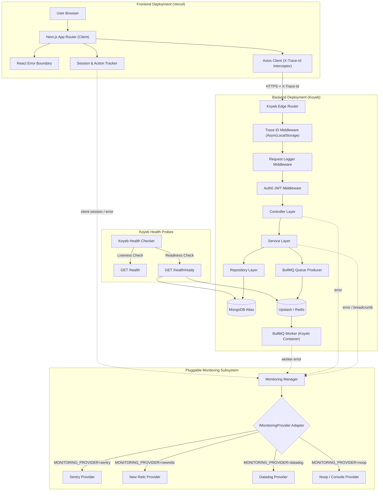
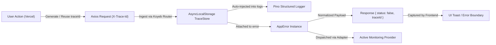
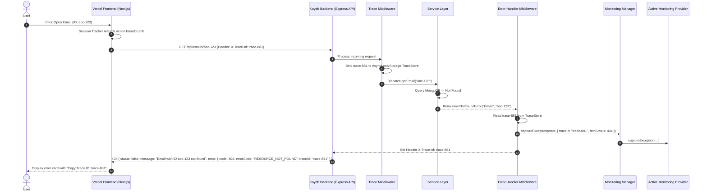
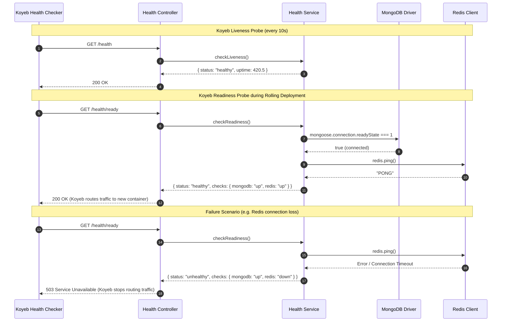
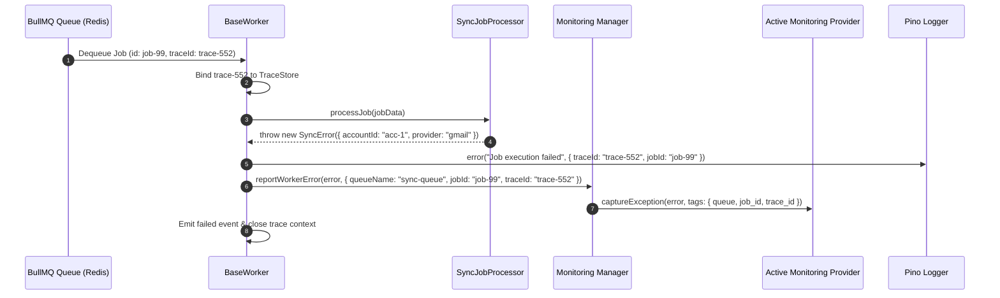
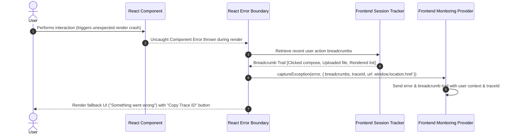
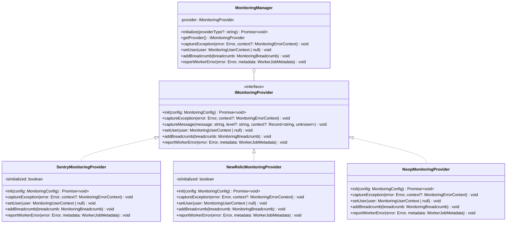
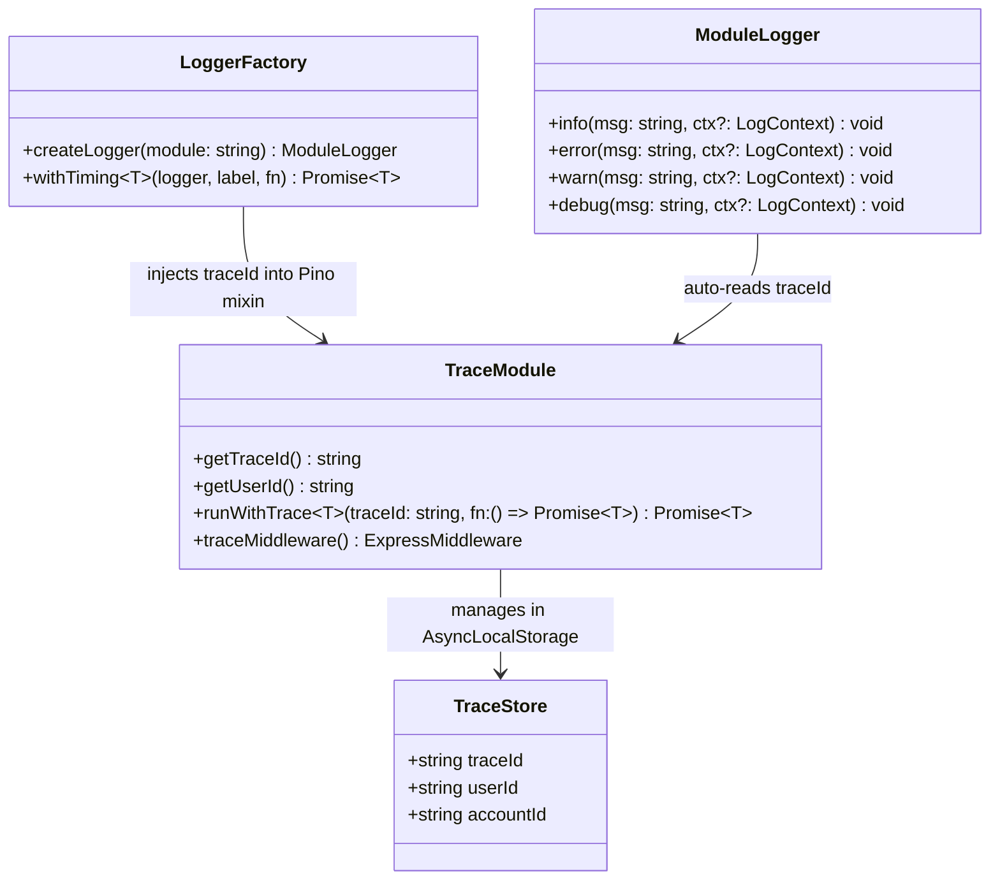

# Observability & Reliability — Implementation Plan

> **Phase:** 3 from Master Roadmap · **Release Target:** v3.2.0
> **Priority:** 🔴 HIGH — Foundational infrastructure required before AI pipelines & advanced features
> **Status:** COMPLETED
> **Created:** 2026-09-13 · **Last Updated:** 2026-09-14

---

## 1. Overview

### Problem Statement

The MailSense platform has grown to 30+ files using an unstructured logger, 3 overlapping backend error classes (`AppError`, `ApiError`, `AxiosApiError`) with incompatible signatures and `any` casts, zero distributed trace tracking between the frontend and backend, no domain-specific exceptions, a rigid and tightly-coupled Sentry initialization that prevents switching APM/monitoring tools, and zero client-side user session capture or error tracking on the frontend to diagnose user-reported bugs.

Furthermore, MailSense is deployed in a modern distributed cloud environment:
- **Frontend:** Next.js deployed on **Vercel** (Edge CDN & Serverless Runtime)
- **Backend:** Express API and BullMQ background workers deployed on **Koyeb** (MicroVM containers with auto-healing and health probes)

Without end-to-end distributed tracing (`traceId`), a pluggable monitoring provider architecture, frontend user session capture, and automated Koyeb liveness/readiness probes, diagnosing production incidents across Vercel and Koyeb is slow and fragile. Before building AI pipelines (Phase 4), robust, multi-provider observability is essential.

**Current backend error landscape:**

- [AppError.ts](file:///Users/vishaljagamani/Projects/Projects/mailsense/Backend/src/core/errors/AppError.ts) — Base error class in `core/errors/` with object-style constructor (`{ message, status, isOperational, description, suggestedAction, error }`)
- [api.error.ts](file:///Users/vishaljagamani/Projects/Projects/mailsense/Backend/src/shared/utils/api.error.ts) — Duplicate `ApiError` class in `shared/utils/` with positional constructor (`status, message, description, suggestedAction`)
- [AxiosApiError.ts](file:///Users/vishaljagamani/Projects/Projects/mailsense/Backend/src/core/errors/AxiosApiError.ts) — Uses `AxiosError<any>` cast (line 10), wraps external API errors without provider classification
- [error.handler.ts](file:///Users/vishaljagamani/Projects/Projects/mailsense/Backend/src/middlewares/error.handler.ts) — Uses `any` cast (line 38), no `errorCode` or `traceId` in responses
- [instruction.mjs](file:///Users/vishaljagamani/Projects/Projects/mailsense/Backend/src/instruction.mjs) — Bare-bones Sentry init with hardcoded SDK calls, no environment/release tagging, no user context, no worker coverage

**Current logging & monitoring landscape:**

- [logger.config.ts](file:///Users/vishaljagamani/Projects/Projects/mailsense/Backend/src/core/config/logger.config.ts) — Thin pino instance with no base bindings, no structured metadata
- [logger.ts](file:///Users/vishaljagamani/Projects/Projects/mailsense/Backend/src/shared/utils/logger.ts) — Wrapper using `Record<string, unknown>` for metadata, no module tagging, no trace IDs
- 29 files across the backend import `{ logger }` with ad-hoc, unstructured log metadata
- Monitoring is hardcoded to Sentry with direct vendor lock-in, making it difficult to swap or run alongside other APM solutions (e.g. New Relic, Datadog)
- **Frontend gap:** Zero error boundaries, zero user session recording, and zero trace propagation from Vercel to Koyeb

### Goals

- **Pluggable Monitoring Provider Architecture:** Implement a Strategy/Adapter pattern (`IMonitoringProvider`) supporting Sentry, New Relic, Datadog, or Noop/Console via a single environment variable (`MONITORING_PROVIDER`), eliminating vendor lock-in.
- **End-to-End Distributed Tracing (`traceId`):** Generate and propagate a standardized `traceId` across the entire HTTP lifecycle (originating at Vercel Frontend via `X-Trace-Id`, handled in Koyeb Backend via `AsyncLocalStorage`, and returned in response headers and error payloads).
- **Frontend Session Capture & User Action Monitoring:** Capture user sessions, action breadcrumbs (clicks, navigations, mutations), and integrate a React `ErrorBoundary` with a "Copy Trace ID" action for instant troubleshooting, with strict PII masking on sensitive email content.
- **Unified Custom Exception Hierarchy:** Consolidate error handling under a single `AppError` base with a machine-readable `ErrorCode` string enum, 11 domain-specific subclasses, and zero `any` casts.
- **Consistent Response Envelopes:** Error responses adopt `{ status: false, message: string, error: { ... } }`, matching the existing `status: boolean` convention of `APIResponse<T>`.
- **Koyeb Deployment Health Probes:** Add `/health` (liveness) and `/health/ready` (readiness) endpoints to allow Koyeb to perform zero-downtime rolling deploys and automatic container restarts.
- **Structured Logging:** Provide module-scoped logging (`createLogger(module)`) with Pino, auto-injecting `traceId`, `service`, `environment`, and execution durations.
- **Clean Up:** Remove unused `winston` dependency from `package.json`.

### Non-Goals

- Custom business analytics dashboards (these belong to Phase 8: Dashboard / Home Page Analytics).
- Log aggregation infrastructure (ELK/Loki/Grafana) — structured JSON stdout is outputted for container ingestion by Koyeb/cloud providers.
- Breaking changes to `@mailsense/types` — internal backend and frontend architectural enhancements only.

### Background

Phases 1 & 2 are completed (v3.0.0 and v3.1.0). The event-driven architecture (BullMQ + EventBus) is operational with `SYNC_COMPLETED` and `EMAIL_CREATED` events. Phase 4 (AI Foundation) requires deep observability to track token usage, latency, and pipeline errors. Deploying the frontend to Vercel and backend to Koyeb necessitates robust distributed tracing and health monitoring. See [master roadmap Phase 3](file:///Users/vishaljagamani/Projects/Projects/mailsense/.agents/plans/mailsense-development-roadmap.md) for roadmap alignment.

---

## 2. Requirements

### Functional Requirements

1. **FR-01 (Distributed Tracing):** Every HTTP request lifecycle is tagged with a unique `traceId` (UUID v4 / standard hex-32). If incoming from Vercel with an `X-Trace-Id` header, the backend preserves and propagates it; otherwise, Koyeb generates one.
2. **FR-02 (Trace Propagation):** The `traceId` is included in all backend log entries, returned in the HTTP response header `X-Trace-Id`, and passed to background jobs.
3. **FR-03 (Pluggable Monitoring Provider):** Application error reporting and APM instrumentation are abstracted behind an `IMonitoringProvider` interface. The active provider is selected via `MONITORING_PROVIDER=sentry | newrelic | datadog | noop`.
4. **FR-04 (Frontend Session & Action Capture):** The frontend captures user interaction breadcrumbs (route changes, button clicks, API mutations), attaching the current `traceId` and user context to any reported exception while strictly masking email bodies and credentials (Session Replay omitted to avoid paid Sentry quota).
5. **FR-05 (React Error Boundary):** An `ErrorBoundary` component wraps frontend routes, displaying a fallback card with the associated `traceId` and a one-click "Copy Trace ID" button for support.
6. **FR-06 (Domain Error Hierarchy):** Domain-specific errors (`NotFoundError`, `ValidationError`, `ProviderApiError`, `SyncError`, etc.) automatically map to appropriate HTTP status codes and machine-readable `ErrorCode` enum values.
7. **FR-07 (Consistent Error Envelope):** Error responses use `status: false` to maintain consistency with `APIResponse<T>`, including `errorCode` and `traceId`.
8. **FR-08 (Koyeb Liveness Probe):** `GET /health` returns `200 OK` with server uptime.
9. **FR-09 (Koyeb Readiness Probe):** `GET /health/ready` returns `200 OK` when MongoDB and Redis connections are verified, or `503 Service Unavailable` if either dependency is disconnected.
10. **FR-10 (Worker Error Tracking):** BullMQ worker failures automatically capture job metadata (`queueName`, `jobId`, `jobName`, `traceId`) into the configured monitoring provider.

### Non-Functional Requirements

- **NFR-01:** Trace ID propagation via Node.js `AsyncLocalStorage` must incur < 1ms overhead per request.
- **NFR-02:** Frontend session recording must use client-side throttling and complete masking of sensitive email data, keeping bundle size impact under 25KB gzipped.
- **NFR-03:** Health check endpoints must execute and respond in < 100ms.
- **NFR-04:** Zero `any`, `never`, or `unknown` types in error handling, monitoring adapters, and logging utilities.
- **NFR-05:** Zero breaking changes to successful API response contracts.

### Acceptance Criteria

- [x] Every backend log line in production includes `traceId`, `module`, `timestamp`, `level`, `service`, `environment`.
- [x] Switching `MONITORING_PROVIDER=newrelic` in `.env` redirects monitoring calls to the New Relic adapter without code modifications.
- [x] Frontend API calls via `axiosClient` transmit `X-Trace-Id` and extract response `traceId`.
- [x] Frontend React render failures trigger the `ErrorBoundary` displaying the error message and `traceId`.
- [x] Backend error responses adhere to `{ status: false, message: string, error: { code, errorCode, traceId, description, suggestedAction } }`.
- [x] `GET /health` returns `200` to Koyeb health checker.
- [x] `GET /health/ready` returns `503` when MongoDB or Redis is stopped.
- [x] BullMQ worker failures are reported to the active monitoring provider with job tags and `traceId`.
- [x] `ApiError` class in `shared/utils/api.error.ts` is deleted.
- [x] `winston` is removed from `package.json`.
- [x] Both `Backend` and `Frontend` pass `tsc --noEmit` and build checks with zero errors.

---

## 3. Design

### 3.1 High-Level Design

#### System Architecture Topology (Vercel + Koyeb + Multi-Provider APM)



#### Distributed Tracing & Error Flow



---

### 3.2 Low-Level Design

#### Sequence Diagram 1: Request & Error Flow with `traceId` (Vercel to Koyeb)



#### Sequence Diagram 2: Koyeb Deployment Health Checks & Readiness Probes



#### Sequence Diagram 3: Background Worker Failure & Trace Context



#### Sequence Diagram 4: Frontend Session Capture & React Error Boundary



---

### 3.3 Class Diagrams

#### Class Diagram 1: Custom Error Hierarchy

```mermaid
classDiagram
    class AppError {
        +string message
        +number httpStatus
        +ErrorCode errorCode
        +boolean isOperational
        +string traceId
        +ErrorContext context
        +toJSON() ErrorResponsePayload
    }

    class NotFoundError {
        +constructor(resource: string, identifier: string)
    }

    class BadRequestError {
        +constructor(message: string, errorCode?: ErrorCode)
    }

    class UnauthorizedError {
        +constructor(message?: string)
    }

    class ForbiddenError {
        +constructor(message?: string)
    }

    class ConflictError {
        +constructor(message: string, resource?: string)
    }

    class ValidationError {
        +ValidationDetail[] details
        +constructor(message: string, details: ValidationDetail[])
    }

    class ProviderApiError {
        +string provider
        +number providerStatusCode
        +string providerErrorMessage
        +constructor(params: ProviderApiErrorParams)
    }

    class TokenExpiredError {
        +string accountId
        +constructor(accountId: string, provider: string)
    }

    class RateLimitError {
        +number retryAfterMs
        +constructor(provider: string, retryAfterMs?: number)
    }

    class SyncError {
        +string accountId
        +string syncJobId
        +constructor(params: SyncErrorParams)
    }

    class ExternalServiceError {
        +string serviceName
        +constructor(serviceName: string, message: string)
    }

    AppError <|-- NotFoundError
    AppError <|-- BadRequestError
    AppError <|-- UnauthorizedError
    AppError <|-- ForbiddenError
    AppError <|-- ConflictError
    AppError <|-- ValidationError
    AppError <|-- ProviderApiError
    AppError <|-- TokenExpiredError
    AppError <|-- RateLimitError
    AppError <|-- SyncError
    AppError <|-- ExternalServiceError
```



#### Class Diagram 2: Pluggable Monitoring Provider Architecture



#### Class Diagram 3: Observability & Tracing Infrastructure



---

### 3.4 Data Models & Contract Specifications

#### Error Response Envelope (Consistent with `APIResponse<T>`)

```typescript
// Aligned with APIResponse<T> (status: boolean)
export interface ErrorDetailPayload {
    code: number;            // HTTP status code (e.g. 404, 400)
    errorCode: ErrorCode;    // Machine-readable enum code
    traceId: string;         // Request trace ID for correlation across Vercel & Koyeb
    description: string;     // Technical/contextual description
    suggestedAction: string; // Actionable advice for the user/client
    details?: ValidationDetail[]; // Form/field validation errors (if applicable)
    stack?: string;          // Non-production environments only
}

export interface ErrorResponsePayload {
    status: false;           // Matches status: boolean from APIResponse
    message: string;         // Human-readable summary
    error: ErrorDetailPayload;
}
```

#### Error Codes (`src/core/errors/error-codes.ts`)

```typescript
export enum ErrorCode {
    // Client Errors
    RESOURCE_NOT_FOUND = 'RESOURCE_NOT_FOUND',
    BAD_REQUEST = 'BAD_REQUEST',
    VALIDATION_FAILED = 'VALIDATION_FAILED',
    UNAUTHORIZED = 'UNAUTHORIZED',
    FORBIDDEN = 'FORBIDDEN',
    CONFLICT = 'CONFLICT',

    // Provider Errors
    PROVIDER_API_ERROR = 'PROVIDER_API_ERROR',
    PROVIDER_RATE_LIMITED = 'PROVIDER_RATE_LIMITED',
    TOKEN_EXPIRED = 'TOKEN_EXPIRED',

    // System Errors
    SYNC_FAILED = 'SYNC_FAILED',
    EXTERNAL_SERVICE_ERROR = 'EXTERNAL_SERVICE_ERROR',
    INTERNAL_ERROR = 'INTERNAL_ERROR',
}
```

#### Monitoring Interfaces (`src/core/monitoring/monitoring.interfaces.ts`)

```typescript
export type MonitoringProviderType = 'sentry' | 'newrelic' | 'datadog' | 'noop';

export interface MonitoringConfig {
    provider: MonitoringProviderType;
    dsn?: string;
    apiKey?: string;
    environment: string;
    release: string;
    serviceName: string;
    tracesSampleRate: number;
}

export interface MonitoringUserContext {
    id: string;
    email?: string;
    ipAddress?: string;
}

export interface MonitoringBreadcrumb {
    category: string;
    message: string;
    level?: 'info' | 'warn' | 'error';
    data?: Record<string, string | number | boolean>;
}

export interface MonitoringErrorContext {
    traceId?: string;
    httpStatus?: number;
    errorCode?: ErrorCode;
    user?: MonitoringUserContext;
    tags?: Record<string, string | number | boolean>;
    extra?: Record<string, string | number | boolean>;
}

export interface WorkerJobMetadata {
    queueName: string;
    jobId: string;
    jobName: string;
    traceId?: string;
}

export interface IMonitoringProvider {
    init(config: MonitoringConfig): Promise<void> | void;
    captureException(error: Error, context?: MonitoringErrorContext): void;
    captureMessage(message: string, level?: 'info' | 'warn' | 'error', context?: Record<string, string | number | boolean>): void;
    setUser(user: MonitoringUserContext | null): void;
    addBreadcrumb(breadcrumb: MonitoringBreadcrumb): void;
    reportWorkerError(error: Error, metadata: WorkerJobMetadata): void;
}
```

---

### 3.5 API Contracts

| Method | Path            | Request Body | Response Shape                                                                                                         | Status Codes | Description                                 |
| ------ | --------------- | ------------ | ---------------------------------------------------------------------------------------------------------------------- | ------------ | ------------------------------------------- |
| `GET`  | `/health`       | —            | `{ status: "healthy", uptime: number, timestamp: string }`                                                             | `200`        | Koyeb Liveness Probe — server container up  |
| `GET`  | `/health/ready` | —            | `{ status: "healthy" \| "unhealthy", checks: { mongodb: "up" \| "down", redis: "up" \| "down" }, timestamp: string }` | `200`, `503` | Koyeb Readiness Probe — Mongo & Redis ready |

---

### 3.6 Frontend Observability & State Management

1. **Axios Client Interceptors (`Frontend/src/shared/api/client.ts`):**
   - **Request Interceptor:** Injects `X-Trace-Id` (generates standard UUID v4 if not already initiated) and registers outgoing API call breadcrumb.
   - **Response Interceptor:** Reads `X-Trace-Id` from response headers; on error, extracts `error.response?.data?.error?.traceId` and notifies the session tracker.
2. **React Error Boundary (`Frontend/src/shared/components/ErrorBoundary.tsx`):**
   - Wraps the root application tree in `Frontend/src/shared/providers/index.tsx`.
   - On uncaught render exception: bundles recent breadcrumbs, transmits error with active `traceId` and user context, and renders a sleek card with a "Copy Trace ID" button.
3. **Session Action Tracker (`Frontend/src/shared/monitoring/session.tracker.ts`):**
   - Tracks route changes, key user clicks (e.g. Send Email, Sync Account), and mutation failures in a lightweight ring buffer.
   - Enforces strict client-side privacy masking so sensitive email text and auth tokens are sanitized to `[Filtered]`. Session Replay is disabled to avoid paid Sentry quota.

---

## 4. Proposed Changes

### Backend — Error Infrastructure (`src/core/errors/` & `src/core/types/`)

#### [NEW] `Backend/src/core/errors/ErrorCodes.ts`
- Complete `ErrorCode` string enum.

#### [NEW] `Backend/src/core/types/error.types.ts`
- Named interfaces: `ErrorContext`, `ErrorDetailPayload`, `ErrorResponsePayload`, `ValidationDetail`, `ProviderApiErrorParams`, `SyncErrorParams`, `AppErrorConstructorParams`.

#### [MODIFY] [index.ts](file:///Users/vishaljagamani/Projects/Projects/mailsense/Backend/src/core/types/index.ts)
- Re-export error types from `@types`.

#### [NEW] `Backend/src/core/errors/DomainErrors.ts`
- 11 domain subclasses: `NotFoundError`, `BadRequestError`, `UnauthorizedError`, `ForbiddenError`, `ConflictError`, `ValidationError`, `ProviderApiError`, `TokenExpiredError`, `RateLimitError`, `SyncError`, `ExternalServiceError`.

#### [NEW] `Backend/src/core/errors/ErrorFactories.ts`
- Ergonomic error creation helpers.

#### [MODIFY] [AppError.ts](file:///Users/vishaljagamani/Projects/Projects/mailsense/Backend/src/core/errors/AppError.ts)
- Base class implementation with `status: false`, `errorCode`, `traceId`, typed `context`, and `toJSON()`.

#### [MODIFY] [AxiosApiError.ts](file:///Users/vishaljagamani/Projects/Projects/mailsense/Backend/src/core/errors/AxiosApiError.ts)
- Extends `ProviderApiError`, eliminates `any` cast via typed Axios generic `AxiosError<ProviderErrorResponse>`.

#### [MODIFY] [index.ts](file:///Users/vishaljagamani/Projects/Projects/mailsense/Backend/src/core/errors/index.ts)
- Barrel exports for core errors module.

#### [MODIFY] [routes.ts](file:///Users/vishaljagamani/Projects/Projects/mailsense/Backend/src/routes.ts)
- Unmount `/demo` routes from application router.

#### [DELETE] `Backend/src/modules/demo/`
- Completely removed legacy demo module (controller, service, schema, routes, model, tests).

#### [DELETE] [api.error.ts](file:///Users/vishaljagamani/Projects/Projects/mailsense/Backend/src/shared/utils/api.error.ts)
- Removed completely.

---

### Backend — Distributed Tracing & Logging (`src/core/observability/`)

#### [NEW] `Backend/src/core/observability/trace.ts`
- `AsyncLocalStorage`-based store for `TraceStore` (`{ traceId: string; userId?: string; accountId?: string }`).
- `getTraceId()`, `getUserId()`, `runWithTrace()`.
- `traceMiddleware` Express middleware (reads `X-Trace-Id` or generates via `crypto.randomUUID()`, sets response header `X-Trace-Id`).

#### [NEW] `Backend/src/core/observability/logger.factory.ts`
- `createLogger(module)` returning Pino child logger with `module` binding and `traceId` mixin.
- `withTiming<T>(logger, label, fn)` helper.

#### [NEW] `Backend/src/core/observability/request-logger.middleware.ts`
- Inbound/outbound HTTP log middleware (method, path, statusCode, duration, traceId). Bypasses `/health` and `/health/ready`.

#### [NEW] `Backend/src/core/observability/index.ts`
- Barrel exports.

#### [MODIFY] [logger.config.ts](file:///Users/vishaljagamani/Projects/Projects/mailsense/Backend/src/core/config/logger.config.ts)
- Base bindings: `{ service: 'mailsense-backend', environment, version }`, custom error serializer.

#### [MODIFY] [logger.ts](file:///Users/vishaljagamani/Projects/Projects/mailsense/Backend/src/shared/utils/logger.ts)
- Re-exports `createLogger('App')` for seamless backward compatibility.

---

### Backend — Pluggable Monitoring Provider (`src/core/monitoring/`)

#### [NEW] `Backend/src/core/monitoring/monitoring.interfaces.ts`
- `IMonitoringProvider`, `MonitoringConfig`, `MonitoringUserContext`, `MonitoringBreadcrumb`, `MonitoringErrorContext`, `WorkerJobMetadata`.

#### [NEW] `Backend/src/core/monitoring/providers/sentry.provider.ts`
- Concrete Sentry adapter implementing `IMonitoringProvider` using `@sentry/node`.

#### [NEW] `Backend/src/core/monitoring/providers/newrelic.provider.ts`
- Concrete New Relic adapter implementing `IMonitoringProvider`.

#### [NEW] `Backend/src/core/monitoring/providers/noop.provider.ts`
- Fallback/testing adapter implementing `IMonitoringProvider`.

#### [NEW] `Backend/src/core/monitoring/monitoring.manager.ts`
- Singleton `MonitoringManager` reading `MONITORING_PROVIDER` env variable.

#### [NEW] `Backend/src/core/monitoring/index.ts`
- Barrel exports and `monitoring` instance export.

#### [DELETE] [instruction.mjs](file:///Users/vishaljagamani/Projects/Projects/mailsense/Backend/src/instruction.mjs)
- Replaced by `src/core/monitoring/index.ts`.

---

### Backend — Koyeb Health Probes (`src/core/health/`)

#### [NEW] `Backend/src/core/health/health.interfaces.ts`
- `LivenessResponse`, `ReadinessResponse`, `ComponentHealth`.

#### [NEW] `Backend/src/core/health/health.service.ts`
- MongoDB and Redis connectivity checks.

#### [NEW] `Backend/src/core/health/health.controller.ts`
- Handlers returning 200/503.

#### [NEW] `Backend/src/core/health/health.routes.ts`
- Express route definitions.

#### [NEW] `Backend/src/core/health/index.ts`
- Barrel exports.

---

### Frontend — Error Handling & Observability (Vercel)

#### [NEW] `Frontend/src/shared/types/errors.types.ts`
- Error response payload interfaces (`ApiErrorResponse`, `ApiErrorDetail`, `ApiValidationDetail`, `FormattedClientError`).

#### [MODIFY] [index.ts](file:///Users/vishaljagamani/Projects/Projects/mailsense/Frontend/src/shared/types/index.ts)
- Re-export error types from `@shared/types`.

#### [NEW] `Frontend/src/shared/api/errors.ts`
- Pure data extraction utility `extractApiError` for normalizing API errors.

#### [MODIFY] [index.ts](file:///Users/vishaljagamani/Projects/Projects/mailsense/Frontend/src/shared/api/index.ts)
- Re-export error utilities in `@shared/api`.

#### [NEW] `Frontend/src/shared/monitoring/frontend-monitoring.interfaces.ts`
- Frontend monitoring contracts (`IFrontendMonitoringProvider`, `UserActionBreadcrumb`).

#### [NEW] `Frontend/src/shared/monitoring/providers/sentry-frontend.provider.ts`
- Client-side Sentry / session replay adapter with strict privacy masking.

#### [NEW] `Frontend/src/shared/monitoring/session.tracker.ts`
- Lightweight interaction & breadcrumb recorder.

#### [NEW] `Frontend/src/shared/monitoring/index.ts`
- Barrel exports.

#### [NEW] `Frontend/src/shared/components/ErrorBoundary.tsx`
- React Error Boundary with fallback UI and "Copy Trace ID" action.

#### [MODIFY] [client.ts](file:///Users/vishaljagamani/Projects/Projects/mailsense/Frontend/src/shared/api/client.ts)
- Add request interceptor injecting `X-Trace-Id`.
- Add response interceptor capturing `X-Trace-Id` and parsing `traceId` from error payloads.

#### [MODIFY] [index.tsx](file:///Users/vishaljagamani/Projects/Projects/mailsense/Frontend/src/shared/providers/index.tsx)
- Wrap root provider hierarchy with `ErrorBoundary`.

---

### Backend — App, Server & Worker Integration

#### [MODIFY] [error.handler.ts](file:///Users/vishaljagamani/Projects/Projects/mailsense/Backend/src/middlewares/error.handler.ts)
- Formats `ErrorResponsePayload` with `status: false`, auto-includes `traceId`, dispatches unhandled errors to `monitoring.captureException()`.

#### [MODIFY] [app.ts](file:///Users/vishaljagamani/Projects/Projects/mailsense/Backend/src/app.ts)
- Mount `traceMiddleware` and `requestLoggerMiddleware` at root.
- Mount `/health` and `/health/ready` before auth middleware.

#### [MODIFY] [server.ts](file:///Users/vishaljagamani/Projects/Projects/mailsense/Backend/src/server.ts)
- Call `monitoring.init()` on line 1 before all other imports.

#### [MODIFY] [base.worker.ts](file:///Users/vishaljagamani/Projects/Projects/mailsense/Backend/src/workers/base.worker.ts)
- Inject `traceId` into worker scope, report failures via `monitoring.reportWorkerError()`.

#### [MODIFY] [package.json](file:///Users/vishaljagamani/Projects/Projects/mailsense/Backend/package.json)
- Remove `winston` dependency.

---

## 5. Implementation Phases

### Phase 3.1: Custom Exception Hierarchy & Error Codes (Backend)

**Objective:** Unify backend error handling under `AppError` with machine-readable `ErrorCode`, typed context, and `status: false` envelopes. Eliminate all `any` casts.
**Estimated Effort:** Medium (2 days)

#### Tasks
- [x] Define `ErrorCode` enum in `src/core/errors/ErrorCodes.ts`
- [x] Define interfaces in `src/core/types/error.types.ts` and export via `src/core/types/index.ts`
- [x] Rewrite `AppError` base class with `status: false`, `errorCode`, `traceId`, and `toJSON()`
- [x] Implement 11 domain error subclasses in `src/core/errors/DomainErrors.ts`
- [x] Create factory helpers in `src/core/errors/ErrorFactories.ts`
- [x] Refactor `AxiosApiError` to eliminate `any` cast using typed Axios generics
- [x] Update `errorHandler` middleware to return `{ status: false, message, error }`
- [x] Delete `Backend/src/shared/utils/api.error.ts` and remove export from `src/shared/utils/index.ts`
- [x] Remove obsolete `Backend/src/modules/demo/` module and unmount `/demo` route in `Backend/src/routes.ts`
- [x] Create `Frontend/src/shared/types/errors.types.ts` and pure `extractApiError` utility in `Frontend/src/shared/api/errors.ts`
- [x] Update `Frontend/src/shared/api/client.ts` Axios response rejection interceptor
- [x] Verify `pnpm build` and `pnpm test` succeed in `Backend/` (42 tests passing)
- [x] Verify `npx tsc --noEmit` succeeds in `Frontend/`

#### Files Created
- `Backend/src/core/errors/ErrorCodes.ts`
- `Backend/src/core/types/error.types.ts`
- `Backend/src/core/errors/DomainErrors.ts`
- `Backend/src/core/errors/ErrorFactories.ts`
- `Frontend/src/shared/types/errors.types.ts`
- `Frontend/src/shared/api/errors.ts`

#### Files Modified
- `Backend/src/core/errors/AppError.ts`
- `Backend/src/core/errors/AxiosApiError.ts`
- `Backend/src/core/errors/index.ts`
- `Backend/src/core/types/index.ts`
- `Backend/src/middlewares/error.handler.ts`
- `Backend/src/routes.ts`
- `Backend/src/shared/utils/index.ts`
- `Frontend/src/shared/types/index.ts`
- `Frontend/src/shared/api/index.ts`
- `Frontend/src/shared/api/client.ts`

#### Files Deleted
- `Backend/src/modules/demo/` (entire directory)
- `Backend/src/shared/utils/api.error.ts`

---

### Phase 3.2: Distributed Tracing (`traceId`) & Structured Logging (Backend)

**Objective:** Implement `AsyncLocalStorage`-based `traceId` propagation, module-scoped Pino child loggers, and HTTP request/response logging.
**Estimated Effort:** Medium (2 days)

#### Tasks
- [x] Create `src/core/observability/trace.ts` (`TraceStore`, `traceMiddleware`, `getTraceId()`)
- [x] Create `src/core/observability/logger.factory.ts` (`createLogger(module)` with `traceId` mixin)
- [x] Create `src/core/observability/request-logger.middleware.ts` (excluding health checks)
- [x] Enhance `src/core/config/logger.config.ts` (service base bindings, structured JSON)
- [x] Wire `traceMiddleware` and `requestLoggerMiddleware` into `Backend/src/app.ts`
- [x] Update `AppError` to auto-populate `traceId` from `TraceStore`
- [x] Update `base.worker.ts` and `sync.worker.ts` with module-scoped loggers and trace context
- [x] Refactor `src/shared/utils/logger.ts` to maintain backward compatibility
- [x] Verify `pnpm build` succeeds in `Backend/`

#### Files to Create
- `Backend/src/core/observability/trace.ts`
- `Backend/src/core/observability/logger.factory.ts`
- `Backend/src/core/observability/request-logger.middleware.ts`
- `Backend/src/core/observability/index.ts`

#### Files to Modify
- `Backend/src/core/config/logger.config.ts`
- `Backend/src/app.ts`
- `Backend/src/core/errors/AppError.ts`
- `Backend/src/shared/utils/logger.ts`
- `Backend/src/workers/base.worker.ts`
- `Backend/src/workers/sync.worker.ts`

---

### Phase 3.3: Pluggable Monitoring Provider Architecture (Backend)

**Objective:** Decouple APM monitoring from Sentry using the Strategy pattern (`IMonitoringProvider`). Support Sentry, New Relic, and Noop via `MONITORING_PROVIDER` env variable.
**Estimated Effort:** Medium (2 days)

#### Tasks
- [x] Define `IMonitoringProvider` contract and DTOs in `src/core/types/monitoring.types.ts`
- [x] Implement `SentryMonitoringProvider` in `src/core/monitoring/providers/sentry.provider.ts`
- [x] Implement `NoopMonitoringProvider` in `src/core/monitoring/providers/noop.provider.ts`
- [x] Create `MonitoringManager` singleton in `src/core/monitoring/monitoring.manager.ts`
- [x] Update `server.ts` to initialize monitoring as the very first import
- [x] Delete legacy `Backend/src/instruction.mjs`
- [x] Wire `monitoring.captureException()` into `errorHandler` middleware
- [x] Wire `monitoring.reportWorkerError()` into `base.worker.ts`
- [x] Remove `winston` from `Backend/package.json`
- [x] Verify `pnpm build` succeeds in `Backend/`

#### Files to Create
- `Backend/src/core/types/monitoring.types.ts`
- `Backend/src/core/constants/monitoring.constants.ts`
- `Backend/src/core/monitoring/providers/sentry.provider.ts`
- `Backend/src/core/monitoring/providers/noop.provider.ts`
- `Backend/src/core/monitoring/monitoring.manager.ts`
- `Backend/src/core/monitoring/index.ts`

#### Files to Modify
- `Backend/src/server.ts`
- `Backend/src/middlewares/error.handler.ts`
- `Backend/src/workers/base.worker.ts`
- `Backend/package.json`

#### Files to Delete
- `Backend/src/instruction.mjs`

---

### Phase 3.4: Koyeb Health Probes & Readiness Checks (Backend)

**Objective:** Implement `/health` and `/health/ready` endpoints to empower Koyeb with automated liveness and dependency-aware readiness checks.
**Estimated Effort:** Low (1 day)

#### Tasks
- [x] Define health check interfaces in `src/core/types/health.types.ts`
- [x] Create health constants in `src/core/constants/health.constants.ts`
- [x] Implement `HealthService` verifying MongoDB and Redis connection states
- [x] Implement `HealthController` handling liveness and readiness logic
- [x] Create `health.routes.ts` mounting endpoints unauthenticated
- [x] Mount health routes in `Backend/src/app.ts` prior to auth middleware
- [x] Verify endpoints respond properly with 200 (healthy) and 503 (dependency down)
- [x] Verify `pnpm build` succeeds in `Backend/`

#### Files to Create
- `Backend/src/core/types/health.types.ts`
- `Backend/src/core/constants/health.constants.ts`
- `Backend/src/core/health/health.service.ts`
- `Backend/src/core/health/health.controller.ts`
- `Backend/src/core/health/health.routes.ts`
- `Backend/src/core/health/index.ts`

#### Files to Modify
- `Backend/src/core/types/index.ts`
- `Backend/src/core/constants/index.ts`
- `Backend/tsconfig.json`
- `Backend/jest.config.js`
- `Backend/src/app.ts`

---

### Phase 3.5: Frontend Session Capture, Error Boundary & Trace Propagation (Vercel)

**Objective:** Implement frontend user action breadcrumb capture, session recording with PII masking, React Error Boundary, and distributed `traceId` propagation in Axios.
**Estimated Effort:** Medium (2 days)

#### Tasks
- [x] Define frontend monitoring contracts in `Frontend/src/shared/types/monitoring.types.ts`
- [x] Implement frontend monitoring adapter & session tracker in `Frontend/src/shared/monitoring/`
- [x] Create `ErrorBoundary.tsx` functional component with fallback card, "Copy Trace ID", and `useErrorBoundary` hook
- [x] Enhance `Frontend/src/shared/api/client.ts` Axios interceptors:
  - [x] Request: Attach `X-Trace-Id` header and track API breadcrumbs
  - [x] Response: Extract `X-Trace-Id` and parse `error.response.data.error.traceId`
- [x] Wrap root layout in `Frontend/src/shared/providers/index.tsx` with `ErrorBoundary`
- [x] Configure privacy masking for email bodies and sensitive credentials
- [x] Verify `npx tsc --noEmit` succeeds in `Frontend/`

#### Files to Create
- `Frontend/src/shared/monitoring/frontend-monitoring.interfaces.ts`
- `Frontend/src/shared/monitoring/providers/sentry-frontend.provider.ts`
- `Frontend/src/shared/monitoring/session.tracker.ts`
- `Frontend/src/shared/monitoring/index.ts`
- `Frontend/src/shared/components/ErrorBoundary.tsx`

#### Files to Modify
- `Frontend/src/shared/api/client.ts`
- `Frontend/src/shared/providers/index.tsx`

---

### Phase 3.6: Codebase-Wide Structured Logger Migration & APM Log Bridge (Backend)

**Objective:** Bridge structured logging (`createLogger`) directly to the active APM `monitoring` provider (transmitting `info`/`warn` as breadcrumbs and `error` as exceptions with recursion guards) and migrate all backend services, workers, processors, and integration clients from the generic `App` logger to module-scoped loggers.
**Estimated Effort:** Medium (2 days)

#### Tasks
- [x] Define `LOGGER_MODULE` enum in `Backend/src/core/constants/observability.constants.ts`
- [x] Add `CreateLoggerOptions` interface and eliminate `unknown` in `Backend/src/core/types/observability.types.ts`
- [x] Implement APM log bridge in `Backend/src/core/observability/logger.factory.ts`:
  - [x] Forward `info` and `warn` logs to `monitoring.addBreadcrumb()`
  - [x] Auto-extract `Error` and forward `error` logs to `monitoring.captureException()`
  - [x] Support `LOGGER_MODULE` enum or module string name with autocomplete
  - [x] Implement recursion guard for monitoring internals (`forwardToMonitoring: false`)
  - [x] Break circular dependency with `@config` by importing base pino directly from `../config/logger.config.js`
- [x] Add `@workers` alias in `Backend/tsconfig.json` and `Backend/jest.config.js` with `Backend/src/workers/index.ts`
- [x] Migrate Core Infrastructure (importing `LOGGER_MODULE` from `@constants` and `createLogger` from `@observability`):
  - [x] `Backend/src/core/config/db.config.ts` -> `createLogger(LOGGER_MODULE.DATABASE)`
  - [x] `Backend/src/core/queue/redis.connection.ts` -> `createLogger(LOGGER_MODULE.REDIS_CONNECTION)`
  - [x] `Backend/src/core/queue/queue.service.ts` -> `createLogger(LOGGER_MODULE.QUEUE_SERVICE)`
  - [x] `Backend/src/core/queue/scheduler.service.ts` -> `createLogger(LOGGER_MODULE.SCHEDULER_SERVICE)`
  - [x] `Backend/src/core/queue/queue.registry.ts` -> `createLogger(LOGGER_MODULE.QUEUE_REGISTRY)`
  - [x] `Backend/src/core/events/event-bus.ts` -> `createLogger(LOGGER_MODULE.EVENT_BUS)`
  - [x] `Backend/src/core/events/handlers/email-created.handler.ts` -> `createLogger(LOGGER_MODULE.EMAIL_CREATED_HANDLER)`
  - [x] `Backend/src/core/events/handlers/sync-completed.handler.ts` -> `createLogger(LOGGER_MODULE.SYNC_COMPLETED_HANDLER)`
- [x] Migrate Integrations:
  - [x] `Backend/src/integrations/gmail/gmail.client.ts` -> `createLogger(LOGGER_MODULE.GMAIL_CLIENT)`
  - [x] `Backend/src/integrations/gmail/gmail.service.ts` -> `createLogger(LOGGER_MODULE.GMAIL_SERVICE)`
  - [x] `Backend/src/integrations/outlook/outlook.client.ts` -> `createLogger(LOGGER_MODULE.OUTLOOK_CLIENT)`
  - [x] `Backend/src/integrations/outlook/outlook.service.ts` -> `createLogger(LOGGER_MODULE.OUTLOOK_SERVICE)`
  - [x] `Backend/src/integrations/auth0/auth0.client.ts` -> `createLogger(LOGGER_MODULE.AUTH0_CLIENT)`
  - [x] `Backend/src/integrations/auth0/auth0.service.ts` -> `createLogger(LOGGER_MODULE.AUTH0_SERVICE)`
  - [x] `Backend/src/integrations/storage/ObjectStorageService.service.ts` -> `createLogger(LOGGER_MODULE.OBJECT_STORAGE_SERVICE)`
- [x] Migrate Domain Modules & Services:
  - [x] `Backend/src/modules/accounts/account.service.ts` -> `createLogger(LOGGER_MODULE.ACCOUNT_SERVICE)`
  - [x] `Backend/src/modules/emails/email.service.ts` -> `createLogger(LOGGER_MODULE.EMAIL_SERVICE)`
  - [x] `Backend/src/modules/attachments/attachment.service.ts` -> `createLogger(LOGGER_MODULE.ATTACHMENT_SERVICE)`
  - [x] `Backend/src/modules/folders/folder.service.ts` -> `createLogger(LOGGER_MODULE.FOLDER_SERVICE)`
  - [x] `Backend/src/modules/drafts/draft.service.ts` -> `createLogger(LOGGER_MODULE.DRAFT_SERVICE)`
  - [x] `Backend/src/modules/analytics/analytics.service.ts` -> `createLogger(LOGGER_MODULE.ANALYTICS_SERVICE)`
  - [x] `Backend/src/modules/analytics/analytics.utils.ts` -> `createLogger(LOGGER_MODULE.ANALYTICS_UTILS)`
- [x] Migrate Background Workers & Processors:
  - [x] `Backend/src/workers/processors/sync-account.processor.ts` -> `createLogger(LOGGER_MODULE.SYNC_ACCOUNT_PROCESSOR)`
  - [x] `Backend/src/workers/processors/refresh-token.processor.ts` -> `createLogger(LOGGER_MODULE.REFRESH_TOKEN_PROCESSOR)`
  - [x] `Backend/src/workers/sync.worker.ts` -> `createLogger(LOGGER_MODULE.SYNC_WORKER)`
  - [x] `Backend/src/workers/token-refresh.worker.ts` -> `createLogger(LOGGER_MODULE.TOKEN_REFRESH_WORKER)`
  - [x] `Backend/src/workers/base.worker.ts` -> `createLogger(LOGGER_MODULE.BASE_WORKER)`
- [x] Migrate Server & App Bootstrap:
  - [x] `Backend/src/server.ts` -> `createLogger(LOGGER_MODULE.SERVER)`
  - [x] `Backend/src/app.ts` -> `createLogger(LOGGER_MODULE.APP)`
- [x] Integrate Sentry Native Structured Logging (`enableLogs: true`, `Sentry.logger.*` API) and automatic User Context propagation:
  - [x] Propagate authenticated user from Auth0 to `frontendMonitoring.setUser()` in `Frontend/src/shared/providers/auth.provider.tsx`
  - [x] Attach user context headers (`X-User-Id`, `X-User-Email`, `X-User-Name`) in `Frontend/src/shared/api/client.ts`
  - [x] Implement `setTraceContext()` and request header extraction in `Backend/src/core/observability/trace.ts`
  - [x] Propagate authenticated user context to `TraceStore` and `monitoring.setUser()` in `Backend/src/middlewares/auth.ts`
  - [x] Propagate job user context to `runWithTrace()` and `monitoring.setUser()` in `Backend/src/workers/base.worker.ts`
  - [x] Streamline Sentry attributes by eliminating redundant flat user keys (`userId`, `user_id`, `userName`, etc.) and centralizing user identity exclusively in Sentry's canonical nested `user` object (`user.id`, `user.email`, `user.username`)
  - [x] Document resolution for Sentry server-side data scrubbing masking `userId` as `[Filtered]` (add `user.id` to Safe Fields in Sentry Project Settings)
  - [x] Simplify `sanitizeContext` in `logger.factory.ts` by removing redundant user unpacking, relying cleanly on trace and Sentry user context
- [x] Maintain backward-compatible fallback `export const logger = createLogger(LOGGER_MODULE.APP)` in `shared/utils/logger.ts`
- [x] Execute `pnpm test` ensuring 11/11 test suites and 50/50 tests pass
- [x] Execute `pnpm type-check` ensuring zero TypeScript errors

#### Files to Create
- `mailsense/.agents/implementations/observability-reliability/phase-6-logger-migration-apm-bridge.md`
- `Backend/src/workers/index.ts`

#### Files to Modify
- `Frontend/src/shared/providers/auth.provider.tsx`
- `Frontend/src/shared/api/client.ts`
- `Backend/src/core/constants/observability.constants.ts`
- `Backend/src/core/types/observability.types.ts`
- `Backend/src/core/config/logger.config.ts`
- `Backend/src/core/observability/trace.ts`
- `Backend/src/core/observability/logger.factory.ts`
- `Backend/src/core/observability/request-logger.middleware.ts`
- `Backend/src/core/monitoring/monitoring.manager.ts`
- `Backend/src/core/monitoring/providers/sentry.provider.ts`
- `Backend/src/core/monitoring/providers/noop.provider.ts`
- `Backend/src/middlewares/auth.ts`
- `Backend/src/core/config/db.config.ts`
- `Backend/src/core/queue/redis.connection.ts`
- `Backend/src/core/queue/queue.service.ts`
- `Backend/src/core/queue/scheduler.service.ts`
- `Backend/src/core/queue/queue.registry.ts`
- `Backend/src/core/queue/index.ts`
- `Backend/src/core/events/event-bus.ts`
- `Backend/src/core/events/handlers/email-created.handler.ts`
- `Backend/src/core/events/handlers/sync-completed.handler.ts`
- `Backend/src/integrations/gmail/gmail.client.ts`
- `Backend/src/integrations/gmail/gmail.service.ts`
- `Backend/src/integrations/outlook/outlook.client.ts`
- `Backend/src/integrations/outlook/outlook.service.ts`
- `Backend/src/integrations/auth0/auth0.client.ts`
- `Backend/src/integrations/auth0/auth0.service.ts`
- `Backend/src/integrations/storage/ObjectStorageService.service.ts`
- `Backend/src/modules/accounts/account.service.ts`
- `Backend/src/modules/emails/email.service.ts`
- `Backend/src/modules/attachments/attachment.service.ts`
- `Backend/src/modules/folders/folder.service.ts`
- `Backend/src/modules/drafts/draft.service.ts`
- `Backend/src/modules/analytics/analytics.service.ts`
- `Backend/src/modules/analytics/analytics.utils.ts`
- `Backend/src/workers/processors/sync-account.processor.ts`
- `Backend/src/workers/processors/refresh-token.processor.ts`
- `Backend/src/workers/sync.worker.ts`
- `Backend/src/workers/token-refresh.worker.ts`
- `Backend/src/workers/base.worker.ts`
- `Backend/src/server.ts`
- `Backend/src/app.ts`
- `Backend/tsconfig.json`
- `Backend/jest.config.js`

---

## 6. Dependencies & Constraints

### Infrastructure & Deployments

| Component | Platform | Role & Architecture Notes |
| --------- | -------- | ------------------------- |
| **Frontend** | **Vercel** | Next.js App Router, Edge routing, client-side session capture |
| **Backend** | **Koyeb** | Express API & BullMQ container instances, automatic liveness/readiness polling |
| **Database** | **MongoDB Atlas** | Primary document database |
| **Queue/Cache** | **Redis** | BullMQ task queue and caching |

### Dependencies

| Module | Source | Status | Purpose |
| ------ | ------ | ------ | ------- |
| `AsyncLocalStorage` | Node.js built-in | Standard | In-memory asynchronous `traceId` store |
| `crypto` | Node.js built-in | Standard | UUID v4 generation |
| `pino` | `^9.14.0` | Existing | High-performance JSON logging |
| `@sentry/node` | `^10.70.0` | Existing | Default backend APM adapter |
| `@sentry/nextjs` | `^10.74.0` | New (Frontend) | Frontend error boundary, trace propagation & breadcrumbs |
| `winston` | `^3.19.0` | REMOVE | Dead dependency; to be removed |

---

## 7. Risk Assessment & Mitigation

| Risk | Impact | Likelihood | Mitigation |
| ---- | ------ | ---------- | ---------- |
| **Telemetry PII Exposure** | HIGH | LOW | Enforce strict masking rules: all `.tiptap` editors, email inputs, and auth headers are configured as masked inputs in the frontend provider. |
| **Context Loss across Async Calls** | MEDIUM | LOW | Standard `AsyncLocalStorage` used natively supported across Node.js 18+ and BullMQ workers. |
| **Monitoring Provider Outage** | MEDIUM | LOW | All monitoring adapter calls are wrapped in non-blocking try/catch blocks; monitoring failures never fail user requests. |
| **Koyeb Flapping on Health Probes** | MEDIUM | LOW | Health check timeout set to 2000ms with a 10s evaluation interval; readiness ping handles transient latency safely. |

---

## 8. Verification Plan

### Automated Verification

```bash
# 1. Backend Build & Type Check
cd Backend && pnpm build
cd Backend && pnpm type-check

# 2. Frontend Build & Type Check
cd Frontend && npx tsc --noEmit
cd Frontend && pnpm build

# 3. Unit & Integration Tests
cd Backend && pnpm test
```

### Manual Verification Checklist

- [ ] **Trace ID Propagation:** Trigger an API call from the Vercel frontend → Inspect network request header `X-Trace-Id` → Inspect Koyeb backend log output for matching `traceId` → Inspect response header `X-Trace-Id`.
- [ ] **Error Response Shape:** Call `GET /api/emails/invalid-id` → Verify response payload matches `{ status: false, message: "...", error: { code: 404, errorCode: "RESOURCE_NOT_FOUND", traceId: "..." } }`.
- [ ] **Frontend Error Boundary:** Simulate a client render exception → Verify fallback card renders with "Copy Trace ID" button.
- [ ] **Pluggable Provider Switching:** Set `MONITORING_PROVIDER=noop` in `.env` → Trigger an error → Verify no network errors occur and error is handled gracefully.
- [ ] **Koyeb Liveness:** `curl http://localhost:8020/health` → Expect `200 OK` with `{ status: "healthy", uptime: ... }`.
- [ ] **Koyeb Readiness:** `curl http://localhost:8020/health/ready` → Expect `200 OK`; stop Redis → Expect `503 Service Unavailable`.
- [ ] **Winston Dead Dependency:** Confirm `winston` is removed from `package.json` and `pnpm install` succeeds.

---

## 9. Open Questions & Decisions

> [!NOTE]
> **Q1: Frontend Session Recording Provider Selection**
> Should frontend session replay use the Sentry Next.js Replay integration or a dedicated lightweight session recorder?
> - **Resolution:** Session Replay disabled to avoid paid Sentry tier expenses; in-memory action breadcrumbs, error tracking, user context, and trace ID propagation retained.

> [!NOTE]
> **Q2: Trace ID Format**
> Should `traceId` use standard UUID v4 or 32-character hex format?
> - **Recommendation:** Standard UUID v4 (`crypto.randomUUID()`), universally compatible with HTTP headers, logs, and database lookups.

### Resolved Decisions

| Decision | Resolution | Date |
| -------- | ---------- | ---- |
| **Error Response Envelope** | Adopt `status: false` to match `APIResponse` standard | 2026-09-13 |
| **Trace Identifier Naming** | Renamed `correlationId` to `traceId` | 2026-09-13 |
| **Deployment Topology** | Explicitly modeled for Vercel (Frontend) and Koyeb (Backend) | 2026-09-13 |
| **APM Vendor Strategy** | Pluggable Strategy/Adapter architecture (`IMonitoringProvider`) | 2026-09-13 |
| **Frontend Observability** | Added session tracking, breadcrumb capture, and Error Boundary | 2026-09-13 |
| **Session Replay Exclusion** | Disabled Sentry Session Replay to avoid paid quota; preserved traceId, user context, breadcrumbs | 2026-09-14 |
