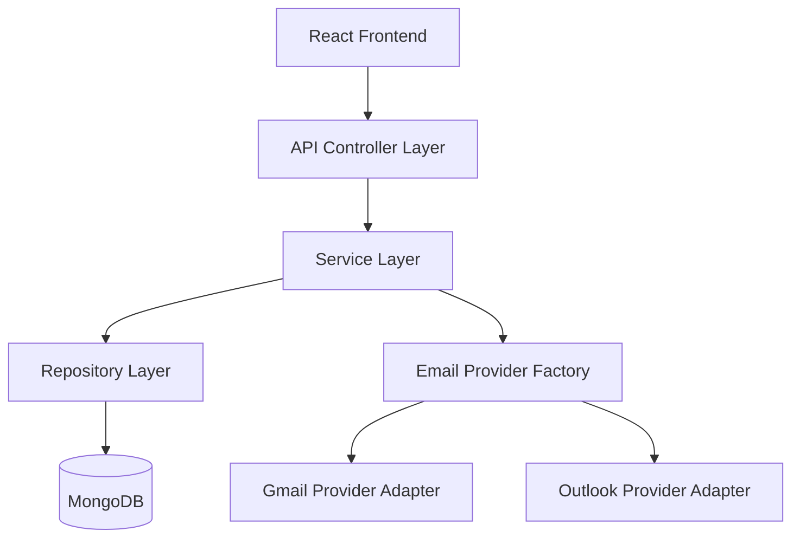
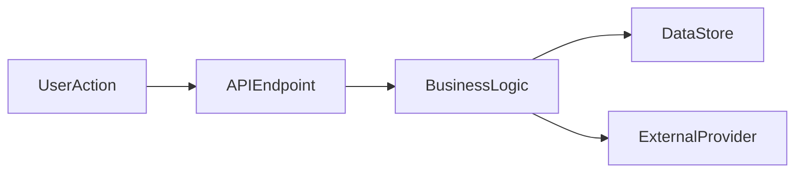
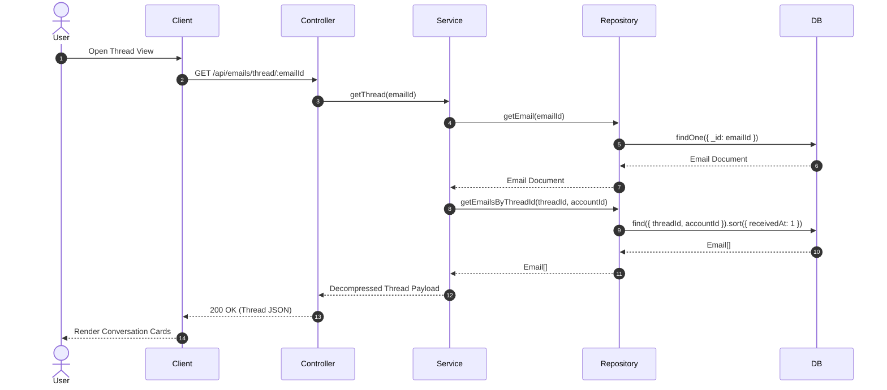
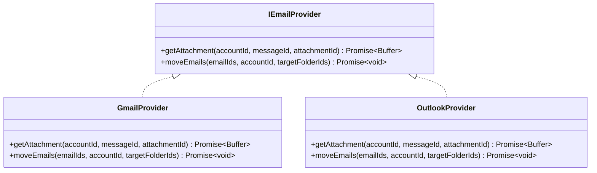
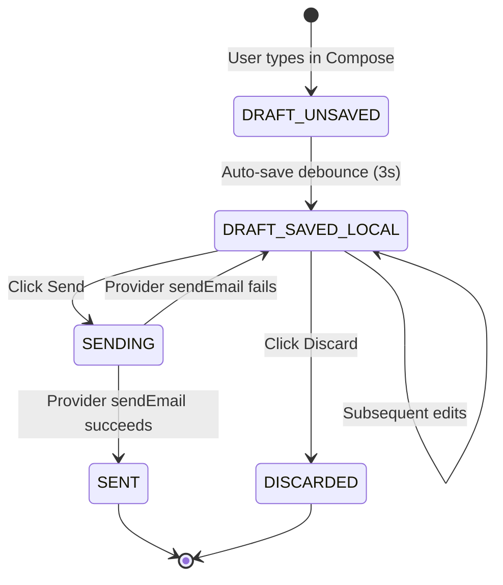

# Implementation Plan Standards

> **Scope:** All implementation plan documents across the MailSense project.
> **Location:** All plans MUST live under `mailsense/.agents/plans/` — never in `Backend/.agents/plans/` or `Frontend/.agents/plans/`.

---

## 1. File Organization

### 1.1 Single-File Format (Mandatory)

Every implementation plan MUST be a **single self-contained markdown file**. Do NOT split a plan into separate files. All sections — requirements, design, phases, verification — belong in **one file**.

### 1.2 Naming Convention & Directory Structure

```
mailsense/.agents/plans/<feature-name>/
├── implementation-plan.md                  ← Feature High-Level Plan
└── types-implementation-plan.md            ← Shared Types Contract Plan (@mailsense/types)
```

- Use **kebab-case** for feature folder names (`email-experience-completion`, `background-sync`, etc.).
- Inside each feature folder, use `implementation-plan.md` for the main plan and `types-implementation-plan.md` for shared contract types.

### 1.3 Canonical Location

```
mailsense/.agents/plans/
├── mailsense-development-roadmap.md             ← Master roadmap (one file, rarely updated)
├── email-experience-completion/                 ← Feature folder
│   ├── implementation-plan.md
│   └── types-implementation-plan.md
├── background-sync/                             ← Feature folder
│   ├── implementation-plan.md
│   └── types-implementation-plan.md
└── ...
```

- **Never** create plan files under `Backend/.agents/plans/` or `Frontend/.agents/plans/`.
- The master roadmap (`mailsense-development-roadmap.md`) is the only file that is NOT inside a feature subdirectory — it is the strategic north-star document.

### 1.4 Centralization of `@mailsense/types` Contract Changes

- All proposed `@mailsense/types` interface/enum additions and contract updates MUST be documented **exclusively and initially in `types-implementation-plan.md`**.
- Feature implementation plans (`implementation-plan.md` or feature phase implementation documents) MUST **NOT** include separate `@mailsense/types` proposed code blocks or task steps modifying `@mailsense/types`.
- Feature implementation plans MUST directly import and consume types from `@mailsense/types` assuming they are defined initially by `types-implementation-plan.md`.

---

## 2. Mandatory Document Structure

Every implementation plan MUST contain all of the following sections in this exact order. If a section is genuinely not applicable, include the heading with a brief explanation of why it's not applicable (e.g., "N/A — no new infrastructure required").

```markdown
# <Feature Name> — Implementation Plan

> **Phase:** <Phase number from roadmap> · **Release Target:** <version>
> **Priority:** <🔴 HIGH | 🟡 MEDIUM | 🟢 LOW> — <one-line justification>
> **Status:** <DRAFT | APPROVED | IN PROGRESS | COMPLETED>
> **Created:** <YYYY-MM-DD> · **Last Updated:** <YYYY-MM-DD>

---

## 1. Overview

## 2. Requirements

## 3. Design

## 4. Proposed Changes

## 5. Implementation Phases

## 6. Dependencies & Constraints

## 7. Risk Assessment & Mitigation

## 8. Verification Plan

## 9. Open Questions & Decisions
```

---

## 3. Section Specifications

### 3.1 Overview

Provide concise context for why this implementation exists.

**Required sub-sections:**

| Sub-section              | Content                                                                                |
| ------------------------ | -------------------------------------------------------------------------------------- |
| **Problem Statement**    | What user-facing or technical problem does this solve?                                 |
| **Goals**                | Bulleted list of what this implementation achieves.                                    |
| **Non-Goals**            | Explicit boundaries — what this plan does NOT cover.                                   |
| **Background / Context** | Relevant architectural context, prior decisions, or links to the master roadmap phase. |

```markdown
## 1. Overview

### Problem Statement

<What problem are we solving and why now?>

### Goals

- <Goal 1>
- <Goal 2>

### Non-Goals

- <Explicit boundary 1>
- <Explicit boundary 2>

### Background

<Link to roadmap phase, prior implementation, or architectural context.>
```

---

### 3.2 Requirements

Capture what the end-user and system need — BEFORE jumping into technical design. This section is from the **user's perspective**.

**Required sub-sections:**

| Sub-section                                | Content                                                                                  |
| ------------------------------------------ | ---------------------------------------------------------------------------------------- |
| **User Stories / Functional Requirements** | Numbered list of user-facing behaviors. Use "As a user, I can..." or numbered FR format. |
| **Non-Functional Requirements**            | Performance, security, scalability, accessibility constraints.                           |
| **Acceptance Criteria**                    | Testable conditions that must be true for the implementation to be considered complete.  |

```markdown
## 2. Requirements

### Functional Requirements

1. **FR-01:** Users can view all emails in a conversation thread grouped together.
2. **FR-02:** Users can expand/collapse individual messages within a thread.
3. **FR-03:** Thread view displays the message count and latest timestamp.

### Non-Functional Requirements

- **NFR-01:** Thread view must load within 500ms for threads with ≤50 messages.
- **NFR-02:** Memory usage must stay under 256MB during sync operations.
- **NFR-03:** All attachment downloads must be streamed (not buffered in memory).

### Acceptance Criteria

- [ ] Thread API returns all emails with matching threadId in chronological order.
- [ ] Single-email threads render in the existing email detail view (no regression).
- [ ] Attachment download works for both Gmail and Outlook providers.
```

---

### 3.3 Design

Technical design covering architecture, data models, API contracts, state management, and detailed diagrams. Scale depth to feature scope; for medium and large features, comprehensive HLD and LLD diagrams are mandatory.

**Required sub-sections:**

| Sub-section                                 | Content                                                                                                                              | Diagram Requirements                                                                                                                                                                                                                                                                                                               |
| ------------------------------------------- | ------------------------------------------------------------------------------------------------------------------------------------ | ---------------------------------------------------------------------------------------------------------------------------------------------------------------------------------------------------------------------------------------------------------------------------------------------------------------------------------- |
| **High-Level Design (HLD)**                 | System-level architecture topology, component boundaries, client-server-DB interactions, external integrations, data pipeline flows. | **Mandatory Diagrams:**<br>1. Architecture Topology (`graph TD`/`graph LR`) showing client, controller, service, queue, DB, external APIs.<br>2. End-to-End Data Flow / Pipeline (`graph LR`).                                                                                                                                     |
| **Low-Level Design (LLD)**                  | Deep-dive design specifications detailing exact sequence flows, class models, state machines, and algorithmic steps.                 | **Mandatory Diagrams:**<br>1. Sequence Diagrams (`sequenceDiagram`) for all API endpoints, async jobs, and state workflows.<br>2. Class / Interface Diagram (`classDiagram`) showing models, interfaces, repositories, provider strategy pattern adapters.<br>3. State Machine Diagrams (`stateDiagram-v2`) for entity lifecycles. |
| **Data Models / Schema Changes**            | New or modified MongoDB schemas, TypeScript interfaces, enums. Show exact fields, types, and indexes.                                | Code blocks showing TypeScript interfaces and Mongoose schema definitions in full.                                                                                                                                                                                                                                                 |
| **API Contracts**                           | REST endpoint specifications.                                                                                                        | Table specifying HTTP Method, Path, Request Body, Response Shape, Status Codes, and Description.                                                                                                                                                                                                                                   |
| **State Management** (frontend-heavy plans) | React Query keys, polling strategies, optimistic UI updates, cache invalidation rules.                                               | Structured list / table detailing query keys and cache invalidation dependencies.                                                                                                                                                                                                                                                  |

````markdown
## 3. Design

### 3.1 High-Level Design

#### System Architecture Topology


````

#### Data Flow & Pipeline



### 3.2 Low-Level Design

#### Sequence Diagrams



#### Class & Interface Diagram



#### State Machine Diagram



### 3.3 Data Models

<New/modified schemas with field-level detail. Use TypeScript code blocks for interfaces and Mongoose schemas.>

### 3.4 API Contracts

| Method | Path                          | Request Body | Response                                | Description                |
| ------ | ----------------------------- | ------------ | --------------------------------------- | -------------------------- |
| `GET`  | `/api/emails/thread/:emailId` | —            | `{ thread: Email[], threadId: string }` | Get all emails in a thread |

### 3.5 State Management

<Describe React Query keys, polling, and cache strategies.>

````

**Design diagram guidelines:**
- Use **mermaid** diagrams (`graph`, `sequenceDiagram`, `classDiagram`, `stateDiagram-v2`).
- Diagrams must cover all main flows, endpoints, and domain models cleanly without relying on hand-waving text.
- Standardize sequence diagrams with step numbers (`autonumber`), participant aliases, clear request/response messages, and error paths.

---

### 3.4 Proposed Changes

File-level change manifest. Group by component (e.g., Backend, Frontend). For each file, specify whether it's NEW, MODIFY, or DELETE. Include code snippets for critical changes.

> **Note:** Proposed contract additions or modifications for `@mailsense/types` belong exclusively in `types-implementation-plan.md`. Feature implementation plans directly import and consume types from `@mailsense/types`.

```markdown
## 4. Proposed Changes

### Backend

#### [MODIFY] [email.model.ts](file:///path/to/file)
- Import `EmailAttachment` directly from `@mailsense/types`
- Add `attachments` field to `EmailSchema`

#### [NEW] `Backend/src/modules/drafts/`
| File | Purpose |
|---|---|
| `draft.model.ts` | Mongoose schema |
| `draft.service.ts` | Business logic |

### Frontend

#### [NEW] `Frontend/src/features/emails/components/ThreadView.tsx`
- Import `EmailAttributes` from `@mailsense/types`
````

---

### 3.5 Implementation Phases

Break the work into **sequential, testable phases**. Each phase should be independently shippable or at least independently testable.

**Each phase MUST include:**

| Element                 | Description                                          |
| ----------------------- | ---------------------------------------------------- |
| **Phase title**         | Descriptive name                                     |
| **Objective**           | One sentence explaining what this phase accomplishes |
| **Task checklist**      | Detailed `- [ ]` checklist of implementation tasks   |
| **Files to create**     | List of new files                                    |
| **Files to modify**     | List of modified files                               |
| **Acceptance criteria** | Testable conditions for phase completion             |
| **Estimated effort**    | Low / Medium / High (or time estimate)               |

```markdown
## 5. Implementation Phases

### Phase 1: <Phase Title>

**Objective:** <What this phase accomplishes>
**Estimated Effort:** <Low | Medium | High>

#### Tasks

- [ ] Task 1
- [ ] Task 2
  - [ ] Sub-task 2a
  - [ ] Sub-task 2b

#### Files to Create

- `path/to/new/file.ts`

#### Files to Modify

- `path/to/existing/file.ts`

#### Acceptance Criteria

1. <Testable condition 1>
2. <Testable condition 2>

---

### Phase 2: <Phase Title>

...
```

**Phase ordering guidelines:**

- Dependencies first (shared types defined initially in `types-implementation-plan.md` → backend → frontend).
- Low-risk changes before high-risk changes.
- Data/schema changes before business logic.
- Backend before frontend (APIs must exist before UI consumes them).

---

### 3.6 Dependencies & Constraints

Enumerate all technical dependencies, new packages, infrastructure requirements, and known constraints.

```markdown
## 6. Dependencies & Constraints

### New Dependencies

| Package  | Version | Purpose                |
| -------- | ------- | ---------------------- |
| `bullmq` | `^5.x`  | Redis-backed job queue |

### Infrastructure Requirements

- Redis instance (required for BullMQ)

### Existing Dependencies (leveraged)

| Dependency         | Notes                                             |
| ------------------ | ------------------------------------------------- |
| `@mailsense/types` | Must be published before backend/frontend changes |

### Constraints

- Memory limit: 256MB RAM on deployment target
- Gmail API rate limit: 250 quota units per user per second
```

---

### 3.7 Risk Assessment & Mitigation

Identify risks with impact levels and concrete mitigation strategies.

```markdown
## 7. Risk Assessment & Mitigation

| Risk                                  | Impact | Likelihood | Mitigation                                               |
| ------------------------------------- | ------ | ---------- | -------------------------------------------------------- |
| Large attachments cause OOM           | HIGH   | MEDIUM     | Stream attachments to response, don't buffer             |
| Gmail rate limits during sync         | MEDIUM | HIGH       | Per-user rate limiting, exponential backoff              |
| Schema migration breaks existing data | HIGH   | LOW        | Default new fields to safe values, backfill on next sync |
```

---

### 3.8 Verification Plan

How the implementation will be validated. Cover both automated and manual testing.

````markdown
## 8. Verification Plan

### Automated Tests

```bash
# Commands to run
cd Backend && pnpm test
cd Frontend && pnpm build
```
````

#### Unit Test Cases

| Feature     | Test Case         | Expected Result                           |
| ----------- | ----------------- | ----------------------------------------- |
| Thread View | Query by threadId | Returns all emails in chronological order |

### Integration Tests

- <End-to-end flow description>

### Manual Verification

- [ ] Open email in thread → see conversation view
- [ ] Download attachment → file saves correctly

````

---

### 3.9 Open Questions & Decisions

Unresolved questions that need user/team input before or during implementation. Use GitHub-style alerts for importance levels.

```markdown
## 9. Open Questions & Decisions

> [!IMPORTANT]
> **Q1: Attachment Storage Strategy**
> Should attachments be cached locally or always proxied from the provider on-demand?
> - **Option A (Recommended):** On-demand proxy — saves storage, always fresh
> - **Option B:** Local cache — faster subsequent access, works offline

> [!NOTE]
> **Q2: Thread scope**
> Should cross-account threads be merged or stay account-scoped?
> - **Recommendation:** Account-scoped (simpler, matches provider behavior)

### Resolved Decisions
| Decision | Resolution | Date |
|---|---|---|
| Draft sync strategy | Local-only for MVP | 2026-08-01 |
````

---

## 4. Formatting & Style Rules

### 4.1 General Formatting

- Use **horizontal rules** (`---`) between major sections.
- Use **mermaid** for all diagrams (architecture, sequence, class, state).
- Use **tables** for structured data (APIs, dependencies, risks, test cases).
- Use **code blocks** with language identifiers for all code snippets.
- Use **diff blocks** (` ```diff `) to show schema/interface modifications.
- Use **file links** with `file:///` scheme for all referenced source files.
- Use **GitHub-style alerts** (`[!NOTE]`, `[!IMPORTANT]`, `[!WARNING]`, `[!CAUTION]`) for callouts.

### 4.2 Code Snippets

- Include code snippets only for **critical or non-obvious changes** — not every line of implementation.
- TypeScript interfaces and schema definitions should always be shown in full.
- API endpoint signatures should always be shown.
- Internal business logic can be described in prose unless the algorithm is complex.

### 4.3 Section Depth Guidelines

Scale section depth to the complexity of the feature:

| Feature Complexity                       | Design Depth             | Diagrams Required                                          | Phases      |
| ---------------------------------------- | ------------------------ | ---------------------------------------------------------- | ----------- |
| **Small** (single component, <5 files)   | Brief HLD, core schema   | 1 Sequence Diagram                                         | 1–2 phases  |
| **Medium** (cross-cutting, 5–15 files)   | Full HLD + LLD + schemas | Topology + 2 Sequence + Class Diagram                      | 2–4 phases  |
| **Large** (new system/module, 15+ files) | Full HLD + LLD + specs   | Topology + Data Flow + 3+ Sequence + Class + State Machine | 4–6+ phases |

### 4.4 Strict Type Safety & Coding Standards

- **No `any`, `never`, or `unknown` Types:** Never use `any`, `never`, or `unknown` as type placeholders, return types, or parameter types under any circumstances. Always use explicit, well-defined TypeScript interfaces or generic constraints.
- **No Inline Object Types:** Do not define inline object types (e.g. `{ accountId: string, email: string }`) in components, hooks, controllers, or service methods. Always define and import proper interfaces from `@mailsense/types` (or dedicated feature interface files). An inline type definition is permitted **ONLY** if it contains a maximum of 1 or 2 primitive keys.

---

## 5. Plan Lifecycle

### 5.1 Status Tracking

Every plan MUST have a `Status` field in the header metadata:

| Status        | Meaning                                               |
| ------------- | ----------------------------------------------------- |
| `DRAFT`       | Plan is being written, not yet ready for review       |
| `APPROVED`    | User has reviewed and approved the plan for execution |
| `IN PROGRESS` | Implementation has started                            |
| `COMPLETED`   | All phases are done and verified                      |
| `SUPERSEDED`  | Replaced by a newer plan (link to replacement)        |

### 5.2 Update Protocol

- Update the `Last Updated` date whenever the plan content changes.
- Mark resolved open questions in the "Resolved Decisions" table.
- Do NOT delete completed phase checklists — mark them as `[x]` for audit trail.
- If a plan needs significant revision during implementation, update the plan and re-request user approval before continuing.

### 5.3 Completion

When a plan is fully implemented:

1. Set status to `COMPLETED`.
2. Ensure all phase checklists are marked `[x]`.
3. Update `CHANGELOG.md`, `features-list.md`, and `CODEBASE_INDEX.md` as applicable.
4. Keep the plan file in `plans/` as a permanent record — never delete completed plans.

---

## 6. Anti-Patterns to Avoid

| ❌ Don't                                                           | ✅ Do Instead                                                                |
| ------------------------------------------------------------------ | ---------------------------------------------------------------------------- |
| Split plan into multiple files (`*-plan.md` + `*-phases.md`)       | Keep everything in one file                                                  |
| Put plans in `Backend/.agents/plans/` or `Frontend/.agents/plans/` | All plans go in `mailsense/.agents/plans/`                                   |
| Jump straight to code-level changes without requirements           | Always start with user-facing requirements                                   |
| Write implementation phases without acceptance criteria            | Every phase needs testable completion conditions                             |
| Skip diagrams or summarize LLD in vague hand-waving text           | Include Sequence, Class, and State Machine diagrams for LLD                  |
| Use placeholder text like "TBD" or "TODO" in approved plans        | Resolve all sections before requesting approval                              |
| Create deeply nested subdirectories for plan files                 | Flat structure: one file per plan in `plans/`                                |
| Omit the status/dates metadata                                     | Always include status, created date, and last updated date                   |
| Write essays instead of structured sections                        | Use tables, checklists, and diagrams for scannability                        |
| Duplicate the master roadmap content in individual plans           | Reference the roadmap, don't copy it                                         |
| Duplicate proposed `@mailsense/types` code or tasks in feature plans | Define `@mailsense/types` changes exclusively in `types-implementation-plan.md` |
| Use `any`, `never`, or `unknown` types in backend or frontend      | Always use proper, compiler-enforced interfaces from `@mailsense/types`      |
| Define inline object types across functions or components          | Import exported interface definitions from types files (inline max 1–2 keys) |
