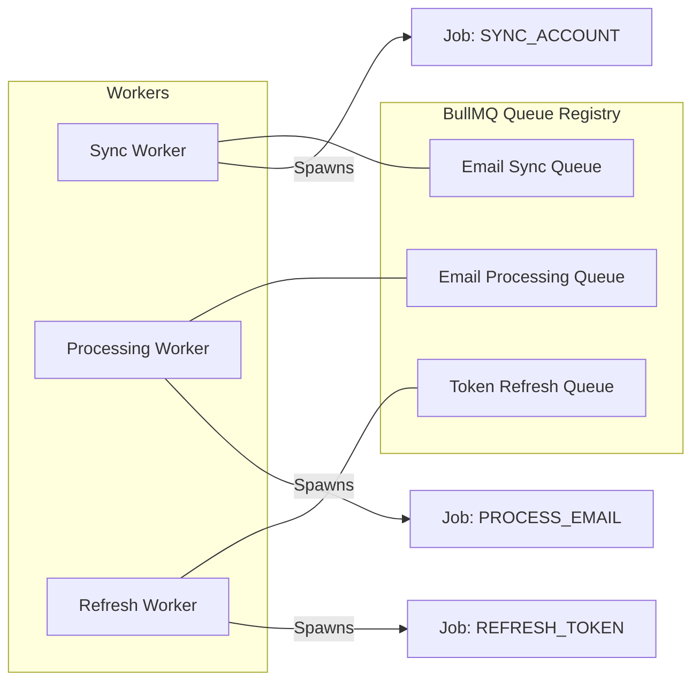
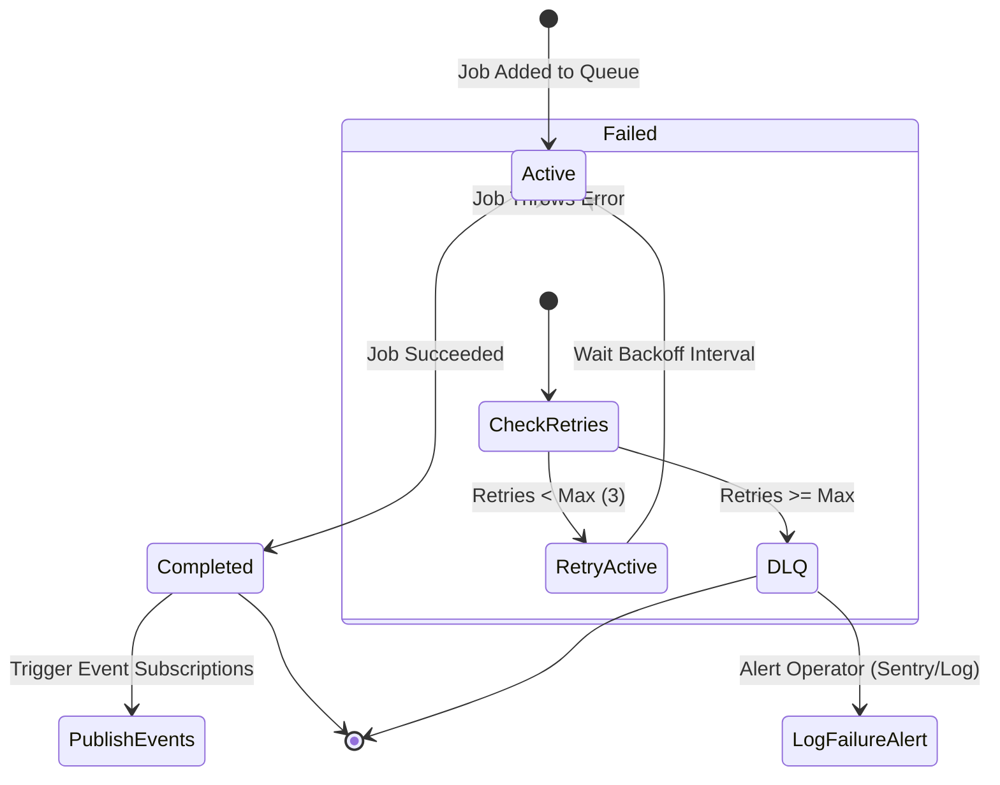
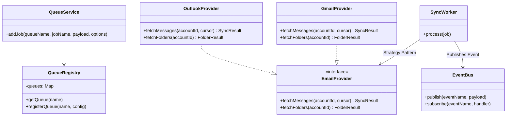
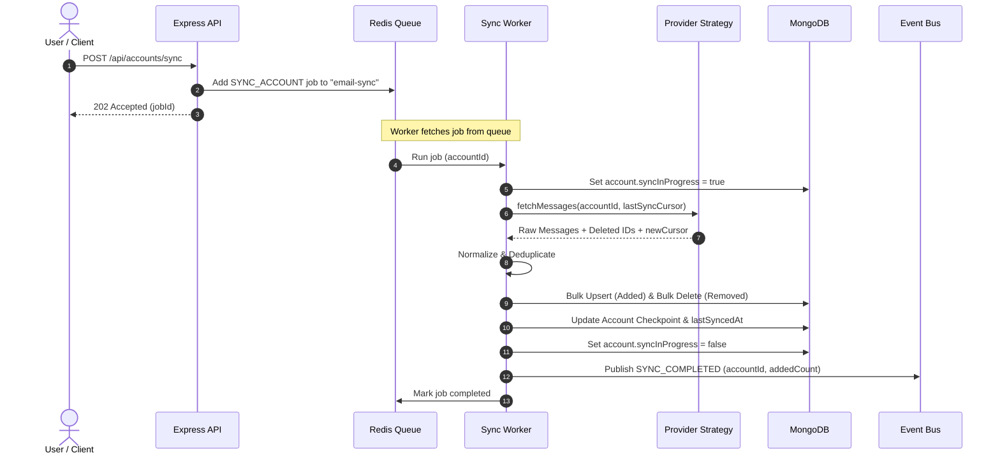
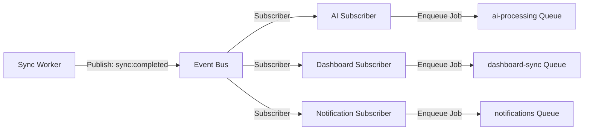

# MailSense Background Sync System: Master Implementation Plan

This document outlines the architectural design, specifications, and execution roadmap for transitioning the MailSense email synchronization process from a synchronous execution model to a robust, asynchronous background processing pipeline using BullMQ and Redis.

---

## 1. Overview

### Purpose of the New Architecture
The MailSense Background Sync System is designed to decouple the ingestion of emails and folders from the HTTP request-response cycle. By handling data synchronization asynchronously, the application can scale efficiently, provide instant feedback to users, handle large batches of emails without timeouts, and easily extend functionality using an event-driven design.

### Current Problems
1. **Request Timeouts**: Large mailboxes take minutes to sync, leading to HTTP request timeouts (typically 30 seconds at the gateway layer).
2. **Blocked User Experience**: The user must wait for the entire sync process to complete before the UI renders initial results.
3. **Tight Coupling**: The synchronization logic is tightly coupled with the core controllers. Adding future workflows (like AI summarization, search indexing, or notifications) directly into the sync loop would compound latency and introduce multiple points of failure.
4. **Poor Reliability & Fault Tolerance**: Intermittent network failures or API rate limits during sync result in partial data ingestion and unhandled error states.
5. **No Dynamic Scheduling**: There is no background system to automatically run periodic syncs based on user settings or account status.

### Benefits
* **High Responsiveness**: API endpoints return a `202 Accepted` status immediately after queuing a job.
* **Separation of Concerns**: Sync workers are responsible *only* for fetching, normalizing, and saving emails. They communicate with the rest of the system via an event bus.
* **Resilience**: Failed sync attempts are automatically retried using exponential backoff, with a Dead Letter Queue (DLQ) for permanent failures.
* **Scalability**: Concurrency can be tuned per-worker to match resource availability (e.g., matching the 0.1 vCPU/256MB RAM constraints of the deployment environment).
* **Extensibility**: Future workers (AI, Dashboard, Notifications) consume events asynchronously, meaning their latency or failures do not affect email ingestion.

### Goals
* Design a production-grade background sync architecture utilizing BullMQ and Redis.
* Decouple Gmail and Outlook sync mechanisms using a polymorphic strategy pattern.
* Implement an event-driven message propagation system to trigger downstream actions (AI, analytics, notifications).
* Provide a checklist-based, step-by-step rollout plan.

### Non-Goals
* Implementing the downstream event consumers (AI, Dashboard, etc.) in this phase. This plan only sets up the triggers (events) for them.
* Re-implementing the core Gmail/Outlook API clients (they are already functional; we are wrapping them).

---

## 2. Current Architecture

Currently, MailSense processes account synchronization synchronously during HTTP requests:

```
[Client App] 
    ↓ HTTP POST /api/accounts/sync (or during Callback)
[AccountController]
    ↓ syncAccounts() / syncAccount()
[AccountService]
    ↓ startAccountSync()
    ├─► syncGmailAccount() ────► [Gmail API] (Fetch messages & history)
    ├─► syncOutlookAccount() ──► [Graph API] (Fetch messages & delta)
    ↓
[EmailRepository] (Bulk upsert & delete emails)
    ↓
[FolderService]
    ↓ syncFolders() ───────────► [Provider API] (Fetch labels/folders)
    ↓
[Client App] (HTTP 200 OK Response with success metadata)
```

### Key Issues in the Current Flow
* **Lacks Decoupling**: If `syncGmailAccount` succeeds but `folderService.syncFolders` fails, the entire request fails or throws.
* **Synchronous Execution**: The API client makes several HTTP calls to Google/Microsoft services sequentially while holding the client's connection open.
* **Resource Exhaustion**: Synchronous loop iteration consumes memory and CPU on the main API server thread, blocking incoming HTTP requests.
* **No Event Distribution**: Other parts of the app (like analytics) cannot know when new emails are added except by polling the database or coupling calls inside `syncGmailAccount`/`syncOutlookAccount`.

---

## 3. Target Architecture

The target architecture introduces a job queue and an event-driven system to process tasks in the background.

### High-Level Architecture

```mermaid
graph TD
    Client[Client UI / Client App] -->|HTTP POST /sync| API[Express API Server]
    API -->|1. Enqueue Job| Redis[(Redis DB)]
    API -->|2. Return 202 Accepted| Client
    
    subgraph Background Processing Layer
        Worker[BullMQ Worker] <-->|3. Poll / Process Job| Redis
        Worker -->|4. Request Sync| ProviderStrategy[Provider Strategy Factory]
        ProviderStrategy -->|5. Sync Sync Sync| Gmail[Gmail Provider]
        ProviderStrategy -->|5. Sync Sync Sync| Outlook[Outlook Provider]
        Gmail <-->|6. Fetch API Data| GAPI[Gmail API]
        Outlook <-->|6. Fetch API Data| OAPI[Graph API]
        
        Worker -->|7. Bulk Ingestion| DB[(MongoDB)]
        Worker -->|8. Publish Event| EventBus[Internal Event Bus]
    end
    
    subgraph Event Consumers (Future Workers)
        EventBus -->|Publish: EMAIL_CREATED| AIWorker[AI Processing Worker]
        EventBus -->|Publish: SYNC_COMPLETED| DashWorker[Dashboard Worker]
        EventBus -->|Publish: EMAIL_CREATED| NoteWorker[Notification Worker]
        EventBus -->|Publish: SYNC_COMPLETED| AnalWorker[Analytics Worker]
        EventBus -->|Publish: EMAIL_CREATED| SearchWorker[Search Indexer Worker]
    end
```

### Worker Architecture

MailSense will run separate worker instances (or multiple concurrency sandboxes within one worker class) to execute code in isolation:



### Queue Pipeline Flow



### Module Interaction



### Data Flow



---

## 4. Recommended Folder Structure

To keep the codebase modular, OOP-centric, and maintainable, we will restructure background-processing related classes and utilities as follows:

```
src/
├── core/
│   ├── queue/                      # Core Queue Management
│   │   ├── redis.connection.ts     # ioredis client provider
│   │   ├── queue.registry.ts       # Registry for BullMQ Queue instances
│   │   ├── queue.service.ts        # Service class to enqueue jobs
│   │   ├── queue.config.ts         # Queue options, backoffs, concurrency settings
│   │   └── index.ts                # Queue initialization & clean shutdowns
│   └── events/                     # System-wide Internal Event Bus
│       ├── event-bus.ts            # Core EventEmitter implementation
│       ├── event.types.ts          # Strongly typed events definitions
│       └── handlers/               # Event subscriber registrations
│           ├── sync-completed.handler.ts
│           └── email-created.handler.ts
├── workers/                        # BullMQ Workers (Independent executors)
│   ├── base.worker.ts              # Base class with shared worker lifecycle
│   ├── sync.worker.ts              # Sync Worker implementation
│   ├── token-refresh.worker.ts     # Background Token refresher
│   └── processors/                 # Sandboxed/Isolated job execution files
│       ├── sync-account.processor.ts
│       └── refresh-token.processor.ts
├── providers/                      # Provider Strategy Pattern
│   ├── email/
│   │   ├── email.provider.ts       # Common interface (IEmailProvider)
│   │   ├── email.provider.factory.ts # Factory to instantiate Gmail/Outlook
│   │   ├── gmail.provider.ts       # Wrapped GmailService adapter
│   │   └── outlook.provider.ts     # Wrapped OutlookService adapter
├── repositories/                   # Clean separation of database access
│   ├── account.repository.ts
│   ├── email.repository.ts
│   └── sync-job.repository.ts      # Tracks background job execution state
├── modules/                        # Domain specific routes/controllers
│   ├── accounts/
│   ├── emails/
│   └── folders/
└── shared/
    └── utils/
        └── logger.ts               # Structured logger with correlation ID context
```

### Architectural Decision Note: Centralized Providers and Repositories
* **Why**: Moving the core integration adapters from `src/integrations` to a unified `src/providers/email` namespace enforces a strict polymorphic strategy pattern.
* **Benefits**: The core application modules depend on `IEmailProvider` rather than concrete `GmailService` or `OutlookService` instances, enabling seamless integration of new providers (e.g. Yahoo Mail or generic IMAP) in the future.

---

## 5. Queue System Design

The background processing relies on **BullMQ**, a Redis-backed queue system for Node.js.

### Redis Connection
We will configure a dedicated Redis connection manager (`redis.connection.ts`) utilizing `ioredis`. 
* **Crucial BullMQ Requirement**: Connections used by BullMQ Workers must set `maxRetriesPerRequest: null` to prevent connections from dropping during long-running tasks.
* **SSL & Authentication**: The connection will read configuration parameters (`REDIS_HOST`, `REDIS_PORT`, `REDIS_PASSWORD`, `REDIS_TLS`) and support secure Redis connections for production environments.

### Queue Registry
A singleton class `QueueRegistry` manages the lifecycle of the actual `Queue` and `QueueScheduler` instances. It guarantees that queues are declared only once and can be shut down cleanly during application termination.

### Queue Service
The `QueueService` class exposes strongly-typed helper methods for adding jobs to BullMQ queues, ensuring developer safety when dispatching background work.

```typescript
export class QueueService {
  public async addSyncAccountJob(accountId: string, trigger: 'manual' | 'scheduled'): Promise<Job> {
    return this.registry.getQueue('email-sync').add(
      'SYNC_ACCOUNT',
      { accountId, trigger },
      {
        priority: trigger === 'manual' ? 1 : 2, // Manual sync runs first
        attempts: 3,
        backoff: { type: 'exponential', delay: 5000 }
      }
    );
  }
}
```

### Retry Strategy & Dead Letter Queue (DLQ)
* **Strategy**: When a job throws an error (e.g., API rate limiting or temporary timeout), BullMQ will retry it. We implement an **exponential backoff** strategy: `delay * (2 ^ (attempt - 1))`.
* **DLQ Handler**: If a job fails after the maximum attempts (e.g., 3), the job is moved to the "failed" state. An event listener catches these failures, logs structured error context, issues alerts via Sentry, and updates the `SyncJob` database record to `FAILED` with the corresponding stack trace.

### Concurrency & Rate Limiting
* **Concurrency**: Given the low memory boundary (256MB RAM) of the hosting environment, the worker concurrency limits will be configurable. The default concurrency will be set to `2` concurrent jobs per worker instance.
* **Rate Limiting**: To prevent hitting API rate limits of Gmail (Google API quota) and Outlook (Microsoft Graph throttling), workers will leverage token buckets or BullMQ's rate-limiting options. If a rate limit error is detected (HTTP 429), the job will be delayed explicitly.

---

## 6. Job Types Design

The background system supports five primary jobs:

| Job Name | Queue Name | Payload Interface | Description |
|---|---|---|---|
| `SYNC_ACCOUNT` | `email-sync` | `SyncAccountPayload` | Synchronize a specific email account. |
| `SYNC_USER` | `email-sync` | `SyncUserPayload` | Batch sync all active accounts belonging to a user. |
| `PROCESS_EMAIL` | `email-processing` | `ProcessEmailPayload` | Triggers indexing, category classification, or rules engine. |
| `DELETE_EMAIL` | `email-sync` | `DeleteEmailPayload` | Deletes an email on the provider server. |
| `REFRESH_TOKEN` | `token-refresh` | `RefreshTokenPayload` | Refreshes OAuth credentials before expiration. |

### Payload Interfaces

```typescript
export interface SyncAccountPayload {
  accountId: string;
  triggerType: 'manual' | 'scheduled';
  forceFullSync?: boolean;
}

export interface SyncUserPayload {
  userId: string;
}

export interface ProcessEmailPayload {
  emailId: string;
  accountId: string;
}

export interface DeleteEmailPayload {
  emailIds: string[];
  accountId: string;
  trash: boolean;
}

export interface RefreshTokenPayload {
  accountId: string;
}
```

---

## 7. Worker Design

The `SyncWorker` is the core background thread executing the synchronization logic.

```
                  [BullMQ Job Event]
                           ↓
              Set job state to RUNNING
              Generate Correlation ID
                           ↓
            Check database for Account Status
                 (Active / Disabled?)
                           ↓
            Execute Provider OAuth Validation
                           ↓
          Perform Incremental / Full Email Sync
                           ↓
           Bulk Save Emails & Sync Checkpoint
                           ↓
               Set job state to COMPLETED
                           ↓
               Emit SYNC_COMPLETED Event
```

### Lifecycle Hooks
* **`onActive`**: Marks the `SyncJob` record as `RUNNING` in MongoDB, updates the account's `syncInProgress` field to `true`, and records the start time.
* **`onCompleted`**: Marks the `SyncJob` record as `COMPLETED`, updates the account's `syncInProgress` to `false`, updates the `lastSyncedAt` timestamp, and triggers event publishing.
* **`onFailed`**: Logs the exact stack trace, reports it to Sentry, marks `syncInProgress` as `false`, updates the account's `lastSyncError` field, and marks the `SyncJob` record as `FAILED`.

### Logging and Correlation IDs
For traceability, every job run must initialize a local context holding a unique `Correlation ID` (inherited from the HTTP request or generated upon job dequeue). All logs written during the execution of that job will print the Correlation ID to allow easy log tracing across systems.

### Cancellation Support
If a user deletes their email account while a sync job is executing, the worker checks a Redis cancellation registry or tests if the account model exists in MongoDB during pagination loops. If the account is missing, the job aborts execution safely.

---

## 8. Provider Strategy Pattern

Enforcing the strategy pattern allows MailSense to orchestrate email synchronization without coupling the worker code to Google's or Microsoft's API libraries.

```typescript
// src/providers/email/email.provider.ts

export interface SyncResult {
  addedEmails: EmailInput[];
  deletedEmailIds: string[];
  newCheckpoint: string;
  hasMore: boolean;
}

export interface FolderResult {
  folders: FolderInput[];
}

export interface IEmailProvider {
  fetchEmails(accountId: string, checkpoint?: string): Promise<SyncResult>;
  fetchFolders(accountId: string): Promise<FolderResult>;
}
```

### Gmail Implementation (`gmail.provider.ts`)
* Acts as an adapter wrapping `GmailService`.
* Maps the `lastSyncCursor` to Gmail's `historyId`.
* Implements incremental sync using `getMessagesAfterLastHistory` and full sync using `getMessages` if history is expired or unavailable.

### Outlook Implementation (`outlook.provider.ts`)
* Acts as an adapter wrapping `OutlookService`.
* Maps the `lastSyncCursor` to Microsoft Graph's `deltaLink` URL.
* Performs delta syncs using Graph's `$delta` query parameters.

### Registry Factory Pattern

```typescript
// src/providers/email/email.provider.factory.ts
import { AccountProvider } from '@types';
import { IEmailProvider } from './email.provider.js';
import { GmailProvider } from './gmail.provider.js';
import { OutlookProvider } from './outlook.provider.js';

export class EmailProviderFactory {
  private static providers: Map<AccountProvider, IEmailProvider> = new Map();

  public static getProvider(providerType: AccountProvider): IEmailProvider {
    let provider = this.providers.get(providerType);
    if (!provider) {
      if (providerType === AccountProvider.GMAIL) {
        provider = new GmailProvider();
      } else if (providerType === AccountProvider.OUTLOOK) {
        provider = new OutlookProvider();
      } else {
        throw new Error(`Unsupported email provider type: ${providerType}`);
      }
      this.providers.set(providerType, provider);
    }
    return provider;
  }
}
```

---

## 9. Synchronization Pipeline Stages

A single execution loop of the `SyncWorker` executes a pipeline composed of six separate stages:

```
[Fetch Stage] ─────► [Normalize Stage] ──► [Deduplicate Stage]
                                                 │
                                                 ▼
[Publish Stage] ◄─── [Checkpoint Stage] ◄── [Bulk Save Stage]
```

### 1. Fetch Stage
* The worker fetches the account's credentials, gets the appropriate provider class from `EmailProviderFactory`, and fetches changes since `account.lastSyncCursor`.
* If fetching fails due to expired tokens, the worker triggers an immediate inline token refresh before retrying the fetch.

### 2. Normalize Stage
* Raw API messages (JSON payloads) are converted into a standardized `EmailInput` object format conforming to the MailSense schema.
* Plain text and HTML bodies are extracted and compressed using `zlib` (already an established project standard) to save database space.

### 3. Deduplicate Stage
* The worker filters incoming messages against the database using their `providerMessageId` and `accountId` to ensure duplicate entries are not processed.

### 4. Bulk Save Stage
* Handled using MongoDB bulk write operations to ensure efficiency:
  * New/updated emails: `bulkWrite` containing `updateOne` commands with `upsert: true`.
  * Deleted emails: `deleteMany` commands targeting the array of removed IDs returned by the provider.

### 5. Checkpoint Stage
* Saves the newly acquired cursor (`historyId` or `deltaLink`) as the account's new `lastSyncCursor` in MongoDB.
* Updates timestamps (`lastSyncCompletedAt`, `lastSyncedAt`).

### 6. Publish Stage
* Emits events to the internal Event Bus indicating the details of the synchronization run (e.g., number of added and deleted emails).

---

## 10. Event System Design

To maintain strict boundaries between the Email Sync System and subsequent modules (AI, Dashboard, Notifications), we use an event-driven pub/sub architecture.

### Internal Events

```typescript
export enum SystemEvent {
  EMAIL_CREATED = 'email:created',
  EMAIL_UPDATED = 'email:updated',
  EMAIL_DELETED = 'email:deleted',
  SYNC_STARTED = 'sync:started',
  SYNC_COMPLETED = 'sync:completed',
  SYNC_FAILED = 'sync:failed'
}
```

### Event Bus Implementation
A robust, memory-safe Event Bus wrapper class wrapping Node's native `EventEmitter`.

```typescript
import { EventEmitter } from 'events';
import { logger } from '../shared/utils/logger.js';

class EventBus {
  private emitter = new EventEmitter();

  public publish(event: string, payload: any): void {
    logger.info(`Publishing event: ${event}`, { payloadSummary: this.getSummary(payload) });
    this.emitter.emit(event, payload);
  }

  public subscribe(event: string, handler: (payload: any) => void | Promise<void>): void {
    this.emitter.on(event, async (payload) => {
      try {
        await handler(payload);
      } catch (err) {
        logger.error(`Error in event subscriber handler for: ${event}`, { error: err });
      }
    });
  }

  private getSummary(payload: any): any {
    // Return sanitized metadata to prevent logging sensitive email content
    if (payload.email) {
      return { id: payload.email._id, accountId: payload.email.accountId };
    }
    return payload;
  }
}

export const eventBus = new EventBus();
```

---

## 11. Future Event Consumers

When the `SyncWorker` fires events, subscribers capture them and queue background jobs for specialized downstream workers. This ensures the Sync pipeline stays decoupled from AI and analytics features.



### 1. AI Worker
* **Responsibility**: Listens for `EMAIL_CREATED`. Triggers Gemini API pipelines to categorize the email (Work, Personal, Finance), extract priority scores, and pre-generate suggested replies.

### 2. Dashboard Worker
* **Responsibility**: Listens for `SYNC_COMPLETED`. Recalculates metrics (total emails, unread counts, average response times) and saves aggregations to the `AccountMetrics` collection.

### 3. Notification Worker
* **Responsibility**: Listens for `EMAIL_CREATED`. If the incoming email is classified as important, triggers a browser push notification or records an alert in the user's notification center.

### 4. Analytics Worker
* **Responsibility**: Listens for `SYNC_COMPLETED`. Extracts sender domains and formats them into temporal metrics tracking incoming mail density.

### 5. Search Worker
* **Responsibility**: Listens for `EMAIL_CREATED` and `EMAIL_DELETED`. Updates search indexes to keep search functionality fast and synchronized with database content.

---

## 12. Scheduler Design

Synchronization must occur automatically at defined intervals, or when triggered manually by a user.

### Queue Schedulers & Dynamic Triggers
BullMQ provides **repeatable jobs** (utilizing cron syntax or millisecond intervals) and **delayed jobs**.
* **Dynamic Interval Checks**: Since users can change the sync frequency per account, the scheduler will register a repeatable job in Redis configured to match the account's `syncInterval`.
* **Disabled Accounts Check**: Before triggering synchronization, the scheduler checks if the account's `syncEnabled` option is set to `true` and if the `active` status is `true`. If either is false, the job is bypassed.

### Cron vs Queue Scheduler Implementation
1. **Periodic Sync Scheduler**: A background scheduler running on startup. It scans the MongoDB database for all active accounts with `syncEnabled: true` and registers matching repeatable jobs in BullMQ.
2. **Manual Sync Request**: When a user clicks "Sync Inbox" in the UI, an API call is made. The API server calls `QueueService.addSyncAccountJob(accountId, 'manual')`, setting its priority to `1` (High) so it runs before periodic jobs.

---

## 13. Database Schema Recommendations

### 1. Account Schema Updates
To support background synchronization, retry loops, and visual indicators in the UI, we recommend extending the Mongoose `AccountSchema` in `src/modules/accounts/account.model.ts`:

```typescript
lastSyncStartedAt: { type: Date, required: false },
lastSyncCompletedAt: { type: Date, required: false },
lastSyncStatus: { 
  type: String, 
  enum: ['PENDING', 'SUCCESS', 'FAILED'], 
  required: false 
},
lastSyncError: { type: String, required: false },
syncInProgress: { type: Boolean, default: false },
nextSyncAt: { type: Date, required: false },
syncAttempts: { type: Number, default: 0 }
```

### 2. SyncJob Schema Design (New Collection)
It is a production best practice to store historical logs of background job executions. This enables users to see sync histories (e.g. "Last synced successfully 5m ago") and assists developers in auditing failures.

```typescript
// src/repositories/sync-job.model.ts
import { Schema, model, Document } from 'mongoose';

export interface SyncJobDocument extends Document {
  accountId: string;
  bullJobId: string;
  status: 'PENDING' | 'RUNNING' | 'COMPLETED' | 'FAILED';
  triggerType: 'manual' | 'scheduled';
  startedAt: Date;
  completedAt?: Date;
  addedEmailsCount: number;
  deletedEmailsCount: number;
  errorMessage?: string;
  errorStack?: string;
}

const SyncJobSchema = new Schema<SyncJobDocument>({
  accountId: { type: String, required: true, index: true },
  bullJobId: { type: String, required: true, unique: true },
  status: { 
    type: String, 
    enum: ['PENDING', 'RUNNING', 'COMPLETED', 'FAILED'], 
    default: 'PENDING',
    index: true
  },
  triggerType: { type: String, enum: ['manual', 'scheduled'], required: true },
  startedAt: { type: Date, default: Date.now },
  completedAt: { type: Date },
  addedEmailsCount: { type: Number, default: 0 },
  deletedEmailsCount: { type: Number, default: 0 },
  errorMessage: { type: String },
  errorStack: { type: String }
}, { timestamps: true });

export const SyncJob = model<SyncJobDocument>('SyncJob', SyncJobSchema);
```

---

## 14. Logging & Monitoring Design

Monitoring background workers is critical to keeping the system running.

### Structured Logging
Logs must be written in JSON format containing essential metadata fields.
```json
{
  "timestamp": "2026-07-07T21:32:00.000Z",
  "level": "info",
  "message": "Starting email ingestion for account",
  "accountId": "65f8c67d3e4210",
  "correlationId": "req-9a7c3f-4e0d",
  "jobId": "bull-sync-102"
}
```

### Metrics to Track
We will expose an endpoint `/metrics` for Prometheus integration to scrape:
* **`mailsense_queue_jobs_waiting`**: Gauge of jobs waiting to be executed.
* **`mailsense_queue_jobs_failed_total`**: Counter of failed sync jobs.
* **`mailsense_sync_duration_seconds`**: Histogram tracking how long sync tasks take.
* **`mailsense_provider_api_latency_seconds`**: Histogram tracking external API call durations (Gmail vs Outlook Graph API).

---

## 15. Error Handling Strategies

Background tasks must expect failures and recover gracefully without leaking resources.

| Failure Category | Root Cause Example | Strategy |
|---|---|---|
| **Expired OAuth Token** | Refresh token timeout or expiry. | Catch token validation failure -> Enqueue `REFRESH_TOKEN` job synchronously -> update credentials -> Retry sync. |
| **Network Timeout** | Temporary network interruption to Gmail servers. | Standard retry with Exponential Backoff (3 retries). |
| **Rate Limits (HTTP 429)** | Exceeded provider API limits. | Parse response headers (e.g. `Retry-After`) -> Fail job with a specific delay command, instructing BullMQ to wait. |
| **Partial Sync Failure** | 100 out of 500 emails normalized successfully; 101st throws error. | Wrap batch operations in database transactions. Roll back changes, save the progress state, and retry from the last cursor. |

---

## 16. Performance Optimizations

To ensure the sync worker is compatible with the constrained hosting environment, we will apply these optimizations:

### 1. Bulk Operations
* Never save emails in a loop. Collect normalized emails and write them to MongoDB using `bulkWrite`. This reduces database roundtrips to one per page.

### 2. Stream-based Fetching (Batch Pagination)
* Avoid pulling thousands of emails into memory simultaneously. Fetch emails in pages of `100` elements, parse them, save them to the database, update the intermediate cursor, and garbage-collect reference arrays before requesting the next page.

### 3. Concurrent Limits
* Keep memory usage under control by setting `concurrency: 1` or `concurrency: 2` in BullMQ. This limits active task execution slots and prevents heap out-of-memory errors on small vCPU containers.

### 4. Database Indexing
Verify that these key indexes exist in MongoDB:
* `Email`: `index({ accountId: 1, providerMessageId: 1 }, { unique: true })`
* `Email`: `index({ receivedAt: -1 })`
* `SyncJob`: `index({ accountId: 1, status: 1 })`

---

## 17. Security Considerations

Background systems manipulate sensitive data and must be tightly secured.

### 1. Token Encryption
* Access tokens and refresh tokens stored in the database must be encrypted at rest using AES-256-GCM. 
* Decrypt tokens in-memory *only* within the Provider strategy classes, and never log decrypted token strings.

### 2. Redis Protection
* Configure the Redis client to connect using SSL (TLS) in production.
* Set strong Redis access control lists (ACLs) to ensure the backend app can only access specific keys spaces mapped to `bullmq:*`.

### 3. Log Protection
* Implement a sanitization filter in the logger. Subject headers, body contents, email addresses, and auth headers must be masked or excluded from logs.

---

## 18. Testing Strategy

Ensuring quality requires systematic testing of queue structures, worker modules, and provider classes.

```
                    [Unit Tests]
          Mock IEmailProvider & Database APIs
                         │
                         ▼
                 [Integration Tests]
        Verify Worker runs with Dockerized
               Redis & MongoDB containers
                         │
                         ▼
                 [Provider Mocks]
        Mock Google & Microsoft OAuth/API clients
                         │
                         ▼
                 [Performance Tests]
        Simulate sync with 10,000+ emails
          Validate memory boundaries (256MB)
```

### Mocking Example (Jest / ts-mockit)
```typescript
import { IEmailProvider } from '../providers/email/email.provider.js';

export class MockEmailProvider implements IEmailProvider {
  public async fetchEmails(accountId: string, checkpoint?: string) {
    return {
      addedEmails: [
        {
          providerMessageId: 'msg-1',
          subject: 'Test Email',
          from: 'sender@example.com',
          receivedAt: new Date(),
          bodyPlain: 'Hello World',
          isRead: false,
          accountId,
        }
      ],
      deletedEmailIds: [],
      newCheckpoint: 'checkpoint-102',
      hasMore: false
    };
  }
  public async fetchFolders() {
    return { folders: [] };
  }
}
```

---

## 19. Step-by-Step Implementation Plan

Follow this sequential roadmap to implement the Background Sync System.

```
[Phase 1: Setup] ──► [Phase 2: Abstraction] ──► [Phase 3: Integration] ──► [Phase 4: Optimization]
```

### Phase 1: Infrastructure & Queue Configuration
* **Objective**: Configure Redis connections and BullMQ queue definitions.
* **Tasks**:
  - [ ] Install `bullmq` and `ioredis` dependencies.
  - [ ] Add Redis connection configurations in app config environment templates.
  - [ ] Create Redis connection manager (`redis.connection.ts`).
  - [ ] Implement `QueueRegistry` and `QueueService`.
* **Files to Create**:
  - `src/core/queue/redis.connection.ts`
  - `src/core/queue/queue.registry.ts`
  - `src/core/queue/queue.service.ts`
  - `src/core/queue/queue.config.ts`
* **Files to Modify**:
  - `src/core/config/app.config.ts` (Import Redis environment credentials)
  - `package.json` (Add packages)
* **Acceptance Criteria**: Redis connection initializes successfully without errors. Queue registries boot on server start and shut down cleanly when receiving termination signals.

---

### Phase 2: Provider Strategy Pattern Implementation
* **Objective**: Abstract provider logic behind a common interface.
* **Tasks**:
  - [ ] Create `IEmailProvider` interface.
  - [ ] Implement `GmailProvider` adapter wrapping the current `GmailService`.
  - [ ] Implement `OutlookProvider` adapter wrapping the current `OutlookService`.
  - [ ] Build `EmailProviderFactory`.
* **Files to Create**:
  - `src/providers/email/email.provider.ts`
  - `src/providers/email/gmail.provider.ts`
  - `src/providers/email/outlook.provider.ts`
  - `src/providers/email/email.provider.factory.ts`
* **Files to Modify**:
  - `src/modules/accounts/account.service.ts` (Remove direct Gmail/Outlook imports)
* **Acceptance Criteria**: Strategized providers conform strictly to `IEmailProvider` interface. Factory returns the correct adapter based on the account provider database string.

---

### Phase 3: Workers and Pipeline Rollout
* **Objective**: Implement background processors and migrate controllers to queue jobs.
* **Tasks**:
  - [ ] Add new MongoDB schema fields on the `Account` model.
  - [ ] Implement `SyncJob` model and repository.
  - [ ] Create `SyncWorker` and the `sync-account.processor.ts` job script.
  - [ ] Refactor `AccountController` and `AccountService` to enqueue sync jobs and return HTTP 202 status.
  - [ ] Set up the Cron Scheduler loop on startup to trigger periodic tasks.
* **Files to Create**:
  - `src/workers/sync.worker.ts`
  - `src/workers/processors/sync-account.processor.ts`
  - `src/repositories/sync-job.repository.ts`
* **Files to Modify**:
  - `src/modules/accounts/account.model.ts` (Add database attributes)
  - `src/modules/accounts/account.controller.ts` (Queue job instead of waiting)
  - `src/modules/accounts/account.service.ts` (Relocate core sync sequence to processor)
  - `src/server.ts` (Call queue initialization on startup)
* **Acceptance Criteria**: Calling `/api/accounts/sync` enqueues a job, writes a `SyncJob` DB record, returns 202 instantly, and triggers the worker thread which runs to completion.

---

### Phase 4: Event Bus & Decoupled Downstream Hooks
* **Objective**: Setup event broadcasting to separate sync completion from other systems.
* **Tasks**:
  - [ ] Implement the `EventBus` class.
  - [ ] Register default events (`SYNC_COMPLETED`, `EMAIL_CREATED`).
  - [ ] Trigger events from `SyncWorker` upon saving messages.
  - [ ] Add skeleton subscribers for future workers (AI, Analytics, Notifications) to verify integration.
* **Files to Create**:
  - `src/core/events/event-bus.ts`
  - `src/core/events/event.types.ts`
  - `src/core/events/handlers/sync-completed.handler.ts`
* **Files to Modify**:
  - `src/workers/processors/sync-account.processor.ts` (Emit completion events)
* **Acceptance Criteria**: Sync worker publishes events upon completion. Subscribers capture events and successfully log their metadata payloads.

---

## 20. Future System Integration (Downstream Workers)

Completing this background sync system prepares the MailSense backend for subsequent feature phases:

* **AI Processing Worker**: Triggered on `EMAIL_CREATED` events. Grabs the email contents, calls Gemini to classify work labels and priority scores, and saves AI results back to MongoDB without delaying the core sync worker.
* **Dashboard & Metrics calculations**: Runs asynchronously on `SYNC_COMPLETED`. Recalculates metrics over time to populate the frontend home widgets.
* **Weekly AI Digest**: A cron job runs every Sunday. It selects the week's emails, runs a batch summary using Gemini, and sends a digest email.
* **Notifications**: Listens to `EMAIL_CREATED` events and uses Socket.io to push real-time notifications to the browser.
* **Rules Engine**: Applies user filters ("From boss -> Important label") during the normalization phase of the sync pipeline.
